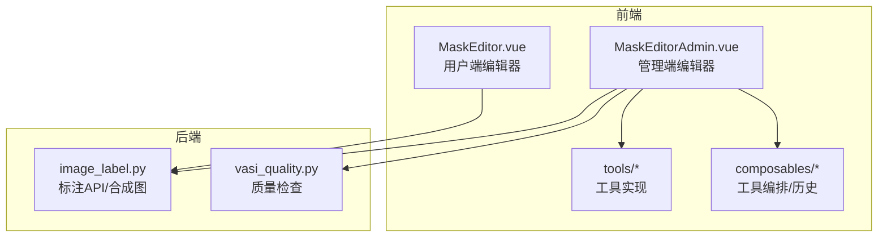
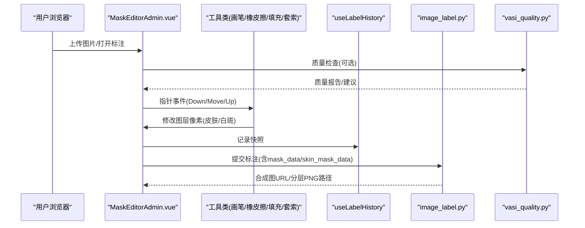
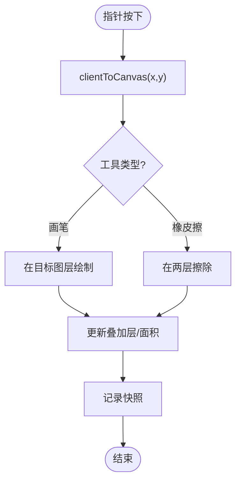
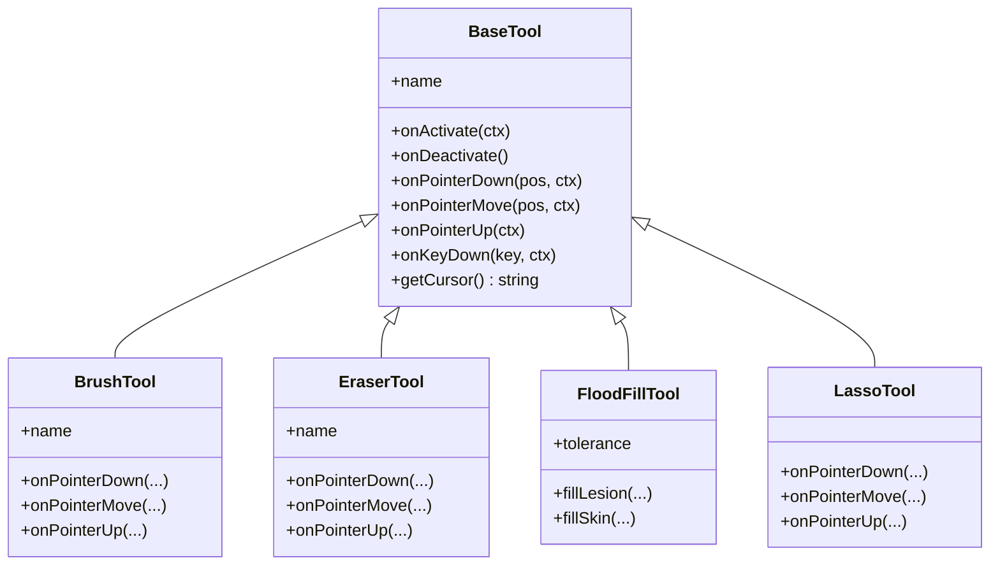
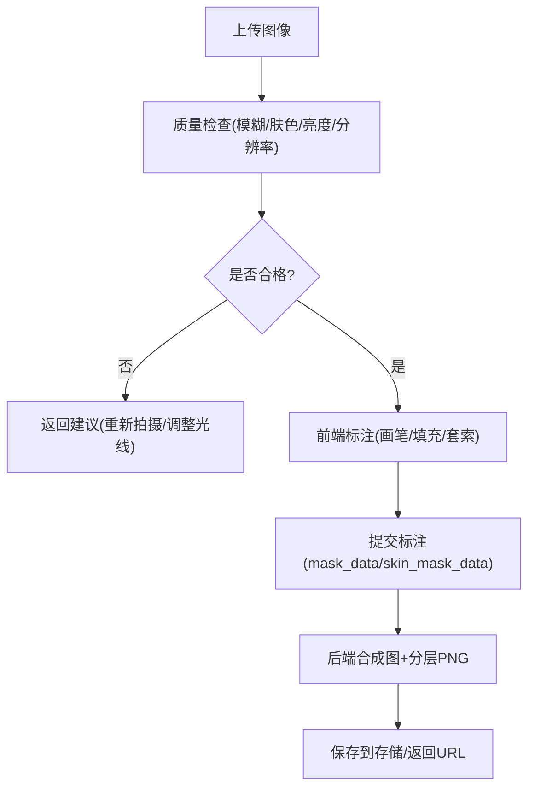
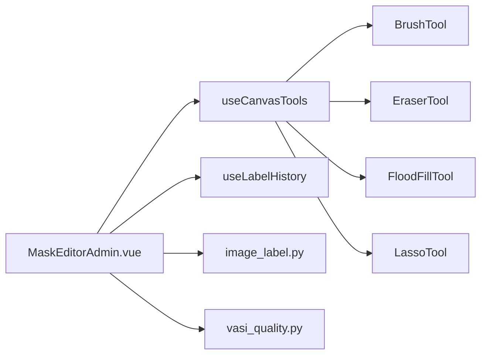

# 图像处理系统

<cite>
**本文引用的文件**
- [MaskEditor.vue](file://web/app/src/components/tracker/MaskEditor.vue)
- [MaskEditorAdmin.vue](file://web/admin/src/components/labeling/MaskEditorAdmin.vue)
- [BaseTool.ts](file://web/admin/src/components/labeling/tools/BaseTool.ts)
- [BrushTool.ts](file://web/admin/src/components/labeling/tools/BrushTool.ts)
- [EraserTool.ts](file://web/admin/src/components/labeling/tools/EraserTool.ts)
- [FloodFillTool.ts](file://web/admin/src/components/labeling/tools/FloodFillTool.ts)
- [LassoTool.ts](file://web/admin/src/components/labeling/tools/LassoTool.ts)
- [useCanvasTools.ts](file://web/admin/src/composables/useCanvasTools.ts)
- [useLabelHistory.ts](file://web/admin/src/composables/useLabelHistory.ts)
- [image_label.py](file://web/backend/api/image_label.py)
- [vasi_quality.py](file://web/backend/services/vasi_quality.py)
</cite>

## 目录
1. [简介](#简介)
2. [项目结构](#项目结构)
3. [核心组件](#核心组件)
4. [架构总览](#架构总览)
5. [详细组件分析](#详细组件分析)
6. [依赖关系分析](#依赖关系分析)
7. [性能考量](#性能考量)
8. [故障排查指南](#故障排查指南)
9. [结论](#结论)
10. [附录：API与使用示例](#附录api与使用示例)

## 简介
本文件系统性地梳理了前端 MaskEditor（用户端与管理端）的 Canvas 图像编辑能力，涵盖画笔、橡皮擦、填充、套索等工具的算法实现；并说明图像上传后的质量检查、格式转换与压缩优化流程。文档还覆盖坐标系统转换、像素级操作、图层管理与性能优化策略，并提供后端标注合成与存储的 API 接口与使用要点。

## 项目结构
- 前端（用户端）
  - 基于 Vue 的 MaskEditor 组件，提供双图层（皮肤层/白斑层）叠加绘制、缩放平移、动画轮廓描边、撤销重做与面积统计。
- 前端（管理端）
  - 工具化架构：BaseTool 定义统一接口，具体工具类（画笔、橡皮擦、填充、套索、多边形）各自封装交互与像素处理逻辑；通过 useCanvasTools 管理激活工具与事件分发；useLabelHistory 维护快照历史。
- 后端
  - 图片标注 API：接收前端标注数据（含 mask_data/skin_mask_data），生成带标注的合成图与分层 PNG，持久化到存储并返回 URL。
  - 图像质量检查服务：基于 OpenCV/Numpy 评估模糊度、肤色占比、亮度与分辨率，输出中文建议。

图表来源
- [MaskEditor.vue:1-120](file://web/app/src/components/tracker/MaskEditor.vue#L1-L120)
- [MaskEditorAdmin.vue:1-120](file://web/admin/src/components/labeling/MaskEditorAdmin.vue#L1-L120)
- [BaseTool.ts:1-72](file://web/admin/src/components/labeling/tools/BaseTool.ts#L1-L72)
- [image_label.py:372-520](file://web/backend/api/image_label.py#L372-L520)
- [vasi_quality.py:81-285](file://web/backend/services/vasi_quality.py#L81-L285)

章节来源
- [MaskEditor.vue:1-120](file://web/app/src/components/tracker/MaskEditor.vue#L1-L120)
- [MaskEditorAdmin.vue:1-120](file://web/admin/src/components/labeling/MaskEditorAdmin.vue#L1-L120)

## 核心组件
- 用户端 MaskEditor
  - 双图层（皮肤/白斑）+ 叠加层渲染，支持缩放/平移、指针事件、动画轮廓描边、撤销重做、面积统计。
  - 工作分辨率上限控制，避免超大图导致内存/CPU压力。
- 管理端 MaskEditorAdmin
  - 工具化架构：BaseTool 统一接口；BrushTool/EraserTool/FloodFillTool/LassoTool 等具体实现；useCanvasTools 负责工具切换与上下文注入；useLabelHistory 提供快照历史。
  - 坐标转换 clientToImage，将屏幕坐标映射到自然图像坐标，供工具进行像素级操作。
- 后端 image_label
  - 接收标注数据，生成合成图与分层 PNG，保存元数据 JSON，返回可访问 URL。
- 后端 vasi_quality
  - 质量检查：模糊度（拉普拉斯方差）、肤色占比（HSV/YCrCb）、亮度均值、分辨率阈值，输出整体评级与建议。

章节来源
- [MaskEditor.vue:58-120](file://web/app/src/components/tracker/MaskEditor.vue#L58-L120)
- [MaskEditorAdmin.vue:90-120](file://web/admin/src/components/labeling/MaskEditorAdmin.vue#L90-L120)
- [BaseTool.ts:9-72](file://web/admin/src/components/labeling/tools/BaseTool.ts#L9-L72)
- [image_label.py:372-520](file://web/backend/api/image_label.py#L372-L520)
- [vasi_quality.py:81-285](file://web/backend/services/vasi_quality.py#L81-L285)

## 架构总览

图表来源
- [MaskEditorAdmin.vue:181-220](file://web/admin/src/components/labeling/MaskEditorAdmin.vue#L181-L220)
- [useLabelHistory.ts:24-71](file://web/admin/src/composables/useLabelHistory.ts#L24-L71)
- [image_label.py:592-756](file://web/backend/api/image_label.py#L592-L756)
- [vasi_quality.py:188-271](file://web/backend/services/vasi_quality.py#L188-L271)

## 详细组件分析

### 用户端 MaskEditor（Canvas 编辑与性能优化）
- 图层与渲染
  - 三个 Canvas：skinCanvas、lesionCanvas、overlayCanvas。overlay 仅用于合成显示，避免频繁 getImageData。
  - 使用 willReadFrequently 优化读多写少的场景；overlay 不启用该选项以利用 GPU 加速合成。
- 坐标系统
  - clientToCanvas 将鼠标/触摸坐标转换为 Canvas 内部坐标，考虑容器尺寸与缩放。
- 绘制与擦除
  - paintAt 使用 lineCap/lineJoin 圆头笔触，结合 arc 填充圆形区域；通过 globalCompositeOperation 切换“源覆盖”或“目标透明”实现擦除。
- 动画轮廓
  - extractEdgePixels 扫描掩码边缘点；rebuildContourBuffers 预渲染两阶段点阵缓存；renderContourOutlines 在动画帧中移动偏移实现“蚂蚁线”效果。
- 历史与撤销重做
  - shallowRef 存储 ImageData 快照数组，限制最大长度；applySnapshot 用 putImageData 恢复。
- 性能策略
  - 工作分辨率上限 MAX_CANVAS_DIM=1024，降低内存与 CPU 开销。
  - 分步执行 heavy 任务（snapshot、drawOverlay、startAnimation、updateAreas）避免阻塞主线程。
  - 动画帧率降至约 12fps，减少 CPU 占用；标签页隐藏时暂停动画。

图表来源
- [MaskEditor.vue:165-182](file://web/app/src/components/tracker/MaskEditor.vue#L165-L182)
- [MaskEditor.vue:361-467](file://web/app/src/components/tracker/MaskEditor.vue#L361-L467)
- [MaskEditor.vue:567-616](file://web/app/src/components/tracker/MaskEditor.vue#L567-L616)

章节来源
- [MaskEditor.vue:58-120](file://web/app/src/components/tracker/MaskEditor.vue#L58-L120)
- [MaskEditor.vue:133-182](file://web/app/src/components/tracker/MaskEditor.vue#L133-L182)
- [MaskEditor.vue:323-507](file://web/app/src/components/tracker/MaskEditor.vue#L323-L507)
- [MaskEditor.vue:523-616](file://web/app/src/components/tracker/MaskEditor.vue#L523-L616)

### 管理端工具系统（BaseTool 与具体工具）
- BaseTool 接口
  - 定义 onActivate/onDeactivate、onPointerDown/Move/Up、onKeyDown、getCursor 等生命周期与方法；ToolContext 暴露画布、自然尺寸、变换、坐标转换、快照与面积更新。
- BrushTool（皮肤/白斑画笔）
  - 自由手绘，支持可变笔刷大小；在同一位置绘制目标层的同时，反向擦除另一层以避免重叠计数。
- EraserTool（橡皮擦）
  - 同时在皮肤层与白斑层擦除，保持图层一致性。
- FloodFillTool（智能填充）
  - 从原始图像采样种子颜色，采用 4-连通域填充，容差可调；填充后在相反层擦除对应区域；内置迭代上限保护。
- LassoTool（套索选择）
  - 拖拽绘制自由路径，释放自动闭合；使用扫描线算法填充多边形内部；支持 Shift 切换填充为皮肤。

图表来源
- [BaseTool.ts:9-72](file://web/admin/src/components/labeling/tools/BaseTool.ts#L9-L72)
- [BrushTool.ts:45-122](file://web/admin/src/components/labeling/tools/BrushTool.ts#L45-L122)
- [EraserTool.ts:42-92](file://web/admin/src/components/labeling/tools/EraserTool.ts#L42-L92)
- [FloodFillTool.ts:22-265](file://web/admin/src/components/labeling/tools/FloodFillTool.ts#L22-L265)
- [LassoTool.ts:17-180](file://web/admin/src/components/labeling/tools/LassoTool.ts#L17-L180)

章节来源
- [BaseTool.ts:9-72](file://web/admin/src/components/labeling/tools/BaseTool.ts#L9-L72)
- [BrushTool.ts:19-122](file://web/admin/src/components/labeling/tools/BrushTool.ts#L19-L122)
- [EraserTool.ts:16-92](file://web/admin/src/components/labeling/tools/EraserTool.ts#L16-L92)
- [FloodFillTool.ts:38-265](file://web/admin/src/components/labeling/tools/FloodFillTool.ts#L38-L265)
- [LassoTool.ts:72-180](file://web/admin/src/components/labeling/tools/LassoTool.ts#L72-L180)

### 坐标系统与像素级操作
- 坐标转换
  - 管理端 clientToImage 将客户端坐标除以 baseFitScale*transform.scale 得到自然图像坐标，确保工具在真实像素上操作。
- 像素级操作
  - 工具直接对 skinCanvas/lesionCanvas 的 ImageData 进行读写（如 FloodFill 设置 alpha，Lasso 扫描线填充）。
  - 使用 willReadFrequently 上下文优化读取密集型操作。

章节来源
- [MaskEditorAdmin.vue:90-108](file://web/admin/src/components/labeling/MaskEditorAdmin.vue#L90-L108)
- [FloodFillTool.ts:117-182](file://web/admin/src/components/labeling/tools/FloodFillTool.ts#L117-L182)
- [LassoTool.ts:99-166](file://web/admin/src/components/labeling/tools/LassoTool.ts#L99-L166)

### 图层管理与历史
- 图层
  - 皮肤层与白斑层分离，叠加层仅用于显示；工具在需要时同时修改两层以保持互斥。
- 历史
  - useLabelHistory 维护固定长度的快照环，支持撤销/重做；应用快照时使用 putImageData 快速恢复。

章节来源
- [useLabelHistory.ts:17-87](file://web/admin/src/composables/useLabelHistory.ts#L17-L87)
- [MaskEditorAdmin.vue:157-162](file://web/admin/src/components/labeling/MaskEditorAdmin.vue#L157-L162)

### 图像上传处理、质量检查、格式转换与压缩优化
- 质量检查（后端）
  - 模糊度：拉普拉斯方差；肤色占比：HSV+YCrCb 双空间匹配；亮度：灰度均值；分辨率：最小宽高阈值。
  - 输出整体评级与中文建议，便于前端提示用户重拍。
- 格式转换与合成
  - 后端将 mask_data/skin_mask_data（data URL）解码为 PIL Image，必要时转为 RGBA，按原图尺寸缩放对齐，逐层保存 PNG，并合成 JPEG 预览图。
- 压缩优化
  - 合成图保存为 JPEG quality=85~92；分层 PNG 保留透明度用于训练数据。

图表来源
- [vasi_quality.py:188-271](file://web/backend/services/vasi_quality.py#L188-L271)
- [image_label.py:372-520](file://web/backend/api/image_label.py#L372-L520)

章节来源
- [vasi_quality.py:81-285](file://web/backend/services/vasi_quality.py#L81-L285)
- [image_label.py:372-520](file://web/backend/api/image_label.py#L372-L520)

## 依赖关系分析
- 管理端工具编排
  - useCanvasTools 集中注册工具实例，提供 setTool/setContext/快捷键处理；MaskEditorAdmin 通过构建 ToolContext 并委托事件给 activeTool。
- 工具与宿主
  - 各工具依赖 ToolContext 提供的画布、自然尺寸、坐标转换、快照与面积更新方法；工具之间无直接耦合，松耦合设计便于扩展。
- 前后端数据流
  - 前端提交 annotations（包含 mask_data/skin_mask_data），后端解析并生成可视化产物；质量检查作为前置步骤提升标注效率。

图表来源
- [useCanvasTools.ts:16-127](file://web/admin/src/composables/useCanvasTools.ts#L16-L127)
- [MaskEditorAdmin.vue:164-220](file://web/admin/src/components/labeling/MaskEditorAdmin.vue#L164-L220)
- [image_label.py:592-756](file://web/backend/api/image_label.py#L592-L756)
- [vasi_quality.py:188-271](file://web/backend/services/vasi_quality.py#L188-L271)

章节来源
- [useCanvasTools.ts:16-127](file://web/admin/src/composables/useCanvasTools.ts#L16-L127)
- [MaskEditorAdmin.vue:164-220](file://web/admin/src/components/labeling/MaskEditorAdmin.vue#L164-L220)

## 性能考量
- 前端
  - 工作分辨率上限（MAX_CANVAS_DIM）显著降低内存与 CPU 消耗；动画帧率控制在约 12fps；标签页隐藏时暂停动画；使用 offscreen canvas 预渲染轮廓点阵以减少每帧 draw 调用。
  - 将重型任务拆分到多个 requestAnimationFrame/requestIdleCallback，避免阻塞主线程。
- 后端
  - 质量检查仅在可用时运行（OpenCV/Numpy 懒加载）；合成图使用 JPEG 压缩平衡画质与体积；分层 PNG 保留透明度用于训练。

[本节为通用性能指导，无需特定文件引用]

## 故障排查指南
- 图片加载失败
  - 检查网络与资源路径；用户端与管理员端均提供错误状态与重试机制。
- 标注未生效
  - 确认 ToolContext 已正确注入；检查 clientToImage 返回值是否为空；确认画布尺寸与自然尺寸一致。
- 填充异常
  - 调整 FloodFillTool 的容差；检查种子像素是否在有效范围内；注意迭代上限保护。
- 合成图生成失败
  - 确认 mask_data/skin_mask_data 为有效的 data URL；检查后端 Pillow 可用性；查看日志定位错误。

章节来源
- [MaskEditor.vue:717-722](file://web/app/src/components/tracker/MaskEditor.vue#L717-L722)
- [MaskEditorAdmin.vue:354-357](file://web/admin/src/components/labeling/MaskEditorAdmin.vue#L354-L357)
- [FloodFillTool.ts:176-182](file://web/admin/src/components/labeling/tools/FloodFillTool.ts#L176-L182)
- [image_label.py:706-731](file://web/backend/api/image_label.py#L706-L731)

## 结论
本系统通过前后端协同实现了高效的图像标注与处理能力：前端以工具化架构提供灵活的 Canvas 编辑能力，配合性能优化策略保障大图的流畅交互；后端提供质量检查与标注合成，形成完整的标注闭环。该方案可扩展更多工具与算法，满足多样化标注需求。

[本节为总结性内容，无需特定文件引用]

## 附录：API与使用示例

### 后端标注 API（image_label.py）
- 提交最终标注
  - 路径：POST /admin/image-labels/{label_id}/label
  - 请求体关键字段：
    - annotations：细粒度标注列表，每项包含 source、region_index、body_site、is_vitiligo、vitiligo_type、vitiligo_stage、area_percentage、depigmentation_level、region_contour、region_bbox、mask_data、skin_mask_data、confidence、notes、tool_used、edit_duration_ms
    - annotated_image：前端合成的标注预览图 PNG data URL（可选）
    - draft_mode：是否保存草稿（默认 false）
  - 响应：status、label_id、changes、draft、label_status
- 获取标注详情
  - 路径：GET /admin/image-labels/{label_id}
  - 返回字段包括 AI/用户/管理员三级标注信息、标注状态、训练资格、标注图路径与 URL 等。
- 获取标注合成图
  - 路径：GET /admin/image-labels/{label_id}/annotated-image
  - 优先返回已保存的合成图，不存在则实时生成；支持认证头或查询参数鉴权。

章节来源
- [image_label.py:45-176](file://web/backend/api/image_label.py#L45-L176)
- [image_label.py:359-369](file://web/backend/api/image_label.py#L359-L369)
- [image_label.py:592-756](file://web/backend/api/image_label.py#L592-L756)
- [image_label.py:759-800](file://web/backend/api/image_label.py#L759-L800)

### 质量检查 API（vasi_quality.py）
- 质量检查入口
  - 类：VasiQualityChecker
  - 方法：check_all(image_bytes) -> QualityReport
  - 字段：overall、blur_score、blur_ok、skin_ratio、skin_ok、brightness_mean、lighting_ok、resolution、size_ok、suggestions
- 使用示例（概念）
  - 上传图像字节 -> 调用 check_all -> 根据 overall 与 suggestions 提示用户 -> 通过后进入标注流程。

章节来源
- [vasi_quality.py:81-285](file://web/backend/services/vasi_quality.py#L81-L285)

### 前端使用要点（MaskEditorAdmin）
- 初始化
  - 传入 imageUrl、editable、initialSkinLayerUrl、initialLesionUrl；监听 onImgLoad 完成初始化。
- 工具切换
  - 通过 useCanvasTools.setTool 切换工具；支持键盘快捷键（数字键/字母键）。
- 坐标转换
  - 使用 clientToImage 将屏幕坐标转换为自然图像坐标，供工具进行像素级操作。
- 提交标注
  - 收集 annotations（mask_data/skin_mask_data），调用后端 API 保存；可选择附带 annotated_image 预览图。

章节来源
- [MaskEditorAdmin.vue:8-18](file://web/admin/src/components/labeling/MaskEditorAdmin.vue#L8-L18)
- [MaskEditorAdmin.vue:164-220](file://web/admin/src/components/labeling/MaskEditorAdmin.vue#L164-L220)
- [MaskEditorAdmin.vue:419-445](file://web/admin/src/components/labeling/MaskEditorAdmin.vue#L419-L445)