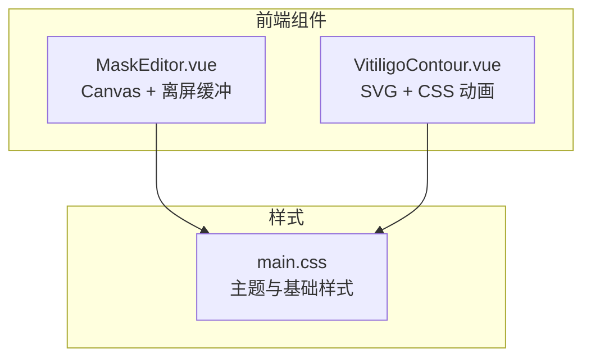
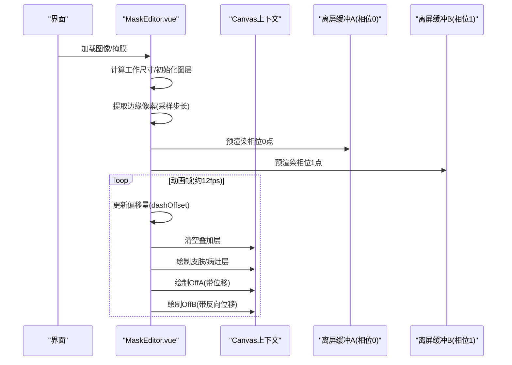
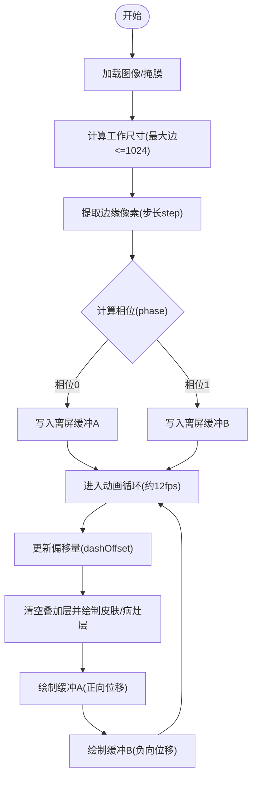
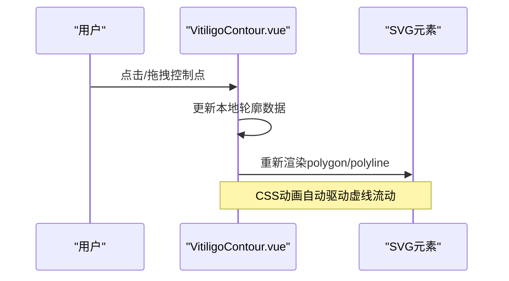
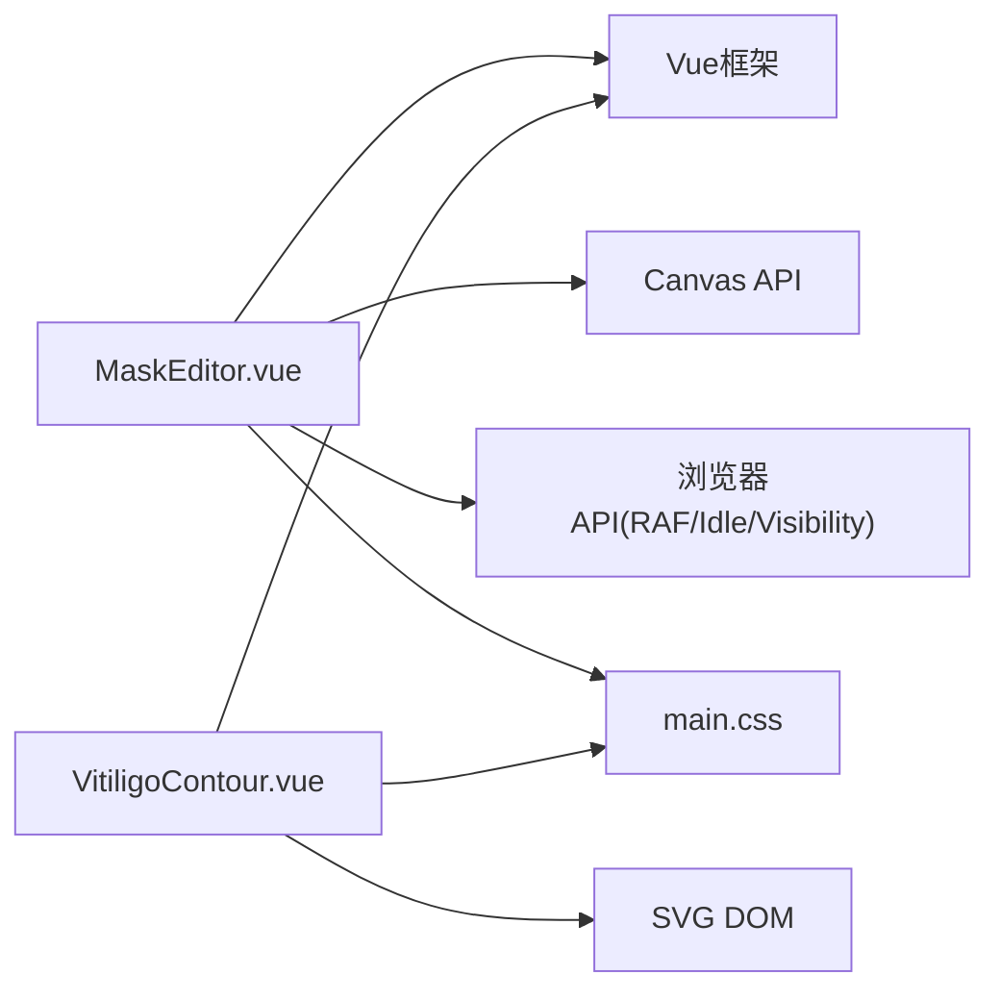

# 轮廓动画系统

<cite>
**本文引用的文件**
- [MaskEditor.vue](file://web/app/src/components/tracker/MaskEditor.vue)
- [VitiligoContour.vue](file://web/app/src/components/tracker/VitiligoContour.vue)
- [main.css](file://web/app/src/styles/main.css)
</cite>

## 目录
1. [简介](#简介)
2. [项目结构](#项目结构)
3. [核心组件](#核心组件)
4. [架构总览](#架构总览)
5. [详细组件分析](#详细组件分析)
6. [依赖关系分析](#依赖关系分析)
7. [性能考量](#性能考量)
8. [故障排查指南](#故障排查指南)
9. [结论](#结论)
10. [附录：配置与扩展](#附录：配置与扩展)

## 简介
本系统实现“蚂蚁线”（marching ants）轮廓动画，用于在皮肤/病灶掩膜上以动态虚线高亮边界。其核心包括：
- 边缘像素提取算法：从掩膜图像中快速定位边界点集。
- 离屏缓冲区预渲染技术：将大量静态点预渲染到两个离屏画布（相位A/B），动画帧仅做位移合成，避免每帧绘制数万个矩形。
- 帧率优化策略：目标约12fps的动画循环、隐藏标签页时暂停、按需重建缓冲、上下文缓存等。
- 轮廓边界检测、相位计算与动画循环控制：通过步长和占空比计算相位，结合偏移量实现连续流动效果。
- 性能优化技巧：减少重绘次数、使用 requestAnimationFrame、内存管理与异步分片。
- 动画配置参数与自定义效果开发指南：可调节步长、点大小、占空比、透明度、颜色、速度等。

## 项目结构
与轮廓动画直接相关的代码集中在前端可视化组件中：
- MaskEditor.vue：基于 Canvas 的高性能 marching ants 实现，包含边缘提取、离屏缓冲、动画循环。
- VitiligoContour.vue：基于 SVG 的轮廓编辑与展示，使用 CSS 动画实现虚线流动。
- main.css：全局样式与主题变量（不直接参与动画逻辑）。

图表来源
- [MaskEditor.vue:341-507](file://web/app/src/components/tracker/MaskEditor.vue#L341-L507)
- [VitiligoContour.vue:275-339](file://web/app/src/components/tracker/VitiligoContour.vue#L275-L339)
- [main.css:1-35](file://web/app/src/styles/main.css#L1-L35)

章节来源
- [MaskEditor.vue:341-507](file://web/app/src/components/tracker/MaskEditor.vue#L341-L507)
- [VitiligoContour.vue:275-339](file://web/app/src/components/tracker/VitiligoContour.vue#L275-L339)
- [main.css:1-35](file://web/app/src/styles/main.css#L1-L35)

## 核心组件
- MaskEditor.vue
  - 负责高性能的 marching ants 动画：边缘像素提取、离屏缓冲构建、动画循环控制。
  - 关键能力：工作分辨率上限、叠加层上下文缓存、按阶段绘制、帧间隔节流、可见性监听暂停。
- VitiligoContour.vue
  - 提供 SVG 轮廓编辑与展示，使用 CSS 动画驱动虚线流动，适合轻量交互场景。
- main.css
  - 定义主题色与基础样式，为组件提供一致的视觉风格。

章节来源
- [MaskEditor.vue:118-131](file://web/app/src/components/tracker/MaskEditor.vue#L118-L131)
- [MaskEditor.vue:341-507](file://web/app/src/components/tracker/MaskEditor.vue#L341-L507)
- [VitiligoContour.vue:275-339](file://web/app/src/components/tracker/VitiligoContour.vue#L275-L339)
- [main.css:1-35](file://web/app/src/styles/main.css#L1-L35)

## 架构总览
整体流程分为三个阶段：
- 数据准备：加载图像与掩膜，计算工作尺寸，建立皮肤/病灶两层 Canvas。
- 边缘提取与缓冲构建：扫描掩膜像素，提取边界点；将点集预渲染至两个离屏画布（相位A/B）。
- 动画循环：按帧更新偏移量，合成两阶段缓冲并绘制到叠加层，形成流动虚线效果。

图表来源
- [MaskEditor.vue:361-439](file://web/app/src/components/tracker/MaskEditor.vue#L361-L439)
- [MaskEditor.vue:446-499](file://web/app/src/components/tracker/MaskEditor.vue#L446-L499)

## 详细组件分析

### MaskEditor.vue：高性能 marching ants 实现
- 边缘像素提取算法
  - 对掩膜进行逐行/列采样（步长 step），判断当前像素是否处于边界（相邻上下左右存在透明差异），收集边界坐标集合。
  - 复杂度：O(W*H/step^2)，通过增大 step 降低采样密度，平衡精度与性能。
- 离屏缓冲区预渲染
  - 根据边界点集与占空比（dashLen）计算每个点所属相位（phase = floor((x+y)/(step*dashLen)) % 2），分别绘制到两个离屏画布。
  - 动画帧仅执行 drawImage，避免每帧数千上万次 fillRect。
- 相位计算与动画循环
  - 使用 dashOffset 递增并取模，计算位移 shift = (offset * step * 0.5) % (step * 6)。
  - 相位A以正向位移绘制，相位B以负向位移绘制，配合不同透明度产生流动虚线。
  - 动画循环目标约12fps，使用 requestAnimationFrame 并节流绘制间隔，隐藏标签页时暂停。
- 上下文与内存管理
  - 叠加层使用无 willReadFrequently 的上下文以提升 GPU 合成性能。
  - 工作分辨率限制（MAX_CANVAS_DIM=1024）降低内存占用与像素遍历成本。
  - 历史快照使用 shallowRef，避免深度代理开销；批量操作拆分到多个帧，避免阻塞主线程。

图表来源
- [MaskEditor.vue:361-439](file://web/app/src/components/tracker/MaskEditor.vue#L361-L439)
- [MaskEditor.vue:446-499](file://web/app/src/components/tracker/MaskEditor.vue#L446-L499)

章节来源
- [MaskEditor.vue:361-439](file://web/app/src/components/tracker/MaskEditor.vue#L361-L439)
- [MaskEditor.vue:446-499](file://web/app/src/components/tracker/MaskEditor.vue#L446-L499)
- [MaskEditor.vue:58-64](file://web/app/src/components/tracker/MaskEditor.vue#L58-L64)
- [MaskEditor.vue:118-131](file://web/app/src/components/tracker/MaskEditor.vue#L118-L131)

### VitiligoContour.vue：SVG 轮廓与 CSS 动画
- 使用 SVG polygon/polyline 绘制轮廓，并通过 stroke-dasharray 与 CSS 动画实现虚线流动。
- 支持选择、拖拽控制点、新增/删除点、整体移动轮廓等交互。
- 适用于轻量级标注与展示，无需复杂像素处理。

图表来源
- [VitiligoContour.vue:275-339](file://web/app/src/components/tracker/VitiligoContour.vue#L275-L339)
- [VitiligoContour.vue:392-399](file://web/app/src/components/tracker/VitiligoContour.vue#L392-L399)

章节来源
- [VitiligoContour.vue:275-339](file://web/app/src/components/tracker/VitiligoContour.vue#L275-L339)
- [VitiligoContour.vue:392-399](file://web/app/src/components/tracker/VitiligoContour.vue#L392-L399)

## 依赖关系分析
- MaskEditor.vue 依赖：
  - Vue 响应式与生命周期（ref、watch、onMounted、onBeforeUnmount）。
  - Canvas API（getContext、getImageData、drawImage、clearRect）。
  - 浏览器 API（requestAnimationFrame、requestIdleCallback、Visibility API）。
- VitiligoContour.vue 依赖：
  - Vue 响应式与事件处理。
  - SVG DOM 操作与 CSS 动画。
- 样式依赖：
  - main.css 提供主题变量与基础样式，确保视觉一致性。

图表来源
- [MaskEditor.vue:1-3](file://web/app/src/components/tracker/MaskEditor.vue#L1-L3)
- [VitiligoContour.vue:1-3](file://web/app/src/components/tracker/VitiligoContour.vue#L1-L3)
- [main.css:1-35](file://web/app/src/styles/main.css#L1-L35)

章节来源
- [MaskEditor.vue:1-3](file://web/app/src/components/tracker/MaskEditor.vue#L1-L3)
- [VitiligoContour.vue:1-3](file://web/app/src/components/tracker/VitiligoContour.vue#L1-L3)
- [main.css:1-35](file://web/app/src/styles/main.css#L1-L35)

## 性能考量
- 边缘采样步长（step）：增大步长显著降低像素遍历与点集规模，提升性能。
- 离屏缓冲复用：仅在边缘变化或画布尺寸变化时重建缓冲，避免重复计算。
- 动画帧节流：目标约12fps，减少CPU占用；隐藏标签页时暂停动画。
- 上下文优化：叠加层使用无 willReadFrequently 的上下文，启用GPU合成加速。
- 工作分辨率限制：最大边1024px，大幅降低内存与计算压力。
- 异步分片：将耗时操作拆分为多帧执行，避免阻塞主线程。
- 面积计算延迟：使用防抖与空闲回调，降低频繁交互时的开销。

[本节为通用性能指导，不直接分析具体文件]

## 故障排查指南
- 动画卡顿或掉帧
  - 检查是否未设置合适的步长（step）导致点集过大。
  - 确认是否在高频操作中频繁重建离屏缓冲。
  - 验证动画循环是否被意外多次启动（防止重复RAF）。
- 内存泄漏或占用过高
  - 确认工作分辨率上限已生效（MAX_CANVAS_DIM）。
  - 检查历史快照数组长度限制，避免无限增长。
  - 确保在组件卸载时取消RAF并清理资源。
- 动画不显示或闪烁
  - 检查叠加层上下文是否正确获取与缓存。
  - 确认离屏缓冲尺寸与画布一致，且已正确清空。
  - 验证相位计算与位移公式是否匹配当前步长与占空比。

章节来源
- [MaskEditor.vue:341-507](file://web/app/src/components/tracker/MaskEditor.vue#L341-L507)
- [MaskEditor.vue:58-64](file://web/app/src/components/tracker/MaskEditor.vue#L58-L64)
- [MaskEditor.vue:118-131](file://web/app/src/components/tracker/MaskEditor.vue#L118-L131)

## 结论
本系统通过边缘像素提取与离屏缓冲预渲染，实现了高效的 marching ants 轮廓动画。MaskEditor.vue 在高负载场景下保持流畅体验，VitiligoContour.vue 提供轻量级的SVG方案。通过合理的帧率控制、上下文优化与内存管理，系统在性能与视觉效果之间取得良好平衡。

[本节为总结性内容，不直接分析具体文件]

## 附录：配置与扩展
- 可调参数
  - 步长（step）：影响边缘采样密度与点集规模。
  - 点大小（dotSize）：控制轮廓点的视觉粗细。
  - 占空比（dashLen）：决定虚线段长度与间隙比例。
  - 透明度（globalAlpha）：控制相位A/B的可见度与混合效果。
  - 颜色（fillStyle）：自定义轮廓颜色。
  - 动画速度（FRAME_INTERVAL/dashOffset步进）：调整流动速率。
  - 工作分辨率上限（MAX_CANVAS_DIM）：平衡质量与性能。
- 自定义效果建议
  - 增加相位数量：将两相扩展为多相，实现更复杂的流动纹理。
  - 动态步长：根据缩放级别动态调整 step，保持细节与性能。
  - 混合模式：尝试不同的 globalCompositeOperation，增强视觉层次。
  - 交互反馈：在选中区域或关键点处增强动画强度或改变颜色。

[本节为概念性扩展建议，不直接分析具体文件]