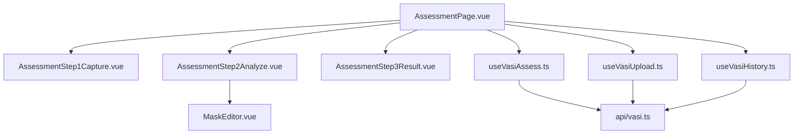
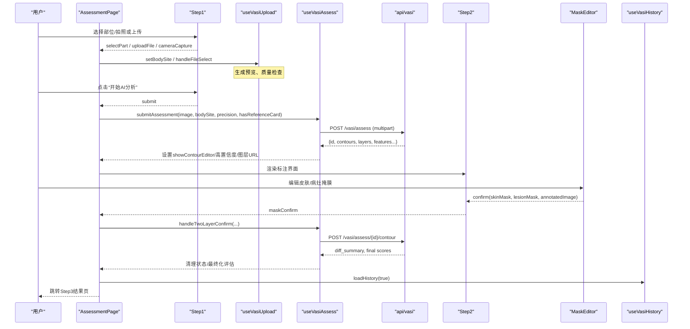
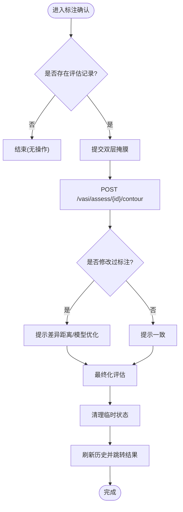
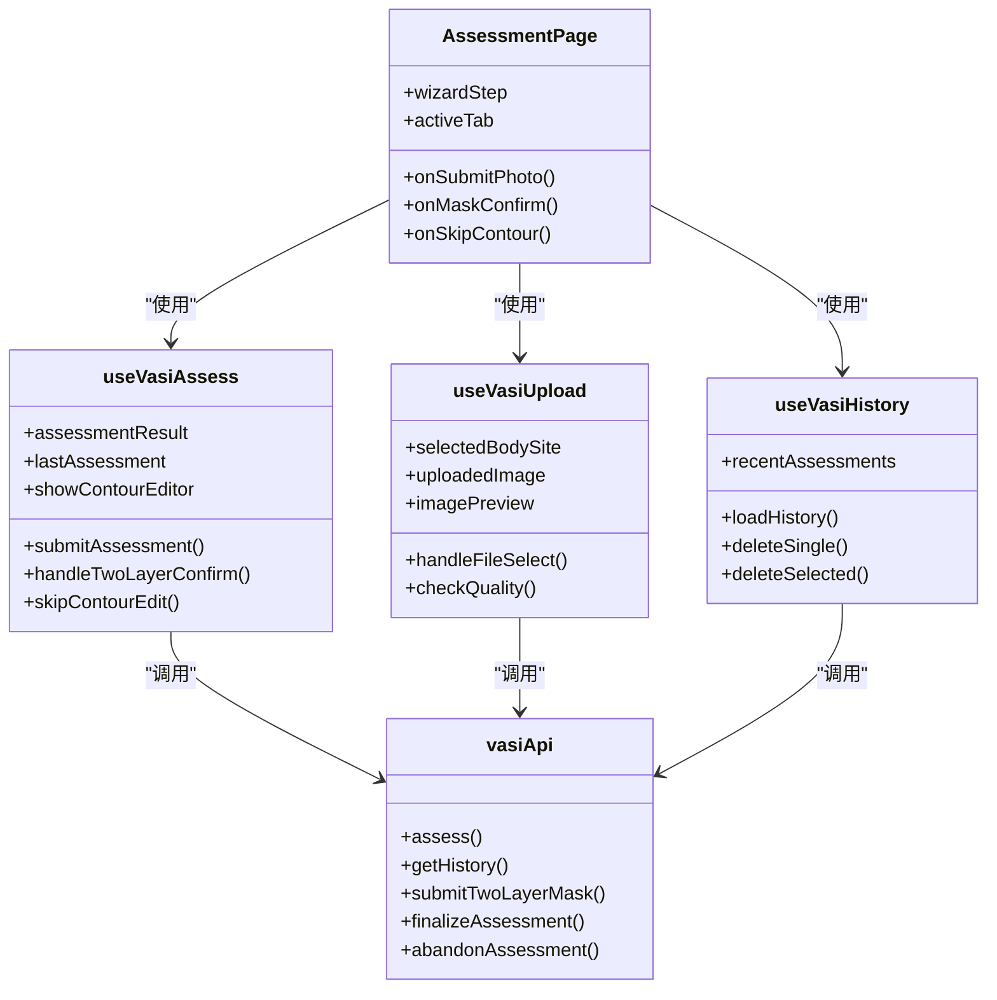

# 评估工作流

<cite>
**本文引用的文件**
- [AssessmentPage.vue](file://web/app/src/views/AssessmentPage.vue)
- [useVasiAssessment.ts](file://web/app/src/composables/useVasiAssessment.ts)
- [useVasiAssess.ts](file://web/app/src/composables/useVasiAssess.ts)
- [useVasiUpload.ts](file://web/app/src/composables/useVasiUpload.ts)
- [useVasiHistory.ts](file://web/app/src/composables/useVasiHistory.ts)
- [vasi.ts](file://web/app/src/api/vasi.ts)
- [AssessmentStep1Capture.vue](file://web/app/src/components/tracker/AssessmentStep1Capture.vue)
- [AssessmentStep2Analyze.vue](file://web/app/src/components/tracker/AssessmentStep2Analyze.vue)
- [AssessmentStep3Result.vue](file://web/app/src/components/tracker/AssessmentStep3Result.vue)
- [MaskEditor.vue](file://web/app/src/components/tracker/MaskEditor.vue)
</cite>

## 目录
1. [简介](#简介)
2. [项目结构](#项目结构)
3. [核心组件](#核心组件)
4. [架构总览](#架构总览)
5. [详细组件分析](#详细组件分析)
6. [依赖关系分析](#依赖关系分析)
7. [性能考量](#性能考量)
8. [故障排查指南](#故障排查指南)
9. [结论](#结论)
10. [附录](#附录)

## 简介
本文件面向 VASI（白癜风面积评分指数）评估工作流的完整实现，覆盖三步流程：拍照评估、AI分析+画布标注、结果展示。重点说明 AssessmentPage 的状态管理、步骤切换逻辑、数据流转与错误处理机制；并补充用户界面交互、进度指示器、响应式设计与移动端适配要点，提供从用户操作到技术实现的端到端说明。

## 项目结构
评估工作流由页面级视图、可复用组合式函数（composables）、业务 API 封装以及三个分步组件构成。整体采用“视图编排 + 状态拆分”的架构：页面负责步骤导航与 UI 组装，composables 负责上传、评估、历史等独立职责，API 层统一封装后端接口。

图表来源
- [AssessmentPage.vue:1-531](file://web/app/src/views/AssessmentPage.vue#L1-L531)
- [AssessmentStep1Capture.vue:1-150](file://web/app/src/components/tracker/AssessmentStep1Capture.vue#L1-L150)
- [AssessmentStep2Analyze.vue:1-119](file://web/app/src/components/tracker/AssessmentStep2Analyze.vue#L1-L119)
- [AssessmentStep3Result.vue:1-119](file://web/app/src/components/tracker/AssessmentStep3Result.vue#L1-L119)
- [useVasiUpload.ts:1-111](file://web/app/src/composables/useVasiUpload.ts#L1-L111)
- [useVasiAssess.ts:1-186](file://web/app/src/composables/useVasiAssess.ts#L1-L186)
- [useVasiHistory.ts:1-184](file://web/app/src/composables/useVasiHistory.ts#L1-L184)
- [vasi.ts:1-274](file://web/app/src/api/vasi.ts#L1-L274)
- [MaskEditor.vue:1-800](file://web/app/src/components/tracker/MaskEditor.vue#L1-L800)

章节来源
- [AssessmentPage.vue:1-531](file://web/app/src/views/AssessmentPage.vue#L1-L531)

## 核心组件
- AssessmentPage：三步骤向导容器，负责路由与标签页切换、步骤状态、上传/评估/历史 composable 的组合、错误提示与分享草稿生成。
- useVasiUpload：照片选择、预览、质量检查、部位选择与参考卡标记。
- useVasiAssess：提交评估、AI 分析阶段状态、双层掩膜确认、跳过/取消评估、结果落盘与清理。
- useVasiHistory：历史加载、分页、筛选、选择模式、滑动删除、批量删除与趋势数据。
- 分步组件：
  - Step1：数字人选部位、相机/相册上传、质量反馈、开始 AI 分析按钮。
  - Step2：AI 分析中占位、可视化特征卡片、MaskEditor 标注、确认/跳过/取消。
  - Step3：结果卡片、评分解读、趋势折线、分享与继续测评。

章节来源
- [AssessmentPage.vue:1-531](file://web/app/src/views/AssessmentPage.vue#L1-L531)
- [useVasiUpload.ts:1-111](file://web/app/src/composables/useVasiUpload.ts#L1-L111)
- [useVasiAssess.ts:1-186](file://web/app/src/composables/useVasiAssess.ts#L1-L186)
- [useVasiHistory.ts:1-184](file://web/app/src/composables/useVasiHistory.ts#L1-L184)
- [AssessmentStep1Capture.vue:1-150](file://web/app/src/components/tracker/AssessmentStep1Capture.vue#L1-L150)
- [AssessmentStep2Analyze.vue:1-119](file://web/app/src/components/tracker/AssessmentStep2Analyze.vue#L1-L119)
- [AssessmentStep3Result.vue:1-119](file://web/app/src/components/tracker/AssessmentStep3Result.vue#L1-L119)

## 架构总览
评估工作流以“页面编排 + 组合式状态 + 分步组件”的方式组织，数据自下而上流动：
- 用户交互在 Step1/Step2/Step3 触发
- 通过事件回调回到 AssessmentPage
- 调用对应 composable 执行业务逻辑
- 通过 vasiApi 与后端通信
- 结果回写至 composable 状态，驱动 UI 更新

图表来源
- [AssessmentPage.vue:54-145](file://web/app/src/views/AssessmentPage.vue#L54-L145)
- [useVasiAssess.ts:63-149](file://web/app/src/composables/useVasiAssess.ts#L63-L149)
- [vasi.ts:122-173](file://web/app/src/api/vasi.ts#L122-L173)
- [AssessmentStep2Analyze.vue:35-54](file://web/app/src/components/tracker/AssessmentStep2Analyze.vue#L35-L54)
- [MaskEditor.vue:618-715](file://web/app/src/components/tracker/MaskEditor.vue#L618-L715)
- [useVasiHistory.ts:48-77](file://web/app/src/composables/useVasiHistory.ts#L48-L77)

## 详细组件分析

### AssessmentPage：状态管理与步骤切换
- 状态管理
  - 步骤：wizardStep = 1|2|3，控制渲染哪个分步组件
  - 标签页：activeTab = 'assessment' | 'report'，支持体检报告入口
  - 上传与评估：组合 useVasiUpload、useVasiAssess、useVasiHistory
  - 提交态：isSubmittingPhoto 控制 Step1 按钮禁用与文案
  - 历史面板：showHistory 控制移动端底部弹出
- 步骤切换逻辑
  - Step1 -> Step2：submitAssessment 成功后，若 showContourEditor 为真且存在预览图，则进入标注；否则直接到 Step3
  - Step2 -> Step3：maskConfirm 或 skipContourEdit 成功后，写入 lastAssessment 并跳转到结果页
  - 返回/取消：根据当前步骤执行 cancelAssessment 或 onNewAssessment 清理状态
- 数据流转
  - 图片预览来自 useVasiUpload.imagePreview
  - 评估结果来自 useVasiAssess.assessmentResult/lastAssessment
  - 历史列表来自 useVasiHistory.recentAssessments
- 错误处理
  - 未登录时弹出登录弹窗
  - 未选择部位或未上传图片时给出警告提示
  - 网络异常捕获并显示后端 detail 或通用错误信息
  - 标注确认失败时仍尝试保存 lastAssessment 并推进到结果页，保证用户体验

章节来源
- [AssessmentPage.vue:24-189](file://web/app/src/views/AssessmentPage.vue#L24-L189)
- [AssessmentPage.vue:288-297](file://web/app/src/views/AssessmentPage.vue#L288-L297)
- [AssessmentPage.vue:300-531](file://web/app/src/views/AssessmentPage.vue#L300-L531)

### Step1：拍照评估
- 功能要点
  - 数字人选择身体部位，选中后显示徽章
  - 相机/相册两种上传方式，自动校验类型与大小
  - 上传后立即进行质量检查，非优质照片给出建议
  - 自动滚动到“开始AI分析”按钮，提升首屏可用性
- 交互细节
  - 未选择部位时禁止打开相机/上传
  - 提交按钮在上传/识别/分析阶段显示不同文案与禁用态
  - 支持移除已上传图片

章节来源
- [AssessmentStep1Capture.vue:1-150](file://web/app/src/components/tracker/AssessmentStep1Capture.vue#L1-L150)
- [useVasiUpload.ts:48-85](file://web/app/src/composables/useVasiUpload.ts#L48-L85)

### Step2：AI分析+画布标注
- 功能要点
  - 顶部信息栏显示 VASI 评分、阶段、疑似病灶数量与高置信数量
  - 可视化特征卡片可折叠，默认收起优先展示标注画布
  - MaskEditor 全屏填充剩余空间，支持缩放、平移、双指手势
  - 底部操作区：取消、跳过、确认提交标注
- 交互细节
  - 当 AI 图层加载完成后自动选择病灶画笔，降低用户上手成本
  - 确认时先获取合成标注图（原图+皮肤/病灶图层），再提交双层掩膜
  - 提交中禁用按钮并显示旋转图标

章节来源
- [AssessmentStep2Analyze.vue:1-119](file://web/app/src/components/tracker/AssessmentStep2Analyze.vue#L1-L119)
- [MaskEditor.vue:34-39](file://web/app/src/components/tracker/MaskEditor.vue#L34-L39)
- [MaskEditor.vue:191-321](file://web/app/src/components/tracker/MaskEditor.vue#L191-L321)

### Step3：结果展示
- 功能要点
  - 评分卡片：部位、VASI 评分、等级、占比、阶段、分型
  - 趋势折线：基于最近多次评估分数绘制，颜色随趋势变化
  - 解读卡片：评分含义、阶段说明、低信心度提示
  - 底部操作：分享结果、继续测评
- 交互细节
  - 分享会生成草稿并跳转到社区编辑器，附带评估信息与图片
  - 继续测评会清理当前状态并回到 Step1

章节来源
- [AssessmentStep3Result.vue:1-119](file://web/app/src/components/tracker/AssessmentStep3Result.vue#L1-L119)
- [AssessmentPage.vue:215-252](file://web/app/src/views/AssessmentPage.vue#L215-L252)

### 组合式函数详解
- useVasiUpload
  - 负责部位选择、图片选择/拖拽、预览生成、质量检查、参考卡标记
  - 限制图片类型与大小，避免无效请求
- useVasiAssess
  - 提交评估：上传阶段分为 uploading/segmenting/analyzing
  - 解析后端返回：轮廓、双层掩膜 URL、视觉特征、置信度、精度等级
  - 双层掩膜确认：提交差异摘要、最终分数、最终化评估、清理状态
  - 跳过/取消：快速完成或放弃本次评估
- useVasiHistory
  - 分页加载历史、按部位筛选、选择模式、滑动删除、批量删除
  - 计算 sparkline 数据用于结果页趋势展示

章节来源
- [useVasiUpload.ts:1-111](file://web/app/src/composables/useVasiUpload.ts#L1-L111)
- [useVasiAssess.ts:1-186](file://web/app/src/composables/useVasiAssess.ts#L1-L186)
- [useVasiHistory.ts:1-184](file://web/app/src/composables/useVasiHistory.ts#L1-L184)

### 关键流程图：标注确认

图表来源
- [useVasiAssess.ts:106-149](file://web/app/src/composables/useVasiAssess.ts#L106-L149)
- [vasi.ts:166-173](file://web/app/src/api/vasi.ts#L166-L173)

## 依赖关系分析
- 页面依赖三个 composable，分别承担上传、评估、历史职责，降低耦合度
- composable 统一通过 api/vasi.ts 访问后端，便于集中处理超时、错误与类型定义
- 分步组件仅暴露必要 props 与事件，保持 UI 与业务解耦
- MaskEditor 作为纯工具组件，不感知业务上下文，只负责图像标注与导出

图表来源
- [AssessmentPage.vue:10-36](file://web/app/src/views/AssessmentPage.vue#L10-L36)
- [useVasiUpload.ts:12-109](file://web/app/src/composables/useVasiUpload.ts#L12-L109)
- [useVasiAssess.ts:15-184](file://web/app/src/composables/useVasiAssess.ts#L15-L184)
- [useVasiHistory.ts:13-182](file://web/app/src/composables/useVasiHistory.ts#L13-L182)
- [vasi.ts:122-237](file://web/app/src/api/vasi.ts#L122-L237)

章节来源
- [AssessmentPage.vue:10-36](file://web/app/src/views/AssessmentPage.vue#L10-L36)
- [vasi.ts:122-237](file://web/app/src/api/vasi.ts#L122-L237)

## 性能考量
- 画布分辨率限制：MaskEditor 将工作分辨率限制在最大边 1024px，显著降低内存占用与像素运算开销，同时保持显示清晰度
- 动画帧率控制：轮廓描边动画目标约 12fps，减少 CPU 占用
- 离屏缓冲：预渲染静态点阵到两个 offscreen canvas，每帧仅做 drawImage，避免大量 fillRect 调用
- 懒/空闲任务：区域面积计算使用 requestIdleCallback 或延迟执行，避免阻塞主线程
- 上下文缓存：overlay 上下文缓存避免重复 getContext 开销
- 图片解码与布局：Step1 在滚动前预解码图片，确保 scrollIntoView 定位准确

章节来源
- [MaskEditor.vue:58-65](file://web/app/src/components/tracker/MaskEditor.vue#L58-L65)
- [MaskEditor.vue:341-467](file://web/app/src/components/tracker/MaskEditor.vue#L341-L467)
- [MaskEditor.vue:469-516](file://web/app/src/components/tracker/MaskEditor.vue#L469-L516)
- [MaskEditor.vue:547-565](file://web/app/src/components/tracker/MaskEditor.vue#L547-L565)
- [MaskEditor.vue:635-715](file://web/app/src/components/tracker/MaskEditor.vue#L635-L715)
- [AssessmentStep1Capture.vue:53-86](file://web/app/src/components/tracker/AssessmentStep1Capture.vue#L53-L86)

## 故障排查指南
- 未选择部位导致无法上传/拍照
  - 现象：点击相机或相册无响应或提示
  - 处理：先通过数字人选择部位，再进行上传
  - 相关位置：[AssessmentStep1Capture.vue:36-50](file://web/app/src/components/tracker/AssessmentStep1Capture.vue#L36-L50)
- 图片格式或大小不符合要求
  - 现象：提示请上传图片文件或超过10MB
  - 处理：更换合规图片
  - 相关位置：[useVasiUpload.ts:56-58](file://web/app/src/composables/useVasiUpload.ts#L56-L58)
- 评估提交失败
  - 现象：toast 显示错误信息
  - 处理：检查网络与后端状态，必要时重试
  - 相关位置：[useVasiAssess.ts:96-103](file://web/app/src/composables/useVasiAssess.ts#L96-L103)
- 标注确认失败但仍需推进流程
  - 现象：提交失败但希望查看结果
  - 处理：代码会在异常时尽量保留 lastAssessment 并跳转到结果页
  - 相关位置：[AssessmentPage.vue:108-122](file://web/app/src/views/AssessmentPage.vue#L108-L122)
- 历史加载失败
  - 现象：历史为空或报错
  - 处理：检查登录状态与网络，查看控制台错误
  - 相关位置：[useVasiHistory.ts:48-77](file://web/app/src/composables/useVasiHistory.ts#L48-L77)
- 图片加载失败
  - 现象：标注画布显示错误信息
  - 处理：检查图片链接有效性或网络状况
  - 相关位置：[MaskEditor.vue:717-722](file://web/app/src/components/tracker/MaskEditor.vue#L717-L722)

章节来源
- [AssessmentStep1Capture.vue:36-50](file://web/app/src/components/tracker/AssessmentStep1Capture.vue#L36-L50)
- [useVasiUpload.ts:56-58](file://web/app/src/composables/useVasiUpload.ts#L56-L58)
- [useVasiAssess.ts:96-103](file://web/app/src/composables/useVasiAssess.ts#L96-L103)
- [AssessmentPage.vue:108-122](file://web/app/src/views/AssessmentPage.vue#L108-L122)
- [useVasiHistory.ts:48-77](file://web/app/src/composables/useVasiHistory.ts#L48-L77)
- [MaskEditor.vue:717-722](file://web/app/src/components/tracker/MaskEditor.vue#L717-L722)

## 结论
该评估工作流通过清晰的页面编排与职责分离的 composable，实现了稳定的三步流程：拍照评估、AI分析+画布标注、结果展示。页面负责状态与导航，composable 专注业务逻辑，API 层统一封装，分步组件聚焦交互体验。配合完善的错误处理、进度指示与移动端适配，整体具备良好的可用性与可扩展性。

## 附录
- 用户操作流程（端到端）
  - 进入评估页面，选择身体部位
  - 拍照或从相册选择图片，系统自动进行质量检查
  - 点击“开始AI分析”，等待上传、分割、分析阶段完成
  - 进入标注界面，查看 AI 提供的皮肤/病灶图层，手动修正
  - 确认标注或跳过，系统提交并生成最终评估结果
  - 在结果页查看评分、阶段、趋势，并可分享或继续测评
- 响应式与移动端适配要点
  - 头部固定、内容滚动，底部安全区适配
  - 移动端历史面板以底部弹出形式呈现
  - 标注画布支持双指缩放与平移，触摸友好
  - 按钮尺寸满足最小触控区域要求