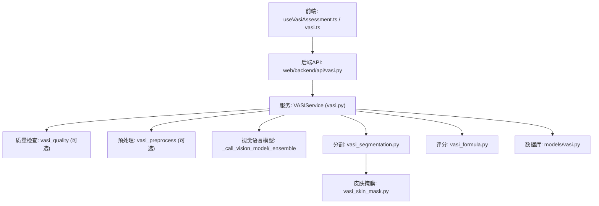
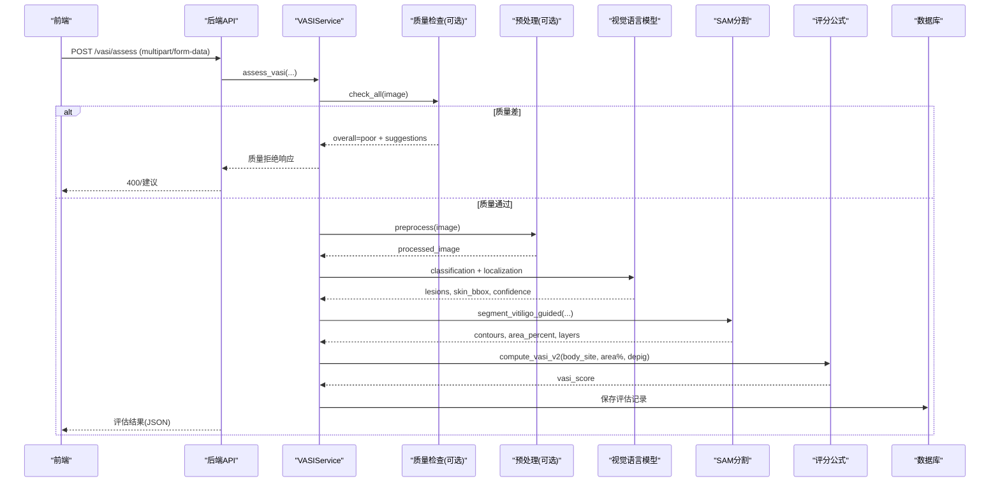
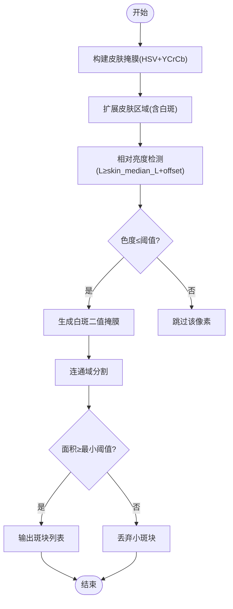
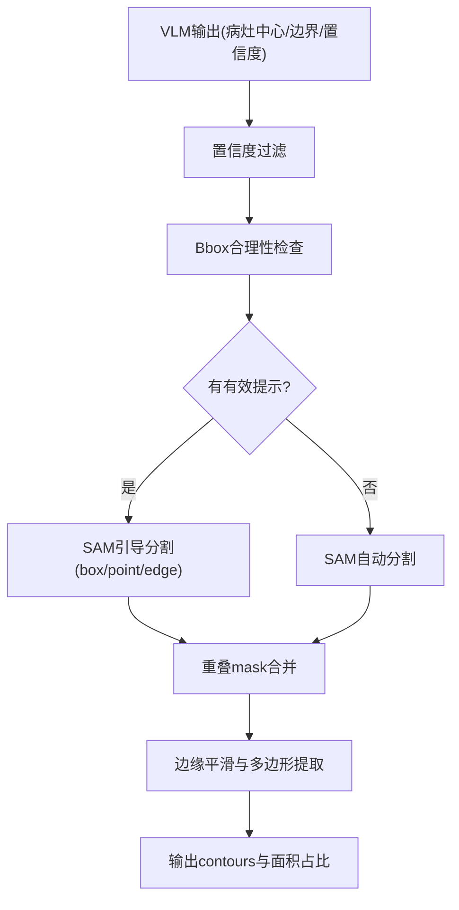
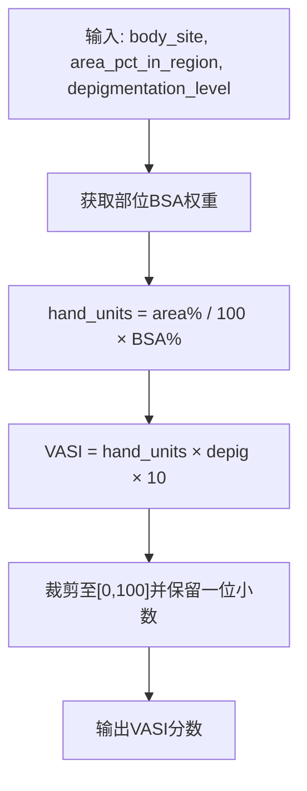
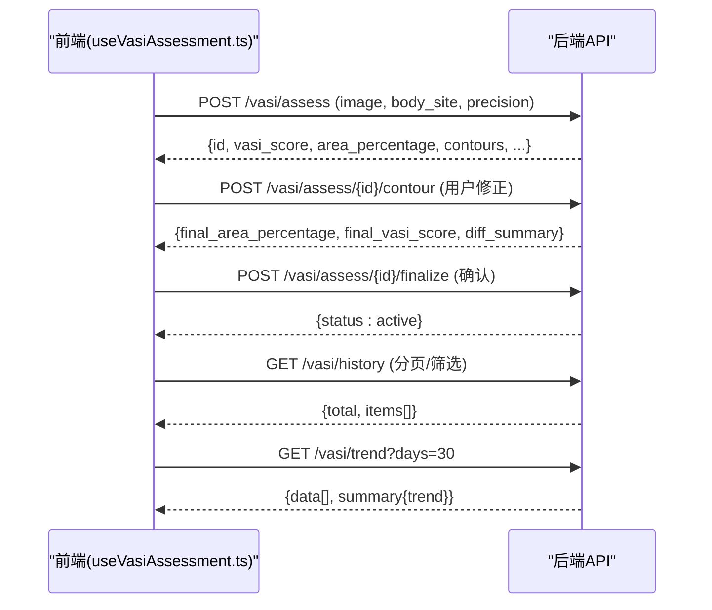
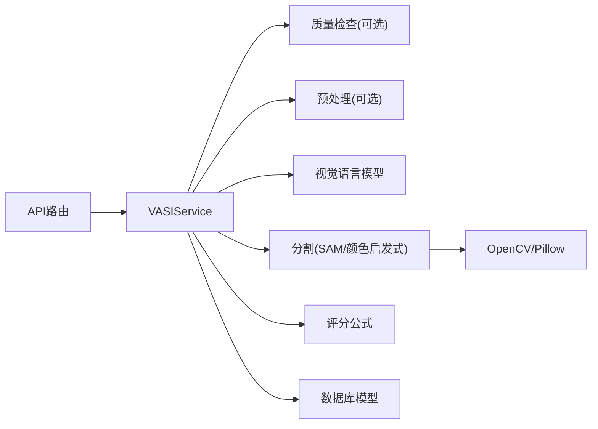

# 评估算法

<cite>
**本文引用的文件**
- [web/backend/api/vasi.py](file://web/backend/api/vasi.py)
- [web/backend/services/vasi.py](file://web/backend/services/vasi.py)
- [web/backend/services/vasi_segmentation.py](file://web/backend/services/vasi_segmentation.py)
- [web/backend/services/vasi_skin_mask.py](file://web/backend/services/vasi_skin_mask.py)
- [web/backend/services/vasi_formula.py](file://web/backend/services/vasi_formula.py)
- [web/backend/models/vasi.py](file://web/backend/models/vasi.py)
- [web/app/src/composables/useVasiAssessment.ts](file://web/app/src/composables/useVasiAssessment.ts)
- [web/app/src/api/vasi.ts](file://web/app/src/api/vasi.ts)
- [tests/test_vasi_accuracy.py](file://tests/test_vasi_accuracy.py)
- [data/vasi_accuracy_test.json](file://data/vasi_accuracy_test.json)
</cite>

## 目录
1. [简介](#简介)
2. [项目结构](#项目结构)
3. [核心组件](#核心组件)
4. [架构总览](#架构总览)
5. [详细组件分析](#详细组件分析)
6. [依赖关系分析](#依赖关系分析)
7. [性能考量](#性能考量)
8. [故障排查指南](#故障排查指南)
9. [结论](#结论)
10. [附录：API接口与集成示例](#附录api接口与集成示例)

## 简介
本文件面向“白斑面积严重度指数（VASI）评估”的完整技术文档，覆盖算法原理、前后端协作流程、数据传输格式、结果解析与评分计算、精度评估、误差分析与优化策略，并提供可直接集成的API接口说明。系统采用“质量检查→图像预处理→视觉语言模型（VLM）定位与分类→SAM引导分割→nnU-Net回退→公式化评分”的分层流水线，支持快速与精确两种模式，并允许用户在线修正轮廓以形成闭环自进化训练数据。

## 项目结构
围绕VASI评估的关键代码分布在后端服务、前端交互与测试脚本中：
- 后端API路由负责接收图片、参数校验、调用服务层并返回结构化结果
- 服务层编排质量检查、预处理、VLM识别、SAM分割、公式评分与持久化
- 皮肤掩膜与相对亮度检测模块提供稳健的皮肤区域与白斑像素级识别
- 前端组合式函数封装上传、质量检查、提交评估、轮廓编辑与历史趋势展示
- 测试脚本用于端到端精度对比与指标汇总

图表来源
- [web/backend/api/vasi.py:45-164](file://web/backend/api/vasi.py#L45-L164)
- [web/backend/services/vasi.py:159-243](file://web/backend/services/vasi.py#L159-L243)
- [web/backend/services/vasi_segmentation.py:278-436](file://web/backend/services/vasi_segmentation.py#L278-L436)
- [web/backend/services/vasi_skin_mask.py:124-288](file://web/backend/services/vasi_skin_mask.py#L124-L288)
- [web/backend/services/vasi_formula.py:71-101](file://web/backend/services/vasi_formula.py#L71-L101)
- [web/backend/models/vasi.py:26-104](file://web/backend/models/vasi.py#L26-L104)

章节来源
- [web/backend/api/vasi.py:45-164](file://web/backend/api/vasi.py#L45-L164)
- [web/backend/services/vasi.py:159-243](file://web/backend/services/vasi.py#L159-L243)
- [web/backend/services/vasi_segmentation.py:278-436](file://web/backend/services/vasi_segmentation.py#L278-L436)
- [web/backend/services/vasi_skin_mask.py:124-288](file://web/backend/services/vasi_skin_mask.py#L124-L288)
- [web/backend/services/vasi_formula.py:71-101](file://web/backend/services/vasi_formula.py#L71-L101)
- [web/backend/models/vasi.py:26-104](file://web/backend/models/vasi.py#L26-L104)

## 核心组件
- 质量检查与输入校验：拒绝低质量或非法图片，避免浪费AI资源
- 图像预处理：可选增强步骤，提升后续VLM/SAM稳定性
- VLM识别：输出分型、分期、部位、疑似病灶中心/边界/置信度等语义信息
- SAM引导分割：基于VLM提示框/点/边进行精准分割，无提示时回退自动模式
- 皮肤掩膜与相对亮度检测：两阶段算法，先构建皮肤前景，再在皮肤区域内用相对亮度阈值识别白斑
- 公式化评分：按身体部位体表面积权重与脱色程度计算VASI分数
- 用户修正与闭环：记录差异、计算Dice与面积误差，驱动自进化训练

章节来源
- [web/backend/services/vasi.py:539-571](file://web/backend/services/vasi.py#L539-L571)
- [web/backend/services/vasi.py:602-800](file://web/backend/services/vasi.py#L602-L800)
- [web/backend/services/vasi_segmentation.py:278-436](file://web/backend/services/vasi_segmentation.py#L278-L436)
- [web/backend/services/vasi_skin_mask.py:124-288](file://web/backend/services/vasi_skin_mask.py#L124-L288)
- [web/backend/services/vasi_formula.py:71-101](file://web/backend/services/vasi_formula.py#L71-L101)

## 架构总览
下图展示了从前端到后端的端到端处理流，包括质量检查、预处理、VLM、SAM分割、评分与存储。

图表来源
- [web/backend/api/vasi.py:45-164](file://web/backend/api/vasi.py#L45-L164)
- [web/backend/services/vasi.py:159-243](file://web/backend/services/vasi.py#L159-L243)
- [web/backend/services/vasi.py:602-800](file://web/backend/services/vasi.py#L602-L800)
- [web/backend/services/vasi_segmentation.py:690-800](file://web/backend/services/vasi_segmentation.py#L690-L800)
- [web/backend/services/vasi_formula.py:71-101](file://web/backend/services/vasi_formula.py#L71-L101)

## 详细组件分析

### 皮肤识别与白斑检测（两阶段算法）
- 第一阶段：构建皮肤掩膜
  - 使用HSV与YCrCb双色彩空间阈值，结合自适应Fitzpatrick类型估计，生成鲁棒的皮肤前景
  - 形态学开闭操作去除噪声，排除纯白参考物干扰
- 第二阶段：在皮肤区域内检测白斑
  - 将皮肤区域扩展以包含可能的白斑（凸包+膨胀），避免漏检
  - 计算皮肤区域的中位L值，设定相对阈值（如skin_median_L + 12），并结合低色度条件识别白斑像素
  - 连通域分割得到独立斑块，过滤过小区域

图表来源
- [web/backend/services/vasi_skin_mask.py:124-288](file://web/backend/services/vasi_skin_mask.py#L124-L288)

章节来源
- [web/backend/services/vasi_skin_mask.py:124-288](file://web/backend/services/vasi_skin_mask.py#L124-L288)

### VLM引导的SAM分割
- VLM输出：疑似病灶中心、尺寸估计、边界关键点、置信度、皮肤区域框
- 置信度过滤：低于阈值的病灶被丢弃；中等置信度的标记为用户复核
- Bbox合理性检查：根据部位自适应阈值剔除过大bbox
- SAM引导：优先使用VLM提供的box/point/edge作为提示，提高分割准确性；若无有效提示则回退自动模式
- 合并与精炼：重叠mask合并，边缘形态学平滑，提取归一化多边形

图表来源
- [web/backend/services/vasi.py:635-793](file://web/backend/services/vasi.py#L635-L793)
- [web/backend/services/vasi_segmentation.py:690-800](file://web/backend/services/vasi_segmentation.py#L690-L800)

章节来源
- [web/backend/services/vasi.py:635-793](file://web/backend/services/vasi.py#L635-L793)
- [web/backend/services/vasi_segmentation.py:690-800](file://web/backend/services/vasi_segmentation.py#L690-L800)

### VASI评分计算（公式化）
- 依据身体部位体表面积权重（BSA%）与区域白斑面积百分比，结合脱色程度计算VASI分数
- 支持用户修正后的双层掩膜（皮肤层+白斑层）重新计算面积与分数
- 兼容历史字段与新字段，优先使用最终修正结果

图表来源
- [web/backend/services/vasi_formula.py:71-101](file://web/backend/services/vasi_formula.py#L71-L101)

章节来源
- [web/backend/services/vasi_formula.py:71-101](file://web/backend/services/vasi_formula.py#L71-L101)

### 前后端协作流程
- 前端：选择部位→上传图片→质量检查→提交评估→显示轮廓→用户修正→确认并提交→查看历史与趋势
- 后端：接收请求→校验→质量检查→预处理→VLM→SAM→评分→持久化→返回结果
- 数据传输：multipart/form-data上传图片；JSON返回评估详情、轮廓、图层data URL、视觉特征等

图表来源
- [web/app/src/composables/useVasiAssessment.ts:214-368](file://web/app/src/composables/useVasiAssessment.ts#L214-L368)
- [web/app/src/api/vasi.ts:122-237](file://web/app/src/api/vasi.ts#L122-L237)
- [web/backend/api/vasi.py:45-472](file://web/backend/api/vasi.py#L45-L472)

章节来源
- [web/app/src/composables/useVasiAssessment.ts:214-368](file://web/app/src/composables/useVasiAssessment.ts#L214-L368)
- [web/app/src/api/vasi.ts:122-237](file://web/app/src/api/vasi.ts#L122-L237)
- [web/backend/api/vasi.py:45-472](file://web/backend/api/vasi.py#L45-L472)

### 数据模型与持久化
- 评估记录包含：图片URL/Key/Hash、VASI分数、部位、面积占比、分型、分期、详细信息、原始API响应、评估来源、置信度、质量报告、预处理标志、参考对象、脱色等级、最终修正分数与面积、双层掩膜、状态等
- 反馈信号与训练样本表用于自进化：记录显式修正、隐式行为、管理员标注、Dice与面积误差、RL参数快照等

章节来源
- [web/backend/models/vasi.py:26-104](file://web/backend/models/vasi.py#L26-L104)
- [web/backend/models/vasi.py:179-283](file://web/backend/models/vasi.py#L179-L283)

## 依赖关系分析
- 模块耦合：API路由依赖服务层；服务层依赖质量检查、预处理、VLM、分割、评分与数据库
- 外部依赖：Torch/Segment Anything（SAM）、OpenCV/Pillow（图像处理）、HTTPX（远程nnU-Net）
- 回退机制：当SAM不可用时回退到颜色启发式分割；当VLM不可用时回退自动模式；当nnU-Net不可用时忽略远程分割

图表来源
- [web/backend/api/vasi.py:45-164](file://web/backend/api/vasi.py#L45-L164)
- [web/backend/services/vasi.py:125-157](file://web/backend/services/vasi.py#L125-L157)
- [web/backend/services/vasi_segmentation.py:41-121](file://web/backend/services/vasi_segmentation.py#L41-L121)
- [web/backend/services/vasi_skin_mask.py:29-35](file://web/backend/services/vasi_skin_mask.py#L29-L35)

章节来源
- [web/backend/services/vasi.py:125-157](file://web/backend/services/vasi.py#L125-L157)
- [web/backend/services/vasi_segmentation.py:41-121](file://web/backend/services/vasi_segmentation.py#L41-L121)
- [web/backend/services/vasi_skin_mask.py:29-35](file://web/backend/services/vasi_skin_mask.py#L29-L35)

## 性能考量
- 快速与精确模式：quick模式降低网格密度与裁剪层数，约10秒；precise模式提高精度，约70秒
- 模型加载缓存：SAM模型与generator全局缓存，避免重复加载
- 质量前置：低质量图片直接拒绝，节省VLM/SAM开销
- 并行与异步：VLM与SAM调用尽量异步化，减少阻塞
- 内存与IO：图片大小限制、data URL传输注意压缩与带宽

## 故障排查指南
- 图片格式/大小错误：检查Content-Type与magic byte校验，确保真实JPG/PNG/WebP
- 皮肤区域不足：提示靠近相机拍摄，确保足够皮肤比例
- VLM不可用：回退自动分割，关注日志中的source字段
- SAM不可用：回退颜色启发式分割，检查依赖库是否安装
- 评分异常：检查body_site映射与BSA权重，确认area%与depigmentation范围
- 用户修正未生效：确认提交双层掩膜或轮廓，检查diff_summary与final字段

章节来源
- [web/backend/services/vasi.py:539-571](file://web/backend/services/vasi.py#L539-L571)
- [web/backend/services/vasi.py:602-800](file://web/backend/services/vasi.py#L602-L800)
- [web/backend/services/vasi_segmentation.py:495-568](file://web/backend/services/vasi_segmentation.py#L495-L568)

## 结论
本系统通过“质量检查→预处理→VLM→SAM→公式评分”的分层架构，实现了稳健且可解释的VASI评估。两阶段皮肤识别与相对亮度检测显著降低了背景误检；VLM引导的SAM分割提升了复杂场景下的准确率；用户修正与闭环反馈为模型自进化提供了高质量训练数据。整体方案兼顾效率与精度，具备可扩展性与工程落地能力。

## 附录：API接口与集成示例

### 接口定义
- POST /vasi/assess
  - 表单字段：image(File), body_site(String), precision(String, quick|precise), has_reference(Boolean)
  - 返回：评估ID、VASI分数、部位、面积占比、分型、分期、轮廓、图层data URL、置信度、视觉特征、评估来源等
- POST /vasi/assess/{id}/contour
  - 请求体：contours(Array), mask_image(String, data URL), skin_mask_image(String), lesion_mask_image(String), depigmentation_level(Number)
  - 返回：差异摘要、最终面积占比、最终VASI分数
- POST /vasi/assess/{id}/finalize
  - 作用：确认草稿评估，状态改为active
- POST /vasi/assess/{id}/abandon
  - 作用：放弃草稿评估，状态改为abandoned
- GET /vasi/history
  - 查询参数：limit, offset, body_site, start_date, end_date
  - 返回：总数与历史记录列表
- GET /vasi/trend
  - 查询参数：body_site, days
  - 返回：时间序列数据与趋势总结
- POST /vasi/check-photo-quality
  - 表单字段：image(File)
  - 返回：质量总体评价、模糊分数、皮肤比例、光照、分辨率、建议等

章节来源
- [web/backend/api/vasi.py:45-472](file://web/backend/api/vasi.py#L45-L472)
- [web/app/src/api/vasi.ts:122-237](file://web/app/src/api/vasi.ts#L122-L237)

### 集成示例（前端）
- 上传并评估：构造FormData，调用POST /vasi/assess，处理返回的contours与图层data URL
- 用户修正：调用POST /vasi/assess/{id}/contour，提交双层掩膜或轮廓，更新final字段
- 确认评估：调用POST /vasi/assess/{id}/finalize，使评估进入历史与趋势
- 历史与趋势：GET /vasi/history与GET /vasi/trend，渲染列表与曲线图

章节来源
- [web/app/src/composables/useVasiAssessment.ts:214-368](file://web/app/src/composables/useVasiAssessment.ts#L214-L368)
- [web/app/src/api/vasi.ts:122-237](file://web/app/src/api/vasi.ts#L122-L237)

### 精度评估与误差分析
- 测试脚本：支持单图/全部图片测试，输出耗时、评分、面积占比、病灶数量、VLM→SAM命中率、SAM实测面积占比、加权脱色等指标
- 结果保存：data/vasi_accuracy_test.json，便于回溯与分析
- 关键指标：
  - VASI评分与面积占比：反映整体严重程度
  - VLM→SAM命中率：衡量VLM引导的有效性
  - Dice与面积误差：衡量用户修正与AI分割的一致性
  - 加权脱色：反映不同病灶脱色程度的综合影响

章节来源
- [tests/test_vasi_accuracy.py:105-245](file://tests/test_vasi_accuracy.py#L105-L245)
- [tests/test_vasi_accuracy.py:251-313](file://tests/test_vasi_accuracy.py#L251-L313)
- [data/vasi_accuracy_test.json:1-191](file://data/vasi_accuracy_test.json#L1-L191)

### 优化策略
- 质量前置：低质量图片直接拒绝，减少无效AI调用
- 置信度与Bbox过滤：降低误检，提高SAM引导有效性
- 自适应阈值：根据Fitzpatrick类型调整皮肤与白斑检测阈值
- 双层掩膜重算：用户修正后以皮肤层为分母、白斑层为分子重新计算面积与分数
- 自进化闭环：记录差异与反馈，驱动参数与模型迭代

章节来源
- [web/backend/services/vasi.py:660-719](file://web/backend/services/vasi.py#L660-L719)
- [web/backend/services/vasi_skin_mask.py:76-121](file://web/backend/services/vasi_skin_mask.py#L76-L121)
- [web/backend/api/vasi.py:544-737](file://web/backend/api/vasi.py#L544-L737)