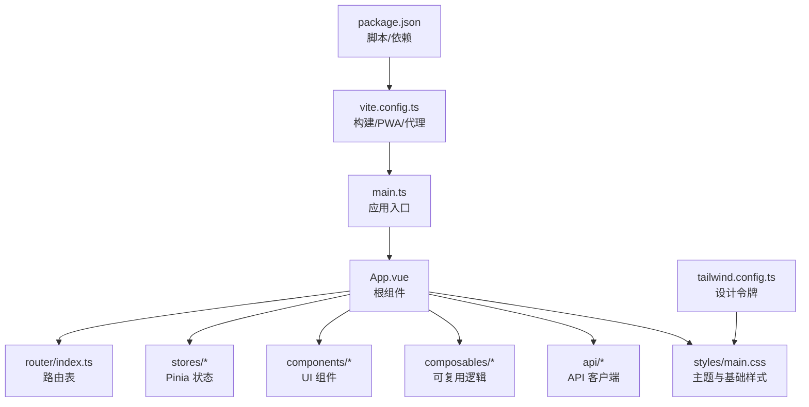
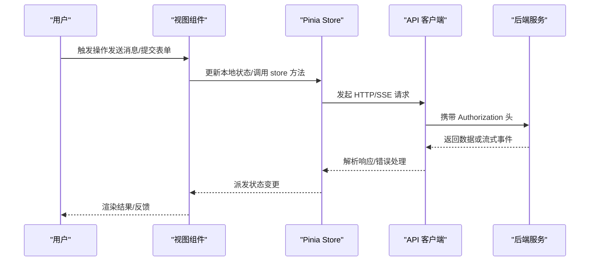
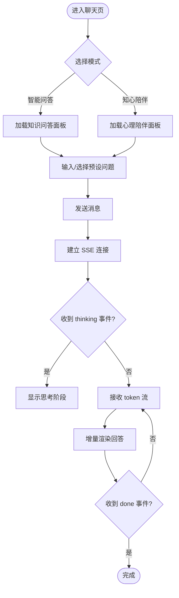
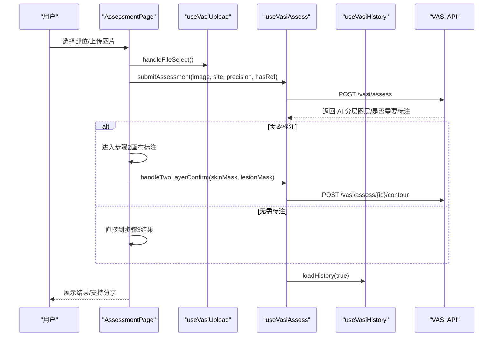
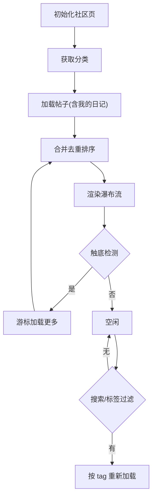
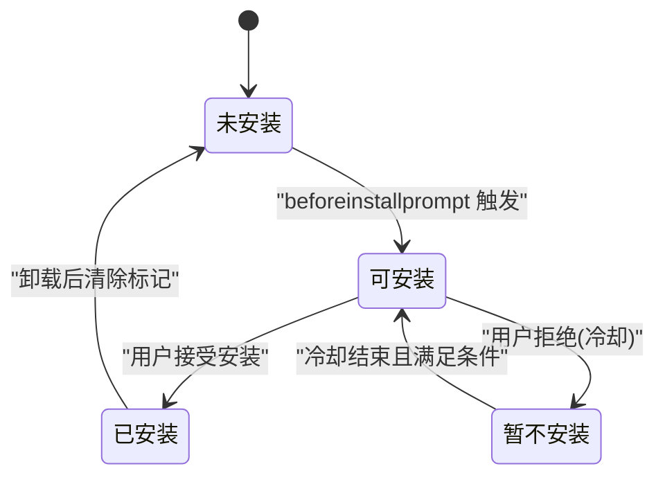
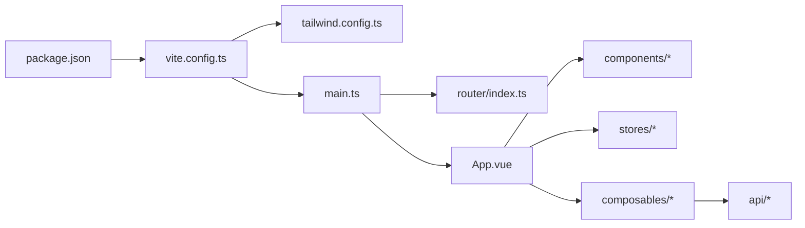

# 前端应用

<cite>
**本文引用的文件**
- [web/app/package.json](file://web/app/package.json)
- [web/app/src/main.ts](file://web/app/src/main.ts)
- [web/app/src/App.vue](file://web/app/src/App.vue)
- [web/app/vite.config.ts](file://web/app/vite.config.ts)
- [web/app/tailwind.config.ts](file://web/app/tailwind.config.ts)
- [web/app/src/router/index.ts](file://web/app/src/router/index.ts)
- [web/app/src/stores/auth.ts](file://web/app/src/stores/auth.ts)
- [web/app/src/api/client.ts](file://web/app/src/api/client.ts)
- [web/app/src/styles/main.css](file://web/app/src/styles/main.css)
- [web/app/src/composables/usePWA.ts](file://web/app/src/composables/usePWA.ts)
- [web/app/src/views/ChatAssistantPage.vue](file://web/app/src/views/ChatAssistantPage.vue)
- [web/app/src/views/AssessmentPage.vue](file://web/app/src/views/AssessmentPage.vue)
- [web/app/src/views/CommunityPage.vue](file://web/app/src/views/CommunityPage.vue)
- [web/app/src/api/chat.ts](file://web/app/src/api/chat.ts)
- [web/app/src/api/vasi.ts](file://web/app/src/api/vasi.ts)
</cite>

## 目录
1. [简介](#简介)
2. [项目结构](#项目结构)
3. [核心组件](#核心组件)
4. [架构总览](#架构总览)
5. [详细组件分析](#详细组件分析)
6. [依赖关系分析](#依赖关系分析)
7. [性能考量](#性能考量)
8. [故障排查指南](#故障排查指南)
9. [结论](#结论)
10. [附录](#附录)

## 简介
本文件为 Subskin 前端应用的完整技术文档，覆盖 Vue 3 + TypeScript + Vite 技术栈的实现细节与工程规范。内容涵盖：
- 应用初始化、路由配置、状态管理（Pinia）
- 组件设计规范与可复用逻辑封装（Composables）
- 样式系统（Tailwind CSS）与主题体系
- PWA 特性（安装提示、离线缓存、版本更新）
- 核心功能模块：AI 助手聊天界面、VASI 评估页面、社区功能、百科浏览等
- API 客户端设计与错误处理策略

## 项目结构
Subskin 前端位于 web/app 目录，采用模块化组织：
- src/main.ts：应用入口，注册 Pinia、Router、全局样式与图标字体
- src/App.vue：根组件，承载布局、全局事件监听、SEO 元信息、PWA 横幅与登录弹窗
- src/router/index.ts：基于 vue-router 的懒加载路由表，包含主站与子路径
- src/stores：Pinia 状态管理（auth、chat、im、privacy、theme）
- src/components：按功能域划分的组件（assistant、community、encyclopedia、tracker、layout、common 等）
- src/composables：可复用逻辑（usePWA、useToast、useVasi*、useCommunityFeed 等）
- src/api：Axios 客户端与各业务 API 封装（client.ts、chat.ts、vasi.ts、community.ts 等）
- src/styles：Tailwind 基础样式与主题变量
- vite.config.ts：构建与 PWA 插件配置、开发代理、版本 JSON 生成
- tailwind.config.ts：颜色、字体、圆角等设计令牌扩展
- package.json：脚本、依赖与开发依赖

**图表来源**
- [web/app/src/main.ts:1-11](file://web/app/src/main.ts#L1-L11)
- [web/app/src/App.vue:1-117](file://web/app/src/App.vue#L1-L117)
- [web/app/src/router/index.ts:1-155](file://web/app/src/router/index.ts#L1-L155)
- [web/app/vite.config.ts:1-110](file://web/app/vite.config.ts#L1-L110)
- [web/app/tailwind.config.ts:1-63](file://web/app/tailwind.config.ts#L1-L63)
- [web/app/package.json:1-55](file://web/app/package.json#L1-L55)

**章节来源**
- [web/app/src/main.ts:1-11](file://web/app/src/main.ts#L1-L11)
- [web/app/src/App.vue:1-117](file://web/app/src/App.vue#L1-L117)
- [web/app/src/router/index.ts:1-155](file://web/app/src/router/index.ts#L1-L155)
- [web/app/vite.config.ts:1-110](file://web/app/vite.config.ts#L1-L110)
- [web/app/tailwind.config.ts:1-63](file://web/app/tailwind.config.ts#L1-L63)
- [web/app/package.json:1-55](file://web/app/package.json#L1-L55)

## 核心组件
- 应用入口与挂载
  - main.ts 创建 Vue 应用实例，注入 Pinia 与 Router，并引入全局样式与图标字体
- 根组件 App.vue
  - 提供全局点击追踪、动态标题与 canonical/OG 标签、iOS 安全区域适配、PWA 横幅与登录弹窗
  - 使用 keep-alive 缓存社区页以提升体验
- 路由 router/index.ts
  - 懒加载各页面组件，定义滚动行为与路由后置钩子用于埋点
- 样式系统 styles/main.css
  - 基于 Tailwind 的基础层、组件层与工具层，定义主题色板、暗色模式、按钮、卡片、输入框等通用样式
- Tailwind 配置 tailwind.config.ts
  - 扩展 primary/secondary/accent/success 色系、字体族、圆角等设计令牌

**章节来源**
- [web/app/src/main.ts:1-11](file://web/app/src/main.ts#L1-L11)
- [web/app/src/App.vue:1-117](file://web/app/src/App.vue#L1-L117)
- [web/app/src/router/index.ts:1-155](file://web/app/src/router/index.ts#L1-L155)
- [web/app/src/styles/main.css:1-213](file://web/app/src/styles/main.css#L1-L213)
- [web/app/tailwind.config.ts:1-63](file://web/app/tailwind.config.ts#L1-L63)

## 架构总览
前端采用“视图层 + 状态层 + API 层”的分层架构：
- 视图层：Vue 单文件组件（views 与 components），通过组合式函数（composables）组织交互逻辑
- 状态层：Pinia store（如 auth、chat、im、privacy、theme）集中管理跨组件状态
- API 层：axios 客户端统一拦截器（鉴权、刷新 token、错误处理），各业务 API 模块化封装
- 构建与运行：Vite 插件集成 PWA，生产构建输出静态资源，开发环境代理后端接口

**图表来源**
- [web/app/src/api/client.ts:1-84](file://web/app/src/api/client.ts#L1-L84)
- [web/app/src/stores/auth.ts:1-259](file://web/app/src/stores/auth.ts#L1-L259)
- [web/app/src/api/chat.ts:1-272](file://web/app/src/api/chat.ts#L1-L272)
- [web/app/src/api/vasi.ts:1-274](file://web/app/src/api/vasi.ts#L1-L274)

## 详细组件分析

### AI 助手聊天界面（ChatAssistantPage）
- 功能要点
  - 双模式切换：智能问答与知心陪伴，各自独立会话上下文
  - 输入区支持自动高度、占位符轮播、预设问题匹配与发送
  - 流式 SSE 响应展示，思考阶段与动作卡片支持
  - 滚动联动：答案内容与聊天区域的滚动链
- 关键实现
  - 使用 useChatStore 管理消息与会话
  - ChatPanel/CounselingPanel 分别处理不同模式的对话逻辑
  - 预设问题分类与相似度打分，提升引导性
  - 移动端与桌面端滚动事件捕获与转发，保证流畅体验

**图表来源**
- [web/app/src/views/ChatAssistantPage.vue:1-489](file://web/app/src/views/ChatAssistantPage.vue#L1-L489)
- [web/app/src/api/chat.ts:1-272](file://web/app/src/api/chat.ts#L1-L272)

**章节来源**
- [web/app/src/views/ChatAssistantPage.vue:1-489](file://web/app/src/views/ChatAssistantPage.vue#L1-L489)
- [web/app/src/api/chat.ts:1-272](file://web/app/src/api/chat.ts#L1-L272)

### VASI 评估页面（AssessmentPage）
- 功能要点
  - 三步流程：拍照评估 → AI 分析+画布标注 → 结果与解读
  - 侧边栏（桌面）/底部 Sheet（移动）展示评估历史，支持对比与分享
  - 体检报告解读 Tab 与图片质量检查
- 关键实现
  - 使用 useVasiUpload、useVasiAssess、useVasiHistory 三个 composable 解耦上传、评估与历史
  - 两步掩码确认：皮肤层与病灶层，支持跳过编辑由 AI 合成标注图
  - 结果分享：将标注图与原始图上传至社区草稿，便于二次传播

**图表来源**
- [web/app/src/views/AssessmentPage.vue:1-531](file://web/app/src/views/AssessmentPage.vue#L1-L531)
- [web/app/src/api/vasi.ts:1-274](file://web/app/src/api/vasi.ts#L1-L274)

**章节来源**
- [web/app/src/views/AssessmentPage.vue:1-531](file://web/app/src/views/AssessmentPage.vue#L1-L531)
- [web/app/src/api/vasi.ts:1-274](file://web/app/src/api/vasi.ts#L1-L274)

### 社区功能（CommunityPage）
- 功能要点
  - 瀑布流信息流：关注/推荐/同城三种 feed 类型
  - 标签搜索与自动补全，城市定位与同城筛选
  - 点赞、关注、发布、草稿箱、日记日历
- 关键实现
  - 游标分页（after cursor）避免重复/遗漏
  - IntersectionObserver 实现无限滚动加载
  - 合并公开帖子与我的日记，限制最大 DOM 节点数优化性能

**图表来源**
- [web/app/src/views/CommunityPage.vue:1-570](file://web/app/src/views/CommunityPage.vue#L1-L570)

**章节来源**
- [web/app/src/views/CommunityPage.vue:1-570](file://web/app/src/views/CommunityPage.vue#L1-L570)

### 百科浏览（EncyclopediaNewPage）
- 功能要点
  - 基于 slug 的动态路由，Markdown 渲染与评论、修订历史
- 关键实现
  - 路由参数匹配任意层级 slug
  - MarkdownRenderer 与 CommentSection、RevisionEditor、RevisionHistory 组件协作

**章节来源**
- [web/app/src/router/index.ts:93-103](file://web/app/src/router/index.ts#L93-L103)

### 应用初始化与路由配置
- 应用初始化
  - main.ts 创建应用、注册 Pinia 与 Router，导入全局样式与图标字体
- 路由配置
  - 懒加载页面组件，定义滚动行为与路由后置埋点
  - 保持 CommunityPage 在 keep-alive 中缓存

**章节来源**
- [web/app/src/main.ts:1-11](file://web/app/src/main.ts#L1-L11)
- [web/app/src/router/index.ts:1-155](file://web/app/src/router/index.ts#L1-L155)

### 状态管理（Pinia）
- 认证状态（auth.ts）
  - 管理 token、refreshToken、用户信息与登录弹窗状态
  - 提供多种登录方式、绑定/解绑凭证、密码设置与重置
  - 自动刷新文件访问 token，防止长会话失效
  - 失败时尝试 refresh-token 并清理本地状态

**章节来源**
- [web/app/src/stores/auth.ts:1-259](file://web/app/src/stores/auth.ts#L1-L259)

### API 客户端设计与错误处理
- axios 客户端（client.ts）
  - 统一 baseURL、超时、Content-Type；自动附加 Authorization
  - FormData 上传时移除 Content-Type 以启用浏览器自动 boundary
  - 响应拦截器处理 401：去重刷新 token，失败则清理本地并刷新页面
- 聊天 API（chat.ts）
  - 支持普通问答与流式 SSE 问答，附带附件能力
  - 友好错误文案转换与回答文本清洗，屏蔽异常类名
- VASI API（vasi.ts）
  - 图片上传、质量检查、AI 分层、轮廓标注、趋势与历史、反馈采集

**章节来源**
- [web/app/src/api/client.ts:1-84](file://web/app/src/api/client.ts#L1-L84)
- [web/app/src/api/chat.ts:1-272](file://web/app/src/api/chat.ts#L1-L272)
- [web/app/src/api/vasi.ts:1-274](file://web/app/src/api/vasi.ts#L1-L274)

### 样式系统（Tailwind CSS）
- 主题与颜色
  - 通过 CSS 变量与 Tailwind 扩展定义 primary/secondary/accent/success 色系
  - 暗色模式通过 class 切换，组件层提供按钮、卡片、输入框等通用样式
- 基础样式
  - 字体、触摸目标尺寸、滚动行为、iOS 安全区域适配

**章节来源**
- [web/app/tailwind.config.ts:1-63](file://web/app/tailwind.config.ts#L1-L63)
- [web/app/src/styles/main.css:1-213](file://web/app/src/styles/main.css#L1-L213)

### PWA 特性
- 安装提示与状态管理
  - 捕获 beforeinstallprompt，记录用户选择与冷却时间
  - 检测 standalone 模式与已安装状态，避免重复提示
- 版本更新与离线缓存
  - 定期轮询 version.json 检测新版本，ServiceWorker 更新提示
  - runtimeCaching 对敏感 API 与上传路径禁用缓存，保障数据安全

**图表来源**
- [web/app/src/composables/usePWA.ts:1-441](file://web/app/src/composables/usePWA.ts#L1-L441)
- [web/app/vite.config.ts:34-89](file://web/app/vite.config.ts#L34-L89)

**章节来源**
- [web/app/src/composables/usePWA.ts:1-441](file://web/app/src/composables/usePWA.ts#L1-L441)
- [web/app/vite.config.ts:1-110](file://web/app/vite.config.ts#L1-L110)

## 依赖关系分析
- 构建与运行时依赖
  - Vue 3、Vue Router、Pinia、Axios、Tailwind、vite-plugin-pwa、ECharts、TipTap 编辑器等
- 构建脚本
  - dev/build/deploy:prod/preview/lint/type-check
- 开发与代理
  - 开发服务器端口 5174，代理 /api 与 /uploads 到后端

**图表来源**
- [web/app/package.json:1-55](file://web/app/package.json#L1-L55)
- [web/app/vite.config.ts:1-110](file://web/app/vite.config.ts#L1-L110)
- [web/app/tailwind.config.ts:1-63](file://web/app/tailwind.config.ts#L1-L63)
- [web/app/src/main.ts:1-11](file://web/app/src/main.ts#L1-L11)
- [web/app/src/router/index.ts:1-155](file://web/app/src/router/index.ts#L1-L155)
- [web/app/src/App.vue:1-117](file://web/app/src/App.vue#L1-L117)

**章节来源**
- [web/app/package.json:1-55](file://web/app/package.json#L1-L55)
- [web/app/vite.config.ts:1-110](file://web/app/vite.config.ts#L1-L110)

## 性能考量
- 路由懒加载与 keep-alive 缓存减少首屏与切换开销
- 社区信息流限制最大渲染节点数，IntersectionObserver 实现按需加载
- API 客户端超时与并发刷新 token 去重，避免雪崩
- PWA 运行时缓存策略对敏感路径禁用缓存，保障隐私与安全
- 图片上传与 AI 分析流程分步推进，避免阻塞 UI

[本节为通用指导，不直接分析具体文件]

## 故障排查指南
- 认证与授权
  - 401 自动刷新 token，若 refresh_token 缺失则清理本地并刷新页面
  - 登录成功后后台预取文件访问 token，避免长会话失效
- 网络与流式响应
  - SSE 读取失败会转换为友好错误文案，屏蔽异常类名
  - 流式中断时取消控制器并释放 reader
- 构建与部署
  - 版本更新轮询失败不影响运行，仅延迟提示
  - ServiceWorker 更新冲突时优先提示而非强制刷新

**章节来源**
- [web/app/src/api/client.ts:1-84](file://web/app/src/api/client.ts#L1-L84)
- [web/app/src/api/chat.ts:1-272](file://web/app/src/api/chat.ts#L1-L272)
- [web/app/src/stores/auth.ts:1-259](file://web/app/src/stores/auth.ts#L1-L259)
- [web/app/src/composables/usePWA.ts:1-441](file://web/app/src/composables/usePWA.ts#L1-L441)

## 结论
Subskin 前端以 Vue 3 + TypeScript + Vite 为核心，结合 Pinia 与 Tailwind 构建了高内聚、低耦合的前端架构。通过模块化 API 封装、统一的错误处理与 PWA 能力，实现了稳定、可扩展且用户体验友好的医疗社区与评估平台。后续可在组件库抽象、状态迁移与性能监控方面持续优化。

[本节为总结，不直接分析具体文件]

## 附录
- 组件开发规范
  - 单一职责：每个组件聚焦一个功能域，复杂逻辑下沉到 composables
  - 类型安全：全面使用 TypeScript，API 响应与状态均定义明确类型
  - 样式规范：优先使用 Tailwind 原子类，公共样式集中在 styles/main.css
- 可复用逻辑封装
  - usePWA：PWA 安装、更新、离线状态与统计上报
  - useVasi*：上传、评估、历史、反馈等 VASI 相关逻辑
  - useCommunityFeed：信息流加载、游标分页、标签搜索与同城定位
- API 客户端设计
  - axios 拦截器统一鉴权与错误处理，SSE 流式读取封装
  - 业务 API 按模块拆分，清晰映射后端接口

[本节为补充说明，不直接分析具体文件]