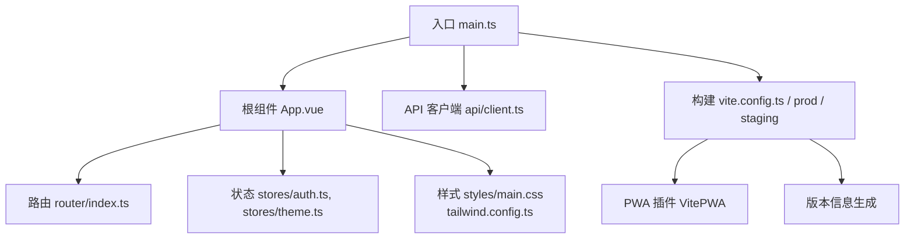
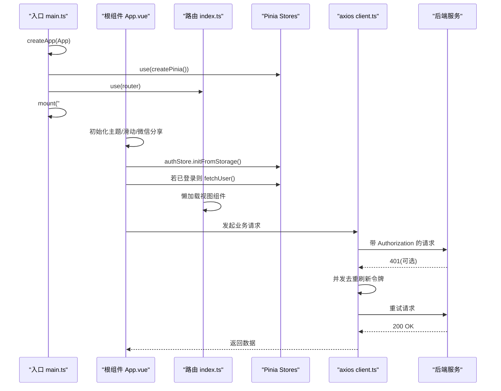
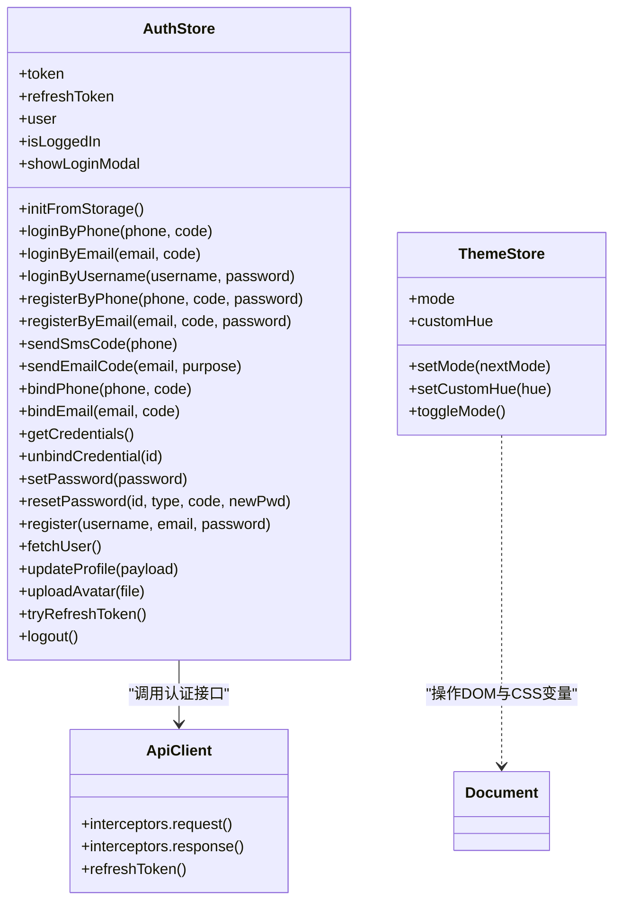
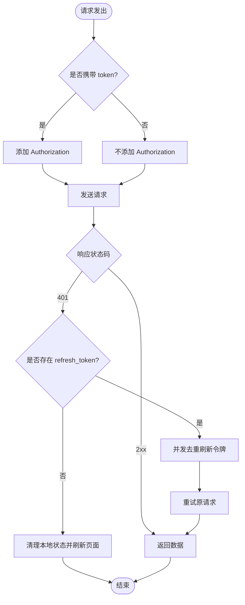
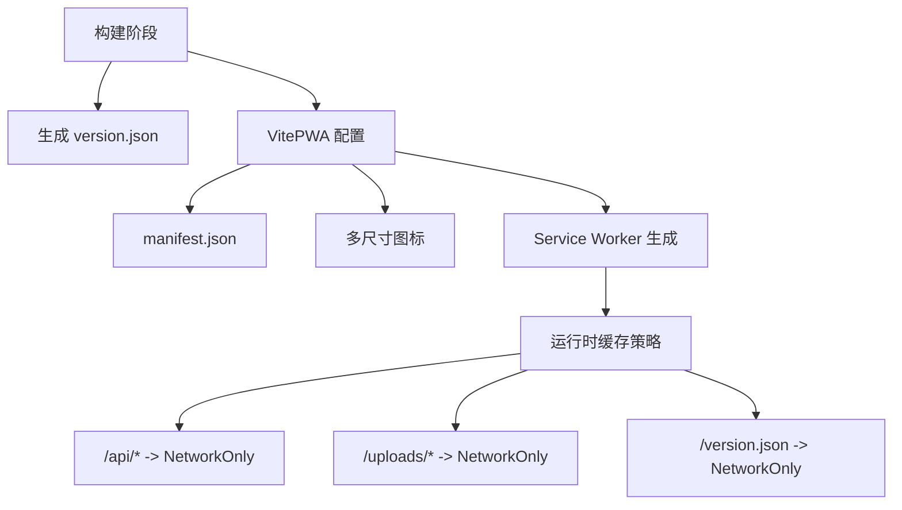
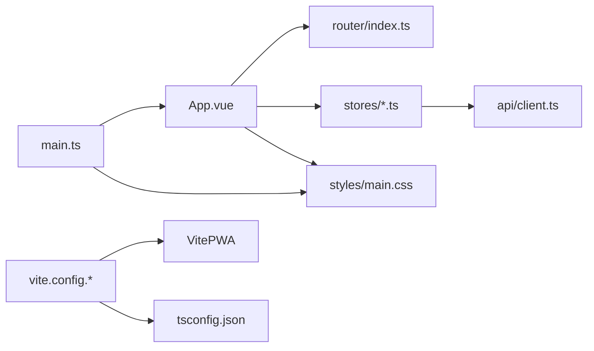

# 前端架构设计

<cite>
**本文引用的文件**   
- [web/app/package.json](file://web/app/package.json)
- [web/app/vite.config.ts](file://web/app/vite.config.ts)
- [web/app/vite.config.prod.ts](file://web/app/vite.config.prod.ts)
- [web/app/vite.config.staging.ts](file://web/app/vite.config.staging.ts)
- [web/app/src/main.ts](file://web/app/src/main.ts)
- [web/app/src/App.vue](file://web/app/src/App.vue)
- [web/app/src/router/index.ts](file://web/app/src/router/index.ts)
- [web/app/src/stores/auth.ts](file://web/app/src/stores/auth.ts)
- [web/app/src/stores/theme.ts](file://web/app/src/stores/theme.ts)
- [web/app/src/api/client.ts](file://web/app/src/api/client.ts)
- [web/app/tailwind.config.ts](file://web/app/tailwind.config.ts)
- [web/app/postcss.config.js](file://web/app/postcss.config.js)
- [web/app/src/styles/main.css](file://web/app/src/styles/main.css)
- [web/app/tsconfig.json](file://web/app/tsconfig.json)
</cite>

## 目录
1. [简介](#简介)
2. [项目结构](#项目结构)
3. [核心组件](#核心组件)
4. [架构总览](#架构总览)
5. [详细组件分析](#详细组件分析)
6. [依赖关系分析](#依赖关系分析)
7. [性能考量](#性能考量)
8. [故障排查指南](#故障排查指南)
9. [结论](#结论)
10. [附录](#附录)

## 简介
本文件面向 Subskin 前端应用（Vue 3 + TypeScript + Vite）的架构设计与实现，覆盖应用初始化、模块加载与路由策略、状态管理（Pinia）、组件设计规范、样式系统（Tailwind CSS）、PWA 特性实现、开发/构建配置、插件系统与第三方库集成。文档同时提供架构图与最佳实践建议，帮助开发者快速理解并高效扩展。

## 项目结构
Subskin 的前端位于 web/app 目录，采用多环境构建配置（默认 staging、production），通过 Vite 插件体系组织构建流程，使用 Vue Router 进行页面路由，Pinia 管理全局状态，Tailwind CSS 作为样式框架，Vite PWA 提供离线与安装能力。

图表来源
- [web/app/src/main.ts:1-11](file://web/app/src/main.ts#L1-L11)
- [web/app/src/App.vue:1-117](file://web/app/src/App.vue#L1-L117)
- [web/app/src/router/index.ts:1-155](file://web/app/src/router/index.ts#L1-L155)
- [web/app/src/stores/auth.ts:1-259](file://web/app/src/stores/auth.ts#L1-L259)
- [web/app/src/stores/theme.ts:1-71](file://web/app/src/stores/theme.ts#L1-L71)
- [web/app/src/api/client.ts:1-84](file://web/app/src/api/client.ts#L1-L84)
- [web/app/vite.config.ts:1-110](file://web/app/vite.config.ts#L1-L110)
- [web/app/vite.config.prod.ts:1-98](file://web/app/vite.config.prod.ts#L1-L98)
- [web/app/vite.config.staging.ts:1-110](file://web/app/vite.config.staging.ts#L1-L110)

章节来源
- [web/app/package.json:1-55](file://web/app/package.json#L1-L55)
- [web/app/vite.config.ts:1-110](file://web/app/vite.config.ts#L1-L110)
- [web/app/vite.config.prod.ts:1-98](file://web/app/vite.config.prod.ts#L1-L98)
- [web/app/vite.config.staging.ts:1-110](file://web/app/vite.config.staging.ts#L1-L110)

## 核心组件
- 应用初始化：main.ts 创建 Vue 应用，挂载 Pinia、Router，引入全局样式与图标字体，挂载到 #app。
- 根组件：App.vue 负责全局布局（头部、底部导航、消息提示、PWA 横幅、登录弹窗）、动态标题与 canonical、微信分享初始化、滑动导航、用户态初始化与埋点。
- 路由：router/index.ts 定义所有页面路由，采用懒加载，统一滚动行为与页面埋点。
- 状态管理：stores/auth.ts 管理认证、刷新令牌、用户信息与本地持久化；stores/theme.ts 管理主题模式与色相，支持深色模式与自定义主色调。
- API 客户端：api/client.ts 基于 axios，统一请求拦截（注入 Authorization、处理 FormData）、响应拦截（401 自动刷新令牌与并发去重）。
- 样式系统：styles/main.css 定义主题变量、基础样式、组件类与工具类；tailwind.config.ts 扩展颜色、字体、圆角等；postcss.config.js 接入 Tailwind 与 Autoprefixer。
- 构建与 PWA：vite.config.* 配置输出目录、环境变量、别名、代理、VitePWA 工作流与缓存策略，以及版本 JSON 生成。

章节来源
- [web/app/src/main.ts:1-11](file://web/app/src/main.ts#L1-L11)
- [web/app/src/App.vue:1-117](file://web/app/src/App.vue#L1-L117)
- [web/app/src/router/index.ts:1-155](file://web/app/src/router/index.ts#L1-L155)
- [web/app/src/stores/auth.ts:1-259](file://web/app/src/stores/auth.ts#L1-L259)
- [web/app/src/stores/theme.ts:1-71](file://web/app/src/stores/theme.ts#L1-L71)
- [web/app/src/api/client.ts:1-84](file://web/app/src/api/client.ts#L1-L84)
- [web/app/src/styles/main.css:1-213](file://web/app/src/styles/main.css#L1-L213)
- [web/app/tailwind.config.ts:1-63](file://web/app/tailwind.config.ts#L1-L63)
- [web/app/postcss.config.js:1-6](file://web/app/postcss.config.js#L1-L6)
- [web/app/vite.config.ts:1-110](file://web/app/vite.config.ts#L1-L110)
- [web/app/vite.config.prod.ts:1-98](file://web/app/vite.config.prod.ts#L1-L98)
- [web/app/vite.config.staging.ts:1-110](file://web/app/vite.config.staging.ts#L1-L110)

## 架构总览
下图展示从应用启动到页面渲染的关键流程，包括插件注册、路由懒加载、状态初始化与 API 鉴权刷新机制。

图表来源
- [web/app/src/main.ts:1-11](file://web/app/src/main.ts#L1-L11)
- [web/app/src/App.vue:1-117](file://web/app/src/App.vue#L1-L117)
- [web/app/src/router/index.ts:1-155](file://web/app/src/router/index.ts#L1-L155)
- [web/app/src/stores/auth.ts:1-259](file://web/app/src/stores/auth.ts#L1-L259)
- [web/app/src/api/client.ts:1-84](file://web/app/src/api/client.ts#L1-L84)

## 详细组件分析

### 应用初始化与生命周期
- main.ts 创建应用实例，注册 Pinia 与 Router，引入全局样式与图标字体，最后挂载到 DOM。
- App.vue 在 mounted 阶段监听 PWA 安装事件，设置 iOS 安全区域，按路由动态更新 title/canonical/OG 标签，并通过事件委托收集点击埋点。
- 路由切换时，afterEach 钩子触发页面埋点。

章节来源
- [web/app/src/main.ts:1-11](file://web/app/src/main.ts#L1-L11)
- [web/app/src/App.vue:1-117](file://web/app/src/App.vue#L1-L117)
- [web/app/src/router/index.ts:149-153](file://web/app/src/router/index.ts#L149-L153)

### 路由配置与懒加载策略
- 所有页面组件通过动态 import 实现按需加载，减少首屏体积。
- 统一 scrollBehavior：优先锚点平滑滚动，其次恢复历史位置，否则回到顶部。
- 路由元信息 meta.title 用于部分页面的标题控制。

章节来源
- [web/app/src/router/index.ts:1-147](file://web/app/src/router/index.ts#L1-L147)

### 状态管理架构（Pinia）
- auth store：集中管理 token、refreshToken、user 与登录态，提供多种登录方式、验证码发送、绑定/解绑凭证、密码重置、头像上传、用户信息获取与更新、登出清理等。包含本地存储持久化与文件访问短令牌定时刷新。
- theme store：管理明暗模式与自定义主色调，读写 localStorage，监听系统偏好，动态设置 CSS 变量与 class。

图表来源
- [web/app/src/stores/auth.ts:1-259](file://web/app/src/stores/auth.ts#L1-L259)
- [web/app/src/stores/theme.ts:1-71](file://web/app/src/stores/theme.ts#L1-L71)
- [web/app/src/api/client.ts:1-84](file://web/app/src/api/client.ts#L1-L84)

章节来源
- [web/app/src/stores/auth.ts:1-259](file://web/app/src/stores/auth.ts#L1-L259)
- [web/app/src/stores/theme.ts:1-71](file://web/app/src/stores/theme.ts#L1-L71)

### API 客户端与鉴权刷新
- 请求拦截器：自动注入 Authorization，对 FormData 请求删除 Content-Type 以让浏览器自动设置 multipart boundary。
- 响应拦截器：捕获 401，若无 refresh_token 则清理本地状态并刷新页面；若有则使用单例 Promise 去重并发刷新，成功后重试原请求。

图表来源
- [web/app/src/api/client.ts:1-84](file://web/app/src/api/client.ts#L1-L84)

章节来源
- [web/app/src/api/client.ts:1-84](file://web/app/src/api/client.ts#L1-L84)

### 样式系统（Tailwind CSS）
- tailwind.config.ts 扩展了 primary/secondary/accent/success 色系、字体族与圆角，启用 darkMode: class。
- postcss.config.js 接入 Tailwind 与 Autoprefixer。
- styles/main.css 定义主题变量（HSL 色相/饱和度/亮度）、基础层、组件层与工具层，适配移动端安全区域与触摸交互。

章节来源
- [web/app/tailwind.config.ts:1-63](file://web/app/tailwind.config.ts#L1-L63)
- [web/app/postcss.config.js:1-6](file://web/app/postcss.config.js#L1-L6)
- [web/app/src/styles/main.css:1-213](file://web/app/src/styles/main.css#L1-L213)

### PWA 特性实现
- 通过 vite-plugin-pwa 配置 manifest、icons、display、orientation、scope、start_url 等。
- Workbox 配置：
  - clientsClaim: true
  - navigateFallbackDenylist 排除 wiki-content 与 version.json
  - maximumFileSizeToCacheInBytes 限制资源大小
  - globPatterns 指定静态资源类型
  - runtimeCaching：
    - production/staging 均对 /api/* 与 /uploads/* 设置为 NetworkOnly，避免 L3 敏感数据泄露
    - staging 对特定 API 路径使用 NetworkFirst，对 uploads 使用 CacheFirst（注意生产环境未启用）
- 构建产物中生成 version.json，便于版本对比与更新提示。

图表来源
- [web/app/vite.config.ts:34-89](file://web/app/vite.config.ts#L34-L89)
- [web/app/vite.config.prod.ts:28-77](file://web/app/vite.config.prod.ts#L28-L77)
- [web/app/vite.config.staging.ts:34-88](file://web/app/vite.config.staging.ts#L34-L88)

章节来源
- [web/app/vite.config.ts:1-110](file://web/app/vite.config.ts#L1-L110)
- [web/app/vite.config.prod.ts:1-98](file://web/app/vite.config.prod.ts#L1-L98)
- [web/app/vite.config.staging.ts:1-110](file://web/app/vite.config.staging.ts#L1-L110)

### 构建与开发环境配置
- package.json 脚本：dev/build/deploy:prod/preview/lint/type-check。
- tsconfig.json：ES2020、bundler 解析、strict、noEmit、@ 路径别名。
- Vite 配置：define 注入 __BUILD_TIME__ 与 __APP_ENV__，alias 映射 @，server 端口与代理（/api、/uploads 指向后端）。
- 多环境构建：staging 与 production 分别输出到不同目录，并生成对应 version.json。

章节来源
- [web/app/package.json:1-55](file://web/app/package.json#L1-L55)
- [web/app/tsconfig.json:1-23](file://web/app/tsconfig.json#L1-L23)
- [web/app/vite.config.ts:1-110](file://web/app/vite.config.ts#L1-L110)
- [web/app/vite.config.prod.ts:1-98](file://web/app/vite.config.prod.ts#L1-L98)
- [web/app/vite.config.staging.ts:1-110](file://web/app/vite.config.staging.ts#L1-L110)

## 依赖关系分析
- 运行时依赖：vue、vue-router、pinia、axios、echarts、markdown-it、qrcode、remixicon、workbox-window、vite-plugin-pwa 等。
- 开发依赖：@vitejs/plugin-vue、typescript、vite、vue-tsc、tailwindcss、autoprefixer、postcss。
- 模块耦合：
  - main.ts 依赖 App.vue、router、stores、样式与图标字体。
  - App.vue 依赖路由、stores、composables、通用组件。
  - stores/auth.ts 依赖 api/auth 与 utils/file-url。
  - api/client.ts 被各业务 API 模块复用。
  - 样式由 Tailwind 与 CSS 变量共同驱动。

图表来源
- [web/app/src/main.ts:1-11](file://web/app/src/main.ts#L1-L11)
- [web/app/src/App.vue:1-117](file://web/app/src/App.vue#L1-L117)
- [web/app/src/router/index.ts:1-155](file://web/app/src/router/index.ts#L1-L155)
- [web/app/src/stores/auth.ts:1-259](file://web/app/src/stores/auth.ts#L1-L259)
- [web/app/src/api/client.ts:1-84](file://web/app/src/api/client.ts#L1-L84)
- [web/app/src/styles/main.css:1-213](file://web/app/src/styles/main.css#L1-L213)
- [web/app/vite.config.ts:1-110](file://web/app/vite.config.ts#L1-L110)
- [web/app/tsconfig.json:1-23](file://web/app/tsconfig.json#L1-L23)

章节来源
- [web/app/package.json:1-55](file://web/app/package.json#L1-L55)
- [web/app/vite.config.ts:1-110](file://web/app/vite.config.ts#L1-L110)
- [web/app/tsconfig.json:1-23](file://web/app/tsconfig.json#L1-L23)

## 性能考量
- 代码分割：路由级懒加载，减少首屏包体。
- 资源缓存：Workbox 仅缓存静态资源，API 与用户上传走 NetworkOnly，避免敏感数据泄露与过期问题。
- 令牌刷新：并发去重，避免重复刷新造成竞态。
- 样式优化：Tailwind 按需生成，CSS 变量驱动主题切换，减少运行时计算。
- 构建优化：多环境独立输出，version.json 辅助更新检测。

[本节为通用指导，不直接分析具体文件]

## 故障排查指南
- 401 未授权：检查 localStorage 中的 subskin_token 与 subskin_refresh_token 是否存在；确认后端刷新接口可用；观察是否触发页面刷新。
- 文件访问失败：确保 ensureFileToken 定时刷新成功；检查网络与跨域设置。
- PWA 无法安装或更新：检查 manifest 与 icons 路径；确认 Service Worker 注册成功；查看 version.json 是否更新。
- 样式异常：确认 Tailwind 与 PostCSS 插件生效；检查 CSS 变量是否正确注入；验证 dark 类是否切换。

章节来源
- [web/app/src/api/client.ts:44-82](file://web/app/src/api/client.ts#L44-L82)
- [web/app/src/stores/auth.ts:197-227](file://web/app/src/stores/auth.ts#L197-L227)
- [web/app/vite.config.ts:34-89](file://web/app/vite.config.ts#L34-L89)
- [web/app/vite.config.prod.ts:28-77](file://web/app/vite.config.prod.ts#L28-L77)
- [web/app/vite.config.staging.ts:34-88](file://web/app/vite.config.staging.ts#L34-L88)
- [web/app/src/styles/main.css:1-213](file://web/app/src/styles/main.css#L1-L213)

## 结论
Subskin 前端采用清晰的模块化架构与现代化工程化方案：Vue 3 组合式 API + TypeScript 提升可维护性，Vite 加速开发与构建，Pinia 统一管理状态，Tailwind CSS 提供一致的设计系统，Vite PWA 保障离线与安装体验。通过严格的路由懒加载、API 鉴权刷新与安全的缓存策略，兼顾性能与安全。建议在后续迭代中继续遵循现有规范，持续优化首屏与交互体验。

[本节为总结，不直接分析具体文件]

## 附录
- 开发命令：npm run dev（开发）、npm run build（构建）、npm run deploy:prod（生产构建）、npm run preview（预览）、npm run lint（代码检查）、npm run type-check（类型检查）。
- 环境变量：__BUILD_TIME__、__APP_ENV__ 由 define 注入，可用于构建时间与运行环境判断。
- 代理配置：/api 与 /uploads 代理至后端 localhost:8000，便于本地调试。

章节来源
- [web/app/package.json:6-12](file://web/app/package.json#L6-L12)
- [web/app/vite.config.ts:9-12](file://web/app/vite.config.ts#L9-L12)
- [web/app/vite.config.ts:96-108](file://web/app/vite.config.ts#L96-L108)