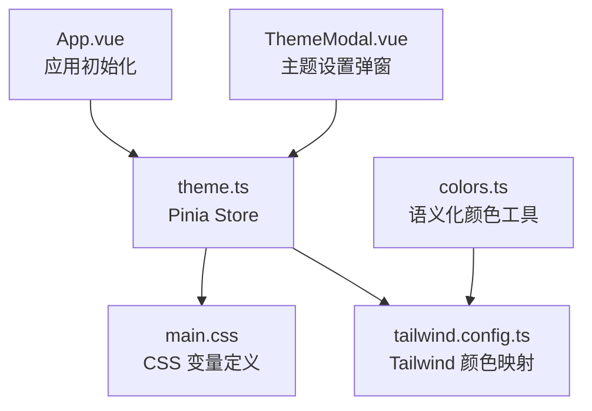
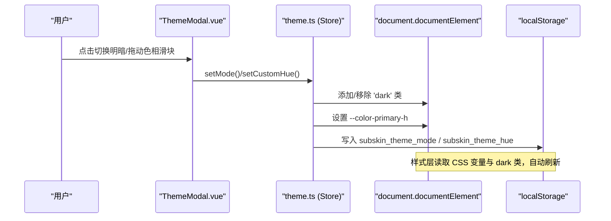
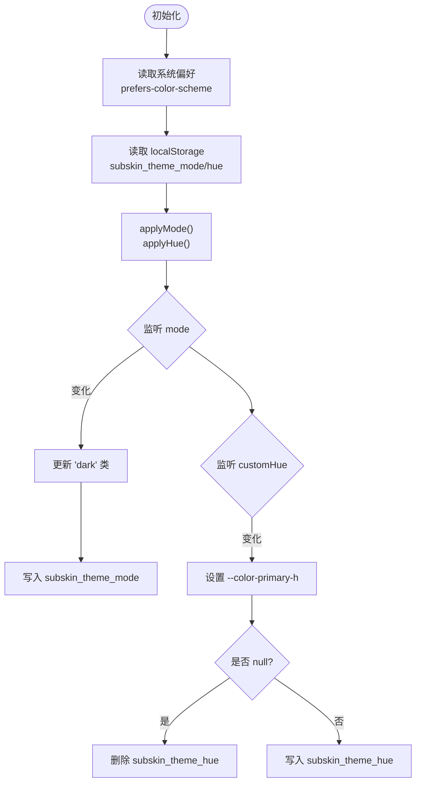
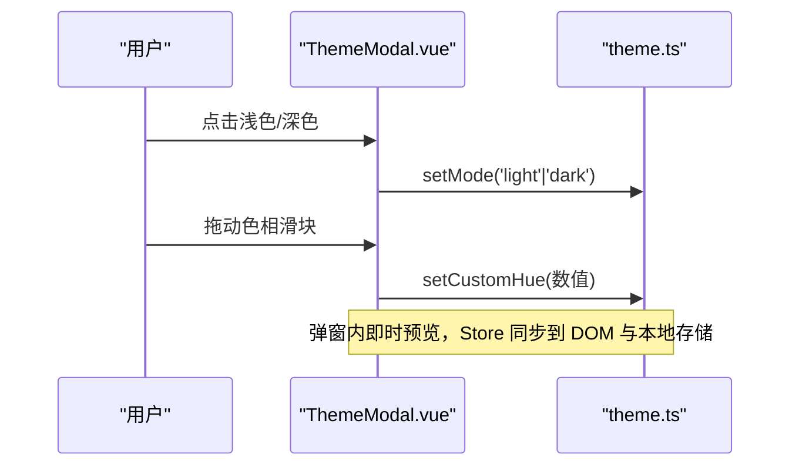
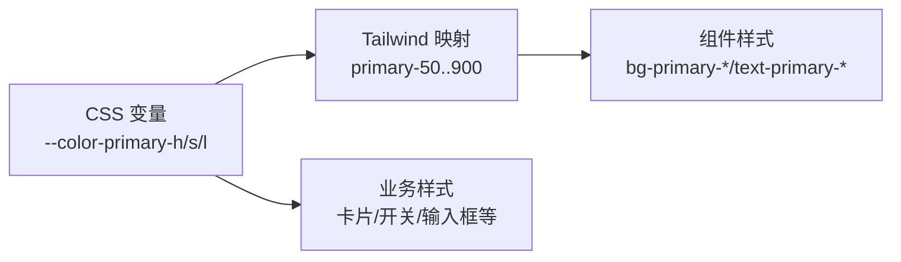
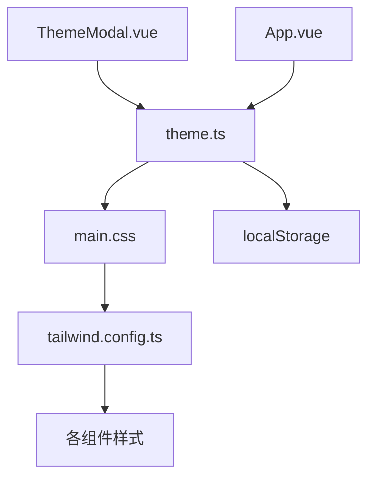

# 主题设置状态

<cite>
**本文引用的文件**
- [web/app/src/stores/theme.ts](file://web/app/src/stores/theme.ts)
- [web/app/src/components/profile/ThemeModal.vue](file://web/app/src/components/profile/ThemeModal.vue)
- [web/app/src/styles/main.css](file://web/app/src/styles/main.css)
- [web/app/tailwind.config.ts](file://web/app/tailwind.config.ts)
- [web/app/src/App.vue](file://web/app/src/App.vue)
- [web/app/src/utils/colors.ts](file://web/app/src/utils/colors.ts)
</cite>

## 目录
1. [简介](#简介)
2. [项目结构](#项目结构)
3. [核心组件](#核心组件)
4. [架构总览](#架构总览)
5. [详细组件分析](#详细组件分析)
6. [依赖关系分析](#依赖关系分析)
7. [性能考量](#性能考量)
8. [故障排查指南](#故障排查指南)
9. [结论](#结论)
10. [附录：主题开发指南与样式定制示例](#附录：主题开发指南与样式定制示例)

## 简介
本文件围绕基于 Pinia 的主题 Store 实现，系统化说明明暗模式切换、主题色（色相）配置、字体设置与自定义主题的工作机制。文档涵盖主题持久化、CSS 变量动态更新、组件样式适配、主题预览与恢复默认等能力，并提供主题开发与样式定制的最佳实践建议。

## 项目结构
主题相关代码主要分布在以下位置：
- 状态管理：stores/theme.ts
- UI 交互：components/profile/ThemeModal.vue
- 全局样式与 CSS 变量：styles/main.css
- Tailwind 主题映射：tailwind.config.ts
- 应用初始化入口：App.vue
- 语义化颜色工具：utils/colors.ts

图表来源
- [web/app/src/App.vue:19-39](file://web/app/src/App.vue#L19-L39)
- [web/app/src/stores/theme.ts:16-69](file://web/app/src/stores/theme.ts#L16-L69)
- [web/app/src/styles/main.css:5-35](file://web/app/src/styles/main.css#L5-L35)
- [web/app/tailwind.config.ts:1-62](file://web/app/tailwind.config.ts#L1-L62)
- [web/app/src/utils/colors.ts:1-99](file://web/app/src/utils/colors.ts#L1-L99)

章节来源
- [web/app/src/App.vue:19-39](file://web/app/src/App.vue#L19-L39)
- [web/app/src/stores/theme.ts:16-69](file://web/app/src/stores/theme.ts#L16-L69)
- [web/app/src/styles/main.css:5-35](file://web/app/src/styles/main.css#L5-L35)
- [web/app/tailwind.config.ts:1-62](file://web/app/tailwind.config.ts#L1-L62)
- [web/app/src/utils/colors.ts:1-99](file://web/app/src/utils/colors.ts#L1-L99)

## 核心组件
- 主题 Store（Pinia）：维护明暗模式与主题色相，负责将状态同步到 DOM 的 CSS 变量与本地存储。
- 主题设置弹窗：提供用户界面用于切换明暗模式和调整主题色相，支持恢复默认。
- 全局样式：通过 CSS 变量定义主色调族，并配合 Tailwind 的颜色映射实现全站点主题一致。
- 应用初始化：在 App.vue 中调用主题 Store，确保应用启动时即应用已保存的主题偏好。

章节来源
- [web/app/src/stores/theme.ts:16-69](file://web/app/src/stores/theme.ts#L16-L69)
- [web/app/src/components/profile/ThemeModal.vue:1-72](file://web/app/src/components/profile/ThemeModal.vue#L1-L72)
- [web/app/src/styles/main.css:5-35](file://web/app/src/styles/main.css#L5-L35)
- [web/app/src/App.vue:19-39](file://web/app/src/App.vue#L19-L39)

## 架构总览
主题系统以 Store 为中心，UI 层通过调用 Store 方法改变状态；Store 监听状态变化，实时写入 DOM 的 CSS 变量和 localStorage；样式层通过 CSS 变量与 Tailwind 映射消费这些值，从而实现“一处修改，全站生效”。

图表来源
- [web/app/src/components/profile/ThemeModal.vue:35-66](file://web/app/src/components/profile/ThemeModal.vue#L35-L66)
- [web/app/src/stores/theme.ts:26-55](file://web/app/src/stores/theme.ts#L26-L55)
- [web/app/src/styles/main.css:5-35](file://web/app/src/styles/main.css#L5-L35)
- [web/app/tailwind.config.ts:1-62](file://web/app/tailwind.config.ts#L1-L62)

## 详细组件分析

### 主题 Store（Pinia）
- 状态字段
  - mode：当前明暗模式（light/dark），初始根据系统偏好或本地存储决定。
  - customHue：自定义主题色相（0-360），null 表示使用默认色相。
- 副作用与同步
  - applyMode：在 documentElement 上添加/移除 'dark' 类，驱动 Tailwind 的 class 模式暗色主题。
  - applyHue：将 --color-primary-h 写入根节点 CSS 变量，影响所有基于该变量的颜色。
  - watch(mode)：每次切换模式时更新 DOM 并持久化到 localStorage。
  - watch(customHue)：每次色相变化时更新 CSS 变量并持久化；当为 null 时清除本地存储键。
- 对外 API
  - setMode(nextMode)：设置明暗模式。
  - setCustomHue(hue)：设置自定义色相（自动归一化到 0-360）。
  - toggleMode()：切换明暗模式。

图表来源
- [web/app/src/stores/theme.ts:16-69](file://web/app/src/stores/theme.ts#L16-L69)

章节来源
- [web/app/src/stores/theme.ts:16-69](file://web/app/src/stores/theme.ts#L16-L69)

### 主题设置弹窗（ThemeModal）
- 功能点
  - 显示/隐藏控制（v-model）。
  - 明暗模式切换按钮，直接调用 store 的 setMode。
  - 色相滑块，双向绑定本地 ref，输入事件触发 setCustomHue。
  - 恢复默认主题：将色相重置为默认值并清空自定义色相。
- 视觉反馈
  - 滑块 accentColor 随色相变化。
  - 实时色块预览当前主题色。

图表来源
- [web/app/src/components/profile/ThemeModal.vue:35-66](file://web/app/src/components/profile/ThemeModal.vue#L35-L66)
- [web/app/src/stores/theme.ts:26-63](file://web/app/src/stores/theme.ts#L26-L63)

章节来源
- [web/app/src/components/profile/ThemeModal.vue:1-72](file://web/app/src/components/profile/ThemeModal.vue#L1-L72)

### 全局样式与 CSS 变量
- 变量定义
  - :root 下定义 --color-primary-h/s/l 及衍生色阶（50-900），以及背景、表面、文本等基础变量。
  - 通过 HSL 组合生成完整的主色系，便于统一调谐。
- 字体设置
  - html 层设置全局字体栈，包含 Inter、苹方、Noto Sans SC、system-ui 等。
- Tailwind 集成
  - tailwind.config.ts 将 primary 系列映射到 CSS 变量，使任意使用 primary-* 的组件自动跟随主题色。
  - 启用 darkMode: 'class'，由 Store 在根元素添加/移除 'dark' 类驱动暗色主题。

图表来源
- [web/app/src/styles/main.css:5-35](file://web/app/src/styles/main.css#L5-L35)
- [web/app/tailwind.config.ts:1-62](file://web/app/tailwind.config.ts#L1-L62)

章节来源
- [web/app/src/styles/main.css:5-35](file://web/app/src/styles/main.css#L5-L35)
- [web/app/tailwind.config.ts:1-62](file://web/app/tailwind.config.ts#L1-L62)

### 应用初始化
- 在 App.vue 中引入并使用 useThemeStore，确保应用挂载时立即应用已保存的主题偏好。
- 同时处理移动端安全区域等全局样式属性。

章节来源
- [web/app/src/App.vue:19-39](file://web/app/src/App.vue#L19-L39)

### 语义化颜色工具
- colors.ts 提供类别标签的语义化颜色类名组合，全部基于 primary-* 变量，从而自动适配用户自定义主题色。
- 评分颜色采用固定语义色，不跟随主题色，保证跨文化一致性。

章节来源
- [web/app/src/utils/colors.ts:1-99](file://web/app/src/utils/colors.ts#L1-L99)

## 依赖关系分析
- 组件依赖
  - ThemeModal.vue 依赖 theme.ts 提供的 Store 方法与常量。
  - App.vue 在启动阶段调用 theme.ts，确保全局主题生效。
- 样式依赖
  - main.css 定义 CSS 变量，被 Tailwind 映射与组件样式消费。
  - tailwind.config.ts 将 primary 系列映射到 CSS 变量，形成“变量→映射→组件”的链路。
- 数据持久化
  - theme.ts 使用 localStorage 保存主题模式与色相，页面刷新后恢复。

图表来源
- [web/app/src/components/profile/ThemeModal.vue:1-72](file://web/app/src/components/profile/ThemeModal.vue#L1-L72)
- [web/app/src/stores/theme.ts:16-69](file://web/app/src/stores/theme.ts#L16-L69)
- [web/app/src/styles/main.css:5-35](file://web/app/src/styles/main.css#L5-L35)
- [web/app/tailwind.config.ts:1-62](file://web/app/tailwind.config.ts#L1-L62)

章节来源
- [web/app/src/stores/theme.ts:16-69](file://web/app/src/stores/theme.ts#L16-L69)
- [web/app/src/components/profile/ThemeModal.vue:1-72](file://web/app/src/components/profile/ThemeModal.vue#L1-L72)
- [web/app/src/styles/main.css:5-35](file://web/app/src/styles/main.css#L5-L35)
- [web/app/tailwind.config.ts:1-62](file://web/app/tailwind.config.ts#L1-L62)

## 性能考量
- 最小化重排：仅通过 CSS 变量与类名切换主题，避免频繁操作 DOM 布局。
- 防抖节流：若后续扩展为高频色相滑动，可考虑对 setCustomHue 进行节流以减少 localStorage 写入频率。
- 首屏体验：Store 在模块加载时即执行一次 applyMode/applyHue，确保无闪烁。
- 样式层优化：Tailwind 按需生成样式，减少打包体积。

[本节为通用性能建议，不直接引用具体文件]

## 故障排查指南
- 主题未生效
  - 检查是否在应用启动时调用了 useThemeStore（见 App.vue）。
  - 确认 documentElement 是否正确添加/移除 'dark' 类。
- 色相无效
  - 检查 --color-primary-h 是否被正确设置到根节点。
  - 确认 Tailwind 的 primary 映射是否指向 CSS 变量。
- 本地存储异常
  - 检查浏览器 localStorage 是否存在 subskin_theme_mode 与 subskin_theme_hue。
  - 若出现非法值，Store 会忽略或归一化处理，必要时可手动清理缓存。

章节来源
- [web/app/src/App.vue:19-39](file://web/app/src/App.vue#L19-L39)
- [web/app/src/stores/theme.ts:26-55](file://web/app/src/stores/theme.ts#L26-L55)
- [web/app/tailwind.config.ts:1-62](file://web/app/tailwind.config.ts#L1-L62)

## 结论
本项目通过 Pinia Store 统一管理主题状态，结合 CSS 变量与 Tailwind 映射，实现了轻量、可扩展且高性能的主题系统。用户可在设置弹窗中实时预览并持久化主题偏好，所有组件样式随之自适应。未来可在此基础上扩展字体、字号、间距等更丰富的主题维度。

[本节为总结性内容，不直接引用具体文件]

## 附录：主题开发指南与样式定制示例

### 主题开发指南
- 新增主题维度
  - 在 stores/theme.ts 中增加新的响应式状态（如字体、字号、圆角等）。
  - 在 applyXxx 函数中将新状态写入 CSS 变量（例如 --font-size-base、--border-radius-xl）。
  - 在 main.css 中定义对应变量，并在需要处消费。
  - 在 tailwind.config.ts 中扩展映射（如需通过 Tailwind 类名消费）。
- 组件适配
  - 优先使用 primary-* 语义类名，确保跟随主题色。
  - 对于非语义色（如成功/警告/错误），保持固定语义色以保证一致性。
- 持久化策略
  - 对关键主题项使用 localStorage 持久化，注意键名规范与容错解析。
- 预览与导出
  - 预览：在设置弹窗中提供实时预览区域，绑定到 Store 的状态。
  - 导出：可将当前主题变量集合序列化为 JSON，供分享或导入。

[本节为概念性指导，不直接引用具体文件]

### 样式定制示例（路径参考）
- 修改主色调基色
  - 在 main.css 中调整 --color-primary-h/s/l 的默认值，或通过 Store 动态覆盖 --color-primary-h。
  - 参考路径：[web/app/src/styles/main.css:5-35](file://web/app/src/styles/main.css#L5-L35)
- 扩展 Tailwind 颜色
  - 在 tailwind.config.ts 中为 primary 系列映射更多色阶或新增语义色。
  - 参考路径：[web/app/tailwind.config.ts:1-62](file://web/app/tailwind.config.ts#L1-L62)
- 组件中使用语义色
  - 使用 bg-primary-*/text-primary-* 等类名，自动跟随主题。
  - 参考路径：[web/app/src/utils/colors.ts:14-79](file://web/app/src/utils/colors.ts#L14-L79)

章节来源
- [web/app/src/styles/main.css:5-35](file://web/app/src/styles/main.css#L5-L35)
- [web/app/tailwind.config.ts:1-62](file://web/app/tailwind.config.ts#L1-L62)
- [web/app/src/utils/colors.ts:14-79](file://web/app/src/utils/colors.ts#L14-L79)