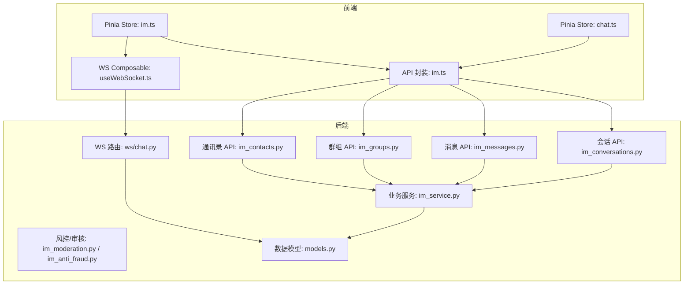
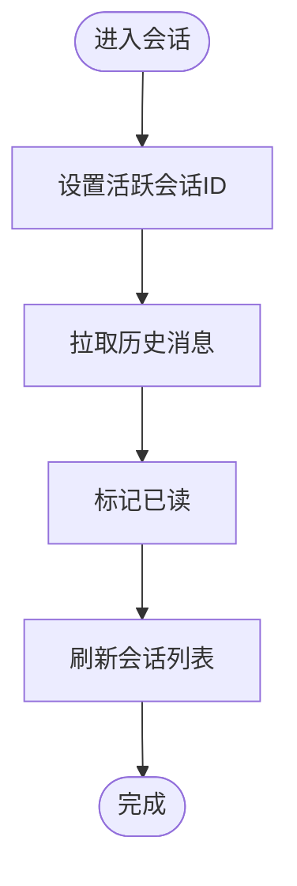
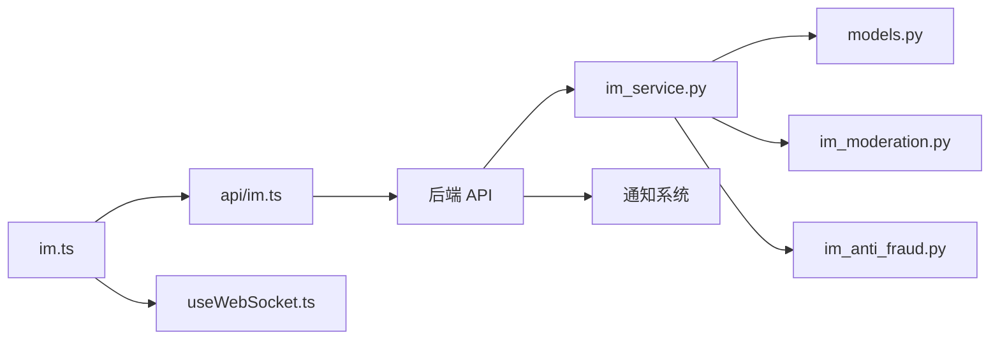

# 即时通讯状态

<cite>
**本文引用的文件**
- [web/app/src/stores/im.ts](file://web/app/src/stores/im.ts)
- [web/app/src/stores/chat.ts](file://web/app/src/stores/chat.ts)
- [web/app/src/api/im.ts](file://web/app/src/api/im.ts)
- [web/app/src/composables/useWebSocket.ts](file://web/app/src/composables/useWebSocket.ts)
- [web/backend/ws/chat.py](file://web/backend/ws/chat.py)
- [web/backend/services/im_service.py](file://web/backend/services/im_service.py)
- [web/backend/api/im_conversations.py](file://web/backend/api/im_conversations.py)
- [web/backend/api/im_messages.py](file://web/backend/api/im_messages.py)
- [web/backend/api/im_groups.py](file://web/backend/api/im_groups.py)
- [web/backend/api/im_contacts.py](file://web/backend/api/im_contacts.py)
- [web/backend/database/models.py](file://web/backend/database/models.py)
- [web/backend/services/im_moderation.py](file://web/backend/services/im_moderation.py)
- [web/backend/services/im_anti_fraud.py](file://web/backend/services/im_anti_fraud.py)
</cite>

## 目录
1. [简介](#简介)
2. [项目结构](#项目结构)
3. [核心组件](#核心组件)
4. [架构总览](#架构总览)
5. [详细组件分析](#详细组件分析)
6. [依赖关系分析](#依赖关系分析)
7. [性能考量](#性能考量)
8. [故障排查指南](#故障排查指南)
9. [结论](#结论)
10. [附录](#附录)

## 简介
本文件围绕基于 Pinia 的即时通讯（IM）前端状态管理，结合后端服务与 WebSocket 实时通道，系统化说明聊天室管理、消息收发、联系人列表、群组功能、已读回执、在线状态同步、内容审核、拉黑机制与通知系统。文档同时提供聊天室集成示例与性能优化建议，帮助开发者快速理解并扩展 IM 能力。

## 项目结构
前端采用 Vue + Pinia 进行状态管理，通过 REST API 与后端交互，并通过 WebSocket 实现实时消息推送；后端使用 FastAPI 暴露会话、消息、群组、通讯录等接口，并提供 WS 路由处理认证、心跳与已读回执。

图表来源
- [web/app/src/stores/im.ts:32-114](file://web/app/src/stores/im.ts#L32-L114)
- [web/app/src/stores/chat.ts:21-163](file://web/app/src/stores/chat.ts#L21-L163)
- [web/app/src/api/im.ts:3-53](file://web/app/src/api/im.ts#L3-L53)
- [web/app/src/composables/useWebSocket.ts:4-74](file://web/app/src/composables/useWebSocket.ts#L4-L74)
- [web/backend/api/im_conversations.py:21-103](file://web/backend/api/im_conversations.py#L21-L103)
- [web/backend/api/im_messages.py:41-78](file://web/backend/api/im_messages.py#L41-L78)
- [web/backend/api/im_groups.py:24-183](file://web/backend/api/im_groups.py#L24-L183)
- [web/backend/api/im_contacts.py:54-192](file://web/backend/api/im_contacts.py#L54-L192)
- [web/backend/services/im_service.py:26-419](file://web/backend/services/im_service.py#L26-L419)
- [web/backend/ws/chat.py:14-111](file://web/backend/ws/chat.py#L14-L111)
- [web/backend/database/models.py:956-1058](file://web/backend/database/models.py#L956-L1058)

章节来源
- [web/app/src/stores/im.ts:32-114](file://web/app/src/stores/im.ts#L32-L114)
- [web/app/src/stores/chat.ts:21-163](file://web/app/src/stores/chat.ts#L21-L163)
- [web/app/src/api/im.ts:3-53](file://web/app/src/api/im.ts#L3-L53)
- [web/app/src/composables/useWebSocket.ts:4-74](file://web/app/src/composables/useWebSocket.ts#L4-L74)
- [web/backend/api/im_conversations.py:21-103](file://web/backend/api/im_conversations.py#L21-L103)
- [web/backend/api/im_messages.py:41-78](file://web/backend/api/im_messages.py#L41-L78)
- [web/backend/api/im_groups.py:24-183](file://web/backend/api/im_groups.py#L24-L183)
- [web/backend/api/im_contacts.py:54-192](file://web/backend/api/im_contacts.py#L54-L192)
- [web/backend/services/im_service.py:26-419](file://web/backend/services/im_service.py#L26-L419)
- [web/backend/ws/chat.py:14-111](file://web/backend/ws/chat.py#L14-L111)
- [web/backend/database/models.py:956-1058](file://web/backend/database/models.py#L956-L1058)

## 核心组件
- 前端 IM Store（im.ts）：维护会话列表、当前会话消息、活跃会话 ID、未读数；负责加载会话、打开会话、发送消息、初始化 WebSocket 并订阅 message.new、message.recall、unread_update 事件。
- 前端聊天 Store（chat.ts）：面向 AI 助手对话的消息流式渲染、思考态、动作卡片、会话列表与历史加载。
- WebSocket 组合式函数（useWebSocket.ts）：封装连接、重连、ping/pong、事件分发与生命周期清理。
- 后端会话 API（im_conversations.py）：列出会话、创建私聊、分页获取消息、标记已读、置顶切换。
- 后端消息 API（im_messages.py）：发送消息（含速率限制）、撤回消息。
- 后端群组 API（im_groups.py）：创建群、成员增删、群信息更新。
- 后端通讯录 API（im_contacts.py）：手机号哈希匹配好友、用户名搜索。
- 后端业务服务（im_service.py）：会话与消息核心逻辑、未读数计算、通知生成、拉黑校验、禁言控制。
- 后端 WS 路由（ws/chat.py）：鉴权、连接管理、心跳、已读回执落库。
- 数据模型（models.py）：会话、成员、消息、已读记录、风控记录等 ORM 定义。
- 风控与反欺诈（im_moderation.py、im_anti_fraud.py）：敏感词过滤、LLM 审核、违规计数、机器人行为检测。

章节来源
- [web/app/src/stores/im.ts:32-114](file://web/app/src/stores/im.ts#L32-L114)
- [web/app/src/stores/chat.ts:21-163](file://web/app/src/stores/chat.ts#L21-L163)
- [web/app/src/composables/useWebSocket.ts:4-74](file://web/app/src/composables/useWebSocket.ts#L4-L74)
- [web/backend/api/im_conversations.py:21-103](file://web/backend/api/im_conversations.py#L21-L103)
- [web/backend/api/im_messages.py:41-78](file://web/backend/api/im_messages.py#L41-L78)
- [web/backend/api/im_groups.py:24-183](file://web/backend/api/im_groups.py#L24-L183)
- [web/backend/api/im_contacts.py:54-192](file://web/backend/api/im_contacts.py#L54-L192)
- [web/backend/services/im_service.py:26-419](file://web/backend/services/im_service.py#L26-L419)
- [web/backend/ws/chat.py:14-111](file://web/backend/ws/chat.py#L14-L111)
- [web/backend/database/models.py:956-1058](file://web/backend/database/models.py#L956-L1058)
- [web/backend/services/im_moderation.py:36-148](file://web/backend/services/im_moderation.py#L36-L148)
- [web/backend/services/im_anti_fraud.py:14-83](file://web/backend/services/im_anti_fraud.py#L14-L83)

## 架构总览
下图展示从前端到后端的完整调用链，包括 REST 与 WS 两条路径，以及数据库与通知系统的参与。

```mermaid
sequenceDiagram
participant UI as "前端界面"
participant Store as "Pinia Store (im.ts)"
participant WS as "useWebSocket.ts"
participant API as "REST API"
participant Svc as "ImService"
participant DB as "数据库"
participant Notif as "通知系统"
participant WSEnd as "WS 路由 (ws/chat.py)"
UI->>Store : 打开会话/发送消息
Store->>API : GET/POST 会话与消息
API->>Svc : 执行业务逻辑
Svc->>DB : 读写会话/消息/成员
Svc-->>Notif : 创建消息通知
Store->>WS : initWS() 连接
WS->>WSEnd : 建立 WS 连接(携带token)
WSEnd-->>WS : 心跳/事件(如 unread_update)
Note over Store,WS : 订阅 message.new/message.recall/unread_update
```

图表来源
- [web/app/src/stores/im.ts:41-102](file://web/app/src/stores/im.ts#L41-L102)
- [web/app/src/composables/useWebSocket.ts:11-74](file://web/app/src/composables/useWebSocket.ts#L11-L74)
- [web/backend/api/im_conversations.py:21-103](file://web/backend/api/im_conversations.py#L21-L103)
- [web/backend/api/im_messages.py:41-78](file://web/backend/api/im_messages.py#L41-L78)
- [web/backend/services/im_service.py:215-286](file://web/backend/services/im_service.py#L215-L286)
- [web/backend/ws/chat.py:45-111](file://web/backend/ws/chat.py#L45-L111)

## 详细组件分析

### 前端 IM Store（im.ts）
- 职责
  - 维护 conversations、currentMessages、activeConversationId、totalUnread。
  - 加载会话列表、打开会话并拉取历史消息、标记已读。
  - 发送消息并追加至本地消息列表，刷新会话列表。
  - 初始化 WebSocket，订阅新消息、撤回、未读更新事件。
- 关键流程
  - 打开会话：设置 activeConversationId -> 拉取消息 -> 标记已读 -> 刷新会话列表。
  - 发送消息：构造请求 -> 成功后追加消息 -> 刷新会话列表。
  - WS 事件：message.new 推入当前会话；message.recall 标记撤回；unread_update 刷新会话。
- 复杂度与优化
  - 未读数统计为 O(n)，可通过增量更新优化。
  - 消息列表追加为 O(1)，注意去重与滚动定位。

图表来源
- [web/app/src/stores/im.ts:50-60](file://web/app/src/stores/im.ts#L50-L60)

章节来源
- [web/app/src/stores/im.ts:32-114](file://web/app/src/stores/im.ts#L32-L114)

### 前端聊天 Store（chat.ts）
- 职责
  - 管理 AI 助手对话消息流、思考阶段、动作卡片、附件。
  - 会话列表与历史加载、删除会话。
- 关键点
  - 流式 token 写入时进行内容清洗，避免暴露内部异常类名。
  - 支持骨架屏与思考提示，提升用户体验。

章节来源
- [web/app/src/stores/chat.ts:21-163](file://web/app/src/stores/chat.ts#L21-L163)

### WebSocket 组合式函数（useWebSocket.ts）
- 职责
  - 建立 WS 连接、自动重连、心跳保活、事件分发、销毁清理。
- 关键点
  - 使用 token 鉴权，协议根据页面协议选择 ws/wss。
  - 支持通配符监听器“*”以捕获所有事件。

章节来源
- [web/app/src/composables/useWebSocket.ts:4-74](file://web/app/src/composables/useWebSocket.ts#L4-L74)

### 后端会话 API（im_conversations.py）
- 端点
  - 列出会话、创建私聊、获取消息、标记已读、置顶切换。
- 权限与校验
  - 通过 auth 中间件获取当前用户；获取消息需具备会话成员权限。
- 未读数
  - 基于 last_read_at 与消息时间戳计算未读数量。

章节来源
- [web/backend/api/im_conversations.py:21-103](file://web/backend/api/im_conversations.py#L21-L103)

### 后端消息 API（im_messages.py）
- 端点
  - 发送消息（带每分钟速率限制）、撤回消息（限时）。
- 风控
  - 发送频率限制防止滥用；撤回限制在 2 分钟内。

章节来源
- [web/backend/api/im_messages.py:41-78](file://web/backend/api/im_messages.py#L41-L78)

### 后端群组 API（im_groups.py）
- 端点
  - 创建群、成员列表、添加/移除成员、更新群信息。
- 权限
  - 仅 owner/admin 可执行管理操作。

章节来源
- [web/backend/api/im_groups.py:24-183](file://web/backend/api/im_groups.py#L24-L183)

### 后端通讯录 API（im_contacts.py）
- 隐私设计
  - 客户端仅上传手机号 SHA256 哈希，服务端不接收明文手机号。
  - 仅对开启隐私可见且允许手机号发现的用户进行匹配。
- 功能
  - 手机号哈希匹配、用户名搜索，返回是否好友或待处理请求。

章节来源
- [web/backend/api/im_contacts.py:54-192](file://web/backend/api/im_contacts.py#L54-L192)

### 后端业务服务（im_service.py）
- 会话与消息
  - 私聊会话创建与复用、成员校验、禁言控制、未读数计算。
  - 消息发送后更新会话最后消息时间，并为其他成员创建通知。
  - 消息撤回校验（仅本人、2分钟内）。
- 好友系统
  - 好友请求、接受、查询好友列表。
- 拉黑机制
  - 创建私聊前检查双方是否存在拉黑关系，阻止通信。

章节来源
- [web/backend/services/im_service.py:32-88](file://web/backend/services/im_service.py#L32-L88)
- [web/backend/services/im_service.py:90-194](file://web/backend/services/im_service.py#L90-L194)
- [web/backend/services/im_service.py:215-286](file://web/backend/services/im_service.py#L215-L286)
- [web/backend/services/im_service.py:315-331](file://web/backend/services/im_service.py#L315-L331)
- [web/backend/services/im_service.py:335-419](file://web/backend/services/im_service.py#L335-L419)

### 后端 WS 路由（ws/chat.py）
- 功能
  - 鉴权、连接管理、心跳响应、已读回执落库。
- 已读回执
  - 校验用户是否为消息所属会话成员，写入 ImMessageRead，避免越权。

章节来源
- [web/backend/ws/chat.py:14-111](file://web/backend/ws/chat.py#L14-L111)

### 数据模型（models.py）
- IM 相关实体
  - 会话（私聊/群聊）、成员（角色、静音、置顶、最后阅读时间）、消息（类型、内容、元数据、引用、撤回）、已读记录、风控记录。
- 关联关系
  - 会话与成员多对多、消息与会话一对多、已读记录与消息一对一。

章节来源
- [web/backend/database/models.py:956-1058](file://web/backend/database/models.py#L956-L1058)

### 内容审核与反欺诈（im_moderation.py、im_anti_fraud.py）
- 内容审核
  - 敏感词快速命中；否则调用 LLM 进行风险分级与分类；高风险直接屏蔽并记录违规。
- 反欺诈
  - 检测重复内容跨多会话、短时间高频发送、机器人行为特征（间隔均匀、内容单一）。

章节来源
- [web/backend/services/im_moderation.py:36-148](file://web/backend/services/im_moderation.py#L36-L148)
- [web/backend/services/im_anti_fraud.py:14-83](file://web/backend/services/im_anti_fraud.py#L14-L83)

## 依赖关系分析
- 前端依赖
  - im.ts 依赖 api/im.ts 与 composables/useWebSocket.ts。
  - chat.ts 依赖 api/chat.ts（用于助手对话）。
- 后端依赖
  - 各 API 路由依赖 services/auth、services/im_service、database/models。
  - WS 路由依赖 services/auth 与 database/models。
- 外部集成
  - 通知系统：消息发送后创建站内通知。
  - LLM 审核：可选配置，失败时降级为安全策略。

图表来源
- [web/app/src/stores/im.ts:32-114](file://web/app/src/stores/im.ts#L32-L114)
- [web/app/src/api/im.ts:3-53](file://web/app/src/api/im.ts#L3-L53)
- [web/backend/services/im_service.py:26-419](file://web/backend/services/im_service.py#L26-L419)
- [web/backend/database/models.py:956-1058](file://web/backend/database/models.py#L956-L1058)
- [web/backend/services/im_moderation.py:36-148](file://web/backend/services/im_moderation.py#L36-L148)
- [web/backend/services/im_anti_fraud.py:14-83](file://web/backend/services/im_anti_fraud.py#L14-L83)

章节来源
- [web/app/src/stores/im.ts:32-114](file://web/app/src/stores/im.ts#L32-L114)
- [web/backend/services/im_service.py:26-419](file://web/backend/services/im_service.py#L26-L419)
- [web/backend/database/models.py:956-1058](file://web/backend/database/models.py#L956-L1058)

## 性能考量
- 前端
  - 未读数统计可改为增量累加，避免每次遍历会话列表。
  - 消息列表分页加载，避免一次性加载过多历史消息。
  - WebSocket 事件处理中仅更新当前活跃会话，减少无关渲染。
- 后端
  - 会话列表查询使用索引字段（last_message_at、conversation_id、created_at）提升排序与过滤效率。
  - 消息发送增加速率限制，防止滥用。
  - 已读回执批量写入，减少数据库往返。
  - 内容审核异步化，避免阻塞主流程。
- 网络
  - WS 心跳间隔合理（如 30 秒），重连退避策略避免雪崩。
  - 使用 HTTPS/WSS 保障传输安全。

[本节为通用指导，无需具体文件来源]

## 故障排查指南
- 无法收到新消息
  - 检查 WS 连接是否建立成功、是否收到 pong。
  - 确认前端是否正确订阅 message.new 事件。
  - 查看后端日志是否有 WS 错误或断开。
- 未读数不更新
  - 确认 markRead 是否调用成功。
  - 检查 unread_update 事件是否触发。
- 消息撤回无效
  - 确认是否在 2 分钟内且为本人消息。
  - 检查 message.recall 事件是否被前端处理。
- 内容审核失败
  - 检查 LLM 配置是否可用，失败时是否回退为安全策略。
  - 查看违规记录与用户违规档案是否更新。
- 通讯录匹配无结果
  - 确认对方是否开启隐私可见与手机号发现。
  - 检查客户端是否正确计算并发送手机号哈希。

章节来源
- [web/backend/ws/chat.py:45-111](file://web/backend/ws/chat.py#L45-L111)
- [web/backend/api/im_conversations.py:64-81](file://web/backend/api/im_conversations.py#L64-L81)
- [web/backend/services/im_service.py:315-331](file://web/backend/services/im_service.py#L315-L331)
- [web/backend/services/im_moderation.py:36-148](file://web/backend/services/im_moderation.py#L36-L148)
- [web/backend/api/im_contacts.py:54-132](file://web/backend/api/im_contacts.py#L54-L132)

## 结论
该 IM 系统以前端 Pinia Store 为核心状态入口，结合 REST API 与 WebSocket 实现高内聚、低耦合的聊天能力。后端通过服务层统一处理会话、消息、群组、通讯录与风控，配合数据库模型确保数据一致性与安全性。建议在后续迭代中引入更完善的离线缓存、消息去重、富媒体处理与更细粒度的权限控制，以提升体验与可扩展性。

[本节为总结，无需具体文件来源]

## 附录

### 聊天室集成示例（步骤）
- 初始化 WS 连接并在应用启动时建立。
- 进入聊天室时调用 openConversation 拉取历史消息并标记已读。
- 发送消息时调用 sendMessage，成功后刷新会话列表。
- 订阅 WS 事件：message.new 追加消息、message.recall 更新撤回状态、unread_update 刷新未读数。
- 退出聊天室时关闭 WS 或卸载监听器。

章节来源
- [web/app/src/stores/im.ts:82-102](file://web/app/src/stores/im.ts#L82-L102)
- [web/app/src/composables/useWebSocket.ts:55-67](file://web/app/src/composables/useWebSocket.ts#L55-L67)

### 消息加密与内容审核
- 传输层加密：使用 WSS/HTTPS 保证链路安全。
- 内容审核：敏感词快速命中，否则调用 LLM 进行风险分级；高风险直接屏蔽并记录违规。
- 反欺诈：检测重复内容与高频发送，识别机器人行为。

章节来源
- [web/backend/services/im_moderation.py:36-148](file://web/backend/services/im_moderation.py#L36-L148)
- [web/backend/services/im_anti_fraud.py:14-83](file://web/backend/services/im_anti_fraud.py#L14-L83)

### 拉黑功能与通知系统
- 拉黑：创建私聊前检查双方是否存在拉黑关系，阻止通信。
- 通知：消息发送后为其他成员创建站内通知，便于用户感知。

章节来源
- [web/backend/services/im_service.py:32-88](file://web/backend/services/im_service.py#L32-L88)
- [web/backend/services/im_service.py:260-286](file://web/backend/services/im_service.py#L260-L286)