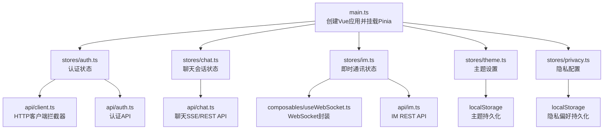
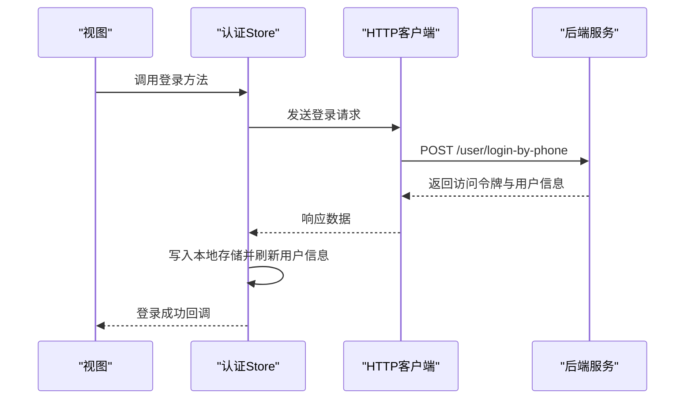
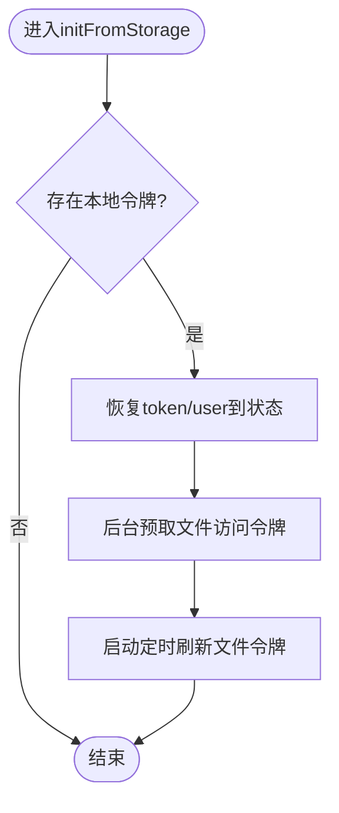
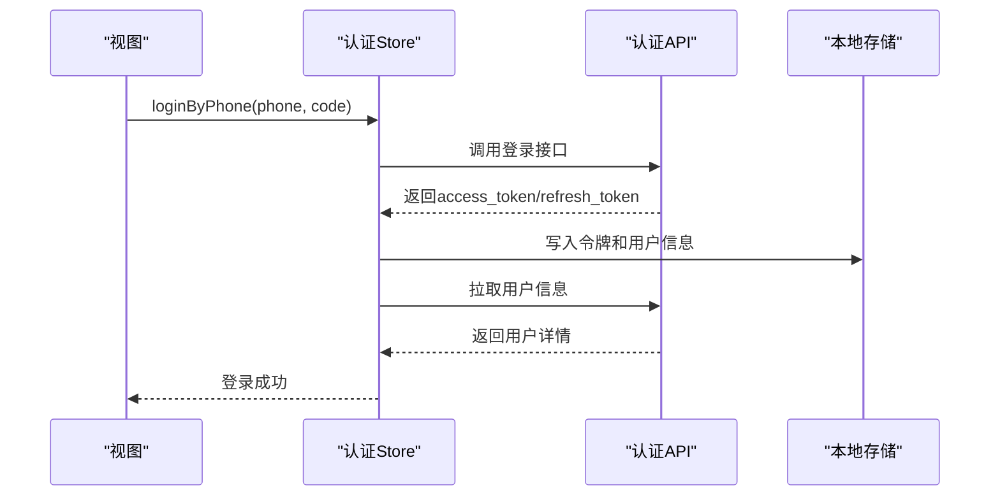
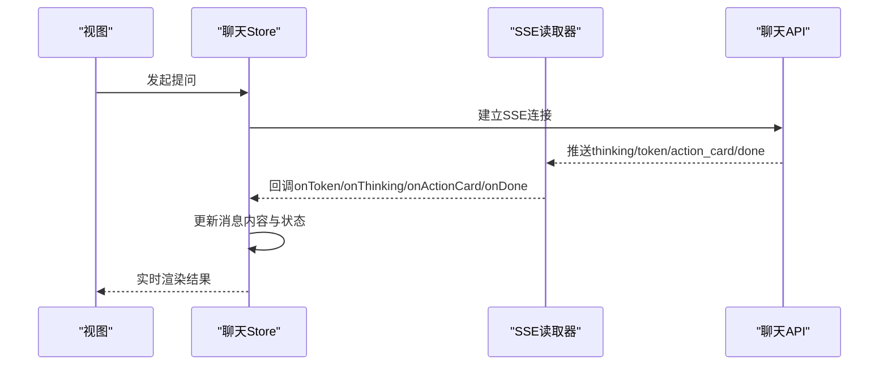
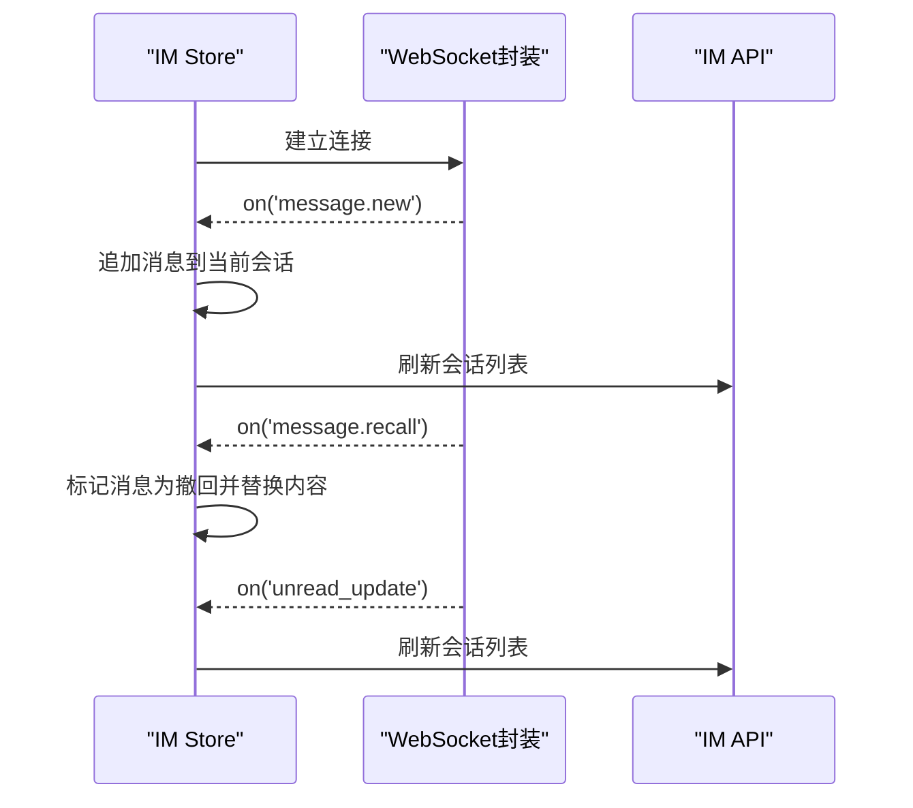
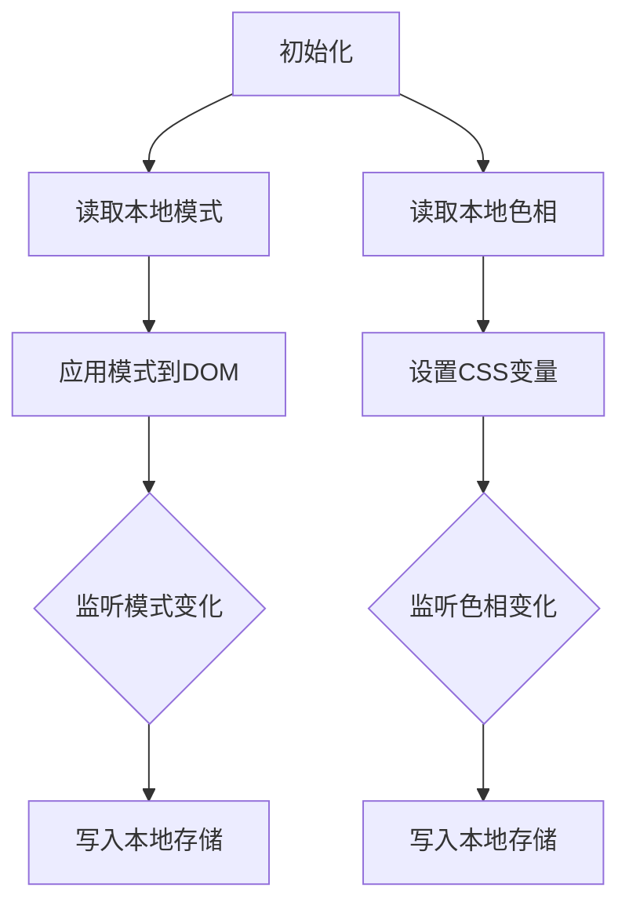
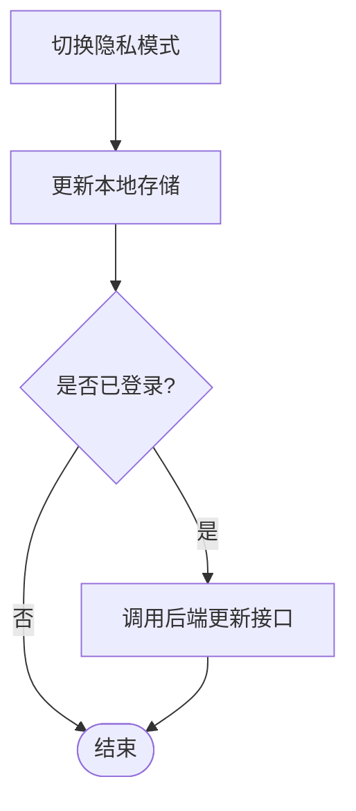
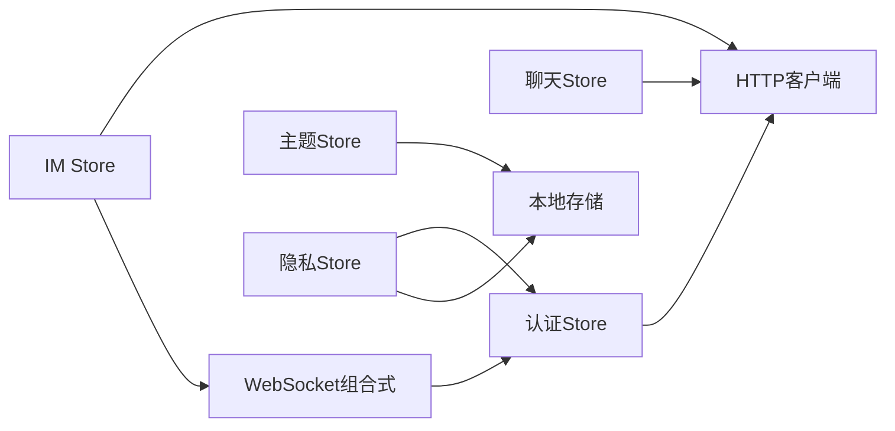

# 状态管理

<cite>
**本文引用的文件**
- [web/app/src/stores/auth.ts](file://web/app/src/stores/auth.ts)
- [web/app/src/stores/chat.ts](file://web/app/src/stores/chat.ts)
- [web/app/src/stores/im.ts](file://web/app/src/stores/im.ts)
- [web/app/src/stores/theme.ts](file://web/app/src/stores/theme.ts)
- [web/app/src/stores/privacy.ts](file://web/app/src/stores/privacy.ts)
- [web/app/src/api/client.ts](file://web/app/src/api/client.ts)
- [web/app/src/api/auth.ts](file://web/app/src/api/auth.ts)
- [web/app/src/api/chat.ts](file://web/app/src/api/chat.ts)
- [web/app/src/api/im.ts](file://web/app/src/api/im.ts)
- [web/app/src/composables/useWebSocket.ts](file://web/app/src/composables/useWebSocket.ts)
- [web/app/src/types/index.ts](file://web/app/src/types/index.ts)
- [web/app/src/main.ts](file://web/app/src/main.ts)
</cite>

## 目录
1. [简介](#简介)
2. [项目结构](#项目结构)
3. [核心组件](#核心组件)
4. [架构总览](#架构总览)
5. [详细组件分析](#详细组件分析)
6. [依赖关系分析](#依赖关系分析)
7. [性能考虑](#性能考虑)
8. [故障排查指南](#故障排查指南)
9. [结论](#结论)
10. [附录](#附录)

## 简介
本文件系统性梳理基于 Pinia 的前端状态管理方案，覆盖用户认证、聊天会话、即时通讯、主题设置与隐私配置五大领域。文档从 Store 设计模式、状态持久化、异步操作处理、状态同步机制入手，提供状态流转图、调试建议、性能优化策略与常见问题解决方案，帮助读者快速理解并高效维护该项目的状态层。

## 项目结构
前端应用通过 main.ts 初始化 Vue 应用并挂载 Pinia；各功能域以独立的 Store 组织（auth、chat、im、theme、privacy），并通过 api 层与后端交互；通用能力如 WebSocket 连接封装在 composables 中供 IM Store 复用。

图表来源
- [web/app/src/main.ts:1-11](file://web/app/src/main.ts#L1-L11)
- [web/app/src/stores/auth.ts:1-259](file://web/app/src/stores/auth.ts#L1-L259)
- [web/app/src/stores/chat.ts:1-164](file://web/app/src/stores/chat.ts#L1-L164)
- [web/app/src/stores/im.ts:1-116](file://web/app/src/stores/im.ts#L1-L116)
- [web/app/src/stores/theme.ts:1-71](file://web/app/src/stores/theme.ts#L1-L71)
- [web/app/src/stores/privacy.ts:1-91](file://web/app/src/stores/privacy.ts#L1-L91)
- [web/app/src/api/client.ts:1-84](file://web/app/src/api/client.ts#L1-L84)
- [web/app/src/api/auth.ts:1-195](file://web/app/src/api/auth.ts#L1-L195)
- [web/app/src/api/chat.ts:1-272](file://web/app/src/api/chat.ts#L1-L272)
- [web/app/src/api/im.ts:1-54](file://web/app/src/api/im.ts#L1-L54)
- [web/app/src/composables/useWebSocket.ts:1-75](file://web/app/src/composables/useWebSocket.ts#L1-L75)

章节来源
- [web/app/src/main.ts:1-11](file://web/app/src/main.ts#L1-L11)

## 核心组件
- 认证状态 Store：负责登录/注册、令牌刷新、用户信息获取与本地持久化，并提供登出清理逻辑。
- 聊天会话 Store：管理消息列表、对话上下文、流式响应渲染、动作卡片与思考阶段提示。
- 即时通讯 Store：管理会话列表、当前会话消息、未读计数，并通过 WebSocket 实时推送消息与撤回事件。
- 主题设置 Store：管理明暗模式与主色调，持久化到 localStorage 并动态更新 DOM。
- 隐私配置 Store：管理隐私模式开关，同步到后端并影响数据脱敏展示。

章节来源
- [web/app/src/stores/auth.ts:1-259](file://web/app/src/stores/auth.ts#L1-L259)
- [web/app/src/stores/chat.ts:1-164](file://web/app/src/stores/chat.ts#L1-L164)
- [web/app/src/stores/im.ts:1-116](file://web/app/src/stores/im.ts#L1-L116)
- [web/app/src/stores/theme.ts:1-71](file://web/app/src/stores/theme.ts#L1-L71)
- [web/app/src/stores/privacy.ts:1-91](file://web/app/src/stores/privacy.ts#L1-L91)

## 架构总览
整体采用“Store + API + Composable”的分层架构：
- Store 负责状态定义、变更与业务编排。
- API 层统一封装 HTTP 请求，集中处理鉴权头注入、401 自动刷新与错误归一化。
- Composable 提供跨 Store 复用的能力（如 WebSocket 连接管理）。

图表来源
- [web/app/src/stores/auth.ts:81-107](file://web/app/src/stores/auth.ts#L81-L107)
- [web/app/src/api/auth.ts:59-67](file://web/app/src/api/auth.ts#L59-L67)
- [web/app/src/api/client.ts:11-22](file://web/app/src/api/client.ts#L11-L22)

## 详细组件分析

### 认证状态（auth）
- 状态字段：访问令牌、刷新令牌、用户对象、登录态计算属性、登录弹窗状态。
- 持久化：将令牌与用户信息写入 localStorage；登录弹窗状态使用 sessionStorage。
- 异步流程：
  - 登录/注册后保存令牌、拉取用户信息、预取文件访问令牌并启动定时刷新。
  - 拉取用户失败时尝试刷新令牌，失败则登出。
  - 登出时先尝试服务端注销，再清理本地状态与文件令牌。
- 错误处理：捕获网络或权限错误，必要时触发全局刷新或清理。

图表来源
- [web/app/src/stores/auth.ts:33-61](file://web/app/src/stores/auth.ts#L33-L61)

图表来源
- [web/app/src/stores/auth.ts:81-86](file://web/app/src/stores/auth.ts#L81-L86)
- [web/app/src/stores/auth.ts:72-79](file://web/app/src/stores/auth.ts#L72-L79)
- [web/app/src/api/auth.ts:59-67](file://web/app/src/api/auth.ts#L59-L67)

章节来源
- [web/app/src/stores/auth.ts:1-259](file://web/app/src/stores/auth.ts#L1-L259)
- [web/app/src/api/auth.ts:1-195](file://web/app/src/api/auth.ts#L1-L195)
- [web/app/src/api/client.ts:24-82](file://web/app/src/api/client.ts#L24-L82)

### 聊天会话（chat）
- 状态字段：消息列表、当前对话ID、加载状态、历史对话列表。
- 流式处理：通过 SSE 读取 token 流，逐步拼接内容，并在完成时清洗异常文本、附加来源与动作卡片。
- 会话管理：支持加载/删除对话、清空聊天记录、添加思考阶段提示。

图表来源
- [web/app/src/stores/chat.ts:21-164](file://web/app/src/stores/chat.ts#L21-L164)
- [web/app/src/api/chat.ts:75-125](file://web/app/src/api/chat.ts#L75-L125)
- [web/app/src/api/chat.ts:168-272](file://web/app/src/api/chat.ts#L168-L272)

章节来源
- [web/app/src/stores/chat.ts:1-164](file://web/app/src/stores/chat.ts#L1-L164)
- [web/app/src/api/chat.ts:1-272](file://web/app/src/api/chat.ts#L1-L272)

### 即时通讯（im）
- 状态字段：会话列表、当前会话消息、活跃会话ID、未读总数、连接状态。
- 实时通信：通过 WebSocket 接收新消息、消息撤回、未读更新等事件，并同步到当前会话与会话列表。
- 业务操作：打开会话、发送消息、标记已读、置顶等。

图表来源
- [web/app/src/stores/im.ts:32-116](file://web/app/src/stores/im.ts#L32-L116)
- [web/app/src/composables/useWebSocket.ts:1-75](file://web/app/src/composables/useWebSocket.ts#L1-L75)
- [web/app/src/api/im.ts:1-54](file://web/app/src/api/im.ts#L1-L54)

章节来源
- [web/app/src/stores/im.ts:1-116](file://web/app/src/stores/im.ts#L1-L116)
- [web/app/src/composables/useWebSocket.ts:1-75](file://web/app/src/composables/useWebSocket.ts#L1-L75)
- [web/app/src/api/im.ts:1-54](file://web/app/src/api/im.ts#L1-L54)

### 主题设置（theme）
- 状态字段：模式（明/暗）、自定义色相值。
- 持久化：读写 localStorage，监听变化并应用到 DOM（类名切换与CSS变量设置）。
- 行为：根据系统偏好初始化模式，支持手动切换与色相调节。

图表来源
- [web/app/src/stores/theme.ts:1-71](file://web/app/src/stores/theme.ts#L1-L71)

章节来源
- [web/app/src/stores/theme.ts:1-71](file://web/app/src/stores/theme.ts#L1-L71)

### 隐私配置（privacy）
- 状态字段：隐私模式开关。
- 持久化：本地存储默认发帖私密性与分享追踪开关，并与后端同步。
- 行为：切换隐私模式时更新本地与远端，并提供手机号与邮箱的脱敏函数。

图表来源
- [web/app/src/stores/privacy.ts:1-91](file://web/app/src/stores/privacy.ts#L1-L91)

章节来源
- [web/app/src/stores/privacy.ts:1-91](file://web/app/src/stores/privacy.ts#L1-L91)

## 依赖关系分析
- Store 之间耦合度低，主要通过 API 层与外部资源交互；auth 被 privacy 与 WebSocket 组合式函数间接依赖。
- API 层集中处理鉴权头注入与 401 重试，降低 Store 的重复逻辑。
- WebSocket 组合式函数解耦 IM Store 的连接细节，便于复用与维护。

图表来源
- [web/app/src/stores/auth.ts:1-259](file://web/app/src/stores/auth.ts#L1-L259)
- [web/app/src/stores/chat.ts:1-164](file://web/app/src/stores/chat.ts#L1-L164)
- [web/app/src/stores/im.ts:1-116](file://web/app/src/stores/im.ts#L1-L116)
- [web/app/src/stores/theme.ts:1-71](file://web/app/src/stores/theme.ts#L1-L71)
- [web/app/src/stores/privacy.ts:1-91](file://web/app/src/stores/privacy.ts#L1-L91)
- [web/app/src/api/client.ts:1-84](file://web/app/src/api/client.ts#L1-L84)
- [web/app/src/composables/useWebSocket.ts:1-75](file://web/app/src/composables/useWebSocket.ts#L1-L75)

章节来源
- [web/app/src/api/client.ts:1-84](file://web/app/src/api/client.ts#L1-L84)
- [web/app/src/composables/useWebSocket.ts:1-75](file://web/app/src/composables/useWebSocket.ts#L1-L75)

## 性能考虑
- 令牌刷新去重：HTTP 客户端使用单例 Promise 合并并发 401 刷新请求，避免风暴式刷新。
- 流式渲染：聊天 Store 通过 SSE 增量更新消息内容，减少整包传输与渲染开销。
- 本地缓存：主题与隐私偏好使用 localStorage 持久化，避免重复请求与初始化成本。
- 文件令牌定时刷新：认证 Store 定期刷新短生命周期文件令牌，降低长会话中的回退风险。
- 消息列表局部更新：IM Store 仅对当前会话进行追加与状态修改，避免全量重建。

[本节为通用性能建议，不直接分析具体文件]

## 故障排查指南
- 401 未授权：
  - 检查是否有刷新令牌；若无则清除本地状态并强制刷新页面。
  - 若存在刷新令牌，客户端会尝试刷新并重新发起原请求。
- 流式读取失败：
  - 检查浏览器是否支持 ReadableStream；确认网络与后端 SSE 端点可达。
  - 关注 toFriendlyError 转换后的友好文案，定位是否为限流、超时或授权问题。
- WebSocket 断线：
  - 组合式函数具备自动重连机制，观察 connected 状态与重连次数。
  - 确保 token 有效且后端 ws 路由可访问。
- 本地存储不一致：
  - 主题与隐私相关状态均依赖 localStorage，注意键名一致性与类型转换。
  - 认证状态涉及多个 key（令牌、用户、刷新令牌），登出时需全部清理。

章节来源
- [web/app/src/api/client.ts:24-82](file://web/app/src/api/client.ts#L24-L82)
- [web/app/src/api/chat.ts:116-166](file://web/app/src/api/chat.ts#L116-L166)
- [web/app/src/composables/useWebSocket.ts:44-53](file://web/app/src/composables/useWebSocket.ts#L44-L53)
- [web/app/src/stores/theme.ts:21-55](file://web/app/src/stores/theme.ts#L21-L55)
- [web/app/src/stores/privacy.ts:8-15](file://web/app/src/stores/privacy.ts#L8-L15)
- [web/app/src/stores/auth.ts:210-227](file://web/app/src/stores/auth.ts#L210-L227)

## 结论
本项目采用清晰的 Pinia Store 分层与统一的 API 客户端，实现了认证、聊天、即时通讯、主题与隐私等关键领域的状态管理。通过本地持久化、流式渲染、WebSocket 实时通信与令牌刷新去重等机制，兼顾了用户体验与系统稳定性。建议在后续迭代中继续遵循单一职责原则，保持 Store 轻量、API 层健壮、组合式函数可复用，以提升可维护性与扩展性。

## 附录
- 类型定义参考：用户、聊天消息、附件、动作卡片、社区帖子、评估快照等类型集中在 types/index.ts，便于跨模块共享与校验。
- 应用入口：main.ts 中创建并挂载 Pinia，确保所有 Store 可用。

章节来源
- [web/app/src/types/index.ts:1-420](file://web/app/src/types/index.ts#L1-L420)
- [web/app/src/main.ts:1-11](file://web/app/src/main.ts#L1-L11)