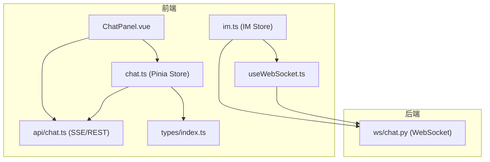
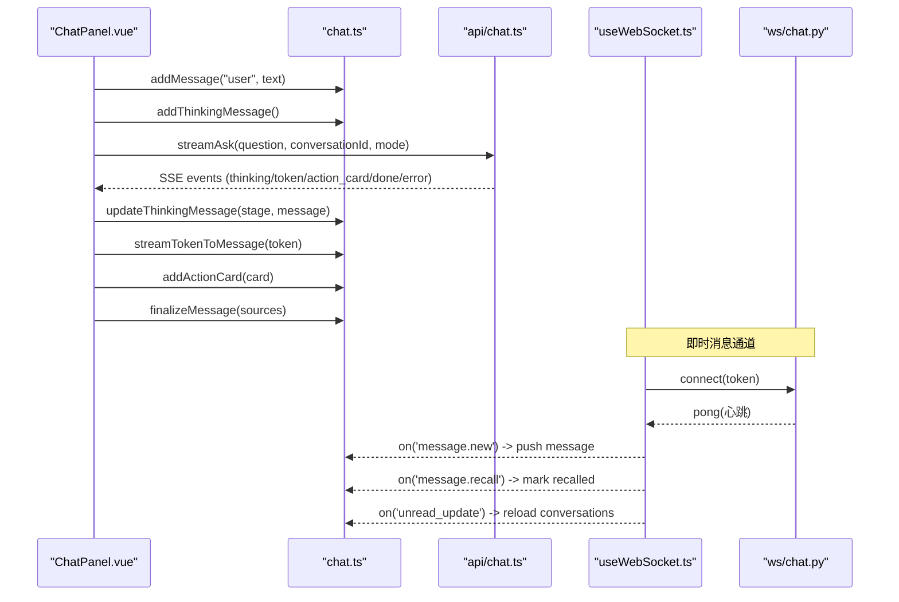
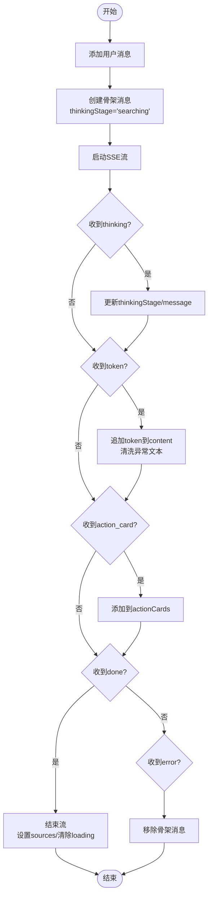
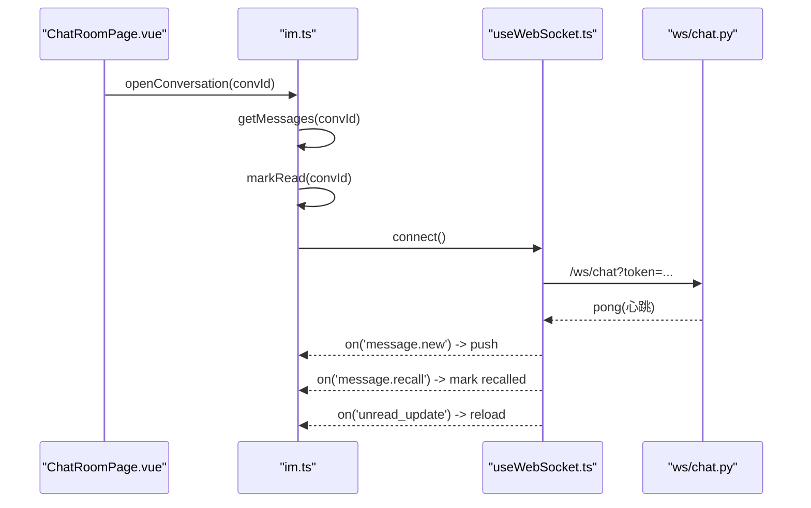
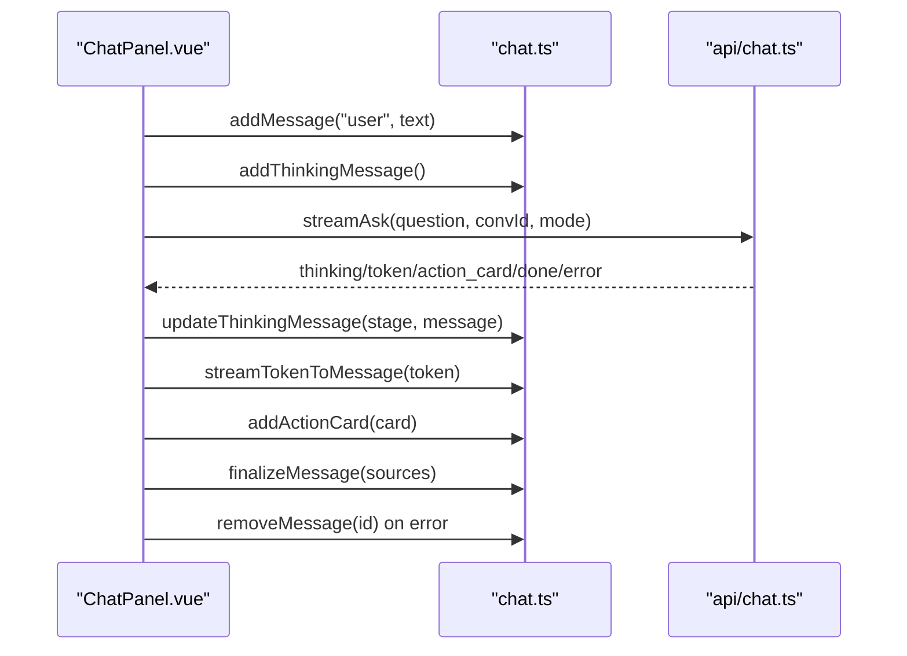
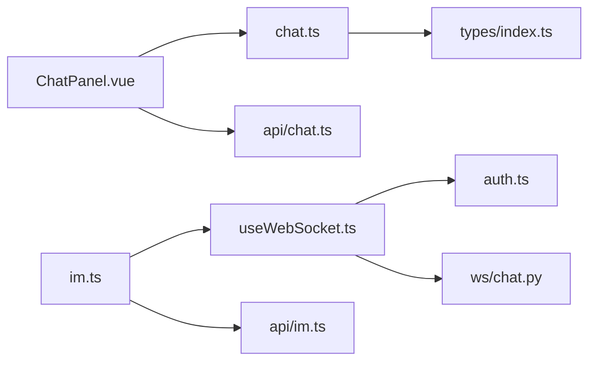

# 聊天会话状态

<cite>
**本文引用的文件**
- [web/app/src/stores/chat.ts](file://web/app/src/stores/chat.ts)
- [web/app/src/components/assistant/ChatPanel.vue](file://web/app/src/components/assistant/ChatPanel.vue)
- [web/app/src/api/chat.ts](file://web/app/src/api/chat.ts)
- [web/app/src/composables/useWebSocket.ts](file://web/app/src/composables/useWebSocket.ts)
- [web/backend/ws/chat.py](file://web/backend/ws/chat.py)
- [web/app/src/stores/im.ts](file://web/app/src/stores/im.ts)
- [web/app/src/views/ChatRoomPage.vue](file://web/app/src/views/ChatRoomPage.vue)
- [web/app/src/types/index.ts](file://web/app/src/types/index.ts)
</cite>

## 目录
1. [简介](#简介)
2. [项目结构](#项目结构)
3. [核心组件](#核心组件)
4. [架构总览](#架构总览)
5. [详细组件分析](#详细组件分析)
6. [依赖关系分析](#依赖关系分析)
7. [性能考虑](#性能考虑)
8. [故障排查指南](#故障排查指南)
9. [结论](#结论)
10. [附录](#附录)

## 简介
本文件围绕基于 Pinia 的聊天 Store 实现，系统性说明聊天会话状态管理方案。内容涵盖：对话历史管理、消息状态同步、流式响应处理（SSE）、WebSocket 连接与实时通信协议、消息队列与离线状态处理、错误重试机制、性能优化策略，以及聊天界面集成示例与调试方法。目标是帮助开发者快速理解并扩展聊天功能，确保在复杂交互场景下的稳定性与可维护性。

## 项目结构
前端采用 Vue + Pinia 的状态管理模式，聊天相关代码主要分布在以下位置：
- 聊天 Store：web/app/src/stores/chat.ts
- 即时通讯 Store：web/app/src/stores/im.ts
- WebSocket 工具：web/app/src/composables/useWebSocket.ts
- 聊天 API（含 SSE 流）：web/app/src/api/chat.ts
- 聊天面板组件：web/app/src/components/assistant/ChatPanel.vue
- 聊天室页面：web/app/src/views/ChatRoomPage.vue
- 后端 WebSocket 端点：web/backend/ws/chat.py
- 类型定义：web/app/src/types/index.ts

图表来源
- [web/app/src/components/assistant/ChatPanel.vue:1-70](file://web/app/src/components/assistant/ChatPanel.vue#L1-L70)
- [web/app/src/stores/chat.ts:1-164](file://web/app/src/stores/chat.ts#L1-L164)
- [web/app/src/stores/im.ts:1-116](file://web/app/src/stores/im.ts#L1-L116)
- [web/app/src/composables/useWebSocket.ts:1-75](file://web/app/src/composables/useWebSocket.ts#L1-L75)
- [web/app/src/api/chat.ts:1-272](file://web/app/src/api/chat.ts#L1-L272)
- [web/backend/ws/chat.py:1-111](file://web/backend/ws/chat.py#L1-L111)

章节来源
- [web/app/src/stores/chat.ts:1-164](file://web/app/src/stores/chat.ts#L1-L164)
- [web/app/src/stores/im.ts:1-116](file://web/app/src/stores/im.ts#L1-L116)
- [web/app/src/composables/useWebSocket.ts:1-75](file://web/app/src/composables/useWebSocket.ts#L1-L75)
- [web/app/src/api/chat.ts:1-272](file://web/app/src/api/chat.ts#L1-L272)
- [web/backend/ws/chat.py:1-111](file://web/backend/ws/chat.py#L1-L111)

## 核心组件
- 聊天 Store（chat.ts）：负责消息列表、会话 ID、加载状态、对话历史、思考阶段提示、流式 token 追加、动作卡片等。
- IM Store（im.ts）：负责即时消息会话、消息列表、未读计数、WebSocket 事件订阅（新消息、撤回、未读更新）。
- WebSocket 工具（useWebSocket.ts）：封装连接、心跳 ping/pong、重连策略、事件分发。
- 聊天 API（api/chat.ts）：提供 REST 与 SSE 接口，包含 ask、ask-public、流式读取、动作确认、临时文件上传等。
- 聊天面板（ChatPanel.vue）：调用 Store 和 API，驱动 UI 渲染、流式输出、错误处理、访客配额展示。
- 聊天室页面（ChatRoomPage.vue）：使用 IM Store 进行消息发送、分页加载、@提及、滚动定位等。
- 后端 WebSocket（ws/chat.py）：认证、连接管理、消息已读回执、未读数广播。

章节来源
- [web/app/src/stores/chat.ts:1-164](file://web/app/src/stores/chat.ts#L1-L164)
- [web/app/src/stores/im.ts:1-116](file://web/app/src/stores/im.ts#L1-L116)
- [web/app/src/composables/useWebSocket.ts:1-75](file://web/app/src/composables/useWebSocket.ts#L1-L75)
- [web/app/src/api/chat.ts:1-272](file://web/app/src/api/chat.ts#L1-L272)
- [web/app/src/components/assistant/ChatPanel.vue:1-156](file://web/app/src/components/assistant/ChatPanel.vue#L1-L156)
- [web/app/src/views/ChatRoomPage.vue:1-342](file://web/app/src/views/ChatRoomPage.vue#L1-L342)
- [web/backend/ws/chat.py:1-111](file://web/backend/ws/chat.py#L1-L111)

## 架构总览
聊天系统由“流式问答（SSE）”和“即时消息（WebSocket）”两条通道组成：
- 流式问答：通过 api/chat.ts 的 SSEStreamReader 建立 /rag/ask-stream 或 /rag/ask-public-stream 的 Server-Sent Events 连接，按事件类型（thinking、token、action_card、done、error）驱动 chat Store 更新消息内容与状态。
- 即时消息：通过 useWebSocket.ts 建立 /ws/chat?token=... 的 WebSocket 连接，后端 ws/chat.py 验证 token、维护连接、处理 read 回执与未读数广播；前端 im Store 订阅 message.new、message.recall、unread_update 事件以同步消息与未读状态。

图表来源
- [web/app/src/components/assistant/ChatPanel.vue:17-54](file://web/app/src/components/assistant/ChatPanel.vue#L17-L54)
- [web/app/src/api/chat.ts:75-125](file://web/app/src/api/chat.ts#L75-L125)
- [web/app/src/api/chat.ts:168-272](file://web/app/src/api/chat.ts#L168-L272)
- [web/app/src/composables/useWebSocket.ts:11-73](file://web/app/src/composables/useWebSocket.ts#L11-L73)
- [web/backend/ws/chat.py:45-111](file://web/backend/ws/chat.py#L45-L111)

## 详细组件分析

### 聊天 Store（chat.ts）
职责与数据结构
- 消息模型：id、role、content、sources、timestamp、isLoading、isSkeleton、thinkingStage、thinkingMessage、isVoice、attachments、actionCards。
- 会话模型：conversationId、conversations（列表）、messages（当前会话消息）。

关键方法
- 添加用户消息与助手占位骨架消息：addMessage、addThinkingMessage。
- 流式更新：streamTokenToMessage（追加 token，清洗异常文本）、updateThinkingMessage（更新思考阶段）、finalizeMessage（结束流，设置 sources）。
- 动作卡片：addActionCard、updateActionCard。
- 会话管理：loadConversations、loadConversation、deleteConversation、clearChat。
- 清理与移除：removeMessage。

错误处理与健壮性
- 清洗助手文本中的异常类名与错误后缀，避免暴露内部错误信息。
- 网络错误时静默降级（如 loadConversation 失败不抛错）。

性能考量
- 骨架消息减少首次渲染等待感。
- 流式追加 token 提升响应感知速度。
- 会话切换时仅替换 messages，避免全量重建。

图表来源
- [web/app/src/stores/chat.ts:27-115](file://web/app/src/stores/chat.ts#L27-L115)
- [web/app/src/api/chat.ts:168-272](file://web/app/src/api/chat.ts#L168-L272)

章节来源
- [web/app/src/stores/chat.ts:1-164](file://web/app/src/stores/chat.ts#L1-L164)
- [web/app/src/api/chat.ts:127-166](file://web/app/src/api/chat.ts#L127-L166)

### 即时消息 Store（im.ts）与 WebSocket 工具（useWebSocket.ts）
职责
- im Store：维护会话列表、当前会话消息、未读计数；发起消息发送、打开会话、标记已读；订阅 WebSocket 事件（新消息、撤回、未读更新）。
- useWebSocket：封装连接、心跳、重连、事件分发（on/off/send），支持通配符监听。

数据流
- 连接建立后，定时发送 ping，后端返回 pong。
- 收到 message.new：若属于当前会话则追加消息，并刷新会话列表。
- 收到 message.recall：将对应消息标记为已撤回。
- 收到 unread_update：刷新会话列表以更新未读数。

图表来源
- [web/app/src/stores/im.ts:32-116](file://web/app/src/stores/im.ts#L32-L116)
- [web/app/src/composables/useWebSocket.ts:11-73](file://web/app/src/composables/useWebSocket.ts#L11-L73)
- [web/backend/ws/chat.py:45-111](file://web/backend/ws/chat.py#L45-L111)

章节来源
- [web/app/src/stores/im.ts:1-116](file://web/app/src/stores/im.ts#L1-L116)
- [web/app/src/composables/useWebSocket.ts:1-75](file://web/app/src/composables/useWebSocket.ts#L1-L75)
- [web/backend/ws/chat.py:1-111](file://web/backend/ws/chat.py#L1-L111)

### 聊天面板（ChatPanel.vue）
职责
- 驱动聊天流程：发送消息、创建骨架消息、订阅 SSE 事件、处理错误与访客配额。
- 展示历史对话侧边栏、新建对话、切换对话。

关键点
- 根据登录状态选择 ask 或 ask-public 流。
- 对 thinking、token、action_card、done、error 分别处理。
- 错误时移除骨架消息并给出友好提示。

图表来源
- [web/app/src/components/assistant/ChatPanel.vue:17-70](file://web/app/src/components/assistant/ChatPanel.vue#L17-L70)
- [web/app/src/api/chat.ts:75-125](file://web/app/src/api/chat.ts#L75-L125)
- [web/app/src/stores/chat.ts:27-115](file://web/app/src/stores/chat.ts#L27-L115)

章节来源
- [web/app/src/components/assistant/ChatPanel.vue:1-156](file://web/app/src/components/assistant/ChatPanel.vue#L1-L156)

### 聊天室页面（ChatRoomPage.vue）
职责
- 打开会话、加载历史消息、加载更多、发送消息、@提及成员、滚动到底部。
- 区分群聊与私聊，显示不同 UI。

关键点
- 使用 IM Store 的 openConversation、sendMessage。
- 支持分页加载（before_id）。
- 输入框 @ 过滤成员列表。

章节来源
- [web/app/src/views/ChatRoomPage.vue:1-342](file://web/app/src/views/ChatRoomPage.vue#L1-L342)

### 后端 WebSocket（ws/chat.py）
职责
- 认证：verify_token_ws，未授权关闭连接。
- 连接管理：active 字典维护用户连接。
- 消息处理：ping/pong、read 回执（记录 ImMessageRead）、未读数广播。

关键点
- read 事件需校验用户是否为会话成员，防止越权标记已读。
- 异常时断开连接并记录日志。

章节来源
- [web/backend/ws/chat.py:1-111](file://web/backend/ws/chat.py#L1-L111)

## 依赖关系分析
- ChatPanel.vue 依赖 chat Store 与 chat API。
- chat Store 依赖 chat API（SSE/REST）与类型定义。
- IM Store 依赖 useWebSocket 与 im API。
- useWebSocket 依赖 auth Store（获取 token）。
- 后端 ws/chat.py 依赖数据库模型与认证服务。

图表来源
- [web/app/src/components/assistant/ChatPanel.vue:1-70](file://web/app/src/components/assistant/ChatPanel.vue#L1-L70)
- [web/app/src/stores/chat.ts:1-164](file://web/app/src/stores/chat.ts#L1-L164)
- [web/app/src/stores/im.ts:1-116](file://web/app/src/stores/im.ts#L1-L116)
- [web/app/src/composables/useWebSocket.ts:1-75](file://web/app/src/composables/useWebSocket.ts#L1-L75)
- [web/backend/ws/chat.py:1-111](file://web/backend/ws/chat.py#L1-L111)

章节来源
- [web/app/src/stores/chat.ts:1-164](file://web/app/src/stores/chat.ts#L1-L164)
- [web/app/src/stores/im.ts:1-116](file://web/app/src/stores/im.ts#L1-L116)
- [web/app/src/composables/useWebSocket.ts:1-75](file://web/app/src/composables/useWebSocket.ts#L1-L75)
- [web/app/src/api/chat.ts:1-272](file://web/app/src/api/chat.ts#L1-L272)
- [web/backend/ws/chat.py:1-111](file://web/backend/ws/chat.py#L1-L111)

## 性能考虑
- 流式渲染：SSE 分片推送 token，降低首屏延迟，提升用户体验。
- 骨架消息：在流式响应期间显示 loading 骨架，减少空白闪烁。
- 消息增量更新：仅追加 token 或 action card，避免整条消息重建。
- 分页加载：IM 消息支持 before_id 分页，控制内存占用。
- 心跳保活：WebSocket 每 30 秒 ping，保持连接活跃。
- 重连退避：最大 5 次重连，指数退避策略，避免雪崩。
- 文本清洗：sanitizeAssistantText 剥离异常信息，避免 UI 抖动与误报。

[本节为通用性能建议，无需特定文件引用]

## 故障排查指南
常见问题与定位
- 流式请求失败：检查 SSEStreamReader.onError 回调，查看 toFriendlyError 转换后的文案；确认 Authorization 头是否正确携带。
- WebSocket 断连：检查 useWebSocket 的重连逻辑与后端日志；确认 token 是否过期。
- 消息未同步：确认 im Store 的事件订阅是否生效；检查后端 broadcast_unread_count 是否触发。
- 动作卡片不显示：确认 onActionCard 回调是否被调用；检查 store.addActionCard 是否执行。

调试方法
- 前端控制台：打印 SSE 事件与 WebSocket 消息；观察 chat Store 的 messages 变化。
- 后端日志：查看 ws/chat.py 的连接与错误日志；确认 verify_token_ws 返回值。
- 网络抓包：使用浏览器 Network 面板查看 SSE 流与 WebSocket 帧。

章节来源
- [web/app/src/api/chat.ts:127-166](file://web/app/src/api/chat.ts#L127-L166)
- [web/app/src/api/chat.ts:168-272](file://web/app/src/api/chat.ts#L168-L272)
- [web/app/src/composables/useWebSocket.ts:11-73](file://web/app/src/composables/useWebSocket.ts#L11-L73)
- [web/backend/ws/chat.py:45-111](file://web/backend/ws/chat.py#L45-L111)

## 结论
该聊天会话状态管理方案通过 Pinia Store 集中化状态、SSE 流式响应提升交互体验、WebSocket 保障实时通信，具备清晰的职责划分与良好的可扩展性。结合骨架消息、分页加载、心跳重连与错误清洗等策略，能够在复杂场景下保持稳定与高性能。建议在后续迭代中引入消息去重、离线缓存与更细粒度的权限校验，进一步提升鲁棒性与安全性。

[本节为总结性内容，无需特定文件引用]

## 附录
- 会话生命周期
  - 新建会话：clearChat 生成新 conversationId。
  - 加载历史：loadConversations 拉取列表，loadConversation 拉取消息。
  - 删除会话：deleteConversation 移除并刷新列表。
- 消息类型处理
  - 用户消息：role=user，直接追加。
  - 助手消息：role=assistant，流式追加 token，结束时设置 sources。
  - 动作卡片：type=vasi/report/diary，动态渲染。
- 错误重试机制
  - WebSocket 重连：最多 5 次，指数退避。
  - SSE 错误：toFriendlyError 统一友好文案，必要时移除骨架消息。
- 实时通信协议
  - SSE：thinking、token、action_card、done、error。
  - WebSocket：ping/pong、message.new、message.recall、unread_update、read。
- 消息队列管理与离线状态处理
  - 当前实现未内置消息队列；可在 IM Store 中增加本地队列与重试逻辑。
  - 离线状态可通过 Service Worker 缓存消息与待发送队列，恢复后同步。
- 聊天界面集成示例
  - ChatPanel.vue：演示 SSE 流式问答集成。
  - ChatRoomPage.vue：演示 IM 消息收发与会话管理。
- 调试方法
  - 前端：控制台日志、Network 面板、Vue Devtools。
  - 后端：日志输出、数据库查询、WebSocket 测试工具。

[本节为补充信息，无需特定文件引用]