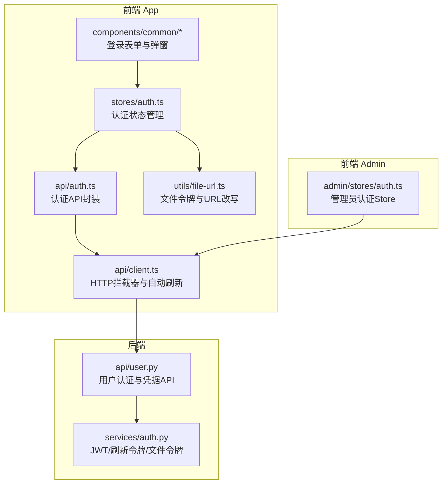
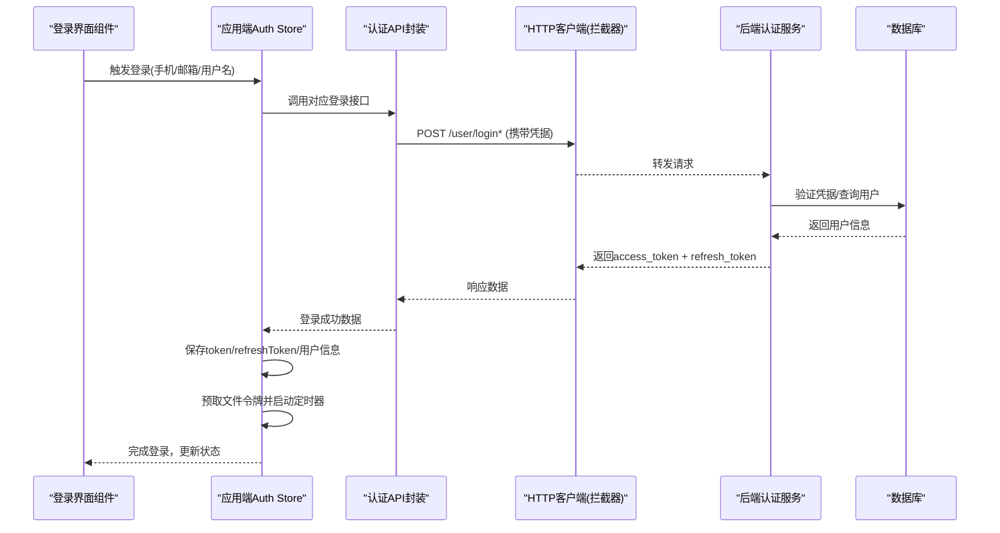
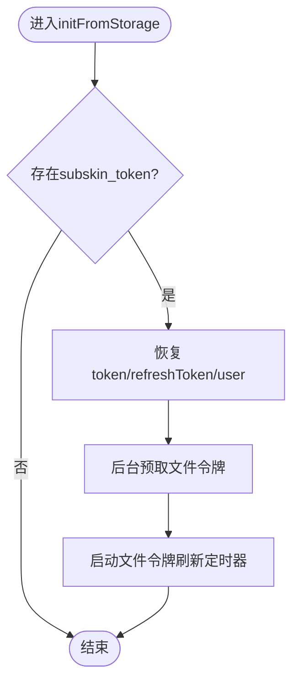
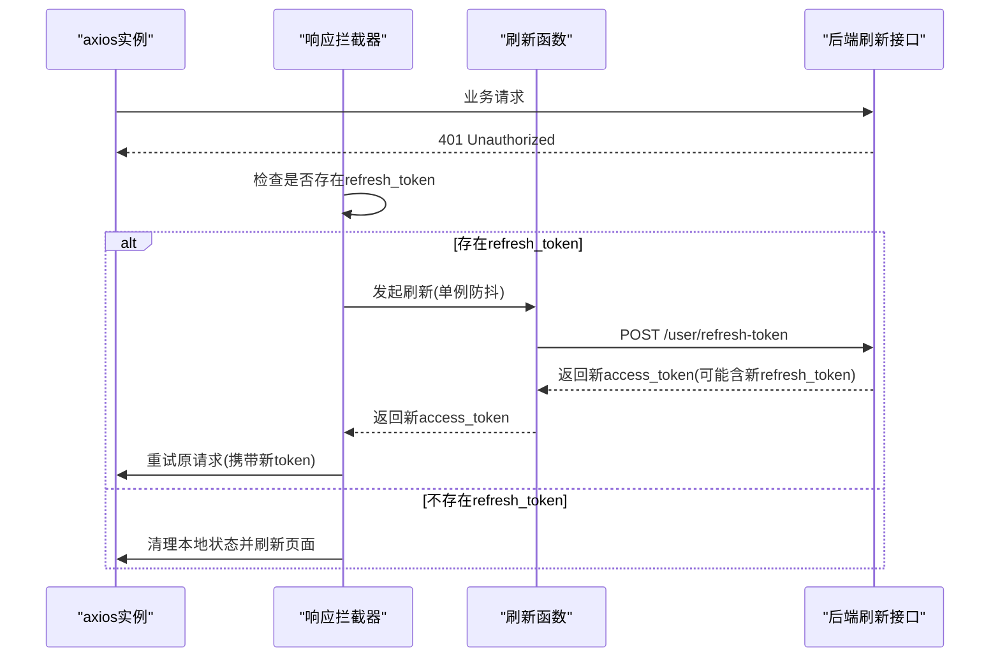
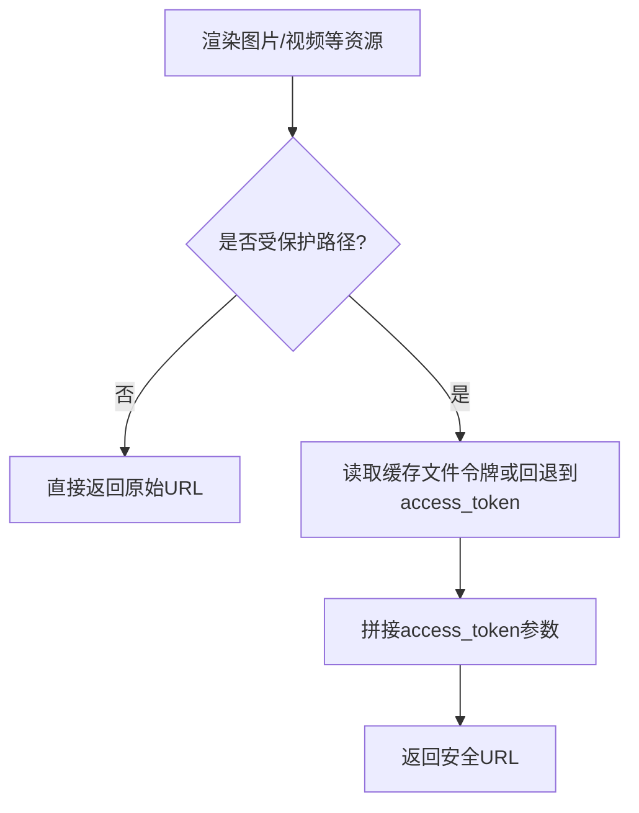
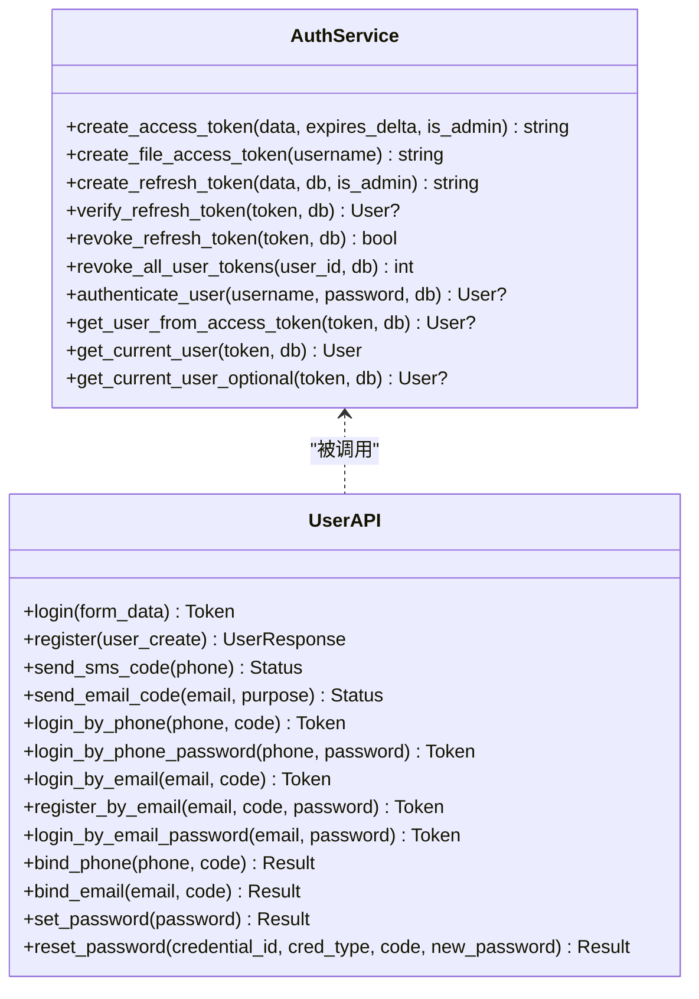
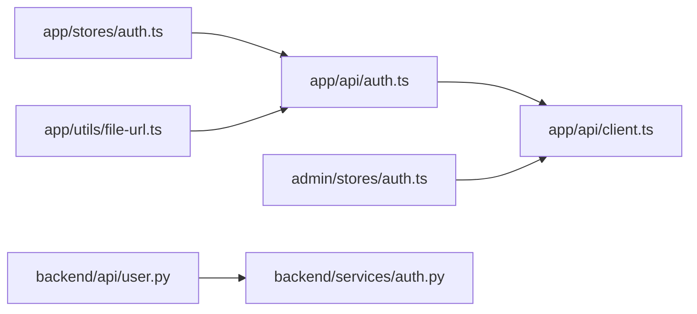

# 认证状态管理

<cite>
**本文引用的文件**   
- [web/app/src/stores/auth.ts](file://web/app/src/stores/auth.ts)
- [web/admin/src/stores/auth.ts](file://web/admin/src/stores/auth.ts)
- [web/app/src/api/auth.ts](file://web/app/src/api/auth.ts)
- [web/app/src/api/client.ts](file://web/app/src/api/client.ts)
- [web/app/src/utils/file-url.ts](file://web/app/src/utils/file-url.ts)
- [web/app/src/components/common/LoginModal.vue](file://web/app/src/components/common/LoginModal.vue)
- [web/app/src/components/common/PhoneLoginForm.vue](file://web/app/src/components/common/PhoneLoginForm.vue)
- [web/app/src/components/common/EmailLoginForm.vue](file://web/app/src/components/common/EmailLoginForm.vue)
- [web/backend/services/auth.py](file://web/backend/services/auth.py)
- [web/backend/api/user.py](file://web/backend/api/user.py)
</cite>

## 目录
1. [简介](#简介)
2. [项目结构](#项目结构)
3. [核心组件](#核心组件)
4. [架构总览](#架构总览)
5. [详细组件分析](#详细组件分析)
6. [依赖关系分析](#依赖关系分析)
7. [性能考量](#性能考量)
8. [故障排查指南](#故障排查指南)
9. [结论](#结论)
10. [附录：API调用示例与常见问题](#附录api调用示例与常见问题)

## 简介
本文件面向前端与后端开发者，系统化梳理基于 Pinia 的认证状态管理实现。内容覆盖用户登录、注册、令牌生命周期与自动刷新、会话持久化、文件访问令牌管理与多方式登录（手机号、邮箱、用户名）。同时给出状态初始化流程、错误处理策略、安全最佳实践与调试技巧，并提供完整的 API 调用示例与常见问题解决方案。

## 项目结构
认证相关代码主要分布在以下位置：
- 应用端（App）Pinia Store：集中管理登录态、令牌、用户信息与会话持久化
- 应用端 API 层：封装所有认证相关接口调用
- 应用端 HTTP 客户端：统一拦截器处理请求头、响应 401 自动刷新与失败回退
- 应用端工具：短效文件访问令牌缓存与 HTML 资源链接改写
- 管理端（Admin）独立 Store：轻量化的管理员登录与权限校验
- 后端服务：JWT 签发/校验、刷新令牌、文件专用令牌、多方式登录与凭据绑定

图表来源 
- [web/app/src/stores/auth.ts](file://web/app/src/stores/auth.ts)
- [web/app/src/api/auth.ts](file://web/app/src/api/auth.ts)
- [web/app/src/api/client.ts](file://web/app/src/api/client.ts)
- [web/app/src/utils/file-url.ts](file://web/app/src/utils/file-url.ts)
- [web/admin/src/stores/auth.ts](file://web/admin/src/stores/auth.ts)
- [web/backend/services/auth.py](file://web/backend/services/auth.py)
- [web/backend/api/user.py](file://web/backend/api/user.py)

章节来源
- [web/app/src/stores/auth.ts](file://web/app/src/stores/auth.ts)
- [web/app/src/api/auth.ts](file://web/app/src/api/auth.ts)
- [web/app/src/api/client.ts](file://web/app/src/api/client.ts)
- [web/app/src/utils/file-url.ts](file://web/app/src/utils/file-url.ts)
- [web/admin/src/stores/auth.ts](file://web/admin/src/stores/auth.ts)
- [web/backend/services/auth.py](file://web/backend/services/auth.py)
- [web/backend/api/user.py](file://web/backend/api/user.py)

## 核心组件
- 应用端认证 Store（Pinia）
  - 维护 token、refreshToken、user 等状态
  - 提供多方式登录/注册方法（手机验证码、手机密码、邮箱验证码、邮箱密码、用户名密码）
  - 负责本地存储持久化、文件令牌预取与定时刷新
  - 统一错误处理与登出清理
- 应用端 API 封装
  - 暴露统一的认证接口方法（发送验证码、登录、注册、刷新、登出、获取用户信息等）
- 应用端 HTTP 客户端
  - 请求拦截器注入 Authorization 头
  - 响应拦截器处理 401 自动刷新并去重，失败时清理本地状态并刷新页面
- 文件访问令牌工具
  - 短效文件令牌缓存与过期判断
  - 将受保护的文件 URL 改写为带 access_token 的安全链接
  - 对富文本中的 src/href 进行安全改写与 XSS 清洗
- 管理端认证 Store
  - 简化版登录流程，包含管理员权限校验与路由跳转

章节来源
- [web/app/src/stores/auth.ts](file://web/app/src/stores/auth.ts)
- [web/app/src/api/auth.ts](file://web/app/src/api/auth.ts)
- [web/app/src/api/client.ts](file://web/app/src/api/client.ts)
- [web/app/src/utils/file-url.ts](file://web/app/src/utils/file-url.ts)
- [web/admin/src/stores/auth.ts](file://web/admin/src/stores/auth.ts)

## 架构总览
下图展示了从 UI 到后端的完整认证流程，包括多方式登录、令牌刷新、文件令牌与权限控制。

图表来源 
- [web/app/src/stores/auth.ts](file://web/app/src/stores/auth.ts)
- [web/app/src/api/auth.ts](file://web/app/src/api/auth.ts)
- [web/app/src/api/client.ts](file://web/app/src/api/client.ts)
- [web/backend/services/auth.py](file://web/backend/services/auth.py)
- [web/backend/api/user.py](file://web/backend/api/user.py)

## 详细组件分析

### 应用端认证 Store（Pinia）
职责与要点：
- 状态字段：token、refreshToken、user、isLoggedIn、showLoginModal
- 初始化：从 localStorage 恢复 token/refreshToken/user，并在后台预取文件令牌
- 登录流程：统一通过 _completeLogin 保存令牌、拉取用户信息、预取文件令牌、启动刷新定时器
- 多方式登录：支持手机验证码、手机密码、邮箱验证码、邮箱密码、用户名密码登录；以及对应的注册流程
- 令牌刷新：tryRefreshToken 使用 refresh_token 换取新 access_token，失败则登出
- 登出：先尝试服务端注销（不影响本地清理），再清空本地状态与文件令牌
- 错误处理：在 fetchUser 中捕获 401/403 并尝试刷新，失败则登出

图表来源 
- [web/app/src/stores/auth.ts](file://web/app/src/stores/auth.ts)

章节来源
- [web/app/src/stores/auth.ts](file://web/app/src/stores/auth.ts)

### 应用端 API 封装
职责与要点：
- 统一封装所有认证相关接口：发送短信/邮件验证码、多种登录/注册、刷新令牌、登出、获取用户信息、设置/重置密码、绑定/解绑凭据、上传头像等
- 类型定义清晰：LoginResponse、CredentialInfo、UserResponse、UpdateProfileRequest 等
- 文件访问令牌：getFileAccessToken 用于生成短效文件令牌

章节来源
- [web/app/src/api/auth.ts](file://web/app/src/api/auth.ts)

### 应用端 HTTP 客户端（拦截器与自动刷新）
职责与要点：
- 请求拦截器：自动注入 Authorization: Bearer <token>，并对 FormData 请求移除 Content-Type 以支持 multipart/form-data
- 响应拦截器：当收到 401 且存在 refresh_token 时，发起单例刷新请求，避免并发重复刷新；成功后重试原请求；失败则清理本地状态并刷新页面
- 超时配置：默认 120s，满足 AI 预处理场景

图表来源 
- [web/app/src/api/client.ts](file://web/app/src/api/client.ts)

章节来源
- [web/app/src/api/client.ts](file://web/app/src/api/client.ts)

### 文件访问令牌与资源安全
职责与要点：
- 短效文件令牌：优先于长生命周期的 access_token，泄露风险更低，有效期分钟级
- 缓存策略：localStorage 缓存 token 与过期时间，提前 30s 刷新避免竞态
- URL 改写：toProtectedFileUrl 将受保护路径改写为带 access_token 的链接；rewriteProtectedHtml 对富文本进行安全清洗与链接改写
- 背景刷新：auth store 每 4 分钟调用 ensureFileToken，确保长会话持续使用短效令牌

图表来源 
- [web/app/src/utils/file-url.ts](file://web/app/src/utils/file-url.ts)

章节来源
- [web/app/src/utils/file-url.ts](file://web/app/src/utils/file-url.ts)

### 管理端认证 Store
职责与要点：
- 简单登录流程：提交 username/password，获取 access_token 并持久化
- 权限校验：登录后拉取 /users/me，若非管理员则强制登出并抛出明确错误
- 登出：清空本地状态并跳转到登录页

章节来源
- [web/admin/src/stores/auth.ts](file://web/admin/src/stores/auth.ts)

### 后端认证服务与API
职责与要点：
- JWT 签发与校验：access_token（type=access）、refresh_token（数据库持久化）、file_access_token（type=file, scope=files）
- 多方式登录：用户名/手机号/邮箱均可作为登录名；支持验证码登录与密码登录
- 凭据管理：绑定/解绑手机号/邮箱，设置/重置密码，记录 last_used_at
- 安全控制：封禁账号返回 403 并附带原因；可选用户获取 get_current_user_optional 用于匿名友好接口
- 刷新令牌：verify_refresh_token 校验未撤销且未过期；revoke_all_user_tokens 用于密码重置后强制重新认证

图表来源 
- [web/backend/services/auth.py](file://web/backend/services/auth.py)
- [web/backend/api/user.py](file://web/backend/api/user.py)

章节来源
- [web/backend/services/auth.py](file://web/backend/services/auth.py)
- [web/backend/api/user.py](file://web/backend/api/user.py)

## 依赖关系分析
- 前端 App Store 依赖 API 封装与 HTTP 客户端
- API 封装依赖 HTTP 客户端
- 文件令牌工具依赖 API 封装（懒加载以避免循环依赖）
- 管理端 Store 依赖 HTTP 客户端
- 后端 API 依赖认证服务与数据库模型

图表来源 
- [web/app/src/stores/auth.ts](file://web/app/src/stores/auth.ts)
- [web/app/src/api/auth.ts](file://web/app/src/api/auth.ts)
- [web/app/src/api/client.ts](file://web/app/src/api/client.ts)
- [web/app/src/utils/file-url.ts](file://web/app/src/utils/file-url.ts)
- [web/admin/src/stores/auth.ts](file://web/admin/src/stores/auth.ts)
- [web/backend/api/user.py](file://web/backend/api/user.py)
- [web/backend/services/auth.py](file://web/backend/services/auth.py)

## 性能考量
- 并发刷新去重：HTTP 客户端使用单例刷新 Promise，避免多个 401 同时触发多次刷新
- 文件令牌缓存：短效令牌缓存并提前 30s 刷新，减少频繁网络请求
- 背景刷新：每 4 分钟刷新一次文件令牌，保证长会话体验
- 超时配置：默认 120s，适配 AI 预处理耗时
- 数据库清理：定期清理过期/撤销的 refresh tokens，防止表膨胀

[本节为通用指导，不直接分析具体文件]

## 故障排查指南
常见症状与定位建议：
- 登录后立即被踢出
  - 检查 refresh_token 是否存在与有效；确认后端刷新接口正常
  - 查看浏览器控制台是否有 401 及刷新失败日志
- 图片/文件无法加载
  - 确认 toProtectedFileUrl 是否正确改写 URL
  - 检查文件令牌是否过期或被清除
- 多设备登录冲突
  - 密码重置会撤销全部 refresh tokens，需重新登录
- 管理员无法登录
  - 检查 /users/me 返回 is_admin 字段；非管理员会被强制登出

章节来源
- [web/app/src/api/client.ts](file://web/app/src/api/client.ts)
- [web/app/src/utils/file-url.ts](file://web/app/src/utils/file-url.ts)
- [web/admin/src/stores/auth.ts](file://web/admin/src/stores/auth.ts)

## 结论
本项目在前端采用 Pinia Store 统一管理认证状态，结合 Axios 拦截器实现自动刷新与错误回退；在后端通过 JWT 与数据库持久化的 refresh token 构建安全的会话体系。文件访问令牌进一步降低泄露风险。整体设计兼顾用户体验与安全，具备完善的错误处理与调试能力。

[本节为总结性内容，不直接分析具体文件]

## 附录：API调用示例与常见问题

### 常用 API 调用示例（路径与方法）
- 发送短信验证码
  - POST /api/user/send-sms
  - Body: { phone: "手机号" }
- 发送邮箱验证码
  - POST /api/user/send-email-code
  - Body: { email: "邮箱", purpose: "login|register|reset|bind" }
- 手机验证码登录
  - POST /api/user/login-by-phone
  - Body: { phone: "手机号", code: "验证码" }
- 手机密码登录
  - POST /api/user/login-by-phone-password
  - Body: { phone: "手机号", password: "密码" }
- 邮箱验证码登录
  - POST /api/user/login-by-email
  - Body: { email: "邮箱", code: "验证码" }
- 邮箱密码登录
  - POST /api/user/login-by-email-password
  - Body: { email: "邮箱", password: "密码" }
- 用户名密码登录（兼容）
  - POST /api/user/login
  - Form: username/password
- 注册（用户名+邮箱+密码）
  - POST /api/user/register
  - Body: { username, email, password }
- 刷新令牌
  - POST /api/user/refresh-token
  - Body: { refresh_token: "刷新令牌" }
- 登出
  - POST /api/user/logout
- 获取当前用户
  - GET /api/users/me
  - Header: Authorization: Bearer <token>
- 更新个人资料
  - PUT /api/users/me
  - Body: { username?, phone?, email?, patient_relation? }
- 上传头像
  - POST /api/users/me/avatar
  - FormData: file
- 获取文件访问令牌
  - GET /api/files/access-token
  - Header: Authorization: Bearer <token>

章节来源
- [web/app/src/api/auth.ts](file://web/app/src/api/auth.ts)
- [web/backend/api/user.py](file://web/backend/api/user.py)

### 常见问题与解决方案
- 401 未授权
  - 检查 Authorization 头是否正确注入
  - 若 refresh_token 无效或缺失，将触发页面刷新；请检查本地存储与后端刷新接口
- 文件无法访问
  - 确认文件 URL 已被改写为带 access_token 的形式
  - 检查文件令牌是否过期；必要时触发 ensureFileToken
- 管理员登录失败
  - 确认 /users/me 返回 is_admin=true；否则将被强制登出
- 验证码发送受限
  - 后端按 IP 维度限制每小时发送次数；如触发限流，请稍后再试

章节来源
- [web/app/src/api/client.ts](file://web/app/src/api/client.ts)
- [web/app/src/utils/file-url.ts](file://web/app/src/utils/file-url.ts)
- [web/backend/api/user.py](file://web/backend/api/user.py)