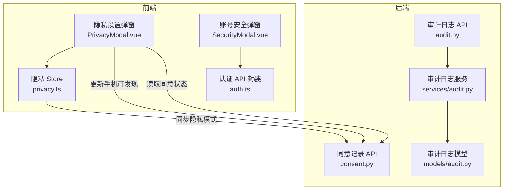
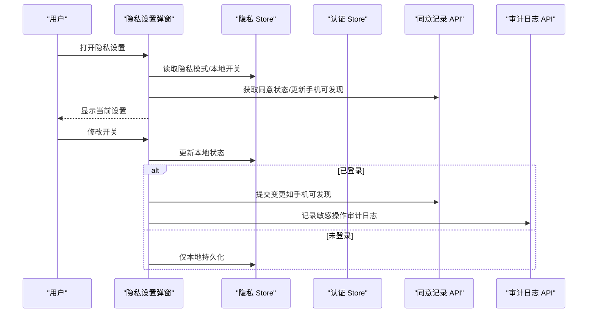
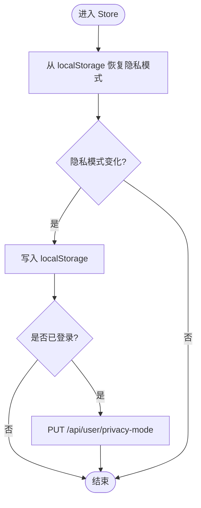
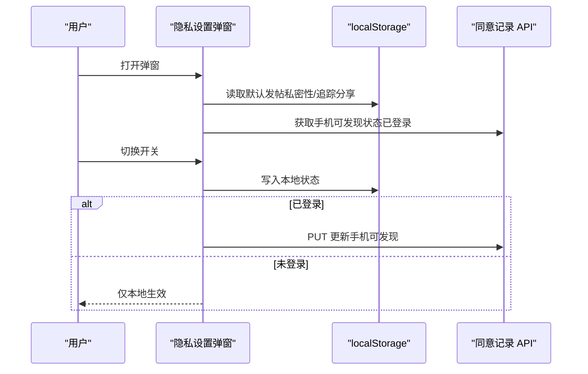
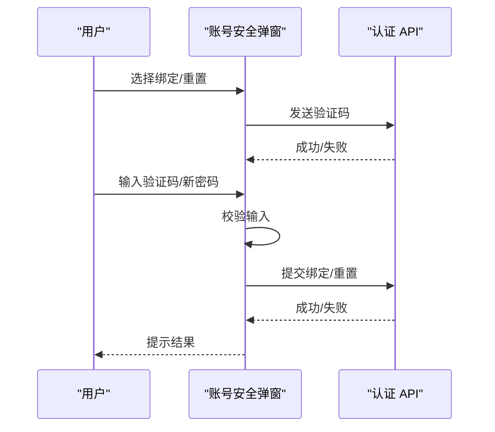
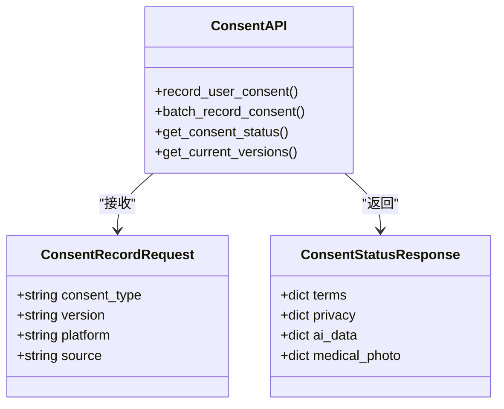
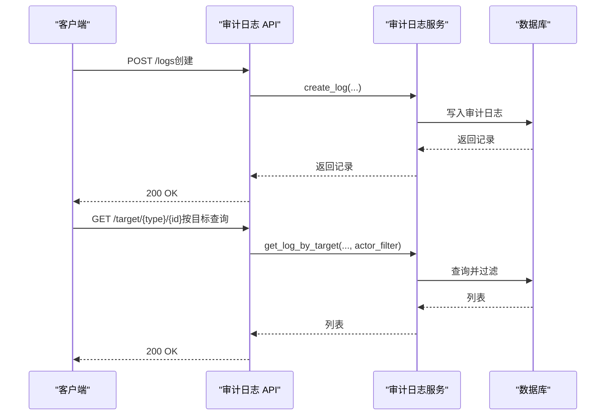
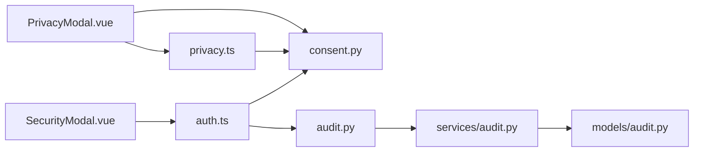

# 隐私配置状态

<cite>
**本文引用的文件**
- [privacy.ts](file://web/app/src/stores/privacy.ts)
- [PrivacyModal.vue](file://web/app/src/components/profile/PrivacyModal.vue)
- [SecurityModal.vue](file://web/app/src/components/profile/SecurityModal.vue)
- [audit.py](file://web/backend/api/audit.py)
- [consent.py](file://web/backend/api/consent.py)
- [audit.py（模型）](file://web/backend/models/audit.py)
- [audit.py（服务）](file://web/backend/services/audit.py)
- [auth.ts](file://web/app/src/api/auth.ts)
</cite>

## 目录
1. [简介](#简介)
2. [项目结构](#项目结构)
3. [核心组件](#核心组件)
4. [架构总览](#架构总览)
5. [详细组件分析](#详细组件分析)
6. [依赖关系分析](#依赖关系分析)
7. [性能考虑](#性能考虑)
8. [故障排查指南](#故障排查指南)
9. [结论](#结论)
10. [附录](#附录)

## 简介
本文件聚焦于“隐私配置状态管理”的完整实现与最佳实践，覆盖前端基于 Pinia 的隐私 Store、用户隐私设置、数据可见性控制、通知偏好与账户安全选项；后端涵盖隐私策略版本管理、GDPR 合规同意记录、数据删除/撤销请求与安全审计日志。文档同时提供权限验证、敏感操作确认与合规检查的实现要点，并给出隐私设置界面集成示例与落地建议。

## 项目结构
围绕隐私配置的前后端关键位置如下：
- 前端状态与界面
  - 隐私状态 Store：web/app/src/stores/privacy.ts
  - 隐私设置弹窗：web/app/src/components/profile/PrivacyModal.vue
  - 账号安全弹窗：web/app/src/components/profile/SecurityModal.vue
  - 认证 API 封装：web/app/src/api/auth.ts
- 后端合规与审计
  - 同意记录 API：web/backend/api/consent.py
  - 审计日志 API：web/backend/api/audit.py
  - 审计日志模型：web/backend/models/audit.py
  - 审计日志服务：web/backend/services/audit.py

图表来源
- [privacy.ts:1-91](file://web/app/src/stores/privacy.ts#L1-L91)
- [PrivacyModal.vue:1-112](file://web/app/src/components/profile/PrivacyModal.vue#L1-L112)
- [SecurityModal.vue:1-420](file://web/app/src/components/profile/SecurityModal.vue#L1-L420)
- [consent.py:1-181](file://web/backend/api/consent.py#L1-L181)
- [audit.py:1-124](file://web/backend/api/audit.py#L1-L124)
- [audit.py（模型）:1-58](file://web/backend/models/audit.py#L1-L58)
- [audit.py（服务）:1-136](file://web/backend/services/audit.py#L1-L136)

章节来源
- [privacy.ts:1-91](file://web/app/src/stores/privacy.ts#L1-L91)
- [PrivacyModal.vue:1-112](file://web/app/src/components/profile/PrivacyModal.vue#L1-L112)
- [SecurityModal.vue:1-420](file://web/app/src/components/profile/SecurityModal.vue#L1-L420)
- [consent.py:1-181](file://web/backend/api/consent.py#L1-L181)
- [audit.py:1-124](file://web/backend/api/audit.py#L1-L124)
- [audit.py（模型）:1-58](file://web/backend/models/audit.py#L1-L58)
- [audit.py（服务）:1-136](file://web/backend/services/audit.py#L1-L136)
- [auth.ts:1-195](file://web/app/src/api/auth.ts#L1-L195)

## 核心组件
- 隐私 Store（Pinia）
  - 维护全局隐私模式开关，持久化到 localStorage，并在已登录时与后端同步。
  - 提供手机号/邮箱脱敏工具方法，便于在 UI 中按隐私模式展示。
  - 将默认发帖私密性与追踪数据分享开关与隐私模式联动。
- 隐私设置弹窗
  - 提供“允许通过手机号找到我”“社区帖子默认私密”“允许他人查看我的追踪数据”等开关。
  - 未登录时本地存储，登录后调用后端接口持久化。
- 账号安全弹窗
  - 支持绑定手机/邮箱、设置/重置密码，包含验证码倒计时、输入校验与错误提示。
  - 对敏感操作进行二次确认与失败回滚。
- 同意记录 API
  - 记录用户对条款、隐私政策、AI 数据处理、医疗图片使用的同意行为，含版本管理与查询。
- 审计日志 API/服务/模型
  - 记录敏感操作的审计轨迹，支持分页查询、目标级审计轨迹、撤销（如可撤销）。
  - 非管理员仅能查看自身对目标的审计轨迹，防止 IDOR 枚举。

章节来源
- [privacy.ts:1-91](file://web/app/src/stores/privacy.ts#L1-L91)
- [PrivacyModal.vue:1-112](file://web/app/src/components/profile/PrivacyModal.vue#L1-L112)
- [SecurityModal.vue:1-420](file://web/app/src/components/profile/SecurityModal.vue#L1-L420)
- [consent.py:1-181](file://web/backend/api/consent.py#L1-L181)
- [audit.py:1-124](file://web/backend/api/audit.py#L1-L124)
- [audit.py（模型）:1-58](file://web/backend/models/audit.py#L1-L58)
- [audit.py（服务）:1-136](file://web/backend/services/audit.py#L1-L136)

## 架构总览
隐私配置状态在前端以 Pinia Store 为中心，结合弹窗组件完成用户交互；后端通过同意记录与审计日志保障合规与可追溯。

图表来源
- [PrivacyModal.vue:1-112](file://web/app/src/components/profile/PrivacyModal.vue#L1-L112)
- [privacy.ts:1-91](file://web/app/src/stores/privacy.ts#L1-L91)
- [consent.py:1-181](file://web/backend/api/consent.py#L1-L181)
- [audit.py:1-124](file://web/backend/api/audit.py#L1-L124)

## 详细组件分析

### 隐私 Store（Pinia）
- 职责
  - 管理隐私模式开关，持久化到 localStorage。
  - 已登录时从后端拉取隐私模式，并在切换时写回后端。
  - 提供手机号/邮箱脱敏方法，依据隐私模式决定是否隐藏。
  - 将默认发帖私密性与追踪数据分享开关与隐私模式联动。
- 关键流程
  - 初始化：从 localStorage 恢复隐私模式。
  - 监听变化：写入 localStorage，并在已登录时同步后端。
  - 脱敏：根据隐私模式决定返回原始或掩码值。
- 复杂度
  - 时间复杂度 O(1)，空间复杂度 O(1)。
- 优化点
  - 网络请求可加防抖/重试与缓存，避免频繁切换导致过多请求。
  - 脱敏逻辑可抽取为纯函数以便测试。

图表来源
- [privacy.ts:1-91](file://web/app/src/stores/privacy.ts#L1-L91)

章节来源
- [privacy.ts:1-91](file://web/app/src/stores/privacy.ts#L1-L91)

### 隐私设置弹窗
- 功能
  - 读取本地默认发帖私密性与追踪数据分享开关。
  - 已登录时读取“手机可发现”状态，并提供切换。
  - 未登录时所有变更仅本地持久化；登录后再同步后端。
- 交互
  - 打开弹窗时读取最新状态；隐私模式变化时刷新默认值。
  - 切换开关后即时反馈，失败时回滚。
- 与 Store 的关系
  - 依赖隐私 Store 的隐私模式，用于联动默认发帖私密性与追踪分享。

图表来源
- [PrivacyModal.vue:1-112](file://web/app/src/components/profile/PrivacyModal.vue#L1-L112)
- [consent.py:1-181](file://web/backend/api/consent.py#L1-L181)

章节来源
- [PrivacyModal.vue:1-112](file://web/app/src/components/profile/PrivacyModal.vue#L1-L112)

### 账号安全弹窗
- 功能
  - 绑定手机/邮箱、设置/重置密码，包含验证码倒计时与输入校验。
  - 对敏感操作进行错误处理与失败回滚。
- 与认证 API 的关系
  - 使用认证 API 发送验证码、绑定凭证、设置/重置密码。
- 安全要点
  - 输入格式校验（手机号、邮箱、验证码长度、密码强度）。
  - 操作前禁用按钮，避免重复提交。

图表来源
- [SecurityModal.vue:1-420](file://web/app/src/components/profile/SecurityModal.vue#L1-L420)
- [auth.ts:1-195](file://web/app/src/api/auth.ts#L1-L195)

章节来源
- [SecurityModal.vue:1-420](file://web/app/src/components/profile/SecurityModal.vue#L1-L420)
- [auth.ts:1-195](file://web/app/src/api/auth.ts#L1-L195)

### 同意记录 API（GDPR 合规）
- 能力
  - 记录用户对条款、隐私政策、AI 数据处理、医疗图片使用的同意行为。
  - 批量记录与查询当前用户的同意状态。
  - 提供当前条款/隐私政策版本号。
- 字段与版本
  - 同意类型：terms、privacy、ai_data、medical_photo。
  - 版本常量：TERMS_VERSION、PRIVACY_VERSION。
- 合规要点
  - 记录 IP、User-Agent、设备指纹、平台与来源，便于审计。
  - 查询最新有效同意记录，支撑前端策略展示。

图表来源
- [consent.py:1-181](file://web/backend/api/consent.py#L1-L181)

章节来源
- [consent.py:1-181](file://web/backend/api/consent.py#L1-L181)

### 审计日志 API/服务/模型
- 能力
  - 创建、查询、按目标查询审计日志。
  - 支持撤销可撤销的审计日志。
  - 非管理员仅能查看自身对目标的审计轨迹，防止 IDOR。
- 模型
  - 包含操作类型、目标类型/ID、范围、详情、是否可撤销、撤销时间等。
- 服务
  - 统一封装创建、撤销、查询逻辑，IP 地址脱敏。
- 权限与合规
  - 所有接口需鉴权。
  - 目标级审计轨迹限制 actor 过滤，避免枚举其他用户行为。

图表来源
- [audit.py:1-124](file://web/backend/api/audit.py#L1-L124)
- [audit.py（服务）:1-136](file://web/backend/services/audit.py#L1-L136)
- [audit.py（模型）:1-58](file://web/backend/models/audit.py#L1-L58)

章节来源
- [audit.py:1-124](file://web/backend/api/audit.py#L1-L124)
- [audit.py（服务）:1-136](file://web/backend/services/audit.py#L1-L136)
- [audit.py（模型）:1-58](file://web/backend/models/audit.py#L1-L58)

## 依赖关系分析
- 前端
  - PrivacyModal.vue 依赖隐私 Store 与认证 Store，调用同意记录 API。
  - SecurityModal.vue 依赖认证 API 完成绑定与密码操作。
  - 隐私 Store 依赖认证 Store 判断登录态并携带 Token。
- 后端
  - 同意记录 API 依赖数据库模型 UserConsent。
  - 审计日志 API 依赖审计日志服务与模型，并进行鉴权与参数校验。
  - 审计日志服务对 IP 进行脱敏，保证 L3 数据不泄露。

图表来源
- [PrivacyModal.vue:1-112](file://web/app/src/components/profile/PrivacyModal.vue#L1-L112)
- [privacy.ts:1-91](file://web/app/src/stores/privacy.ts#L1-L91)
- [SecurityModal.vue:1-420](file://web/app/src/components/profile/SecurityModal.vue#L1-L420)
- [auth.ts:1-195](file://web/app/src/api/auth.ts#L1-L195)
- [consent.py:1-181](file://web/backend/api/consent.py#L1-L181)
- [audit.py:1-124](file://web/backend/api/audit.py#L1-L124)
- [audit.py（服务）:1-136](file://web/backend/services/audit.py#L1-L136)
- [audit.py（模型）:1-58](file://web/backend/models/audit.py#L1-L58)

章节来源
- [privacy.ts:1-91](file://web/app/src/stores/privacy.ts#L1-L91)
- [PrivacyModal.vue:1-112](file://web/app/src/components/profile/PrivacyModal.vue#L1-L112)
- [SecurityModal.vue:1-420](file://web/app/src/components/profile/SecurityModal.vue#L1-L420)
- [auth.ts:1-195](file://web/app/src/api/auth.ts#L1-L195)
- [consent.py:1-181](file://web/backend/api/consent.py#L1-L181)
- [audit.py:1-124](file://web/backend/api/audit.py#L1-L124)
- [audit.py（服务）:1-136](file://web/backend/services/audit.py#L1-L136)
- [audit.py（模型）:1-58](file://web/backend/models/audit.py#L1-L58)

## 性能考虑
- 前端
  - 隐私模式切换时合并本地与远端写入，避免高频网络请求。
  - 脱敏计算为 O(1)，可在渲染路径中直接使用。
- 后端
  - 同意记录与审计日志均为轻量写入，注意索引与分页查询。
  - 目标级审计轨迹使用 actor 过滤减少不必要的数据扫描。

## 故障排查指南
- 隐私模式不同步
  - 检查登录态与 Token 是否正确传递。
  - 查看后端隐私模式接口响应与错误日志。
- 同意状态异常
  - 确认版本常量与前端传入版本一致。
  - 检查 User-Agent、设备指纹等头信息是否被代理丢弃。
- 审计日志不可见
  - 非管理员仅能看到自身对目标的审计轨迹，确认 actor 过滤是否符合预期。
  - 检查日志是否标记为可撤销且未被撤销。
- 安全弹窗失败
  - 核对输入校验规则（手机号、邮箱、验证码长度、密码强度）。
  - 关注验证码倒计时与按钮禁用状态，避免重复提交。

章节来源
- [privacy.ts:1-91](file://web/app/src/stores/privacy.ts#L1-L91)
- [consent.py:1-181](file://web/backend/api/consent.py#L1-L181)
- [audit.py:1-124](file://web/backend/api/audit.py#L1-L124)
- [audit.py（服务）:1-136](file://web/backend/services/audit.py#L1-L136)
- [SecurityModal.vue:1-420](file://web/app/src/components/profile/SecurityModal.vue#L1-L420)

## 结论
本方案以前端 Pinia Store 为核心，结合弹窗组件实现用户友好的隐私配置体验；后端通过同意记录与审计日志保障 GDPR 合规与操作可追溯。权限验证、敏感操作确认与合规检查贯穿前后端，确保数据安全与用户体验平衡。建议在后续迭代中增加更细粒度的通知偏好、数据导出/删除请求流程以及更完善的审计可视化。

## 附录
- 隐私设置界面集成示例
  - 在 ProfilePage 中引入 PrivacyModal，绑定 modelValue 控制显隐。
  - 在需要展示手机号/邮箱处调用隐私 Store 的脱敏方法，依据隐私模式显示。
  - 在用户首次登录或版本升级时，调用同意记录 API 获取最新版本并提示同意。
- 最佳实践
  - 所有敏感操作均需二次确认与失败回滚。
  - 前端本地状态与后端保持一致，未登录时仅本地持久化。
  - 后端对所有接口进行鉴权，审计日志记录关键动作。
  - 定期审查同意版本与隐私策略，确保合规更新。