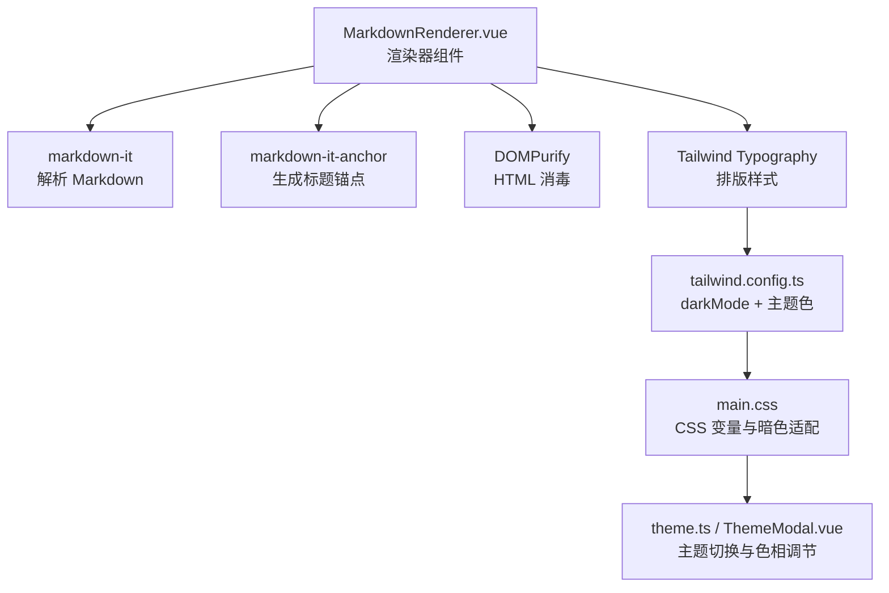
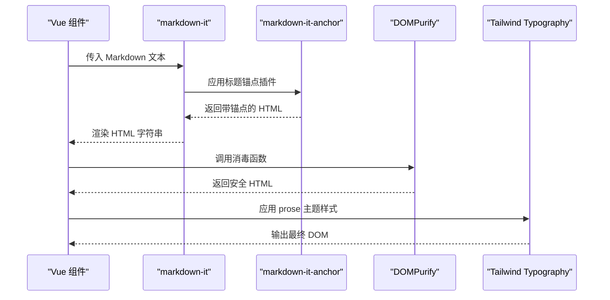
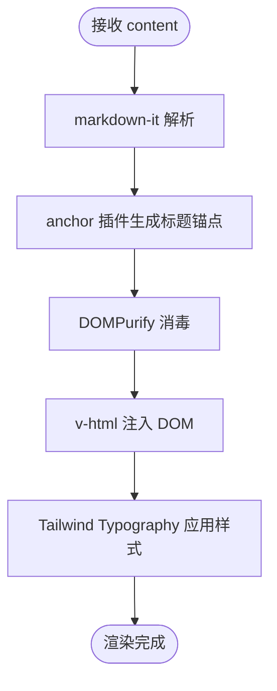
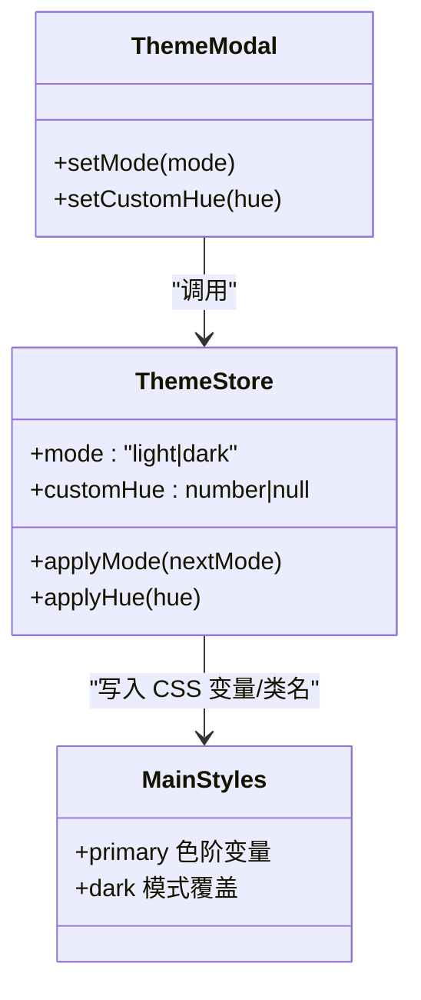
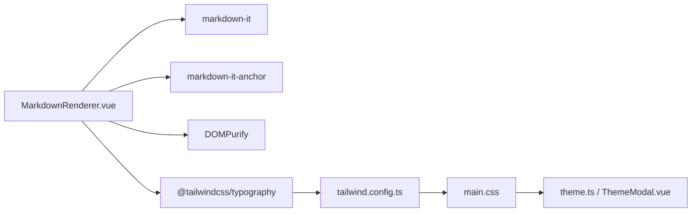

# Markdown内容渲染器

<cite>
**本文引用的文件**
- [MarkdownRenderer.vue](file://web/app/src/components/encyclopedia/MarkdownRenderer.vue)
- [tailwind.config.ts](file://web/app/tailwind.config.ts)
- [main.css](file://web/app/src/styles/main.css)
- [theme.ts](file://web/app/src/stores/theme.ts)
- [ThemeModal.vue](file://web/app/src/components/profile/ThemeModal.vue)
</cite>

## 目录
1. [简介](#简介)
2. [项目结构](#项目结构)
3. [核心组件](#核心组件)
4. [架构总览](#架构总览)
5. [详细组件分析](#详细组件分析)
6. [依赖关系分析](#依赖关系分析)
7. [性能考量](#性能考量)
8. [故障排查指南](#故障排查指南)
9. [结论](#结论)
10. [附录](#附录)

## 简介
本文件面向基于 markdown-it 的 Markdown 内容渲染器，聚焦以下能力：
- 解析与渲染：启用 HTML、自动链接、排版优化、换行处理。
- 插件配置：标题锚点（markdown-it-anchor）生成可跳转的章节锚点。
- 安全过滤：使用 DOMPurify 对渲染后的 HTML 进行消毒，防止 XSS。
- 主题与暗色模式：通过 Tailwind Typography 与 CSS 变量实现响应式排版与暗色适配。
- 自定义块样式：为 info、warning、danger、tip 四类自定义块提供统一视觉风格。
- 扩展与优化：提供性能优化策略与二次开发指南。

该渲染器以 Vue 单文件组件形式封装，对外暴露 content 属性，内部完成“Markdown → HTML → 消毒 → 主题化渲染”的完整链路。

## 项目结构
围绕渲染器的关键文件与职责：
- web/app/src/components/encyclopedia/MarkdownRenderer.vue：渲染器组件，负责初始化 markdown-it、挂载插件、执行消毒并输出 v-html。
- web/app/tailwind.config.ts：Tailwind 配置，启用 darkMode: class，引入 @tailwindcss/typography，定义主色调语义化 token。
- web/app/src/styles/main.css：全局主题变量与基础样式，提供 primary 色系 HSL 变量族，支撑暗色模式与主题色可调。
- web/app/src/stores/theme.ts：主题状态管理，控制 html.dark 类切换与主题色相变量注入。
- web/app/src/components/profile/ThemeModal.vue：用户设置入口，支持切换明/暗主题与调整主题色相。

图表来源
- [MarkdownRenderer.vue:11-28](file://web/app/src/components/encyclopedia/MarkdownRenderer.vue#L11-L28)
- [tailwind.config.ts:1-62](file://web/app/tailwind.config.ts#L1-L62)
- [main.css:5-35](file://web/app/src/styles/main.css#L5-L35)
- [theme.ts:16-45](file://web/app/src/stores/theme.ts#L16-L45)
- [ThemeModal.vue:41-64](file://web/app/src/components/profile/ThemeModal.vue#L41-L64)

章节来源
- [MarkdownRenderer.vue:1-84](file://web/app/src/components/encyclopedia/MarkdownRenderer.vue#L1-L84)
- [tailwind.config.ts:1-62](file://web/app/tailwind.config.ts#L1-L62)
- [main.css:1-213](file://web/app/src/styles/main.css#L1-L213)
- [theme.ts:1-45](file://web/app/src/stores/theme.ts#L1-L45)
- [ThemeModal.vue:1-64](file://web/app/src/components/profile/ThemeModal.vue#L1-L64)

## 核心组件
- 渲染器组件 MarkdownRenderer.vue
  - 输入：content（字符串）。
  - 处理：创建 markdown-it 实例，启用 html/linkify/typographer/breaks；挂载 anchor 插件；将渲染结果经 DOMPurify 消毒后绑定到模板 v-html。
  - 输出：带主题样式的 HTML 片段，包含标题锚点与安全过滤后的内容。
  - 样式：使用 Tailwind Typography 的 prose 系列类，配合 dark: 前缀实现暗色适配；为 custom-block.info/warning/danger/custom-block-tip 提供差异化边框与背景。

章节来源
- [MarkdownRenderer.vue:1-84](file://web/app/src/components/encyclopedia/MarkdownRenderer.vue#L1-L84)

## 架构总览
渲染流程从组件接收到 Markdown 文本开始，依次经过解析、插件增强、安全消毒与主题化渲染，最终由浏览器 DOM 呈现。

图表来源
- [MarkdownRenderer.vue:11-28](file://web/app/src/components/encyclopedia/MarkdownRenderer.vue#L11-L28)

## 详细组件分析

### 渲染器组件 MarkdownRenderer.vue
- 功能要点
  - 启用 HTML 解析以兼容百科中可能存在的自定义块标记。
  - 开启 linkify 自动识别 URL，typographer 改善排版符号，breaks 保留换行。
  - 使用 markdown-it-anchor 为标题生成可点击锚点，便于长文导航。
  - 使用 DOMPurify.sanitize 对渲染结果进行消毒，避免 XSS 风险。
  - 模板中以 v-html 插入 sanitized HTML，并通过 Tailwind Typography 的 prose 类族实现响应式排版。
  - 针对 custom-block 的四种类型分别设置背景、边框与文字颜色，并在暗色模式下提供对应配色。

- 数据流与计算
  - 使用 computed 缓存渲染结果，减少重复计算。
  - 每次 content 变化时触发重新渲染与消毒。

- 样式与主题
  - 通过 prose 系列类统一标题、段落、链接、代码、引用、图片、表格等元素样式。
  - 使用 dark: 前缀覆盖暗色模式下的颜色与背景。
  - 自定义 .custom-block.* 类用于信息提示、警告、危险与建议等场景。

图表来源
- [MarkdownRenderer.vue:11-28](file://web/app/src/components/encyclopedia/MarkdownRenderer.vue#L11-L28)

章节来源
- [MarkdownRenderer.vue:1-84](file://web/app/src/components/encyclopedia/MarkdownRenderer.vue#L1-L84)

### 主题与暗色模式
- 主题系统
  - tailwind.config.ts 启用 darkMode: class，通过给 html 添加 dark 类切换主题。
  - 引入 @tailwindcss/typography，使 prose 类族在文章区域生效。
  - 定义 primary 色系 token，映射到 CSS 变量，便于统一调参。

- 全局样式与变量
  - main.css 定义 --color-primary-h/s/l 及 50-900 色阶，作为主题色的基础。
  - 提供 body、a、按钮、卡片等基础样式，确保一致体验。

- 运行时主题控制
  - theme.ts 监听系统偏好与本地存储，维护 mode 与 customHue，动态写入 documentElement 的 dark 类与主题色相变量。
  - ThemeModal.vue 提供用户界面，支持切换明/暗主题与调节主题色相。

图表来源
- [theme.ts:16-45](file://web/app/src/stores/theme.ts#L16-L45)
- [ThemeModal.vue:41-64](file://web/app/src/components/profile/ThemeModal.vue#L41-L64)
- [main.css:5-35](file://web/app/src/styles/main.css#L5-L35)
- [tailwind.config.ts:1-62](file://web/app/tailwind.config.ts#L1-L62)

章节来源
- [tailwind.config.ts:1-62](file://web/app/tailwind.config.ts#L1-L62)
- [main.css:1-213](file://web/app/src/styles/main.css#L1-L213)
- [theme.ts:1-45](file://web/app/src/stores/theme.ts#L1-L45)
- [ThemeModal.vue:1-64](file://web/app/src/components/profile/ThemeModal.vue#L1-L64)

### 自定义块类型（info、warning、danger、tip）
- 使用方式
  - 在 Markdown 中使用 div.custom-block.info|warning|danger|custom-block-tip 包裹内容即可。
  - 组件已内置对应样式，无需额外 JS 逻辑。
- 样式说明
  - 统一圆角、左边框宽度与内边距。
  - 不同类别提供不同的背景与边框色，暗色模式下有独立配色。
  - 与 prose 排版体系兼容，保证段落、列表、代码等子元素显示正常。

章节来源
- [MarkdownRenderer.vue:64-82](file://web/app/src/components/encyclopedia/MarkdownRenderer.vue#L64-L82)

### HTML 内容消毒与安全机制
- 消毒时机
  - 在 markdown-it 渲染完成后立即调用 DOMPurify.sanitize，确保所有 HTML 片段均被清洗。
- 防护目标
  - 移除或隔离潜在危险标签与事件处理器，防止 XSS。
  - 允许必要的结构化标签与样式类，保障可读性与美观。
- 注意事项
  - 若后续引入第三方富文本或外部 HTML，需确保同样走消毒流程。
  - 如需更细粒度白名单，可在 DOMPurify 初始化时配置 allowlist。

章节来源
- [MarkdownRenderer.vue:24-28](file://web/app/src/components/encyclopedia/MarkdownRenderer.vue#L24-L28)

### 链接锚点生成
- 行为
  - 为 h1/h2/h3 等标题自动生成 id 与 # 锚点链接，支持页面内快速定位。
- 配置
  - permalinkBefore 将锚点置于标题前，permalinkSymbol 为 #。
- 交互
  - 浏览器原生支持锚点滚动与分享链接定位。

章节来源
- [MarkdownRenderer.vue:18-22](file://web/app/src/components/encyclopedia/MarkdownRenderer.vue#L18-L22)

### 代码高亮与响应式布局
- 代码高亮
  - 当前未集成语法高亮插件；代码将以默认样式展示。
  - 如需高亮，可在 markdown-it 实例上挂载 highlight 插件，并在样式中补充语言类名样式。
- 响应式布局
  - 借助 Tailwind Typography 的 prose 类族与断点前缀，实现移动端到桌面端的自适应排版。
  - 结合 dark: 前缀与主题变量，确保暗色模式下的对比度与可读性。

章节来源
- [MarkdownRenderer.vue:31-48](file://web/app/src/components/encyclopedia/MarkdownRenderer.vue#L31-L48)
- [tailwind.config.ts:59-62](file://web/app/tailwind.config.ts#L59-L62)
- [main.css:37-90](file://web/app/src/styles/main.css#L37-L90)

## 依赖关系分析
- 组件依赖
  - MarkdownRenderer.vue 依赖 markdown-it、markdown-it-anchor、DOMPurify。
  - 样式依赖 Tailwind Typography 与项目主题变量。
- 主题依赖
  - theme.ts 驱动 html.dark 类与 CSS 变量，影响 MarkdownRenderer 的暗色表现。
- 配置依赖
  - tailwind.config.ts 决定 darkMode 策略与 typography 插件启用。

图表来源
- [MarkdownRenderer.vue:1-28](file://web/app/src/components/encyclopedia/MarkdownRenderer.vue#L1-L28)
- [tailwind.config.ts:1-62](file://web/app/tailwind.config.ts#L1-L62)
- [main.css:5-35](file://web/app/src/styles/main.css#L5-L35)
- [theme.ts:16-45](file://web/app/src/stores/theme.ts#L16-L45)

章节来源
- [MarkdownRenderer.vue:1-84](file://web/app/src/components/encyclopedia/MarkdownRenderer.vue#L1-L84)
- [tailwind.config.ts:1-62](file://web/app/tailwind.config.ts#L1-L62)
- [main.css:1-213](file://web/app/src/styles/main.css#L1-L213)
- [theme.ts:1-45](file://web/app/src/stores/theme.ts#L1-L45)

## 性能考量
- 渲染缓存
  - 使用 computed 缓存渲染结果，避免频繁重算。
- 解析开销
  - markdown-it 解析与 DOMPurify 消毒均为 CPU 密集型操作，建议对大文档进行分片或懒加载。
- 样式计算
  - 合理使用 prose 类族，避免过度嵌套导致样式计算成本上升。
- 可扩展性
  - 按需启用插件（如仅启用 linkify 或 typographer），减少不必要的处理。
- 监控与降级
  - 对超大内容可考虑服务端预渲染为 HTML 并缓存，前端直接注入消毒后的 HTML。

[本节为通用指导，不直接分析具体文件]

## 故障排查指南
- 问题：自定义块样式不生效
  - 检查是否使用了正确的类名 custom-block.info|warning|danger|custom-block-tip。
  - 确认 DOMPurify 未移除相关 class（默认情况下 class 会被保留）。
- 问题：暗色模式无效
  - 确认 html 元素存在 dark 类，且 theme.ts 正确写入。
  - 检查 Tailwind 的 darkMode 是否为 class 模式。
- 问题：链接无法跳转
  - 确认 anchor 插件已启用，标题具备唯一 id。
- 问题：XSS 风险
  - 确保所有 HTML 都经过 DOMPurify 消毒，不要绕过 sanitize。
- 问题：代码无高亮
  - 当前未集成高亮插件，如需启用请安装并配置相应插件与样式。

章节来源
- [MarkdownRenderer.vue:18-28](file://web/app/src/components/encyclopedia/MarkdownRenderer.vue#L18-L28)
- [theme.ts:26-40](file://web/app/src/stores/theme.ts#L26-L40)
- [tailwind.config.ts:1-6](file://web/app/tailwind.config.ts#L1-L6)

## 结论
该 Markdown 渲染器以简洁可靠的方案实现了“解析—增强—消毒—主题化”的完整链路，满足百科内容的阅读与导航需求。通过 Tailwind Typography 与 CSS 变量，实现了良好的响应式与暗色适配；通过 DOMPurify 保障了安全性；通过 markdown-it-anchor 提升了长文的可读性。未来可按需扩展代码高亮、数学公式、Mermaid 图表等能力，并结合服务端缓存进一步优化性能。

[本节为总结性内容，不直接分析具体文件]

## 附录
- 扩展开发建议
  - 代码高亮：引入 highlight.js 或 prismjs 对应的 markdown-it 插件，并在样式中补充语言类名。
  - 数学公式：引入 mathjax 或 katex 插件，注意与 DOMPurify 的兼容性配置。
  - 流程图与图表：引入 mermaid 插件，确保脚本加载顺序与消毒策略协调。
  - 自定义块增强：可在 markdown-it 层解析自定义语法并输出标准 HTML，再由样式接管。
- 最佳实践
  - 始终对任意来源的 HTML 执行消毒。
  - 使用主题变量与语义化类，避免硬编码颜色。
  - 对大文档采用分页、虚拟滚动或预渲染策略。

[本节为通用指导，不直接分析具体文件]