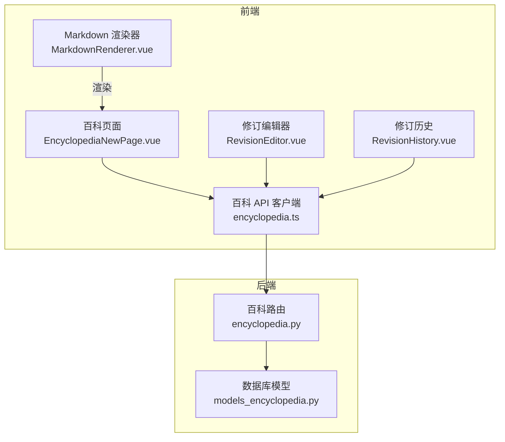
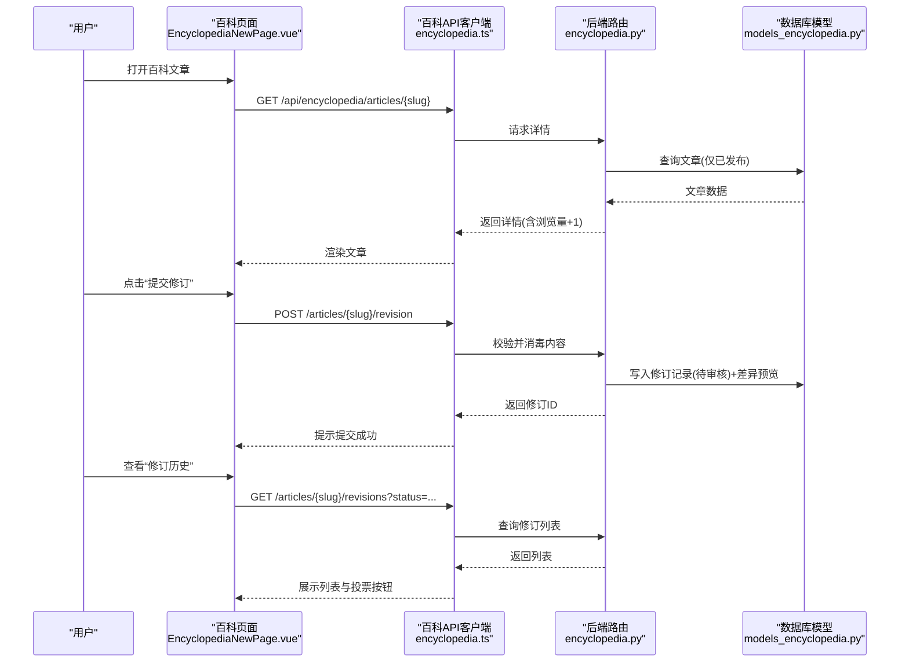
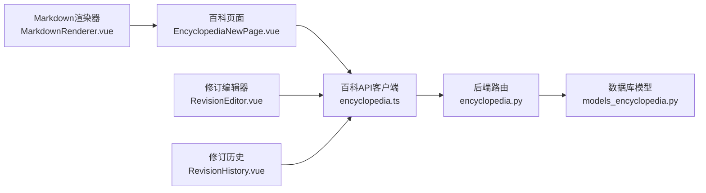

# 内容管理页面

<cite>
**本文引用的文件**
- [EncyclopediaNewPage.vue](file://web/app/src/views/EncyclopediaNewPage.vue)
- [RevisionEditor.vue](file://web/app/src/components/encyclopedia/RevisionEditor.vue)
- [RevisionHistory.vue](file://web/app/src/components/encyclopedia/RevisionHistory.vue)
- [MarkdownRenderer.vue](file://web/app/src/components/encyclopedia/MarkdownRenderer.vue)
- [encyclopedia.ts](file://web/app/src/api/encyclopedia.ts)
- [encyclopedia.py](file://web/backend/api/encyclopedia.py)
- [models_encyclopedia.py](file://web/backend/database/models_encyclopedia.py)
- [content_generation_admin.py](file://web/backend/api/content_generation_admin.py)
- [ContentGen.vue](file://web/admin/src/views/ContentGen.vue)
- [ImagePostEditor.vue](file://web/app/src/components/community/Editor/ImagePostEditor.vue)
</cite>

## 目录
1. [简介](#简介)
2. [项目结构](#项目结构)
3. [核心组件](#核心组件)
4. [架构总览](#架构总览)
5. [详细组件分析](#详细组件分析)
6. [依赖关系分析](#依赖关系分析)
7. [性能考虑](#性能考虑)
8. [故障排查指南](#故障排查指南)
9. [结论](#结论)
10. [附录](#附录)

## 简介
本文件面向“百科内容管理”相关的前后端实现，覆盖内容创建与编辑、修订工作流、评论与投票、分类展示、安全渲染与权限控制等。文档同时给出批量导入导出能力、模板管理与质量检查的扩展建议，以及内容分发与多平台同步的实现思路。读者可据此快速理解现有功能边界并规划后续增强。

## 项目结构
围绕百科内容管理，前端以 Vue 单页应用为主，包含百科阅读、修订提交、修订历史与评论；后端基于 FastAPI 提供 RESTful API，数据持久化使用 SQLAlchemy ORM。

图表来源
- [EncyclopediaNewPage.vue:1-300](file://web/app/src/views/EncyclopediaNewPage.vue#L1-L300)
- [RevisionEditor.vue:1-112](file://web/app/src/components/encyclopedia/RevisionEditor.vue#L1-L112)
- [RevisionHistory.vue:1-170](file://web/app/src/components/encyclopedia/RevisionHistory.vue#L1-L170)
- [MarkdownRenderer.vue:1-84](file://web/app/src/components/encyclopedia/MarkdownRenderer.vue#L1-L84)
- [encyclopedia.ts:1-133](file://web/app/src/api/encyclopedia.ts#L1-L133)
- [encyclopedia.py:1-586](file://web/backend/api/encyclopedia.py#L1-L586)
- [models_encyclopedia.py:1-134](file://web/backend/database/models_encyclopedia.py#L1-L134)

章节来源
- [EncyclopediaNewPage.vue:1-300](file://web/app/src/views/EncyclopediaNewPage.vue#L1-L300)
- [encyclopedia.py:1-586](file://web/backend/api/encyclopedia.py#L1-L586)

## 核心组件
- 百科文章列表与详情：按分类组织文章树，支持点击切换文章、显示阅读量与更新时间。
- 修订工作流：用户提交修订建议（标题、内容、变更说明），后端生成差异预览并进入待审核状态；管理员可批准或拒绝，批准后更新正文。
- 评论系统：支持树形评论，默认需审核通过后才可见。
- 安全渲染：前端使用 MarkdownIt + DOMPurify 进行安全渲染；后端对入库内容进行轻量消毒。
- 权限控制：修订提交、评论发表、投票、审核与回滚均依赖统一认证中间件，审核与回滚要求管理员权限。

章节来源
- [EncyclopediaNewPage.vue:1-300](file://web/app/src/views/EncyclopediaNewPage.vue#L1-L300)
- [RevisionEditor.vue:1-112](file://web/app/src/components/encyclopedia/RevisionEditor.vue#L1-L112)
- [RevisionHistory.vue:1-170](file://web/app/src/components/encyclopedia/RevisionHistory.vue#L1-L170)
- [MarkdownRenderer.vue:1-84](file://web/app/src/components/encyclopedia/MarkdownRenderer.vue#L1-L84)
- [encyclopedia.py:125-148](file://web/backend/api/encyclopedia.py#L125-L148)
- [encyclopedia.py:311-404](file://web/backend/api/encyclopedia.py#L311-L404)

## 架构总览
百科内容管理的端到端流程如下：

图表来源
- [EncyclopediaNewPage.vue:33-94](file://web/app/src/views/EncyclopediaNewPage.vue#L33-L94)
- [encyclopedia.ts:66-117](file://web/app/src/api/encyclopedia.ts#L66-L117)
- [encyclopedia.py:187-216](file://web/backend/api/encyclopedia.py#L187-L216)
- [encyclopedia.py:227-308](file://web/backend/api/encyclopedia.py#L227-L308)
- [models_encyclopedia.py:18-89](file://web/backend/database/models_encyclopedia.py#L18-L89)

## 详细组件分析

### 百科文章列表与详情（EncyclopediaNewPage）
- 功能要点
  - 加载分类文章树与当前文章详情，支持移动端抽屉式目录。
  - 顶部工具栏切换“正文/修订历史/讨论”，登录后可“提交修订”。
  - 注入 Schema.org 结构化数据用于 SEO。
- 关键交互
  - 路由 slug 变化时重新加载文章。
  - 错误处理：404 提示“文章不存在”，其他异常提示“加载失败”。

章节来源
- [EncyclopediaNewPage.vue:17-94](file://web/app/src/views/EncyclopediaNewPage.vue#L17-L94)
- [EncyclopediaNewPage.vue:182-259](file://web/app/src/views/EncyclopediaNewPage.vue#L182-L259)
- [EncyclopediaNewPage.vue:58-70](file://web/app/src/views/EncyclopediaNewPage.vue#L58-L70)

### 修订编辑器（RevisionEditor）
- 功能要点
  - 表单字段：标题、内容（Markdown）、变更说明。
  - 前端校验：变更说明必填且非空；内容长度下限。
  - 提交后触发父组件回调并刷新文章。
- 错误处理
  - 捕获后端返回的错误信息并提示。

章节来源
- [RevisionEditor.vue:20-51](file://web/app/src/components/encyclopedia/RevisionEditor.vue#L20-L51)
- [RevisionEditor.vue:54-111](file://web/app/src/components/encyclopedia/RevisionEditor.vue#L54-L111)

### 修订历史与投票（RevisionHistory）
- 功能要点
  - 支持按状态筛选（全部/待审核/已采纳/已拒绝）。
  - 展示每条修订的差异预览、变更说明与时间。
  - 登录后支持对修订进行点赞/点踩，后端维护票数。
- 权限控制
  - 未登录时投票按钮禁用并提示登录。

章节来源
- [RevisionHistory.vue:17-61](file://web/app/src/components/encyclopedia/RevisionHistory.vue#L17-L61)
- [RevisionHistory.vue:64-169](file://web/app/src/components/encyclopedia/RevisionHistory.vue#L64-L169)

### 安全渲染（MarkdownRenderer）
- 功能要点
  - 使用 MarkdownIt 渲染 HTML，并通过 DOMPurify 进行 XSS 防护。
  - 保留自定义块样式，适配百科排版需求。
- 安全策略
  - 前端主防线：DOMPurify 清理渲染结果。
  - 后端辅助：入库前剔除危险标签与事件处理器。

章节来源
- [MarkdownRenderer.vue:11-28](file://web/app/src/components/encyclopedia/MarkdownRenderer.vue#L11-L28)
- [encyclopedia.py:125-148](file://web/backend/api/encyclopedia.py#L125-L148)

### 后端百科路由（encyclopedia.py）
- 主要接口
  - 获取分类文章树：仅返回已发布文章。
  - 获取文章详情：增加浏览量计数，统计已采纳修订数。
  - 提交修订：校验、消毒、生成 diff 预览、落库为“待审核”。
  - 列出修订：支持按状态过滤。
  - 审核修订：管理员权限，批准则更新文章正文与标题，拒绝则标记状态。
  - 回滚修订：管理员权限，创建回滚记录并恢复指定版本。
  - 投票：同一用户对同一修订只能有一次有效投票，支持切换或取消。
  - 评论：树形结构，默认需审核通过才可见。
- 安全与校验
  - 输入校验：Pydantic 模型限制长度与格式。
  - 内容消毒：正则剔除脚本类载荷与事件处理器。
  - 权限：审核与回滚需要管理员身份。

章节来源
- [encyclopedia.py:187-216](file://web/backend/api/encyclopedia.py#L187-L216)
- [encyclopedia.py:227-308](file://web/backend/api/encyclopedia.py#L227-L308)
- [encyclopedia.py:311-404](file://web/backend/api/encyclopedia.py#L311-L404)
- [encyclopedia.py:409-469](file://web/backend/api/encyclopedia.py#L409-L469)
- [encyclopedia.py:474-555](file://web/backend/api/encyclopedia.py#L474-L555)
- [encyclopedia.py:560-586](file://web/backend/api/encyclopedia.py#L560-L586)

### 数据模型（models_encyclopedia.py）
- 实体关系
  - EncyclopediaArticle：文章主表，关联修订与评论。
  - EncyclopediaRevision：修订记录，含状态、差异预览、审核信息与票数。
  - EncyclopediaComment：评论，支持父子回复与审核标志。
  - EncyclopediaVote：用户对修订的投票，唯一约束防止重复投票。
- 索引优化
  - 针对分类、发布状态、文章ID、状态、用户ID等建立索引以提升查询性能。

章节来源
- [models_encyclopedia.py:18-89](file://web/backend/database/models_encyclopedia.py#L18-L89)
- [models_encyclopedia.py:91-134](file://web/backend/database/models_encyclopedia.py#L91-L134)

### 内容草稿、模板与发布工作流（后台）
- 草稿管理
  - 支持创建、更新草稿，限制已发布草稿不可修改。
  - 支持字段白名单更新（标题、内容、分类、标签、图片、城市、心情、状态等）。
- 发布工作流
  - 单个发布与批量发布接口，返回发布后的帖子ID。
  - 管理员权限校验。
- 模板与批量导入导出
  - 可通过导出器将数据导出为 JSON/Markdown，便于批量导入与归档。
  - 建议在业务层引入模板引擎与导入脚本，结合现有导出器完成批量迁移。

章节来源
- [content_generation_admin.py:181-298](file://web/backend/api/content_generation_admin.py#L181-L298)
- [ContentGen.vue:970-1047](file://web/admin/src/views/ContentGen.vue#L970-L1047)
- [tests/test_exporters.py:79-200](file://tests/test_exporters.py#L79-L200)

### 社区编辑器中的草稿保存（参考）
- 本地草稿与同步
  - 支持将内容、图片、标签、心情、隐私等保存到本地存储，并可与服务器草稿同步。
  - 发布成功后清理本地草稿键，跳转至详情页。
- 适用场景
  - 可作为百科内容草稿自动保存的参考实现，结合定时轮询或防抖策略提升体验。

章节来源
- [ImagePostEditor.vue:202-246](file://web/app/src/components/community/Editor/ImagePostEditor.vue#L202-L246)

## 依赖关系分析

图表来源
- [EncyclopediaNewPage.vue:1-300](file://web/app/src/views/EncyclopediaNewPage.vue#L1-L300)
- [RevisionEditor.vue:1-112](file://web/app/src/components/encyclopedia/RevisionEditor.vue#L1-L112)
- [RevisionHistory.vue:1-170](file://web/app/src/components/encyclopedia/RevisionHistory.vue#L1-L170)
- [MarkdownRenderer.vue:1-84](file://web/app/src/components/encyclopedia/MarkdownRenderer.vue#L1-L84)
- [encyclopedia.ts:1-133](file://web/app/src/api/encyclopedia.ts#L1-L133)
- [encyclopedia.py:1-586](file://web/backend/api/encyclopedia.py#L1-L586)
- [models_encyclopedia.py:1-134](file://web/backend/database/models_encyclopedia.py#L1-L134)

章节来源
- [encyclopedia.ts:66-117](file://web/app/src/api/encyclopedia.ts#L66-L117)
- [encyclopedia.py:187-586](file://web/backend/api/encyclopedia.py#L187-L586)

## 性能考虑
- 列表与详情
  - 后端对分类文章树进行分组聚合，减少前端计算开销。
  - 文章详情在读取时递增浏览量，注意在高并发下可考虑异步计数或缓存。
- 修订历史
  - 支持按状态过滤，避免全量拉取；必要时可增加分页。
- 渲染性能
  - Markdown 渲染在前端进行，配合 DOMPurify 保证安全；对于超长内容可考虑分片或懒加载。
- 数据库索引
  - 已为常用查询字段建立索引，有助于提升列表与筛选性能。

[本节为通用性能建议，不直接分析具体文件]

## 故障排查指南
- 常见问题
  - 文章不存在：当 slug 对应文章未发布或被删除时，后端返回 404。
  - 修订提交失败：检查变更说明是否为空、内容长度是否满足最小值。
  - 投票失败：确认用户已登录；若重复投票，后端会切换或取消。
  - 评论无法显示：默认需审核通过后才可见，等待管理员审核。
- 定位方法
  - 前端：查看网络请求与 toast 提示信息。
  - 后端：检查路由日志与数据库记录状态。
  - 权限问题：确认当前用户角色与所需权限（如审核、回滚需管理员）。

章节来源
- [EncyclopediaNewPage.vue:41-55](file://web/app/src/views/EncyclopediaNewPage.vue#L41-L55)
- [RevisionEditor.vue:28-51](file://web/app/src/components/encyclopedia/RevisionEditor.vue#L28-L51)
- [RevisionHistory.vue:42-57](file://web/app/src/components/encyclopedia/RevisionHistory.vue#L42-L57)
- [encyclopedia.py:150-157](file://web/backend/api/encyclopedia.py#L150-L157)
- [encyclopedia.py:311-361](file://web/backend/api/encyclopedia.py#L311-L361)
- [encyclopedia.py:474-555](file://web/backend/api/encyclopedia.py#L474-L555)

## 结论
本项目实现了百科内容的阅读、修订协作、评论与投票、安全渲染与权限控制等核心能力。通过前后端协同的安全策略与完善的权限校验，保障了内容质量与安全。在此基础上，可进一步扩展草稿自动保存、模板管理、批量导入导出、质量检查与合规审核、内容分发与多平台同步等功能，以满足更复杂的运营需求。

[本节为总结性内容，不直接分析具体文件]

## 附录

### 功能对照与实现位置
- 富文本编辑器集成：当前采用 Markdown 输入与渲染，可在编辑器中接入富文本组件，并在后端保持兼容。
- 图片上传处理：社区编辑器已具备图片上传与草稿保存能力，可复用至百科内容编辑流程。
- 分类标签管理：文章分类由后端模型与路由聚合；标签能力可在草稿管理中扩展。
- SEO 优化设置：页面注入 Schema.org 结构化数据，利于搜索引擎抓取。
- 草稿自动保存：可参考社区编辑器的本地存储与同步机制，结合防抖与定时保存。
- 版本对比预览：后端已生成差异预览，前端以折叠面板展示。
- 发布工作流：后台提供草稿更新与发布接口，支持批量发布。
- 权限验证机制：统一认证中间件校验用户身份，审核与回滚要求管理员权限。
- 批量导入导出：已有 JSON/Markdown 导出器，可结合导入脚本完成批量迁移。
- 内容质量检查：可在提交修订或发布前加入规则校验（长度、敏感词、格式等）。
- 合规性审核：评论默认需审核；可扩展至修订内容与图片的自动化审核。
- 内容分发策略与多平台同步：可在发布成功后触发分发任务，推送至多平台或生成多格式内容。

[本节为概念性补充，不直接分析具体文件]