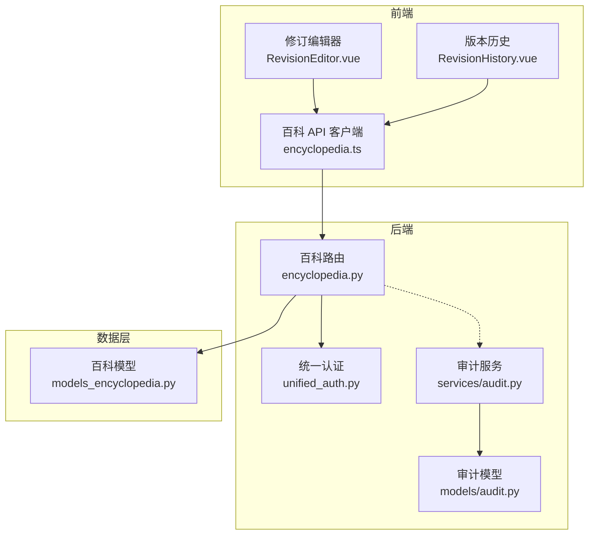
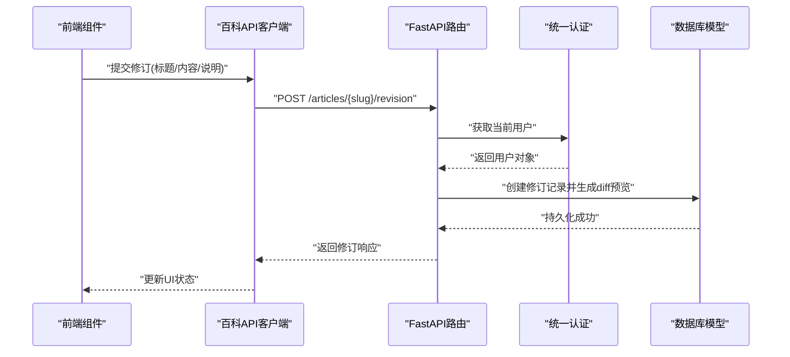
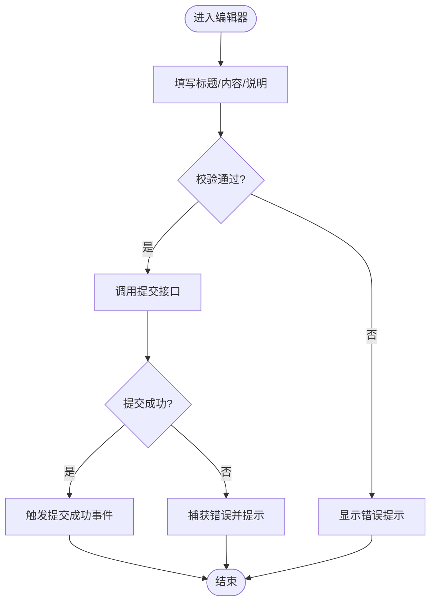
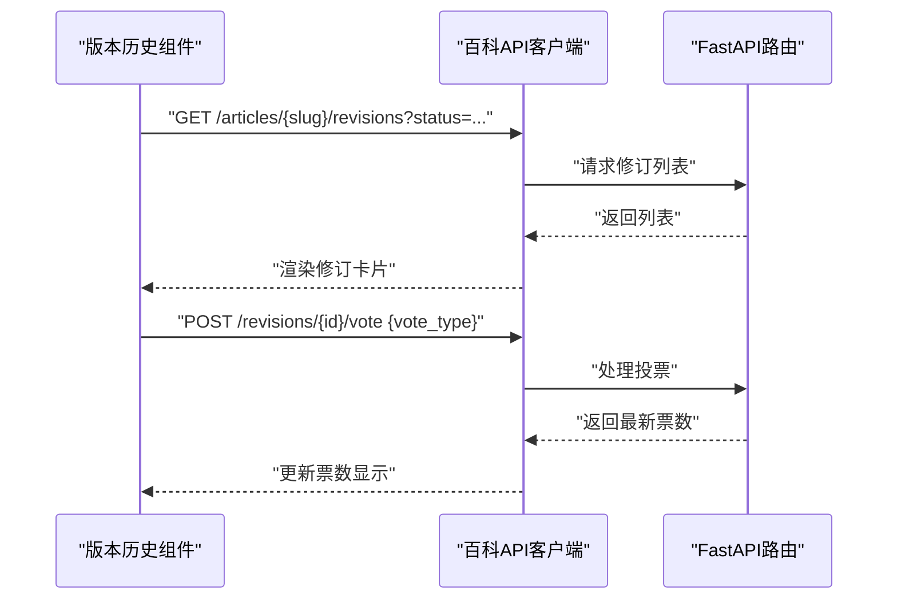
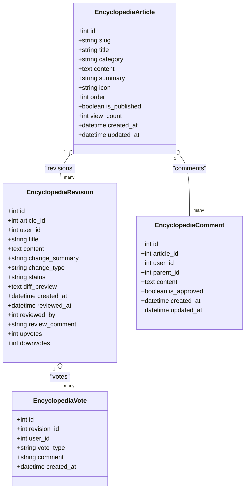
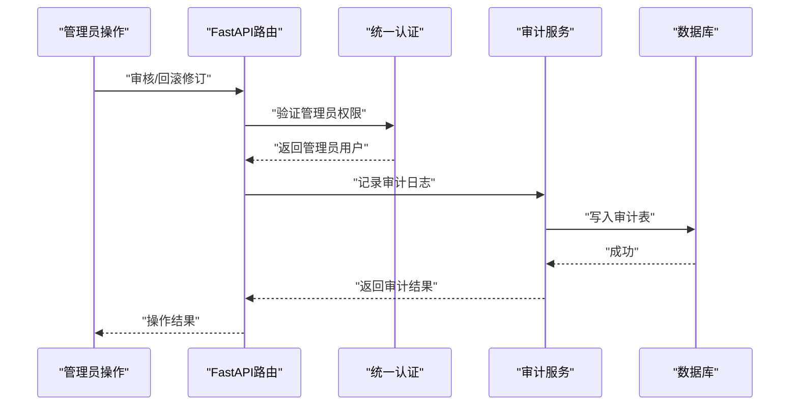
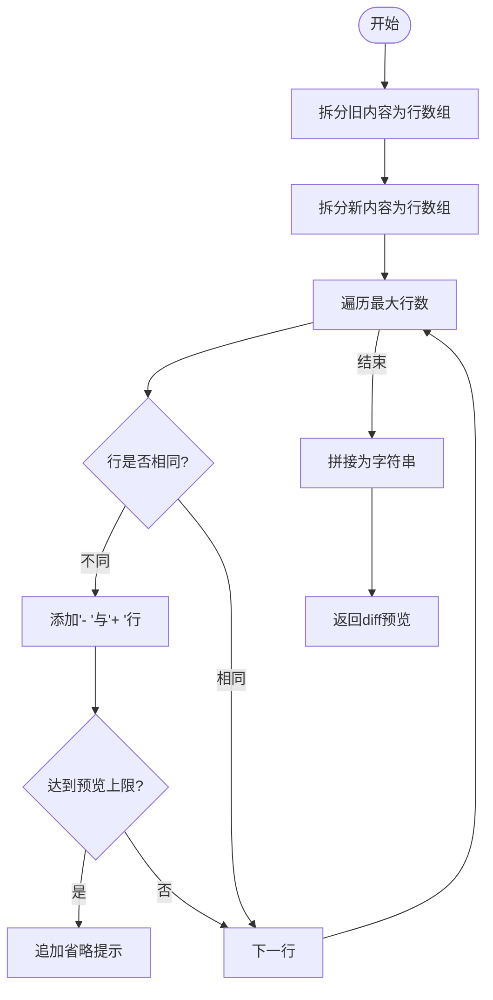
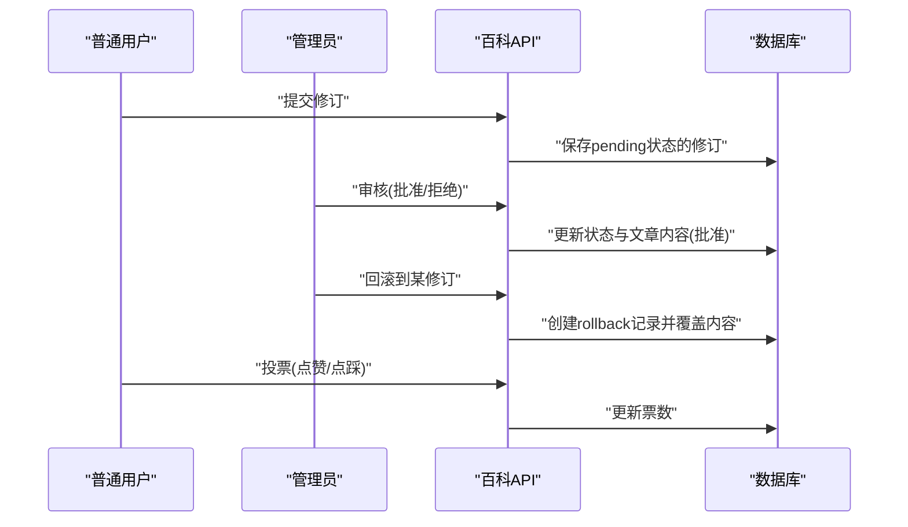
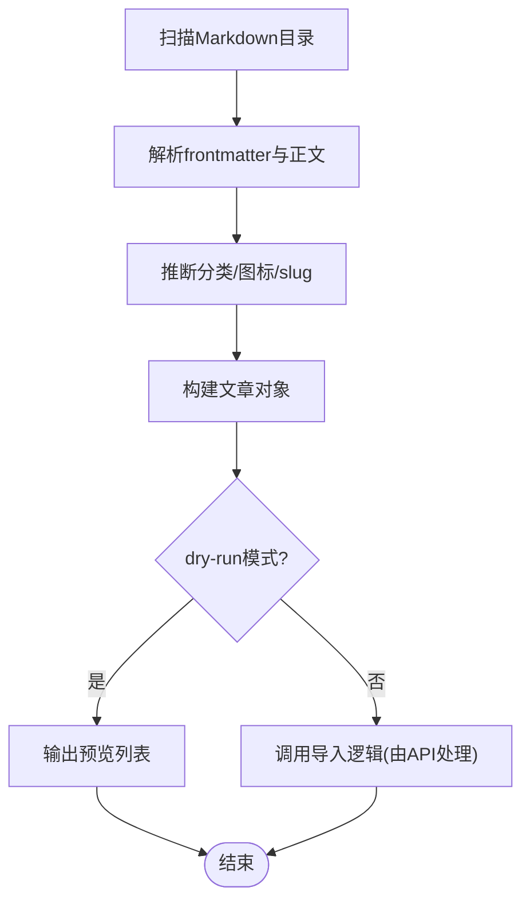
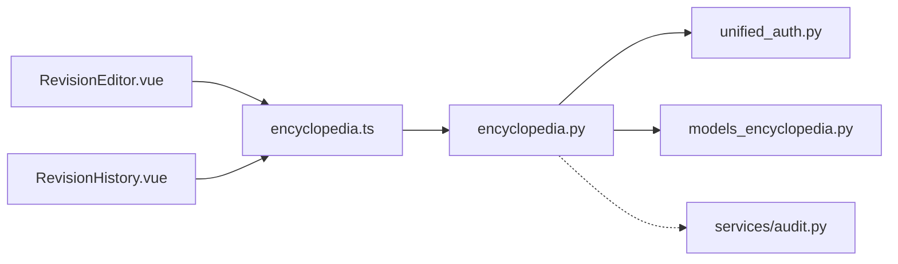

# 版本控制系统

<cite>
**本文引用的文件**   
- [RevisionEditor.vue](file://web/app/src/components/encyclopedia/RevisionEditor.vue)
- [RevisionHistory.vue](file://web/app/src/components/encyclopedia/RevisionHistory.vue)
- [encyclopedia.ts](file://web/app/src/api/encyclopedia.ts)
- [encyclopedia.py](file://web/backend/api/encyclopedia.py)
- [models_encyclopedia.py](file://web/backend/database/models_encyclopedia.py)
- [unified_auth.py](file://web/backend/services/unified_auth.py)
- [audit.py](file://web/backend/services/audit.py)
- [audit.py](file://web/backend/models/audit.py)
- [import_encyclopedia_md.py](file://scripts/import_encyclopedia_md.py)
</cite>

## 目录
1. [简介](#简介)
2. [项目结构](#项目结构)
3. [核心组件](#核心组件)
4. [架构总览](#架构总览)
5. [详细组件分析](#详细组件分析)
6. [依赖关系分析](#依赖关系分析)
7. [性能考量](#性能考量)
8. [故障排查指南](#故障排查指南)
9. [结论](#结论)
10. [附录](#附录)

## 简介
本文件面向“百科内容版本控制系统”，系统性阐述修订编辑器、版本历史查看、差异对比算法、撤销与回滚、协作编辑机制（投票与审核）、版本存储结构、冲突解决策略、权限控制与审计日志记录，以及版本迁移工具、批量操作接口与性能优化方案。文档同时给出版本恢复流程与数据完整性保证机制，帮助读者从前端到后端、从模型到服务全面理解系统设计与实现。

## 项目结构
围绕百科版本控制的代码主要分布在以下位置：
- 前端组件：修订编辑器与版本历史查看界面
- 前端 API 客户端：封装百科相关接口调用
- 后端 FastAPI 路由：百科文章、修订提交、审核、投票、评论等
- 数据库模型：百科文章、修订、评论、投票的表结构与关系
- 认证与权限：统一认证中间件，支持管理员鉴权
- 审计日志：通用审计服务与模型
- 导入脚本：将 VitePress Markdown 批量导入为百科文章

**图表来源** 
- [RevisionEditor.vue](file://web/app/src/components/encyclopedia/RevisionEditor.vue)
- [RevisionHistory.vue](file://web/app/src/components/encyclopedia/RevisionHistory.vue)
- [encyclopedia.ts](file://web/app/src/api/encyclopedia.ts)
- [encyclopedia.py](file://web/backend/api/encyclopedia.py)
- [unified_auth.py](file://web/backend/services/unified_auth.py)
- [audit.py](file://web/backend/services/audit.py)
- [audit.py](file://web/backend/models/audit.py)
- [models_encyclopedia.py](file://web/backend/database/models_encyclopedia.py)

**章节来源**
- [RevisionEditor.vue](file://web/app/src/components/encyclopedia/RevisionEditor.vue)
- [RevisionHistory.vue](file://web/app/src/components/encyclopedia/RevisionHistory.vue)
- [encyclopedia.ts](file://web/app/src/api/encyclopedia.ts)
- [encyclopedia.py](file://web/backend/api/encyclopedia.py)
- [models_encyclopedia.py](file://web/backend/database/models_encyclopedia.py)
- [unified_auth.py](file://web/backend/services/unified_auth.py)
- [audit.py](file://web/backend/services/audit.py)
- [audit.py](file://web/backend/models/audit.py)

## 核心组件
- 修订编辑器：用户提交标题、内容与修订说明，进行基础校验后调用后端提交修订建议。
- 版本历史：按状态筛选展示修订列表，支持查看变更摘要与投票。
- 后端百科路由：提供文章详情、修订提交、修订列表、审核、回滚、投票、评论等接口。
- 数据库模型：定义百科文章、修订、评论、投票的表结构与关联关系。
- 统一认证：基于 Bearer Token 的用户身份获取与管理员权限校验。
- 审计日志：记录关键操作的审计轨迹，支持撤销与查询。

**章节来源**
- [RevisionEditor.vue](file://web/app/src/components/encyclopedia/RevisionEditor.vue)
- [RevisionHistory.vue](file://web/app/src/components/encyclopedia/RevisionHistory.vue)
- [encyclopedia.ts](file://web/app/src/api/encyclopedia.ts)
- [encyclopedia.py](file://web/backend/api/encyclopedia.py)
- [models_encyclopedia.py](file://web/backend/database/models_encyclopedia.py)
- [unified_auth.py](file://web/backend/services/unified_auth.py)
- [audit.py](file://web/backend/services/audit.py)
- [audit.py](file://web/backend/models/audit.py)

## 架构总览
系统采用前后端分离架构，前端通过 RESTful API 与后端交互；后端使用 FastAPI 暴露接口，SQLAlchemy ORM 管理数据库；认证由统一中间件完成；审计服务用于记录关键操作。

**图表来源** 
- [RevisionEditor.vue](file://web/app/src/components/encyclopedia/RevisionEditor.vue)
- [encyclopedia.ts](file://web/app/src/api/encyclopedia.ts)
- [encyclopedia.py](file://web/backend/api/encyclopedia.py)
- [unified_auth.py](file://web/backend/services/unified_auth.py)
- [models_encyclopedia.py](file://web/backend/database/models_encyclopedia.py)

## 详细组件分析

### 修订编辑器（RevisionEditor）
- 功能要点
  - 表单字段：标题、内容（Markdown）、修订说明
  - 前端校验：必填与最小长度限制
  - 提交逻辑：调用后端提交修订建议，成功后触发回调
- 用户体验
  - 提交中禁用按钮，错误提示通过 Toast 显示
  - 支持取消操作

**图表来源** 
- [RevisionEditor.vue](file://web/app/src/components/encyclopedia/RevisionEditor.vue)
- [encyclopedia.ts](file://web/app/src/api/encyclopedia.ts)

**章节来源**
- [RevisionEditor.vue](file://web/app/src/components/encyclopedia/RevisionEditor.vue)
- [encyclopedia.ts](file://web/app/src/api/encyclopedia.ts)

### 版本历史（RevisionHistory）
- 功能要点
  - 按状态筛选：全部、待审核、已采纳、已拒绝
  - 展示修订元信息：ID、状态、变更类型、时间
  - 查看变更摘要：diff_preview 文本预览
  - 投票：支持点赞与点踩，需登录
- 交互流程
  - 页面加载时拉取修订列表
  - 点击投票按钮调用接口并更新本地计数

**图表来源** 
- [RevisionHistory.vue](file://web/app/src/components/encyclopedia/RevisionHistory.vue)
- [encyclopedia.ts](file://web/app/src/api/encyclopedia.ts)
- [encyclopedia.py](file://web/backend/api/encyclopedia.py)

**章节来源**
- [RevisionHistory.vue](file://web/app/src/components/encyclopedia/RevisionHistory.vue)
- [encyclopedia.ts](file://web/app/src/api/encyclopedia.ts)
- [encyclopedia.py](file://web/backend/api/encyclopedia.py)

### 后端百科路由（encyclopedia.py）
- 接口能力
  - 文章详情：增加浏览次数，统计已采纳修订数量
  - 修订提交：轻量消毒、生成 diff 预览、落库
  - 修订列表：按状态过滤，按时间倒序
  - 审核：仅管理员可执行，批准则更新文章内容
  - 回滚：仅管理员可执行，创建回滚记录并覆盖文章内容
  - 投票：支持切换或新增投票，维护票数
  - 评论：树形结构，默认未审核需审批
- 安全与校验
  - 正则清洗危险标签与事件处理器
  - 参数校验与异常处理

**图表来源** 
- [models_encyclopedia.py](file://web/backend/database/models_encyclopedia.py)

**章节来源**
- [encyclopedia.py](file://web/backend/api/encyclopedia.py)
- [models_encyclopedia.py](file://web/backend/database/models_encyclopedia.py)

### 权限控制与审计日志
- 统一认证
  - 基于 Bearer Token 解析用户身份
  - 提供活跃用户与管理员用户校验
- 审计服务
  - 记录动作、目标类型与ID、范围、详情
  - 支持撤销与分页查询
  - IP 脱敏存储

**图表来源** 
- [unified_auth.py](file://web/backend/services/unified_auth.py)
- [audit.py](file://web/backend/services/audit.py)
- [audit.py](file://web/backend/models/audit.py)
- [encyclopedia.py](file://web/backend/api/encyclopedia.py)

**章节来源**
- [unified_auth.py](file://web/backend/services/unified_auth.py)
- [audit.py](file://web/backend/services/audit.py)
- [audit.py](file://web/backend/models/audit.py)
- [encyclopedia.py](file://web/backend/api/encyclopedia.py)

### 版本存储结构与差异对比算法
- 存储结构
  - 文章主表：slug、title、category、content、summary、icon、order、is_published、view_count、时间戳
  - 修订表：article_id、user_id、title、content、change_summary、change_type、status、diff_preview、审核信息与票数
  - 评论表：article_id、user_id、parent_id、content、is_approved、时间戳
  - 投票表：revision_id、user_id、vote_type、comment、时间戳
- 差异对比算法
  - 行级比较：逐行比对旧内容与新内容，输出“-”和“+”前缀的行
  - 限制预览行数：超过阈值追加省略提示
  - 无变更时返回固定文案

**图表来源** 
- [encyclopedia.py](file://web/backend/api/encyclopedia.py)
- [models_encyclopedia.py](file://web/backend/database/models_encyclopedia.py)

**章节来源**
- [encyclopedia.py](file://web/backend/api/encyclopedia.py)
- [models_encyclopedia.py](file://web/backend/database/models_encyclopedia.py)

### 协作编辑机制（投票与审核）
- 投票机制
  - 支持点赞与点踩，重复投票可切换或取消
  - 实时维护 upvotes/downvotes 计数
- 审核机制
  - 仅管理员可审核，批准后将修订内容覆盖至文章主表
  - 拒绝仅标记状态，不改变文章内容
- 回滚机制
  - 管理员可对指定修订执行回滚，创建回滚记录并覆盖文章内容

**图表来源** 
- [encyclopedia.py](file://web/backend/api/encyclopedia.py)
- [models_encyclopedia.py](file://web/backend/database/models_encyclopedia.py)

**章节来源**
- [encyclopedia.py](file://web/backend/api/encyclopedia.py)
- [models_encyclopedia.py](file://web/backend/database/models_encyclopedia.py)

### 版本迁移工具与批量操作
- Markdown 导入工具
  - 扫描 VitePress 文档目录，提取 frontmatter 与正文
  - 根据路径推断分类与图标，计算 slug
  - 支持 dry-run 模式预览待导入文章
- 批量操作接口
  - 文章列表、详情、评论树构建
  - 修订列表与投票聚合

**图表来源** 
- [import_encyclopedia_md.py](file://scripts/import_encyclopedia_md.py)

**章节来源**
- [import_encyclopedia_md.py](file://scripts/import_encyclopedia_md.py)

## 依赖关系分析
- 前端依赖
  - RevisionEditor 与 RevisionHistory 均依赖 encyclopedia.ts 提供的 API 方法
- 后端依赖
  - 百科路由依赖统一认证获取用户身份
  - 数据库模型定义实体关系与索引
  - 审计服务提供通用审计能力
- 外部集成
  - WebSocket 聊天模块（与本版本控制无直接耦合）

**图表来源** 
- [RevisionEditor.vue](file://web/app/src/components/encyclopedia/RevisionEditor.vue)
- [RevisionHistory.vue](file://web/app/src/components/encyclopedia/RevisionHistory.vue)
- [encyclopedia.ts](file://web/app/src/api/encyclopedia.ts)
- [encyclopedia.py](file://web/backend/api/encyclopedia.py)
- [unified_auth.py](file://web/backend/services/unified_auth.py)
- [models_encyclopedia.py](file://web/backend/database/models_encyclopedia.py)
- [audit.py](file://web/backend/services/audit.py)

**章节来源**
- [encyclopedia.py](file://web/backend/api/encyclopedia.py)
- [models_encyclopedia.py](file://web/backend/database/models_encyclopedia.py)
- [unified_auth.py](file://web/backend/services/unified_auth.py)
- [audit.py](file://web/backend/services/audit.py)

## 性能考量
- 数据库索引
  - 文章表：按分类与发布状态建立索引
  - 修订表：按文章ID、状态、用户ID及复合索引提升查询效率
  - 评论表：按文章ID、父评论ID与用户ID建立索引
  - 投票表：唯一约束与索引避免重复投票并加速查询
- 差异预览限制
  - 限制 diff 预览行数，减少前端渲染压力
- 视图计数与事务
  - 文章详情访问次数递增在单事务内提交，降低并发写开销
- 缓存建议（扩展）
  - 对文章列表与热门修订结果引入缓存层（如 Redis）以降低热点查询负载
- 异步与批处理（扩展）
  - 对导入与批量审核场景引入任务队列，避免阻塞请求

[本节为通用指导，无需特定文件引用]

## 故障排查指南
- 常见问题定位
  - 提交修订失败：检查前端校验与后端参数校验，确认用户认证有效
  - 审核失败：确认管理员权限与修订状态为 pending
  - 投票异常：检查是否重复投票与用户登录状态
  - 评论无法显示：确认评论已审核且父评论存在
- 调试建议
  - 查看后端日志与异常堆栈
  - 使用浏览器开发者工具检查网络请求与响应
  - 核对数据库记录与索引状态

**章节来源**
- [encyclopedia.py](file://web/backend/api/encyclopedia.py)
- [unified_auth.py](file://web/backend/services/unified_auth.py)

## 结论
本版本控制系统以清晰的模型设计、严格的权限控制与完善的审计机制为基础，提供了完整的修订提交、审核、回滚与投票协作流程。差异对比算法简洁高效，满足预览需求；数据库索引与事务保障性能与一致性。未来可在缓存、异步任务与更丰富的差异可视化方面进一步优化，以提升大规模协作体验。

[本节为总结性内容，无需特定文件引用]

## 附录
- 版本恢复流程
  - 管理员选择目标修订执行回滚，系统创建回滚记录并覆盖文章内容
  - 若需恢复到更早版本，可多次回滚直至目标版本
- 数据完整性保证
  - 外键约束确保修订与文章、用户之间的关联正确
  - 唯一约束防止重复投票
  - 事务提交保证审核与回滚的原子性
- 最佳实践
  - 提交修订时务必填写清晰说明
  - 审核意见应明确具体，便于追溯
  - 定期备份数据库与审计日志

[本节为补充说明，无需特定文件引用]