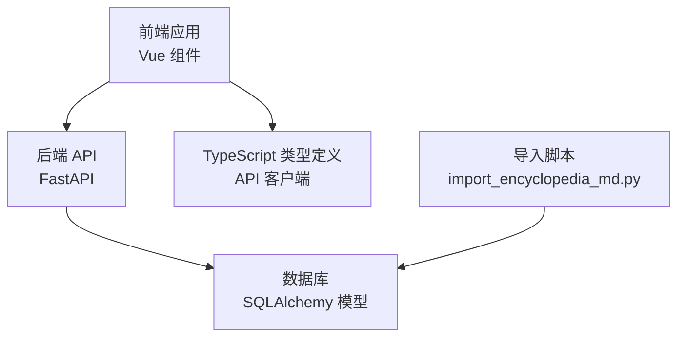
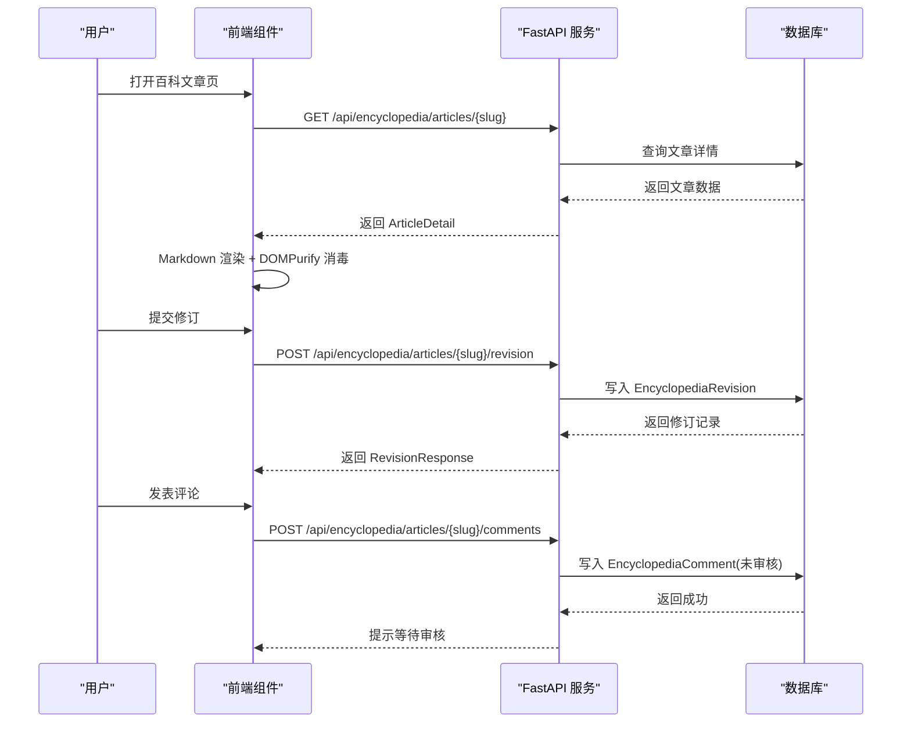
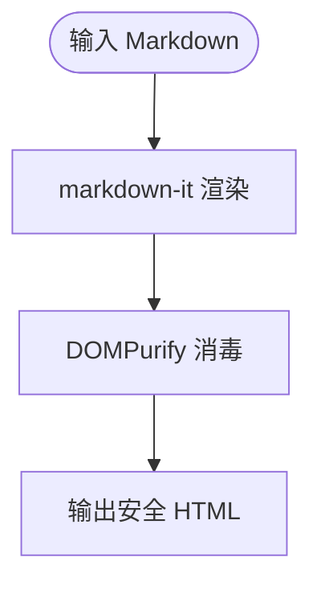
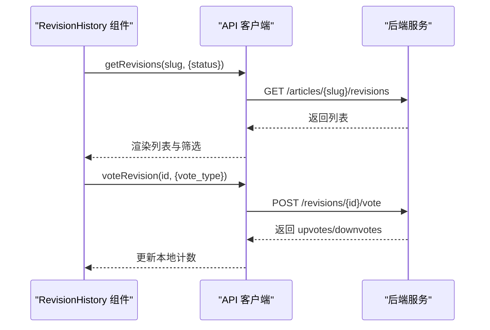
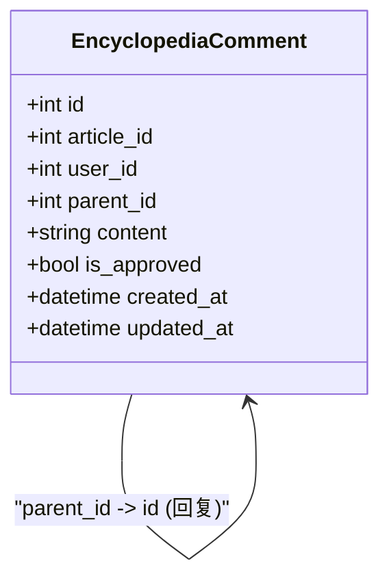
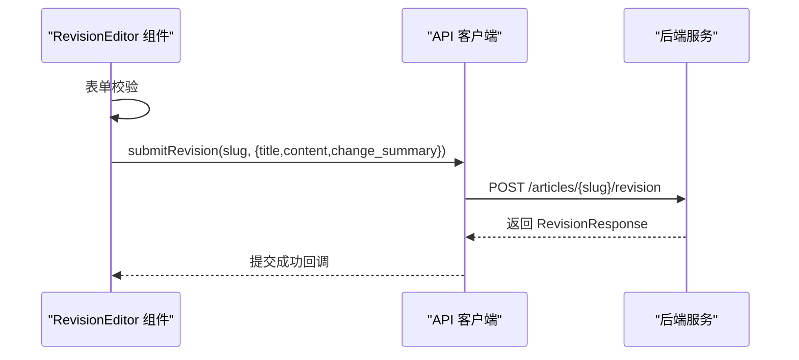
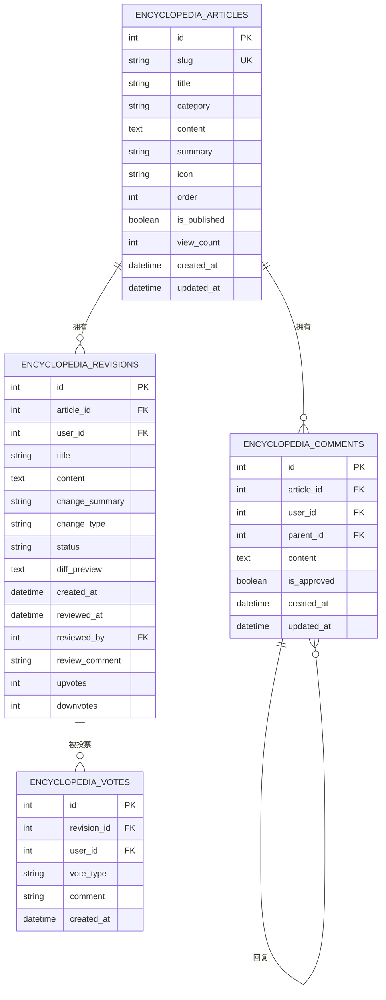
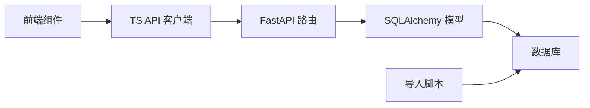
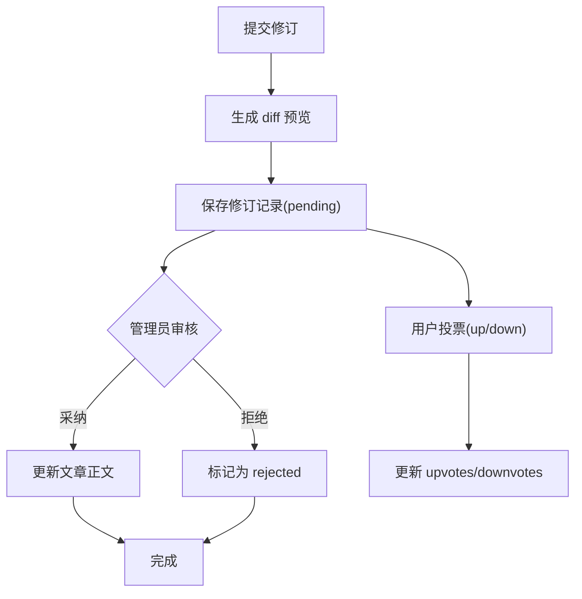

# 百科知识模块

<cite>
**本文引用的文件**   
- [web/backend/api/encyclopedia.py](file://web/backend/api/encyclopedia.py)
- [web/backend/database/models_encyclopedia.py](file://web/backend/database/models_encyclopedia.py)
- [web/app/src/components/encyclopedia/MarkdownRenderer.vue](file://web/app/src/components/encyclopedia/MarkdownRenderer.vue)
- [web/app/src/components/encyclopedia/RevisionHistory.vue](file://web/app/src/components/encyclopedia/RevisionHistory.vue)
- [web/app/src/components/encyclopedia/CommentSection.vue](file://web/app/src/components/encyclopedia/CommentSection.vue)
- [web/app/src/components/encyclopedia/RevisionEditor.vue](file://web/app/src/components/encyclopedia/RevisionEditor.vue)
- [web/app/src/api/encyclopedia.ts](file://web/app/src/api/encyclopedia.ts)
- [scripts/import_encyclopedia_md.py](file://scripts/import_encyclopedia_md.py)
</cite>

## 目录
1. [简介](#简介)
2. [项目结构](#项目结构)
3. [核心组件](#核心组件)
4. [架构总览](#架构总览)
5. [详细组件分析](#详细组件分析)
6. [依赖关系分析](#依赖关系分析)
7. [性能与缓存策略](#性能与缓存策略)
8. [内容安全与权限控制](#内容安全与权限控制)
9. [版本对比与修订流程](#版本对比与修订流程)
10. [搜索索引构建建议](#搜索索引构建建议)
11. [分类与标签管理](#分类与标签管理)
12. [故障排查指南](#故障排查指南)
13. [结论](#结论)

## 简介
本模块为医学知识库的“百科知识”子系统，提供 Markdown 内容渲染、版本控制（修订历史）、评论讨论、审核与投票等能力。前端通过 Vue 组件完成编辑、展示与交互；后端基于 FastAPI 提供 REST API，使用 SQLAlchemy 模型持久化数据，支持分类树、文章详情、修订提交与审核、评论树形结构与投票统计。同时提供将 VitePress Markdown 批量导入数据库的工具脚本，便于内容初始化与迁移。

## 项目结构
- 前端（Vue 3 + TypeScript）
  - 组件：Markdown 渲染、修订历史、评论、修订编辑器
  - API 客户端：封装百科相关接口调用
- 后端（FastAPI + SQLAlchemy）
  - API：百科文章、修订、评论、投票等路由
  - 数据模型：文章、修订、评论、投票四类实体
- 工具脚本
  - 从 VitePress 文档目录扫描并解析 Markdown，生成待导入条目清单

图表来源
- [web/app/src/components/encyclopedia/MarkdownRenderer.vue:1-84](file://web/app/src/components/encyclopedia/MarkdownRenderer.vue#L1-L84)
- [web/app/src/components/encyclopedia/RevisionHistory.vue:1-170](file://web/app/src/components/encyclopedia/RevisionHistory.vue#L1-L170)
- [web/app/src/components/encyclopedia/CommentSection.vue:1-154](file://web/app/src/components/encyclopedia/CommentSection.vue#L1-L154)
- [web/app/src/components/encyclopedia/RevisionEditor.vue:1-112](file://web/app/src/components/encyclopedia/RevisionEditor.vue#L1-L112)
- [web/app/src/api/encyclopedia.ts:1-133](file://web/app/src/api/encyclopedia.ts#L1-L133)
- [web/backend/api/encyclopedia.py:1-586](file://web/backend/api/encyclopedia.py#L1-L586)
- [web/backend/database/models_encyclopedia.py:1-134](file://web/backend/database/models_encyclopedia.py#L1-L134)
- [scripts/import_encyclopedia_md.py:1-162](file://scripts/import_encyclopedia_md.py#L1-L162)

章节来源
- [web/backend/api/encyclopedia.py:1-586](file://web/backend/api/encyclopedia.py#L1-L586)
- [web/backend/database/models_encyclopedia.py:1-134](file://web/backend/database/models_encyclopedia.py#L1-L134)
- [web/app/src/api/encyclopedia.ts:1-133](file://web/app/src/api/encyclopedia.ts#L1-L133)
- [scripts/import_encyclopedia_md.py:1-162](file://scripts/import_encyclopedia_md.py#L1-L162)

## 核心组件
- 内容渲染
  - 使用 markdown-it 渲染 Markdown，启用锚点插件，并通过 DOMPurify 进行 XSS 消毒后输出 HTML。
- 修订历史与对比
  - 列表展示所有修订记录，支持按状态筛选、查看 diff 预览、点赞/踩投票。
- 评论与讨论
  - 支持根评论与回复嵌套，提交需登录且默认进入审核队列。
- 修订编辑器
  - 以表单形式提交标题、内容与修订说明，触发后端创建“建议修订”。
- 数据模型
  - 文章、修订、评论、投票四表关联，具备索引与约束优化查询。
- 导入工具
  - 扫描 VitePress 目录，提取 frontmatter 与正文，计算 slug 与分类，生成导入清单。

章节来源
- [web/app/src/components/encyclopedia/MarkdownRenderer.vue:1-84](file://web/app/src/components/encyclopedia/MarkdownRenderer.vue#L1-L84)
- [web/app/src/components/encyclopedia/RevisionHistory.vue:1-170](file://web/app/src/components/encyclopedia/RevisionHistory.vue#L1-L170)
- [web/app/src/components/encyclopedia/CommentSection.vue:1-154](file://web/app/src/components/encyclopedia/CommentSection.vue#L1-L154)
- [web/app/src/components/encyclopedia/RevisionEditor.vue:1-112](file://web/app/src/components/encyclopedia/RevisionEditor.vue#L1-L112)
- [web/backend/database/models_encyclopedia.py:1-134](file://web/backend/database/models_encyclopedia.py#L1-L134)
- [scripts/import_encyclopedia_md.py:1-162](file://scripts/import_encyclopedia_md.py#L1-L162)

## 架构总览
系统采用前后端分离架构：前端通过 TypeScript 客户端调用 FastAPI 提供的 REST 接口；后端对请求进行参数校验、权限检查、业务处理与数据持久化；数据库层由 SQLAlchemy 模型驱动，包含索引与外键约束。

图表来源
- [web/backend/api/encyclopedia.py:187-216](file://web/backend/api/encyclopedia.py#L187-L216)
- [web/backend/api/encyclopedia.py:227-271](file://web/backend/api/encyclopedia.py#L227-L271)
- [web/backend/api/encyclopedia.py:474-517](file://web/backend/api/encyclopedia.py#L474-L517)
- [web/backend/api/encyclopedia.py:560-586](file://web/backend/api/encyclopedia.py#L560-L586)
- [web/app/src/api/encyclopedia.ts:66-74](file://web/app/src/api/encyclopedia.ts#L66-L74)
- [web/app/src/api/encyclopedia.ts:78-84](file://web/app/src/api/encyclopedia.ts#L78-L84)
- [web/app/src/api/encyclopedia.ts:126-132](file://web/app/src/api/encyclopedia.ts#L126-L132)

## 详细组件分析

### Markdown 渲染组件
- 功能要点
  - 使用 markdown-it 渲染 Markdown，启用链接自动识别、排版优化与标题锚点。
  - 渲染结果经 DOMPurify 消毒，防止 XSS 攻击。
  - 样式通过 Tailwind 类名与 prose 主题适配，支持暗色模式与自定义块样式。
- 安全策略
  - 前端主防线：DOMPurify 清理危险标签与事件处理器。
  - 后端辅助防线：入库前正则剔除 script/iframe 等高危标签与 javascript: URL。

图表来源
- [web/app/src/components/encyclopedia/MarkdownRenderer.vue:1-84](file://web/app/src/components/encyclopedia/MarkdownRenderer.vue#L1-L84)
- [web/backend/api/encyclopedia.py:125-147](file://web/backend/api/encyclopedia.py#L125-L147)

章节来源
- [web/app/src/components/encyclopedia/MarkdownRenderer.vue:1-84](file://web/app/src/components/encyclopedia/MarkdownRenderer.vue#L1-L84)
- [web/backend/api/encyclopedia.py:125-147](file://web/backend/api/encyclopedia.py#L125-L147)

### 修订历史组件
- 功能要点
  - 获取某文章的修订列表，支持按状态过滤（全部/待审核/已采纳/已拒绝）。
  - 显示每条修订的状态、变更摘要、时间戳与 diff 预览。
  - 支持点赞/踩投票，未登录时禁用操作并提示。
- 交互流程
  - 页面加载时拉取修订列表；点击筛选按钮重新请求；点击投票调用后端接口更新计数。

图表来源
- [web/app/src/components/encyclopedia/RevisionHistory.vue:1-170](file://web/app/src/components/encyclopedia/RevisionHistory.vue#L1-L170)
- [web/app/src/api/encyclopedia.ts:86-92](file://web/app/src/api/encyclopedia.ts#L86-L92)
- [web/app/src/api/encyclopedia.ts:111-117](file://web/app/src/api/encyclopedia.ts#L111-L117)
- [web/backend/api/encyclopedia.py:274-308](file://web/backend/api/encyclopedia.py#L274-L308)
- [web/backend/api/encyclopedia.py:409-469](file://web/backend/api/encyclopedia.py#L409-L469)

章节来源
- [web/app/src/components/encyclopedia/RevisionHistory.vue:1-170](file://web/app/src/components/encyclopedia/RevisionHistory.vue#L1-L170)
- [web/app/src/api/encyclopedia.ts:86-92](file://web/app/src/api/encyclopedia.ts#L86-L92)
- [web/backend/api/encyclopedia.py:274-308](file://web/backend/api/encyclopedia.py#L274-L308)

### 评论讨论组件
- 功能要点
  - 获取文章评论树（仅显示已审核的顶级评论及其回复）。
  - 提交评论需登录，内容长度限制，默认进入审核队列。
  - 支持回复指定评论，取消回复与提交反馈。
- 数据结构
  - 评论支持 parent_id 自引用，形成树形结构；后端递归组装 replies。

图表来源
- [web/backend/database/models_encyclopedia.py:91-114](file://web/backend/database/models_encyclopedia.py#L91-L114)
- [web/backend/api/encyclopedia.py:474-517](file://web/backend/api/encyclopedia.py#L474-L517)

章节来源
- [web/app/src/components/encyclopedia/CommentSection.vue:1-154](file://web/app/src/components/encyclopedia/CommentSection.vue#L1-L154)
- [web/backend/database/models_encyclopedia.py:91-114](file://web/backend/database/models_encyclopedia.py#L91-L114)
- [web/backend/api/encyclopedia.py:474-517](file://web/backend/api/encyclopedia.py#L474-L517)

### 修订编辑器组件
- 功能要点
  - 表单包含标题、Markdown 内容与修订说明，提交前进行基础校验（内容长度、说明必填）。
  - 成功后触发回调，用于刷新或关闭弹窗。
- 交互流程
  - 用户填写表单 -> 前端校验 -> 调用提交修订接口 -> 后端创建建议修订 -> 返回结果。

图表来源
- [web/app/src/components/encyclopedia/RevisionEditor.vue:1-112](file://web/app/src/components/encyclopedia/RevisionEditor.vue#L1-L112)
- [web/app/src/api/encyclopedia.ts:78-84](file://web/app/src/api/encyclopedia.ts#L78-L84)
- [web/backend/api/encyclopedia.py:227-271](file://web/backend/api/encyclopedia.py#L227-L271)

章节来源
- [web/app/src/components/encyclopedia/RevisionEditor.vue:1-112](file://web/app/src/components/encyclopedia/RevisionEditor.vue#L1-L112)
- [web/app/src/api/encyclopedia.ts:78-84](file://web/app/src/api/encyclopedia.ts#L78-L84)
- [web/backend/api/encyclopedia.py:227-271](file://web/backend/api/encyclopedia.py#L227-L271)

### 数据模型与关系
- 实体关系
  - 文章（EncyclopediaArticle）一对多修订（EncyclopediaRevision）与评论（EncyclopediaComment）。
  - 修订一对多投票（EncyclopediaVote），用户可重复投票但同一用户对同一修订仅保留一条投票记录。
  - 评论支持自引用 parent_id，形成树形结构。
- 索引与约束
  - 针对 category、is_published、article_id、status、user_id 等字段建立索引以提升查询性能。
  - 投票表设置唯一约束避免重复投票。

图表来源
- [web/backend/database/models_encyclopedia.py:18-134](file://web/backend/database/models_encyclopedia.py#L18-L134)

章节来源
- [web/backend/database/models_encyclopedia.py:18-134](file://web/backend/database/models_encyclopedia.py#L18-L134)

## 依赖关系分析
- 前端依赖
  - Vue 组件依赖 TypeScript API 客户端，后者封装 HTTP 请求与类型定义。
  - Markdown 渲染依赖 markdown-it、markdown-it-anchor、DOMPurify。
- 后端依赖
  - FastAPI 路由依赖 SQLAlchemy ORM 模型与数据库会话。
  - 统一认证依赖 get_current_user 获取当前用户上下文。
- 导入脚本依赖
  - 读取文件系统路径，解析 frontmatter，映射分类与图标，生成导入清单。

图表来源
- [web/app/src/components/encyclopedia/MarkdownRenderer.vue:1-84](file://web/app/src/components/encyclopedia/MarkdownRenderer.vue#L1-L84)
- [web/app/src/api/encyclopedia.ts:1-133](file://web/app/src/api/encyclopedia.ts#L1-L133)
- [web/backend/api/encyclopedia.py:1-586](file://web/backend/api/encyclopedia.py#L1-L586)
- [web/backend/database/models_encyclopedia.py:1-134](file://web/backend/database/models_encyclopedia.py#L1-L134)
- [scripts/import_encyclopedia_md.py:1-162](file://scripts/import_encyclopedia_md.py#L1-L162)

章节来源
- [web/app/src/api/encyclopedia.ts:1-133](file://web/app/src/api/encyclopedia.ts#L1-L133)
- [web/backend/api/encyclopedia.py:1-586](file://web/backend/api/encyclopedia.py#L1-L586)
- [web/backend/database/models_encyclopedia.py:1-134](file://web/backend/database/models_encyclopedia.py#L1-L134)
- [scripts/import_encyclopedia_md.py:1-162](file://scripts/import_encyclopedia_md.py#L1-L162)

## 性能与缓存策略
- 前端渲染
  - Markdown 渲染在组件内计算，使用 computed 缓存渲染结果，减少重复计算。
  - DOMPurify 消毒开销可控，建议在大数据量场景下考虑分页或懒加载。
- 后端查询
  - 列表接口按分类聚合，利用索引提升排序与过滤效率。
  - 评论树构建存在 N+1 风险，可在高并发场景引入 Redis 缓存评论树或预聚合视图。
- 访问统计
  - 文章详情页每次访问递增 view_count，若高频访问可考虑异步计数或缓存聚合。
- 建议
  - 对热点文章与分类树增加短期缓存（如 5-10 分钟）。
  - 评论树与修订列表可结合 Redis 缓存并按更新时间失效。

[本节为通用性能建议，不直接分析具体文件]

## 内容安全与权限控制
- 内容安全
  - 前端：DOMPurify 清理危险标签与事件处理器，确保渲染安全。
  - 后端：入库前正则剔除 script/iframe/object/embed/link/meta/base 等高危标签及 javascript: URL。
- 权限控制
  - 修订审核与回滚需要管理员权限（get_current_user 校验 is_admin）。
  - 评论与修订提交需登录用户身份。
- 审核机制
  - 评论默认 is_approved=False，仅已审核评论可见。
  - 修订默认 status=pending，需管理员 approve/reject 后才生效。

章节来源
- [web/app/src/components/encyclopedia/MarkdownRenderer.vue:1-84](file://web/app/src/components/encyclopedia/MarkdownRenderer.vue#L1-L84)
- [web/backend/api/encyclopedia.py:125-147](file://web/backend/api/encyclopedia.py#L125-L147)
- [web/backend/api/encyclopedia.py:311-361](file://web/backend/api/encyclopedia.py#L311-L361)
- [web/backend/api/encyclopedia.py:364-404](file://web/backend/api/encyclopedia.py#L364-L404)
- [web/backend/api/encyclopedia.py:474-517](file://web/backend/api/encyclopedia.py#L474-L517)

## 版本对比与修订流程
- 差异生成
  - 后端 _build_diff_preview 按行比较旧新内容，生成简化 diff 预览，限制行数避免过大。
- 修订工作流
  - 用户提交建议修订 -> 存储 diff 预览与元数据 -> 管理员审核（采纳/拒绝）-> 采纳后更新文章正文。
  - 支持回滚到指定修订版本，自动生成回滚记录并更新文章内容。
- 投票评估
  - 用户可对修订进行 up/down 投票，支持切换或取消投票，实时统计计数。

图表来源
- [web/backend/api/encyclopedia.py:160-182](file://web/backend/api/encyclopedia.py#L160-L182)
- [web/backend/api/encyclopedia.py:227-271](file://web/backend/api/encyclopedia.py#L227-L271)
- [web/backend/api/encyclopedia.py:311-361](file://web/backend/api/encyclopedia.py#L311-L361)
- [web/backend/api/encyclopedia.py:364-404](file://web/backend/api/encyclopedia.py#L364-L404)
- [web/backend/api/encyclopedia.py:409-469](file://web/backend/api/encyclopedia.py#L409-L469)

章节来源
- [web/backend/api/encyclopedia.py:160-182](file://web/backend/api/encyclopedia.py#L160-L182)
- [web/backend/api/encyclopedia.py:227-271](file://web/backend/api/encyclopedia.py#L227-L271)
- [web/backend/api/encyclopedia.py:311-361](file://web/backend/api/encyclopedia.py#L311-L361)
- [web/backend/api/encyclopedia.py:364-404](file://web/backend/api/encyclopedia.py#L364-L404)
- [web/backend/api/encyclopedia.py:409-469](file://web/backend/api/encyclopedia.py#L409-L469)

## 搜索索引构建建议
- 现状
  - 当前模块未实现全文检索索引，前端可通过本地 MiniSearch 或后端扩展 Elasticsearch/Meilisearch。
- 建议方案
  - 后端增量构建索引：监听文章与修订变更事件，更新倒排索引。
  - 字段权重：标题 > 摘要 > 正文，支持分类与标签过滤。
  - 中文分词：集成 jieba 或第三方分词服务，提升检索准确率。
  - 缓存策略：热门查询结果缓存，降低索引查询压力。

[本节为概念性建议，不直接分析具体文件]

## 分类与标签管理
- 分类体系
  - 文章表含 category 字段，支持按分类聚合与排序，导入脚本根据路径映射分类与图标。
- 标签扩展
  - 当前模型未包含标签字段，可在 EncyclopediaArticle 中新增 tags JSON 或独立标签表，并在 API 中提供标签筛选与聚合接口。
- 导入脚本
  - import_encyclopedia_md.py 从 VitePress 目录推断分类与图标，便于批量初始化。

章节来源
- [web/backend/database/models_encyclopedia.py:18-42](file://web/backend/database/models_encyclopedia.py#L18-L42)
- [scripts/import_encyclopedia_md.py:19-50](file://scripts/import_encyclopedia_md.py#L19-L50)
- [scripts/import_encyclopedia_md.py:83-133](file://scripts/import_encyclopedia_md.py#L83-L133)

## 故障排查指南
- 常见问题
  - 路由冲突：贪婪路由 {slug:path} 会吞掉子资源路径，需确保子资源路由先注册。
  - 评论不可见：评论默认未审核，需后台审批后显示。
  - 修订未生效：修订状态 pending，需管理员审核通过。
  - 渲染异常：检查 Markdown 语法与 DOMPurify 配置，确认无危险标签。
- 调试建议
  - 查看后端日志与错误响应 detail。
  - 前端使用浏览器开发者工具检查网络请求与组件状态。
  - 使用导入脚本 dry-run 模式验证数据解析正确性。

章节来源
- [web/backend/api/encyclopedia.py:219-222](file://web/backend/api/encyclopedia.py#L219-L222)
- [web/backend/api/encyclopedia.py:474-517](file://web/backend/api/encyclopedia.py#L474-L517)
- [web/backend/api/encyclopedia.py:227-271](file://web/backend/api/encyclopedia.py#L227-L271)
- [web/app/src/components/encyclopedia/MarkdownRenderer.vue:1-84](file://web/app/src/components/encyclopedia/MarkdownRenderer.vue#L1-L84)
- [scripts/import_encyclopedia_md.py:136-162](file://scripts/import_encyclopedia_md.py#L136-L162)

## 结论
百科知识模块围绕“内容安全、版本协作、社区互动”三大目标展开，前端以 Vue 组件实现编辑与展示，后端以 FastAPI 提供稳定可靠的 API，数据库模型清晰表达实体关系与约束。通过导入脚本快速初始化内容，借助审核与投票机制保障质量与可信度。未来可扩展搜索索引、标签管理与缓存策略，进一步提升用户体验与系统性能。