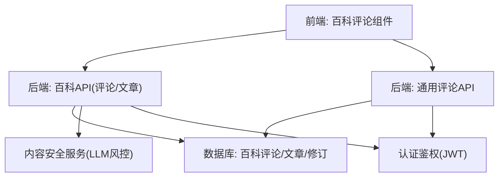
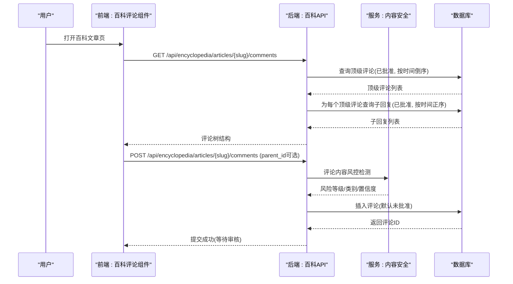
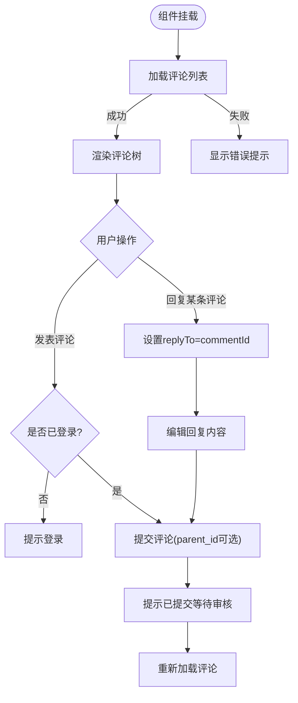
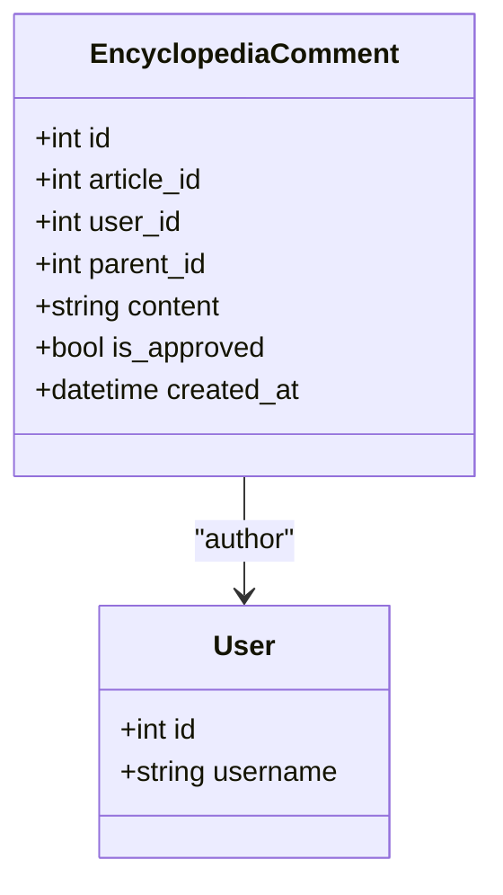
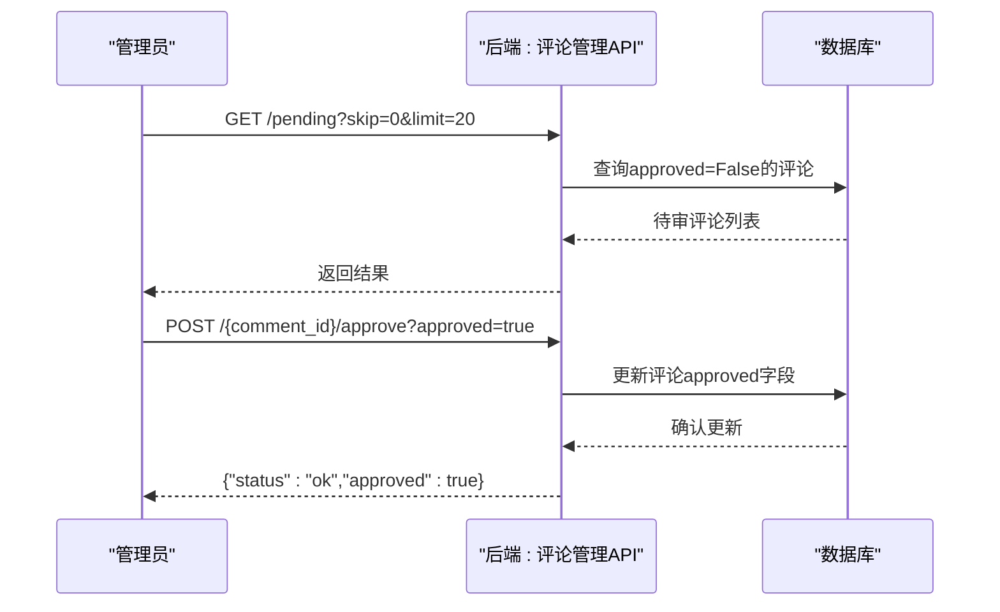
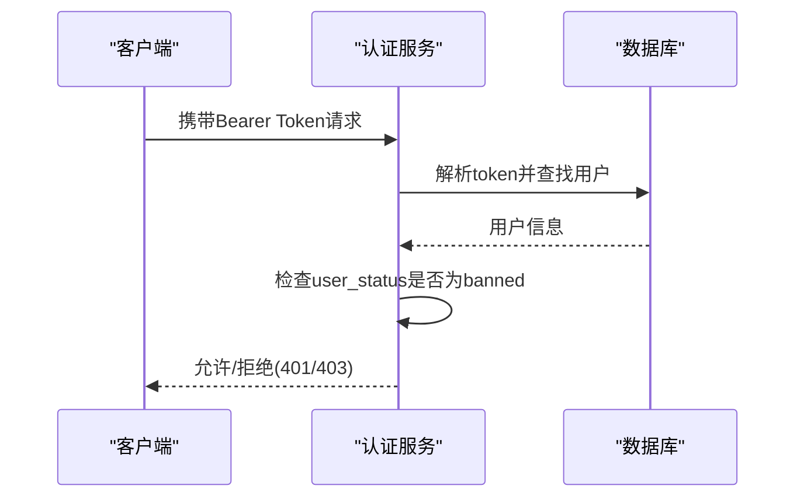
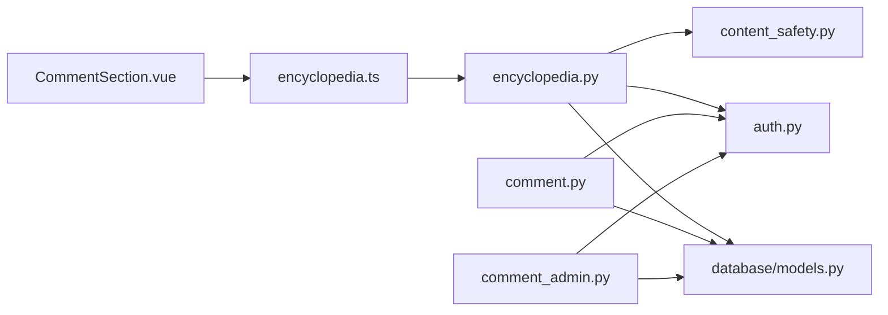

# 评论讨论系统

<cite>
**本文引用的文件**
- [web/backend/api/comment.py](file://web/backend/api/comment.py)
- [web/backend/models/comment.py](file://web/backend/models/comment.py)
- [web/backend/services/comment.py](file://web/backend/services/comment.py)
- [web/backend/api/comment_admin.py](file://web/backend/api/comment_admin.py)
- [web/backend/database/models.py](file://web/backend/database/models.py)
- [web/backend/services/content_safety.py](file://web/backend/services/content_safety.py)
- [web/backend/services/auth.py](file://web/backend/services/auth.py)
- [web/backend/api/encyclopedia.py](file://web/backend/api/encyclopedia.py)
- [web/app/src/components/encyclopedia/CommentSection.vue](file://web/app/src/components/encyclopedia/CommentSection.vue)
- [web/app/src/api/encyclopedia.ts](file://web/app/src/api/encyclopedia.ts)
</cite>

## 目录
1. [简介](#简介)
2. [项目结构](#项目结构)
3. [核心组件](#核心组件)
4. [架构总览](#架构总览)
5. [详细组件分析](#详细组件分析)
6. [依赖关系分析](#依赖关系分析)
7. [性能与缓存策略](#性能与缓存策略)
8. [故障排查指南](#故障排查指南)
9. [结论](#结论)
10. [附录](#附录)

## 简介
本文档面向百科内容评论讨论系统的实现，覆盖评论列表展示、嵌套回复、点赞收藏机制、内容审核流程、用户权限控制、敏感词过滤、垃圾信息防护、举报处理、实时通知推送、评论排序算法、搜索索引构建、缓存策略、评论导出与数据分析接口等。系统采用前后端分离架构：前端使用 Vue 组件渲染评论区并调用百科 API；后端基于 FastAPI 提供评论、管理、安全审核等能力，并通过数据库模型持久化数据。

## 项目结构
- 前端
  - 百科评论组件：负责加载评论、提交评论、支持回复到指定评论。
  - 百科 API 客户端：封装获取文章、评论、提交评论等请求。
- 后端
  - 通用评论模块：提供按页面路径查询已批准评论、创建评论（默认待审）、管理员待审列表与审批。
  - 百科评论模块：提供百科文章下的评论树形结构、嵌套回复、默认待审。
  - 内容安全服务：基于 LLM 的风控判定、自动处置、违规记录与通知。
  - 认证鉴权：JWT 访问令牌、刷新令牌、管理员校验、封禁状态拦截。
  - 数据模型：评论、帖子、用户、事件、互动日志等 ORM 定义。



**图示来源**
- [web/app/src/components/encyclopedia/CommentSection.vue:1-154](file://web/app/src/components/encyclopedia/CommentSection.vue#L1-L154)
- [web/backend/api/encyclopedia.py:472-555](file://web/backend/api/encyclopedia.py#L472-L555)
- [web/backend/api/comment.py:19-32](file://web/backend/api/comment.py#L19-L32)
- [web/backend/services/content_safety.py:190-226](file://web/backend/services/content_safety.py#L190-L226)
- [web/backend/services/auth.py:204-254](file://web/backend/services/auth.py#L204-L254)

**章节来源**
- [web/app/src/components/encyclopedia/CommentSection.vue:1-154](file://web/app/src/components/encyclopedia/CommentSection.vue#L1-L154)
- [web/backend/api/encyclopedia.py:1-586](file://web/backend/api/encyclopedia.py#L1-L586)
- [web/backend/api/comment.py:1-33](file://web/backend/api/comment.py#L1-L33)
- [web/backend/services/content_safety.py:1-368](file://web/backend/services/content_safety.py#L1-L368)
- [web/backend/services/auth.py:1-309](file://web/backend/services/auth.py#L1-L309)

## 核心组件
- 百科评论 API
  - 获取评论树：按文章 slug 返回顶级评论及其子回复，仅返回已批准评论，按时间倒序/正序组合。
  - 创建评论：需登录，支持 parent_id 进行嵌套回复，默认未批准。
- 通用评论 API
  - 按页面路径列出已批准评论。
  - 创建评论：需登录，默认未批准。
- 管理员评论管理
  - 获取待审评论列表（分页）。
  - 批准/拒绝评论（需管理员）。
- 内容安全服务
  - 对评论内容进行 LLM 风控判定，输出风险等级与类别。
  - 根据规则自动标记或屏蔽，并生成违规记录、通知与短信提醒。
- 认证鉴权
  - JWT 访问令牌校验，封禁用户直接拒绝。
  - 管理员权限判断用于管理接口。

**章节来源**
- [web/backend/api/encyclopedia.py:472-555](file://web/backend/api/encyclopedia.py#L472-L555)
- [web/backend/api/comment.py:19-32](file://web/backend/api/comment.py#L19-L32)
- [web/backend/api/comment_admin.py:18-62](file://web/backend/api/comment_admin.py#L18-L62)
- [web/backend/services/content_safety.py:190-226](file://web/backend/services/content_safety.py#L190-L226)
- [web/backend/services/auth.py:204-254](file://web/backend/services/auth.py#L204-L254)

## 架构总览
评论系统由“前端交互层 + 后端 API 层 + 服务层 + 数据层”构成。前端通过百科 API 与通用评论 API 完成评论的读取与提交；服务层负责业务逻辑与安全审核；数据层通过 SQLAlchemy ORM 持久化评论、用户、事件等实体。



**图示来源**
- [web/backend/api/encyclopedia.py:472-555](file://web/backend/api/encyclopedia.py#L472-L555)
- [web/backend/services/content_safety.py:190-226](file://web/backend/services/content_safety.py#L190-L226)

## 详细组件分析

### 百科评论组件（前端）
- 功能要点
  - 加载评论：调用百科 API 获取评论树，失败时提示错误。
  - 提交评论：检查登录态与输入，支持回复到指定评论（parent_id），成功后清空输入并重新加载。
  - 回复交互：点击“回复”进入回复模式，可取消。
- 数据结构
  - 评论对象包含 id、article_id、user_id、parent_id、content、username、is_approved、created_at、replies。
- 用户体验
  - 登录态校验、空内容校验、提交中禁用按钮、错误提示。



**图示来源**
- [web/app/src/components/encyclopedia/CommentSection.vue:19-71](file://web/app/src/components/encyclopedia/CommentSection.vue#L19-L71)
- [web/app/src/components/encyclopedia/CommentSection.vue:74-154](file://web/app/src/components/encyclopedia/CommentSection.vue#L74-L154)

**章节来源**
- [web/app/src/components/encyclopedia/CommentSection.vue:1-154](file://web/app/src/components/encyclopedia/CommentSection.vue#L1-L154)
- [web/app/src/api/encyclopedia.ts:121-132](file://web/app/src/api/encyclopedia.ts#L121-L132)

### 百科评论 API（后端）
- 获取评论树
  - 查询顶级评论：按 article_id、parent_id 为空、is_approved 为真，按 created_at 倒序。
  - 递归构建子回复：按 parent_id、is_approved 为真，按 created_at 正序。
- 创建评论
  - 校验父评论存在性（若提供 parent_id）。
  - 写入评论记录，默认 is_approved=False（需要审核）。
- 数据模型
  - 百科评论表字段包括 article_id、user_id、parent_id、content、is_approved、created_at 等。



**图示来源**
- [web/backend/api/encyclopedia.py:472-555](file://web/backend/api/encyclopedia.py#L472-L555)
- [web/backend/database/models.py:414-428](file://web/backend/database/models.py#L414-L428)

**章节来源**
- [web/backend/api/encyclopedia.py:472-555](file://web/backend/api/encyclopedia.py#L472-L555)
- [web/backend/database/models.py:414-428](file://web/backend/database/models.py#L414-L428)

### 通用评论 API 与管理
- 通用评论
  - 列表：按 page_path 查询已批准评论，按 created_at 倒序。
  - 创建：需登录，默认 approved=False。
- 管理员管理
  - 待审列表：approved=False，分页 skip/limit。
  - 审批：批准/拒绝，需管理员权限。



**图示来源**
- [web/backend/api/comment.py:19-32](file://web/backend/api/comment.py#L19-L32)
- [web/backend/api/comment_admin.py:18-62](file://web/backend/api/comment_admin.py#L18-L62)
- [web/backend/services/comment.py:14-82](file://web/backend/services/comment.py#L14-L82)

**章节来源**
- [web/backend/api/comment.py:1-33](file://web/backend/api/comment.py#L1-L33)
- [web/backend/api/comment_admin.py:1-63](file://web/backend/api/comment_admin.py#L1-L63)
- [web/backend/services/comment.py:1-83](file://web/backend/services/comment.py#L1-L83)

### 内容安全与风控
- 风控判定
  - 使用 LLM 对内容进行风险分类与等级评估，返回 risk_level、risk_categories、reason、confidence。
  - 未配置 LLM 时跳过检测并返回安全标记。
- 自动处置
  - 根据风险等级与置信度决定 blocked/flagged。
  - 对评论进行内容屏蔽或标记，并记录违规与通知。
- 通知与短信
  - 生成站内通知，必要时发送短信提醒（带冷却防刷）。

```mermaid
flowchart TD
In["评论内容"] --> Detect["LLM风控检测"]
Detect --> Level{"风险等级"}
Level --> |safe| Pass["放行"]
Level --> |critical/high/medium(low confidence)| Flag["标记待审/屏蔽"]
Level --> |high/medium(high confidence)| Block["直接屏蔽"]
Flag --> Record["记录违规/通知"]
Block --> Record
Record --> Notify["站内通知/短信(冷却)"]
```

**图示来源**
- [web/backend/services/content_safety.py:54-100](file://web/backend/services/content_safety.py#L54-L100)
- [web/backend/services/content_safety.py:190-226](file://web/backend/services/content_safety.py#L190-L226)
- [web/backend/services/content_safety.py:268-356](file://web/backend/services/content_safety.py#L268-L356)

**章节来源**
- [web/backend/services/content_safety.py:1-368](file://web/backend/services/content_safety.py#L1-L368)

### 用户权限控制
- 认证
  - 通过 JWT 访问令牌校验用户身份，封禁用户直接拒绝。
  - 可选用户获取器用于匿名场景。
- 授权
  - 管理员接口强制校验 is_admin，否则返回 403。
- 刷新令牌
  - 支持刷新令牌管理与清理过期/撤销令牌。



**图示来源**
- [web/backend/services/auth.py:179-254](file://web/backend/services/auth.py#L179-L254)
- [web/backend/api/comment_admin.py:23-29](file://web/backend/api/comment_admin.py#L23-L29)

**章节来源**
- [web/backend/services/auth.py:1-309](file://web/backend/services/auth.py#L1-L309)
- [web/backend/api/comment_admin.py:1-63](file://web/backend/api/comment_admin.py#L1-L63)

### 评论排序算法
- 顶级评论：按 created_at 倒序（最新优先）。
- 子回复：按 created_at 正序（先入先出）。
- 该策略保证主线程清晰、回复顺序自然。

**章节来源**
- [web/backend/api/encyclopedia.py:482-517](file://web/backend/api/encyclopedia.py#L482-L517)

### 搜索索引构建
- 当前代码库未提供评论全文检索索引构建逻辑。
- 建议扩展：为 comments 表建立全文索引或使用外部搜索引擎（如 Elasticsearch）以支持关键词搜索与高亮。

[本节为概念性说明，不直接分析具体文件]

### 缓存策略
- 当前代码库未实现评论数据的显式缓存（如 Redis）。
- 建议扩展：对热门文章的评论树进行缓存，设置合理 TTL，并在评论新增/审批后失效对应缓存键。

[本节为概念性说明，不直接分析具体文件]

### 点赞收藏机制
- 点赞：系统中存在 PostLike 模型用于帖子点赞，但评论点赞未在现有代码中体现。
- 收藏：系统中存在 Bookmark 与 CollectionItem 模型用于帖子收藏，评论收藏未体现。
- 建议扩展：为评论增加 like_count、is_liked 字段及相应 API，并与用户行为日志关联。

**章节来源**
- [web/backend/database/models.py:393-412](file://web/backend/database/models.py#L393-L412)
- [web/backend/database/models.py:546-559](file://web/backend/database/models.py#L546-L559)

### 举报处理机制
- 当前代码库未提供评论举报专用接口。
- 建议扩展：在评论对象上增加 report_count、reported_by 列表，并提供举报 API；结合内容安全服务与管理员后台进行处理。

[本节为概念性说明，不直接分析具体文件]

### 实时通知推送
- 内容安全服务在违规处置时生成站内通知，并可发送短信提醒（带冷却）。
- 建议扩展：引入 WebSocket 通道推送评论审核结果、新回复、点赞等实时消息。

**章节来源**
- [web/backend/services/content_safety.py:268-356](file://web/backend/services/content_safety.py#L268-L356)

### 评论导出功能
- 当前代码库未提供评论导出接口。
- 建议扩展：提供 CSV/JSON 导出，支持按文章 slug、时间范围、审核状态筛选。

[本节为概念性说明，不直接分析具体文件]

### 数据分析接口
- 当前代码库未提供评论维度的数据分析接口。
- 建议扩展：统计评论数量、回复率、审核通过率、违规率、用户活跃度等指标，供仪表盘展示。

[本节为概念性说明，不直接分析具体文件]

## 依赖关系分析
- 前端依赖
  - 百科评论组件依赖 API 客户端与认证状态。
- 后端依赖
  - 百科 API 依赖数据库模型、统一认证、内容安全服务。
  - 通用评论 API 依赖数据库模型、认证服务。
  - 管理员接口依赖认证服务与权限校验。



**图示来源**
- [web/app/src/components/encyclopedia/CommentSection.vue:1-154](file://web/app/src/components/encyclopedia/CommentSection.vue#L1-L154)
- [web/app/src/api/encyclopedia.ts:121-132](file://web/app/src/api/encyclopedia.ts#L121-L132)
- [web/backend/api/encyclopedia.py:472-555](file://web/backend/api/encyclopedia.py#L472-L555)
- [web/backend/api/comment.py:19-32](file://web/backend/api/comment.py#L19-L32)
- [web/backend/api/comment_admin.py:18-62](file://web/backend/api/comment_admin.py#L18-L62)
- [web/backend/services/content_safety.py:190-226](file://web/backend/services/content_safety.py#L190-L226)
- [web/backend/services/auth.py:204-254](file://web/backend/services/auth.py#L204-L254)
- [web/backend/database/models.py:239-253](file://web/backend/database/models.py#L239-L253)

**章节来源**
- [web/backend/api/encyclopedia.py:1-586](file://web/backend/api/encyclopedia.py#L1-L586)
- [web/backend/api/comment.py:1-33](file://web/backend/api/comment.py#L1-L33)
- [web/backend/api/comment_admin.py:1-63](file://web/backend/api/comment_admin.py#L1-L63)
- [web/backend/services/content_safety.py:1-368](file://web/backend/services/content_safety.py#L1-L368)
- [web/backend/services/auth.py:1-309](file://web/backend/services/auth.py#L1-L309)
- [web/backend/database/models.py:239-253](file://web/backend/database/models.py#L239-L253)

## 性能与缓存策略
- 查询优化
  - 评论树构建时分别查询顶级评论与子回复，避免 N+1 问题可通过批量查询优化。
  - 为 page_path、article_id、parent_id、is_approved、created_at 建立合适索引以提升查询效率。
- 缓存建议
  - 对热门文章的评论树进行缓存，TTL 与失效策略需结合发布/审批事件。
  - 使用 Redis 存储评论计数与热点数据。
- 并发与一致性
  - 评论创建与审批应使用事务确保一致性。
  - 防止重复提交与并发写冲突（例如唯一约束与乐观锁）。

[本节为通用性能建议，不直接分析具体文件]

## 故障排查指南
- 常见问题
  - 评论无法显示：检查是否已批准（is_approved/approved），以及页面路径/文章 slug 是否正确。
  - 提交失败：检查登录态、输入长度限制、父评论是否存在。
  - 风控误判：检查 LLM 配置与响应格式，查看内容安全服务日志。
  - 管理员权限不足：确认当前用户 is_admin 标志。
- 日志与监控
  - 关注内容安全服务的异常日志与短信发送失败日志。
  - 监控数据库慢查询与索引使用情况。

**章节来源**
- [web/backend/services/content_safety.py:84-86](file://web/backend/services/content_safety.py#L84-L86)
- [web/backend/services/content_safety.py:359-367](file://web/backend/services/content_safety.py#L359-L367)
- [web/backend/api/encyclopedia.py:520-555](file://web/backend/api/encyclopedia.py#L520-L555)
- [web/backend/api/comment_admin.py:23-29](file://web/backend/api/comment_admin.py#L23-L29)

## 结论
本评论讨论系统实现了百科内容与通用页面的评论功能，具备嵌套回复、默认审核、管理员审批、内容安全风控与通知能力。当前版本尚未实现评论点赞/收藏、举报、搜索索引、缓存与导出等高级特性。建议在后续迭代中补充这些能力，以提升用户体验与运营效率。

## 附录
- 关键数据模型
  - 评论：comments/post_comments/encyclopedia_comment
  - 用户：users
  - 事件与互动：user_events/user_interaction_logs
- 关键 API
  - 百科评论：GET/POST /api/encyclopedia/articles/{slug}/comments
  - 通用评论：GET/POST /api/comments
  - 管理员评论：GET/POST /api/comment-admin/pending、/approve

[本节为概览性说明，不直接分析具体文件]