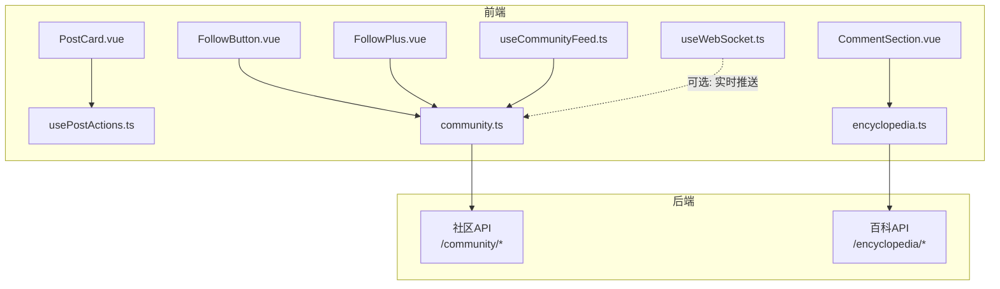
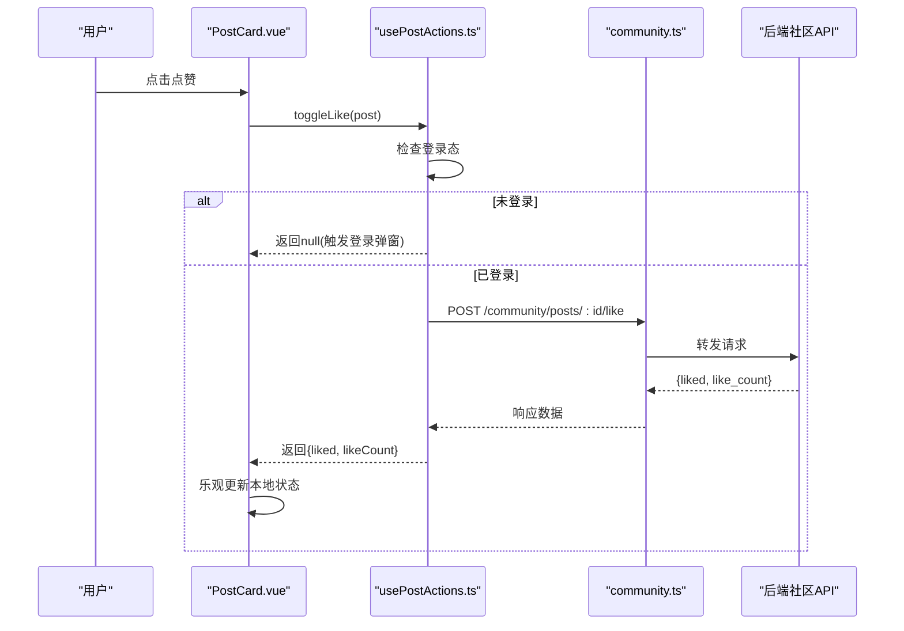
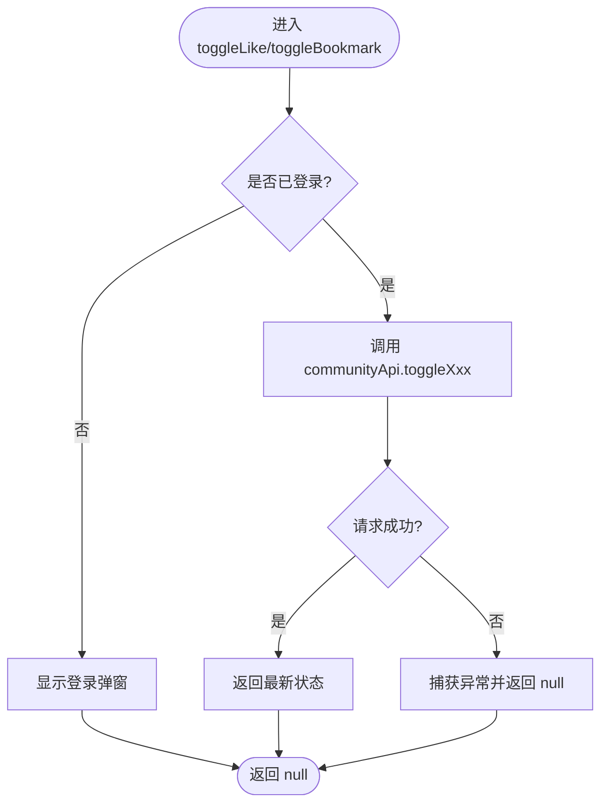
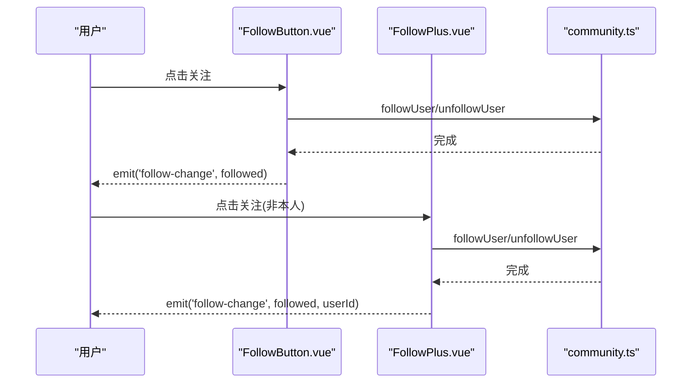
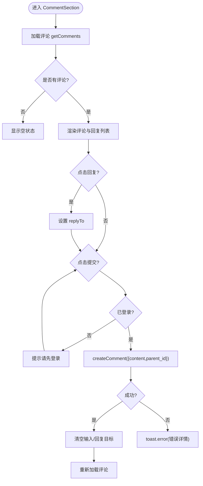
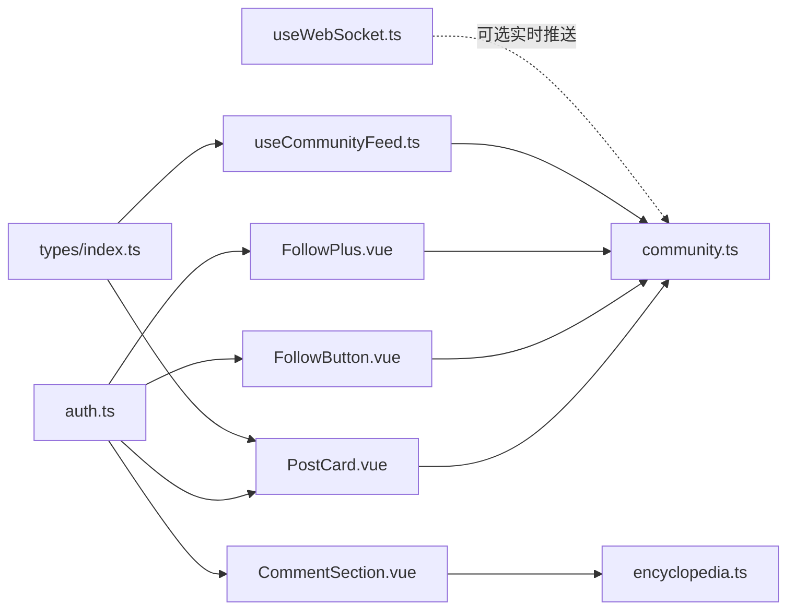

# 互动系统

<cite>
**本文引用的文件**
- [usePostActions.ts](file://web/app/src/composables/usePostActions.ts)
- [FollowButton.vue](file://web/app/src/components/community/FollowButton.vue)
- [FollowPlus.vue](file://web/app/src/components/community/FollowPlus.vue)
- [CommentSection.vue](file://web/app/src/components/encyclopedia/CommentSection.vue)
- [community.ts](file://web/app/src/api/community.ts)
- [encyclopedia.ts](file://web/app/src/api/encyclopedia.ts)
- [auth.ts](file://web/app/src/stores/auth.ts)
- [useToast.ts](file://web/app/src/composables/useToast.ts)
- [PostCard.vue](file://web/app/src/components/community/PostCard.vue)
- [useCommunityFeed.ts](file://web/app/src/composables/useCommunityFeed.ts)
- [useWebSocket.ts](file://web/app/src/composables/useWebSocket.ts)
- [index.ts（类型定义）](file://web/app/src/types/index.ts)
</cite>

## 目录
1. [简介](#简介)
2. [项目结构](#项目结构)
3. [核心组件](#核心组件)
4. [架构总览](#架构总览)
5. [详细组件分析](#详细组件分析)
6. [依赖关系分析](#依赖关系分析)
7. [性能考虑](#性能考虑)
8. [故障排查指南](#故障排查指南)
9. [结论](#结论)
10. [附录](#附录)

## 简介
本文件面向社区互动系统的实现与使用，聚焦以下能力：
- 帖子级交互：点赞、收藏、分享等通过组合式函数统一管理本地状态、API 调用、错误处理与用户反馈。
- 关注按钮：FollowButton 与 FollowPlus 的差异化实现，包括关注状态同步、权限控制、加载态与事件上报。
- 评论系统：CommentSection 的 UI 与交互，支持评论提交、回复嵌套、登录校验与错误提示。
- 高级特性：实时状态更新（WebSocket）、离线缓存策略建议与最佳实践。

## 项目结构
围绕互动能力的代码主要分布在以下位置：
- 组合式函数：usePostActions（点赞/收藏）、useCommunityFeed（信息流合并）、useWebSocket（实时通信）
- 组件：FollowButton、FollowPlus、CommentSection、PostCard
- API 客户端：community.ts（社区相关接口）、encyclopedia.ts（百科评论接口）
- 状态与工具：auth.ts（认证与登录态）、useToast.ts（全局提示）
- 类型定义：types/index.ts（Post、Author、Tag 等）

图表来源
- [PostCard.vue:62-76](file://web/app/src/components/community/PostCard.vue#L62-L76)
- [usePostActions.ts:12-36](file://web/app/src/composables/usePostActions.ts#L12-L36)
- [FollowButton.vue:23-41](file://web/app/src/components/community/FollowButton.vue#L23-L41)
- [FollowPlus.vue:25-46](file://web/app/src/components/community/FollowPlus.vue#L25-L46)
- [CommentSection.vue:19-55](file://web/app/src/components/encyclopedia/CommentSection.vue#L19-L55)
- [community.ts:102-110](file://web/app/src/api/community.ts#L102-L110)
- [encyclopedia.ts:121-132](file://web/app/src/api/encyclopedia.ts#L121-L132)
- [useCommunityFeed.ts:38-85](file://web/app/src/composables/useCommunityFeed.ts#L38-L85)
- [useWebSocket.ts:11-53](file://web/app/src/composables/useWebSocket.ts#L11-L53)

章节来源
- [PostCard.vue:1-184](file://web/app/src/components/community/PostCard.vue#L1-L184)
- [usePostActions.ts:1-40](file://web/app/src/composables/usePostActions.ts#L1-L40)
- [FollowButton.vue:1-57](file://web/app/src/components/community/FollowButton.vue#L1-L57)
- [FollowPlus.vue:1-61](file://web/app/src/components/community/FollowPlus.vue#L1-L61)
- [CommentSection.vue:1-154](file://web/app/src/components/encyclopedia/CommentSection.vue#L1-L154)
- [community.ts:55-284](file://web/app/src/api/community.ts#L55-L284)
- [encyclopedia.ts:1-133](file://web/app/src/api/encyclopedia.ts#L1-L133)
- [useCommunityFeed.ts:1-92](file://web/app/src/composables/useCommunityFeed.ts#L1-L92)
- [useWebSocket.ts:1-75](file://web/app/src/composables/useWebSocket.ts#L1-L75)

## 核心组件
- usePostActions：封装点赞与收藏的统一逻辑，包含登录态检查、API 调用与异常兜底，返回最新状态供上层消费。
- FollowButton / FollowPlus：提供“关注/已关注”切换，FollowPlus 额外屏蔽“自己关注自己”的场景，并向上抛出 follow-change 事件。
- CommentSection：百科文章评论入口，支持评论列表加载、提交、回复嵌套、登录校验与错误提示。
- PostCard：卡片内直接点赞，采用乐观更新提升体验；未登录时触发登录弹窗。
- useCommunityFeed：聚合推荐/关注/本地信息流与个人日记，合并去重并按时间排序。
- useWebSocket：建立 WebSocket 连接，支持心跳、自动重连、消息分发与生命周期管理。

章节来源
- [usePostActions.ts:9-39](file://web/app/src/composables/usePostActions.ts#L9-L39)
- [FollowButton.vue:1-57](file://web/app/src/components/community/FollowButton.vue#L1-L57)
- [FollowPlus.vue:1-61](file://web/app/src/components/community/FollowPlus.vue#L1-L61)
- [CommentSection.vue:1-154](file://web/app/src/components/encyclopedia/CommentSection.vue#L1-L154)
- [PostCard.vue:62-76](file://web/app/src/components/community/PostCard.vue#L62-L76)
- [useCommunityFeed.ts:29-85](file://web/app/src/composables/useCommunityFeed.ts#L29-L85)
- [useWebSocket.ts:4-73](file://web/app/src/composables/useWebSocket.ts#L4-L73)

## 架构总览
互动系统遵循“组件 -> 组合式函数 -> API 客户端 -> 后端服务”的分层模式，并通过 Pinia 存储统一认证状态，Toast 提供统一反馈。

图表来源
- [PostCard.vue:62-76](file://web/app/src/components/community/PostCard.vue#L62-L76)
- [usePostActions.ts:12-23](file://web/app/src/composables/usePostActions.ts#L12-L23)
- [community.ts:102-105](file://web/app/src/api/community.ts#L102-L105)

## 详细组件分析

### 点赞与收藏：usePostActions
- 功能要点
  - 登录态前置校验：未登录则打开登录弹窗并短路返回。
  - 调用社区 API：toggleLike、toggleBookmark。
  - 错误处理：捕获异常并返回 null，由调用方决定降级策略。
- 数据流
  - 调用方传入 Post 对象，返回最新交互状态，便于上层进行乐观更新或回滚。
- 复杂度
  - 时间复杂度 O(1)，空间复杂度 O(1)。
- 优化建议
  - 可结合 useCommunityFeed 对列表项做批量乐观更新。
  - 失败时可配合 Toast 提示“操作失败”。

图表来源
- [usePostActions.ts:12-36](file://web/app/src/composables/usePostActions.ts#L12-L36)

章节来源
- [usePostActions.ts:1-40](file://web/app/src/composables/usePostActions.ts#L1-L40)
- [community.ts:102-110](file://web/app/src/api/community.ts#L102-L110)

### 关注按钮：FollowButton 与 FollowPlus
- 差异点
  - FollowButton：基础关注按钮，监听 initialFollowed 变化，双向同步本地 followed 状态，成功后 emit('follow-change', followed)。
  - FollowPlus：在 FollowButton 基础上增加“自己不可关注自己”的权限控制（isSelf 计算属性），emit 携带 userId。
- 状态与交互
  - loading 防抖：避免重复点击。
  - 样式与文案：根据 followed 与 loading 动态切换。
- 错误处理
  - 捕获异常并记录日志，finally 中重置 loading。

图表来源
- [FollowButton.vue:23-41](file://web/app/src/components/community/FollowButton.vue#L23-L41)
- [FollowPlus.vue:25-46](file://web/app/src/components/community/FollowPlus.vue#L25-L46)
- [community.ts:237-243](file://web/app/src/api/community.ts#L237-L243)

章节来源
- [FollowButton.vue:1-57](file://web/app/src/components/community/FollowButton.vue#L1-L57)
- [FollowPlus.vue:1-61](file://web/app/src/components/community/FollowPlus.vue#L1-L61)
- [community.ts:237-243](file://web/app/src/api/community.ts#L237-L243)

### 评论系统：CommentSection
- 功能要点
  - 加载评论：getComments(articleSlug)，失败时 toast.error。
  - 提交评论：createComment(articleSlug, {content, parent_id})，支持回复嵌套。
  - 登录校验：未登录禁止提交与回复，toast 提示。
  - 表单状态：replyTo 控制回复目标，submitting 控制提交按钮禁用。
- 用户体验
  - 提交后清空输入框与回复目标，刷新评论列表。
  - 错误信息来自服务端 detail 字段或默认提示。

图表来源
- [CommentSection.vue:19-55](file://web/app/src/components/encyclopedia/CommentSection.vue#L19-L55)
- [encyclopedia.ts:121-132](file://web/app/src/api/encyclopedia.ts#L121-L132)

章节来源
- [CommentSection.vue:1-154](file://web/app/src/components/encyclopedia/CommentSection.vue#L1-L154)
- [encyclopedia.ts:121-132](file://web/app/src/api/encyclopedia.ts#L121-L132)
- [useToast.ts:12-30](file://web/app/src/composables/useToast.ts#L12-L30)

### 卡片内点赞：PostCard
- 行为
  - 未登录：打开登录弹窗。
  - 已登录：调用 communityApi.toggleLike，乐观更新 localLiked 与 localLikeCount。
  - 失败静默处理，避免打断浏览体验。
- 展示
  - 时间+城市格式化，图片懒加载，分类占位图。

章节来源
- [PostCard.vue:62-76](file://web/app/src/components/community/PostCard.vue#L62-L76)
- [community.ts:102-105](file://web/app/src/api/community.ts#L102-L105)

### 信息流合并：useCommunityFeed
- 能力
  - 支持 feedType: follow/recommend/local，按条件拼接参数。
  - 并行获取公共信息流与个人日记，合并去重并按 created_at 倒序。
  - 维护 publicLoaded 计数与 hasMore 分页判断。
- 适用场景
  - 首页信息流、关注页、同城页等。

章节来源
- [useCommunityFeed.ts:29-85](file://web/app/src/composables/useCommunityFeed.ts#L29-L85)
- [community.ts:61-85](file://web/app/src/api/community.ts#L61-L85)

### 实时状态更新：useWebSocket
- 能力
  - 基于 token 建立 ws/wss 连接，发送 ping 保活。
  - onmessage 解析 JSON，按 type 分派到处理器集合，支持通配符 *。
  - 断线指数退避重连，onUnmounted 自动关闭。
- 集成建议
  - 在需要实时更新的页面（如通知、私信、互动计数）订阅特定类型消息，驱动局部状态更新。
  - 注意鉴权：无 token 不建立连接。

章节来源
- [useWebSocket.ts:4-73](file://web/app/src/composables/useWebSocket.ts#L4-L73)
- [auth.ts:8-14](file://web/app/src/stores/auth.ts#L8-L14)

## 依赖关系分析
- 组件依赖
  - PostCard 依赖 usePostActions 或直接调用 communityApi 进行点赞。
  - FollowButton/FollowPlus 依赖 communityApi 的关注/取消关注接口。
  - CommentSection 依赖 encyclopediaApi 的评论接口。
- 状态与工具
  - auth.ts 提供 isLoggedIn、showLoginModal 等状态，贯穿各组件。
  - useToast 提供统一的用户反馈。
- 类型契约
  - types/index.ts 中的 Post、PostAuthor、Category 等确保前后端数据结构一致。

图表来源
- [PostCard.vue:62-76](file://web/app/src/components/community/PostCard.vue#L62-L76)
- [FollowButton.vue:23-41](file://web/app/src/components/community/FollowButton.vue#L23-L41)
- [FollowPlus.vue:25-46](file://web/app/src/components/community/FollowPlus.vue#L25-L46)
- [CommentSection.vue:19-55](file://web/app/src/components/encyclopedia/CommentSection.vue#L19-L55)
- [useCommunityFeed.ts:38-85](file://web/app/src/composables/useCommunityFeed.ts#L38-L85)
- [useWebSocket.ts:11-53](file://web/app/src/composables/useWebSocket.ts#L11-L53)
- [auth.ts:8-14](file://web/app/src/stores/auth.ts#L8-L14)
- [index.ts:99-199](file://web/app/src/types/index.ts#L99-L199)

章节来源
- [community.ts:55-284](file://web/app/src/api/community.ts#L55-L284)
- [encyclopedia.ts:1-133](file://web/app/src/api/encyclopedia.ts#L1-L133)
- [auth.ts:8-14](file://web/app/src/stores/auth.ts#L8-L14)
- [index.ts:99-199](file://web/app/src/types/index.ts#L99-L199)

## 性能考虑
- 乐观更新
  - 点赞/收藏在本地立即变更状态，减少等待感；失败再回滚或保持静默。
- 并发请求
  - 信息流加载时使用 Promise.all 并行拉取公共流与个人日记，降低首屏耗时。
- 列表渲染
  - 图片懒加载、按需渲染，避免大图阻塞。
- WebSocket
  - 心跳保活与指数退避重连，避免频繁重连造成资源浪费。
- 缓存建议
  - 列表数据可按 key 短期缓存（如 5 分钟），结合 cursor 分页避免重复请求。
  - 评论列表可在提交后增量插入新评论，减少全量刷新。

[本节为通用指导，不直接分析具体文件]

## 故障排查指南
- 未登录导致操作失败
  - 现象：点击点赞/收藏/评论无响应或提示登录。
  - 定位：检查 authStore.isLoggedIn 与 showLoginModal。
  - 参考路径
    - [usePostActions.ts:12-16](file://web/app/src/composables/usePostActions.ts#L12-L16)
    - [PostCard.vue:65-68](file://web/app/src/components/community/PostCard.vue#L65-L68)
    - [CommentSection.vue:31-37](file://web/app/src/components/encyclopedia/CommentSection.vue#L31-L37)
- 网络异常
  - 现象：操作后无状态变化或出现错误提示。
  - 定位：查看 API 调用与 catch 分支；确认后端返回码与 detail。
  - 参考路径
    - [usePostActions.ts:17-22](file://web/app/src/composables/usePostActions.ts#L17-L22)
    - [CommentSection.vue:41-54](file://web/app/src/components/encyclopedia/CommentSection.vue#L41-L54)
- 关注按钮无效
  - 现象：点击无变化或报错。
  - 定位：检查 isSelf 权限控制与 loading 状态；确认 follow/unfollow 接口调用。
  - 参考路径
    - [FollowPlus.vue:19-23](file://web/app/src/components/community/FollowPlus.vue#L19-L23)
    - [FollowButton.vue:23-41](file://web/app/src/components/community/FollowButton.vue#L23-L41)
- WebSocket 连接问题
  - 现象：无法接收实时消息或频繁断开。
  - 定位：检查 token 是否存在、协议与 host 是否正确、onclose/onerror 分支。
  - 参考路径
    - [useWebSocket.ts:11-53](file://web/app/src/composables/useWebSocket.ts#L11-L53)

章节来源
- [usePostActions.ts:12-22](file://web/app/src/composables/usePostActions.ts#L12-L22)
- [PostCard.vue:65-76](file://web/app/src/components/community/PostCard.vue#L65-L76)
- [CommentSection.vue:31-54](file://web/app/src/components/encyclopedia/CommentSection.vue#L31-L54)
- [FollowButton.vue:23-41](file://web/app/src/components/community/FollowButton.vue#L23-L41)
- [FollowPlus.vue:19-46](file://web/app/src/components/community/FollowPlus.vue#L19-L46)
- [useWebSocket.ts:11-53](file://web/app/src/composables/useWebSocket.ts#L11-L53)

## 结论
本互动系统以清晰的层次划分与组合式函数抽象，实现了点赞、收藏、关注、评论等核心交互，并通过乐观更新与统一提示提升用户体验。WebSocket 为后续实时化提供了基础设施。建议在现有基础上逐步引入更完善的缓存与重试机制，进一步提升鲁棒性与性能。

[本节为总结性内容，不直接分析具体文件]

## 附录
- 关键类型
  - Post、PostAuthor、Category、PostTag 等定义于类型文件中，确保前后端一致性。
- 常用 API
  - 社区：点赞、收藏、关注/取关、评论、信息流、标签、合集等。
  - 百科：文章、修订、投票、评论等。

章节来源
- [index.ts:99-199](file://web/app/src/types/index.ts#L99-L199)
- [community.ts:55-284](file://web/app/src/api/community.ts#L55-L284)
- [encyclopedia.ts:1-133](file://web/app/src/api/encyclopedia.ts#L1-L133)