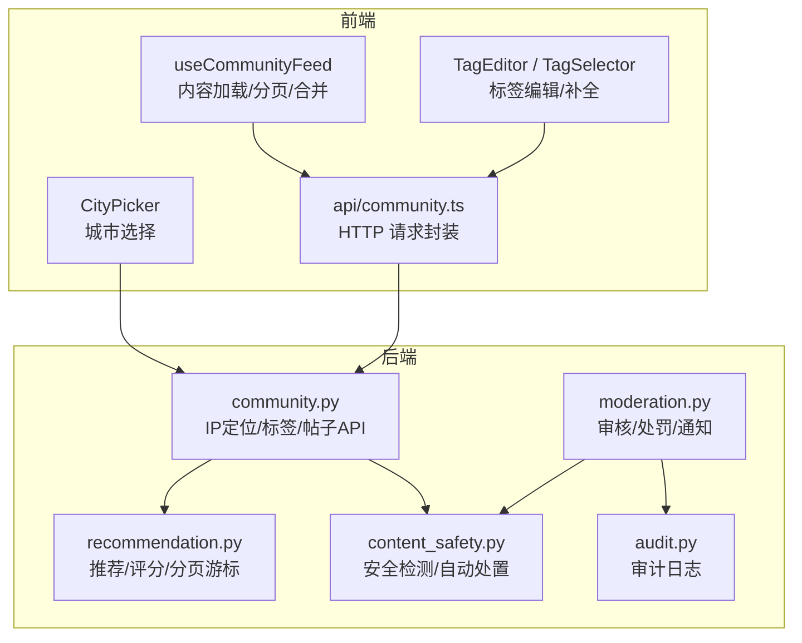
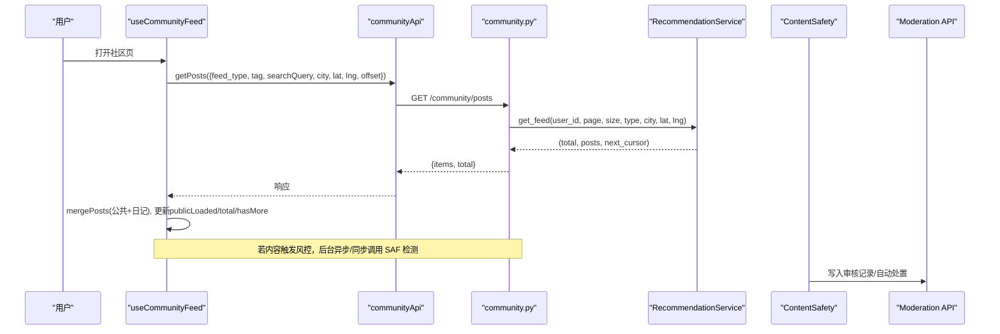
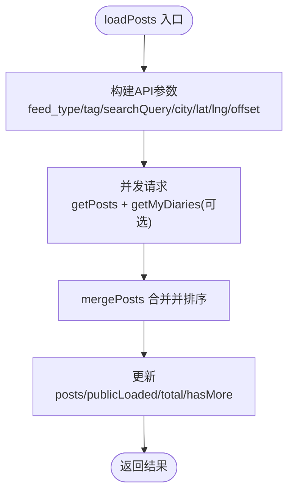
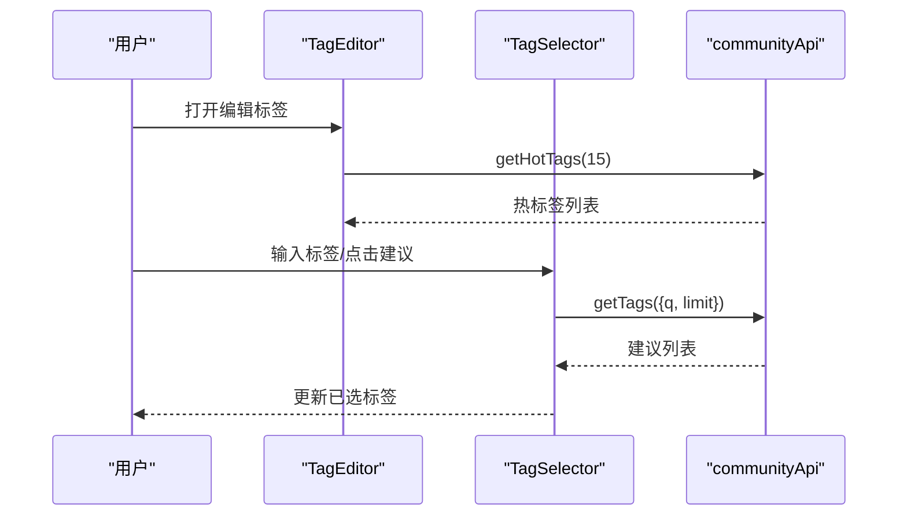
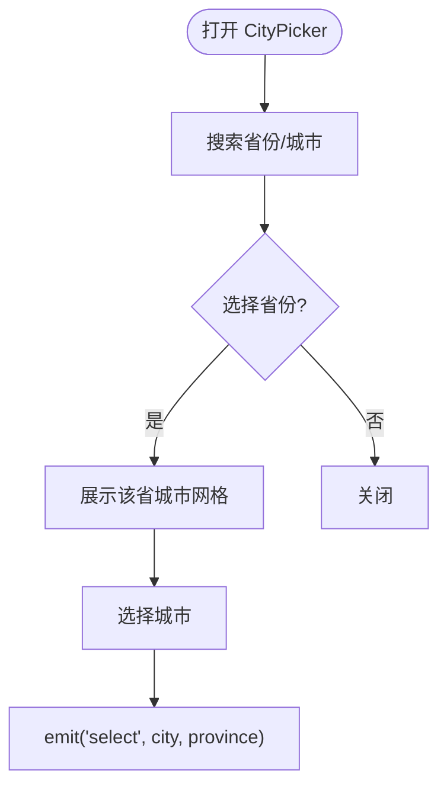
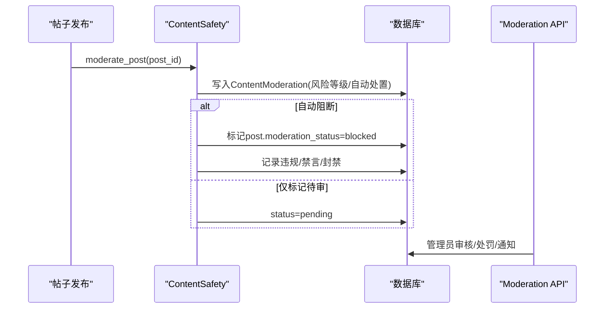
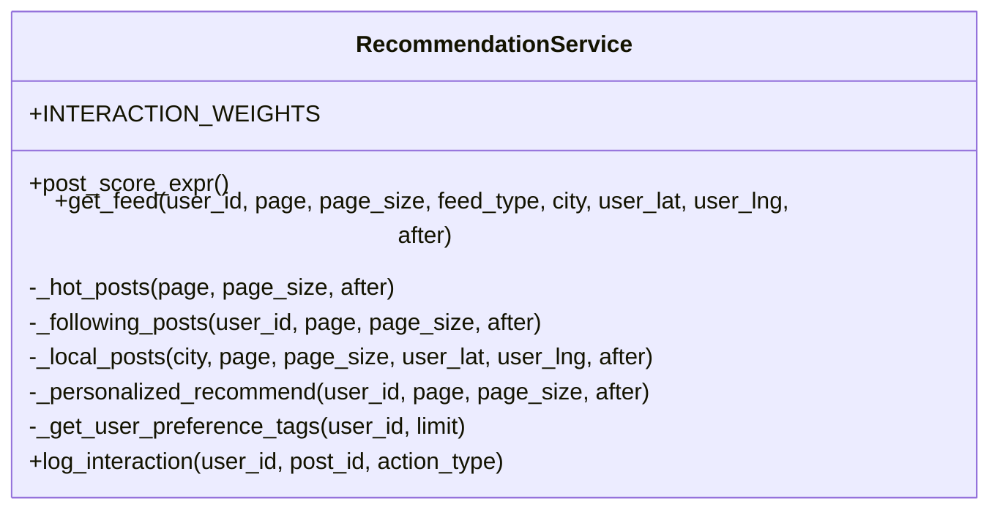
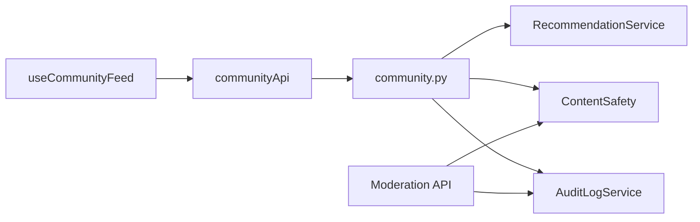

# 内容管理

<cite>
**本文引用的文件**
- [web/app/src/composables/useCommunityFeed.ts](file://web/app/src/composables/useCommunityFeed.ts)
- [web/app/src/components/community/TagEditor.vue](file://web/app/src/components/community/TagEditor.vue)
- [web/app/src/components/community/TagSelector.vue](file://web/app/src/components/community/TagSelector.vue)
- [web/app/src/components/community/CityPicker.vue](file://web/app/src/components/community/CityPicker.vue)
- [web/app/src/data/cities.ts](file://web/app/src/data/cities.ts)
- [web/app/src/api/community.ts](file://web/app/src/api/community.ts)
- [web/backend/services/content_safety.py](file://web/backend/services/content_safety.py)
- [web/backend/services/recommendation.py](file://web/backend/services/recommendation.py)
- [web/backend/api/moderation.py](file://web/backend/api/moderation.py)
- [web/backend/services/audit.py](file://web/backend/services/audit.py)
- [web/backend/api/community.py](file://web/backend/api/community.py)
</cite>

## 目录
1. [简介](#简介)
2. [项目结构](#项目结构)
3. [核心组件](#核心组件)
4. [架构总览](#架构总览)
5. [详细组件分析](#详细组件分析)
6. [依赖关系分析](#依赖关系分析)
7. [性能考量](#性能考量)
8. [故障排查指南](#故障排查指南)
9. [结论](#结论)
10. [附录](#附录)

## 简介
本文件面向社区内容管理系统，聚焦以下能力：
- 前端组合式函数 useCommunityFeed：内容获取、分类筛选、搜索排序、分页加载、缓存策略与错误重试机制。
- 标签编辑器 TagEditor 与 TagSelector：标签创建、删除、自动补全、颜色管理（通过后端使用次数展示）。
- CityPicker 城市选择器：地理位置功能、地址解析、城市数据管理。
- 安全机制：内容审核流程、敏感词过滤、举报处理。
- 推荐算法与个性化设置：基于用户交互的个性化推荐、同城与关注流。

## 项目结构
围绕社区内容管理的代码分布在前后端：
- 前端
  - composables/useCommunityFeed.ts：封装内容列表加载、合并、分页、本地日记混排等逻辑。
  - components/community/*：TagEditor、TagSelector、CityPicker 等 UI 组件。
  - data/cities.ts：中国省市级城市数据（含经纬度），供城市选择器使用。
  - api/community.ts：统一的前端 API 客户端封装。
- 后端
  - services/recommendation.py：推荐服务，实现热门、关注、同城、个性化推荐及评分公式。
  - services/content_safety.py：LLM 驱动的内容安全检测、自动处置、违规记录与通知。
  - api/moderation.py：管理员审核接口，支持通过/拒绝/升级、禁言/封号、通知与历史查询。
  - services/audit.py：审计日志服务，记录关键操作并支持撤销。
  - api/community.py：社区相关 API，包含 IP 地理定位、夸张宣称检查、标签管理等。

图表来源
- [web/app/src/composables/useCommunityFeed.ts:29-86](file://web/app/src/composables/useCommunityFeed.ts#L29-L86)
- [web/app/src/api/community.ts:55-176](file://web/app/src/api/community.ts#L55-L176)
- [web/backend/api/community.py:64-169](file://web/backend/api/community.py#L64-L169)
- [web/backend/services/recommendation.py:42-94](file://web/backend/services/recommendation.py#L42-L94)
- [web/backend/services/content_safety.py:54-100](file://web/backend/services/content_safety.py#L54-L100)
- [web/backend/api/moderation.py:108-229](file://web/backend/api/moderation.py#L108-L229)
- [web/backend/services/audit.py:11-39](file://web/backend/services/audit.py#L11-L39)

章节来源
- [web/app/src/composables/useCommunityFeed.ts:29-86](file://web/app/src/composables/useCommunityFeed.ts#L29-L86)
- [web/backend/services/recommendation.py:42-94](file://web/backend/services/recommendation.py#L42-L94)
- [web/backend/services/content_safety.py:54-100](file://web/backend/services/content_safety.py#L54-L100)
- [web/backend/api/moderation.py:108-229](file://web/backend/api/moderation.py#L108-L229)
- [web/backend/services/audit.py:11-39](file://web/backend/services/audit.py#L11-L39)
- [web/backend/api/community.py:64-169](file://web/backend/api/community.py#L64-L169)

## 核心组件
- 内容获取与分页
  - useCommunityFeed 提供 loadPosts，支持 feed_type（follow/local/recommend）、tag、searchQuery、city、lat/lng、offset、append、includeDiaries 等参数；内部并发请求公共帖子与我的日记，合并并按时间倒序排序；维护 publicLoaded、total、hasMore 状态以支撑无限滚动。
- 标签编辑与补全
  - TagEditor：弹窗式编辑，支持添加/删除标签、限制最大数量、从后端热标签推荐中选择。
  - TagSelector：输入框内联选择，支持回车/逗号添加、退格删除、防抖搜索、下拉建议、已选去重。
- 城市选择与地理定位
  - CityPicker：省-市两级选择，支持按省份或城市名搜索；cities.ts 提供完整省市层级与经纬度。
  - 后端 IP 定位：community.py 暴露 /user-location 接口，调用 ip-api.com 返回城市与经纬度，带缓存与内网 IP 判断。
- 内容安全与审核
  - content_safety.py：基于 LLM 的安全检测，输出风险等级与类别，自动判定 blocked/flagged，写入 ContentModeration，必要时对用户执行警告/禁言/封禁，并发送通知与短信。
  - moderation.py：管理员审核待审队列，支持批准/拒绝/升级，以及禁言/封号、通知与历史记录。
- 推荐算法与个性化
  - recommendation.py：统一评分表达式（点赞、评论、阅读权重），支持热门、关注、同城、个性化推荐；同城支持距离排序与内存缓存；个性化根据用户交互日志推断兴趣标签，首屏“兴趣+探索”混合。

章节来源
- [web/app/src/composables/useCommunityFeed.ts:5-86](file://web/app/src/composables/useCommunityFeed.ts#L5-L86)
- [web/app/src/components/community/TagEditor.vue:20-41](file://web/app/src/components/community/TagEditor.vue#L20-L41)
- [web/app/src/components/community/TagSelector.vue:97-156](file://web/app/src/components/community/TagSelector.vue#L97-L156)
- [web/app/src/components/community/CityPicker.vue:13-43](file://web/app/src/components/community/CityPicker.vue#L13-L43)
- [web/app/src/data/cities.ts:25-572](file://web/app/src/data/cities.ts#L25-L572)
- [web/backend/api/community.py:114-145](file://web/backend/api/community.py#L114-L145)
- [web/backend/services/content_safety.py:54-100](file://web/backend/services/content_safety.py#L54-L100)
- [web/backend/api/moderation.py:108-229](file://web/backend/api/moderation.py#L108-L229)
- [web/backend/services/recommendation.py:53-94](file://web/backend/services/recommendation.py#L53-L94)

## 架构总览
系统采用前后端分离架构：
- 前端通过 api/community.ts 发起 HTTP 请求，useCommunityFeed 负责状态管理与数据合并；TagEditor/TagSelector 与 CityPicker 提供交互入口。
- 后端 community.py 聚合业务路由，调用 RecommendationService 进行内容检索与排序，调用 ContentSafety 进行安全检测，并通过 Moderation API 提供审核能力；AuditLogService 记录审计日志。

图表来源
- [web/app/src/composables/useCommunityFeed.ts:38-86](file://web/app/src/composables/useCommunityFeed.ts#L38-L86)
- [web/app/src/api/community.ts:61-64](file://web/app/src/api/community.ts#L61-L64)
- [web/backend/services/recommendation.py:77-94](file://web/backend/services/recommendation.py#L77-L94)
- [web/backend/services/content_safety.py:103-146](file://web/backend/services/content_safety.py#L103-L146)
- [web/backend/api/moderation.py:108-229](file://web/backend/api/moderation.py#L108-L229)

## 详细组件分析

### 内容获取与分页：useCommunityFeed
- 功能要点
  - 支持 follow/local/recommend 三种 feed 类型；local 可传入 city 与用户经纬度。
  - 支持 tag 与 searchQuery（将搜索词映射为 tag 参数）。
  - 并发获取公共帖子与我的日记（可选 includeDiaries），合并后按 created_at 倒序。
  - 维护 publicLoaded、total、hasMore，配合 offset 实现分页加载。
- 复杂度与优化
  - 合并使用 Map 去重，时间复杂度 O(N)。
  - 并发请求减少首屏等待时间。
  - 未实现显式缓存与重试，可在上层增加请求缓存与重试策略。

图表来源
- [web/app/src/composables/useCommunityFeed.ts:38-86](file://web/app/src/composables/useCommunityFeed.ts#L38-L86)

章节来源
- [web/app/src/composables/useCommunityFeed.ts:5-86](file://web/app/src/composables/useCommunityFeed.ts#L5-L86)

### 标签编辑器：TagEditor 与 TagSelector
- TagEditor
  - 弹窗模式，支持添加/删除标签，限制最多 5 个。
  - 初始化时拉取热标签（getHotTags）作为推荐。
- TagSelector
  - 输入框内联选择，支持回车/逗号添加、退格删除。
  - 防抖 300ms 调用 getTags(q, limit) 获取建议，过滤已选标签。
  - 显示使用次数，辅助用户选择热门标签。

图表来源
- [web/app/src/components/community/TagEditor.vue:37-41](file://web/app/src/components/community/TagEditor.vue#L37-L41)
- [web/app/src/components/community/TagSelector.vue:127-156](file://web/app/src/components/community/TagSelector.vue#L127-L156)
- [web/app/src/api/community.ts:159-166](file://web/app/src/api/community.ts#L159-L166)

章节来源
- [web/app/src/components/community/TagEditor.vue:20-41](file://web/app/src/components/community/TagEditor.vue#L20-L41)
- [web/app/src/components/community/TagSelector.vue:97-156](file://web/app/src/components/community/TagSelector.vue#L97-L156)
- [web/app/src/api/community.ts:159-166](file://web/app/src/api/community.ts#L159-L166)

### 城市选择器与地理位置：CityPicker 与 IP 定位
- CityPicker
  - 省-市两级选择，支持搜索省份或城市名。
  - 选择城市后回调 select(city, provinceName)，供父组件使用。
- 城市数据
  - cities.ts 提供 PROVINCES 层级结构与 CITIES 扁平列表，包含经纬度。
- IP 定位
  - community.py 提供 /user-location 接口，调用 ip-api.com 获取城市与经纬度，带缓存与内网 IP 判断。

图表来源
- [web/app/src/components/community/CityPicker.vue:13-43](file://web/app/src/components/community/CityPicker.vue#L13-L43)
- [web/app/src/data/cities.ts:25-572](file://web/app/src/data/cities.ts#L25-L572)
- [web/backend/api/community.py:114-145](file://web/backend/api/community.py#L114-L145)

章节来源
- [web/app/src/components/community/CityPicker.vue:13-43](file://web/app/src/components/community/CityPicker.vue#L13-L43)
- [web/app/src/data/cities.ts:25-572](file://web/app/src/data/cities.ts#L25-L572)
- [web/backend/api/community.py:114-145](file://web/backend/api/community.py#L114-L145)

### 内容安全与审核流程
- 安全检测
  - content_safety.py 调用 LLM 对标题与正文进行风险评估，返回 risk_level、risk_categories、reason、confidence。
  - determine_auto_action 根据风险等级与置信度决定自动处置（blocked/flagged）。
  - 写入 ContentModeration，必要时对用户执行警告/禁言/封禁，并发送通知与短信。
- 管理员审核
  - moderation.py 提供待审列表、审核动作（approved/rejected/escalated）、禁言/封号、通知与历史查询。
  - 支持按风险等级筛选与分页。

图表来源
- [web/backend/services/content_safety.py:103-146](file://web/backend/services/content_safety.py#L103-L146)
- [web/backend/api/moderation.py:108-229](file://web/backend/api/moderation.py#L108-L229)

章节来源
- [web/backend/services/content_safety.py:54-100](file://web/backend/services/content_safety.py#L54-L100)
- [web/backend/api/moderation.py:108-229](file://web/backend/api/moderation.py#L108-L229)

### 推荐算法与个性化设置
- 评分公式
  - post_score_expr：like*2 + comment*2.5 + read_count*1.0，结合 created_at 降序。
- 推荐类型
  - hot：近一周公开内容按评分排序。
  - following：关注作者的最新公开内容，排除被屏蔽用户。
  - local：同城内容，支持按距离排序（当提供 lat/lng），并内置内存缓存（TTL 5分钟）。
  - personalized：根据用户交互日志推断兴趣标签，首屏“兴趣80% + 探索20%”。
- 交互记录
  - log_interaction：记录 click/read_end/like/bookmark/comment/share/skip，click 同时累加 read_count。

图表来源
- [web/backend/services/recommendation.py:42-94](file://web/backend/services/recommendation.py#L42-L94)
- [web/backend/services/recommendation.py:96-182](file://web/backend/services/recommendation.py#L96-L182)
- [web/backend/services/recommendation.py:184-310](file://web/backend/services/recommendation.py#L184-L310)
- [web/backend/services/recommendation.py:312-347](file://web/backend/services/recommendation.py#L312-L347)

章节来源
- [web/backend/services/recommendation.py:53-94](file://web/backend/services/recommendation.py#L53-L94)
- [web/backend/services/recommendation.py:96-182](file://web/backend/services/recommendation.py#L96-L182)
- [web/backend/services/recommendation.py:184-310](file://web/backend/services/recommendation.py#L184-L310)
- [web/backend/services/recommendation.py:312-347](file://web/backend/services/recommendation.py#L312-L347)

### 敏感词过滤与举报处理
- 夸张宣称检查
  - community.py 提供 /check-claims，匹配预设夸张词汇（如“根治”“包治”等），用于内容创作前提示。
- 举报
  - api/community.ts 暴露 reportUser(targetUserId, reason, postId) 接口，用于用户举报。
- 审核联动
  - 举报可能触发人工审核或风控规则，结合 moderation.py 的审核流程进行处理。

章节来源
- [web/backend/api/community.py:148-169](file://web/backend/api/community.py#L148-L169)
- [web/app/src/api/community.ts:268-270](file://web/app/src/api/community.ts#L268-L270)
- [web/backend/api/moderation.py:108-229](file://web/backend/api/moderation.py#L108-L229)

## 依赖关系分析
- 前端依赖
  - useCommunityFeed 依赖 communityApi 进行网络请求。
  - TagEditor/TagSelector 依赖 communityApi 获取标签与热标签。
  - CityPicker 依赖 cities.ts 的城市数据。
- 后端依赖
  - community.py 依赖 RecommendationService、ContentSafety、AuditLogService。
  - moderation.py 依赖数据库模型与认证中间件。
  - content_safety.py 依赖 LLM 配置与数据库模型。

图表来源
- [web/app/src/composables/useCommunityFeed.ts:2-3](file://web/app/src/composables/useCommunityFeed.ts#L2-L3)
- [web/app/src/api/community.ts:1-21](file://web/app/src/api/community.ts#L1-L21)
- [web/backend/api/community.py:11-20](file://web/backend/api/community.py#L11-L20)
- [web/backend/services/recommendation.py:10-21](file://web/backend/services/recommendation.py#L10-L21)
- [web/backend/services/content_safety.py:14-24](file://web/backend/services/content_safety.py#L14-L24)
- [web/backend/services/audit.py:7-8](file://web/backend/services/audit.py#L7-L8)

章节来源
- [web/app/src/composables/useCommunityFeed.ts:2-3](file://web/app/src/composables/useCommunityFeed.ts#L2-L3)
- [web/backend/api/community.py:11-20](file://web/backend/api/community.py#L11-L20)

## 性能考量
- 前端
  - 并发请求公共帖子与日记，减少首屏等待时间。
  - 合并使用 Map 去重，避免重复渲染。
  - 建议在 useCommunityFeed 外层增加请求缓存（如按参数键值缓存）与重试策略（指数退避）。
- 后端
  - 同城推荐使用内存缓存（TTL 5分钟），降低数据库压力。
  - IP 定位接口带缓存（TTL 1小时）与内网 IP 快速返回。
  - 推荐评分在 SQL 层计算，减少应用层开销。
  - 注意 LLM 调用失败时的降级策略（当前返回 flagged 并记录异常）。

[本节为通用性能讨论，不直接分析具体文件]

## 故障排查指南
- 内容安全检测失败
  - 现象：检测异常，内容被标记待审。
  - 排查：检查 LLM 配置是否可用；查看 content_safety.py 中的异常日志。
- 同城推荐无数据
  - 现象：local 流为空或顺序异常。
  - 排查：确认 Post.city 字段与用户传入 city 一致；检查 lat/lng 是否正确；验证内存缓存是否过期。
- 标签补全不生效
  - 现象：TagSelector 建议为空。
  - 排查：检查 getTags 接口返回；确认防抖逻辑与输入事件绑定。
- 审核队列积压
  - 现象：pending 审核记录过多。
  - 排查：使用 moderation.py 的待审接口分页查看；确认自动处置规则是否合理。

章节来源
- [web/backend/services/content_safety.py:84-87](file://web/backend/services/content_safety.py#L84-L87)
- [web/backend/services/recommendation.py:236-310](file://web/backend/services/recommendation.py#L236-L310)
- [web/app/src/components/community/TagSelector.vue:146-156](file://web/app/src/components/community/TagSelector.vue#L146-L156)
- [web/backend/api/moderation.py:108-141](file://web/backend/api/moderation.py#L108-L141)

## 结论
本系统在前端提供了完善的内容加载、标签编辑与城市选择能力，在后端实现了强大的推荐算法、内容安全检测与管理审核流程。通过合理的分页、缓存与评分机制，系统在用户体验与性能之间取得平衡。未来可进一步增强前端缓存与重试策略，优化 LLM 调用的容错与成本，并扩展更多个性化推荐维度。

[本节为总结性内容，不直接分析具体文件]

## 附录
- 常用接口路径
  - 内容列表：GET /community/posts
  - 我的日记：GET /community/my-diaries
  - 标签管理：GET /community/tags, GET /community/tags/hot, PUT /community/posts/{id}/tags
  - 城市定位：GET /user-location
  - 夸张宣称检查：POST /community/check-claims
  - 审核管理：GET /api/moderation/pending, POST /api/moderation/{id}/review
  - 审计日志：通过 AuditLogService 记录与查询

章节来源
- [web/app/src/api/community.ts:61-176](file://web/app/src/api/community.ts#L61-L176)
- [web/backend/api/community.py:114-169](file://web/backend/api/community.py#L114-L169)
- [web/backend/api/moderation.py:108-229](file://web/backend/api/moderation.py#L108-L229)
- [web/backend/services/audit.py:11-39](file://web/backend/services/audit.py#L11-L39)