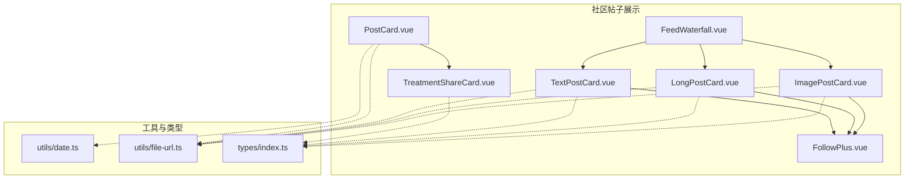
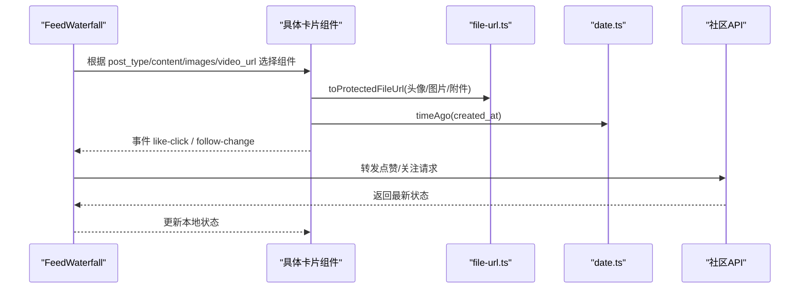
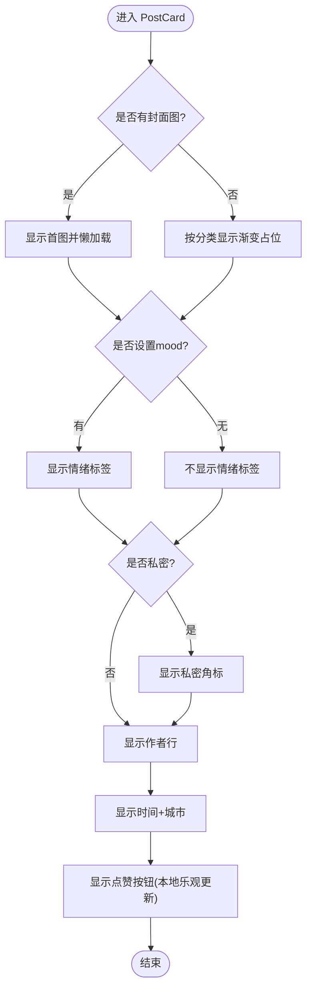
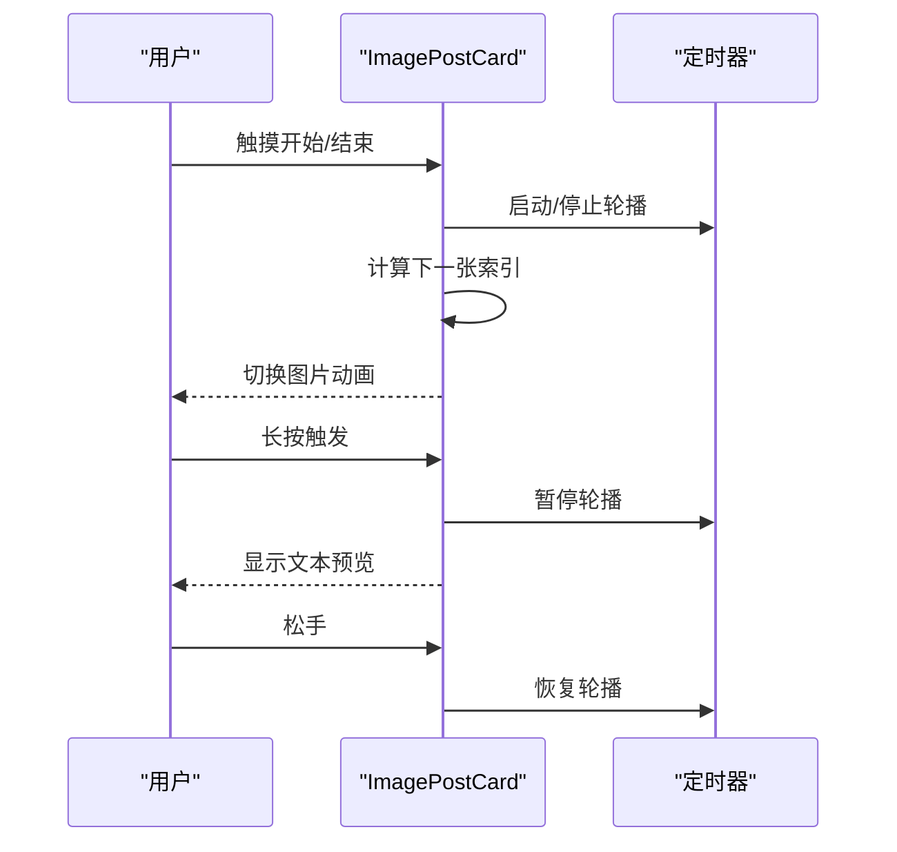
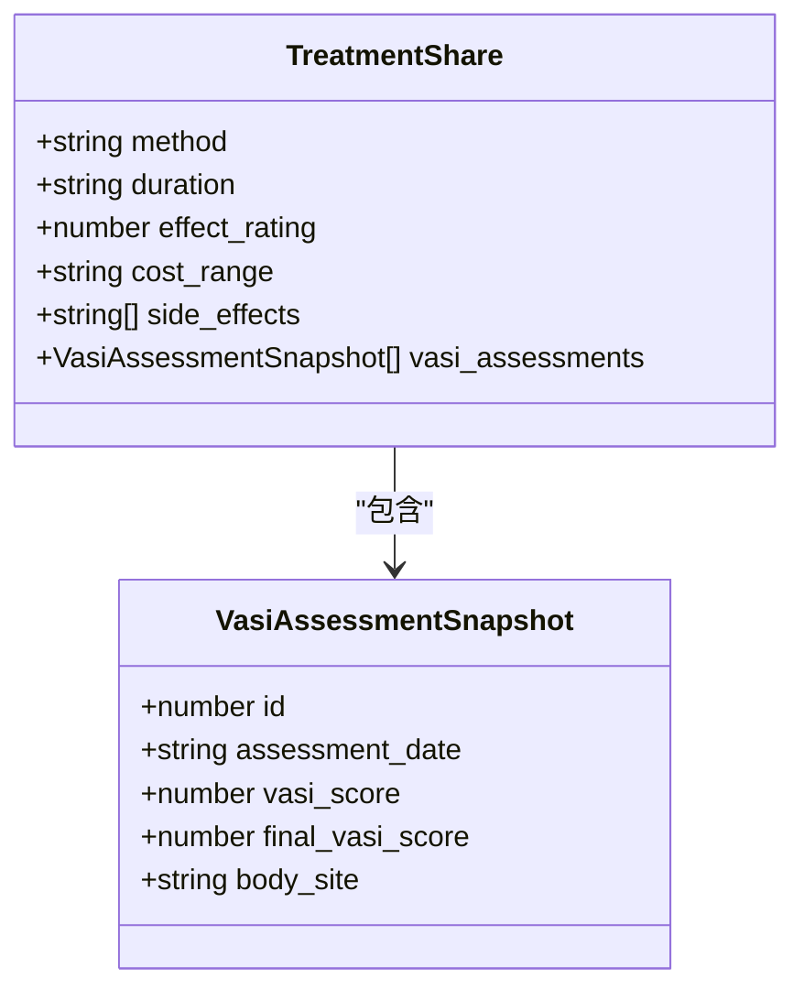
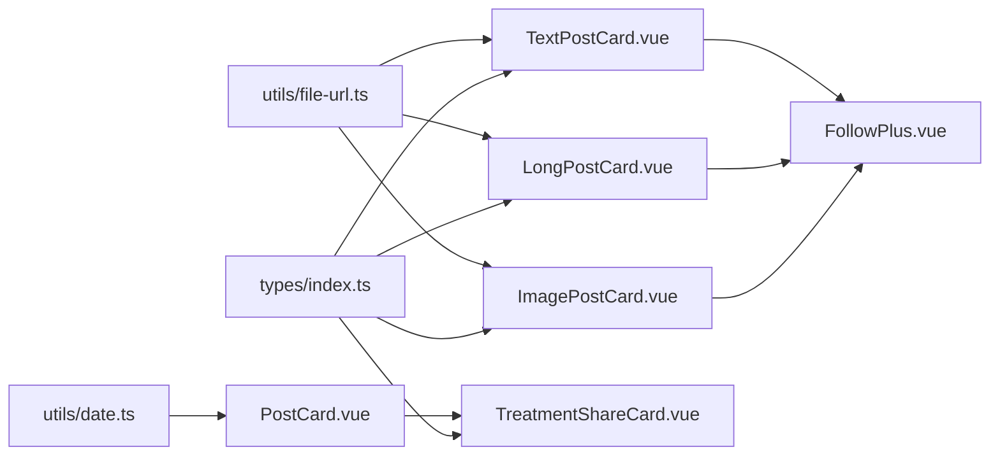

# 帖子展示

<cite>
**本文引用的文件**
- [PostCard.vue](file://web/app/src/components/community/PostCard.vue)
- [FeedWaterfall.vue](file://web/app/src/components/community/FeedWaterfall.vue)
- [ImagePostCard.vue](file://web/app/src/components/community/PostCard/ImagePostCard.vue)
- [LongPostCard.vue](file://web/app/src/components/community/PostCard/LongPostCard.vue)
- [TextPostCard.vue](file://web/app/src/components/community/PostCard/TextPostCard.vue)
- [TreatmentShareCard.vue](file://web/app/src/components/community/TreatmentShareCard.vue)
- [FollowPlus.vue](file://web/app/src/components/community/FollowPlus.vue)
- [date.ts](file://web/app/src/utils/date.ts)
- [file-url.ts](file://web/app/src/utils/file-url.ts)
- [index.ts](file://web/app/src/types/index.ts)
</cite>

## 目录
1. [简介](#简介)
2. [项目结构](#项目结构)
3. [核心组件](#核心组件)
4. [架构总览](#架构总览)
5. [详细组件分析](#详细组件分析)
6. [依赖关系分析](#依赖关系分析)
7. [性能与优化](#性能与优化)
8. [故障排查指南](#故障排查指南)
9. [结论](#结论)

## 简介
本文件面向“帖子展示系统”的前端实现，聚焦以下目标：
- PostCard 组件族的设计模式与渲染策略（图片、长文、纯文本）
- 封面图处理、情绪标签、作者信息、隐私标识的展示逻辑
- FeedWaterfall 瀑布流布局与无限滚动加载的实现思路与性能优化
- TreatmentShareCard 结构化数据展示、点赞互动、时间地点格式化
- 图片懒加载、错误处理与用户体验优化的最佳实践

## 项目结构
社区帖子展示相关代码集中在 web/app/src/components/community 目录下，配合类型定义与工具函数完成渲染与交互。

图表来源
- [FeedWaterfall.vue:1-42](file://web/app/src/components/community/FeedWaterfall.vue#L1-L42)
- [PostCard.vue:1-184](file://web/app/src/components/community/PostCard.vue#L1-L184)
- [ImagePostCard.vue:1-261](file://web/app/src/components/community/PostCard/ImagePostCard.vue#L1-L261)
- [LongPostCard.vue:1-91](file://web/app/src/components/community/PostCard/LongPostCard.vue#L1-L91)
- [TextPostCard.vue:1-65](file://web/app/src/components/community/PostCard/TextPostCard.vue#L1-L65)
- [TreatmentShareCard.vue:1-124](file://web/app/src/components/community/TreatmentShareCard.vue#L1-L124)
- [FollowPlus.vue:1-61](file://web/app/src/components/community/FollowPlus.vue#L1-L61)
- [date.ts:1-66](file://web/app/src/utils/date.ts#L1-L66)
- [file-url.ts:1-155](file://web/app/src/utils/file-url.ts#L1-L155)
- [index.ts:107-199](file://web/app/src/types/index.ts#L107-L199)

章节来源
- [FeedWaterfall.vue:1-42](file://web/app/src/components/community/FeedWaterfall.vue#L1-L42)
- [PostCard.vue:1-184](file://web/app/src/components/community/PostCard.vue#L1-L184)
- [ImagePostCard.vue:1-261](file://web/app/src/components/community/PostCard/ImagePostCard.vue#L1-L261)
- [LongPostCard.vue:1-91](file://web/app/src/components/community/PostCard/LongPostCard.vue#L1-L91)
- [TextPostCard.vue:1-65](file://web/app/src/components/community/PostCard/TextPostCard.vue#L1-L65)
- [TreatmentShareCard.vue:1-124](file://web/app/src/components/community/TreatmentShareCard.vue#L1-L124)
- [FollowPlus.vue:1-61](file://web/app/src/components/community/FollowPlus.vue#L1-L61)
- [date.ts:1-66](file://web/app/src/utils/date.ts#L1-L66)
- [file-url.ts:1-155](file://web/app/src/utils/file-url.ts#L1-L155)
- [index.ts:107-199](file://web/app/src/types/index.ts#L107-L199)

## 核心组件
- PostCard：通用卡片容器，负责封面图、情绪标签、私密标识、作者行、时间与地点、点赞等；当存在治疗分享时内嵌 TreatmentShareCard。
- ImagePostCard：图片/视频卡片，支持多图轮播、长按预览内容、触摸滑动切换、视频播放指示器。
- LongPostCard：长文卡片，显示标题、摘要、阅读时长、作者与关注按钮、点赞。
- TextPostCard：短文本卡片，显示文本摘要、作者与关注按钮、点赞。
- TreatmentShareCard：结构化治疗分享卡片，支持紧凑模式与完整模式，展示方案、周期、费用、效果评分、副作用、VASI评估对比。
- FollowPlus：关注/取消关注按钮，处理登录态校验与状态同步。
- 工具：date.ts 提供相对时间计算；file-url.ts 提供受保护文件 URL 转换与 XSS 防护。

章节来源
- [PostCard.vue:1-184](file://web/app/src/components/community/PostCard.vue#L1-L184)
- [ImagePostCard.vue:1-261](file://web/app/src/components/community/PostCard/ImagePostCard.vue#L1-L261)
- [LongPostCard.vue:1-91](file://web/app/src/components/community/PostCard/LongPostCard.vue#L1-L91)
- [TextPostCard.vue:1-65](file://web/app/src/components/community/PostCard/TextPostCard.vue#L1-L65)
- [TreatmentShareCard.vue:1-124](file://web/app/src/components/community/TreatmentShareCard.vue#L1-L124)
- [FollowPlus.vue:1-61](file://web/app/src/components/community/FollowPlus.vue#L1-L61)
- [date.ts:1-66](file://web/app/src/utils/date.ts#L1-L66)
- [file-url.ts:1-155](file://web/app/src/utils/file-url.ts#L1-L155)

## 架构总览
帖子列表由 FeedWaterfall 统一分发到不同卡片组件；各卡片通过统一的 Post 类型进行渲染，使用 file-url 工具生成安全的资源链接，使用 date 工具格式化时间。

图表来源
- [FeedWaterfall.vue:16-41](file://web/app/src/components/community/FeedWaterfall.vue#L16-L41)
- [ImagePostCard.vue:1-261](file://web/app/src/components/community/PostCard/ImagePostCard.vue#L1-L261)
- [LongPostCard.vue:1-91](file://web/app/src/components/community/PostCard/LongPostCard.vue#L1-L91)
- [TextPostCard.vue:1-65](file://web/app/src/components/community/PostCard/TextPostCard.vue#L1-L65)
- [PostCard.vue:19-76](file://web/app/src/components/community/PostCard.vue#L19-L76)
- [date.ts:51-65](file://web/app/src/utils/date.ts#L51-L65)
- [file-url.ts:85-101](file://web/app/src/utils/file-url.ts#L85-L101)

## 详细组件分析

### PostCard 通用卡片
- 封面图：优先取 images[0]，否则按分类显示渐变占位背景。
- 情绪标签：优先使用 mood 字段映射为图标+文案+颜色；若无则回退到日记或分类名称。
- 隐私标识：is_private 为真时显示“私密”角标。
- 作者信息：头像、用户名、医生认证、实名认证标识。
- 时间地点：timeAgo + city 组合显示。
- 点赞：本地乐观更新，未登录时弹出登录弹窗。
- 治疗分享：若存在 treatment_share，内嵌 TreatmentShareCard 紧凑模式。

图表来源
- [PostCard.vue:29-76](file://web/app/src/components/community/PostCard.vue#L29-L76)
- [PostCard.vue:84-173](file://web/app/src/components/community/PostCard.vue#L84-L173)

章节来源
- [PostCard.vue:1-184](file://web/app/src/components/community/PostCard.vue#L1-L184)

### ImagePostCard 图片/视频卡片
- 多图轮播：自动轮播，首图停留更久；支持触摸滑动切换；长按可暂停轮播并预览文本。
- 视频识别：post_type 或 video_url 存在时显示播放指示器。
- 作者行：头像、用户名、关注按钮、点赞计数。
- 图片懒加载：img 使用 loading="lazy"。
- 错误处理：头像加载失败时隐藏并回退到首字母占位。

图表来源
- [ImagePostCard.vue:19-123](file://web/app/src/components/community/PostCard/ImagePostCard.vue#L19-L123)
- [ImagePostCard.vue:143-207](file://web/app/src/components/community/PostCard/ImagePostCard.vue#L143-L207)

章节来源
- [ImagePostCard.vue:1-261](file://web/app/src/components/community/PostCard/ImagePostCard.vue#L1-L261)

### LongPostCard 长文卡片
- 标题与摘要：限制行数，避免溢出。
- 阅读时长估算：基于文本长度计算分钟数。
- 作者与关注：头像、用户名、关注按钮。
- 点赞：计数格式化（k/万）。

章节来源
- [LongPostCard.vue:1-91](file://web/app/src/components/community/PostCard/LongPostCard.vue#L1-L91)

### TextPostCard 短文本卡片
- 文本摘要：限制行数，保持简洁。
- 作者与关注：头像、用户名、关注按钮。
- 点赞：计数格式化。

章节来源
- [TextPostCard.vue:1-65](file://web/app/src/components/community/PostCard/TextPostCard.vue#L1-L65)

### TreatmentShareCard 治疗分享卡片
- 紧凑模式：一行展示“治疗经验”、持续周期、效果评分、费用区间。
- 完整模式：结构化区块展示治疗方案、周期、费用、效果评分、副作用、VASI评估对比（含前后分数差值提示）。
- VASI 分数格式化：优先使用 final_vasi_score，否则回退 vasi_score。

图表来源
- [TreatmentShareCard.vue:9-12](file://web/app/src/components/community/TreatmentShareCard.vue#L9-L12)
- [index.ts:147-164](file://web/app/src/types/index.ts#L147-L164)

章节来源
- [TreatmentShareCard.vue:1-124](file://web/app/src/components/community/TreatmentShareCard.vue#L1-L124)
- [index.ts:147-164](file://web/app/src/types/index.ts#L147-L164)

### FollowPlus 关注组件
- 登录态检查：未登录时弹出登录弹窗。
- 关注/取消关注：调用社区 API，成功后更新本地状态并向上抛出事件。
- 自身帖子场景：隐藏关注按钮。

章节来源
- [FollowPlus.vue:1-61](file://web/app/src/components/community/FollowPlus.vue#L1-L61)

### FeedWaterfall 瀑布流布局
- 响应式网格：移动端两列，桌面端三列。
- 卡片分发：根据 post_type、video_url、images、文本长度判断使用 ImagePostCard、TextPostCard 或 LongPostCard。
- 事件透传：将 like-click、follow-change 事件向上传递，供父级管理状态。

章节来源
- [FeedWaterfall.vue:1-42](file://web/app/src/components/community/FeedWaterfall.vue#L1-L42)

## 依赖关系分析
- 类型依赖：所有卡片均依赖 types/index.ts 中的 Post、PostAuthor、Category、TreatmentShare 等接口，保证数据结构一致。
- 工具依赖：
  - file-url.ts：统一受保护文件 URL 生成，注入短期访问令牌，避免泄露长期 token；同时提供 HTML 重写以修复富文本中的资源链接。
  - date.ts：安全解析日期字符串并输出相对时间文案，避免时区偏移问题。
- 组件耦合：
  - FeedWaterfall 仅负责路由到具体卡片，低耦合高内聚。
  - 各卡片独立处理 UI 细节，通过事件冒泡与父级交互。
  - PostCard 作为通用容器，复用 TreatmentShareCard、FollowPlus 等子组件。

图表来源
- [index.ts:107-199](file://web/app/src/types/index.ts#L107-L199)
- [file-url.ts:85-101](file://web/app/src/utils/file-url.ts#L85-L101)
- [date.ts:51-65](file://web/app/src/utils/date.ts#L51-L65)
- [PostCard.vue:1-184](file://web/app/src/components/community/PostCard.vue#L1-L184)
- [ImagePostCard.vue:1-261](file://web/app/src/components/community/PostCard/ImagePostCard.vue#L1-L261)
- [LongPostCard.vue:1-91](file://web/app/src/components/community/PostCard/LongPostCard.vue#L1-L91)
- [TextPostCard.vue:1-65](file://web/app/src/components/community/PostCard/TextPostCard.vue#L1-L65)
- [TreatmentShareCard.vue:1-124](file://web/app/src/components/community/TreatmentShareCard.vue#L1-L124)
- [FollowPlus.vue:1-61](file://web/app/src/components/community/FollowPlus.vue#L1-L61)

章节来源
- [index.ts:107-199](file://web/app/src/types/index.ts#L107-L199)
- [file-url.ts:1-155](file://web/app/src/utils/file-url.ts#L1-L155)
- [date.ts:1-66](file://web/app/src/utils/date.ts#L1-L66)

## 性能与优化
- 图片懒加载：所有 img 使用 loading="lazy"，减少首屏带宽占用。
- 轮播性能：多图轮播使用定时器与 CSS transform 切换，避免重排；触摸事件及时暂停/恢复轮播，降低无效计算。
- 文本预览：长按预览限制最大字符数，避免大 DOM 渲染。
- 头像错误降级：onerror 隐藏失败头像并显示首字母占位，提升视觉一致性。
- 时间解析优化：统一使用 parseDate/timeAgo，避免时区导致的显示偏差。
- 资源安全与缓存：toProtectedFileUrl 注入短期文件访问令牌，降低泄露风险；HTML 重写确保富文本资源链接安全。
- 响应式布局：Grid 自适应列数，适配多端设备。

[本节为通用指导，无需特定文件引用]

## 故障排查指南
- 图片不显示：
  - 检查图片 URL 是否为受保护路径，确认已通过 toProtectedFileUrl 转换并附带 access_token。
  - 检查网络请求是否被拦截或跨域配置是否正确。
- 头像加载失败：
  - 查看 onerror 逻辑是否生效，确认回退占位是否正常显示。
- 时间显示异常：
  - 确认传入时间格式是否符合 parseDate 预期（日期字符串、带时区时间戳、本地 datetime）。
- 点赞/关注无响应：
  - 检查登录态，未登录会弹出登录弹窗；已登录则检查 API 调用与错误捕获。
- 富文本资源失效：
  - 使用 rewriteProtectedHtml 对内容进行清洗与链接重写，确保 src/href 指向受保护地址。

章节来源
- [file-url.ts:103-155](file://web/app/src/utils/file-url.ts#L103-L155)
- [date.ts:24-65](file://web/app/src/utils/date.ts#L24-L65)
- [PostCard.vue:62-76](file://web/app/src/components/community/PostCard.vue#L62-L76)
- [FollowPlus.vue:25-46](file://web/app/src/components/community/FollowPlus.vue#L25-L46)

## 结论
该帖子展示系统通过清晰的组件分层与工具抽象，实现了多类型帖子的统一渲染与良好的用户体验。PostCard 族组件在封面图、情绪标签、作者信息、隐私标识等方面提供了丰富的展示能力；TreatmentShareCard 将结构化数据以直观方式呈现；FeedWaterfall 提供响应式瀑布流布局。结合图片懒加载、错误降级、时间解析与安全资源访问等优化手段，整体具备良好的性能与可维护性。后续可在无限滚动加载、虚拟列表、预加载策略等方面进一步增强大规模数据下的表现。