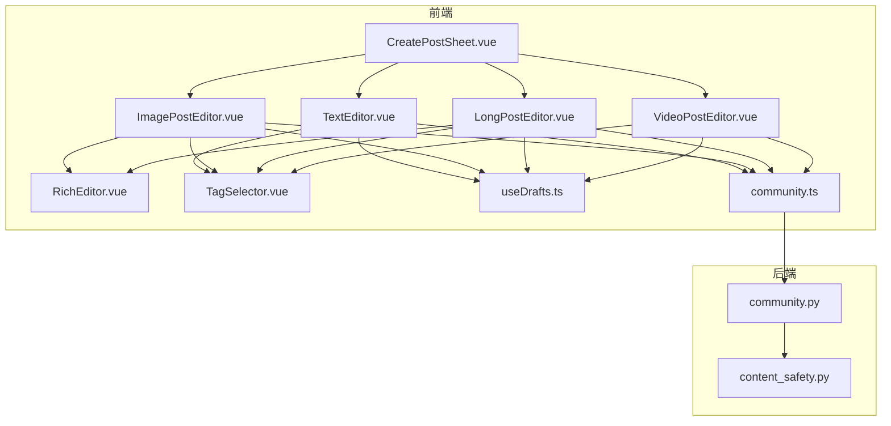
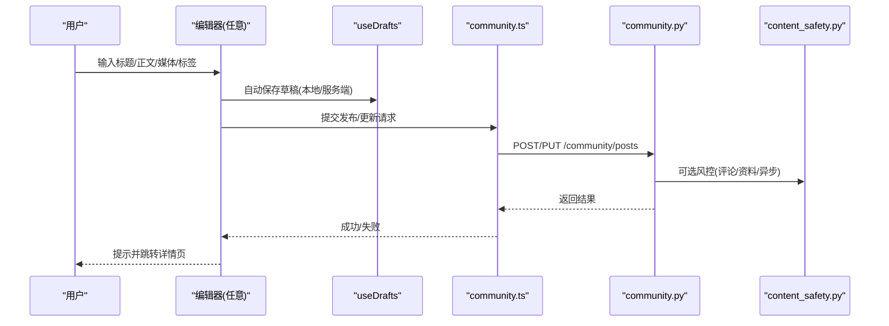
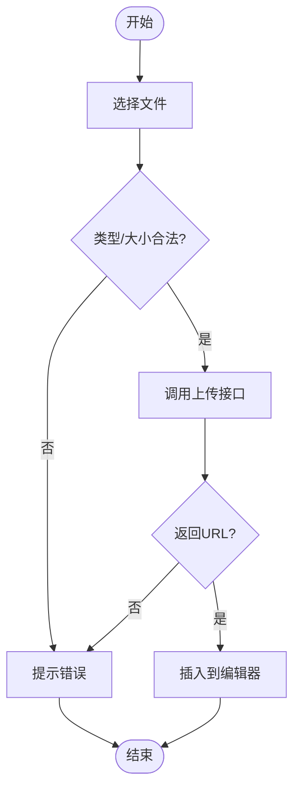
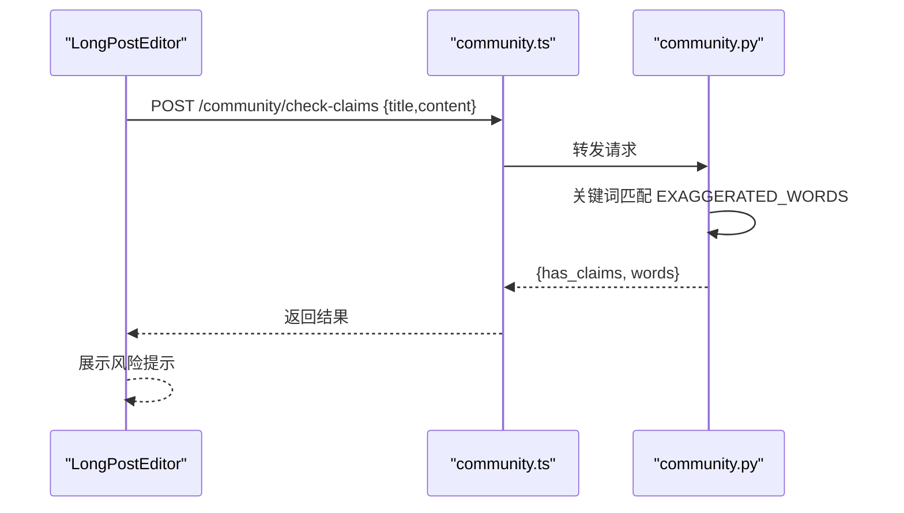
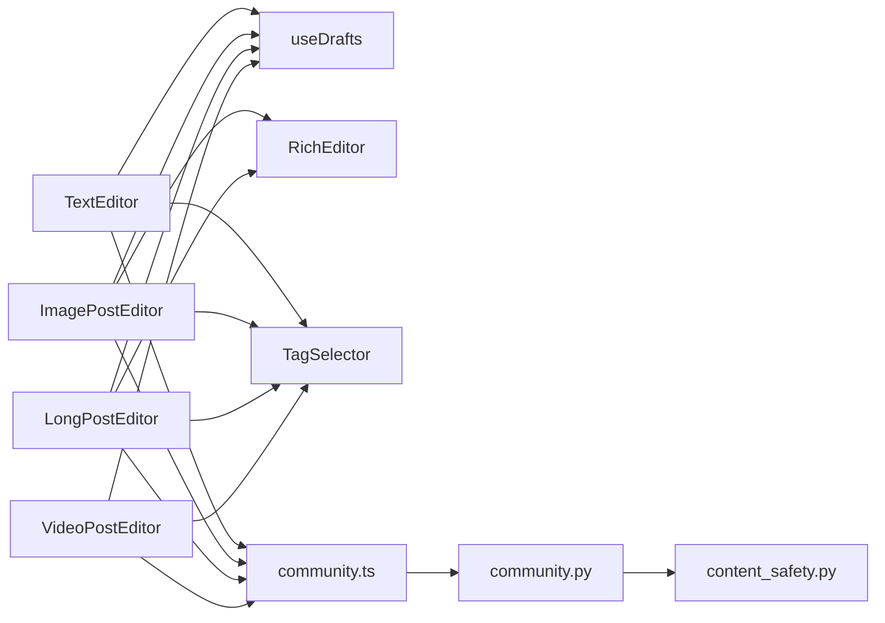

# 帖子编辑器

<cite>
**本文引用的文件**
- [RichEditor.vue](file://web/app/src/components/community/RichEditor.vue)
- [CreatePostSheet.vue](file://web/app/src/components/community/CreatePostSheet.vue)
- [TextEditor.vue](file://web/app/src/components/community/Editor/TextEditor.vue)
- [ImagePostEditor.vue](file://web/app/src/components/community/Editor/ImagePostEditor.vue)
- [LongPostEditor.vue](file://web/app/src/components/community/Editor/LongPostEditor.vue)
- [VideoPostEditor.vue](file://web/app/src/components/community/Editor/VideoPostEditor.vue)
- [TagSelector.vue](file://web/app/src/components/community/TagSelector.vue)
- [community.ts](file://web/app/src/api/community.ts)
- [useDrafts.ts](file://web/app/src/composables/useDrafts.ts)
- [content_safety.py](file://web/backend/services/content_safety.py)
- [community.py](file://web/backend/api/community.py)
</cite>

## 目录
1. [简介](#简介)
2. [项目结构](#项目结构)
3. [核心组件](#核心组件)
4. [架构总览](#架构总览)
5. [详细组件分析](#详细组件分析)
6. [依赖关系分析](#依赖关系分析)
7. [性能与体验优化](#性能与体验优化)
8. [故障排查指南](#故障排查指南)
9. [结论](#结论)

## 简介
本文件面向社区“帖子编辑器”的前后端实现，覆盖富文本编辑、图片上传处理、音视频支持、标签系统、内容格式化、发布面板交互、表单校验、草稿保存机制，以及内容安全检查和敏感词过滤。目标是帮助开发者快速理解并扩展编辑器能力，同时确保内容质量与安全。

## 项目结构
编辑器由多个前端组件构成：
- RichEditor：基于 Tiptap 的富文本编辑器，提供加粗、斜体、标题、列表、引用、分割线、链接、图片、音频、视频等能力。
- CreatePostSheet：底部弹出式发布入口，选择“图文/视频/文字/长文”四种类型，进入对应编辑器页面。
- TextEditor / ImagePostEditor / LongPostEditor / VideoPostEditor：不同帖子类型的编辑页，统一包含标题、正文、分类、标签、心情、城市定位、隐私开关、发布/更新逻辑。
- TagSelector：标签输入与推荐组件，支持最大数量限制、去重、搜索建议。
- useDrafts：本地与服务器端草稿同步、合并、过期清理、自动保存。
- community API：封装所有社区相关接口（发帖、更新、上传、标签、检查夸大表述等）。
- 后端 content_safety：基于 LLM 的内容风控，对帖子、评论、个人资料进行风险判定与自动处置。
- 后端 community API：提供“检查夸大表述”、“标签管理”、“IP 定位”等接口。

图表来源
- [CreatePostSheet.vue:1-231](file://web/app/src/components/community/CreatePostSheet.vue#L1-L231)
- [TextEditor.vue:1-248](file://web/app/src/components/community/Editor/TextEditor.vue#L1-L248)
- [ImagePostEditor.vue:1-359](file://web/app/src/components/community/Editor/ImagePostEditor.vue#L1-L359)
- [LongPostEditor.vue:1-462](file://web/app/src/components/community/Editor/LongPostEditor.vue#L1-L462)
- [VideoPostEditor.vue:1-282](file://web/app/src/components/community/Editor/VideoPostEditor.vue#L1-L282)
- [RichEditor.vue:1-703](file://web/app/src/components/community/RichEditor.vue#L1-L703)
- [TagSelector.vue:1-171](file://web/app/src/components/community/TagSelector.vue#L1-L171)
- [useDrafts.ts:1-326](file://web/app/src/composables/useDrafts.ts#L1-L326)
- [community.ts:1-284](file://web/app/src/api/community.ts#L1-L284)
- [community.py:148-169](file://web/backend/api/community.py#L148-L169)
- [content_safety.py:28-86](file://web/backend/services/content_safety.py#L28-L86)

章节来源
- [CreatePostSheet.vue:1-231](file://web/app/src/components/community/CreatePostSheet.vue#L1-L231)
- [community.ts:1-284](file://web/app/src/api/community.ts#L1-L284)
- [useDrafts.ts:1-326](file://web/app/src/composables/useDrafts.ts#L1-L326)
- [community.py:148-169](file://web/backend/api/community.py#L148-L169)
- [content_safety.py:28-86](file://web/backend/services/content_safety.py#L28-L86)

## 核心组件
- RichEditor：封装 Tiptap StarterKit、Underline、Image、Link、Placeholder，自定义 Audio/Video 节点；提供工具栏按钮与媒体上传；通过事件双向绑定 HTML/JSON 内容。
- CreatePostSheet：底部弹窗，展示四种发布类型与“我的草稿”，点击跳转路由；支持键盘 ESC 关闭与遮罩点击关闭。
- TextEditor：纯文本短帖，含字数统计、心情、分类、标签、城市显示开关；自动草稿保存（本地+可选服务端）；发布时携带地理信息。
- ImagePostEditor：多图上传预览与删除，第一张为封面；标题+富文本描述；支持仅自己可见；发布或更新；草稿恢复与自动保存。
- LongPostEditor：长文/治疗经验分享；结构化治疗模板（方法、周期、效果评分、费用区间、副作用、VASI 评估关联）；夸大表述检测提示；阅读时长估算。
- VideoPostEditor：视频上传与预览；标题+描述；分类、标签、心情、城市；发布/更新。
- TagSelector：输入回车/逗号添加标签，最多 N 个；防重复；搜索建议；已选标签可移除。
- useDrafts：本地 localStorage + 服务端私有帖草稿合并；过期清理；自动保存；删除时同步清理服务端。
- community API：封装发帖、更新、上传、标签、收藏、版本、检查夸大表述等接口。

章节来源
- [RichEditor.vue:231-498](file://web/app/src/components/community/RichEditor.vue#L231-L498)
- [CreatePostSheet.vue:1-231](file://web/app/src/components/community/CreatePostSheet.vue#L1-L231)
- [TextEditor.vue:1-248](file://web/app/src/components/community/Editor/TextEditor.vue#L1-L248)
- [ImagePostEditor.vue:1-359](file://web/app/src/components/community/Editor/ImagePostEditor.vue#L1-L359)
- [LongPostEditor.vue:1-462](file://web/app/src/components/community/Editor/LongPostEditor.vue#L1-L462)
- [VideoPostEditor.vue:1-282](file://web/app/src/components/community/Editor/VideoPostEditor.vue#L1-L282)
- [TagSelector.vue:1-171](file://web/app/src/components/community/TagSelector.vue#L1-L171)
- [useDrafts.ts:1-326](file://web/app/src/composables/useDrafts.ts#L1-L326)
- [community.ts:1-284](file://web/app/src/api/community.ts#L1-L284)

## 架构总览
编辑器采用“多形态编辑器 + 统一草稿 + 统一 API”的架构：
- 前端：各编辑器负责各自的数据收集与校验，调用 useDrafts 进行草稿保存，调用 community API 完成发布/更新/上传。
- 后端：community API 提供发帖、更新、上传、标签、检查夸大表述等；content_safety 提供 LLM 驱动的风控判定与自动处置。

图表来源
- [useDrafts.ts:172-290](file://web/app/src/composables/useDrafts.ts#L172-L290)
- [community.ts:83-157](file://web/app/src/api/community.ts#L83-L157)
- [community.py:148-169](file://web/backend/api/community.py#L148-L169)
- [content_safety.py:54-86](file://web/backend/services/content_safety.py#L54-L86)

## 详细组件分析

### RichEditor 富文本编辑器
- 功能要点
  - 文本格式：加粗、斜体、下划线、删除线、H1/H2/H3、有序/无序列表、引用、分割线。
  - 链接：插入/取消链接，点击不自动打开。
  - 媒体：图片、音频、视频上传；自定义节点渲染；大小限制与错误提示。
  - 内容输出：onUpdate 同时发出 HTML 与 JSON，便于存储与渲染。
- 数据流
  - 上传流程：选择文件 → 类型/大小校验 → 调用 communityApi.upload* → 成功后插入到编辑器。
  - 双向绑定：父组件 v-model 绑定 HTML，v-model:content-json 绑定 JSON。
- 复杂度与性能
  - 使用 Tiptap 原子节点（Audio/Video），避免复杂 DOM 操作。
  - 上传禁用状态防止重复提交。
  - 样式隔离，避免影响全局。

图表来源
- [RichEditor.vue:395-498](file://web/app/src/components/community/RichEditor.vue#L395-L498)
- [community.ts:132-157](file://web/app/src/api/community.ts#L132-L157)

章节来源
- [RichEditor.vue:1-703](file://web/app/src/components/community/RichEditor.vue#L1-L703)
- [community.ts:132-157](file://web/app/src/api/community.ts#L132-L157)

### CreatePostSheet 发布面板
- 交互逻辑
  - 底部弹窗，带遮罩与过渡动画；ESC 键关闭；点击遮罩关闭。
  - 四个选项：图文、视频、文字、长文；点击后关闭并路由跳转。
  - “我的草稿”入口，跳转到草稿列表；加载草稿计数与即将过期提示。
- 状态管理
  - 使用 Teleport 挂载至 body；控制 isVisible 与 isAnimating。
  - 打开时禁止滚动，关闭时恢复。

章节来源
- [CreatePostSheet.vue:1-231](file://web/app/src/components/community/CreatePostSheet.vue#L1-L231)

### TextEditor 文字编辑器
- 场景与配置
  - 适合简短分享、问答、吐槽；最大字符数限制与实时计数。
  - 必填：内容非空、分类已选。
  - 可选：心情、标签、显示城市及坐标。
- 草稿机制
  - 未编辑模式下，内容变化触发节流自动保存；支持从 draftKey 恢复。
  - 发布成功后清理本地与服务端草稿。
- 发布流程
  - 构造 payload（标题截取、post_type=text、tag_names、is_anonymous=false、mood、city/lat/lng）。
  - 新建或更新，成功后跳转详情页。

章节来源
- [TextEditor.vue:1-248](file://web/app/src/components/community/Editor/TextEditor.vue#L1-L248)
- [useDrafts.ts:172-290](file://web/app/src/composables/useDrafts.ts#L172-L290)
- [community.ts:83-157](file://web/app/src/api/community.ts#L83-L157)

### ImagePostEditor 图文编辑器
- 场景与配置
  - 多图上传（最多9张），首张作为封面；支持删除；图片 URL 通过受保护地址访问。
  - 标题可为空但需有图片或正文；支持仅自己可见。
- 草稿机制
  - 自动保存（本地+可选服务端）；支持从 draftKey 恢复；发布时若存在服务端草稿则更新而非重复创建。
- 发布流程
  - 构造 payload（title、content、content_json、images、tag_names、is_private、mood、city/lat/lng）。
  - 新建/更新，成功后清理草稿并跳转。

章节来源
- [ImagePostEditor.vue:1-359](file://web/app/src/components/community/Editor/ImagePostEditor.vue#L1-L359)
- [useDrafts.ts:172-290](file://web/app/src/composables/useDrafts.ts#L172-L290)
- [community.ts:83-157](file://web/app/src/api/community.ts#L83-L157)

### LongPostEditor 长文编辑器
- 场景与配置
  - 普通分享或“治疗经验”结构化模板；模板字段包括方法、周期、效果评分、费用区间、副作用、VASI 评估关联（最多2条）。
  - 预估阅读时间计算；夸大表述检测提示。
- 草稿机制
  - 自动保存（本地+可选服务端）；支持从 draftKey 恢复；发布成功后清理草稿。
- 发布流程
  - 根据 postKind 决定 post_type（long/treatment），并在 treatment 时附加 treatment_share 对象。
  - 新建/更新，成功后跳转。

章节来源
- [LongPostEditor.vue:1-462](file://web/app/src/components/community/Editor/LongPostEditor.vue#L1-L462)
- [community.ts:230-233](file://web/app/src/api/community.ts#L230-L233)
- [community.py:148-169](file://web/backend/api/community.py#L148-L169)

### VideoPostEditor 视频编辑器
- 场景与配置
  - 单视频上传与预览；标题+描述；必填：标题、正文、分类、视频。
  - 支持心情、标签、城市显示。
- 草稿机制
  - 自动保存（本地+可选服务端）；支持从 draftKey 恢复；发布成功后清理草稿。
- 发布流程
  - 构造 payload（video_url、post_type=video、tag_names、mood、city/lat/lng）。
  - 新建/更新，成功后跳转。

章节来源
- [VideoPostEditor.vue:1-282](file://web/app/src/components/community/Editor/VideoPostEditor.vue#L1-L282)
- [useDrafts.ts:172-290](file://web/app/src/composables/useDrafts.ts#L172-L290)
- [community.ts:83-157](file://web/app/src/api/community.ts#L83-L157)

### TagSelector 标签系统
- 功能要点
  - 输入回车/逗号添加标签；最大数量限制；去重；已选标签可移除。
  - 搜索建议：输入时延迟请求后端标签接口，过滤已选标签。
- 使用场景
  - 所有编辑器均复用该组件，统一标签体验。

章节来源
- [TagSelector.vue:1-171](file://web/app/src/components/community/TagSelector.vue#L1-L171)
- [community.ts:159-171](file://web/app/src/api/community.ts#L159-L171)

### 草稿保存机制（useDrafts）
- 本地草稿
  - key 前缀固定，存储 JSON；过期清理（默认30天）；按时间排序。
- 服务端草稿
  - 登录状态下，自动将草稿以“私有帖”形式保存到服务端；合并本地与服务器草稿，去重策略基于标题与时间戳。
- 生命周期
  - 自动保存：编辑器变更触发节流保存；发布成功后清理本地与服务端草稿；删除草稿时同步删除服务端记录。

章节来源
- [useDrafts.ts:1-326](file://web/app/src/composables/useDrafts.ts#L1-L326)

### 内容安全检查与敏感词过滤
- 前端
  - LongPostEditor 在标题/正文变化时调用 checkClaims 接口，检测夸大/不当表述并提示。
- 后端
  - check-claims：基于关键词匹配（如“根治”“包治”等），返回命中词列表。
  - content_safety：基于 LLM 的风控判定，返回风险等级、类别、置信度；对高/严重风险执行自动封禁/禁言/警告，并记录审计日志与通知。

图表来源
- [LongPostEditor.vue:108-118](file://web/app/src/components/community/Editor/LongPostEditor.vue#L108-L118)
- [community.ts:230-233](file://web/app/src/api/community.ts#L230-L233)
- [community.py:148-169](file://web/backend/api/community.py#L148-L169)

章节来源
- [LongPostEditor.vue:108-118](file://web/app/src/components/community/Editor/LongPostEditor.vue#L108-L118)
- [community.ts:230-233](file://web/app/src/api/community.ts#L230-L233)
- [community.py:148-169](file://web/backend/api/community.py#L148-L169)
- [content_safety.py:28-86](file://web/backend/services/content_safety.py#L28-L86)

## 依赖关系分析
- 组件耦合
  - 各编辑器强依赖 useDrafts 与 community API；RichEditor 被图文/长文编辑器复用。
  - TagSelector 被所有编辑器复用，解耦标签逻辑。
- 外部依赖
  - Tiptap 扩展（StarterKit、Image、Link、Placeholder、Underline）。
  - 后端 LLM 服务（用于内容风控）。
- 潜在循环依赖
  - 无直接循环；编辑器→API→后端，单向依赖清晰。

图表来源
- [TextEditor.vue:1-248](file://web/app/src/components/community/Editor/TextEditor.vue#L1-L248)
- [ImagePostEditor.vue:1-359](file://web/app/src/components/community/Editor/ImagePostEditor.vue#L1-L359)
- [LongPostEditor.vue:1-462](file://web/app/src/components/community/Editor/LongPostEditor.vue#L1-L462)
- [VideoPostEditor.vue:1-282](file://web/app/src/components/community/Editor/VideoPostEditor.vue#L1-L282)
- [RichEditor.vue:1-703](file://web/app/src/components/community/RichEditor.vue#L1-L703)
- [TagSelector.vue:1-171](file://web/app/src/components/community/TagSelector.vue#L1-L171)
- [useDrafts.ts:1-326](file://web/app/src/composables/useDrafts.ts#L1-L326)
- [community.ts:1-284](file://web/app/src/api/community.ts#L1-L284)
- [community.py:148-169](file://web/backend/api/community.py#L148-L169)
- [content_safety.py:28-86](file://web/backend/services/content_safety.py#L28-L86)

## 性能与体验优化
- 富文本
  - 使用原子节点（Audio/Video）减少渲染开销；上传时禁用按钮防止重复提交。
- 图片/视频
  - 前端大小限制（图片≤5MB、音频≤20MB、视频≤50MB/100MB）；上传失败友好提示。
  - 图片 URL 通过受保护地址访问，提升安全性。
- 草稿
  - 节流自动保存（1-2秒）；本地与服务端合并去重；过期清理；发布后清理冗余草稿。
- 标签
  - 输入防抖（300ms）；已选标签过滤；最大数量限制。
- 内容安全
  - 前端轻量关键词检测即时反馈；后端 LLM 风控异步处理，避免阻塞发布主流程。

[本节为通用指导，无需特定文件来源]

## 故障排查指南
- 富文本无法插入媒体
  - 检查文件类型与大小限制；确认上传接口返回 image_url/audio_url/file_url；查看控制台错误。
- 草稿未保存或未恢复
  - 检查 useDrafts 是否被调用；确认 localStorage key 是否存在；服务端草稿是否因网络失败未同步。
- 标签不生效
  - 检查 TagSelector 最大数量限制；确认 communityApi.getTags 返回；确认发布时 tag_names 已包含。
- 内容安全误判
  - 检查后端 LLM 配置；查看 content_safety 日志；必要时调整阈值或白名单。

章节来源
- [RichEditor.vue:395-498](file://web/app/src/components/community/RichEditor.vue#L395-L498)
- [useDrafts.ts:86-170](file://web/app/src/composables/useDrafts.ts#L86-L170)
- [TagSelector.vue:127-156](file://web/app/src/components/community/TagSelector.vue#L127-L156)
- [content_safety.py:54-86](file://web/backend/services/content_safety.py#L54-L86)

## 结论
该编辑器体系以 RichEditor 为核心，结合多种编辑器形态满足不同类型内容的创作需求；统一的草稿机制保障用户体验；前后端协作的内容安全检查兼顾效率与安全。建议在后续迭代中继续优化媒体压缩、预览与删除体验，完善敏感词库与风控策略，提升整体内容质量与平台合规性。