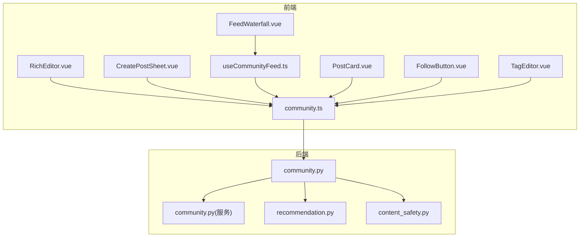
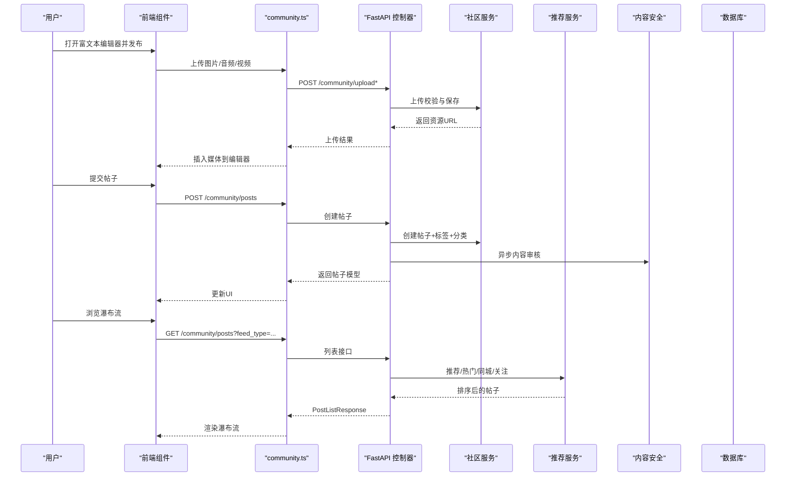
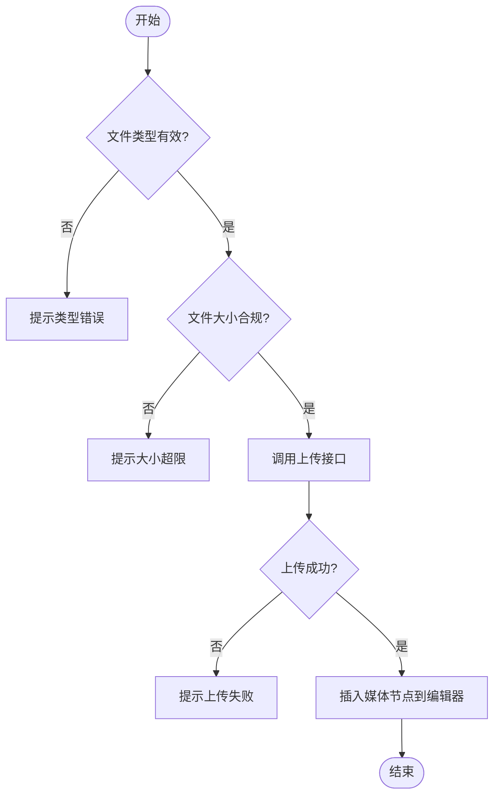
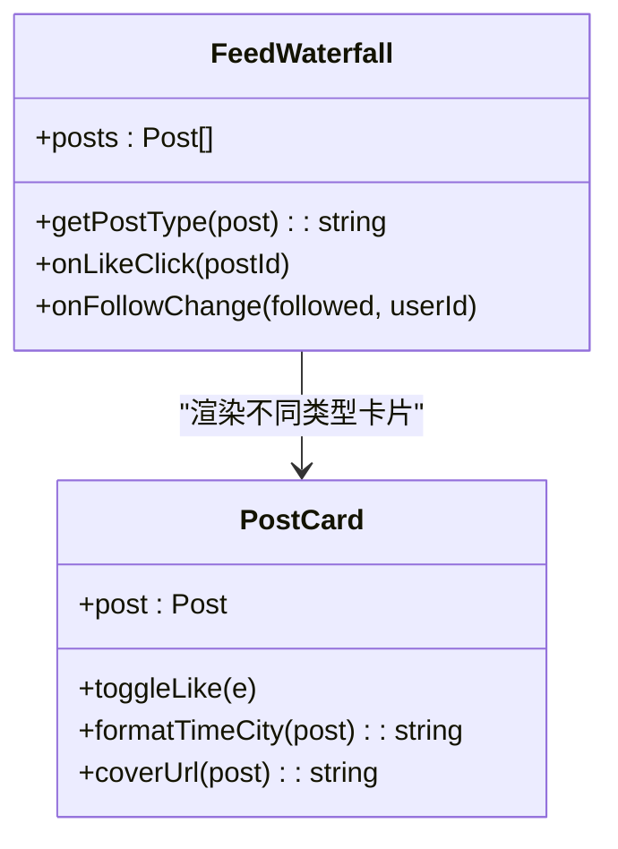
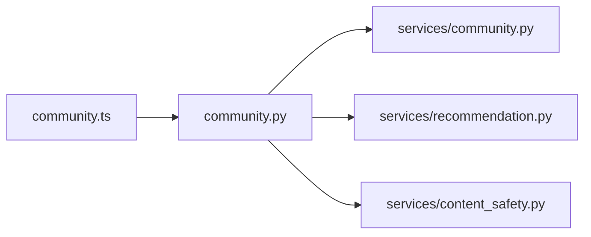

# 社区功能模块

<cite>
**本文引用的文件**
- [web/app/src/components/community/RichEditor.vue](file://web/app/src/components/community/RichEditor.vue)
- [web/app/src/components/community/FeedWaterfall.vue](file://web/app/src/components/community/FeedWaterfall.vue)
- [web/app/src/components/community/CreatePostSheet.vue](file://web/app/src/components/community/CreatePostSheet.vue)
- [web/app/src/components/community/PostCard.vue](file://web/app/src/components/community/PostCard.vue)
- [web/app/src/components/community/FollowButton.vue](file://web/app/src/components/community/FollowButton.vue)
- [web/app/src/components/community/TagEditor.vue](file://web/app/src/components/community/TagEditor.vue)
- [web/app/src/api/community.ts](file://web/app/src/api/community.ts)
- [web/app/src/composables/useCommunityFeed.ts](file://web/app/src/composables/useCommunityFeed.ts)
- [web/backend/api/community.py](file://web/backend/api/community.py)
- [web/backend/services/community.py](file://web/backend/services/community.py)
- [web/backend/services/recommendation.py](file://web/backend/services/recommendation.py)
- [web/backend/services/content_safety.py](file://web/backend/services/content_safety.py)
</cite>

## 目录
1. [简介](#简介)
2. [项目结构](#项目结构)
3. [核心组件](#核心组件)
4. [架构总览](#架构总览)
5. [详细组件分析](#详细组件分析)
6. [依赖关系分析](#依赖关系分析)
7. [性能考量](#性能考量)
8. [故障排查指南](#故障排查指南)
9. [结论](#结论)
10. [附录](#附录)

## 简介
本模块为社区社交互动系统，覆盖帖子发布与富文本编辑、评论系统、关注机制、内容瀑布流展示、标签系统、内容审核、用户关系管理、内容排序算法、无限滚动加载与实时通知等能力。前端基于 Vue 3 + Tiptap 构建富文本编辑器，后端采用 FastAPI + SQLAlchemy 提供 REST API，结合推荐服务实现个性化/热门/同城/关注流，并通过异步审核与通知机制保障内容安全与用户体验。

## 项目结构
社区功能由前后端协同组成：
- 前端页面与组件：富文本编辑器、帖子卡片、瀑布流、创建帖子弹窗、关注按钮、标签编辑器、数据获取组合式函数与 API 封装。
- 后端接口与服务：社区 CRUD、上传、标签、收藏、书签、版本历史、评论、点赞、关注/拉黑/举报、推荐与审核、通知。

图表来源
- [web/app/src/components/community/RichEditor.vue](file://web/app/src/components/community/RichEditor.vue)
- [web/app/src/components/community/FeedWaterfall.vue](file://web/app/src/components/community/FeedWaterfall.vue)
- [web/app/src/components/community/CreatePostSheet.vue](file://web/app/src/components/community/CreatePostSheet.vue)
- [web/app/src/components/community/PostCard.vue](file://web/app/src/components/community/PostCard.vue)
- [web/app/src/components/community/FollowButton.vue](file://web/app/src/components/community/FollowButton.vue)
- [web/app/src/components/community/TagEditor.vue](file://web/app/src/components/community/TagEditor.vue)
- [web/app/src/api/community.ts](file://web/app/src/api/community.ts)
- [web/app/src/composables/useCommunityFeed.ts](file://web/app/src/composables/useCommunityFeed.ts)
- [web/backend/api/community.py](file://web/backend/api/community.py)
- [web/backend/services/community.py](file://web/backend/services/community.py)
- [web/backend/services/recommendation.py](file://web/backend/services/recommendation.py)
- [web/backend/services/content_safety.py](file://web/backend/services/content_safety.py)

章节来源
- [web/app/src/components/community/RichEditor.vue](file://web/app/src/components/community/RichEditor.vue)
- [web/app/src/components/community/FeedWaterfall.vue](file://web/app/src/components/community/FeedWaterfall.vue)
- [web/app/src/components/community/CreatePostSheet.vue](file://web/app/src/components/community/CreatePostSheet.vue)
- [web/app/src/components/community/PostCard.vue](file://web/app/src/components/community/PostCard.vue)
- [web/app/src/components/community/FollowButton.vue](file://web/app/src/components/community/FollowButton.vue)
- [web/app/src/components/community/TagEditor.vue](file://web/app/src/components/community/TagEditor.vue)
- [web/app/src/api/community.ts](file://web/app/src/api/community.ts)
- [web/app/src/composables/useCommunityFeed.ts](file://web/app/src/composables/useCommunityFeed.ts)
- [web/backend/api/community.py](file://web/backend/api/community.py)
- [web/backend/services/community.py](file://web/backend/services/community.py)
- [web/backend/services/recommendation.py](file://web/backend/services/recommendation.py)
- [web/backend/services/content_safety.py](file://web/backend/services/content_safety.py)

## 核心组件
- 富文本编辑器（RichEditor）：基于 Tiptap，支持加粗、斜体、下划线、删除线、标题、列表、引用、分割线、链接、图片/音频/视频插入；自定义音视频节点；上传校验与错误提示；双向绑定 HTML/JSON。
- 瀑布流（FeedWaterfall）：根据帖子类型动态渲染图文/文字/长文卡片，统一派发点赞与关注事件。
- 创建帖子（CreatePostSheet）：底部弹窗选择发布类型（图文/视频/文字/长文），并跳转对应路由；集成草稿入口。
- 帖子卡片（PostCard）：封面图、情绪标签、私密标识、多图计数、作者信息、时间地点、点赞交互。
- 关注按钮（FollowButton）：关注/取消关注状态切换，调用关注接口并触发回调。
- 标签编辑器（TagEditor）：添加/移除标签，限制数量，加载热门标签建议。
- 数据组合（useCommunityFeed）：合并公开与私密日记，分页加载，支持关注/推荐/同城流。
- API 封装（community.ts）：统一的社区接口方法，包括帖子、评论、上传、标签、收藏、书签、关注/拉黑/举报、个人主页等。

章节来源
- [web/app/src/components/community/RichEditor.vue](file://web/app/src/components/community/RichEditor.vue)
- [web/app/src/components/community/FeedWaterfall.vue](file://web/app/src/components/community/FeedWaterfall.vue)
- [web/app/src/components/community/CreatePostSheet.vue](file://web/app/src/components/community/CreatePostSheet.vue)
- [web/app/src/components/community/PostCard.vue](file://web/app/src/components/community/PostCard.vue)
- [web/app/src/components/community/FollowButton.vue](file://web/app/src/components/community/FollowButton.vue)
- [web/app/src/components/community/TagEditor.vue](file://web/app/src/components/community/TagEditor.vue)
- [web/app/src/composables/useCommunityFeed.ts](file://web/app/src/composables/useCommunityFeed.ts)
- [web/app/src/api/community.ts](file://web/app/src/api/community.ts)

## 架构总览
社区功能的数据流与交互流程如下：

图表来源
- [web/app/src/components/community/RichEditor.vue](file://web/app/src/components/community/RichEditor.vue)
- [web/app/src/components/community/FeedWaterfall.vue](file://web/app/src/components/community/FeedWaterfall.vue)
- [web/app/src/api/community.ts](file://web/app/src/api/community.ts)
- [web/backend/api/community.py](file://web/backend/api/community.py)
- [web/backend/services/community.py](file://web/backend/services/community.py)
- [web/backend/services/recommendation.py](file://web/backend/services/recommendation.py)
- [web/backend/services/content_safety.py](file://web/backend/services/content_safety.py)

## 详细组件分析

### 富文本编辑器（RichEditor）
- 功能要点
  - 工具栏：文本样式、标题、列表、引用、分割线、链接、媒体插入。
  - 自定义节点：Audio、Video，支持解析与渲染。
  - 媒体上传：图片/音频/视频分别调用不同上传接口，包含大小与类型校验，失败时提示。
  - 数据同步：onUpdate 同时发出 HTML 与 JSON 变更，便于后端存储与渲染。
- 关键路径
  - 图片上传：handleImageUpload → communityApi.uploadImage → 成功插入图片。
  - 音频上传：handleAudioUpload → communityApi.uploadAudio → 插入音频节点。
  - 视频上传：handleVideoUpload → communityApi.uploadFile → 插入视频节点。

图表来源
- [web/app/src/components/community/RichEditor.vue](file://web/app/src/components/community/RichEditor.vue)
- [web/app/src/api/community.ts](file://web/app/src/api/community.ts)

章节来源
- [web/app/src/components/community/RichEditor.vue](file://web/app/src/components/community/RichEditor.vue)
- [web/app/src/api/community.ts](file://web/app/src/api/community.ts)

### 瀑布流与帖子卡片（FeedWaterfall + PostCard）
- FeedWaterfall：根据 post_type/video_url/images/文本长度判断卡片类型，统一派发 like-click 与 follow-change 事件。
- PostCard：封面图懒加载、情绪标签、私密标识、多图计数、作者认证标识、点赞本地态与计数更新。

图表来源
- [web/app/src/components/community/FeedWaterfall.vue](file://web/app/src/components/community/FeedWaterfall.vue)
- [web/app/src/components/community/PostCard.vue](file://web/app/src/components/community/PostCard.vue)

章节来源
- [web/app/src/components/community/FeedWaterfall.vue](file://web/app/src/components/community/FeedWaterfall.vue)
- [web/app/src/components/community/PostCard.vue](file://web/app/src/components/community/PostCard.vue)

### 创建帖子弹窗（CreatePostSheet）
- 提供四种发布类型入口，点击后关闭弹窗并路由跳转至对应编辑器页面。
- 集成“我的草稿”入口，显示草稿数量与即将过期数量。

章节来源
- [web/app/src/components/community/CreatePostSheet.vue](file://web/app/src/components/community/CreatePostSheet.vue)

### 关注机制（FollowButton）
- 已登录状态下切换关注状态，调用 follow/unfollow 接口，成功后触发 follow-change 事件。
- 防抖与加载态控制，避免重复请求。

章节来源
- [web/app/src/components/community/FollowButton.vue](file://web/app/src/components/community/FollowButton.vue)
- [web/app/src/api/community.ts](file://web/app/src/api/community.ts)

### 标签系统（TagEditor）
- 支持输入新标签与从热门标签中选择，最多 5 个标签。
- 保存时通过 updatePostTags 接口更新帖子标签。

章节来源
- [web/app/src/components/community/TagEditor.vue](file://web/app/src/components/community/TagEditor.vue)
- [web/app/src/api/community.ts](file://web/app/src/api/community.ts)

### 数据流与无限滚动（useCommunityFeed）
- 合并公开帖子与私密日记，支持 feed_type=following/recommend/local。
- 支持 after 游标分页，避免 N+1 查询，提升性能。
- 同城流支持经纬度参与距离排序（后端计算）。

章节来源
- [web/app/src/composables/useCommunityFeed.ts](file://web/app/src/composables/useCommunityFeed.ts)
- [web/backend/api/community.py](file://web/backend/api/community.py)
- [web/backend/services/recommendation.py](file://web/backend/services/recommendation.py)

## 依赖关系分析
- 前端依赖
  - 组件依赖 API 封装进行网络请求。
  - useCommunityFeed 组合式函数聚合帖子与日记数据。
- 后端依赖
  - community.py 控制器依赖 CommunityService 处理业务逻辑。
  - RecommendationService 负责排序与推荐策略。
  - content_safety.py 提供异步内容审核与自动处罚。

图表来源
- [web/app/src/api/community.ts](file://web/app/src/api/community.ts)
- [web/backend/api/community.py](file://web/backend/api/community.py)
- [web/backend/services/community.py](file://web/backend/services/community.py)
- [web/backend/services/recommendation.py](file://web/backend/services/recommendation.py)
- [web/backend/services/content_safety.py](file://web/backend/services/content_safety.py)

章节来源
- [web/app/src/api/community.ts](file://web/app/src/api/community.ts)
- [web/backend/api/community.py](file://web/backend/api/community.py)
- [web/backend/services/community.py](file://web/backend/services/community.py)
- [web/backend/services/recommendation.py](file://web/backend/services/recommendation.py)
- [web/backend/services/content_safety.py](file://web/backend/services/content_safety.py)

## 性能考量
- 富文本编辑器
  - 使用 Tiptap 的 onUpdate 仅触发必要更新，避免频繁重渲染。
  - 媒体上传前进行类型与大小校验，减少无效请求。
- 瀑布流
  - 按类型动态渲染卡片，减少不必要的 DOM 操作。
  - 懒加载封面图，降低首屏压力。
- 后端接口
  - 列表接口支持游标分页（after），避免 offset 大偏移的性能问题。
  - 同城流使用内存缓存（TTL 5分钟）减少重复计算。
  - 批量转换模型，避免 N+1 查询。
- 推荐与排序
  - 评分公式基于点赞、评论、阅读次数加权，减少复杂计算。
  - 兴趣与探索分流，提高相关性。

[本节为通用指导，不直接分析具体文件]

## 故障排查指南
- 富文本编辑器上传失败
  - 检查文件类型与大小限制，确认上传接口返回字段是否正确。
  - 查看浏览器控制台错误与 toast 提示。
- 帖子发布失败
  - 检查权限与限流（写频控），确认用户状态（封禁/禁言）。
  - 查看审计日志与内容审核线程是否启动。
- 评论失败
  - 检查用户状态与权限，确认评论内容未触发违规。
  - 查看异步审核线程与通知生成。
- 关注失败
  - 检查登录状态与接口响应，确认无重复请求。
- 内容审核异常
  - 检查 LLM 配置与可用性，查看审核结果与自动处罚动作。
  - 关注短信发送冷却与通知记录。

章节来源
- [web/backend/api/community.py](file://web/backend/api/community.py)
- [web/backend/services/content_safety.py](file://web/backend/services/content_safety.py)

## 结论
社区功能模块以富文本编辑器为核心创作入口，配合瀑布流展示与多种卡片类型，形成完整的社交互动体验。后端通过推荐服务与内容审核机制，确保内容质量与用户体验。无限滚动与游标分页提升性能，关注/拉黑/举报等功能完善用户关系管理。整体架构清晰、职责分明，具备良好的扩展性与可维护性。

[本节为总结，不直接分析具体文件]

## 附录
- 数据模型与接口定义参考 types 与后端 models。
- 审核规则与处罚策略详见 content_safety.py。
- 推荐算法与评分权重详见 recommendation.py。

[本节为补充说明，不直接分析具体文件]