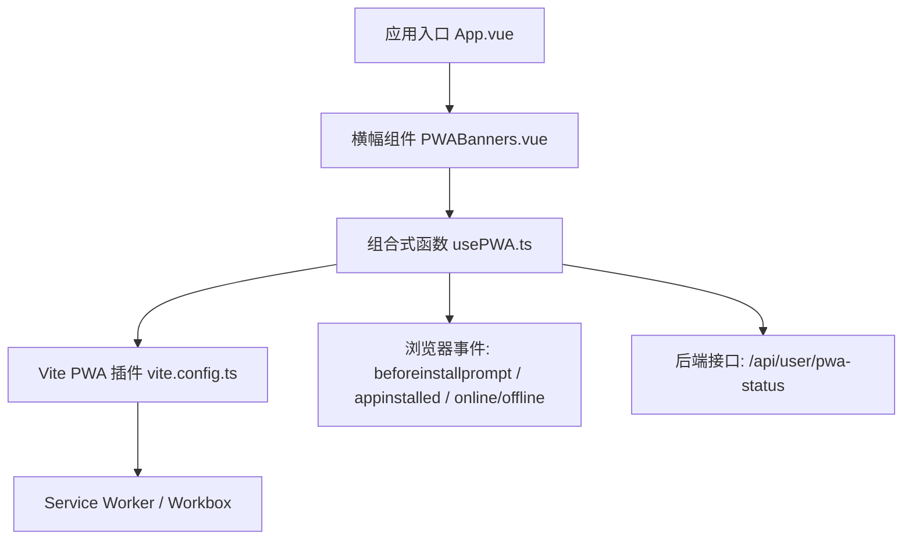
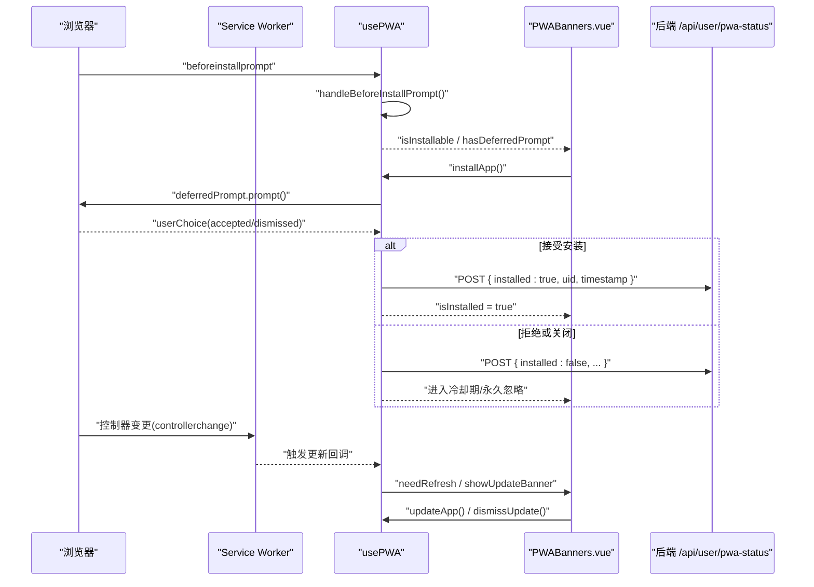
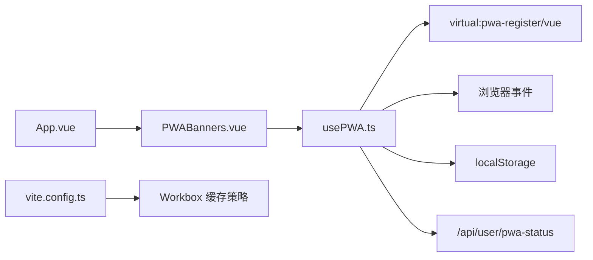

# PWA功能组合式函数

<cite>
**本文引用的文件**
- [usePWA.ts](file://web/app/src/composables/usePWA.ts)
- [PWABanners.vue](file://web/app/src/components/common/PWABanners.vue)
- [vite.config.ts](file://web/app/vite.config.ts)
- [App.vue](file://web/app/src/App.vue)
- [ProfilePage.vue](file://web/app/src/views/ProfilePage.vue)
</cite>

## 目录
1. [简介](#简介)
2. [项目结构](#项目结构)
3. [核心组件](#核心组件)
4. [架构总览](#架构总览)
5. [详细组件分析](#详细组件分析)
6. [依赖关系分析](#依赖关系分析)
7. [性能考虑](#性能考虑)
8. [故障排查指南](#故障排查指南)
9. [结论](#结论)
10. [附录](#附录)

## 简介
本文件围绕前端应用中的PWA能力，系统化梳理并文档化“PWA功能组合式函数”的实现与使用。重点覆盖服务工作者注册、离线缓存策略、安装提示与生命周期管理、版本更新检测、存储空间与隐私安全、事件处理与故障恢复等。同时给出配置选项说明、关键流程时序图与流程图，帮助读者快速理解并在业务中正确使用。

## 项目结构
- 组合式函数：位于 web/app/src/composables/usePWA.ts，封装PWA相关状态、事件监听、SW更新与安装引导逻辑。
- UI横幅：位于 web/app/src/components/common/PWABanners.vue，展示更新提示、离线提示与安装引导。
- Vite构建与PWA插件：位于 web/app/vite.config.ts，定义manifest、Workbox缓存策略与版本文件生成。
- 应用入口与全局事件：位于 web/app/src/App.vue，挂载横幅并监听安装完成事件。
- 页面集成示例：位于 web/app/src/views/ProfilePage.vue，在个人中心提供安装入口与重置能力。

图表来源
- [App.vue:13-16](file://web/app/src/App.vue#L13-L16)
- [PWABanners.vue:1-15](file://web/app/src/components/common/PWABanners.vue#L1-L15)
- [usePWA.ts:36-53](file://web/app/src/composables/usePWA.ts#L36-L53)
- [vite.config.ts:34-89](file://web/app/vite.config.ts#L34-L89)

章节来源
- [App.vue:13-16](file://web/app/src/App.vue#L13-L16)
- [PWABanners.vue:1-15](file://web/app/src/components/common/PWABanners.vue#L1-L15)
- [usePWA.ts:36-53](file://web/app/src/composables/usePWA.ts#L36-L53)
- [vite.config.ts:34-89](file://web/app/vite.config.ts#L34-L89)

## 核心组件
- usePWA 组合式函数
  - 职责：注册SW、监听网络与可见性变化、管理安装提示与冷却期、检测版本更新、上报安装状态到后端、清理过期状态。
  - 关键状态：是否可安装、是否已安装、是否离线、是否需要刷新、安装状态枚举、是否有延迟提示事件。
  - 关键方法：安装应用、忽略安装（短/长冷却）、强制重置并刷新、更新应用、记录访问日、计算连续访问天数、判断高频用户等。
- PWABanners 横幅组件
  - 职责：根据 usePWA 暴露的状态渲染更新横幅、离线横幅与安装引导卡片，并提供交互按钮。
- Vite PWA 配置
  - 职责：生成 manifest、配置 Workbox 缓存策略、注入 version.json、设置运行时缓存规则（API与上传资源不缓存）。

章节来源
- [usePWA.ts:36-441](file://web/app/src/composables/usePWA.ts#L36-L441)
- [PWABanners.vue:1-113](file://web/app/src/components/common/PWABanners.vue#L1-L113)
- [vite.config.ts:34-89](file://web/app/vite.config.ts#L34-L89)

## 架构总览
下图展示了从浏览器事件到组合式函数、再到UI与后端的完整链路。

图表来源
- [usePWA.ts:213-263](file://web/app/src/composables/usePWA.ts#L213-L263)
- [usePWA.ts:306-362](file://web/app/src/composables/usePWA.ts#L306-L362)
- [PWABanners.vue:10-14](file://web/app/src/components/common/PWABanners.vue#L10-L14)
- [vite.config.ts:34-89](file://web/app/vite.config.ts#L34-L89)

## 详细组件分析

### 组合式函数 usePWA
- 服务工作者注册与更新
  - 通过虚拟模块提供的注册钩子获取 ServiceWorkerRegistration，并在注册成功后主动调用 update。
  - 监听 controllerchange，避免在用户输入时强制刷新，必要时设置需要刷新标志。
  - 定时轮询 swRegistration.update()，以及每5分钟检查一次；另通过轮询 /version.json 对比 buildTime 触发更新提示。
- 离线缓存策略
  - 通过 Workbox 的 runtimeCaching 将 API 与 /uploads 路径设置为 NetworkOnly，避免跨会话泄露敏感数据。
  - 静态资源采用默认缓存策略，最大文件大小限制为4MB，排除 wiki-content 与 version.json 的导航回退。
- 安装提示与生命周期管理
  - 捕获 beforeinstallprompt 事件，结合“高频用户”判定（连续访问天数）与冷却期控制决定是否展示安装提示。
  - 支持“稍后”与“关闭”两种忽略策略，分别对应不同冷却时长；达到最大展示次数后标记为永久忽略。
  - 检测到 standalone 模式或之前已安装则直接标记为已安装，不再重复提示。
- 版本更新检测
  - 基于 needRefresh 与 showUpdateBanner 控制顶部更新横幅显示。
  - 提供 updateApp 与 dismissUpdate，前者尝试优雅更新，失败则回退到强制刷新；后者延迟一段时间再重试更新。
- 推送通知与后台同步
  - 当前实现未包含推送订阅与后台同步逻辑；如需扩展可在组合式函数中增加相应订阅与事件处理。
- 设备兼容性处理
  - 通过 matchMedia(display-mode: standalone)、navigator.standalone、referrer 等方式检测独立运行模式。
  - 针对移动端与桌面端统一处理安装提示与更新提示。
- 存储空间管理与隐私
  - 使用 localStorage 存储安装状态、忽略时间戳与计数、访问日期列表；提供过期清理与重置方法。
  - 对敏感数据（API、上传资源）明确不缓存，降低共享设备上的数据泄露风险。
- 事件处理与故障恢复
  - 监听 online/offline 切换，在线时尝试更新SW。
  - 遇到网络错误、SW注册错误等，进行静默降级与日志输出，保证主流程稳定。

```mermaid
flowchart TD
Start(["进入组合式函数"]) --> CheckStandalone{"是否独立模式?"}
CheckStandalone --> |是| MarkInstalled["标记已安装"]
CheckStandalone --> |否| CheckPrevInstalled{"之前是否已安装?"}
CheckPrevInstalled --> |是| SetStatus["设置状态为已安装"]
CheckPrevInstalled --> |否| CheckCooldown{"是否在冷却期?"}
CheckCooldown --> |是| End(["结束"])
CheckCooldown --> |否| CheckHighFreq{"是否高频用户?"}
CheckHighFreq --> |否| End
CheckHighFreq --> |是| ShowPrompt{"是否达到展示上限?"}
ShowPrompt --> |是| End
ShowPrompt --> |否| EnableInstall["启用安装提示"]
EnableInstall --> End
```

图表来源
- [usePWA.ts:68-166](file://web/app/src/composables/usePWA.ts#L68-L166)

章节来源
- [usePWA.ts:36-441](file://web/app/src/composables/usePWA.ts#L36-L441)

### 横幅组件 PWABanners.vue
- 展示三种横幅：
  - 新版本可用横幅：当 needRefresh 且不在冷却期内显示，提供“更新”和“稍后”操作。
  - 离线横幅：当 isOffline 为真时显示，提示网络连接断开。
  - 安装引导卡片：当 isInstallable 为真时显示，提供“添加到桌面”、“稍后”、“关闭”操作。
- 与 usePWA 的状态绑定：
  - 通过解构 isInstallable、isOffline、showUpdateBanner 等方法驱动UI。
  - 点击“更新”调用 updateApp，点击“稍后”调用 dismissUpdate。

章节来源
- [PWABanners.vue:1-113](file://web/app/src/components/common/PWABanners.vue#L1-L113)

### Vite PWA 配置
- Manifest 配置：名称、图标、主题色、启动页、分类等。
- Workbox 配置：
  - clientsClaim: true，确保新SW立即接管。
  - navigateFallbackDenylist：排除特定路由与版本文件。
  - maximumFileSizeToCacheInBytes：限制缓存大小。
  - globPatterns：缓存静态资源类型。
  - runtimeCaching：对 /api/* 与 /uploads/* 使用 NetworkOnly，避免缓存敏感数据；/version.json 也走网络。
- 版本文件生成：
  - 构建时生成 version.json，包含 buildTime、env 与上次生产构建时间，用于前端检测更新。

章节来源
- [vite.config.ts:34-89](file://web/app/vite.config.ts#L34-L89)
- [vite.config.ts:19-33](file://web/app/vite.config.ts#L19-L33)

### 应用入口与页面集成
- App.vue
  - 挂载 PWABanners 组件，监听 pwa-installed 自定义事件以展示成功提示。
- ProfilePage.vue
  - 在个人中心提供“添加桌面”入口，使用 usePWA 的 installApp 与 forceResetAndReload 等方法。

章节来源
- [App.vue:13-16](file://web/app/src/App.vue#L13-L16)
- [App.vue:44-48](file://web/app/src/App.vue#L44-L48)
- [ProfilePage.vue:10-36](file://web/app/src/views/ProfilePage.vue#L10-L36)

## 依赖关系分析
- 组合式函数依赖：
  - Vue 响应式 API（ref、computed、onMounted、onUnmounted）。
  - virtual:pwa-register/vue 提供的 useRegisterSW。
  - 本地存储 localStorage 与浏览器事件 API。
  - 后端接口 /api/user/pwa-status（可选，需登录态）。
- 组件依赖：
  - PWABanners.vue 依赖 usePWA 暴露的状态与方法。
  - App.vue 依赖 PWABanners.vue 与自定义事件。
- 构建依赖：
  - vite-plugin-pwa 负责生成SW与缓存策略。
  - Workbox 运行时缓存规则影响网络请求行为。

图表来源
- [usePWA.ts:1-53](file://web/app/src/composables/usePWA.ts#L1-L53)
- [PWABanners.vue:1-15](file://web/app/src/components/common/PWABanners.vue#L1-L15)
- [vite.config.ts:34-89](file://web/app/vite.config.ts#L34-L89)

章节来源
- [usePWA.ts:1-53](file://web/app/src/composables/usePWA.ts#L1-L53)
- [PWABanners.vue:1-15](file://web/app/src/components/common/PWABanners.vue#L1-L15)
- [vite.config.ts:34-89](file://web/app/vite.config.ts#L34-L89)

## 性能考虑
- 减少不必要的刷新：controllerchange 时优先设置刷新标志，避免打断用户输入。
- 合理缓存策略：仅缓存静态资源，API与上传资源一律走网络，避免额外I/O与内存占用。
- 定期轻量检查：每5分钟检查SW更新，版本文件轮询间隔30秒，平衡及时性与开销。
- 限制缓存体积：maximumFileSizeToCacheInBytes 防止大文件占用过多空间。
- 冷启动优化：clientsClaim 提升新SW接管效率，减少首屏等待。

[本节为通用指导，无需具体文件引用]

## 故障排查指南
- 无法触发安装提示
  - 检查是否满足高频用户条件与冷却期限制；确认 beforeinstallprompt 事件是否被捕获。
  - 参考：[usePWA.ts:213-228](file://web/app/src/composables/usePWA.ts#L213-L228)
- 安装后仍提示安装
  - 检查 standalone 模式检测与之前安装状态清理逻辑；确认 localStorage 状态是否被正确清除。
  - 参考：[usePWA.ts:68-77](file://web/app/src/composables/usePWA.ts#L68-L77), [usePWA.ts:285-294](file://web/app/src/composables/usePWA.ts#L285-L294)
- 更新横幅不出现
  - 检查 needRefresh 与 showUpdateBanner 的计算逻辑；确认 /version.json 返回与构建时间比较。
  - 参考：[usePWA.ts:41-57](file://web/app/src/composables/usePWA.ts#L41-L57), [usePWA.ts:347-362](file://web/app/src/composables/usePWA.ts#L347-L362)
- 敏感数据被缓存
  - 确认 runtimeCaching 规则是否生效，/api/* 与 /uploads/* 应为 NetworkOnly。
  - 参考：[vite.config.ts:72-87](file://web/app/vite.config.ts#L72-L87)
- 更新失败导致白屏
  - updateApp 失败会回退到强制刷新；检查网络与服务工作者状态。
  - 参考：[usePWA.ts:296-304](file://web/app/src/composables/usePWA.ts#L296-L304)

章节来源
- [usePWA.ts:213-228](file://web/app/src/composables/usePWA.ts#L213-L228)
- [usePWA.ts:68-77](file://web/app/src/composables/usePWA.ts#L68-L77)
- [usePWA.ts:285-294](file://web/app/src/composables/usePWA.ts#L285-L294)
- [usePWA.ts:41-57](file://web/app/src/composables/usePWA.ts#L41-L57)
- [usePWA.ts:347-362](file://web/app/src/composables/usePWA.ts#L347-L362)
- [vite.config.ts:72-87](file://web/app/vite.config.ts#L72-L87)
- [usePWA.ts:296-304](file://web/app/src/composables/usePWA.ts#L296-L304)

## 结论
本组合式函数以最小侵入方式整合了PWA的核心能力：服务工作者注册与更新、离线缓存策略、安装提示与生命周期管理、版本更新检测、存储空间与隐私保护、事件处理与故障恢复。配合横幅组件与Vite PWA配置，形成完整的端到端体验。若需进一步扩展，可在该函数基础上增加推送订阅与后台同步等能力。

[本节为总结性内容，无需具体文件引用]

## 附录
- 配置选项速览（来自Vite PWA配置）
  - registerType: prompt
  - includeAssets: logo与icons
  - manifest: name、short_name、description、theme_color、background_color、display、orientation、scope、start_url、categories、icons
  - workbox: clientsClaim、navigateFallbackDenylist、maximumFileSizeToCacheInBytes、globPatterns、runtimeCaching
- 关键常量（来自组合式函数）
  - 冷却时长：稍后3天、关闭7天、过期30天
  - 最大展示次数：5次
  - 高频用户阈值：连续访问天数≥1
- 事件与状态
  - 事件：beforeinstallprompt、appinstalled、online/offline、visibilitychange、controllerchange
  - 状态：isInstallable、isInstalled、isOffline、needsUpdate、installStatus、hasDeferredPrompt

章节来源
- [vite.config.ts:34-89](file://web/app/vite.config.ts#L34-L89)
- [usePWA.ts:10-20](file://web/app/src/composables/usePWA.ts#L10-L20)
- [usePWA.ts:312-345](file://web/app/src/composables/usePWA.ts#L312-L345)