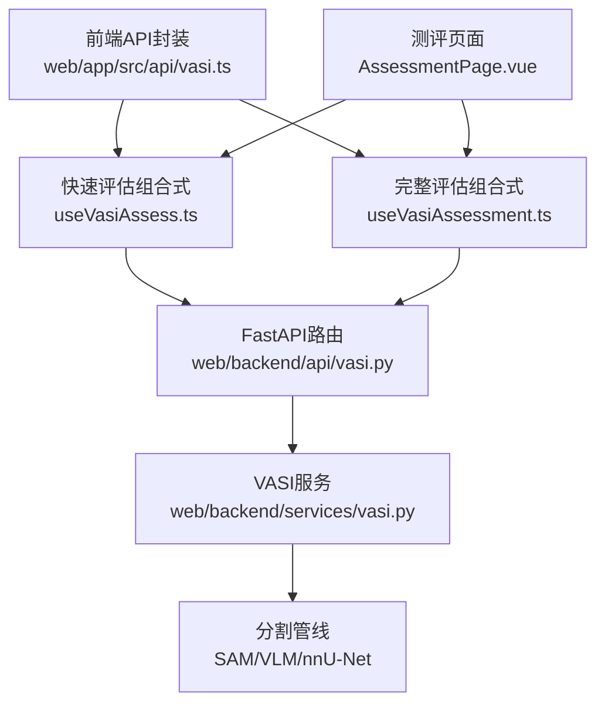
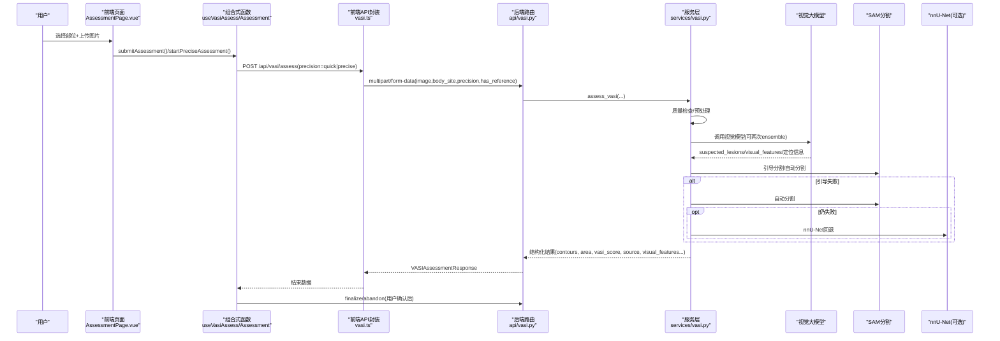
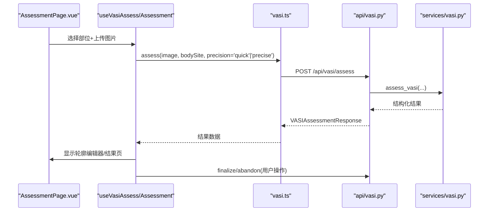
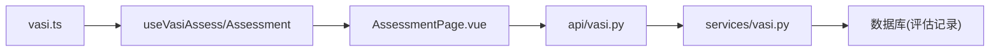

# AI分割算法集成

<cite>
**本文引用的文件**
- [web/app/src/api/vasi.ts](file://web/app/src/api/vasi.ts)
- [web/app/src/composables/useVasiAssess.ts](file://web/app/src/composables/useVasiAssess.ts)
- [web/app/src/composables/useVasiAssessment.ts](file://web/app/src/composables/useVasiAssessment.ts)
- [web/backend/api/vasi.py](file://web/backend/api/vasi.py)
- [web/backend/services/vasi.py](file://web/backend/services/vasi.py)
- [web/app/src/views/AssessmentPage.vue](file://web/app/src/views/AssessmentPage.vue)
- [tests/backend/api/test_vasi.py](file://tests/backend/api/test_vasi.py)
</cite>

## 目录
1. [简介](#简介)
2. [项目结构](#项目结构)
3. [核心组件](#核心组件)
4. [架构总览](#架构总览)
5. [详细组件分析](#详细组件分析)
6. [依赖关系分析](#依赖关系分析)
7. [性能考量](#性能考量)
8. [故障排查指南](#故障排查指南)
9. [结论](#结论)
10. [附录：API调用示例与最佳实践](#附录api调用示例与最佳实践)

## 简介
本文件面向AI分割算法集成的实现与使用，重点说明前端提交评估的两种模式（快速评估与精确评估）以及后端VASI API的交互流程。文档涵盖图像上传、AI分割处理、轮廓提取、结果返回、assessmentSource来源分类（sam-vlm-guided、sam-only-auto、mock）、高级分析字段（suspectedLesions、visualFeatures等），并提供完整的API调用示例、错误处理策略和性能优化建议。

## 项目结构
- 前端
  - API封装：web/app/src/api/vasi.ts
  - 业务逻辑组合式函数：web/app/src/composables/useVasiAssess.ts、useVasiAssessment.ts
  - 页面入口：web/app/src/views/AssessmentPage.vue
- 后端
  - FastAPI路由：web/backend/api/vasi.py
  - 服务层：web/backend/services/vasi.py
- 测试
  - 接口用例：tests/backend/api/test_vasi.py

图表来源
- [web/app/src/api/vasi.ts:122-237](file://web/app/src/api/vasi.ts#L122-L237)
- [web/app/src/composables/useVasiAssess.ts:63-104](file://web/app/src/composables/useVasiAssess.ts#L63-L104)
- [web/app/src/composables/useVasiAssessment.ts:214-312](file://web/app/src/composables/useVasiAssessment.ts#L214-L312)
- [web/backend/api/vasi.py:45-164](file://web/backend/api/vasi.py#L45-L164)
- [web/backend/services/vasi.py:159-243](file://web/backend/services/vasi.py#L159-L243)

章节来源
- [web/app/src/api/vasi.ts:122-237](file://web/app/src/api/vasi.ts#L122-L237)
- [web/backend/api/vasi.py:45-164](file://web/backend/api/vasi.py#L45-L164)
- [web/backend/services/vasi.py:159-243](file://web/backend/services/vasi.py#L159-L243)

## 核心组件
- 前端API封装（vasi.ts）
  - assess(image, bodySite, precision, options)：发起POST /api/vasi/assess，支持quick/precise精度与参考卡标记
  - submitContour/submitTwoLayerMask：提交用户修正轮廓或双层掩膜，计算最终面积与VASI评分
  - finalizeAssessment/abandonAssessment：确认或放弃草稿评估
  - checkPhotoQuality：图片质量检查
  - promptable系列：交互式提示点/圆精修
- 组合式函数
  - useVasiAssess：轻量提交与结果管理，含uploadStage状态、高置信度判断、AI图层URL、assessmentSource/suspectedLesions/visualFeatures透传
  - useVasiAssessment：完整流程，包含质量检查、历史加载、精确评估startPreciseAssessment、轮廓编辑、最终化与清理
- 后端路由（vasi.py）
  - POST /api/vasi/assess：创建评估，解析details/raw_api_response/visual_features_json并组装响应
  - POST /api/vasi/assess/{id}/contour：用户修正轮廓，计算差异、面积与VASI评分，记录反馈与训练样本
  - GET /api/vasi/history、GET /api/vasi/trend：历史与趋势查询
  - POST /api/vasi/check-photo-quality：图片质量检查
- 服务层（vasi.py）
  - assess_vasi：主流程：质量检查→预处理→视觉大模型(VLM)→SAM引导/自动→回退到nnU-Net→最后回退为错误（不再随机mock）
  - _call_vision_model/_call_vision_model_ensemble：调用百炼DashScope视觉模型，支持两次采样取交集提升稳定性
  - 分段失败回退：guided SAM失败→auto SAM→分块(tiling)→nnU-Net→抛出异常
  - 结果增强：按病灶维度加权脱色、对比度调整、重算VASI公式、输出source/source细节

章节来源
- [web/app/src/api/vasi.ts:122-237](file://web/app/src/api/vasi.ts#L122-L237)
- [web/app/src/composables/useVasiAssess.ts:1-186](file://web/app/src/composables/useVasiAssess.ts#L1-L186)
- [web/app/src/composables/useVasiAssessment.ts:1-646](file://web/app/src/composables/useVasiAssessment.ts#L1-L646)
- [web/backend/api/vasi.py:45-737](file://web/backend/api/vasi.py#L45-L737)
- [web/backend/services/vasi.py:159-1044](file://web/backend/services/vasi.py#L159-L1044)

## 架构总览
下图展示从前端到后端的端到端调用链路与关键分支。

图表来源
- [web/app/src/views/AssessmentPage.vue:67-106](file://web/app/src/views/AssessmentPage.vue#L67-L106)
- [web/app/src/composables/useVasiAssess.ts:63-104](file://web/app/src/composables/useVasiAssess.ts#L63-L104)
- [web/app/src/composables/useVasiAssessment.ts:214-312](file://web/app/src/composables/useVasiAssessment.ts#L214-L312)
- [web/backend/api/vasi.py:45-164](file://web/backend/api/vasi.py#L45-L164)
- [web/backend/services/vasi.py:602-1044](file://web/backend/services/vasi.py#L602-L1044)

## 详细组件分析

### 快速评估 vs 精确评估
- 快速评估（precision=quick）
  - 目标：快速出结果，约10秒级
  - 行为：优先VLM引导SAM；若引导失败则回退到自动SAM；必要时启用分块(tiling)搜索小病灶；如仍失败尝试nnU-Net
  - 适用场景：日常跟踪、快速查看趋势
- 精确评估（precision=precise）
  - 目标：更高稳定性与准确性，约70秒级
  - 行为：在精确模式下启用VLM ensemble（两次独立调用，取交集），降低随机性；后续同样走SAM/回退链路
  - 适用场景：需要更可靠结果的复查、报告生成

章节来源
- [web/backend/services/vasi.py:602-866](file://web/backend/services/vasi.py#L602-L866)
- [web/backend/services/vasi.py:1475-1571](file://web/backend/services/vasi.py#L1475-L1571)
- [web/app/src/composables/useVasiAssessment.ts:281-312](file://web/app/src/composables/useVasiAssessment.ts#L281-L312)

### assessmentSource来源分类
- sam-vlm-guided：VLM提供皮肤区域与病灶中心/边界等引导，SAM据此进行分割
- sam-only-auto：未获得有效引导时，使用SAM自动分割
- mock：当所有AI服务不可用时的兜底（当前实现会抛出异常，避免伪造临床分数）

章节来源
- [web/backend/services/vasi.py:987-1044](file://web/backend/services/vasi.py#L987-L1044)
- [web/backend/api/vasi.py:96-105](file://web/backend/api/vasi.py#L96-L105)

### 高级分析功能：suspectedLesions与visualFeatures
- suspectedLesions：VLM输出的疑似病灶列表，包含center、bbox、edge_points、estimated_size_percent、confidence等，用于SAM引导与后续增强
- visualFeatures：六维视觉特征（visibility/color/border/shape/surface/distribution）及建议，辅助临床解读
- 这些字段在创建评估时从raw_api_response或visual_features_json中抽取并返回给前端

章节来源
- [web/backend/api/vasi.py:96-114](file://web/backend/api/vasi.py#L96-L114)
- [web/backend/services/vasi.py:1086-1466](file://web/backend/services/vasi.py#L1086-L1466)

### 轮廓提取与用户修正
- 前端通过MaskEditor或双层掩膜编辑器对AI结果进行修正
- 后端计算AI与用户轮廓的差异（平均点距、IoU、是否修改），并基于双层掩膜重新计算面积与VASI评分
- 修正结果用于反馈收集与在线自进化学习

章节来源
- [web/app/src/api/vasi.ts:155-173](file://web/app/src/api/vasi.ts#L155-L173)
- [web/backend/api/vasi.py:544-737](file://web/backend/api/vasi.py#L544-L737)

### 前端提交流程时序图

图表来源
- [web/app/src/views/AssessmentPage.vue:67-106](file://web/app/src/views/AssessmentPage.vue#L67-L106)
- [web/app/src/composables/useVasiAssess.ts:63-104](file://web/app/src/composables/useVasiAssess.ts#L63-L104)
- [web/backend/api/vasi.py:45-164](file://web/backend/api/vasi.py#L45-L164)

## 依赖关系分析
- 前端依赖
  - vasi.ts封装HTTP请求与类型定义
  - useVasiAssess/useVasiAssessment负责状态管理与业务流程编排
  - AssessmentPage作为入口协调步骤流转
- 后端依赖
  - api/vasi.py路由负责鉴权、参数校验、结果组装
  - services/vasi.py串联质量检查、预处理、VLM、SAM、nnU-Net与回退策略
  - 数据库持久化评估记录（draft/active/abandoned）

图表来源
- [web/app/src/api/vasi.ts:122-237](file://web/app/src/api/vasi.ts#L122-L237)
- [web/backend/api/vasi.py:45-164](file://web/backend/api/vasi.py#L45-L164)
- [web/backend/services/vasi.py:159-243](file://web/backend/services/vasi.py#L159-L243)

章节来源
- [web/app/src/api/vasi.ts:122-237](file://web/app/src/api/vasi.ts#L122-L237)
- [web/backend/api/vasi.py:45-164](file://web/backend/api/vasi.py#L45-L164)
- [web/backend/services/vasi.py:159-243](file://web/backend/services/vasi.py#L159-L243)

## 性能考量
- 超时设置
  - 前端assess接口设置较长超时（例如180s），以容纳精确评估与VLM ensemble
- 质量检查前置
  - 低质量照片直接拒绝，避免浪费AI资源
- 分块(tiling)回退
  - 当引导SAM检测到的轮廓过少时，采用分块策略提高小病灶召回
- 精确模式稳定性
  - 精确模式启用VLM ensemble，减少随机性但增加耗时与成本
- 缓存与复用
  - promptable/prepare/click/refine-circle提供交互式精修，减少重复计算

章节来源
- [web/app/src/api/vasi.ts:122-237](file://web/app/src/api/vasi.ts#L122-L237)
- [web/backend/services/vasi.py:602-866](file://web/backend/services/vasi.py#L602-L866)
- [web/backend/api/vasi.py:357-445](file://web/backend/api/vasi.py#L357-L445)

## 故障排查指南
- 常见错误码与处理
  - 400：输入验证失败（图片格式、身体部位无效、JSON解析失败等）
  - 401：未认证访问
  - 404：评估记录不存在
  - 410：图片缓存失效（promptable相关）
  - 500：服务暂时不可用（AI服务异常）
- 诊断要点
  - 检查图片质量（blur、skin_ratio、brightness_mean）
  - 确认body_site是否在允许列表中
  - 观察assessment_source与segmentation_source，判断走哪条路径
  - 查看contour_diff与mask metrics（dice、area_error）定位偏差
- 日志与调试
  - 后端记录quality reject、ensemble、fallback、RL触发等信息
  - 前端toast提示错误详情，便于用户重试

章节来源
- [web/backend/api/vasi.py:160-164](file://web/backend/api/vasi.py#L160-L164)
- [web/backend/api/vasi.py:511-541](file://web/backend/api/vasi.py#L511-L541)
- [web/backend/services/vasi.py:1045-1084](file://web/backend/services/vasi.py#L1045-L1084)
- [tests/backend/api/test_vasi.py:13-139](file://tests/backend/api/test_vasi.py#L13-L139)

## 结论
该集成通过“VLM引导 + SAM分割 + 多路回退”的稳健流水线，实现了快速与精确两种评估模式。前端提供清晰的三步工作流与用户修正能力，后端保证数据安全与可追溯性。通过高质量前置检查、精确模式稳定性增强、分层回退与反馈闭环，系统在准确性、可用性与性能之间取得平衡。

## 附录：API调用示例与最佳实践

### 快速评估（POST /api/vasi/assess）
- 请求
  - Content-Type: multipart/form-data
  - 表单字段：image(File)、body_site(String)、precision="quick"、has_reference(Boolean字符串)
- 响应关键字段
  - id、vasi_score、area_percentage、classification、stage、contours、assessment_source、suspected_lesions、visual_features、confidence、precision_level、precise_available
- 前端调用路径
  - vasiApi.assess → POST /api/vasi/assess

章节来源
- [web/app/src/api/vasi.ts:122-134](file://web/app/src/api/vasi.ts#L122-L134)
- [web/backend/api/vasi.py:45-164](file://web/backend/api/vasi.py#L45-L164)

### 精确评估（POST /api/vasi/assess）
- 请求
  - precision="precise"
- 行为
  - 启用VLM ensemble，提升稳定性；后续同样走SAM/回退链路
- 前端调用路径
  - startPreciseAssessment → vasiApi.assess(..., 'precise')

章节来源
- [web/app/src/composables/useVasiAssessment.ts:281-312](file://web/app/src/composables/useVasiAssessment.ts#L281-L312)
- [web/backend/services/vasi.py:602-866](file://web/backend/services/vasi.py#L602-L866)

### 提交用户修正轮廓（POST /api/vasi/assess/{id}/contour）
- 请求体
  - contours(Array)、mask_image(可选)、skin_mask_image/lesion_mask_image(双层掩膜data URL)
- 响应
  - status、assessment_id、ai_contour_count、user_contour_count、diff_summary、final_area_percentage、final_vasi_score
- 用途
  - 计算差异、更新最终面积与VASI评分、记录反馈与训练样本

章节来源
- [web/app/src/api/vasi.ts:155-173](file://web/app/src/api/vasi.ts#L155-L173)
- [web/backend/api/vasi.py:544-737](file://web/backend/api/vasi.py#L544-L737)

### 确认/放弃草稿（POST /api/vasi/assess/{id}/finalize | abandon）
- finalize：将草稿转为active，进入历史与趋势
- abandon：标记为abandoned，排除历史与趋势

章节来源
- [web/backend/api/vasi.py:167-201](file://web/backend/api/vasi.py#L167-L201)

### 图片质量检查（POST /api/vasi/check-photo-quality）
- 请求
  - image(File)
- 响应
  - overall、blur_score、skin_ratio、brightness_mean、resolution、size_ok、suggestions
- 用途
  - 前置质量把关，避免低质量图片进入AI流程

章节来源
- [web/app/src/api/vasi.ts:184-191](file://web/app/src/api/vasi.ts#L184-L191)
- [web/backend/api/vasi.py:511-541](file://web/backend/api/vasi.py#L511-L541)

### 最佳实践
- 先做质量检查，再提交评估
- 快速评估用于日常跟踪，精确评估用于重要节点
- 利用用户修正闭环提升模型准确率
- 关注assessment_source与segmentation_source，理解结果来源
- 合理设置前端超时，避免误判网络问题