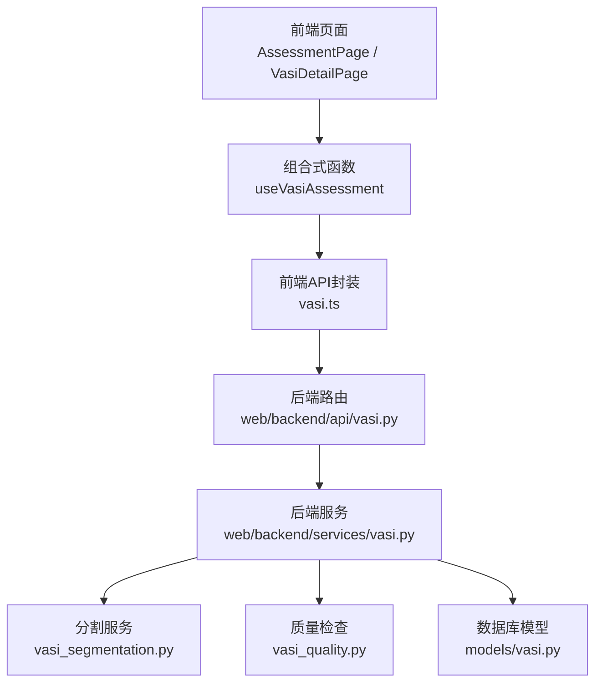
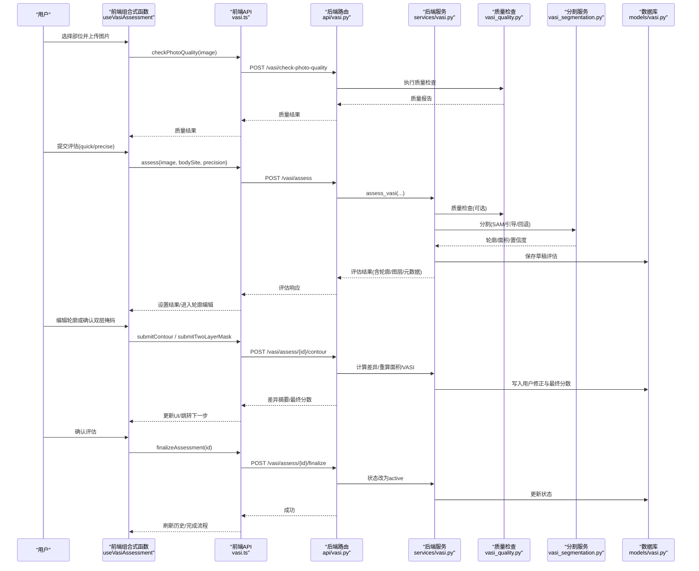
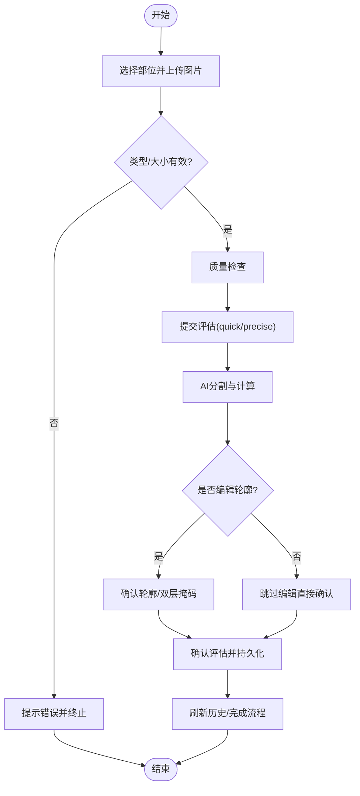
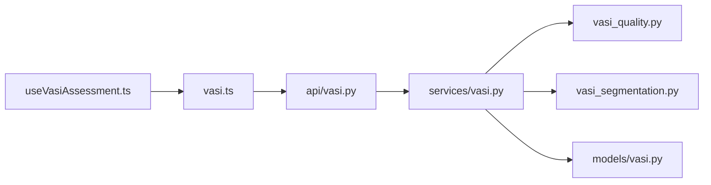

# VASI评估组合式函数

<cite>
**本文引用的文件**
- [useVasiAssessment.ts](file://web/app/src/composables/useVasiAssessment.ts)
- [vasi.ts（前端API）](file://web/app/src/api/vasi.ts)
- [vasi.py（后端API路由）](file://web/backend/api/vasi.py)
- [vasi.py（后端服务）](file://web/backend/services/vasi.py)
- [vasi_segmentation.py（分割服务）](file://web/backend/services/vasi_segmentation.py)
- [vasi_quality.py（质量检查）](file://web/backend/services/vasi_quality.py)
- [vasi.py（数据模型）](file://web/backend/models/vasi.py)
</cite>

## 目录
1. [简介](#简介)
2. [项目结构](#项目结构)
3. [核心组件](#核心组件)
4. [架构总览](#架构总览)
5. [详细组件分析](#详细组件分析)
6. [依赖关系分析](#依赖关系分析)
7. [性能考虑](#性能考虑)
8. [故障排查指南](#故障排查指南)
9. [结论](#结论)
10. [附录：接口与使用示例](#附录接口与使用示例)

## 简介
本文件面向“VASI评估组合式函数”的完整实现，聚焦前端组合式函数 useVasiAssessment，系统阐述其图像上传处理、AI分割算法集成、轮廓编辑功能、质量检查机制、评估结果管理，以及端到端评估流程（上传→分割→分析→确认）。文档同时覆盖错误处理、重试策略、状态管理、前后端交互方式、数据流与性能优化建议，并提供接口说明、参数配置、返回值格式和使用示例。

## 项目结构
- 前端组合式逻辑位于 web/app/src/composables/useVasiAssessment.ts，封装了用户交互、状态机、步骤引导、历史管理与草稿生成等能力。
- 前端API封装位于 web/app/src/api/vasi.ts，提供统一的HTTP调用封装与类型定义。
- 后端API路由位于 web/backend/api/vasi.py，暴露REST接口用于创建评估、提交轮廓修正、查询历史与趋势、图片质量检查等。
- 后端服务位于 web/backend/services/vasi.py，编排质量检查、预处理、视觉大模型定位、SAM引导分割、nnU-Net回退、结果计算与持久化。
- 分割服务位于 web/backend/services/vasi_segmentation.py，实现基于SAM与皮肤掩码的白斑像素级分割。
- 质量检查位于 web/backend/services/vasi_quality.py，对模糊度、皮肤占比、光照、分辨率进行综合评估。
- 数据模型位于 web/backend/models/vasi.py，定义评估记录、反馈信号、质量标签等数据库表结构。

图表来源
- [useVasiAssessment.ts:51-646](file://web/app/src/composables/useVasiAssessment.ts#L51-L646)
- [vasi.ts（前端API）:122-237](file://web/app/src/api/vasi.ts#L122-L237)
- [vasi.py（后端API路由）:45-165](file://web/backend/api/vasi.py#L45-L165)
- [vasi.py（后端服务）:159-243](file://web/backend/services/vasi.py#L159-L243)
- [vasi_segmentation.py:1-200](file://web/backend/services/vasi_segmentation.py#L1-L200)
- [vasi_quality.py:81-200](file://web/backend/services/vasi_quality.py#L81-L200)
- [vasi.py（数据模型）:26-104](file://web/backend/models/vasi.py#L26-L104)

章节来源
- [useVasiAssessment.ts:51-646](file://web/app/src/composables/useVasiAssessment.ts#L51-L646)
- [vasi.ts（前端API）:122-237](file://web/app/src/api/vasi.ts#L122-L237)
- [vasi.py（后端API路由）:45-165](file://web/backend/api/vasi.py#L45-L165)
- [vasi.py（后端服务）:159-243](file://web/backend/services/vasi.py#L159-L243)
- [vasi_segmentation.py:1-200](file://web/backend/services/vasi_segmentation.py#L1-L200)
- [vasi_quality.py:81-200](file://web/backend/services/vasi_quality.py#L81-L200)
- [vasi.py（数据模型）:26-104](file://web/backend/models/vasi.py#L26-L104)

## 核心组件
- 组合式函数 useVasiAssessment：集中管理上传、质量检查、快速/精确评估、轮廓编辑、图层确认、历史分页、草稿与日记生成、隐私遮罩等。
- 前端API vasi.ts：统一封装表单上传、轮廓提交、质量检查、历史与趋势、提示可交互分割（promptable）、最终确认与放弃等接口。
- 后端API路由：鉴权、参数校验、调用服务层、返回标准化响应。
- 后端服务：质量检查→预处理→视觉大模型定位→SAM引导分割→面积与VASI计算→持久化与元数据回填。
- 分割服务：皮肤区域检测、SAM自动/引导分割、重叠合并、多边形提取、数据URL生成。
- 质量检查：模糊度、皮肤占比、光照、分辨率综合评分与建议。
- 数据模型：评估记录、用户修正、双层掩码、置信度、视觉特征、状态机等字段。

章节来源
- [useVasiAssessment.ts:51-646](file://web/app/src/composables/useVasiAssessment.ts#L51-L646)
- [vasi.ts（前端API）:122-237](file://web/app/src/api/vasi.ts#L122-L237)
- [vasi.py（后端API路由）:45-165](file://web/backend/api/vasi.py#L45-L165)
- [vasi.py（后端服务）:159-243](file://web/backend/services/vasi.py#L159-L243)
- [vasi_segmentation.py:1-200](file://web/backend/services/vasi_segmentation.py#L1-L200)
- [vasi_quality.py:81-200](file://web/backend/services/vasi_quality.py#L81-L200)
- [vasi.py（数据模型）:26-104](file://web/backend/models/vasi.py#L26-L104)

## 架构总览
下图展示了从用户上传到评估确认的端到端流程，包括质量检查、AI分割、轮廓编辑、最终确认与历史记录更新。

图表来源
- [useVasiAssessment.ts:214-388](file://web/app/src/composables/useVasiAssessment.ts#L214-L388)
- [vasi.ts（前端API）:122-237](file://web/app/src/api/vasi.ts#L122-L237)
- [vasi.py（后端API路由）:45-165](file://web/backend/api/vasi.py#L45-L165)
- [vasi.py（后端服务）:159-243](file://web/backend/services/vasi.py#L159-L243)
- [vasi_quality.py:81-200](file://web/backend/services/vasi_quality.py#L81-L200)
- [vasi_segmentation.py:1-200](file://web/backend/services/vasi_segmentation.py#L1-L200)
- [vasi.py（数据模型）:26-104](file://web/backend/models/vasi.py#L26-L104)

## 详细组件分析

### 组合式函数 useVasiAssessment
- 状态管理
  - 上传阶段：selectedBodySite、uploadedImage、imagePreview、isUploading、uploadStage。
  - 评估结果：assessmentResult、lastAssessment、aiContours、editedContours、showContourEditor、highConfidence、isSubmittingContour、contourDiffResult、aiSkinLayerUrl、aiLesionLayerUrl。
  - VLM信息：assessmentSource、suspectedLesions、visualFeatures、skinRegionRatio。
  - 精确评估：preciseAvailable、isPreciseAssessing、preciseAssessmentDone。
  - 质量检查：qualityResult、qualityChecking、qualityIgnored、hasReferenceCard。
  - 历史与分页：recentAssessments、historyPage、historyPageSize、historyTotal、historyTotalPages、selectMode、selectedIds等。
- 关键方法
  - 文件选择与拖拽：handleFileSelect、handleDrop，包含类型与大小校验、预览加载、质量检查与步骤推进。
  - 质量检查：checkQuality调用后端质量检查接口，返回结构化质量报告。
  - 提交评估：submitAssessment发起快速评估，设置uploadStage为segmenting/analyzing，解析返回的轮廓、图层、置信度与视觉特征，进入轮廓编辑。
  - 精确评估：startPreciseAssessment在开始前清理草稿，调用精确模式，更新轮廓与状态。
  - 轮廓确认：handleContourConfirm与handleTwoLayerConfirm分别支持单图层mask与双层mask（皮肤层+白斑层），计算差异、更新最终分数并清理状态。
  - 跳过/取消：skipContourEdit与cancelAssessment，必要时调用abandon/finalize以维护状态一致性。
  - 历史管理：loadAssessmentHistory支持分页与追加两种模式，支持按部位筛选；deleteSingle/deleteSelected支持删除与批量删除。
  - 草稿与日记：createAssessmentDraft与writeDiaryFromAssessment将评估结果写入社区草稿或预填内容。
- 错误处理与重试
  - 上传与评估失败时通过toast提示错误详情；精确评估前会尝试放弃旧草稿避免脏数据。
  - 质量检查失败不影响后续流程，但会清空质量结果。
- 性能与体验
  - 使用data URL作为预览，避免blob失效问题。
  - 分段状态（uploading/segmenting/analyzing）提升用户感知。
  - 历史分页减少首屏负载。

图表来源
- [useVasiAssessment.ts:167-259](file://web/app/src/composables/useVasiAssessment.ts#L167-L259)
- [useVasiAssessment.ts:280-388](file://web/app/src/composables/useVasiAssessment.ts#L280-L388)
- [useVasiAssessment.ts:413-557](file://web/app/src/composables/useVasiAssessment.ts#L413-L557)

章节来源
- [useVasiAssessment.ts:51-646](file://web/app/src/composables/useVasiAssessment.ts#L51-L646)

### 前端API封装 vasi.ts
- 接口清单
  - assess：上传图像并触发评估，支持precision与参考卡标记。
  - getHistory/getTrend：获取历史与趋势数据。
  - submitContour/submitTwoLayerMask：提交轮廓修正或双层掩码，返回差异摘要与最终分数。
  - checkPhotoQuality：质量检查。
  - preparePromptable/click/refineCircle：提示可交互分割（点击/圆框）辅助标注。
  - finalizeAssessment/abandonAssessment：确认或放弃草稿。
  - deleteAssessment/deleteAssessmentsBatch：删除单条或批量删除。
- 数据类型
  - ContourRegion、SuspectedLesion、VisualFeatures、QualityCheckResult、VasiAssessmentResponse、VasiHistoryItem、VasiTrendResponse等。
- 超时与头设置
  - assess与promptable相关接口设置了合理超时，避免长时间阻塞。

章节来源
- [vasi.ts（前端API）:1-274](file://web/app/src/api/vasi.ts#L1-L274)

### 后端API路由 api/vasi.py
- 主要端点
  - POST /vasi/assess：创建评估，调用服务层，返回标准化响应（含轮廓、图层、置信度、视觉特征等）。
  - POST /vasi/assess/{id}/finalize：确认草稿，状态改为active。
  - POST /vasi/assess/{id}/abandon：放弃草稿，状态改为abandoned。
  - GET /vasi/history：分页获取已确认的历史记录。
  - GET /vasi/trend：趋势数据。
  - POST /vasi/check-photo-quality：质量检查。
  - POST /vasi/assess/{id}/contour：提交轮廓修正，计算差异与最终分数，记录反馈与训练样本。
  - DELETE /vasi/assess/batch：批量删除。
- 错误处理
  - 参数校验失败返回400；服务异常返回500；未找到资源返回404；缓存失效返回410。
- 安全与权限
  - 所有端点依赖认证中间件，确保用户身份与资源归属。

章节来源
- [vasi.py（后端API路由）:45-165](file://web/backend/api/vasi.py#L45-L165)
- [vasi.py（后端API路由）:167-201](file://web/backend/api/vasi.py#L167-L201)
- [vasi.py（后端API路由）:204-257](file://web/backend/api/vasi.py#L204-L257)
- [vasi.py（后端API路由）:448-473](file://web/backend/api/vasi.py#L448-L473)
- [vasi.py（后端API路由）:511-541](file://web/backend/api/vasi.py#L511-L541)
- [vasi.py（后端API路由）:544-738](file://web/backend/api/vasi.py#L544-L738)

### 后端服务 services/vasi.py
- 评估流程
  - 输入验证：图片大小、MIME类型、magic字节校验、身体部位白名单。
  - 图片存储：本地路径与key生成，便于下游RL/训练管线访问。
  - AI调用：质量检查→预处理→视觉大模型定位→SAM引导分割→nnU-Net回退→结果计算。
  - 结果持久化：创建草稿评估，填充轮廓、图层、置信度、视觉特征等元数据。
- 状态管理
  - finalize_assessment：将draft转为active。
  - abandon_assessment：将draft标记为abandoned。
  - get_user_history：仅返回active评估，避免草稿污染历史与趋势。
- 趋势计算
  - 优先使用final_vasi_score（用户修正后），否则回退至原始vasi_score。
- 轮廓修正与重算
  - 支持双层mask（皮肤层+白斑层）与单图层mask，计算面积百分比与VASI v2分数，记录差异指标与训练样本。

章节来源
- [vasi.py（后端服务）:159-243](file://web/backend/services/vasi.py#L159-L243)
- [vasi.py（后端服务）:246-280](file://web/backend/services/vasi.py#L246-L280)
- [vasi.py（后端服务）:282-334](file://web/backend/services/vasi.py#L282-L334)
- [vasi.py（后端服务）:443-537](file://web/backend/services/vasi.py#L443-L537)
- [vasi.py（后端服务）:539-600](file://web/backend/services/vasi.py#L539-L600)
- [vasi.py（后端服务）:602-800](file://web/backend/services/vasi.py#L602-L800)

### 分割服务 vasi_segmentation.py
- SAM模型加载与生成器
  - 延迟加载，区分quick与precise模式，调整网格点与阈值以平衡速度与精度。
- 分割流程
  - 构建皮肤掩码，限制白斑检测仅在皮肤区域内进行。
  - 合并重叠mask，提取多边形轮廓，平滑边缘，转换为归一化坐标。
  - 生成皮肤层与白斑层data URL供前端展示与二次编辑。
- 鲁棒性
  - 针对背景误检采用相对亮度阈值与重叠率过滤，提高准确性。

章节来源
- [vasi_segmentation.py:1-200](file://web/backend/services/vasi_segmentation.py#L1-L200)

### 质量检查 vasi_quality.py
- 指标
  - 模糊度（拉普拉斯方差）、皮肤占比（HSV+YCrCb双空间）、光照均值、分辨率。
- 输出
  - 整体评级（good/acceptable/poor）与建议列表，用于前端提示改进拍摄条件。
- 可用性
  - 依赖OpenCV与NumPy，不可用时降级为acceptable并提示服务暂不可用。

章节来源
- [vasi_quality.py:81-200](file://web/backend/services/vasi_quality.py#L81-L200)

### 数据模型 models/vasi.py
- 评估记录字段
  - 基础：user_id、image_url/key/hash、vasi_score、body_site、area_percentage、classification、stage。
  - 扩展：details、raw_api_response、assessment_source、confidence、quality_report_json、preprocessed、has_reference、scale_factor。
  - 用户修正：user_contours、contour_diff、final_vasi_score、final_area_percentage、depigmentation_level、is_user_corrected、user_mask_image。
  - 双层掩码：ai_skin_layer、ai_lesion_layer、user_skin_layer、user_lesion_layer。
  - 状态：status（draft/active/abandoned）。
  - 自进化：final_contour_diff_metrics。
- 迁移与兼容
  - ensure_vasi_columns动态添加缺失列，保证SQLite/PostgreSQL兼容。

章节来源
- [vasi.py（数据模型）:26-104](file://web/backend/models/vasi.py#L26-L104)
- [vasi.py（数据模型）:127-173](file://web/backend/models/vasi.py#L127-L173)

## 依赖关系分析
- 前端组合式函数依赖前端API封装，后者通过HTTP与后端路由交互。
- 后端路由依赖服务层，服务层依赖质量检查与分割服务，最终写入数据库模型。
- 分割服务依赖图像处理库（PIL、OpenCV、SAM/nnU-Net），质量检查依赖OpenCV与NumPy。
- 数据模型通过SQLAlchemy映射到数据库，支持迁移与字段扩展。

图表来源
- [useVasiAssessment.ts:51-646](file://web/app/src/composables/useVasiAssessment.ts#L51-L646)
- [vasi.ts（前端API）:122-237](file://web/app/src/api/vasi.ts#L122-L237)
- [vasi.py（后端API路由）:45-165](file://web/backend/api/vasi.py#L45-L165)
- [vasi.py（后端服务）:159-243](file://web/backend/services/vasi.py#L159-L243)
- [vasi_quality.py:81-200](file://web/backend/services/vasi_quality.py#L81-L200)
- [vasi_segmentation.py:1-200](file://web/backend/services/vasi_segmentation.py#L1-L200)
- [vasi.py（数据模型）:26-104](file://web/backend/models/vasi.py#L26-L104)

章节来源
- [useVasiAssessment.ts:51-646](file://web/app/src/composables/useVasiAssessment.ts#L51-L646)
- [vasi.ts（前端API）:122-237](file://web/app/src/api/vasi.ts#L122-L237)
- [vasi.py（后端API路由）:45-165](file://web/backend/api/vasi.py#L45-L165)
- [vasi.py（后端服务）:159-243](file://web/backend/services/vasi.py#L159-L243)
- [vasi_quality.py:81-200](file://web/backend/services/vasi_quality.py#L81-L200)
- [vasi_segmentation.py:1-200](file://web/backend/services/vasi_segmentation.py#L1-L200)
- [vasi.py（数据模型）:26-104](file://web/backend/models/vasi.py#L26-L104)

## 性能考虑
- 前端
  - 使用data URL预览避免blob失效；分阶段状态提升感知；历史分页减少首屏数据量。
- 后端
  - 质量检查前置，拒绝低质图片，节省AI算力。
  - 分割服务延迟加载SAM模型，区分quick/precise模式，降低CPU占用。
  - 双层mask与面积重算仅在用户修正时触发，避免不必要的计算。
  - 趋势计算优先使用final_vasi_score，减少重复计算。
- 网络
  - 合理超时设置，避免长请求阻塞；multipart/form-data上传需控制图片大小。

[本节为通用指导，不直接分析具体文件]

## 故障排查指南
- 上传失败
  - 检查图片类型与大小；确认前端校验与后端ALLOWED_IMAGE_TYPES一致。
  - 若magic字节校验失败，确认上传文件真实格式与声明一致。
- 质量检查失败
  - 若OpenCV/NumPy不可用，质量检查降级为acceptable；检查依赖安装。
- 分割失败
  - 检查SAM模型路径与设备可用（CUDA/CPU）；查看日志中SAM加载与生成器创建错误。
- 轮廓修正无变化
  - 确认提交的mask或轮廓数据正确；检查差异计算逻辑与阈值。
- 历史为空
  - 仅显示active状态的评估；确认是否调用了finalize；草稿会被排除。
- 趋势异常
  - 检查是否有大量草稿或abandoned记录影响统计；确认final_vasi_score是否正确写入。

章节来源
- [vasi.py（后端API路由）:160-165](file://web/backend/api/vasi.py#L160-L165)
- [vasi_quality.py:81-200](file://web/backend/services/vasi_quality.py#L81-L200)
- [vasi_segmentation.py:41-121](file://web/backend/services/vasi_segmentation.py#L41-L121)
- [vasi.py（后端服务）:282-334](file://web/backend/services/vasi.py#L282-L334)
- [vasi.py（后端服务）:443-537](file://web/backend/services/vasi.py#L443-L537)

## 结论
useVasiAssessment组合式函数提供了完整的VASI评估工作流，涵盖上传、质量检查、AI分割、轮廓编辑、结果确认与历史管理。前后端协作清晰，错误处理完善，状态管理严谨。通过质量检查前置、分割服务分层与回退、双层mask重算与趋势优先使用最终分数等策略，系统在准确性与性能之间取得良好平衡。建议在生产环境中启用更严格的图片质量门槛与监控，持续优化SAM参数与视觉大模型定位稳定性。

[本节为总结，不直接分析具体文件]

## 附录：接口与使用示例

### 前端组合式函数接口说明
- 状态
  - selectedBodySite、uploadedImage、imagePreview、isUploading、uploadStage
  - assessmentResult、lastAssessment、aiContours、editedContours、showContourEditor、highConfidence、isSubmittingContour、contourDiffResult、aiSkinLayerUrl、aiLesionLayerUrl
  - assessmentSource、suspectedLesions、visualFeatures、skinRegionRatio
  - preciseAvailable、isPreciseAssessing、preciseAssessmentDone
  - qualityResult、qualityChecking、qualityIgnored、hasReferenceCard
  - recentAssessments、loadingHistory、loadingMore、historyHasMore、historyPage、historyPageSize、historyTotal、historyTotalPages
  - selectMode、selectedIds、swipedId、deletingIds、currentStep
- 方法
  - setBodySite(site)、setHasReferenceCard(value)
  - handleFileSelect(event)、handleDrop(event)、checkQuality(file)
  - submitAssessment()、removeImage()
  - startPreciseAssessment()、handleTwoLayerConfirm(skinMaskDataUrl, lesionMaskDataUrl)、handleContourConfirm(contours, maskDataUrl?)、handleContourUpdate(contours)
  - skipContourEdit()、cancelAssessment()
  - loadAssessmentHistory(reset?, bodySite?, mode?)、loadMoreHistory()、goToHistoryPage(page)、setHistoryPageSize(size)
  - toggleSelectMode()、toggleSelect(id)、isSwiped(id)、onTouchStart(e)、onTouchEnd(e, id)
  - deleteSingle(id)、deleteSelected()
  - writeDiaryFromAssessment()、createAssessmentDraft()
  - privacyMask(value, suffix?)

章节来源
- [useVasiAssessment.ts:51-646](file://web/app/src/composables/useVasiAssessment.ts#L51-L646)

### 前端API接口说明
- assess(image, bodySite, precision="quick", options={hasReferenceCard?})
- getHistory(limit=20, offset=0, bodySite?)
- getAssessment(assessmentId)
- getTrend(bodySite?, days=30)
- submitContour(assessmentId, contours, maskImage=null)
- submitTwoLayerMask(assessmentId, skinMaskImage, lesionMaskImage)
- deleteAssessment(assessmentId)
- deleteAssessmentsBatch(ids)
- checkPhotoQuality(image)
- preparePromptable(image|Blob, cacheKey)
- clickPromptable(cacheKey, points[])
- refineCircle(cacheKey, circle)
- finalizeAssessment(assessmentId)
- abandonAssessment(assessmentId)

章节来源
- [vasi.ts（前端API）:122-237](file://web/app/src/api/vasi.ts#L122-L237)

### 后端API端点说明
- POST /vasi/assess：创建评估，返回评估结果与元数据。
- POST /vasi/assess/{id}/finalize：确认评估，状态改为active。
- POST /vasi/assess/{id}/abandon：放弃评估，状态改为abandoned。
- GET /vasi/history：分页获取已确认历史。
- GET /vasi/trend：趋势数据。
- POST /vasi/check-photo-quality：质量检查。
- POST /vasi/assess/{id}/contour：提交轮廓修正，计算差异与最终分数。
- DELETE /vasi/assess/batch：批量删除。
- DELETE /vasi/assess/{id}：删除单条评估。

章节来源
- [vasi.py（后端API路由）:45-165](file://web/backend/api/vasi.py#L45-L165)
- [vasi.py（后端API路由）:167-201](file://web/backend/api/vasi.py#L167-L201)
- [vasi.py（后端API路由）:204-257](file://web/backend/api/vasi.py#L204-L257)
- [vasi.py（后端API路由）:448-473](file://web/backend/api/vasi.py#L448-L473)
- [vasi.py（后端API路由）:511-541](file://web/backend/api/vasi.py#L511-L541)
- [vasi.py（后端API路由）:544-738](file://web/backend/api/vasi.py#L544-L738)

### 使用示例（概念性）
- 上传并快速评估
  - 选择部位→上传图片→触发checkPhotoQuality→调用assess(precision="quick")→进入轮廓编辑。
- 精确评估
  - 在快速评估基础上调用assess(precision="precise")→更新轮廓与置信度→确认。
- 轮廓修正
  - 编辑轮廓或上传双层mask→调用submitContour或submitTwoLayerMask→根据diff_summary判断修改→确认评估。
- 历史与趋势
  - 调用getHistory分页查看已确认评估→调用getTrend绘制曲线。

[本节为概念性示例，不直接分析具体文件]