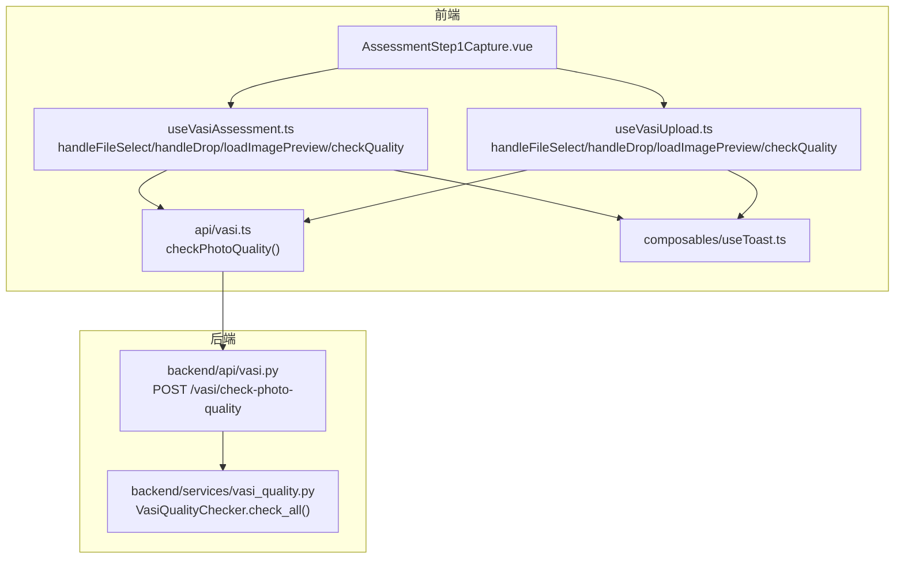
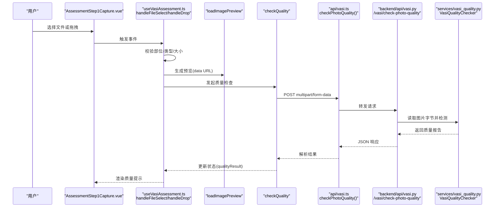
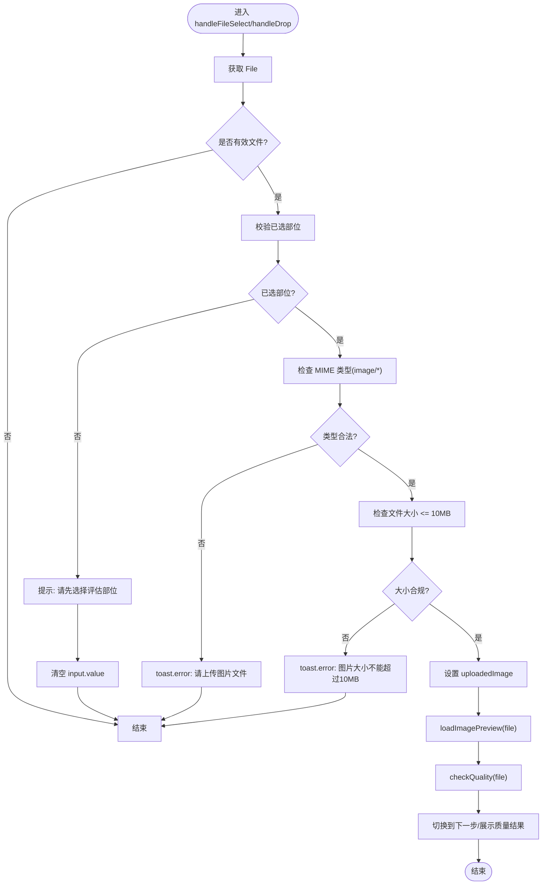
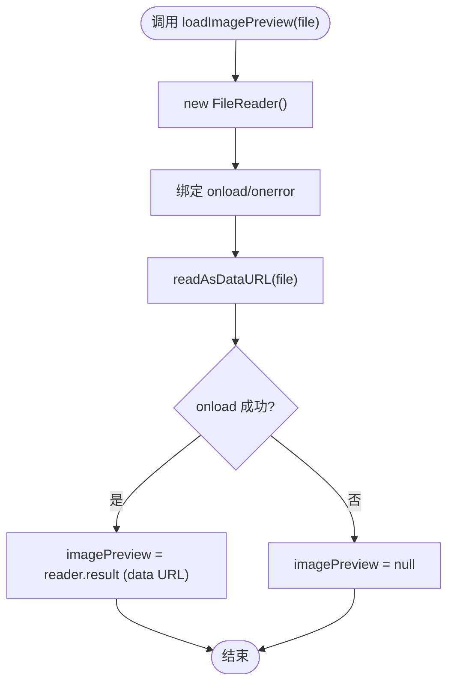
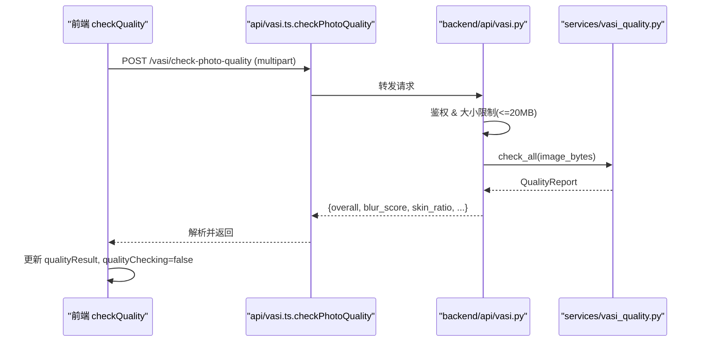
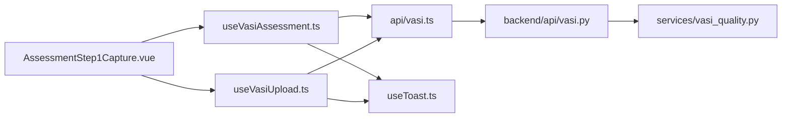

# 图像上传与处理

<cite>
**本文引用的文件**
- [useVasiAssessment.ts](file://web/app/src/composables/useVasiAssessment.ts)
- [useVasiUpload.ts](file://web/app/src/composables/useVasiUpload.ts)
- [vasi.ts](file://web/app/src/api/vasi.ts)
- [vasi.py](file://web/backend/api/vasi.py)
- [vasi_quality.py](file://web/backend/services/vasi_quality.py)
- [useToast.ts](file://web/app/src/composables/useToast.ts)
- [AssessmentStep1Capture.vue](file://web/app/src/components/tracker/AssessmentStep1Capture.vue)
</cite>

## 目录
1. [简介](#简介)
2. [项目结构](#项目结构)
3. [核心组件](#核心组件)
4. [架构总览](#架构总览)
5. [详细组件分析](#详细组件分析)
6. [依赖关系分析](#依赖关系分析)
7. [性能考虑](#性能考虑)
8. [故障排查指南](#故障排查指南)
9. [结论](#结论)
10. [附录](#附录)

## 简介
本文件面向“图像上传与处理”功能，聚焦前端文件选择、拖拽上传、预览生成与质量检查机制。重点说明 handleFileSelect 与 handleDrop 的实现流程（含类型校验、大小限制、错误提示），loadImagePreview 使用 FileReader 生成 data URL 的技术方案，以及 checkQuality 如何调用后端 /vasi/check-photo-quality 接口进行照片质量评估。文档同时提供完整的调用序列图、流程图与异常处理建议，帮助读者快速理解并扩展该能力。

## 项目结构
围绕图像上传与处理的关键代码分布在以下位置：
- 前端组合式逻辑：useVasiAssessment.ts、useVasiUpload.ts
- 前端 API 封装：vasi.ts
- 后端路由与服务：web/backend/api/vasi.py、web/backend/services/vasi_quality.py
- UI 交互入口：AssessmentStep1Capture.vue
- 用户反馈：useToast.ts

图表来源
- [useVasiAssessment.ts:148-207](file://web/app/src/composables/useVasiAssessment.ts#L148-L207)
- [useVasiUpload.ts:24-85](file://web/app/src/composables/useVasiUpload.ts#L24-L85)
- [vasi.ts:184-191](file://web/app/src/api/vasi.ts#L184-L191)
- [vasi.py:511-541](file://web/backend/api/vasi.py#L511-L541)
- [vasi_quality.py:188-271](file://web/backend/services/vasi_quality.py#L188-L271)
- [AssessmentStep1Capture.vue:136-149](file://web/app/src/components/tracker/AssessmentStep1Capture.vue#L136-L149)

章节来源
- [useVasiAssessment.ts:148-207](file://web/app/src/composables/useVasiAssessment.ts#L148-L207)
- [useVasiUpload.ts:24-85](file://web/app/src/composables/useVasiUpload.ts#L24-L85)
- [vasi.ts:184-191](file://web/app/src/api/vasi.ts#L184-L191)
- [vasi.py:511-541](file://web/backend/api/vasi.py#L511-L541)
- [vasi_quality.py:188-271](file://web/backend/services/vasi_quality.py#L188-L271)
- [AssessmentStep1Capture.vue:136-149](file://web/app/src/components/tracker/AssessmentStep1Capture.vue#L136-L149)

## 核心组件
- 文件选择与拖拽：handleFileSelect、handleDrop
- 预览生成：loadImagePreview（基于 FileReader + data URL）
- 质量检查：checkQuality（调用后端 /vasi/check-photo-quality）
- 用户反馈：useToast（success/warning/error/info）

章节来源
- [useVasiAssessment.ts:148-207](file://web/app/src/composables/useVasiAssessment.ts#L148-L207)
- [useVasiUpload.ts:24-85](file://web/app/src/composables/useVasiUpload.ts#L24-L85)
- [useToast.ts:1-31](file://web/app/src/composables/useToast.ts#L1-L31)

## 架构总览
下图展示了从用户操作到后端质量评估的完整调用链。

图表来源
- [useVasiAssessment.ts:148-207](file://web/app/src/composables/useVasiAssessment.ts#L148-L207)
- [useVasiUpload.ts:24-85](file://web/app/src/composables/useVasiUpload.ts#L24-L85)
- [vasi.ts:184-191](file://web/app/src/api/vasi.ts#L184-L191)
- [vasi.py:511-541](file://web/backend/api/vasi.py#L511-L541)
- [vasi_quality.py:188-271](file://web/backend/services/vasi_quality.py#L188-L271)

## 详细组件分析

### 文件选择与拖拽：handleFileSelect 与 handleDrop
- 职责
  - 从 input 或 drag-drop 获取 File
  - 确保已选择评估部位（未选择则提示并清空输入）
  - 类型检查：仅允许 image/*
  - 大小限制：前端限制 10MB（超过则提示）
  - 设置 uploadedImage、生成预览、触发质量检查、切换步骤
- 关键实现要点
  - 类型检查通过 file.type.startsWith('image/') 完成
  - 大小限制为 10 * 1024 * 1024 字节
  - 失败时通过 toast.error 提示用户
  - 成功后调用 loadImagePreview 与 checkQuality

图表来源
- [useVasiAssessment.ts:167-194](file://web/app/src/composables/useVasiAssessment.ts#L167-L194)
- [useVasiUpload.ts:48-73](file://web/app/src/composables/useVasiUpload.ts#L48-L73)
- [useToast.ts:12-24](file://web/app/src/composables/useToast.ts#L12-L24)

章节来源
- [useVasiAssessment.ts:167-194](file://web/app/src/composables/useVasiAssessment.ts#L167-L194)
- [useVasiUpload.ts:48-73](file://web/app/src/composables/useVasiUpload.ts#L48-L73)
- [useToast.ts:12-24](file://web/app/src/composables/useToast.ts#L12-L24)

### 预览生成：loadImagePreview（FileReader + data URL）
- 技术方案
  - 使用浏览器原生 FileReader.readAsDataURL(file) 将文件转为 data URL
  - onload 回调中写入 imagePreview 用于  直接显示
  - onerror 时将预览置空，避免显示破损图标
- 优势
  - data URL 自包含，不依赖 blob URL 的生命周期管理
  - 在上传后仍可用于本地预览，避免资源失效问题

图表来源
- [useVasiAssessment.ts:149-157](file://web/app/src/composables/useVasiAssessment.ts#L149-L157)
- [useVasiUpload.ts:24-29](file://web/app/src/composables/useVasiUpload.ts#L24-L29)

章节来源
- [useVasiAssessment.ts:149-157](file://web/app/src/composables/useVasiAssessment.ts#L149-L157)
- [useVasiUpload.ts:24-29](file://web/app/src/composables/useVasiUpload.ts#L24-L29)

### 质量检查：checkQuality 与后端 API
- 前端流程
  - 重置 qualityResult、qualityChecking
  - 调用 vasiApi.checkPhotoQuality(file)
  - 捕获异常并将 qualityResult 置空
  - finally 中关闭 qualityChecking
- 后端流程
  - 路由 /vasi/check-photo-quality 接收 multipart/form-data
  - 强制鉴权，限制最大图片大小为 20MB，防止内存耗尽
  - 调用 services.vasi_quality.VasiQualityChecker.check_all()
  - 返回结构化质量报告（模糊度、皮肤占比、亮度、分辨率、建议等）

图表来源
- [useVasiAssessment.ts:196-207](file://web/app/src/composables/useVasiAssessment.ts#L196-L207)
- [useVasiUpload.ts:75-85](file://web/app/src/composables/useVasiUpload.ts#L75-L85)
- [vasi.ts:184-191](file://web/app/src/api/vasi.ts#L184-L191)
- [vasi.py:511-541](file://web/backend/api/vasi.py#L511-L541)
- [vasi_quality.py:188-271](file://web/backend/services/vasi_quality.py#L188-L271)

章节来源
- [useVasiAssessment.ts:196-207](file://web/app/src/composables/useVasiAssessment.ts#L196-L207)
- [useVasiUpload.ts:75-85](file://web/app/src/composables/useVasiUpload.ts#L75-L85)
- [vasi.ts:184-191](file://web/app/src/api/vasi.ts#L184-L191)
- [vasi.py:511-541](file://web/backend/api/vasi.py#L511-L541)
- [vasi_quality.py:188-271](file://web/backend/services/vasi_quality.py#L188-L271)

### 质量评估指标与建议（后端）
- 检测维度
  - 模糊度：拉普拉斯方差（值越高越清晰）
  - 皮肤区域占比：HSV + YCrCb 双空间掩码融合
  - 亮度：灰度均值判断过暗/过曝
  - 分辨率：最小宽高阈值
- 输出字段
  - overall: good/acceptable/poor
  - blur_score, blur_ok
  - skin_ratio, skin_ok
  - brightness_mean, lighting_ok
  - resolution, size_ok
  - suggestions: 中文改进建议列表

章节来源
- [vasi_quality.py:39-63](file://web/backend/services/vasi_quality.py#L39-L63)
- [vasi_quality.py:188-271](file://web/backend/services/vasi_quality.py#L188-L271)

### 用户反馈与交互
- 使用 useToast 统一展示 success/warning/error/info 消息
- 典型场景
  - 未选择部位：warning 提示
  - 非图片类型：error 提示
  - 超过大小限制：error 提示
  - 质量不佳：结合 qualityResult.suggestions 展示建议

章节来源
- [useToast.ts:12-24](file://web/app/src/composables/useToast.ts#L12-L24)
- [useVasiAssessment.ts:159-165](file://web/app/src/composables/useVasiAssessment.ts#L159-L165)
- [useVasiUpload.ts:31-37](file://web/app/src/composables/useVasiUpload.ts#L31-L37)

## 依赖关系分析
- 前端
  - useVasiAssessment.ts / useVasiUpload.ts 依赖 api/vasi.ts 的 checkPhotoQuality
  - 两者均依赖 useToast 进行用户反馈
  - AssessmentStep1Capture.vue 作为入口，触发上述方法
- 后端
  - backend/api/vasi.py 暴露 /vasi/check-photo-quality 端点
  - 调用 services/vasi_quality.py 的 VasiQualityChecker 执行检测
  - 依赖 OpenCV/Numpy（若不可用则降级提示）

图表来源
- [AssessmentStep1Capture.vue:136-149](file://web/app/src/components/tracker/AssessmentStep1Capture.vue#L136-L149)
- [useVasiAssessment.ts:148-207](file://web/app/src/composables/useVasiAssessment.ts#L148-L207)
- [useVasiUpload.ts:24-85](file://web/app/src/composables/useVasiUpload.ts#L24-L85)
- [vasi.ts:184-191](file://web/app/src/api/vasi.ts#L184-L191)
- [vasi.py:511-541](file://web/backend/api/vasi.py#L511-L541)
- [vasi_quality.py:188-271](file://web/backend/services/vasi_quality.py#L188-L271)
- [useToast.ts:12-24](file://web/app/src/composables/useToast.ts#L12-L24)

章节来源
- [useVasiAssessment.ts:148-207](file://web/app/src/composables/useVasiAssessment.ts#L148-L207)
- [useVasiUpload.ts:24-85](file://web/app/src/composables/useVasiUpload.ts#L24-L85)
- [vasi.ts:184-191](file://web/app/src/api/vasi.ts#L184-L191)
- [vasi.py:511-541](file://web/backend/api/vasi.py#L511-L541)
- [vasi_quality.py:188-271](file://web/backend/services/vasi_quality.py#L188-L271)
- [useToast.ts:12-24](file://web/app/src/composables/useToast.ts#L12-L24)

## 性能考虑
- 前端
  - 使用 data URL 进行本地预览，避免额外网络开销
  - 类型与大小前置校验减少无效上传
  - 质量检查异步执行，避免阻塞 UI
- 后端
  - 质量检查服务对大图的解码与计算可能耗时，采用懒加载与异常降级
  - 限制单次上传大小（20MB）保护服务器内存
  - 使用 OpenCV/Numpy 加速图像处理；若缺失则给出友好提示

[本节为通用指导，不直接分析具体文件]

## 故障排查指南
- 常见问题
  - 未选择评估部位：需先点击数字人对应部位再上传
  - 非图片文件：仅支持 image/* 类型
  - 图片过大：前端限制 10MB，后端限制 20MB
  - 质量不佳：根据 suggestions 调整拍摄环境（光线、清晰度、构图）
- 定位步骤
  - 检查控制台是否有网络错误或超时
  - 确认后端日志中是否存在 OpenCV/Numpy 缺失警告
  - 验证 FormData 是否正确附加 image 字段
  - 查看 qualityResult 中的 suggestions 以定位具体问题

章节来源
- [useVasiAssessment.ts:159-165](file://web/app/src/composables/useVasiAssessment.ts#L159-L165)
- [useVasiUpload.ts:31-37](file://web/app/src/composables/useVasiUpload.ts#L31-L37)
- [vasi_quality.py:17-36](file://web/backend/services/vasi_quality.py#L17-L36)
- [vasi_quality.py:197-201](file://web/backend/services/vasi_quality.py#L197-L201)

## 结论
该图像上传与处理链路通过前端严格校验与友好的用户反馈，结合后端高质量的质量评估服务，实现了稳定可靠的白斑照片采集与质量把关。核心函数 handleFileSelect/handleDrop 负责输入治理，loadImagePreview 提供即时预览，checkQuality 驱动后端质量评估，形成闭环。建议在后续迭代中继续优化用户体验（如更细粒度的质量引导）与健壮性（如重试与离线缓存）。

[本节为总结性内容，不直接分析具体文件]

## 附录
- 使用示例（概念流程）
  - 用户在页面选择或拖拽图片
  - 系统校验类型与大小，生成预览
  - 自动发起质量检查，展示建议
  - 用户根据建议重新拍摄或继续提交评估

[本节为概念性说明，不直接分析具体文件]