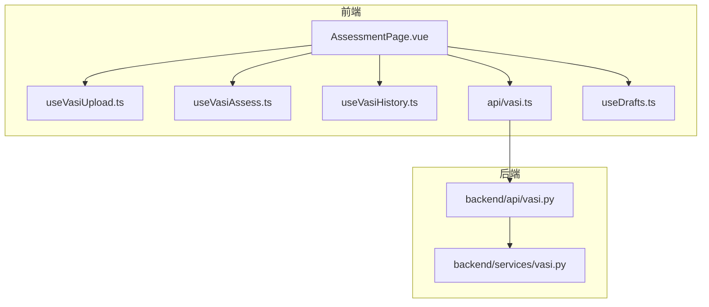
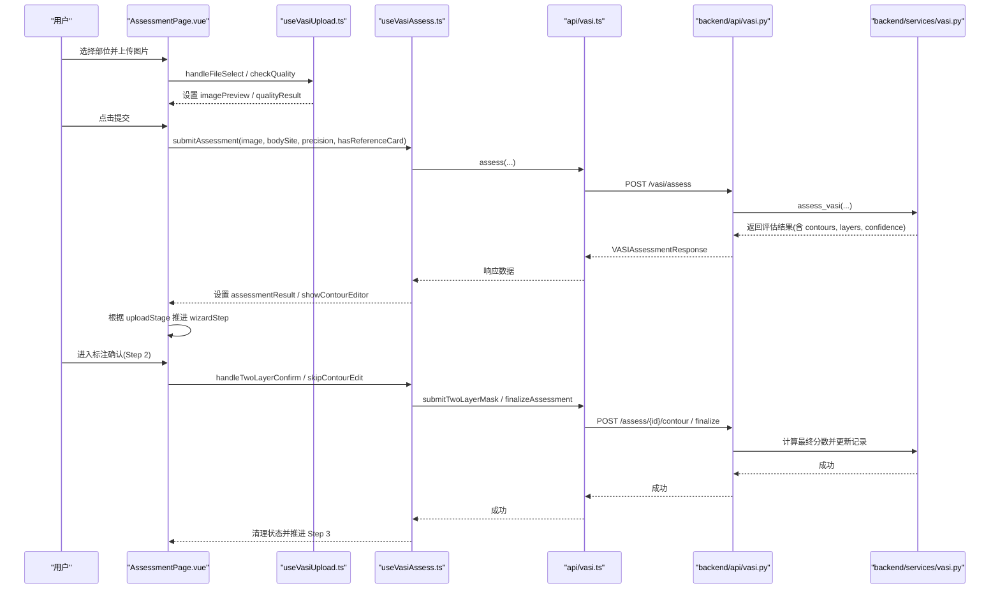
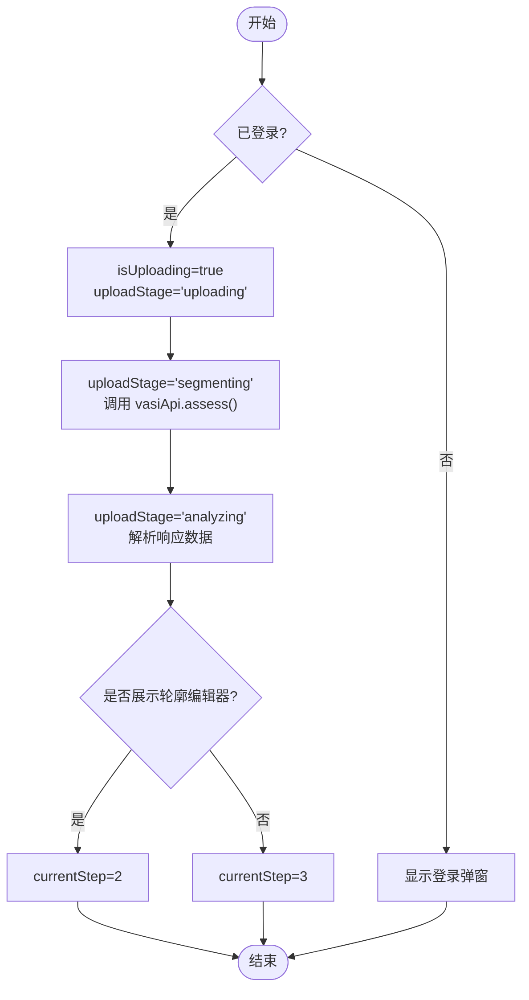
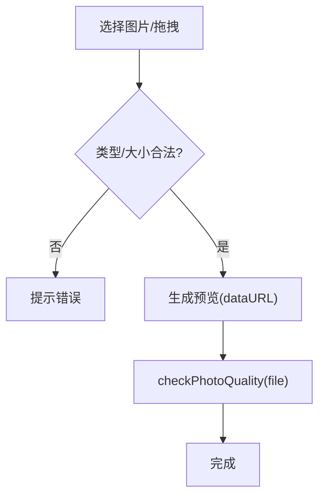
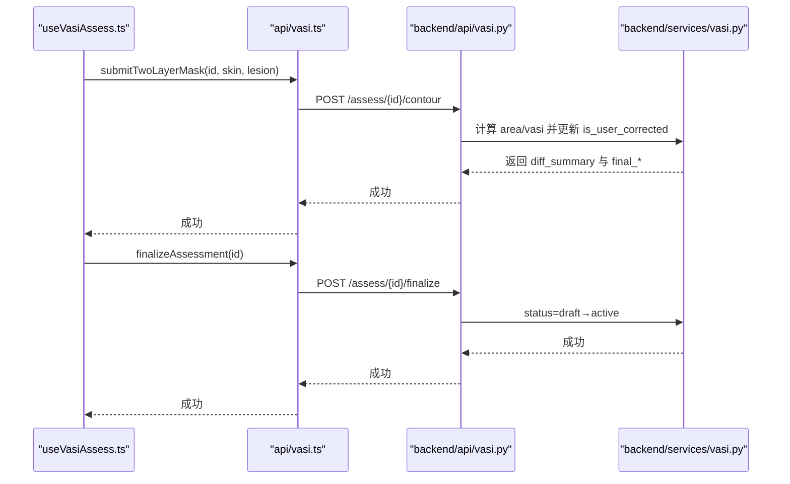
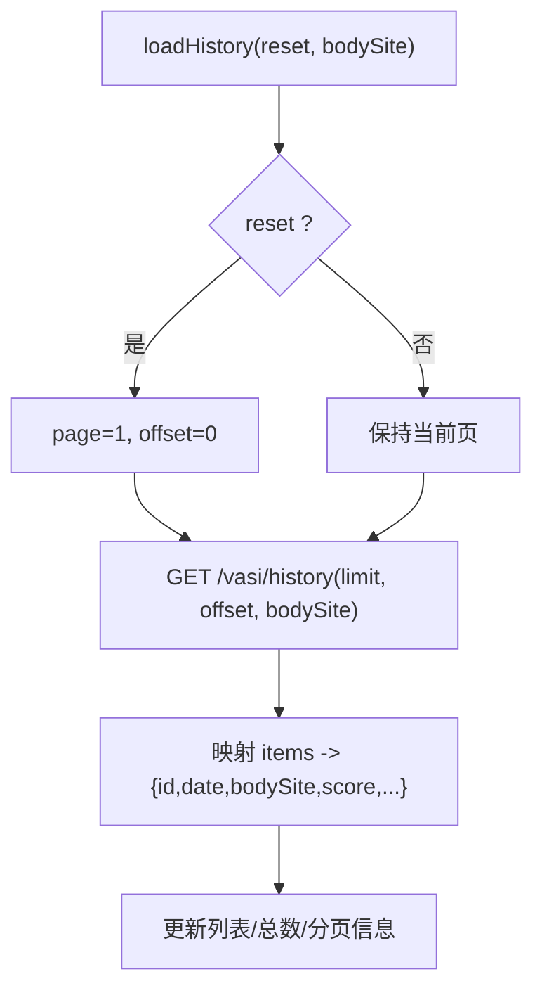
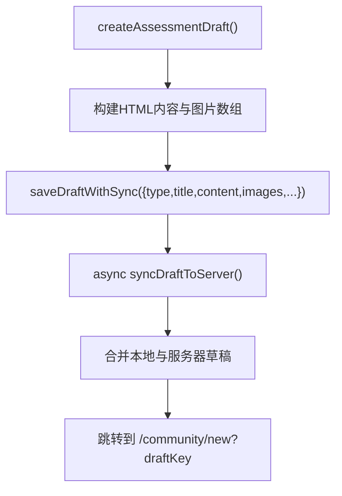
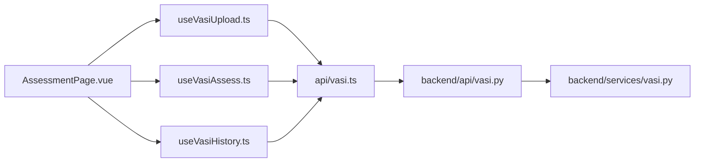
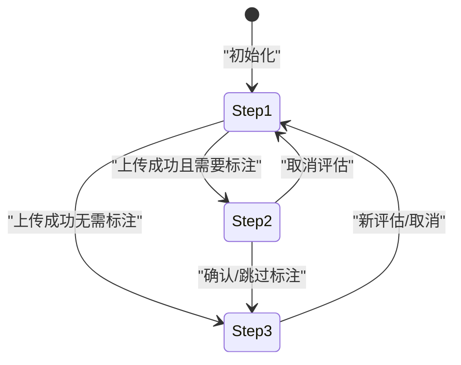
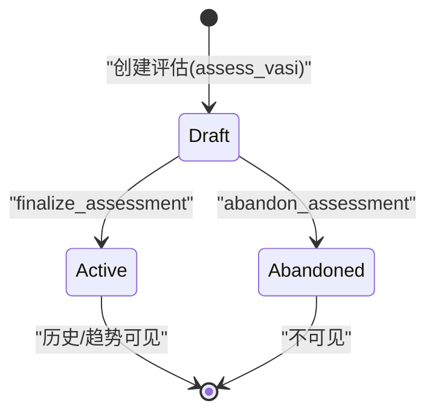

# 状态管理与流程控制

<cite>
**本文引用的文件**   
- [web/app/src/composables/useVasiAssessment.ts](file://web/app/src/composables/useVasiAssessment.ts)
- [web/app/src/composables/useVasiUpload.ts](file://web/app/src/composables/useVasiUpload.ts)
- [web/app/src/composables/useVasiAssess.ts](file://web/app/src/composables/useVasiAssess.ts)
- [web/app/src/composables/useVasiHistory.ts](file://web/app/src/composables/useVasiHistory.ts)
- [web/app/src/api/vasi.ts](file://web/app/src/api/vasi.ts)
- [web/app/src/views/AssessmentPage.vue](file://web/app/src/views/AssessmentPage.vue)
- [web/backend/api/vasi.py](file://web/backend/api/vasi.py)
- [web/backend/services/vasi.py](file://web/backend/services/vasi.py)
- [web/app/src/composables/useDrafts.ts](file://web/app/src/composables/useDrafts.ts)
</cite>

## 目录
1. [引言](#引言)
2. [项目结构](#项目结构)
3. [核心组件](#核心组件)
4. [架构总览](#架构总览)
5. [详细组件分析](#详细组件分析)
6. [依赖关系分析](#依赖关系分析)
7. [性能与内存优化](#性能与内存优化)
8. [故障排查指南](#故障排查指南)
9. [结论](#结论)
10. [附录：状态转换图与流程图](#附录状态转换图与流程图)

## 引言
本文件聚焦 VASI 评估的完整生命周期管理，系统性阐述前端状态管理与后端持久化机制。重点覆盖：
- 步骤导航（currentStep）与上传阶段（uploadStage）的状态流转
- 从上传到分割、分析、确认的端到端流程
- 草稿保存、临时数据清理与内存优化策略
- 最佳实践、调试技巧与性能优化建议

## 项目结构
VASI 评估由“前端页面 + 组合式函数（composables）+ API 层”构成，后端通过 FastAPI 暴露接口并由服务层处理业务逻辑。关键文件职责如下：
- AssessmentPage.vue：三步骤向导编排与视图切换
- useVasiUpload.ts：照片选择、质量检查、预览与基础校验
- useVasiAssess.ts：提交评估、AI 分析状态、结果与轮廓编辑交互
- useVasiHistory.ts：历史分页、筛选、选择模式、滑动删除、批量操作
- api/vasi.ts：前端 API 封装（assess、contour、finalize、abandon、history、trend 等）
- backend/api/vasi.py：路由与请求校验、响应组装
- backend/services/vasi.py：评估服务（创建草稿、确认/放弃、历史与趋势、轮廓修正计算）
- useDrafts.ts：草稿本地与服务器同步（用于生成日记草稿）

**图表来源** 
- [web/app/src/views/AssessmentPage.vue:1-531](file://web/app/src/views/AssessmentPage.vue#L1-L531)
- [web/app/src/composables/useVasiUpload.ts:1-111](file://web/app/src/composables/useVasiUpload.ts#L1-L111)
- [web/app/src/composables/useVasiAssess.ts:1-186](file://web/app/src/composables/useVasiAssess.ts#L1-L186)
- [web/app/src/composables/useVasiHistory.ts:1-184](file://web/app/src/composables/useVasiHistory.ts#L1-L184)
- [web/app/src/api/vasi.ts:1-274](file://web/app/src/api/vasi.ts#L1-L274)
- [web/backend/api/vasi.py:1-800](file://web/backend/api/vasi.py#L1-L800)
- [web/backend/services/vasi.py:1-800](file://web/backend/services/vasi.py#L1-L800)

**章节来源**
- [web/app/src/views/AssessmentPage.vue:1-531](file://web/app/src/views/AssessmentPage.vue#L1-L531)
- [web/app/src/composables/useVasiUpload.ts:1-111](file://web/app/src/composables/useVasiUpload.ts#L1-L111)
- [web/app/src/composables/useVasiAssess.ts:1-186](file://web/app/src/composables/useVasiAssess.ts#L1-L186)
- [web/app/src/composables/useVasiHistory.ts:1-184](file://web/app/src/composables/useVasiHistory.ts#L1-L184)
- [web/app/src/api/vasi.ts:1-274](file://web/app/src/api/vasi.ts#L1-L274)
- [web/backend/api/vasi.py:1-800](file://web/backend/api/vasi.py#L1-L800)
- [web/backend/services/vasi.py:1-800](file://web/backend/services/vasi.py#L1-L800)

## 核心组件
- 步骤导航 currentStep
  - 使用 ref<number> 驱动三步向导：1=拍照评估，2=标注确认，3=评估结果
  - 在 AssessmentPage.vue 中根据 uploadStage 与编辑器就绪情况自动推进
- 上传阶段 uploadStage
  - 枚举值："uploading" | "segmenting" | "analyzing" | ""
  - 在 submitAssessment 中顺序更新，配合 UI 进度提示
- 评估结果与中间态
  - assessmentResult 保存当前评估记录（含 id、分数、部位、面积、分型、阶段、置信度等）
  - lastAssessment 保存最终确认后的结果快照
  - aiSkinLayerUrl / aiLesionLayerUrl 为 AI 生成的皮肤/白斑图层，用于合成标注图
- 历史与分页
  - recentAssessments/historyPage/historyPageSize/historyTotal/historyTotalPages
  - 支持按部位筛选、页码跳转、滑动删除、批量删除
- 草稿与持久化
  - createAssessmentDraft 将评估结果写入社区草稿（本地 localStorage + 可选服务端同步）
  - finalize/abandon 控制数据库中的草稿状态（draft → active 或 abandoned）

**章节来源**
- [web/app/src/composables/useVasiAssessment.ts:51-146](file://web/app/src/composables/useVasiAssessment.ts#L51-L146)
- [web/app/src/composables/useVasiAssess.ts:15-62](file://web/app/src/composables/useVasiAssess.ts#L15-L62)
- [web/app/src/composables/useVasiHistory.ts:13-46](file://web/app/src/composables/useVasiHistory.ts#L13-L46)
- [web/app/src/composables/useDrafts.ts:258-290](file://web/app/src/composables/useDrafts.ts#L258-L290)

## 架构总览
前端通过 AssessmentPage.vue 编排三步流程，调用 useVasiUpload/useVasiAssess/useVasiHistory 三个 composable 分别负责上传、评估与历史。API 层统一封装 vasiApi，后端路由接收请求并交由 VASIService 执行业务逻辑。

**图表来源** 
- [web/app/src/views/AssessmentPage.vue:67-106](file://web/app/src/views/AssessmentPage.vue#L67-L106)
- [web/app/src/composables/useVasiAssess.ts:63-104](file://web/app/src/composables/useVasiAssess.ts#L63-L104)
- [web/app/src/api/vasi.ts:122-134](file://web/app/src/api/vasi.ts#L122-L134)
- [web/backend/api/vasi.py:45-165](file://web/backend/api/vasi.py#L45-L165)
- [web/backend/services/vasi.py:159-243](file://web/backend/services/vasi.py#L159-L243)

## 详细组件分析

### 步骤导航与上传阶段（currentStep / uploadStage）
- currentStep
  - 初始值为 1；上传成功后若存在轮廓编辑器则进入 2，否则直接进入 3
  - 取消/跳过编辑时重置为 1
- uploadStage
  - 提交时依次设置为 uploading → segmenting → analyzing，完成后清空
  - 用于 UI 显示“上传中/分割中/分析中”等状态

**图表来源** 
- [web/app/src/composables/useVasiAssess.ts:63-104](file://web/app/src/composables/useVasiAssess.ts#L63-L104)
- [web/app/src/views/AssessmentPage.vue:94-106](file://web/app/src/views/AssessmentPage.vue#L94-L106)

**章节来源**
- [web/app/src/composables/useVasiAssess.ts:19-22](file://web/app/src/composables/useVasiAssess.ts#L19-L22)
- [web/app/src/views/AssessmentPage.vue:94-106](file://web/app/src/views/AssessmentPage.vue#L94-L106)

### 上传与质量检查（useVasiUpload）
- 输入校验：类型、大小限制（≤10MB）、必须选择部位
- 预览：FileReader 生成 data URL，避免 blob URL 失效问题
- 质量检查：调用 /vasi/check-photo-quality，返回模糊度、亮度、分辨率、皮肤占比与建议

**图表来源** 
- [web/app/src/composables/useVasiUpload.ts:48-85](file://web/app/src/composables/useVasiUpload.ts#L48-L85)
- [web/app/src/api/vasi.ts:184-191](file://web/app/src/api/vasi.ts#L184-L191)

**章节来源**
- [web/app/src/composables/useVasiUpload.ts:24-85](file://web/app/src/composables/useVasiUpload.ts#L24-L85)
- [web/app/src/api/vasi.ts:184-191](file://web/app/src/api/vasi.ts#L184-L191)

### 评估提交与结果处理（useVasiAssess）
- 提交评估：调用 vasiApi.assess，设置 uploadStage 与 assessmentResult
- 轮廓编辑：支持两层 mask（皮肤层/白斑层）或单图层 mask，计算差异与最终分数
- 确认/跳过：确认后 finalize，跳过则直接 finalize；失败时回退并提示

**图表来源** 
- [web/app/src/composables/useVasiAssess.ts:106-140](file://web/app/src/composables/useVasiAssess.ts#L106-L140)
- [web/app/src/api/vasi.ts:166-173](file://web/app/src/api/vasi.ts#L166-L173)
- [web/backend/api/vasi.py:544-737](file://web/backend/api/vasi.py#L544-L737)
- [web/backend/services/vasi.py:246-280](file://web/backend/services/vasi.py#L246-L280)

**章节来源**
- [web/app/src/composables/useVasiAssess.ts:63-149](file://web/app/src/composables/useVasiAssess.ts#L63-L149)
- [web/backend/api/vasi.py:544-737](file://web/backend/api/vasi.py#L544-L737)
- [web/backend/services/vasi.py:246-280](file://web/backend/services/vasi.py#L246-L280)

### 历史与分页（useVasiHistory）
- 加载历史：支持 reset/page/append 三种模式，默认 page 模式
- 筛选：按 body_site 过滤
- 选择模式：多选删除、滑动删除、批量删除
- 趋势：sparklineData 基于最近 7 条评分

**图表来源** 
- [web/app/src/composables/useVasiHistory.ts:48-77](file://web/app/src/composables/useVasiHistory.ts#L48-L77)
- [web/app/src/api/vasi.ts:136-141](file://web/app/src/api/vasi.ts#L136-L141)

**章节来源**
- [web/app/src/composables/useVasiHistory.ts:48-94](file://web/app/src/composables/useVasiHistory.ts#L48-L94)
- [web/app/src/api/vasi.ts:136-141](file://web/app/src/api/vasi.ts#L136-L141)

### 草稿与持久化（useDrafts）
- 本地草稿：localStorage 存储，带过期时间（30天）
- 服务器同步：登录后异步创建/更新私有帖子，合并去重
- 生成评估草稿：将评估结果转为 HTML 内容并附带图片，跳转到社区编辑器

**图表来源** 
- [web/app/src/composables/useDrafts.ts:258-290](file://web/app/src/composables/useDrafts.ts#L258-L290)
- [web/app/src/composables/useVasiAssessment.ts:561-592](file://web/app/src/composables/useVasiAssessment.ts#L561-L592)

**章节来源**
- [web/app/src/composables/useDrafts.ts:172-290](file://web/app/src/composables/useDrafts.ts#L172-L290)
- [web/app/src/composables/useVasiAssessment.ts:561-592](file://web/app/src/composables/useVasiAssessment.ts#L561-L592)

## 依赖关系分析
- 前端依赖链
  - AssessmentPage.vue → useVasiUpload/useVasiAssess/useVasiHistory → api/vasi.ts
  - useVasiAssessment.ts（旧版）被拆分为 useVasiUpload/useVasiAssess/useVasiHistory
- 后端依赖链
  - api/vasi.py → services/vasi.py（包含预处理、质量检测、分割、公式计算等）
- 数据流
  - 上传 → 质量检查 → 评估草稿(draft) → 轮廓修正 → 最终分数 → 确认(active)
  - 历史与趋势仅包含 active 状态的评估

**图表来源** 
- [web/app/src/views/AssessmentPage.vue:1-531](file://web/app/src/views/AssessmentPage.vue#L1-L531)
- [web/app/src/composables/useVasiUpload.ts:1-111](file://web/app/src/composables/useVasiUpload.ts#L1-L111)
- [web/app/src/composables/useVasiAssess.ts:1-186](file://web/app/src/composables/useVasiAssess.ts#L1-L186)
- [web/app/src/composables/useVasiHistory.ts:1-184](file://web/app/src/composables/useVasiHistory.ts#L1-L184)
- [web/app/src/api/vasi.ts:1-274](file://web/app/src/api/vasi.ts#L1-L274)
- [web/backend/api/vasi.py:1-800](file://web/backend/api/vasi.py#L1-L800)
- [web/backend/services/vasi.py:1-800](file://web/backend/services/vasi.py#L1-L800)

**章节来源**
- [web/app/src/views/AssessmentPage.vue:1-531](file://web/app/src/views/AssessmentPage.vue#L1-L531)
- [web/backend/api/vasi.py:1-800](file://web/backend/api/vasi.py#L1-L800)
- [web/backend/services/vasi.py:1-800](file://web/backend/services/vasi.py#L1-L800)

## 性能与内存优化
- 预览与缓存
  - 使用 FileReader 生成 data URL，避免 blob URL 失效导致重复读取
  - 对大图片进行尺寸限制（≤10MB），减少内存占用
- 网络与超时
  - assess 接口设置较长超时（180s），避免长耗时任务中断
  - promptable 相关接口设置合理超时（60s/15s）
- 状态清理
  - cleanupState 在确认/跳过/取消后清理中间态（图层、视觉特征、差异结果等）
  - removeImage 清除上传态与质量检查结果，释放内存
- 历史分页
  - 默认每页 10 条，支持 10/20/50/100 切换，避免一次性加载过多数据
- 草稿清理
  - 本地草稿过期时间 30 天，自动清理过期项
  - 服务器草稿与本地合并去重，避免重复条目

[本节为通用指导，不直接分析具体文件]

## 故障排查指南
- 常见问题
  - 未选择部位即上传：ensureBodySiteSelected 会提示并阻止
  - 图片格式/大小不符：handleFileSelect/handleDrop 会拦截并提示
  - 质量不合格：checkPhotoQuality 返回 suggestions，引导重新拍摄
  - 评估失败：toast.error 显示后端 detail 或默认消息
- 调试技巧
  - 观察 uploadStage 变化，定位卡点（uploading/segmenting/analyzing）
  - 查看 contourDiffResult 的差异指标（avg_point_distance、modified）
  - 检查 history 分页与筛选是否正确刷新
- 后端异常
  - 质量拒绝（overall=poor）：返回结构化建议，不产生临床分数
  - 权限/不存在：404/403 错误，检查 user_id 与资源归属

**章节来源**
- [web/app/src/composables/useVasiUpload.ts:31-37](file://web/app/src/composables/useVasiUpload.ts#L31-L37)
- [web/app/src/composables/useVasiAssess.ts:96-103](file://web/app/src/composables/useVasiAssess.ts#L96-L103)
- [web/backend/api/vasi.py:511-541](file://web/backend/api/vasi.py#L511-L541)
- [web/backend/services/vasi.py:627-629](file://web/backend/services/vasi.py#L627-L629)

## 结论
本方案通过清晰的前端状态机与后端持久化机制，实现了 VASI 评估的全链路管理。uploadStage 与 currentStep 协同驱动用户流程，草稿与确认机制确保数据一致性。结合质量检查、历史分页与内存清理策略，系统在可用性与性能之间取得平衡。后续可进一步优化：
- 引入更细粒度的错误边界与重试机制
- 增强离线草稿与冲突合并策略
- 扩展趋势分析与可视化能力

[本节为总结性内容，不直接分析具体文件]

## 附录：状态转换图与流程图

### 状态转换图（前端）

**图表来源** 
- [web/app/src/views/AssessmentPage.vue:94-106](file://web/app/src/views/AssessmentPage.vue#L94-L106)
- [web/app/src/composables/useVasiAssess.ts:142-158](file://web/app/src/composables/useVasiAssess.ts#L142-L158)

### 后端状态转换（草稿/确认/放弃）

**图表来源** 
- [web/backend/services/vasi.py:218-243](file://web/backend/services/vasi.py#L218-L243)
- [web/backend/services/vasi.py:246-280](file://web/backend/services/vasi.py#L246-L280)