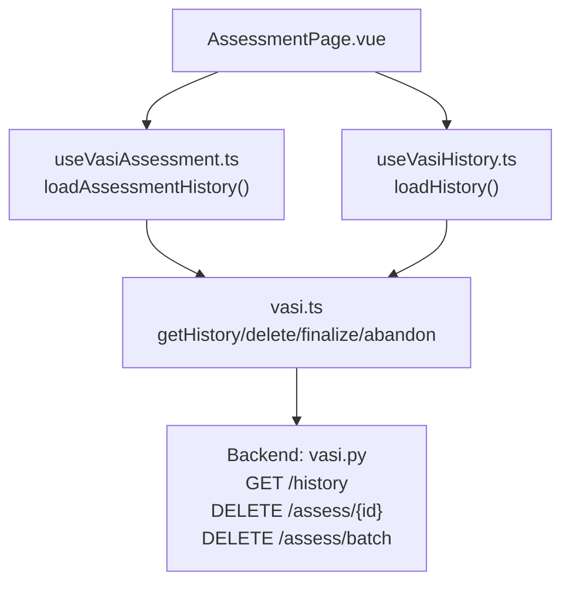
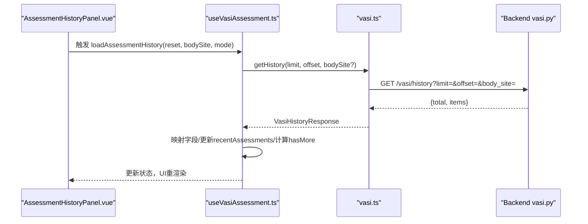
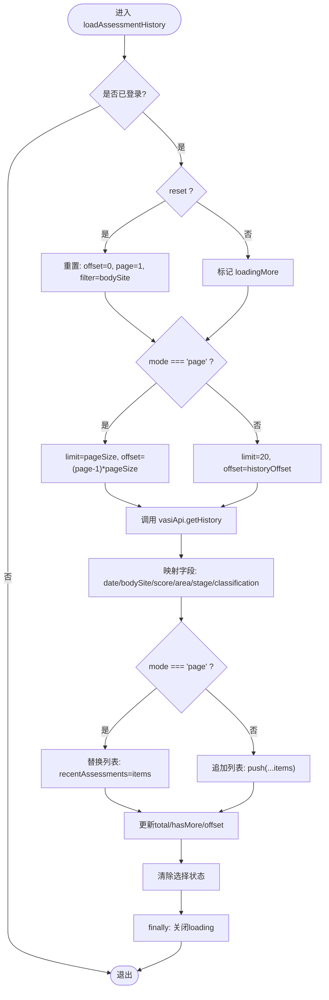
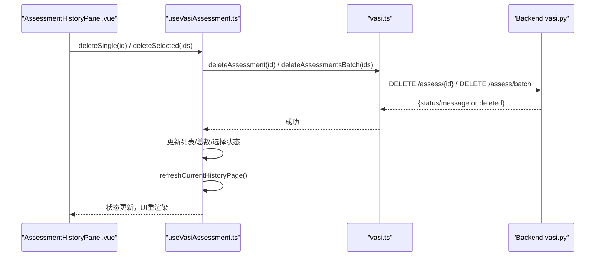
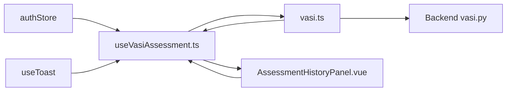

# 评估历史管理

<cite>
**本文引用的文件**
- [web/app/src/composables/useVasiAssessment.ts](file://web/app/src/composables/useVasiAssessment.ts)
- [web/app/src/composables/useVasiHistory.ts](file://web/app/src/composables/useVasiHistory.ts)
- [web/app/src/components/tracker/AssessmentHistoryPanel.vue](file://web/app/src/components/tracker/AssessmentHistoryPanel.vue)
- [web/app/src/api/vasi.ts](file://web/app/src/api/vasi.ts)
- [web/backend/api/vasi.py](file://web/backend/api/vasi.py)
</cite>

## 目录
1. [简介](#简介)
2. [项目结构](#项目结构)
3. [核心组件](#核心组件)
4. [架构总览](#架构总览)
5. [详细组件分析](#详细组件分析)
6. [依赖关系分析](#依赖关系分析)
7. [性能考虑](#性能考虑)
8. [故障排查指南](#故障排查指南)
9. [结论](#结论)
10. [附录：API调用示例与错误处理](#附录api调用示例与错误处理)

## 简介
本文件面向“评估历史管理”功能，聚焦前端 loadAssessmentHistory 函数的实现与使用，系统说明分页加载、筛选过滤、批量操作、历史记录数据结构、排序规则、显示格式、page-based 与 append-based 两种分页模式切换，以及单条删除、批量删除和刷新当前页等 CRUD 能力。同时提供完整的 API 调用示例、错误处理策略与用户体验优化建议，帮助读者快速理解并正确使用该模块。

## 项目结构
评估历史相关代码主要分布在以下位置：
- 前端逻辑（composable）：useVasiAssessment.ts、useVasiHistory.ts
- 前端展示（组件）：AssessmentHistoryPanel.vue
- 前端 API 封装：vasi.ts
- 后端接口：vasi.py（历史查询、删除、批量删除）

图表来源
- [web/app/src/composables/useVasiAssessment.ts:413-467](file://web/app/src/composables/useVasiAssessment.ts#L413-L467)
- [web/app/src/composables/useVasiHistory.ts:48-85](file://web/app/src/composables/useVasiHistory.ts#L48-L85)
- [web/app/src/api/vasi.ts:136-181](file://web/app/src/api/vasi.ts#L136-L181)
- [web/backend/api/vasi.py:204-256](file://web/backend/api/vasi.py#L204-L256)

章节来源
- [web/app/src/composables/useVasiAssessment.ts:120-146](file://web/app/src/composables/useVasiAssessment.ts#L120-L146)
- [web/app/src/components/tracker/AssessmentHistoryPanel.vue:10-42](file://web/app/src/components/tracker/AssessmentHistoryPanel.vue#L10-L42)
- [web/app/src/api/vasi.ts:69-86](file://web/app/src/api/vasi.ts#L69-L86)
- [web/backend/api/vasi.py:204-256](file://web/backend/api/vasi.py#L204-L256)

## 核心组件
- useVasiAssessment.ts：承载主流程的历史加载函数 loadAssessmentHistory，支持 page 与 append 两种模式；维护选择模式、滑动删除、分页状态与总数。
- useVasiHistory.ts：独立的历史 composable，封装了更简洁的 loadHistory、分页跳转、筛选与批量删除。
- AssessmentHistoryPanel.vue：历史列表 UI，包含多选、对比、删除、分页控件与滑动删除交互。
- vasi.ts：前端 API 封装，提供 getHistory、deleteAssessment、deleteAssessmentsBatch、finalizeAssessment、abandonAssessment 等方法。
- vasi.py：后端历史查询与删除接口，支持分页、部位筛选、日期范围筛选，限制最大 limit 为 50。

章节来源
- [web/app/src/composables/useVasiAssessment.ts:413-467](file://web/app/src/composables/useVasiAssessment.ts#L413-L467)
- [web/app/src/composables/useVasiHistory.ts:48-85](file://web/app/src/composables/useVasiHistory.ts#L48-L85)
- [web/app/src/components/tracker/AssessmentHistoryPanel.vue:47-209](file://web/app/src/components/tracker/AssessmentHistoryPanel.vue#L47-L209)
- [web/app/src/api/vasi.ts:136-181](file://web/app/src/api/vasi.ts#L136-L181)
- [web/backend/api/vasi.py:204-256](file://web/backend/api/vasi.py#L204-L256)

## 架构总览
前端通过 composable 调用 vasi.ts 的 API 方法，请求后端 /vasi/history 获取分页数据，并在本地维护 recentAssessments、historyPage、historyPageSize、historyTotal 等状态。UI 层通过 AssessmentHistoryPanel.vue 渲染列表、分页控件与批量操作按钮。删除操作通过 DELETE 接口完成，并在成功后刷新当前页面或追加列表。

图表来源
- [web/app/src/composables/useVasiAssessment.ts:413-467](file://web/app/src/composables/useVasiAssessment.ts#L413-L467)
- [web/app/src/api/vasi.ts:136-141](file://web/app/src/api/vasi.ts#L136-L141)
- [web/backend/api/vasi.py:204-256](file://web/backend/api/vasi.py#L204-L256)

## 详细组件分析

### loadAssessmentHistory 函数详解
- 职责：统一历史加载入口，支持重置与追加两种模式，内部根据 mode 决定分页参数计算方式。
- 关键状态：
  - historyPage、historyPageSize、historyTotal、historyHasMore、historyOffset
  - currentBodySiteFilter：用于按部位筛选
  - selectMode、selectedIds：多选与批量操作
  - loadingHistory、loadingMore：加载态控制
- 行为要点：
  - reset=true 时清空偏移与页码，设置筛选条件，进入首次加载
  - mode='page'：以 historyPageSize 为窗口大小，offset=(page-1)*pageSize
  - mode='append'：固定 limit=20，offset=historyOffset，采用追加模式
  - 响应后映射字段：date 取 assessment_date 的日期部分；分数优先使用 final_vasi_score，面积优先使用 final_area_percentage
  - 更新 total、hasMore、offset，并清理选择状态
  - 异常捕获仅记录日志，不阻断用户流程

图表来源
- [web/app/src/composables/useVasiAssessment.ts:413-467](file://web/app/src/composables/useVasiAssessment.ts#L413-L467)

章节来源
- [web/app/src/composables/useVasiAssessment.ts:413-467](file://web/app/src/composables/useVasiAssessment.ts#L413-L467)

### 分页机制：page-based 与 append-based
- page-based（推荐）：
  - 使用 historyPageSize 控制每页数量，historyPage 控制当前页
  - 适合需要精确翻页、统计总数的场景
  - 通过 goToHistoryPage、setHistoryPageSize 切换页与页大小
- append-based（兼容旧版）：
  - 固定 limit=20，通过 historyOffset 累加，适合“加载更多”
  - 通过 loadMoreHistory 触发追加
- 切换方式：
  - 在调用 loadAssessmentHistory 时传入 mode 参数
  - 不同页面可分别采用不同模式，例如 AssessmentPage 用 page，TrackerPage 用 append

章节来源
- [web/app/src/composables/useVasiAssessment.ts:413-467](file://web/app/src/composables/useVasiAssessment.ts#L413-L467)
- [web/app/src/composables/useVasiAssessment.ts:469-490](file://web/app/src/composables/useVasiAssessment.ts#L469-L490)

### 筛选过滤
- 部位筛选：currentBodySiteFilter 作为 query 参数 body_site 传递到后端
- 日期范围筛选：后端接口支持 start_date、end_date，但前端当前未暴露对应 UI；如需扩展可在 composable 中增加日期参数并透传
- 筛选生效时机：reset=true 时更新筛选条件并重新加载第一页

章节来源
- [web/app/src/composables/useVasiAssessment.ts:413-420](file://web/app/src/composables/useVasiAssessment.ts#L413-L420)
- [web/backend/api/vasi.py:204-234](file://web/backend/api/vasi.py#L204-L234)

### 历史记录的数据结构与显示格式
- 数据结构（前端映射后）：
  - id、date（YYYY-MM-DD）、bodySite、vasiScore、areaPercentage、stage、classification
- 数据来源：
  - 后端返回 items 中的 assessment_date、body_site、final_vasi_score/vasi_score、final_area_percentage/area_percentage、stage、classification
- 显示格式：
  - 评分徽章：根据 stage 显示不同颜色（好转/稳定期 vs 扩散/进展期）
  - 元信息：部位名称（使用 PART_LABELS 映射）、日期、面积百分比、阶段标签
  - 滑动删除：非选择模式下支持左滑显示删除按钮
  - 分页控件：页大小选择器、上一页/下一页、总页数

章节来源
- [web/app/src/components/tracker/AssessmentHistoryPanel.vue:113-175](file://web/app/src/components/tracker/AssessmentHistoryPanel.vue#L113-L175)
- [web/app/src/components/tracker/AssessmentHistoryPanel.vue:179-207](file://web/app/src/components/tracker/AssessmentHistoryPanel.vue#L179-L207)
- [web/app/src/api/vasi.ts:69-86](file://web/app/src/api/vasi.ts#L69-L86)
- [web/backend/api/vasi.py:236-252](file://web/backend/api/vasi.py#L236-L252)

### 排序规则
- 后端服务层负责返回顺序（通常按时间倒序），前端不做额外排序
- 若需自定义排序，可在前端对 recentAssessments 进行排序后再渲染

章节来源
- [web/backend/api/vasi.py:226-252](file://web/backend/api/vasi.py#L226-L252)

### 批量操作与CRUD
- 单条删除：
  - 滑动删除或点击删除按钮触发 deleteSingle(id)
  - 调用 vasiApi.deleteAssessment(id)，成功后从列表移除并刷新当前页
- 批量删除：
  - 选择模式开启后勾选多条记录，点击删除触发 deleteSelected()
  - 调用 vasiApi.deleteAssessmentsBatch(ids)，成功后移除选中项并刷新当前页
- 刷新当前页：
  - refreshCurrentHistoryPage()：当当前页无数据且不在第一页时回退一页再加载
  - 删除后自动调用刷新，保证视图一致

图表来源
- [web/app/src/composables/useVasiAssessment.ts:516-557](file://web/app/src/composables/useVasiAssessment.ts#L516-L557)
- [web/app/src/api/vasi.ts:175-181](file://web/app/src/api/vasi.ts#L175-L181)
- [web/backend/api/vasi.py:487-508](file://web/backend/api/vasi.py#L487-L508)

章节来源
- [web/app/src/composables/useVasiAssessment.ts:516-557](file://web/app/src/composables/useVasiAssessment.ts#L516-L557)
- [web/app/src/api/vasi.ts:175-181](file://web/app/src/api/vasi.ts#L175-L181)
- [web/backend/api/vasi.py:487-508](file://web/backend/api/vasi.py#L487-L508)

## 依赖关系分析
- 前端 composable 依赖 authStore（登录态）、toast（提示）、vasiApi（网络请求）
- 组件依赖 composable 暴露的状态与方法，并通过事件回调触发操作
- 后端依赖数据库会话与 VASIService，提供历史查询与删除能力
- 类型定义集中在 vasi.ts，确保前后端数据结构一致性

图表来源
- [web/app/src/composables/useVasiAssessment.ts:1-11](file://web/app/src/composables/useVasiAssessment.ts#L1-L11)
- [web/app/src/components/tracker/AssessmentHistoryPanel.vue:1-42](file://web/app/src/components/tracker/AssessmentHistoryPanel.vue#L1-L42)
- [web/app/src/api/vasi.ts:122-181](file://web/app/src/api/vasi.ts#L122-L181)
- [web/backend/api/vasi.py:204-256](file://web/backend/api/vasi.py#L204-L256)

章节来源
- [web/app/src/composables/useVasiAssessment.ts:1-11](file://web/app/src/composables/useVasiAssessment.ts#L1-L11)
- [web/app/src/components/tracker/AssessmentHistoryPanel.vue:1-42](file://web/app/src/components/tracker/AssessmentHistoryPanel.vue#L1-L42)
- [web/app/src/api/vasi.ts:122-181](file://web/app/src/api/vasi.ts#L122-L181)
- [web/backend/api/vasi.py:204-256](file://web/backend/api/vasi.py#L204-L256)

## 性能考虑
- 分页大小限制：后端将 limit 上限设为 50，避免一次性返回过多数据
- 追加模式固定 limit=20，减少首屏与滚动加载的压力
- 字段映射仅在客户端进行，避免重复计算
- 建议在大数据量场景下启用 page-based 模式，配合合理的 pageSize（如 10/20/50）
- 滑动删除与选择模式应避免在大量条目上造成布局抖动

[本节为通用性能建议，不直接分析具体文件]

## 故障排查指南
- 加载失败：
  - 检查 authStore.isLoggedIn 是否为真
  - 查看控制台错误日志（console.error）
  - 确认后端 /vasi/history 是否正常返回
- 删除失败：
  - 检查权限与记录是否存在
  - 确认后端返回状态码与 detail 信息
- 分页异常：
  - 校验 historyTotalPages 计算是否正确
  - 检查 offset 与 limit 参数是否符合预期
- 筛选无效：
  - 确认 currentBodySiteFilter 是否正确传递
  - 后端是否支持对应 body_site 值

章节来源
- [web/app/src/composables/useVasiAssessment.ts:461-466](file://web/app/src/composables/useVasiAssessment.ts#L461-L466)
- [web/backend/api/vasi.py:254-256](file://web/backend/api/vasi.py#L254-L256)

## 结论
loadAssessmentHistory 提供了统一的历史加载入口，支持灵活的 page/append 分页模式与部位筛选，结合 AssessmentHistoryPanel 实现了良好的交互体验。通过 vasi.ts 与后端 vasi.py 的协作，完成了历史的读取与删除能力。建议在新页面优先使用 page-based 模式以获得更好的可控性与性能表现，同时在大数据量场景下合理设置 pageSize，并结合筛选与分页提升用户体验。

[本节为总结性内容，不直接分析具体文件]

## 附录：API调用示例与错误处理

### 历史查询
- 前端调用：
  - vasiApi.getHistory(limit, offset, bodySite?)
- 后端接口：
  - GET /api/vasi/history?limit=&offset=&body_site=&start_date=&end_date=
- 返回结构：
  - { total, items[] }
- 错误处理：
  - 服务端异常返回 500 与 detail
  - 前端捕获并记录日志

章节来源
- [web/app/src/api/vasi.ts:136-141](file://web/app/src/api/vasi.ts#L136-L141)
- [web/backend/api/vasi.py:204-256](file://web/backend/api/vasi.py#L204-L256)

### 单条删除
- 前端调用：
  - vasiApi.deleteAssessment(assessmentId)
- 后端接口：
  - DELETE /api/vasi/assess/{assessment_id}
- 返回结构：
  - { status, message }
- 错误处理：
  - 不存在或无权访问返回 404

章节来源
- [web/app/src/api/vasi.ts:175-177](file://web/app/src/api/vasi.ts#L175-L177)
- [web/backend/api/vasi.py:498-508](file://web/backend/api/vasi.py#L498-L508)

### 批量删除
- 前端调用：
  - vasiApi.deleteAssessmentsBatch(ids)
- 后端接口：
  - DELETE /api/vasi/assess/batch
- 请求体：
  - { ids: number[] }
- 返回结构：
  - { status, deleted }
- 错误处理：
  - 服务端异常返回 500 与 detail

章节来源
- [web/app/src/api/vasi.ts:179-181](file://web/app/src/api/vasi.ts#L179-L181)
- [web/backend/api/vasi.py:487-495](file://web/backend/api/vasi.py#L487-L495)

### 草稿处理（关联历史可见性）
- finalizeAssessment：将草稿转为活跃，出现在历史中
- abandonAssessment：放弃草稿，排除在历史之外
- 前端在提交轮廓或跳过编辑时调用 finalize，取消时调用 abandon

章节来源
- [web/app/src/api/vasi.ts:228-235](file://web/app/src/api/vasi.ts#L228-L235)
- [web/backend/api/vasi.py:167-201](file://web/backend/api/vasi.py#L167-L201)