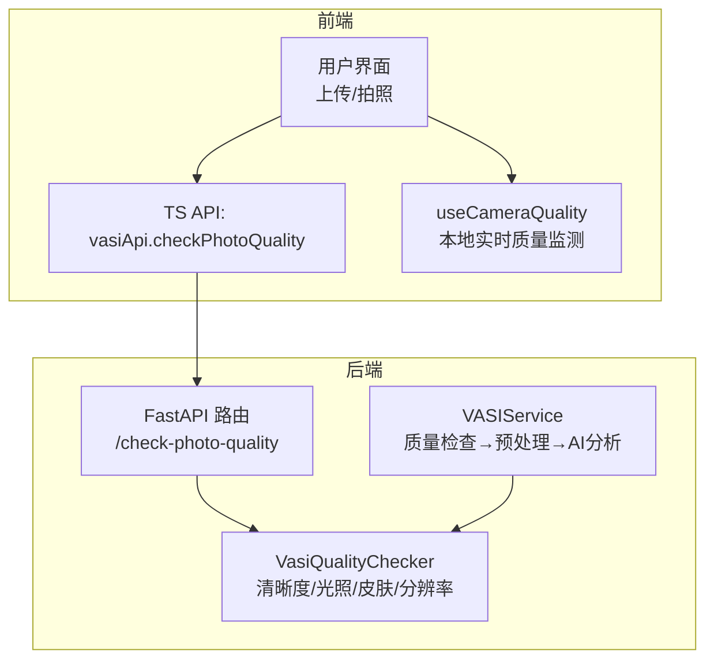
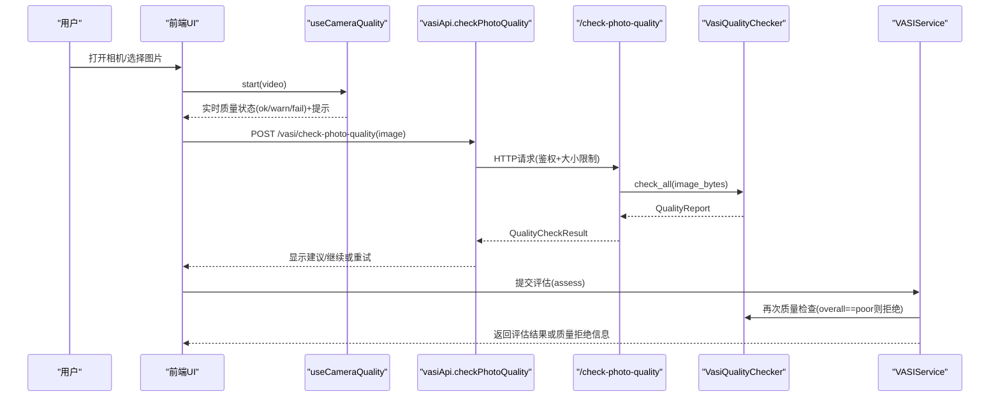
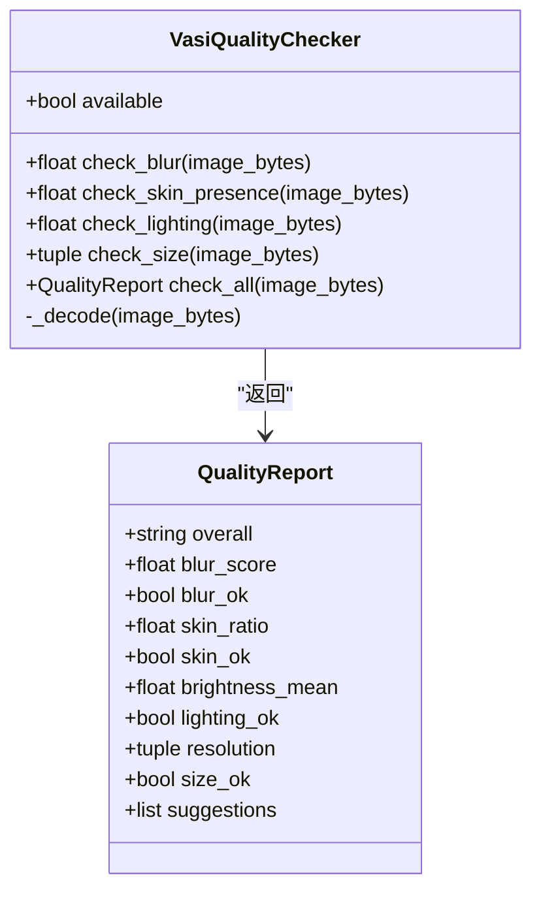
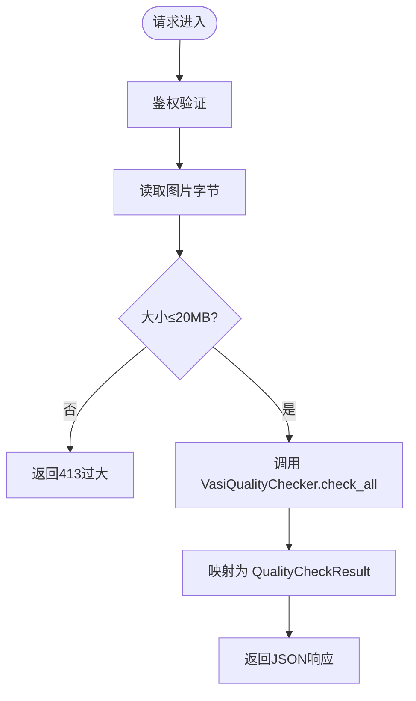
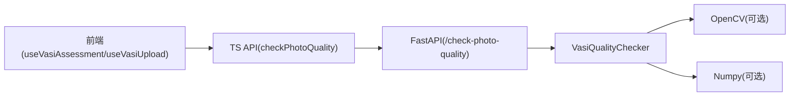

# 质量检查系统

<cite>
**本文引用的文件**   
- [web/backend/services/vasi_quality.py](file://web/backend/services/vasi_quality.py)
- [web/backend/api/vasi.py](file://web/backend/api/vasi.py)
- [web/app/src/api/vasi.ts](file://web/app/src/api/vasi.ts)
- [web/app/src/composables/useVasiAssessment.ts](file://web/app/src/composables/useVasiAssessment.ts)
- [web/app/src/composables/useVasiUpload.ts](file://web/app/src/composables/useVasiUpload.ts)
- [web/app/src/composables/useCameraQuality.ts](file://web/app/src/composables/useCameraQuality.ts)
- [web/backend/services/vasi.py](file://web/backend/services/vasi.py)
- [hermes_plan/2026-04-26-vasi-phase1-upgrade.md](file://hermes_plan/2026-04-26-vasi-phase1-upgrade.md)
</cite>

## 目录
1. [简介](#简介)
2. [项目结构](#项目结构)
3. [核心组件](#核心组件)
4. [架构总览](#架构总览)
5. [详细组件分析](#详细组件分析)
6. [依赖关系分析](#依赖关系分析)
7. [性能考量](#性能考量)
8. [故障排查指南](#故障排查指南)
9. [结论](#结论)
10. [附录：API调用示例与错误处理](#附录api调用示例与错误处理)

## 简介
本文件系统性地梳理并文档化“白斑评估（VASI）”流程中的照片质量检查子系统。重点包括：
- checkQuality 函数在后端与前端的具体实现、触发时机与参数传递
- QualityCheckResult 接口定义与质量评估标准（清晰度、光照、皮肤区域占比、分辨率等）
- 质量检查结果的处理逻辑（通过、警告、拒绝）及用户体验优化建议
- 配置项、自定义规则扩展点与最佳实践

该子系统在用户上传或拍摄照片时进行实时或近实时的质量校验，避免将低质量图片送入AI分析，从而提升整体准确率与用户体验。

## 项目结构
质量检查相关代码分布在后端服务、API层以及前端交互层：
- 后端服务：图像质量检测算法与报告生成
- API层：暴露 /check-photo-quality 接口，负责鉴权、大小限制与结果返回
- 前端：在上传/拍照后触发质量检查，并在相机预览阶段提供本地质量反馈

图表来源
- [web/backend/api/vasi.py:511-541](file://web/backend/api/vasi.py#L511-L541)
- [web/backend/services/vasi_quality.py:188-271](file://web/backend/services/vasi_quality.py#L188-L271)
- [web/app/src/api/vasi.ts:184-191](file://web/app/src/api/vasi.ts#L184-L191)
- [web/app/src/composables/useCameraQuality.ts:55-160](file://web/app/src/composables/useCameraQuality.ts#L55-L160)
- [web/backend/services/vasi.py:602-629](file://web/backend/services/vasi.py#L602-L629)

章节来源
- [web/backend/api/vasi.py:511-541](file://web/backend/api/vasi.py#L511-L541)
- [web/backend/services/vasi_quality.py:188-271](file://web/backend/services/vasi_quality.py#L188-L271)
- [web/app/src/api/vasi.ts:184-191](file://web/app/src/api/vasi.ts#L184-L191)
- [web/app/src/composables/useCameraQuality.ts:55-160](file://web/app/src/composables/useCameraQuality.ts#L55-L160)
- [web/backend/services/vasi.py:602-629](file://web/backend/services/vasi.py#L602-L629)

## 核心组件
- VasiQualityChecker（后端）：基于OpenCV/Numpy的图像质量检测器，输出结构化报告 QualityReport，包含清晰度、光照、皮肤占比、分辨率及中文建议。
- /check-photo-quality（后端API）：鉴权+大小限制+调用质量检查器，返回 QualityCheckResult 给前端。
- vasiApi.checkPhotoQuality（前端TS）：封装HTTP请求，调用后端质量检查接口。
- useVasiAssessment/useVasiUpload（前端组合式函数）：在用户选择图片后触发质量检查，展示结果与建议。
- useCameraQuality（前端本地检测）：在相机预览阶段计算模糊、反光、亮度、皮肤占比，给出即时提示。

章节来源
- [web/backend/services/vasi_quality.py:81-285](file://web/backend/services/vasi_quality.py#L81-L285)
- [web/backend/api/vasi.py:511-541](file://web/backend/api/vasi.py#L511-L541)
- [web/app/src/api/vasi.ts:109-120](file://web/app/src/api/vasi.ts#L109-L120)
- [web/app/src/api/vasi.ts:184-191](file://web/app/src/api/vasi.ts#L184-L191)
- [web/app/src/composables/useVasiAssessment.ts:196-207](file://web/app/src/composables/useVasiAssessment.ts#L196-L207)
- [web/app/src/composables/useVasiUpload.ts:75-85](file://web/app/src/composables/useVasiUpload.ts#L75-L85)
- [web/app/src/composables/useCameraQuality.ts:55-160](file://web/app/src/composables/useCameraQuality.ts#L55-L160)

## 架构总览
质量检查贯穿“上传前/拍摄中/提交前”三个阶段：
- 拍摄中：useCameraQuality 实时采样帧，计算拉普拉斯方差（模糊）、高光比例（反光）、平均亮度（过暗/过曝）、肤色占比，给出 ok/warn/fail 状态与提示文案。
- 上传后：前端调用 vasiApi.checkPhotoQuality，后端通过 /check-photo-quality 路由调用 VasiQualityChecker.check_all，返回 QualityCheckResult。
- 提交评估：VASIService._call_vasi_api 在执行AI分析前先做质量检查；若 overall=poor，直接拒绝并返回改进建议，不进入后续AI流程。

图表来源
- [web/app/src/composables/useCameraQuality.ts:55-160](file://web/app/src/composables/useCameraQuality.ts#L55-L160)
- [web/app/src/api/vasi.ts:184-191](file://web/app/src/api/vasi.ts#L184-L191)
- [web/backend/api/vasi.py:511-541](file://web/backend/api/vasi.py#L511-L541)
- [web/backend/services/vasi_quality.py:188-271](file://web/backend/services/vasi_quality.py#L188-L271)
- [web/backend/services/vasi.py:602-629](file://web/backend/services/vasi.py#L602-L629)

## 详细组件分析

### 后端质量检查器：VasiQualityChecker
- 功能维度
  - 清晰度：拉普拉斯方差，阈值 BLUR_THRESHOLD_ACCEPTABLE=100，BLUR_THRESHOLD_CLEAR=300
  - 光照：灰度均值，阈值 BRIGHTNESS_DARK_THRESHOLD=60，BRIGHTNESS_OVEREXPOSED_THRESHOLD=220
  - 皮肤区域占比：HSV+YCrCb双空间掩码并集，最小阈值 SKIN_RATIO_MIN=0.05
  - 分辨率：最小尺寸 MIN_WIDTH=640, MIN_HEIGHT=480
- 决策逻辑
  - 严重失败（critical_failures≥1）→ overall="poor"
  - 软失败数量≥2 → overall="acceptable"
  - 软失败数量=1 → overall="acceptable"
  - 无失败 → overall="good"
- 输出
  - QualityReport 包含各指标布尔值、分数、分辨率、中文建议列表

图表来源
- [web/backend/services/vasi_quality.py:81-285](file://web/backend/services/vasi_quality.py#L81-L285)

章节来源
- [web/backend/services/vasi_quality.py:39-62](file://web/backend/services/vasi_quality.py#L39-L62)
- [web/backend/services/vasi_quality.py:188-271](file://web/backend/services/vasi_quality.py#L188-L271)

### 后端API：/check-photo-quality
- 鉴权：仅认证用户可调用，防止滥用CPU/IO
- 大小限制：最大20MB，超限返回413
- 调用质量检查器：返回 QualityCheckResult 字段映射

图表来源
- [web/backend/api/vasi.py:511-541](file://web/backend/api/vasi.py#L511-L541)

章节来源
- [web/backend/api/vasi.py:511-541](file://web/backend/api/vasi.py#L511-L541)

### 前端API与类型：QualityCheckResult
- 接口定义：overall、blur_score、blur_ok、skin_ratio、skin_ok、brightness_mean、lighting_ok、resolution、size_ok、suggestions
- 调用方法：vasiApi.checkPhotoQuality(file)

章节来源
- [web/app/src/api/vasi.ts:109-120](file://web/app/src/api/vasi.ts#L109-L120)
- [web/app/src/api/vasi.ts:184-191](file://web/app/src/api/vasi.ts#L184-L191)

### 前端触发时机与处理逻辑
- 使用场景
  - useVasiAssessment.handleFileSelect：选择图片后调用 checkQuality(file)，展示建议
  - useVasiUpload.handleFileSelect：同上
- 处理策略
  - 若 overall=poor：建议用户重新拍摄或调整环境，不进入AI分析
  - 若 acceptable/good：允许继续提交评估

章节来源
- [web/app/src/composables/useVasiAssessment.ts:196-207](file://web/app/src/composables/useVasiAssessment.ts#L196-L207)
- [web/app/src/composables/useVasiUpload.ts:75-85](file://web/app/src/composables/useVasiUpload.ts#L75-L85)

### 相机实时质量监测：useCameraQuality
- 采样频率：约800ms一次，160×120降采样帧
- 指标计算
  - 模糊：拉普拉斯方差
  - 反光：饱和像素比例（≥250）
  - 亮度：平均灰度
  - 皮肤：YCrCb肤色范围
- 输出：ok/warn/fail 状态与提示文案

章节来源
- [web/app/src/composables/useCameraQuality.ts:55-160](file://web/app/src/composables/useCameraQuality.ts#L55-L160)

### 评估流程中的质量拦截：VASIService
- 在 _call_vasi_api 中先执行质量检查
- 若 overall=poor，直接返回质量拒绝响应，不进入AI流程

章节来源
- [web/backend/services/vasi.py:602-629](file://web/backend/services/vasi.py#L602-L629)

## 依赖关系分析
- 后端依赖
  - OpenCV（可选）：用于图像解码、颜色空间转换、拉普拉斯算子
  - Numpy（可选）：数组运算
  - 不可用时降级：返回 acceptable 并提示更新依赖
- 前端依赖
  - Canvas API：用于实时帧采样与像素级计算
  - Fetch/HTTP客户端：调用后端质量检查接口

图表来源
- [web/backend/services/vasi_quality.py:16-36](file://web/backend/services/vasi_quality.py#L16-L36)
- [web/backend/api/vasi.py:511-541](file://web/backend/api/vasi.py#L511-L541)
- [web/app/src/api/vasi.ts:184-191](file://web/app/src/api/vasi.ts#L184-L191)

章节来源
- [web/backend/services/vasi_quality.py:16-36](file://web/backend/services/vasi_quality.py#L16-L36)

## 性能考量
- 后端
  - 图像解码与矩阵运算集中在OpenCV/Numpy，建议在部署环境中安装 opencv-python-headless 与 numpy
  - 单例模式减少重复初始化开销
- 前端
  - 相机采样采用小尺寸帧与降采样，降低CPU占用
  - 异步请求避免阻塞UI

[本节为通用指导，不直接分析具体文件]

## 故障排查指南
- 常见错误
  - 图片过大：后端返回413，需压缩或更换设备
  - OpenCV/Numpy缺失：质量检查降级为 acceptable，提示更新依赖
  - 网络异常：前端捕获错误并提示重试
- 定位步骤
  - 查看后端日志：quality checker 失败会记录 warning
  - 前端控制台：检查 checkPhotoQuality 返回值与建议文案
  - 相机预览：确认 useCameraQuality 的状态变化是否符合预期

章节来源
- [web/backend/api/vasi.py:511-541](file://web/backend/api/vasi.py#L511-L541)
- [web/backend/services/vasi_quality.py:197-201](file://web/backend/services/vasi_quality.py#L197-L201)
- [web/app/src/composables/useVasiAssessment.ts:201-206](file://web/app/src/composables/useVasiAssessment.ts#L201-L206)

## 结论
质量检查系统通过前后端协同，实现了从拍摄到提交的端到端质量保障。其核心价值在于：
- 前置拦截低质量图片，节省AI资源并提升准确率
- 提供即时、易懂的用户反馈，改善体验
- 可扩展的规则体系，支持未来新增维度（如构图、对焦距离等）

[本节为总结性内容，不直接分析具体文件]

## 附录：API调用示例与错误处理

### 前端调用示例
- 调用质量检查接口
  - 方法：vasiApi.checkPhotoQuality(file)
  - 参数：File对象（图片）
  - 返回：QualityCheckResult 对象
- 典型用法
  - 在 handleFileSelect 中调用 checkQuality(file)
  - 根据 result.overall 决定下一步操作（继续/重试）

章节来源
- [web/app/src/api/vasi.ts:184-191](file://web/app/src/api/vasi.ts#L184-L191)
- [web/app/src/composables/useVasiAssessment.ts:196-207](file://web/app/src/composables/useVasiAssessment.ts#L196-L207)
- [web/app/src/composables/useVasiUpload.ts:75-85](file://web/app/src/composables/useVasiUpload.ts#L75-L85)

### 后端接口规范
- 路径：POST /vasi/check-photo-quality
- 鉴权：必需
- 请求体：multipart/form-data，字段 image（二进制）
- 响应：QualityCheckResult JSON
- 错误码：413（图片过大），其他HTTP异常由框架处理

章节来源
- [web/backend/api/vasi.py:511-541](file://web/backend/api/vasi.py#L511-L541)

### 质量评估标准与阈值
- 清晰度：拉普拉斯方差 ≥100 为合格，≥300 为优秀
- 光照：均值在60-220之间为合格
- 皮肤占比：≥5% 为合格
- 分辨率：≥640×480 为合格
- 综合判定：严重失败→poor；软失败≥2→acceptable；否则good

章节来源
- [web/backend/services/vasi_quality.py:39-62](file://web/backend/services/vasi_quality.py#L39-L62)
- [web/backend/services/vasi_quality.py:243-258](file://web/backend/services/vasi_quality.py#L243-L258)

### 用户体验优化建议
- 相机预览阶段提供即时反馈（模糊、过暗/过曝、反光、皮肤不足）
- 上传后明确展示改进建议，引导用户重拍
- 对 acceptable 图片允许继续，但提示注意事项
- 对 poor 图片阻止提交，并提供一键重拍入口

章节来源
- [web/app/src/composables/useCameraQuality.ts:140-157](file://web/app/src/composables/useCameraQuality.ts#L140-L157)
- [web/backend/services/vasi_quality.py:219-241](file://web/backend/services/vasi_quality.py#L219-L241)

### 历史参考：早期质量检查设计
- 早期方案包含更详细的评分与问题分类，可作为未来扩展参考

章节来源
- [hermes_plan/2026-04-26-vasi-phase1-upgrade.md:289-571](file://hermes_plan/2026-04-26-vasi-phase1-upgrade.md#L289-L571)