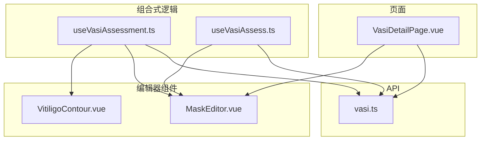
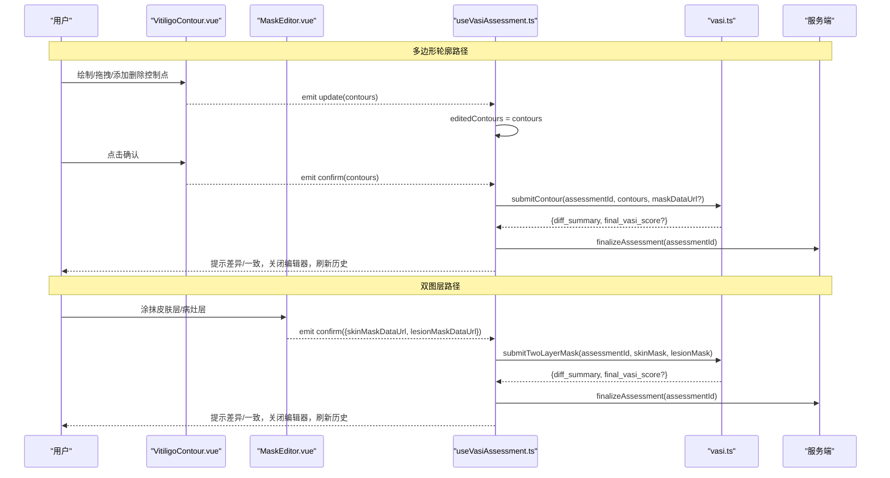
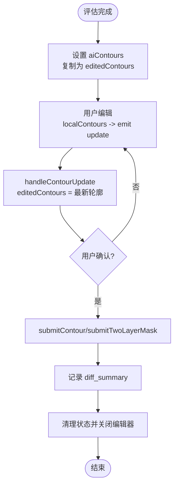
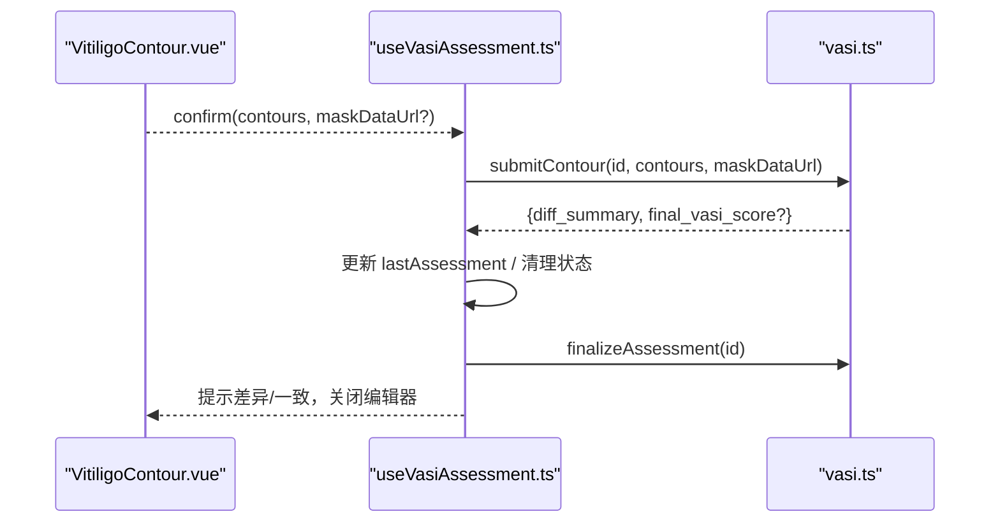
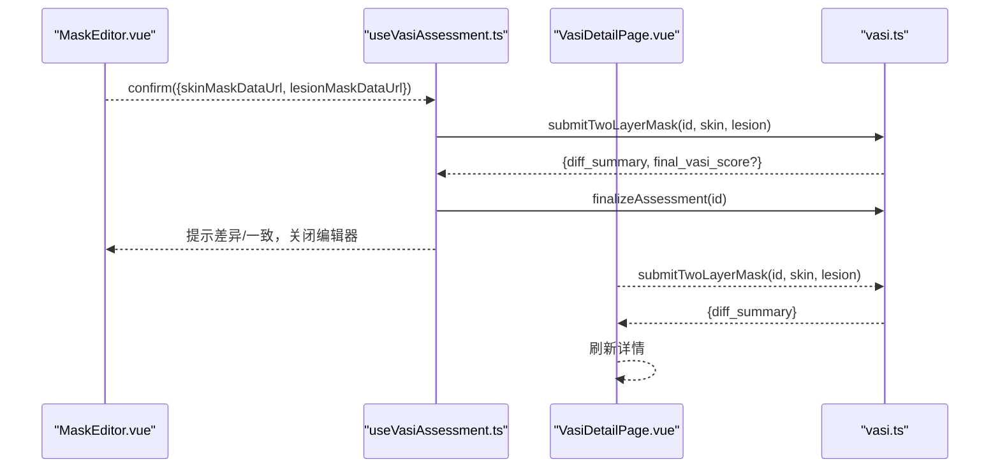
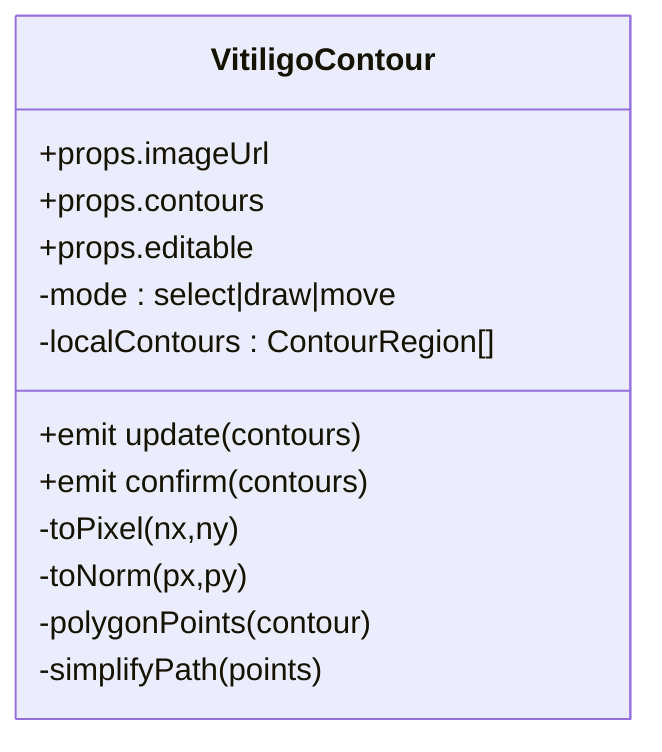
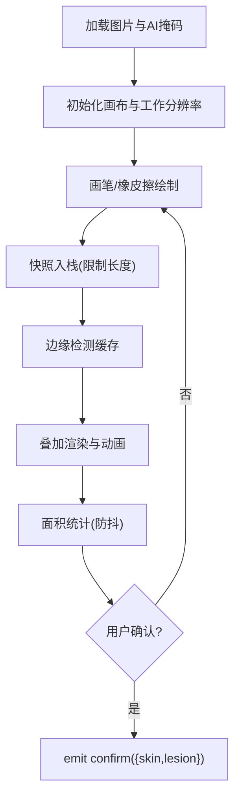
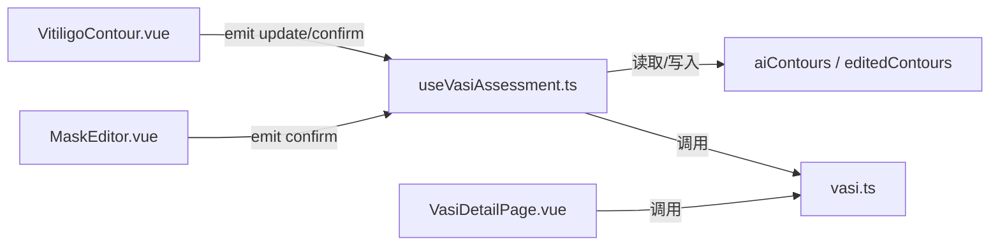

# 轮廓编辑器管理

<cite>
**本文引用的文件**
- [useVasiAssessment.ts](file://web/app/src/composables/useVasiAssessment.ts)
- [useVasiAssess.ts](file://web/app/src/composables/useVasiAssess.ts)
- [VitiligoContour.vue](file://web/app/src/components/tracker/VitiligoContour.vue)
- [MaskEditor.vue](file://web/app/src/components/tracker/MaskEditor.vue)
- [vasi.ts](file://web/app/src/api/vasi.ts)
- [VasiDetailPage.vue](file://web/app/src/views/VasiDetailPage.vue)
</cite>

## 目录
1. [简介](#简介)
2. [项目结构](#项目结构)
3. [核心组件与状态](#核心组件与状态)
4. [架构总览](#架构总览)
5. [详细组件分析](#详细组件分析)
6. [依赖关系分析](#依赖关系分析)
7. [性能考量](#性能考量)
8. [故障排查指南](#故障排查指南)
9. [结论](#结论)

## 简介
本文件围绕“轮廓编辑器”的完整生命周期，系统梳理前端在白斑评估中的轮廓编辑、图层标注、提交确认、差异计算与结果回写等关键流程。重点说明：
- aiContours 与 editedContours 的职责与同步机制
- handleContourConfirm 与 handleTwoLayerConfirm 的实现要点
- 单图层（多边形轮廓）与双图层（皮肤层+病灶层）两种确认路径
- 用户交互流程、数据校验规则与错误处理策略
- 最佳实践与可优化点

## 项目结构
与轮廓编辑器相关的代码主要分布在以下位置：
- 组合式逻辑：composables/useVasiAssessment.ts、composables/useVasiAssess.ts
- 视图与页面：views/VasiDetailPage.vue
- 编辑器组件：components/tracker/VitiligoContour.vue（多边形轮廓）、components/tracker/MaskEditor.vue（像素级图层）
- API 接口封装：api/vasi.ts

图表来源
- [useVasiAssessment.ts:51-100](file://web/app/src/composables/useVasiAssessment.ts#L51-L100)
- [useVasiAssess.ts:15-62](file://web/app/src/composables/useVasiAssess.ts#L15-L62)
- [VasiDetailPage.vue:1-25](file://web/app/src/views/VasiDetailPage.vue#L1-L25)
- [vasi.ts:122-173](file://web/app/src/api/vasi.ts#L122-L173)

章节来源
- [useVasiAssessment.ts:51-100](file://web/app/src/composables/useVasiAssessment.ts#L51-L100)
- [useVasiAssess.ts:15-62](file://web/app/src/composables/useVasiAssess.ts#L15-L62)
- [VasiDetailPage.vue:1-25](file://web/app/src/views/VasiDetailPage.vue#L1-L25)
- [vasi.ts:122-173](file://web/app/src/api/vasi.ts#L122-L173)

## 核心组件与状态
- aiContours：AI 初始识别的多边形轮廓集合，作为编辑起点，不可直接修改。
- editedContours：用户编辑后的轮廓副本，用于交互与提交；每次更新时由父级 composable 接收并保存。
- showContourEditor：控制是否显示轮廓编辑器。
- isSubmittingContour：提交中标志，防止重复提交。
- contourDiffResult：后端返回的差异摘要（是否修改、平均点距离等）。
- aiSkinLayerUrl / aiLesionLayerUrl：AI 提供的皮肤层与病灶层掩码预览图，供 MaskEditor 预加载。
- assessmentResult：当前评估会话上下文（含 id、部位、评分等），贯穿提交流程。

章节来源
- [useVasiAssessment.ts:87-95](file://web/app/src/composables/useVasiAssessment.ts#L87-L95)
- [useVasiAssess.ts:47-62](file://web/app/src/composables/useVasiAssess.ts#L47-L62)

## 架构总览
整体流程分为两条主线：
- 多边形轮廓线：用户在 VitiligoContour 上绘制/调整控制点，确认后调用 handleContourConfirm。
- 像素级图层：用户在 MaskEditor 上涂抹皮肤层/病灶层，确认后调用 handleTwoLayerConfirm。

图表来源
- [VitiligoContour.vue:222-228](file://web/app/src/components/tracker/VitiligoContour.vue#L222-L228)
- [useVasiAssessment.ts:314-368](file://web/app/src/composables/useVasiAssessment.ts#L314-L368)
- [vasi.ts:155-173](file://web/app/src/api/vasi.ts#L155-L173)

## 详细组件分析

### 轮廓编辑状态管理：aiContours vs editedContours
- 初始化阶段：
  - 提交评估后，后端返回 AI 轮廓 aiContours。
  - 将 aiContours 深拷贝一份到 editedContours，作为用户编辑的工作副本。
- 编辑阶段：
  - VitiligoContour 内部维护本地 localContours，通过 emit('update') 上报给父级。
  - useVasiAssessment.handleContourUpdate 将 editedContours 替换为用户最新编辑结果。
- 提交阶段：
  - 用户确认后，使用 editedContours 提交至后端。
  - 提交成功后清理状态，重置 aiContours 与 editedContours。

图表来源
- [useVasiAssessment.ts:242-251](file://web/app/src/composables/useVasiAssessment.ts#L242-L251)
- [useVasiAssessment.ts:370-372](file://web/app/src/composables/useVasiAssessment.ts#L370-L372)
- [useVasiAssessment.ts:343-368](file://web/app/src/composables/useVasiAssessment.ts#L343-L368)

章节来源
- [useVasiAssessment.ts:242-251](file://web/app/src/composables/useVasiAssessment.ts#L242-L251)
- [useVasiAssessment.ts:370-372](file://web/app/src/composables/useVasiAssessment.ts#L370-L372)
- [useVasiAssessment.ts:343-368](file://web/app/src/composables/useVasiAssessment.ts#L343-L368)

### 多边形轮廓确认：handleContourConfirm
- 输入：用户编辑后的 ContourRegion[]，可选 maskDataUrl（当使用 MaskEditor 生成掩码时附带）。
- 行为：
  - 调用 vasiApi.submitContour 提交轮廓与可选掩码。
  - 记录 diff_summary，根据 modified 字段提示差异或一致。
  - 若返回 final_vasi_score，则更新 lastAssessment。
  - 关闭编辑器、清空临时状态、finalize 评估并刷新历史。
- 错误处理：捕获网络/业务异常，统一 toast 提示。

图表来源
- [useVasiAssessment.ts:343-368](file://web/app/src/composables/useVasiAssessment.ts#L343-L368)
- [vasi.ts:155-164](file://web/app/src/api/vasi.ts#L155-L164)

章节来源
- [useVasiAssessment.ts:343-368](file://web/app/src/composables/useVasiAssessment.ts#L343-L368)
- [vasi.ts:155-164](file://web/app/src/api/vasi.ts#L155-L164)

### 双图层确认：handleTwoLayerConfirm
- 输入：皮肤层掩码 data URL 与病灶层掩码 data URL。
- 行为：
  - 调用 vasiApi.submitTwoLayerMask 提交两层掩码。
  - 记录 diff_summary，提示差异或一致。
  - 若返回 final_vasi_score，则更新 lastAssessment。
  - 关闭编辑器、清理状态、finalize 评估并刷新历史。
- 在详情页（VasiDetailPage）也提供独立实现，用于对已有评估进行二次修正。

图表来源
- [useVasiAssessment.ts:314-341](file://web/app/src/composables/useVasiAssessment.ts#L314-L341)
- [VasiDetailPage.vue:38-59](file://web/app/src/views/VasiDetailPage.vue#L38-L59)
- [vasi.ts:166-173](file://web/app/src/api/vasi.ts#L166-L173)

章节来源
- [useVasiAssessment.ts:314-341](file://web/app/src/composables/useVasiAssessment.ts#L314-L341)
- [VasiDetailPage.vue:38-59](file://web/app/src/views/VasiDetailPage.vue#L38-L59)
- [vasi.ts:166-173](file://web/app/src/api/vasi.ts#L166-L173)

### 多边形轮廓编辑器：VitiligoContour.vue
- 能力：
  - 支持选择、绘制、移动三种模式。
  - 支持添加/删除控制点、删除区域。
  - 实时渲染 SVG 叠加层，显示轮廓面积百分比汇总。
- 交互：
  - 通过 emit('update') 上报 localContours。
  - 通过 emit('confirm') 提交最终轮廓。
- 数据：
  - 内部维护 localContours，避免直接修改 props.contours。
  - 坐标归一化到 [0,1] 区间，适配不同尺寸图片。

图表来源
- [VitiligoContour.vue:5-14](file://web/app/src/components/tracker/VitiligoContour.vue#L5-L14)
- [VitiligoContour.vue:21-33](file://web/app/src/components/tracker/VitiligoContour.vue#L21-L33)
- [VitiligoContour.vue:154-168](file://web/app/src/components/tracker/VitiligoContour.vue#L154-L168)
- [VitiligoContour.vue:222-228](file://web/app/src/components/tracker/VitiligoContour.vue#L222-L228)

章节来源
- [VitiligoContour.vue:5-14](file://web/app/src/components/tracker/VitiligoContour.vue#L5-L14)
- [VitiligoContour.vue:21-33](file://web/app/src/components/tracker/VitiligoContour.vue#L21-L33)
- [VitiligoContour.vue:154-168](file://web/app/src/components/tracker/VitiligoContour.vue#L154-L168)
- [VitiligoContour.vue:222-228](file://web/app/src/components/tracker/VitiligoContour.vue#L222-L228)

### 像素级图层编辑器：MaskEditor.vue
- 能力：
  - 双图层（皮肤层/病灶层）画笔与橡皮擦。
  - 缩放、平移、多点触控（捏合缩放、双指平移）。
  - 撤销/重做历史（shallowRef 存储 ImageData，避免深度响应开销）。
  - 边缘检测与 marching ants 动画轮廓（离屏缓冲优化）。
  - 面积统计（皮肤区、病灶区、联合区域占比）。
- 交互：
  - 通过 emit('confirm') 返回两个 data URL 掩码。
  - 支持从 initialSkinLayerUrl / initialLesionLayerUrl 预加载 AI 掩码。
- 性能：
  - 工作分辨率上限 MAX_CANVAS_DIM=1024，降低内存与 CPU。
  - 动画帧率限制约 12fps，减少主线程压力。
  - 面积计算防抖，避免快速绘制阻塞。

图表来源
- [MaskEditor.vue:58-65](file://web/app/src/components/tracker/MaskEditor.vue#L58-L65)
- [MaskEditor.vue:95-103](file://web/app/src/components/tracker/MaskEditor.vue#L95-L103)
- [MaskEditor.vue:165-182](file://web/app/src/components/tracker/MaskEditor.vue#L165-L182)
- [MaskEditor.vue:361-467](file://web/app/src/components/tracker/MaskEditor.vue#L361-L467)
- [MaskEditor.vue:547-565](file://web/app/src/components/tracker/MaskEditor.vue#L547-L565)
- [MaskEditor.vue:618-715](file://web/app/src/components/tracker/MaskEditor.vue#L618-L715)

章节来源
- [MaskEditor.vue:58-65](file://web/app/src/components/tracker/MaskEditor.vue#L58-L65)
- [MaskEditor.vue:95-103](file://web/app/src/components/tracker/MaskEditor.vue#L95-L103)
- [MaskEditor.vue:165-182](file://web/app/src/components/tracker/MaskEditor.vue#L165-L182)
- [MaskEditor.vue:361-467](file://web/app/src/components/tracker/MaskEditor.vue#L361-L467)
- [MaskEditor.vue:547-565](file://web/app/src/components/tracker/MaskEditor.vue#L547-L565)
- [MaskEditor.vue:618-715](file://web/app/src/components/tracker/MaskEditor.vue#L618-L715)

### 页面集成：VasiDetailPage.vue
- 功能：查看评估详情，支持进入编辑模式，基于 MaskEditor 对已有评估进行二次修正。
- 提交流程：
  - 调用 vasiApi.submitTwoLayerMask 提交修正后的双层掩码。
  - 根据 diff_summary 提示差异或一致。
  - 刷新详情以展示最终评分与面积。

章节来源
- [VasiDetailPage.vue:38-59](file://web/app/src/views/VasiDetailPage.vue#L38-L59)
- [VasiDetailPage.vue:1-25](file://web/app/src/views/VasiDetailPage.vue#L1-L25)

## 依赖关系分析
- 组件耦合：
  - VitiligoContour 与 useVasiAssessment 通过事件解耦，仅依赖 ContourRegion 类型。
  - MaskEditor 与 useVasiAssessment 通过事件解耦，仅依赖 data URL 字符串。
- API 契约：
  - submitContour：提交多边形轮廓与可选掩码。
  - submitTwoLayerMask：提交皮肤层与病灶层掩码。
  - finalizeAssessment：标记评估完成。
- 状态流向：
  - 评估结果 → aiContours/aiSkinLayerUrl/aiLesionLayerUrl
  - 用户编辑 → editedContours/掩码 data URL
  - 提交 → diff_summary → 更新 lastAssessment → 清理状态

图表来源
- [useVasiAssessment.ts:87-95](file://web/app/src/composables/useVasiAssessment.ts#L87-L95)
- [vasi.ts:155-173](file://web/app/src/api/vasi.ts#L155-L173)
- [VitiligoContour.vue:222-228](file://web/app/src/components/tracker/VitiligoContour.vue#L222-L228)
- [MaskEditor.vue:12-15](file://web/app/src/components/tracker/MaskEditor.vue#L12-L15)

章节来源
- [useVasiAssessment.ts:87-95](file://web/app/src/composables/useVasiAssessment.ts#L87-L95)
- [vasi.ts:155-173](file://web/app/src/api/vasi.ts#L155-L173)
- [VitiligoContour.vue:222-228](file://web/app/src/components/tracker/VitiligoContour.vue#L222-L228)
- [MaskEditor.vue:12-15](file://web/app/src/components/tracker/MaskEditor.vue#L12-L15)

## 性能考量
- 图像与画布：
  - 工作分辨率上限 1024px，显著降低内存占用与像素操作成本。
  - 使用 willReadFrequently 的 context 仅在需要读取像素时使用，其余场景使用写优化 context。
- 动画与渲染：
  - 边缘轮廓采用离屏缓冲与两相交替绘制，将每帧数千次 fillRect 降为少量 drawImage。
  - 动画帧率限制约 12fps，兼顾流畅性与能耗。
- 计算与交互：
  - 面积统计防抖，避免快速绘制导致主线程阻塞。
  - 撤销/重做使用 shallowRef 存储 ImageData，避免深度响应开销。
- 建议：
  - 在大图上优先使用 MaskEditor 的双图层方式，减少复杂多边形点数带来的渲染压力。
  - 合理设置 brushSize 与 layerOpacity，提升标注效率与视觉反馈。

[本节为通用性能讨论，不直接分析具体文件]

## 故障排查指南
- 常见问题与定位：
  - 提交失败：检查 isSubmittingContour 是否被正确释放；查看 toast 错误信息；确认 assessmentResult.id 有效。
  - 无差异提示：确认后端返回 diff_summary.modified 字段；检查 avg_point_distance 是否为空。
  - 编辑器未关闭：确认 finalizeAssessment 调用成功；检查状态清理函数是否正确执行。
  - 图片加载失败：检查 MaskEditor onImgError 分支；确认 initialSkinLayerUrl/initialLesionLayerUrl 是否有效。
- 日志与调试：
  - 关注控制台错误输出（如 MaskEditor onImgLoad 失败）。
  - 在 handleContourConfirm/handleTwoLayerConfirm 中打印 diff_summary 以便对比前后结果。
- 恢复策略：
  - 取消评估时调用 abandonAssessment，避免遗留草稿污染历史记录。
  - 精确分析前主动放弃旧草稿，避免重复创建。

章节来源
- [useVasiAssessment.ts:280-312](file://web/app/src/composables/useVasiAssessment.ts#L280-L312)
- [useVasiAssessment.ts:390-404](file://web/app/src/composables/useVasiAssessment.ts#L390-L404)
- [MaskEditor.vue:717-722](file://web/app/src/components/tracker/MaskEditor.vue#L717-L722)

## 结论
本方案通过“多边形轮廓”和“像素级图层”两条互补路径，实现了灵活、高效且可追溯的白斑轮廓编辑与确认流程。核心要点包括：
- 明确区分 aiContours（只读参考）与 editedContours（可编辑工作副本），确保数据一致性。
- 统一的提交流程：提交 → 差异计算 → 用户反馈 → 收尾（finalize 与状态清理）。
- 高性能的 MaskEditor 实现，保障移动端与大图的流畅体验。
- 完善的错误处理与用户体验提示，提升可用性。

在实际使用中，建议：
- 对于简单边界清晰的情况，优先使用多边形轮廓编辑器。
- 对于复杂边界或需要精细控制的情况，使用 MaskEditor 的双图层方式。
- 充分利用 diff_summary 反馈，帮助用户理解标注与 AI 的差异，持续改进模型准确性。