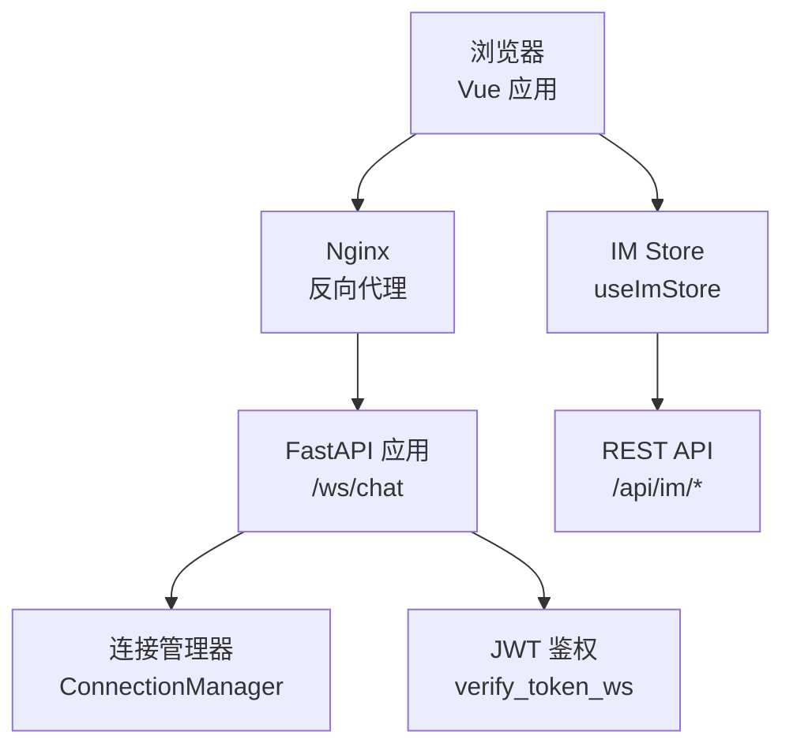
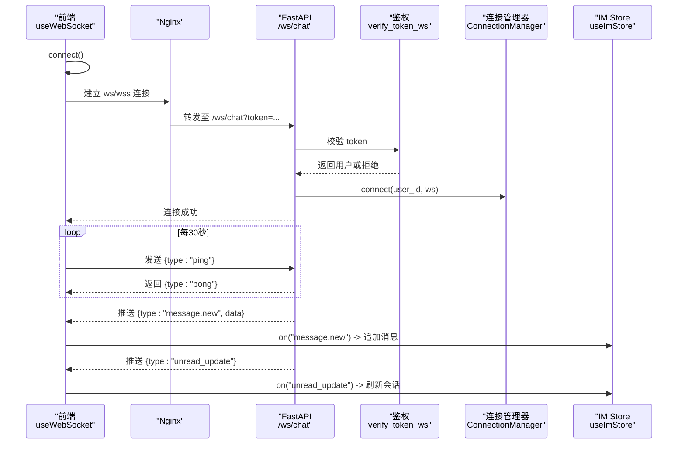
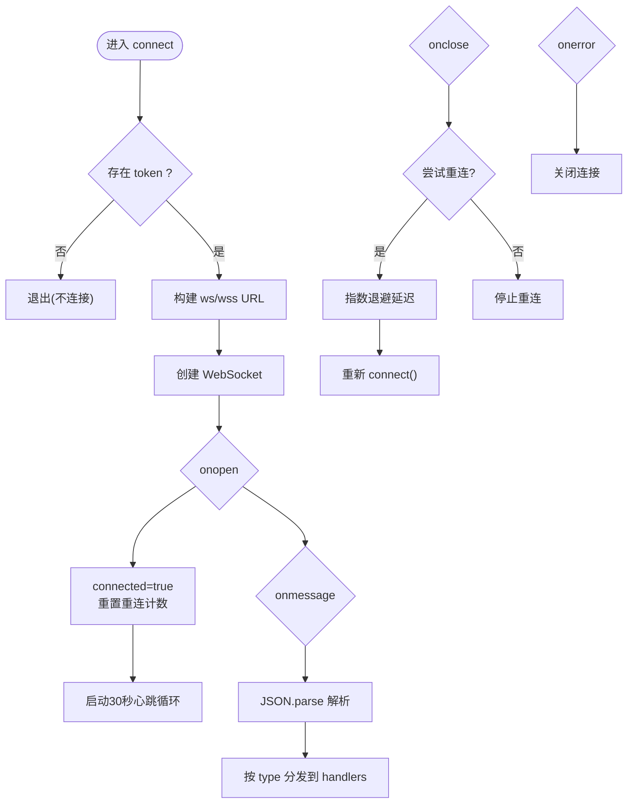
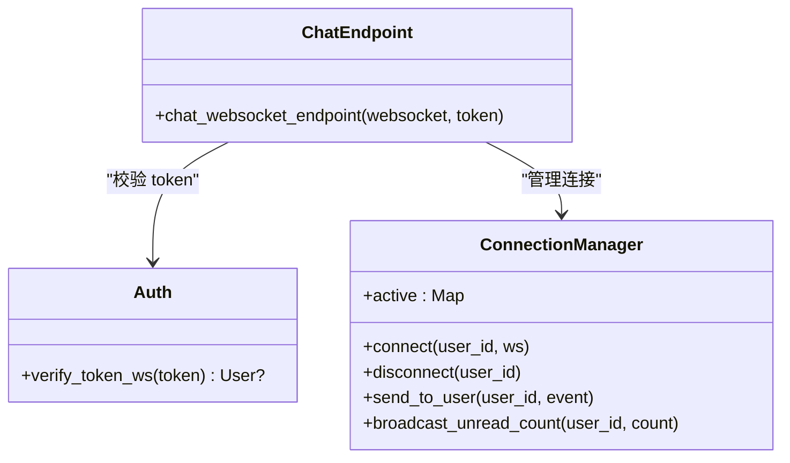
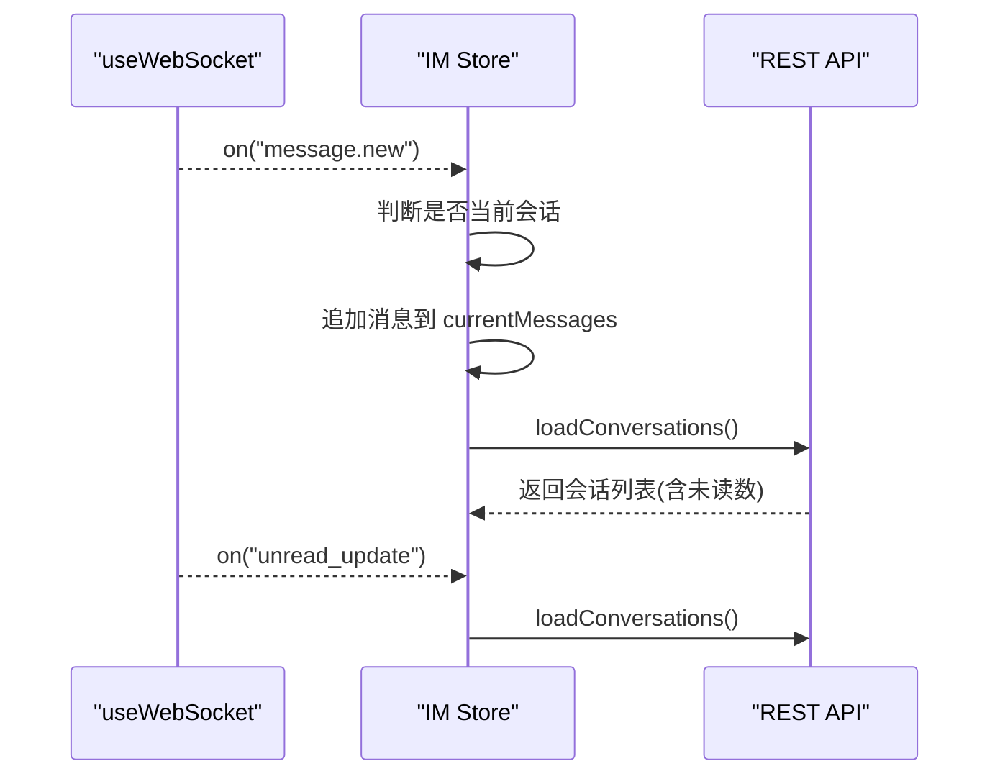
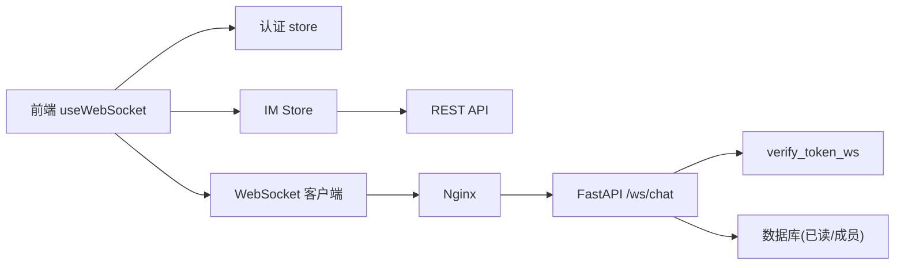

# WebSocket通信组合式函数

<cite>
**本文引用的文件**
- [useWebSocket.ts](file://web/app/src/composables/useWebSocket.ts)
- [chat.py](file://web/backend/ws/chat.py)
- [main.py](file://web/backend/app/main.py)
- [auth.py](file://web/backend/services/auth.py)
- [im.ts](file://web/app/src/stores/im.ts)
- [im.ts API](file://web/app/src/api/im.ts)
- [nginx.conf](file://web/deploy/nginx.conf)
</cite>

## 目录
1. [简介](#简介)
2. [项目结构](#项目结构)
3. [核心组件](#核心组件)
4. [架构总览](#架构总览)
5. [详细组件分析](#详细组件分析)
6. [依赖关系分析](#依赖关系分析)
7. [性能考量](#性能考量)
8. [故障排查指南](#故障排查指南)
9. [结论](#结论)
10. [附录](#附录)

## 简介
本文件聚焦于前端组合式函数 useWebSocket 的实现与使用，系统性阐述连接管理、消息收发、重连机制、错误处理、心跳检测、事件监听与状态同步。同时结合后端 WebSocket 端点与认证流程，说明实时通信协议、消息格式定义、权限验证与数据流路径，并给出连接池/连接复用、断线恢复、性能优化策略建议。

## 项目结构
- 前端组合式函数位于 web/app/src/composables/useWebSocket.ts，封装了 WebSocket 生命周期、事件路由与自动重连。
- 后端 WebSocket 端点位于 web/backend/ws/chat.py，负责鉴权、连接管理与消息处理（如 ping/pong、已读回执）。
- FastAPI 应用入口在 web/backend/app/main.py，注册了 /ws/chat 的 WebSocket 路由。
- IM Store 在 web/app/src/stores/im.ts 中订阅 WebSocket 事件，驱动会话与消息列表的状态同步。
- Nginx 配置在 web/deploy/nginx.conf，对 /api 进行反向代理，支持流式响应与长连接超时设置。

**图表来源**
- [main.py:340-342](file://web/backend/app/main.py#L340-L342)
- [chat.py:14-42](file://web/backend/ws/chat.py#L14-L42)
- [auth.py:257-282](file://web/backend/services/auth.py#L257-L282)
- [nginx.conf:37-47](file://web/deploy/nginx.conf#L37-L47)

**章节来源**
- [main.py:340-342](file://web/backend/app/main.py#L340-L342)
- [chat.py:14-42](file://web/backend/ws/chat.py#L14-L42)
- [auth.py:257-282](file://web/backend/services/auth.py#L257-L282)
- [nginx.conf:37-47](file://web/deploy/nginx.conf#L37-L47)

## 核心组件
- 前端组合式函数 useWebSocket：提供 connect、on、off、send、connected 等能力，内置心跳与指数退避重连。
- 后端连接管理器 ConnectionManager：维护用户到 WebSocket 的连接映射，支持单发消息与未读数广播。
- 认证服务 verify_token_ws：基于 JWT 校验 token，返回用户对象或拒绝连接。
- IM Store 事件订阅：监听 message.new、message.recall、unread_update 等事件，更新本地消息与未读数。

**章节来源**
- [useWebSocket.ts:4-74](file://web/app/src/composables/useWebSocket.ts#L4-L74)
- [chat.py:14-42](file://web/backend/ws/chat.py#L14-L42)
- [auth.py:257-282](file://web/backend/services/auth.py#L257-L282)
- [im.ts:82-102](file://web/app/src/stores/im.ts#L82-L102)

## 架构总览
下图展示了从前端发起连接到接收消息的完整时序，包括鉴权、心跳、事件分发与状态同步。

**图表来源**
- [useWebSocket.ts:11-53](file://web/app/src/composables/useWebSocket.ts#L11-L53)
- [chat.py:45-111](file://web/backend/ws/chat.py#L45-L111)
- [auth.py:257-282](file://web/backend/services/auth.py#L257-L282)
- [im.ts:82-102](file://web/app/src/stores/im.ts#L82-L102)

## 详细组件分析

### 前端组合式函数 useWebSocket
- 连接管理
  - 根据当前页面协议选择 ws 或 wss，拼接 URL 并携带 token 查询参数。
  - 通过 ref 维护 WebSocket 实例与 connected 状态，便于 UI 展示。
- 心跳检测
  - 连接成功后启动定时器，每30秒发送 {type:"ping"}；若连接断开则清理定时器。
- 消息路由
  - 解析 JSON 消息，按 data.type 分派到对应处理器集合；同时支持通配符 "*" 的全量监听。
- 重连机制
  - 连接关闭时触发指数退避重连，最大重试次数为5次，延迟上限为5秒。
- 错误处理
  - onerror 直接关闭连接；JSON 解析失败时忽略畸形消息，避免崩溃。
- 资源清理
  - 组件卸载时关闭 WebSocket，防止内存泄漏。

**图表来源**
- [useWebSocket.ts:11-53](file://web/app/src/composables/useWebSocket.ts#L11-L53)

**章节来源**
- [useWebSocket.ts:4-74](file://web/app/src/composables/useWebSocket.ts#L4-L74)

### 后端 WebSocket 端点与连接管理
- 路由注册
  - FastAPI 在 main.py 中注册 /ws/chat 的 WebSocket 路由，调用 chat_websocket_endpoint。
- 鉴权流程
  - 使用 verify_token_ws 校验 token，非法或未激活账号将拒绝连接。
- 连接管理
  - ConnectionManager 维护 active 映射（user_id → WebSocket），支持 send_to_user 与 broadcast_unread_count。
- 消息处理
  - 接收文本消息，解析 JSON；处理 ping→pong 与 read 事件（记录已读回执）。
- 异常与断开
  - 捕获 WebSocketDisconnect 与通用异常，确保断开时清理连接。

**图表来源**
- [chat.py:14-42](file://web/backend/ws/chat.py#L14-L42)
- [chat.py:45-111](file://web/backend/ws/chat.py#L45-L111)
- [auth.py:257-282](file://web/backend/services/auth.py#L257-L282)

**章节来源**
- [main.py:340-342](file://web/backend/app/main.py#L340-L342)
- [chat.py:45-111](file://web/backend/ws/chat.py#L45-L111)
- [auth.py:257-282](file://web/backend/services/auth.py#L257-L282)

### IM Store 事件订阅与状态同步
- 初始化
  - 调用 useWebSocket 的 connect 建立连接，并在 initWS 中注册事件监听。
- 事件处理
  - message.new：当消息属于当前会话时追加到 currentMessages，并刷新会话列表。
  - message.recall：定位消息并标记撤回，内容替换为提示文案。
  - unread_update：刷新会话列表以更新未读数。
- REST 协同
  - 打开会话时拉取历史消息并标记已读；发送消息走 REST API，随后由 WebSocket 推送新消息保持实时性。

**图表来源**
- [im.ts:82-102](file://web/app/src/stores/im.ts#L82-L102)
- [im.ts API:1-33](file://web/app/src/api/im.ts#L1-L33)

**章节来源**
- [im.ts:82-102](file://web/app/src/stores/im.ts#L82-L102)
- [im.ts API:1-33](file://web/app/src/api/im.ts#L1-L33)

## 依赖关系分析
- 前端依赖
  - Vue 响应式：ref、onUnmounted 用于状态与生命周期管理。
  - Pinia：useImStore 集中管理会话与消息状态。
  - 认证存储：useAuthStore 提供 token，用于连接鉴权。
- 后端依赖
  - FastAPI：WebSocket 路由与中间件。
  - JWT 鉴权：verify_token_ws 校验 token 并获取用户。
  - 数据库：记录已读回执与会话成员关系。
- 部署依赖
  - Nginx：反向代理 /api，支持流式响应与长连接超时。

**图表来源**
- [useWebSocket.ts:1-74](file://web/app/src/composables/useWebSocket.ts#L1-L74)
- [im.ts:1-116](file://web/app/src/stores/im.ts#L1-L116)
- [main.py:340-342](file://web/backend/app/main.py#L340-L342)
- [auth.py:257-282](file://web/backend/services/auth.py#L257-L282)
- [nginx.conf:37-47](file://web/deploy/nginx.conf#L37-L47)

**章节来源**
- [useWebSocket.ts:1-74](file://web/app/src/composables/useWebSocket.ts#L1-L74)
- [im.ts:1-116](file://web/app/src/stores/im.ts#L1-L116)
- [main.py:340-342](file://web/backend/app/main.py#L340-L342)
- [auth.py:257-282](file://web/backend/services/auth.py#L257-L282)
- [nginx.conf:37-47](file://web/deploy/nginx.conf#L37-L47)

## 性能考量
- 心跳间隔与网络健康
  - 当前实现每30秒发送一次 ping，有助于维持 NAT/代理存活；可根据网络环境调整频率。
- 重连策略
  - 指数退避限制最大重试次数，避免风暴式重连；建议在服务端增加连接数监控与限流。
- 消息路由效率
  - 使用 Map/Set 存储事件处理器，查找复杂度接近 O(1)，适合高频事件场景。
- 反压与节流
  - 建议在 IM Store 中对高频事件（如 typing）做节流，减少 UI 渲染压力。
- 压缩与带宽
  - 当前未启用二进制帧或压缩；可在网关层启用 gzip/deflate，或在业务层对大消息进行压缩。
- 连接复用与池化
  - 当前每个组件实例独立维护一个 WebSocket；在多标签页或多模块场景可考虑全局单例或连接池，减少重复握手成本。
- 缓存与离线
  - 可引入本地缓存（IndexedDB）暂存离线消息，重连后增量同步，提升用户体验。

[本节为通用指导，不直接分析具体文件]

## 故障排查指南
- 无法连接
  - 检查 token 是否存在且有效；确认后端 verify_token_ws 能正确解码并返回用户。
  - 检查 Nginx 是否允许 WebSocket 升级与长连接超时设置合理。
- 频繁断线
  - 观察心跳是否正常收到 pong；检查网络质量与代理配置。
  - 查看前端重连日志与后端连接管理日志，定位异常断开原因。
- 消息丢失或乱序
  - 确认消息类型与数据结构符合约定；检查 IM Store 的事件过滤逻辑是否正确。
  - 对于 read 事件，核对会话成员权限与数据库写入是否成功。
- 性能问题
  - 监控前端事件处理耗时，必要时对高频事件进行节流或合并。
  - 在后端增加连接数与消息吞吐监控，评估是否需要水平扩展。

**章节来源**
- [useWebSocket.ts:11-53](file://web/app/src/composables/useWebSocket.ts#L11-L53)
- [chat.py:45-111](file://web/backend/ws/chat.py#L45-L111)
- [nginx.conf:37-47](file://web/deploy/nginx.conf#L37-L47)

## 结论
useWebSocket 提供了简洁可靠的 WebSocket 抽象，涵盖连接、心跳、重连与事件路由，配合 IM Store 实现了消息与未读数的实时同步。后端通过 JWT 鉴权与连接管理器保障安全与可扩展性。建议在多实例场景下引入连接池与更精细的重连策略，并结合网关压缩与前端节流优化整体性能。

[本节为总结，不直接分析具体文件]

## 附录

### 实时通信协议与消息格式
- 客户端 → 服务端
  - ping：保活探测
  - read：上报已读消息 ID 列表（需具备会话成员权限）
- 服务端 → 客户端
  - message.new：新消息推送（包含会话与消息体）
  - message.recall：消息撤回通知（包含消息 ID）
  - unread_update：未读数更新通知
  - pong：对 ping 的响应

**章节来源**
- [useWebSocket.ts:22-42](file://web/app/src/composables/useWebSocket.ts#L22-L42)
- [chat.py:53-105](file://web/backend/ws/chat.py#L53-L105)
- [im.ts:82-102](file://web/app/src/stores/im.ts#L82-L102)

### 连接配置与权限验证
- 连接 URL
  - 根据页面协议选择 ws 或 wss，并附加 token 查询参数。
- 权限验证
  - 后端通过 verify_token_ws 校验 token，仅允许活跃且未被封禁的用户建立连接。
- 路由注册
  - FastAPI 在 /ws/chat 暴露 WebSocket 端点，Nginx 反向代理到后端服务。

**章节来源**
- [useWebSocket.ts:11-19](file://web/app/src/composables/useWebSocket.ts#L11-L19)
- [auth.py:257-282](file://web/backend/services/auth.py#L257-L282)
- [main.py:340-342](file://web/backend/app/main.py#L340-L342)
- [nginx.conf:37-47](file://web/deploy/nginx.conf#L37-L47)

### 数据流与状态同步
- 消息发送
  - 通过 REST API 发送消息，成功后立即入队本地消息列表，再由 WebSocket 推送新消息保证一致性。
- 已读回执
  - 客户端通过 read 事件上报已读消息 ID，服务端校验成员权限后写入数据库。
- 未读数更新
  - 服务端推送 unread_update，客户端刷新会话列表以同步未读数。

**章节来源**
- [im.ts:62-80](file://web/app/src/stores/im.ts#L62-L80)
- [chat.py:58-105](file://web/backend/ws/chat.py#L58-L105)
- [im.ts:82-102](file://web/app/src/stores/im.ts#L82-L102)