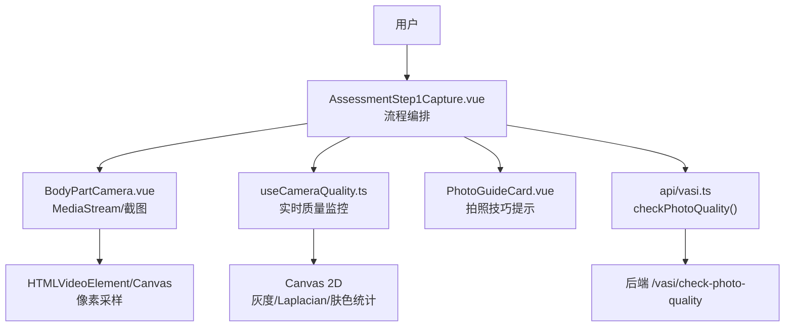
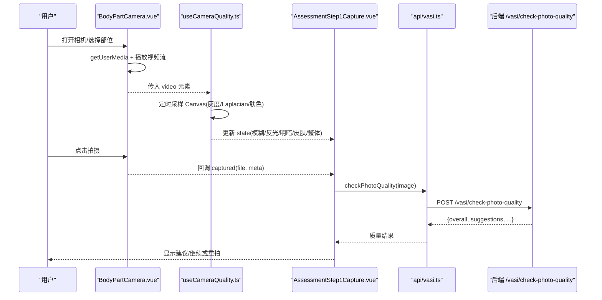
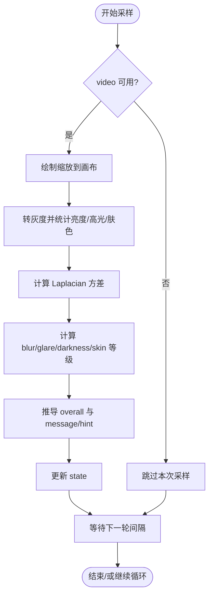
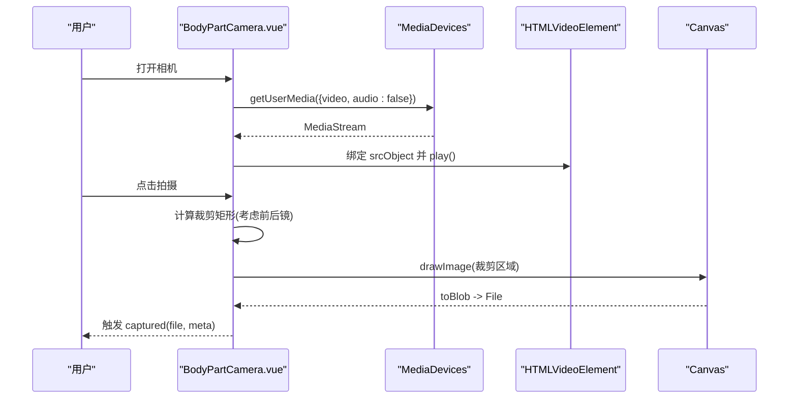
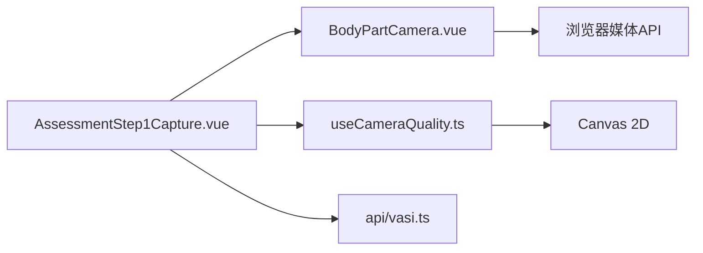

# 摄像头质量检测组合式函数

<cite>
**本文引用的文件**
- [useCameraQuality.ts](file://web/app/src/composables/useCameraQuality.ts)
- [BodyPartCamera.vue](file://web/app/src/components/tracker/BodyPartCamera.vue)
- [AssessmentStep1Capture.vue](file://web/app/src/components/tracker/AssessmentStep1Capture.vue)
- [PhotoGuideCard.vue](file://web/app/src/components/tracker/PhotoGuideCard.vue)
- [vasi.ts](file://web/app/src/api/vasi.ts)
</cite>

## 目录
1. [简介](#简介)
2. [项目结构](#项目结构)
3. [核心组件](#核心组件)
4. [架构总览](#架构总览)
5. [详细组件分析](#详细组件分析)
6. [依赖关系分析](#依赖关系分析)
7. [性能考量](#性能考量)
8. [故障排查指南](#故障排查指南)
9. [结论](#结论)
10. [附录](#附录)

## 简介
本文件围绕前端摄像头质量检测组合式函数 useCameraQuality 的实现与使用，系统阐述其在拍摄流程中的职责：实时采样、图像质量评估（模糊、反光、明暗、皮肤占比）、综合评分、用户提示与反馈。同时结合相机采集组件 BodyPartCamera、拍照引导 PhotoGuideCard、以及后端质量检查接口 vasi.checkPhotoQuality，形成“设备能力检测—实时预览优化—质量评估—用户指导”的完整闭环。文档还涵盖错误处理、兼容性策略与性能调优建议。

## 项目结构
- 组合式函数位于 composables 目录，提供轻量级、无依赖的在线质量监控能力。
- 相机采集由 tracker 下的 BodyPartCamera 组件负责，封装 MediaStream 获取、前后摄像头切换、裁剪与截图。
- 拍照流程编排在 AssessmentStep1Capture 中，串联选择部位、打开相机、上传/拍照、触发质量检查与提交。
- 拍照技巧提示通过 PhotoGuideCard 展示，提升用户拍摄成功率。
- 后端质量检查 API 定义于 api/vasi.ts，用于对已拍摄图片进行更严格的质量校验与建议生成。

图表来源
- [useCameraQuality.ts:55-189](file://web/app/src/composables/useCameraQuality.ts#L55-L189)
- [BodyPartCamera.vue:185-260](file://web/app/src/components/tracker/BodyPartCamera.vue#L185-L260)
- [AssessmentStep1Capture.vue:44-52](file://web/app/src/components/tracker/AssessmentStep1Capture.vue#L44-L52)
- [PhotoGuideCard.vue:20-26](file://web/app/src/components/tracker/PhotoGuideCard.vue#L20-L26)
- [vasi.ts:184-191](file://web/app/src/api/vasi.ts#L184-L191)

章节来源
- [useCameraQuality.ts:55-189](file://web/app/src/composables/useCameraQuality.ts#L55-L189)
- [BodyPartCamera.vue:185-260](file://web/app/src/components/tracker/BodyPartCamera.vue#L185-L260)
- [AssessmentStep1Capture.vue:44-52](file://web/app/src/components/tracker/AssessmentStep1Capture.vue#L44-L52)
- [PhotoGuideCard.vue:20-26](file://web/app/src/components/tracker/PhotoGuideCard.vue#L20-L26)
- [vasi.ts:184-191](file://web/app/src/api/vasi.ts#L184-L191)

## 核心组件
- useCameraQuality：提供 state、start(video)、stop()、running 状态，周期性从视频帧采样并计算模糊、反光、明暗、皮肤占比等指标，输出整体质量等级与提示信息。
- BodyPartCamera：封装 getUserMedia、前后摄像头切换、SVG 遮罩与裁剪、截图导出 File。
- AssessmentStep1Capture：编排“选择部位→打开相机/相册→预览→质量检查→提交”的流程，并在 UI 上展示质量建议。
- PhotoGuideCard：展示拍照技巧提示，帮助提升照片质量。
- vasi.ts：定义 checkPhotoQuality 接口，将图片发送至后端进行质量检查并返回结构化建议。

章节来源
- [useCameraQuality.ts:55-189](file://web/app/src/composables/useCameraQuality.ts#L55-L189)
- [BodyPartCamera.vue:185-260](file://web/app/src/components/tracker/BodyPartCamera.vue#L185-L260)
- [AssessmentStep1Capture.vue:44-52](file://web/app/src/components/tracker/AssessmentStep1Capture.vue#L44-L52)
- [PhotoGuideCard.vue:20-26](file://web/app/src/components/tracker/PhotoGuideCard.vue#L20-L26)
- [vasi.ts:184-191](file://web/app/src/api/vasi.ts#L184-L191)

## 架构总览
下图展示了从用户操作到质量评估与反馈的端到端流程，包括实时预览阶段与拍摄后质量检查阶段。

图表来源
- [BodyPartCamera.vue:185-260](file://web/app/src/components/tracker/BodyPartCamera.vue#L185-L260)
- [useCameraQuality.ts:55-189](file://web/app/src/composables/useCameraQuality.ts#L55-L189)
- [AssessmentStep1Capture.vue:44-52](file://web/app/src/components/tracker/AssessmentStep1Capture.vue#L44-L52)
- [vasi.ts:184-191](file://web/app/src/api/vasi.ts#L184-L191)

## 详细组件分析

### useCameraQuality 组合式函数
- 功能概述
  - 周期采样：基于固定尺寸画布对视频帧进行降采样，降低计算开销。
  - 指标计算：
    - 模糊：Laplacian 方差作为清晰度度量。
    - 反光：高亮饱和像素比例。
    - 明暗：平均亮度范围判定过暗/过曝。
    - 皮肤占比：基于 YCbCr 空间与亮度阈值的肤色区域估计。
  - 综合评分：根据各维度等级推导 overall，并生成 message/hint 提示。
  - 生命周期：onUnmounted 自动停止定时器，避免内存泄漏。
- 关键参数与阈值
  - 采样大小与间隔：控制精度与性能平衡。
  - 模糊阈值、反光比例、明暗区间、皮肤占比阈值：决定 fail/warn/ok 分级。
- 数据模型
  - CameraQualityState：包含 blur/glare/darkness/skin/overall 等级及原始分数、message/hint。
- 错误处理
  - 采样失败不中断运行（如视频未就绪、标签页隐藏），保证鲁棒性。
- 性能特征
  - 纯 JS 计算，零依赖；小尺寸画布+Uint8ClampedArray 高效遍历；每帧约毫秒级耗时。

图表来源
- [useCameraQuality.ts:70-159](file://web/app/src/composables/useCameraQuality.ts#L70-L159)

章节来源
- [useCameraQuality.ts:55-189](file://web/app/src/composables/useCameraQuality.ts#L55-L189)

### BodyPartCamera 相机采集组件
- 权限与设备能力
  - 使用 navigator.mediaDevices.getUserMedia 请求视频流，设置 ideal 分辨率。
  - 捕获 NotAllowedError 等异常并友好提示。
- 前后摄像头切换
  - 通过 facingMode 在 'user' 与 'environment' 间切换，必要时镜像输出以匹配所见即所得。
- 裁剪与截图
  - 依据 SVG 遮罩形状计算目标区域，映射到视频像素坐标，裁剪并导出为 JPEG Blob/File。
- 与 useCameraQuality 集成
  - 可将 video 元素传入 start(video) 以启用实时质量监控。

图表来源
- [BodyPartCamera.vue:185-260](file://web/app/src/components/tracker/BodyPartCamera.vue#L185-L260)

章节来源
- [BodyPartCamera.vue:185-260](file://web/app/src/components/tracker/BodyPartCamera.vue#L185-L260)

### AssessmentStep1Capture 流程编排
- 流程要点
  - 选择身体部位后，支持“拍照/相册”两种输入方式。
  - 调用 BodyPartCamera 打开相机并接收 captured 回调。
  - 可结合后端质量检查接口，对照片给出建议。
- 用户体验
  - 上传/拍照后自动滚动至“开始 AI 分析”按钮，减少操作步骤。
  - 若质量不佳，展示简短建议，引导重拍。

章节来源
- [AssessmentStep1Capture.vue:44-52](file://web/app/src/components/tracker/AssessmentStep1Capture.vue#L44-L52)

### PhotoGuideCard 拍照技巧提示
- 内容要点
  - 距离、光线、参照物、对焦、分辨率等实用建议。
- 交互
  - 可折叠展开，支持“不再显示”持久化偏好。

章节来源
- [PhotoGuideCard.vue:20-26](file://web/app/src/components/tracker/PhotoGuideCard.vue#L20-L26)

### 后端质量检查接口
- 接口定义
  - vasi.checkPhotoQuality(image) 将图片发送至后端，返回结构化质量结果与建议。
- 返回值字段
  - overall、blur_score、skin_ratio、brightness_mean、resolution、suggestions 等，便于前端展示与决策。

章节来源
- [vasi.ts:184-191](file://web/app/src/api/vasi.ts#L184-L191)

## 依赖关系分析
- 组件耦合
  - AssessmentStep1Capture 依赖 BodyPartCamera 完成采集，依赖 useCameraQuality 实现实时质量反馈，依赖 vasi.ts 进行后端质量检查。
- 外部依赖
  - 浏览器媒体 API：navigator.mediaDevices.getUserMedia、HTMLVideoElement、CanvasRenderingContext2D。
  - 无第三方库依赖，确保轻量与高性能。
- 潜在循环依赖
  - 当前模块间为单向依赖，未发现循环引用。

图表来源
- [AssessmentStep1Capture.vue:44-52](file://web/app/src/components/tracker/AssessmentStep1Capture.vue#L44-L52)
- [BodyPartCamera.vue:185-260](file://web/app/src/components/tracker/BodyPartCamera.vue#L185-L260)
- [useCameraQuality.ts:55-189](file://web/app/src/composables/useCameraQuality.ts#L55-L189)
- [vasi.ts:184-191](file://web/app/src/api/vasi.ts#L184-L191)

章节来源
- [AssessmentStep1Capture.vue:44-52](file://web/app/src/components/tracker/AssessmentStep1Capture.vue#L44-L52)
- [BodyPartCamera.vue:185-260](file://web/app/src/components/tracker/BodyPartCamera.vue#L185-L260)
- [useCameraQuality.ts:55-189](file://web/app/src/composables/useCameraQuality.ts#L55-L189)
- [vasi.ts:184-191](file://web/app/src/api/vasi.ts#L184-L191)

## 性能考量
- 采样尺寸与间隔
  - 使用较小画布尺寸与合理采样间隔，在保证精度的前提下降低 CPU 占用。
- 像素访问优化
  - 使用 Uint8ClampedArray 与一次性灰度转换，避免重复计算。
- 算法复杂度
  - 灰度与统计 O(N)，Laplacian 卷积 O(N)，N 为画素数，整体线性复杂度。
- 资源释放
  - stop() 清除定时器并重置状态；组件卸载时自动清理，防止内存泄漏。
- 建议
  - 在低端设备上可适当增大采样间隔或缩小画布尺寸；在高端设备上可提高采样频率以获得更灵敏的反馈。

[本节为通用性能讨论，无需特定文件来源]

## 故障排查指南
- 相机权限被拒绝
  - 现象：打开相机时报错或无法启动。
  - 处理：提示用户在系统设置中允许相机权限；捕获 NotAllowedError 并友好展示。
- 视频流不可用
  - 现象：videoWidth/videoHeight 为 0，采样无效。
  - 处理：useCameraQuality 会跳过本次采样；确保视频已加载并成功播放后再开始监控。
- 画面过暗/过曝
  - 现象：darkness 等级为 warn/fail，message 提示光线问题。
  - 处理：调整环境光或避开直射光源；参考 PhotoGuideCard 的建议。
- 反光严重
  - 现象：glareRatio 超过阈值。
  - 处理：改变拍摄角度或使用柔光；必要时引导用户重拍。
- 皮肤占比过低
  - 现象：skinRatio 低于阈值。
  - 处理：确保患处与正常皮肤同框；调整距离与构图。
- 分辨率不足
  - 现象：后端质量检查返回 size_ok=false。
  - 处理：提高 ideal 分辨率或引导用户使用更高画质设备。

章节来源
- [BodyPartCamera.vue:200-207](file://web/app/src/components/tracker/BodyPartCamera.vue#L200-L207)
- [useCameraQuality.ts:70-159](file://web/app/src/composables/useCameraQuality.ts#L70-L159)
- [PhotoGuideCard.vue:20-26](file://web/app/src/components/tracker/PhotoGuideCard.vue#L20-L26)
- [vasi.ts:184-191](file://web/app/src/api/vasi.ts#L184-L191)

## 结论
useCameraQuality 提供了轻量、高效的在线摄像头质量监控能力，结合 BodyPartCamera 的采集能力与 vasi.ts 的后端质量检查，形成了完整的“实时预览—质量评估—用户指导—拍摄优化”闭环。通过合理的阈值与算法设计，可在不同设备上稳定工作；配合完善的错误处理与性能优化策略，能够显著提升用户拍摄体验与后续 AI 分析的准确性。

[本节为总结性内容，无需特定文件来源]

## 附录
- 质量评分算法要点
  - 模糊：Laplacian 方差越小越模糊，设定 fail/warn/ok 阈值。
  - 反光：高亮像素比例越高，反光越严重。
  - 明暗：平均亮度处于安全区间为佳，过低/过高分别对应暗/曝。
  - 皮肤占比：基于 YCbCr 与亮度阈值估计皮肤区域占比。
  - 综合：fail 优先降级为 warn，warn 存在则整体 warn，否则 ok。
- 实时预览优化
  - 小画布采样、Uint8ClampedArray、最小化 DOM 操作、节流采样间隔。
- 用户反馈机制
  - 实时 message/hint；后端质量检查 suggestions；拍照技巧提示。

[本节为概念性说明，无需特定文件来源]