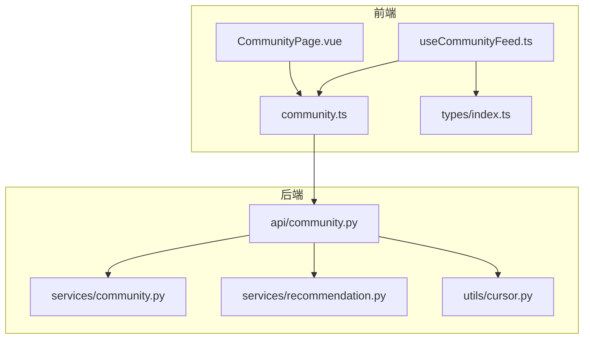
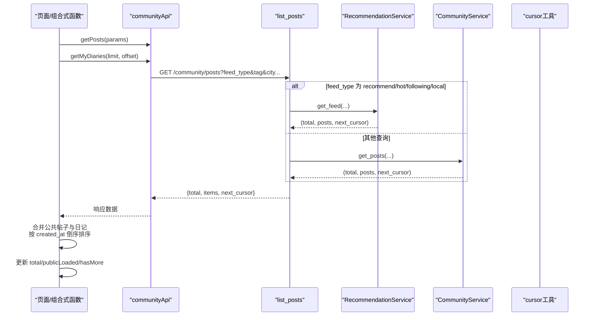
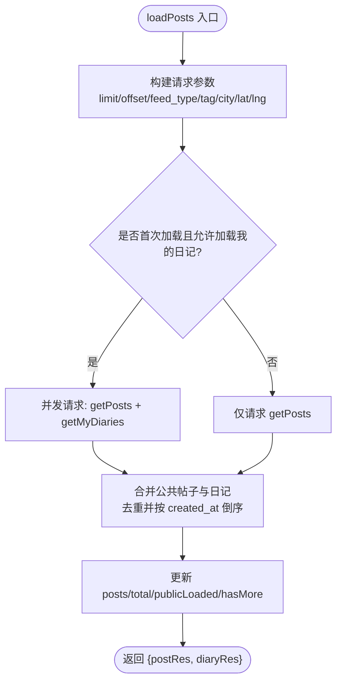
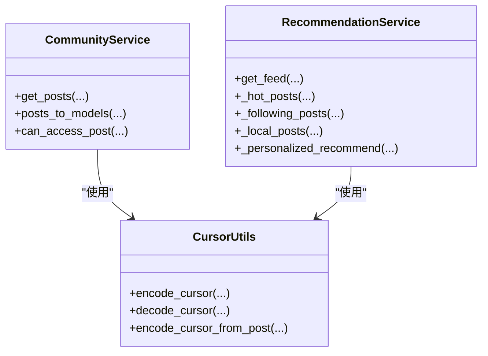
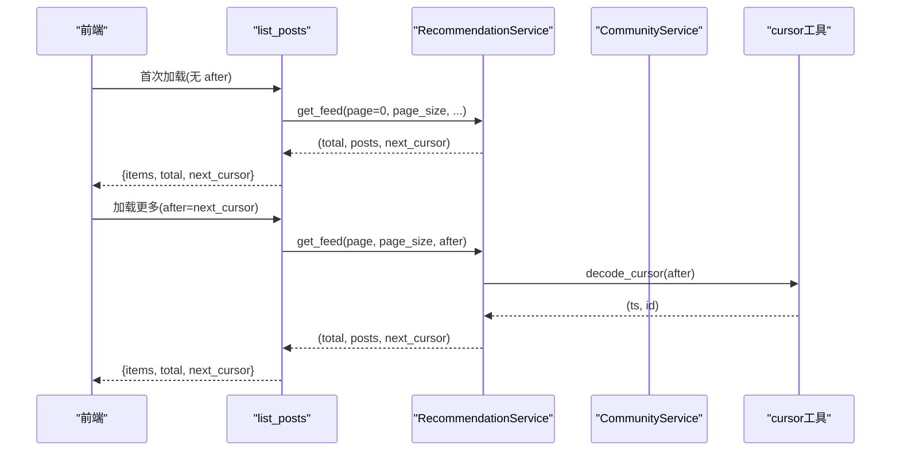
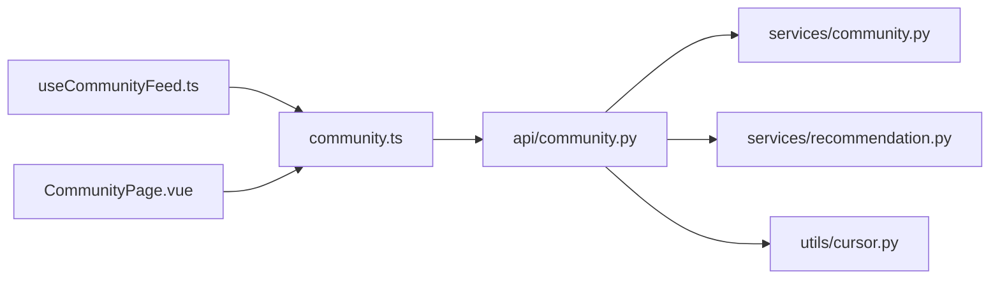

# 社区数据获取组合式函数

<cite>
**本文引用的文件**
- [useCommunityFeed.ts](file://web/app/src/composables/useCommunityFeed.ts)
- [community.ts](file://web/app/src/api/community.ts)
- [community.py](file://web/backend/api/community.py)
- [community_service.py](file://web/backend/services/community.py)
- [recommendation.py](file://web/backend/services/recommendation.py)
- [cursor.py](file://web/backend/utils/cursor.py)
- [CommunityPage.vue](file://web/app/src/views/CommunityPage.vue)
- [index.ts（类型定义）](file://web/app/src/types/index.ts)
</cite>

## 目录
1. [简介](#简介)
2. [项目结构](#项目结构)
3. [核心组件](#核心组件)
4. [架构总览](#架构总览)
5. [详细组件分析](#详细组件分析)
6. [依赖关系分析](#依赖关系分析)
7. [性能考量](#性能考量)
8. [故障排查指南](#故障排查指南)
9. [结论](#结论)
10. [附录：使用示例与扩展指南](#附录使用示例与扩展指南)

## 简介
本文件围绕前端组合式函数 useCommunityFeed 的实现，系统性说明社区帖子列表的获取、分页加载、搜索过滤、排序机制以及前后端的数据同步策略。文档同时覆盖数据缓存策略、错误处理、网络状态管理与用户交互反馈，并给出 API 调用封装、数据转换逻辑和状态同步方案，最后提供使用示例、配置选项与扩展指南。

## 项目结构
- 前端
  - 组合式函数：web/app/src/composables/useCommunityFeed.ts
  - API 封装：web/app/src/api/community.ts
  - 页面视图：web/app/src/views/CommunityPage.vue
  - 类型定义：web/app/src/types/index.ts
- 后端
  - 路由层：web/backend/api/community.py
  - 服务层：web/backend/services/community.py、web/backend/services/recommendation.py
  - 游标工具：web/backend/utils/cursor.py

图表来源
- [useCommunityFeed.ts:1-92](file://web/app/src/composables/useCommunityFeed.ts#L1-L92)
- [community.ts:55-167](file://web/app/src/api/community.ts#L55-L167)
- [community.py:296-353](file://web/backend/api/community.py#L296-L353)
- [community_service.py:226-292](file://web/backend/services/community.py#L226-L292)
- [recommendation.py:77-94](file://web/backend/services/recommendation.py#L77-L94)
- [cursor.py:1-41](file://web/backend/utils/cursor.py#L1-L41)

章节来源
- [useCommunityFeed.ts:1-92](file://web/app/src/composables/useCommunityFeed.ts#L1-L92)
- [community.ts:55-167](file://web/app/src/api/community.ts#L55-L167)
- [community.py:296-353](file://web/backend/api/community.py#L296-L353)
- [community_service.py:226-292](file://web/backend/services/community.py#L226-L292)
- [recommendation.py:77-94](file://web/backend/services/recommendation.py#L77-L94)
- [cursor.py:1-41](file://web/backend/utils/cursor.py#L1-L41)

## 核心组件
- useCommunityFeed：封装帖子列表的状态与加载逻辑，支持合并公共帖子与个人日记、按时间倒序排序、分页追加、基础搜索与同城参数透传。
- communityApi：统一的前端 API 客户端封装，包含 getPosts、getMyDiaries、上传、收藏、点赞等接口。
- 后端路由与业务：
  - list_posts：根据 feed_type 选择推荐/热门/关注/同城或通用查询；返回 total、items、next_cursor。
  - get_my_diaries：仅返回当前用户的私密日记条目。
  - RecommendationService：实现个性化推荐、热门、关注、同城等 feed 的分页与排序。
  - CommunityService：通用帖子查询、标签过滤、模型批量转换、访问权限控制等。
  - cursor 工具：基于 created_at + id 的游标编码/解码，保证插入删除场景下的稳定分页。

章节来源
- [useCommunityFeed.ts:29-86](file://web/app/src/composables/useCommunityFeed.ts#L29-L86)
- [community.ts:61-76](file://web/app/src/api/community.ts#L61-L76)
- [community.py:296-353](file://web/backend/api/community.py#L296-L353)
- [community_service.py:226-292](file://web/backend/services/community.py#L226-L292)
- [recommendation.py:77-94](file://web/backend/services/recommendation.py#L77-L94)
- [cursor.py:16-41](file://web/backend/utils/cursor.py#L16-L41)

## 架构总览
前端通过 useCommunityFeed 发起请求，调用 communityApi.getPosts 与 getMyDiaries，后端根据 feed_type 路由到推荐服务或通用服务，最终返回统一格式的 PostListResponse。前端将公共帖子与个人日记合并并按时间倒序排序，维护 hasMore 与 nextCursor 实现稳定的游标分页。

图表来源
- [community.ts:61-76](file://web/app/src/api/community.ts#L61-L76)
- [community.py:296-353](file://web/backend/api/community.py#L296-L353)
- [recommendation.py:77-94](file://web/backend/services/recommendation.py#L77-L94)
- [community_service.py:226-292](file://web/backend/services/community.py#L226-L292)
- [cursor.py:16-41](file://web/backend/utils/cursor.py#L16-L41)

## 详细组件分析

### 组合式函数 useCommunityFeed
- 职责
  - 管理 posts、total、loading、loadingMore、publicLoaded、pageSize、hasMore 等状态。
  - loadPosts 负责构造请求参数、并发拉取公共帖子与个人日记、合并与排序、计算总数与是否还有更多。
- 关键行为
  - 参数映射：feedType 映射为后端的 feed_type；当 feedType=local 时携带 city、user_lat、user_lng；searchQuery 映射为 tag 进行标签搜索。
  - 并发请求：Promise.all([getPosts, getMyDiaries])，仅在首次加载且满足条件时拉取我的日记。
  - 合并与排序：mergePosts 去重并按 created_at 倒序排序。
  - 总数计算：total = max(postRes.total + 私密日记数, 已合并后的长度)，确保 hasMore 正确。
  - 分页追加：append=true 时使用 mergePosts(posts.value, postRes.items) 追加新项；否则替换为新数据并合并日记。
- 局限与注意
  - 未暴露 loading 与 loadingMore 的完整生命周期（由调用方如 CommunityPage 控制）。
  - 搜索以 tag 形式传递，实际为标签匹配而非全文检索。
  - 同城定位参数需调用方传入 lat/lng。

图表来源
- [useCommunityFeed.ts:38-86](file://web/app/src/composables/useCommunityFeed.ts#L38-L86)

章节来源
- [useCommunityFeed.ts:5-15](file://web/app/src/composables/useCommunityFeed.ts#L5-L15)
- [useCommunityFeed.ts:29-86](file://web/app/src/composables/useCommunityFeed.ts#L29-L86)

### API 封装 communityApi
- 提供 getPosts、getMyDiaries、上传、收藏、点赞、评论、标签、收藏夹等接口。
- getPosts 支持 category_id、tag、post_type、feed_type、limit、offset、after 等参数。
- getMyDiaries 支持 limit、offset、after，用于获取当前用户的私密日记。

章节来源
- [community.ts:55-167](file://web/app/src/api/community.ts#L55-L167)

### 后端路由与业务
- list_posts
  - 若 feed_type 为 recommend/hot/following/local，则走 RecommendationService.get_feed，否则走 CommunityService.get_posts。
  - 统一返回 PostListResponse(total, items, next_cursor)。
  - 非管理员且未登录时过滤被屏蔽内容；普通用户仅能看到自己未被屏蔽的内容。
- get_my_diaries
  - 仅返回当前用户的私密日记，按 is_private、diary_date、created_at 排序，支持 after 游标分页。
- RecommendationService
  - 热门：近一周公开帖子，按互动得分排序。
  - 关注：优先展示关注作者的内容，无关注则回退到热门。
  - 同城：按城市过滤，支持经纬度距离排序（当提供 lat/lng），内置本地缓存减少重复计算。
  - 个性化推荐：首屏按兴趣标签与探索内容混合排序，后续页按综合得分排序。
- CommunityService
  - 通用查询：支持分类、标签、类型、私有可见性、游标分页。
  - 批量转换：posts_to_models 避免 N+1 查询，提升性能。
  - 访问控制：can_access_post 限制私密与被屏蔽内容的可见性。

图表来源
- [community_service.py:226-292](file://web/backend/services/community.py#L226-L292)
- [recommendation.py:77-94](file://web/backend/services/recommendation.py#L77-L94)
- [cursor.py:16-41](file://web/backend/utils/cursor.py#L16-L41)

章节来源
- [community.py:296-353](file://web/backend/api/community.py#L296-L353)
- [community_service.py:226-292](file://web/backend/services/community.py#L226-L292)
- [recommendation.py:77-94](file://web/backend/services/recommendation.py#L77-L94)
- [cursor.py:16-41](file://web/backend/utils/cursor.py#L16-L41)

### 分页与游标机制
- 前端
  - CommunityPage.vue 维护 nextCursor，并在追加加载时作为 after 参数回传；初始加载重置 nextCursor。
  - IntersectionObserver 监听底部哨兵元素触发 loadMore。
- 后端
  - cursor 工具将 created_at（毫秒时间戳）与 post_id 编码为 base64 字符串；解码后用于过滤“小于该时间点或等于时间点但 ID 更小”的记录，保证插入删除场景下不跳页/不重复。
  - 各 feed 路径均支持 after 游标分页。

图表来源
- [CommunityPage.vue:84-145](file://web/app/src/views/CommunityPage.vue#L84-L145)
- [community.py:318-353](file://web/backend/api/community.py#L318-L353)
- [recommendation.py:96-125](file://web/backend/services/recommendation.py#L96-L125)
- [cursor.py:16-41](file://web/backend/utils/cursor.py#L16-L41)

章节来源
- [CommunityPage.vue:26-31](file://web/app/src/views/CommunityPage.vue#L26-L31)
- [CommunityPage.vue:84-145](file://web/app/src/views/CommunityPage.vue#L84-L145)
- [cursor.py:16-41](file://web/backend/utils/cursor.py#L16-L41)

### 搜索与过滤
- 前端
  - searchQuery 映射为 tag 参数；activeTag 也映射为 tag。
  - 同城模式下可附加 city、lat、lng。
- 后端
  - 标签过滤：通过 Tag -> PostTag -> Post 关联查询。
  - 同城过滤：按 city 精确匹配（大小写不敏感），可选按 read_count 与 created_at 排序，支持经纬度距离排序。
  - 推荐/热门：按互动得分排序（like*权重 + comment*权重 + read_count*权重）。

章节来源
- [community.ts:61-76](file://web/app/src/api/community.ts#L61-L76)
- [community.py:296-353](file://web/backend/api/community.py#L296-L353)
- [recommendation.py:53-72](file://web/backend/services/recommendation.py#L53-L72)
- [recommendation.py:261-285](file://web/backend/services/recommendation.py#L261-L285)

### 排序与实时性
- 排序
  - 默认按 created_at 倒序；热门/推荐按互动得分倒序；同城可按 read_count 与 created_at 排序，或在提供经纬度时按距离排序。
- 实时性
  - 当前实现为请求-响应模式，无 WebSocket 推送；每次加载从服务端获取最新数据。
  - 同城结果有短期内存缓存（TTL 5分钟），减少频繁计算。

章节来源
- [recommendation.py:28-39](file://web/backend/services/recommendation.py#L28-L39)
- [recommendation.py:96-125](file://web/backend/services/recommendation.py#L96-L125)
- [recommendation.py:127-182](file://web/backend/services/recommendation.py#L127-L182)
- [recommendation.py:261-285](file://web/backend/services/recommendation.py#L261-L285)

### 数据缓存策略
- 后端
  - 同城 feed 使用进程内字典缓存 {key: (timestamp, (total, post_ids))}，TTL 5分钟，键包含 city、page、page_size、lat、lng。
  - 避免缓存 ORM 对象，防止 DetachedInstanceError 与陈旧数据。
- 前端
  - 无全局缓存；每次加载重新请求；合并阶段在内存中做去重与排序。

章节来源
- [recommendation.py:28-39](file://web/backend/services/recommendation.py#L28-L39)
- [useCommunityFeed.ts:5-15](file://web/app/src/composables/useCommunityFeed.ts#L5-L15)

### 错误处理与网络状态
- 前端
  - CommunityPage.vue 在初始加载失败时设置 loadError 并提供重试；切换 Tab/标签/城市变化时捕获错误并提示。
  - 使用 MAX_RENDERED_POSTS 限制渲染节点数量，避免卡顿。
- 后端
  - 权限校验：未登录访问私密内容返回 401；被屏蔽内容对非所有者不可见。
  - 写入限流：部分写操作受 rate_limit 保护。
  - 异常日志：上传、审核等异步任务失败记录警告日志。

章节来源
- [CommunityPage.vue:149-177](file://web/app/src/views/CommunityPage.vue#L149-L177)
- [community.py:314-353](file://web/backend/api/community.py#L314-L353)
- [community.py:219-293](file://web/backend/api/community.py#L219-L293)

### 用户交互反馈
- 加载态：loading、loadingMore 控制顶部与底部加载指示。
- 空态：加载失败时显示空状态与重试按钮。
- 滚动加载：IntersectionObserver 监听底部哨兵自动加载更多。

章节来源
- [CommunityPage.vue:18-31](file://web/app/src/views/CommunityPage.vue#L18-L31)
- [CommunityPage.vue:52-68](file://web/app/src/views/CommunityPage.vue#L52-L68)
- [CommunityPage.vue:230-240](file://web/app/src/views/CommunityPage.vue#L230-L240)

## 依赖关系分析
- 前端
  - useCommunityFeed 依赖 communityApi 与类型定义。
  - CommunityPage.vue 依赖 useCommunityFeed 或直接调用 communityApi，并集成地理定位、日历、瀑布流等组件。
- 后端
  - api/community.py 依赖 services/community.py、services/recommendation.py、utils/cursor.py。
  - recommendation.py 依赖数据库模型与评分公式，内部含同城缓存。
  - community_service.py 提供通用查询、权限控制与批量转换。

图表来源
- [useCommunityFeed.ts:1-92](file://web/app/src/composables/useCommunityFeed.ts#L1-L92)
- [community.ts:55-167](file://web/app/src/api/community.ts#L55-L167)
- [community.py:296-353](file://web/backend/api/community.py#L296-L353)

章节来源
- [useCommunityFeed.ts:1-92](file://web/app/src/composables/useCommunityFeed.ts#L1-L92)
- [community.ts:55-167](file://web/app/src/api/community.ts#L55-L167)
- [community.py:296-353](file://web/backend/api/community.py#L296-L353)

## 性能考量
- 游标分页替代 offset，避免插入删除导致的跳页/重复。
- 批量转换 posts_to_models 避免 N+1 查询。
- 同城 feed 短期内存缓存降低重复计算。
- 前端限制渲染节点数量，结合 IntersectionObserver 按需加载。
- 并发请求合并公共帖子与日记，减少往返次数。

[本节为通用性能建议，无需特定文件引用]

## 故障排查指南
- 无法加载或加载为空
  - 检查网络状态与认证状态；确认 feed_type 与 tag/city 参数是否正确。
  - 查看 CommunityPage.vue 的 loadError 与 retryLoad 流程。
- 加载更多无效
  - 确认 nextCursor 是否正确回传；检查后端返回的 next_cursor。
  - 验证游标解码与过滤条件是否符合预期。
- 同城内容不出现
  - 确认 city 与 lat/lng 是否传递；检查同城缓存键与 TTL。
- 搜索无结果
  - 确认 searchQuery 是否映射为 tag；检查标签是否存在于系统。

章节来源
- [CommunityPage.vue:149-177](file://web/app/src/views/CommunityPage.vue#L149-L177)
- [community.py:318-353](file://web/backend/api/community.py#L318-L353)
- [recommendation.py:261-285](file://web/backend/services/recommendation.py#L261-L285)

## 结论
useCommunityFeed 提供了简洁易用的社区数据获取能力，配合后端的游标分页、推荐/热门/关注/同城等多路 feed，实现了稳定高效的数据加载体验。通过并发请求、内存合并与排序、前端渲染限制与后端批量转换，整体性能良好。未来可扩展全文搜索、WebSocket 实时更新与更细粒度的缓存策略。

[本节为总结性内容，无需特定文件引用]

## 附录：使用示例与扩展指南

### 基本用法
- 在页面中初始化并调用 loadPosts：
  - 首次加载：传入 feedType、可选 tag/city/lat/lng。
  - 加载更多：传入 append=true 与 publicLoaded 作为 offset。
- 合并与排序：由 useCommunityFeed 内部完成，外部无需关心。

章节来源
- [useCommunityFeed.ts:29-86](file://web/app/src/composables/useCommunityFeed.ts#L29-L86)
- [CommunityPage.vue:84-145](file://web/app/src/views/CommunityPage.vue#L84-L145)

### 配置选项
- feedType：'follow' | 'recommend' | 'local'
- tag：标签过滤
- searchQuery：搜索词（映射为 tag）
- city：同城城市
- lat/lng：用户经纬度（同城距离排序）
- offset：起始偏移（首次加载通常为 0）
- append：是否追加加载
- includeDiaries：是否合并我的日记（首次加载且推荐流且无标签/搜索时启用）

章节来源
- [useCommunityFeed.ts:17-27](file://web/app/src/composables/useCommunityFeed.ts#L17-L27)
- [community.ts:61-76](file://web/app/src/api/community.ts#L61-L76)

### 扩展指南
- 增加全文搜索
  - 在后端新增全文检索接口，前端将 searchQuery 映射到新字段。
- 引入实时更新
  - 使用 WebSocket 接收新帖/点赞/评论事件，前端增量更新 posts 与计数。
- 增强缓存
  - 在前端增加请求级缓存（如基于 URL 参数的内存缓存），减少重复请求。
- 优化同城排序
  - 在提供 lat/lng 时启用距离排序，并考虑 Haversine 公式或数据库空间索引。

[本节为扩展建议，无需特定文件引用]