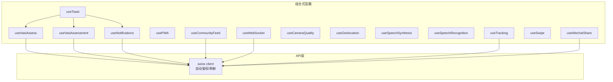
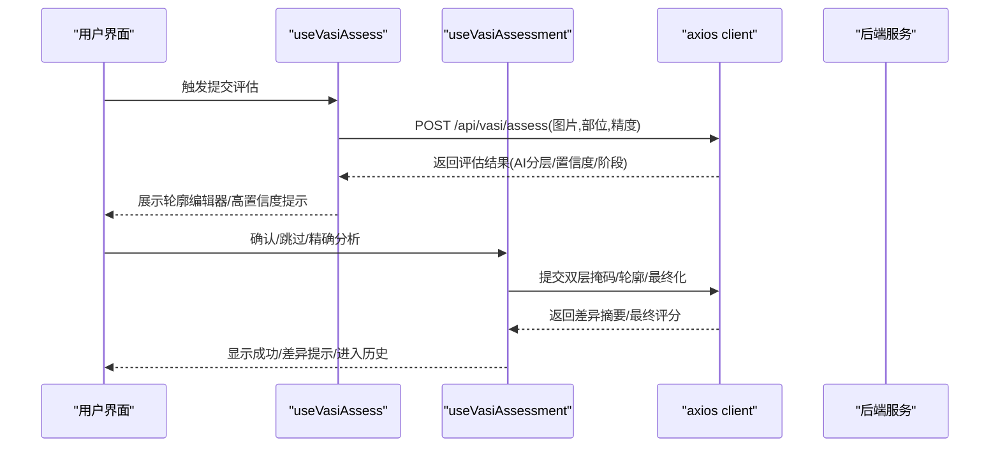
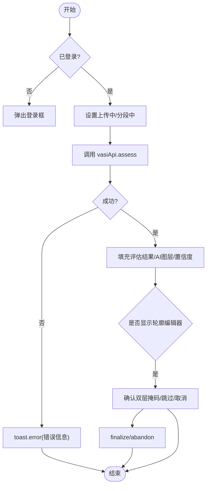
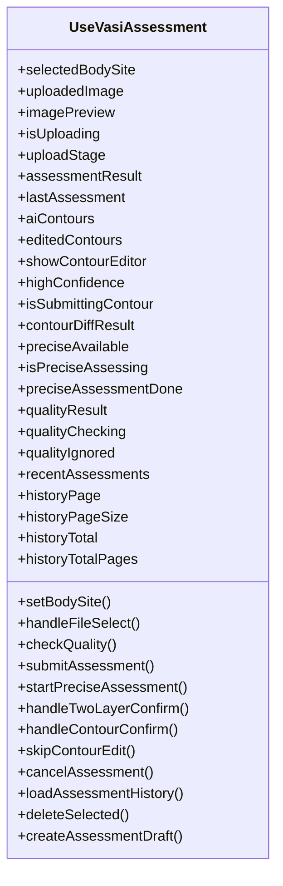
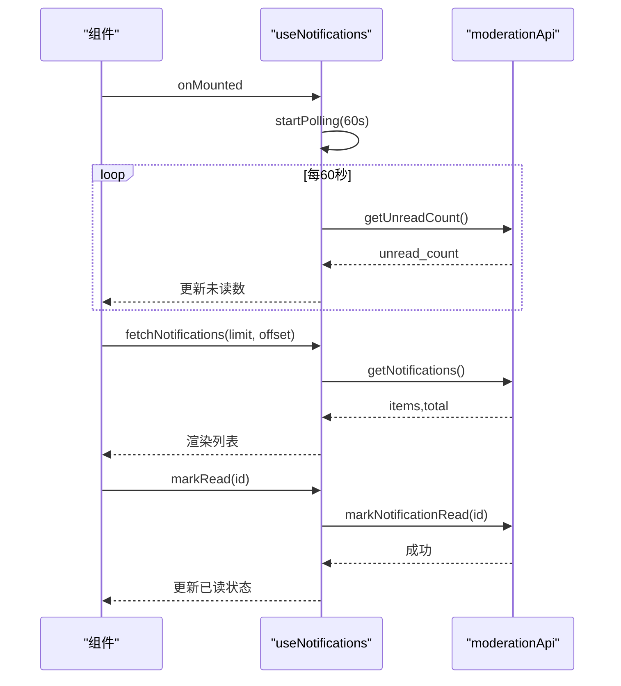
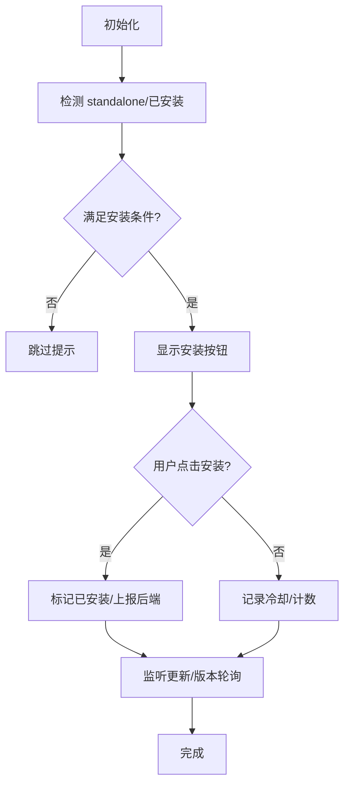
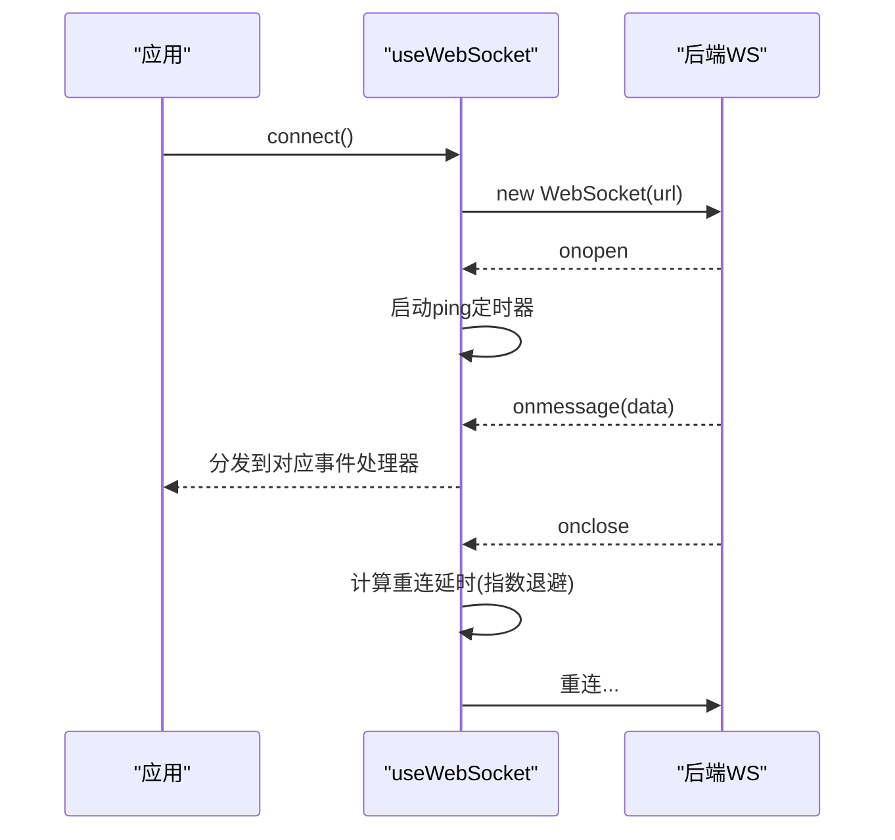
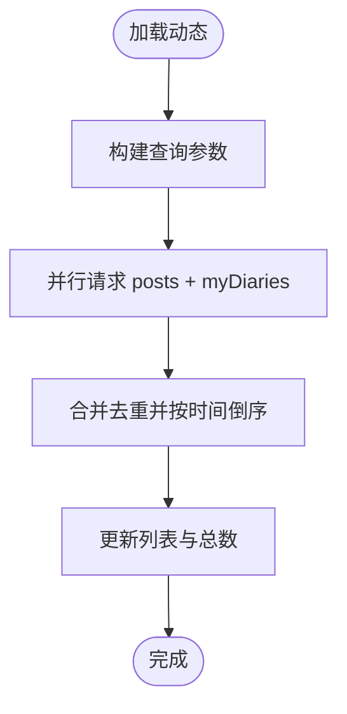
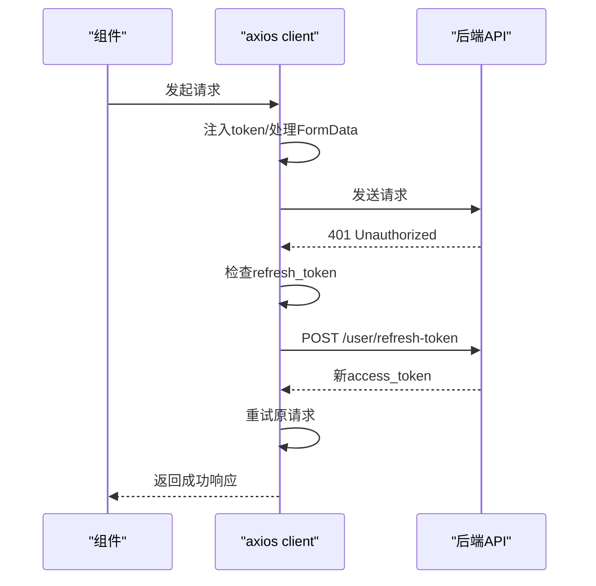
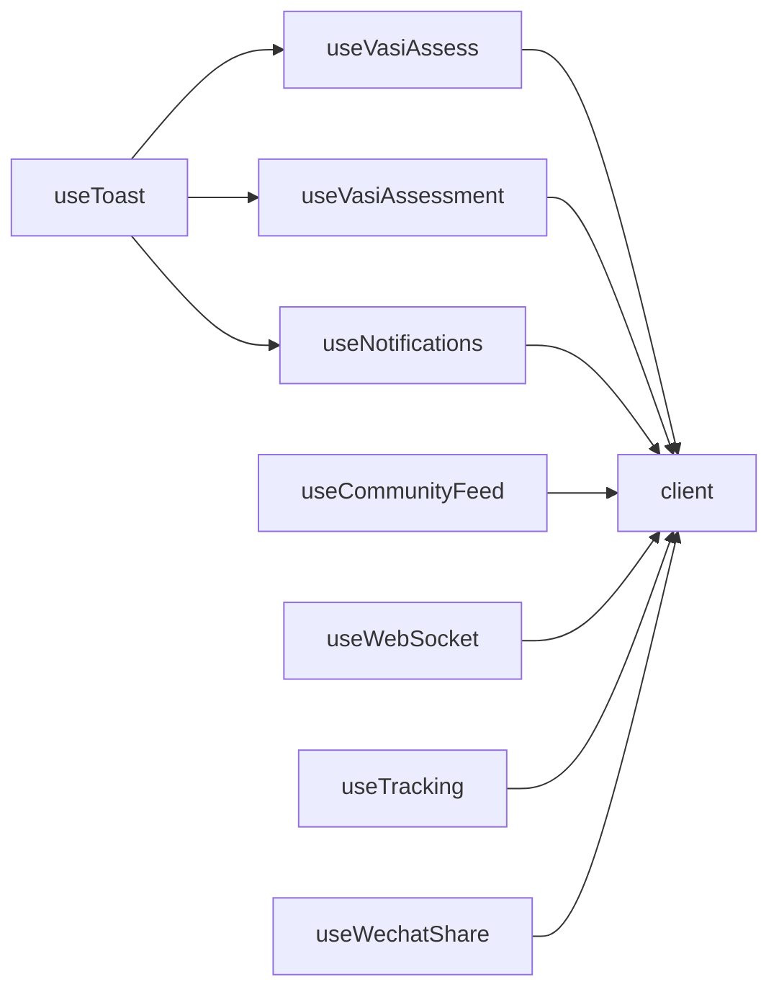

# 组合式函数与工具

<cite>
**本文引用的文件**   
- [useVasiAssess.ts](file://web/app/src/composables/useVasiAssess.ts)
- [useVasiAssessment.ts](file://web/app/src/composables/useVasiAssessment.ts)
- [useNotifications.ts](file://web/app/src/composables/useNotifications.ts)
- [usePWA.ts](file://web/app/src/composables/usePWA.ts)
- [useWebSocket.ts](file://web/app/src/composables/useWebSocket.ts)
- [useCommunityFeed.ts](file://web/app/src/composables/useCommunityFeed.ts)
- [client.ts](file://web/app/src/api/client.ts)
- [useCameraQuality.ts](file://web/app/src/composables/useCameraQuality.ts)
- [useGeolocation.ts](file://web/app/src/composables/useGeolocation.ts)
- [useToast.ts](file://web/app/src/composables/useToast.ts)
- [useSpeechRecognition.ts](file://web/app/src/composables/useSpeechRecognition.ts)
- [useSpeechSynthesis.ts](file://web/app/src/composables/useSpeechSynthesis.ts)
- [useTracking.ts](file://web/app/src/composables/useTracking.ts)
- [useSwipe.ts](file://web/app/src/composables/useSwipe.ts)
- [useWechatShare.ts](file://web/app/src/composables/useWechatShare.ts)
</cite>

## 目录
1. [简介](#简介)
2. [项目结构](#项目结构)
3. [核心组件](#核心组件)
4. [架构总览](#架构总览)
5. [详细组件分析](#详细组件分析)
6. [依赖分析](#依赖分析)
7. [性能考虑](#性能考虑)
8. [故障排查指南](#故障排查指南)
9. [结论](#结论)
10. [附录](#附录)

## 简介
本文件面向前端工程中的 Vue 3 Composition API 组合式函数与工具库，系统性梳理并文档化以下能力：
- 业务逻辑封装：VASI 评估流程、历史管理、草稿生成、隐私遮罩等
- API 调用封装：统一 axios 客户端、自动刷新令牌、并发去重、错误处理
- 设备能力检测与 Web 功能集成：相机质量监测、地理定位、语音识别/合成、PWA 安装与更新、微信分享、滑动导航
- 通知系统：轮询未读计数与消息列表、标记已读
- WebSocket 通信：连接、心跳、事件订阅、断线重连
- 错误处理、重试机制、缓存策略与性能优化建议
- 函数接口说明、使用示例与扩展指南

## 项目结构
前端应用位于 web/app/src，组合式函数集中于 composables 目录，API 客户端位于 api 目录。各组合式函数职责清晰、内聚性强，通过 store（如 auth）和 toast 进行状态与交互反馈。

图表来源
- [useVasiAssess.ts:1-186](file://web/app/src/composables/useVasiAssess.ts#L1-L186)
- [useVasiAssessment.ts:1-646](file://web/app/src/composables/useVasiAssessment.ts#L1-L646)
- [useNotifications.ts:1-89](file://web/app/src/composables/useNotifications.ts#L1-L89)
- [useCommunityFeed.ts:1-92](file://web/app/src/composables/useCommunityFeed.ts#L1-L92)
- [client.ts:1-84](file://web/app/src/api/client.ts#L1-L84)
- [useToast.ts:1-31](file://web/app/src/composables/useToast.ts#L1-L31)

章节来源
- [useVasiAssess.ts:1-186](file://web/app/src/composables/useVasiAssess.ts#L1-L186)
- [useVasiAssessment.ts:1-646](file://web/app/src/composables/useVasiAssessment.ts#L1-L646)
- [useNotifications.ts:1-89](file://web/app/src/composables/useNotifications.ts#L1-L89)
- [useCommunityFeed.ts:1-92](file://web/app/src/composables/useCommunityFeed.ts#L1-L92)
- [client.ts:1-84](file://web/app/src/api/client.ts#L1-L84)
- [useToast.ts:1-31](file://web/app/src/composables/useToast.ts#L1-L31)

## 核心组件
- useVasiAssess：聚焦“提交评估—AI分析—轮廓编辑—结果确认”的轻量工作流，提供上传进度、结果对象、AI图层URL、置信度提示、最终确认/跳过/取消等能力。
- useVasiAssessment：更完整的评估工作流，包含图片选择/预览、质量检查、精确分析、轮廓编辑、历史分页/批量删除、草稿生成与隐私遮罩等。
- useNotifications：未读计数轮询、消息列表加载、标记已读，生命周期内自动启停定时器。
- usePWA：Service Worker 注册与更新、安装引导、离线检测、构建版本轮询、用户行为统计上报。
- useWebSocket：建立 ws/wss 连接、心跳保活、事件订阅/取消、指数退避重连。
- useCommunityFeed：关注/推荐/本地动态聚合，支持标签搜索、城市定位参数、合并去重排序。
- client：全局 axios 实例，请求拦截注入 token，响应拦截处理 401 刷新令牌与并发去重。
- useCameraQuality：基于 Canvas 的实时画质检测（模糊、反光、明暗、肤色占比），阈值判定与提示文案。
- useGeolocation：IP 优先 + GPS 升级 + OSM 逆地理编码，带本地缓存与过期策略。
- useToast：全局消息队列与自动消失。
- useSpeechRecognition / useSpeechSynthesis：浏览器原生语音输入/播报封装，含权限与错误处理。
- useTracking：埋点事件队列、定时批量上报、会话ID管理。
- useSwipe：移动端手势识别与页面级滑动导航。
- useWechatShare：微信 JSSDK 初始化与分享配置。

章节来源
- [useVasiAssess.ts:1-186](file://web/app/src/composables/useVasiAssess.ts#L1-L186)
- [useVasiAssessment.ts:1-646](file://web/app/src/composables/useVasiAssessment.ts#L1-L646)
- [useNotifications.ts:1-89](file://web/app/src/composables/useNotifications.ts#L1-L89)
- [usePWA.ts:1-441](file://web/app/src/composables/usePWA.ts#L1-L441)
- [useWebSocket.ts:1-75](file://web/app/src/composables/useWebSocket.ts#L1-L75)
- [useCommunityFeed.ts:1-92](file://web/app/src/composables/useCommunityFeed.ts#L1-L92)
- [client.ts:1-84](file://web/app/src/api/client.ts#L1-L84)
- [useCameraQuality.ts:1-191](file://web/app/src/composables/useCameraQuality.ts#L1-L191)
- [useGeolocation.ts:1-240](file://web/app/src/composables/useGeolocation.ts#L1-L240)
- [useToast.ts:1-31](file://web/app/src/composables/useToast.ts#L1-L31)
- [useSpeechRecognition.ts:1-162](file://web/app/src/composables/useSpeechRecognition.ts#L1-L162)
- [useSpeechSynthesis.ts:1-101](file://web/app/src/composables/useSpeechSynthesis.ts#L1-L101)
- [useTracking.ts:1-110](file://web/app/src/composables/useTracking.ts#L1-L110)
- [useSwipe.ts:1-117](file://web/app/src/composables/useSwipe.ts#L1-L117)
- [useWechatShare.ts:1-77](file://web/app/src/composables/useWechatShare.ts#L1-L77)

## 架构总览
整体采用“组合式函数 + API 客户端 + Store/Toast”的分层模式：
- 组合式函数负责业务编排与状态管理
- API 客户端统一处理鉴权、超时、错误与重试
- Toast 提供一致的用户反馈
- 外部能力（PWA、WebSocket、微信、语音、定位）通过独立组合式函数解耦

图表来源
- [useVasiAssess.ts:63-104](file://web/app/src/composables/useVasiAssess.ts#L63-L104)
- [useVasiAssessment.ts:214-259](file://web/app/src/composables/useVasiAssessment.ts#L214-L259)
- [client.ts:1-84](file://web/app/src/api/client.ts#L1-L84)

## 详细组件分析

### VASI 评估：useVasiAssess
- 职责：提交评估、AI 分析状态、MaskEditor 交互、结果管理与清理
- 关键状态：上传进度、评估结果、AI 图层 URL、置信度、轮廓编辑器显隐
- 关键方法：submitAssessment、handleTwoLayerConfirm、skipContourEdit、cancelAssessment、cleanupState
- 错误处理：捕获后端 detail/message，toast 提示并抛出异常
- 数据流：上传→分段→分析→结果填充→可选轮廓编辑→最终化或放弃

图表来源
- [useVasiAssess.ts:63-104](file://web/app/src/composables/useVasiAssess.ts#L63-L104)
- [useVasiAssess.ts:106-140](file://web/app/src/composables/useVasiAssess.ts#L106-L140)

章节来源
- [useVasiAssess.ts:1-186](file://web/app/src/composables/useVasiAssess.ts#L1-L186)

### VASI 评估：useVasiAssessment
- 职责：完整评估流程（选择图片/预览、质量检查、快速/精确分析、轮廓编辑、历史分页/批量删除、草稿生成、隐私遮罩）
- 关键状态：上传态、评估结果、AI 轮廓、质量检查结果、历史分页、选择模式、步骤指示
- 关键方法：submitAssessment、startPreciseAssessment、handleTwoLayerConfirm/handleContourConfirm、loadAssessmentHistory、deleteSelected、createAssessmentDraft
- 错误处理：失败时 toast 提示；删除/批量删除失败回滚 UI
- 性能优化：分页加载、增量追加、避免重复 draft 行

图表来源
- [useVasiAssessment.ts:51-646](file://web/app/src/composables/useVasiAssessment.ts#L51-L646)

章节来源
- [useVasiAssessment.ts:1-646](file://web/app/src/composables/useVasiAssessment.ts#L1-L646)

### 通知系统：useNotifications
- 职责：未读计数轮询、消息列表获取、标记已读
- 生命周期：onMounted 启动轮询，onUnmounted 停止
- 错误处理：静默失败，保证 UI 稳定

图表来源
- [useNotifications.ts:13-50](file://web/app/src/composables/useNotifications.ts#L13-L50)
- [useNotifications.ts:52-63](file://web/app/src/composables/useNotifications.ts#L52-L63)

章节来源
- [useNotifications.ts:1-89](file://web/app/src/composables/useNotifications.ts#L1-L89)

### PWA 功能：usePWA
- 职责：Service Worker 注册与更新、安装引导、离线检测、构建版本轮询、用户行为上报
- 关键特性：
  - beforeinstallprompt 捕获与延迟提示
  - 冷却期与最大展示次数控制
  - 访问频次统计（连续天数）
  - 后台更新与强制刷新兜底
- 错误处理：SW 注册错误、网络错误忽略，避免阻塞主流程

图表来源
- [usePWA.ts:22-32](file://web/app/src/composables/usePWA.ts#L22-L32)
- [usePWA.ts:156-166](file://web/app/src/composables/usePWA.ts#L156-L166)
- [usePWA.ts:248-263](file://web/app/src/composables/usePWA.ts#L248-L263)
- [usePWA.ts:347-362](file://web/app/src/composables/usePWA.ts#L347-L362)

章节来源
- [usePWA.ts:1-441](file://web/app/src/composables/usePWA.ts#L1-L441)

### WebSocket 通信：useWebSocket
- 职责：ws/wss 连接、心跳保活、事件订阅/取消、指数退避重连
- 关键特性：
  - 自动根据协议选择 ws/wss
  - 连接成功后发送 ping 保持活跃
  - 关闭后按尝试次数递增延时重连
  - 支持通配符事件“*”接收所有消息

图表来源
- [useWebSocket.ts:11-53](file://web/app/src/composables/useWebSocket.ts#L11-L53)

章节来源
- [useWebSocket.ts:1-75](file://web/app/src/composables/useWebSocket.ts#L1-L75)

### 社区数据获取：useCommunityFeed
- 职责：关注/推荐/本地动态聚合，支持标签搜索、城市定位参数、合并去重排序
- 关键方法：loadPosts（支持 append 模式）、mergePosts
- 错误处理：Promise.all 并行请求，失败不影响其他数据源

图表来源
- [useCommunityFeed.ts:38-86](file://web/app/src/composables/useCommunityFeed.ts#L38-L86)

章节来源
- [useCommunityFeed.ts:1-92](file://web/app/src/composables/useCommunityFeed.ts#L1-L92)

### API 调用封装：client
- 职责：统一 baseURL、超时、请求头、FormData 自动类型、401 自动刷新令牌与并发去重
- 关键特性：
  - 请求拦截：注入 Authorization，上传时删除 Content-Type 以启用 multipart
  - 响应拦截：401 时尝试 refresh-token，成功后重试原请求
  - 并发去重：refreshPromise 单例避免多次刷新
- 错误处理：无 refresh_token 时清理本地状态并刷新页面

图表来源
- [client.ts:11-22](file://web/app/src/api/client.ts#L11-L22)
- [client.ts:29-42](file://web/app/src/api/client.ts#L29-L42)
- [client.ts:44-82](file://web/app/src/api/client.ts#L44-L82)

章节来源
- [client.ts:1-84](file://web/app/src/api/client.ts#L1-L84)

### 设备能力检测与 Web 功能集成
- useCameraQuality：Canvas 采样灰度图，计算拉普拉斯方差（模糊）、饱和像素比例（反光）、均值亮度（明暗）、肤色占比，综合给出 ok/warn/fail 与建议文案
- useGeolocation：IP 优先定位，GPS 升级，OSM 逆地理编码，localStorage 缓存与过期策略
- useSpeechRecognition：浏览器原生语音识别，自动重启、权限错误提示、非致命错误过滤
- useSpeechSynthesis：中文语音播报，自动选择中文音色，错误与中断处理
- useTracking：事件队列+定时批量上报，会话ID持久化，匿名/登录用户附加 uid
- useSwipe：触摸事件识别，水平滑动阈值与方向判断，页面级导航联动
- useWechatShare：微信 JSSDK 初始化，分享标题/描述/链接/封面图配置

章节来源
- [useCameraQuality.ts:1-191](file://web/app/src/composables/useCameraQuality.ts#L1-L191)
- [useGeolocation.ts:1-240](file://web/app/src/composables/useGeolocation.ts#L1-L240)
- [useSpeechRecognition.ts:1-162](file://web/app/src/composables/useSpeechRecognition.ts#L1-L162)
- [useSpeechSynthesis.ts:1-101](file://web/app/src/composables/useSpeechSynthesis.ts#L1-L101)
- [useTracking.ts:1-110](file://web/app/src/composables/useTracking.ts#L1-L110)
- [useSwipe.ts:1-117](file://web/app/src/composables/useSwipe.ts#L1-L117)
- [useWechatShare.ts:1-77](file://web/app/src/composables/useWechatShare.ts#L1-L77)

## 依赖分析
- 组合式函数对 API 客户端的依赖集中在 axios 实例与路由/存储（auth store）
- 低耦合：每个组合式函数仅暴露必要状态与方法，便于复用与测试
- 潜在循环依赖：未发现直接循环导入；store 与 toast 作为共享基础设施

图表来源
- [useVasiAssess.ts:1-186](file://web/app/src/composables/useVasiAssess.ts#L1-L186)
- [useVasiAssessment.ts:1-646](file://web/app/src/composables/useVasiAssessment.ts#L1-L646)
- [useNotifications.ts:1-89](file://web/app/src/composables/useNotifications.ts#L1-L89)
- [useCommunityFeed.ts:1-92](file://web/app/src/composables/useCommunityFeed.ts#L1-L92)
- [useWebSocket.ts:1-75](file://web/app/src/composables/useWebSocket.ts#L1-L75)
- [useTracking.ts:1-110](file://web/app/src/composables/useTracking.ts#L1-L110)
- [useWechatShare.ts:1-77](file://web/app/src/composables/useWechatShare.ts#L1-L77)
- [client.ts:1-84](file://web/app/src/api/client.ts#L1-L84)
- [useToast.ts:1-31](file://web/app/src/composables/useToast.ts#L1-L31)

章节来源
- [useVasiAssess.ts:1-186](file://web/app/src/composables/useVasiAssess.ts#L1-L186)
- [useVasiAssessment.ts:1-646](file://web/app/src/composables/useVasiAssessment.ts#L1-L646)
- [useNotifications.ts:1-89](file://web/app/src/composables/useNotifications.ts#L1-L89)
- [useCommunityFeed.ts:1-92](file://web/app/src/composables/useCommunityFeed.ts#L1-L92)
- [useWebSocket.ts:1-75](file://web/app/src/composables/useWebSocket.ts#L1-L75)
- [useTracking.ts:1-110](file://web/app/src/composables/useTracking.ts#L1-L110)
- [useWechatShare.ts:1-77](file://web/app/src/composables/useWechatShare.ts#L1-L77)
- [client.ts:1-84](file://web/app/src/api/client.ts#L1-L84)
- [useToast.ts:1-31](file://web/app/src/composables/useToast.ts#L1-L31)

## 性能考虑
- 网络与请求
  - 合理超时：axios 默认 120s，适配 AI 长耗时任务
  - 并发去重：401 刷新令牌使用单例 promise，避免风暴
  - 并行请求：社区动态同时拉取公开与私有日记，减少往返
- 渲染与内存
  - 小尺寸采样：相机质量检测使用 160×120 帧，降低 CPU/GPU 压力
  - 分页与增量：历史加载支持 page/append 两种模式，避免一次性加载大量数据
  - 定时器管理：通知轮询、PWA 更新轮询在卸载时清理，防止泄漏
- 缓存策略
  - 地理位置：IP/GPS/手动来源缓存，过期策略与逆地理编码缓存
  - PWA：安装状态与冷却期存储在 localStorage，避免频繁提示
- 用户体验
  - 渐进增强：不支持的功能降级（如语音识别不可用时提示）
  - 非阻塞：后台更新与定位升级不阻塞主流程

[本节为通用指导，无需特定文件引用]

## 故障排查指南
- 401 未授权
  - 检查是否存在 refresh_token；若无则清理本地状态并刷新页面
  - 观察是否出现并发 401，确认刷新单例是否生效
- 上传失败
  - 检查 FormData 是否正确传递（Content-Type 由 axios 自动处理）
  - 查看后端 detail 或 message，结合 toast 提示定位问题
- WebSocket 断开
  - 检查网络协议（ws/wss）与 token 有效性
  - 观察重连次数与延时是否符合预期
- 通知未更新
  - 确认轮询定时器是否启动/停止正确
  - 检查后端接口返回字段与类型
- PWA 无法安装
  - 检查 beforeinstallprompt 是否被捕获
  - 确认冷却期与最大展示次数限制
- 语音识别/播报失败
  - 检查浏览器支持与麦克风权限
  - 区分非致命错误（no-speech/aborted）与权限错误

章节来源
- [client.ts:44-82](file://web/app/src/api/client.ts#L44-L82)
- [useNotifications.ts:13-50](file://web/app/src/composables/useNotifications.ts#L13-L50)
- [useWebSocket.ts:44-53](file://web/app/src/composables/useWebSocket.ts#L44-L53)
- [usePWA.ts:156-166](file://web/app/src/composables/usePWA.ts#L156-L166)
- [useSpeechRecognition.ts:75-105](file://web/app/src/composables/useSpeechRecognition.ts#L75-L105)

## 结论
本组合式函数与工具库围绕 Vue 3 Composition API 构建了清晰、可复用的前端能力边界：
- VASI 评估链路完整且健壮，兼顾快速与精确模式、轮廓编辑与历史管理
- API 客户端统一鉴权与错误处理，提升稳定性与可维护性
- 设备能力与 Web 功能模块化封装，便于按需启用与降级
- 通知、WebSocket、PWA 等特性具备完善的生命周期管理与容错策略
建议在后续迭代中继续强化单元测试与 E2E 覆盖，完善埋点指标与性能监控。

[本节为总结性内容，无需特定文件引用]

## 附录
- 函数接口速览（路径引用）
  - VASI 评估：[useVasiAssess.ts:15-185](file://web/app/src/composables/useVasiAssess.ts#L15-L185)、[useVasiAssessment.ts:51-646](file://web/app/src/composables/useVasiAssessment.ts#L51-L646)
  - 通知系统：[useNotifications.ts:65-88](file://web/app/src/composables/useNotifications.ts#L65-L88)
  - PWA：[usePWA.ts:36-440](file://web/app/src/composables/usePWA.ts#L36-L440)
  - WebSocket：[useWebSocket.ts:4-74](file://web/app/src/composables/useWebSocket.ts#L4-L74)
  - 社区动态：[useCommunityFeed.ts:29-91](file://web/app/src/composables/useCommunityFeed.ts#L29-L91)
  - API 客户端：[client.ts:1-84](file://web/app/src/api/client.ts#L1-L84)
  - 相机质量：[useCameraQuality.ts:55-190](file://web/app/src/composables/useCameraQuality.ts#L55-L190)
  - 地理定位：[useGeolocation.ts:118-240](file://web/app/src/composables/useGeolocation.ts#L118-L240)
  - 消息提示：[useToast.ts:12-31](file://web/app/src/composables/useToast.ts#L12-L31)
  - 语音识别/合成：[useSpeechRecognition.ts:41-161](file://web/app/src/composables/useSpeechRecognition.ts#L41-L161)、[useSpeechSynthesis.ts:3-100](file://web/app/src/composables/useSpeechSynthesis.ts#L3-L100)
  - 埋点追踪：[useTracking.ts:55-110](file://web/app/src/composables/useTracking.ts#L55-L110)
  - 滑动导航：[useSwipe.ts:15-117](file://web/app/src/composables/useSwipe.ts#L15-L117)
  - 微信分享：[useWechatShare.ts:1-77](file://web/app/src/composables/useWechatShare.ts#L1-L77)

[本节为索引性内容，无需特定文件引用]