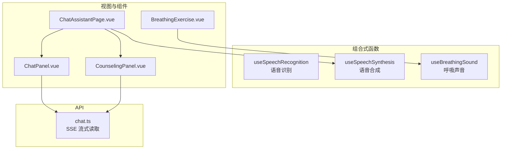
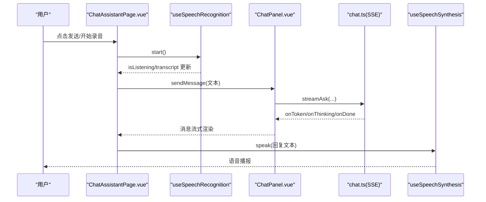
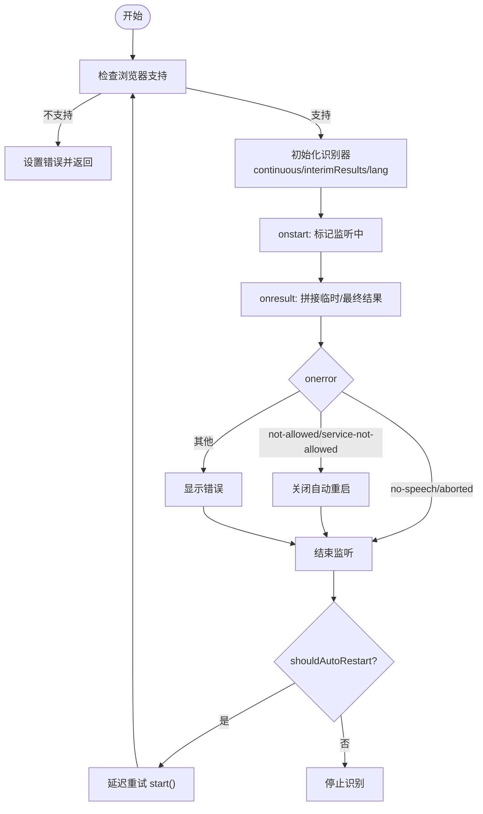
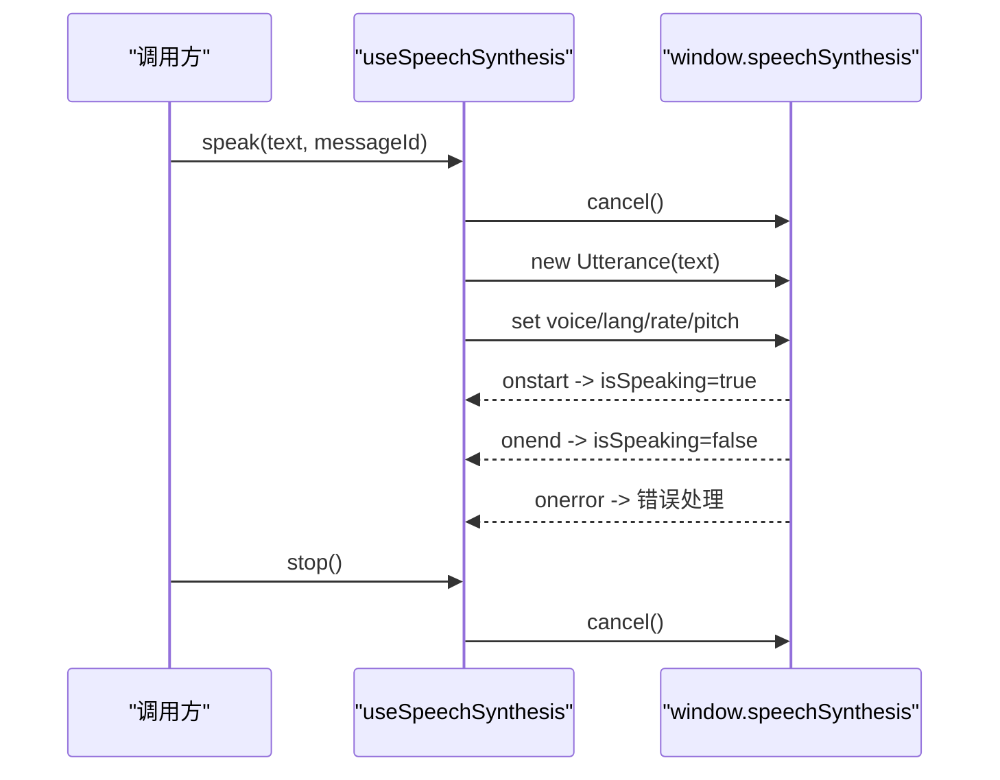
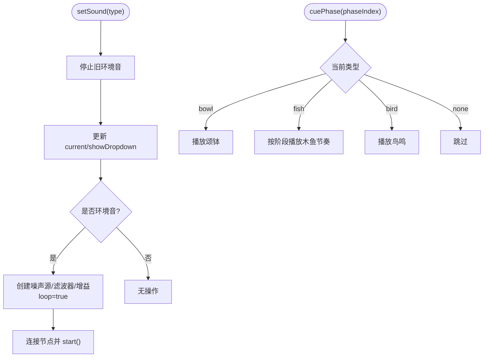
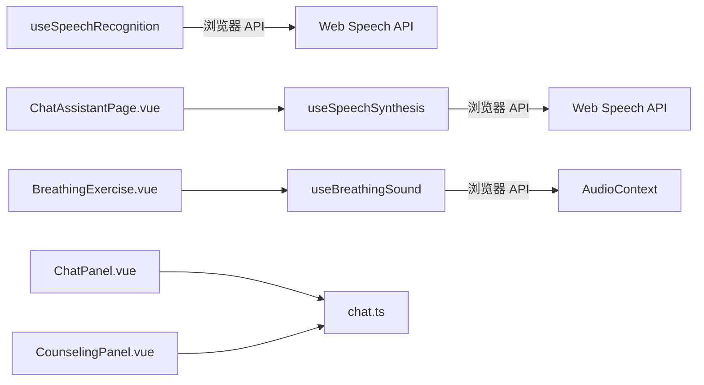

# 语音处理组合式函数

<cite>
**本文引用的文件**
- [useSpeechRecognition.ts](file://web/app/src/composables/useSpeechRecognition.ts)
- [useSpeechSynthesis.ts](file://web/app/src/composables/useSpeechSynthesis.ts)
- [useBreathingSound.ts](file://web/app/src/composables/useBreathingSound.ts)
- [BreathingExercise.vue](file://web/app/src/components/assistant/BreathingExercise.vue)
- [ChatAssistantPage.vue](file://web/app/src/views/ChatAssistantPage.vue)
- [ChatPanel.vue](file://web/app/src/components/assistant/ChatPanel.vue)
- [CounselingPanel.vue](file://web/app/src/components/assistant/CounselingPanel.vue)
- [chat.ts](file://web/app/src/api/chat.ts)
</cite>

## 目录
1. [简介](#简介)
2. [项目结构](#项目结构)
3. [核心组件](#核心组件)
4. [架构总览](#架构总览)
5. [详细组件分析](#详细组件分析)
6. [依赖关系分析](#依赖关系分析)
7. [性能与优化](#性能与优化)
8. [故障排查指南](#故障排查指南)
9. [结论](#结论)
10. [附录](#附录)

## 简介
本文件面向前端“语音处理组合式函数”的完整实现，覆盖以下能力：
- 语音识别（Web Speech API）：实时转录、自动重启、错误提示、权限引导。
- 语音合成（TTS）：中文语音选择、播放控制、错误处理。
- 呼吸声音处理：白噪声/粉红噪声/棕色噪声生成、环境音循环、节拍提示音、LFO调制等。
同时给出多语言支持策略、降噪思路、准确率优化建议、用户体验改进、权限管理、错误处理、性能监控与浏览器兼容性说明。

## 项目结构
围绕语音能力的核心文件分布如下：
- 组合式函数（composables）
  - useSpeechRecognition.ts：封装 Web Speech API 的语音识别，提供 start/stop/reset、实时转录、自动重启与错误状态。
  - useSpeechSynthesis.ts：封装 Web Speech API 的语音合成，提供 speak/stop、中文语音选择与播放状态。
  - useBreathingSound.ts：基于 AudioContext 的音频合成，提供环境音（雨声/溪流/风声）、正念节拍提示（木鱼/颂钵/鸟鸣）与生命周期管理。
- 视图与组件（views/components）
  - ChatAssistantPage.vue：聊天页面入口，集成 TTS 播报能力。
  - ChatPanel.vue / CounselingPanel.vue：对话面板，承载流式响应与交互。
  - BreathingExercise.vue：正念呼吸练习，调用 useBreathingSound 进行节拍提示与环境音。
- API 层（api）
  - chat.ts：SSE 流式读取与错误友好化，支撑对话体验。

图表来源
- [useSpeechRecognition.ts:41-161](file://web/app/src/composables/useSpeechRecognition.ts#L41-L161)
- [useSpeechSynthesis.ts:3-100](file://web/app/src/composables/useSpeechSynthesis.ts#L3-L100)
- [useBreathingSound.ts:197-223](file://web/app/src/composables/useBreathingSound.ts#L197-L223)
- [ChatAssistantPage.vue:1-20](file://web/app/src/views/ChatAssistantPage.vue#L1-L20)
- [ChatPanel.vue:17-54](file://web/app/src/components/assistant/ChatPanel.vue#L17-L54)
- [CounselingPanel.vue:21-40](file://web/app/src/components/assistant/CounselingPanel.vue#L21-L40)
- [chat.ts:168-271](file://web/app/src/api/chat.ts#L168-L271)

章节来源
- [useSpeechRecognition.ts:41-161](file://web/app/src/composables/useSpeechRecognition.ts#L41-L161)
- [useSpeechSynthesis.ts:3-100](file://web/app/src/composables/useSpeechSynthesis.ts#L3-L100)
- [useBreathingSound.ts:197-223](file://web/app/src/composables/useBreathingSound.ts#L197-L223)
- [ChatAssistantPage.vue:1-20](file://web/app/src/views/ChatAssistantPage.vue#L1-L20)
- [ChatPanel.vue:17-54](file://web/app/src/components/assistant/ChatPanel.vue#L17-L54)
- [CounselingPanel.vue:21-40](file://web/app/src/components/assistant/CounselingPanel.vue#L21-L40)
- [chat.ts:168-271](file://web/app/src/api/chat.ts#L168-L271)

## 核心组件
- 语音识别组合式函数
  - 能力：检测浏览器支持、启动/停止识别、实时拼接结果、自动重启、错误分类与用户提示、卸载时清理。
  - 关键点：continuous=true、interimResults=true、lang=zh-CN；对 no-speech/aborted 静默处理；not-allowed/service-not-allowed 关闭自动重启。
- 语音合成组合式函数
  - 能力：检测浏览器支持、选择中文语音、播放/停止、错误处理、卸载时清理。
  - 关键点：优先匹配 zh/cmn 语音；onstart/onend/onerror 管理播放状态。
- 呼吸声音组合式函数
  - 能力：创建 AudioContext、生成白/粉/棕噪声、构建环境音循环、按阶段触发节拍提示音（木鱼/颂钵/鸟鸣）、统一清理。
  - 关键点：LFO 调制风噪、带通/低通滤波塑造音色、节点安全断开与停止。

章节来源
- [useSpeechRecognition.ts:41-161](file://web/app/src/composables/useSpeechRecognition.ts#L41-L161)
- [useSpeechSynthesis.ts:3-100](file://web/app/src/composables/useSpeechSynthesis.ts#L3-L100)
- [useBreathingSound.ts:18-56](file://web/app/src/composables/useBreathingSound.ts#L18-L56)
- [useBreathingSound.ts:58-119](file://web/app/src/composables/useBreathingSound.ts#L58-L119)
- [useBreathingSound.ts:144-193](file://web/app/src/composables/useBreathingSound.ts#L144-L193)
- [useBreathingSound.ts:197-223](file://web/app/src/composables/useBreathingSound.ts#L197-L223)

## 架构总览
整体数据与控制流如下：
- 用户在聊天或正念界面触发语音输入或播放。
- 语音识别将麦克风音频转为文本，实时更新到 UI。
- 对话通过 SSE 流式返回，UI 逐步渲染。
- 可选使用语音合成功能朗读助手回复。
- 正念呼吸过程中，根据阶段播放节拍提示与环境音。

图表来源
- [ChatAssistantPage.vue:1-20](file://web/app/src/views/ChatAssistantPage.vue#L1-L20)
- [useSpeechRecognition.ts:41-161](file://web/app/src/composables/useSpeechRecognition.ts#L41-L161)
- [ChatPanel.vue:17-54](file://web/app/src/components/assistant/ChatPanel.vue#L17-L54)
- [chat.ts:168-271](file://web/app/src/api/chat.ts#L168-L271)
- [useSpeechSynthesis.ts:3-100](file://web/app/src/composables/useSpeechSynthesis.ts#L3-L100)

## 详细组件分析

### 语音识别组合式函数（useSpeechRecognition）
- 设计要点
  - 兼容标准与 webkit 前缀，计算是否支持。
  - 启用 continuous 与 interimResults，设置 lang 为 zh-CN。
  - 事件回调：onstart/onresult/onerror/onend，维护 isListening、transcript、error。
  - 自动重启：onend 中延迟尝试 restart，避免频繁重启；遇到 not-allowed/service-not-allowed 关闭自动重启。
  - 生命周期：组件卸载时 stop。
- 错误处理
  - no-speech/aborted 视为良性不提示。
  - not-allowed/service-not-allowed 明确提示并停止自动重启。
  - 其他错误透传友好文案。
- 复杂度
  - 时间复杂度：每次结果遍历 event.results，O(n)。
  - 空间复杂度：transcript 字符串累积增长。

图表来源
- [useSpeechRecognition.ts:41-161](file://web/app/src/composables/useSpeechRecognition.ts#L41-L161)

章节来源
- [useSpeechRecognition.ts:41-161](file://web/app/src/composables/useSpeechRecognition.ts#L41-L161)

### 语音合成组合式函数（useSpeechSynthesis）
- 设计要点
  - 检测 speechSynthesis 支持。
  - 选择中文语音（zh/cmn），否则回退到首个可用语音。
  - 播放流程：构造 Utterance，设置 lang/rate/pitch，绑定 onstart/onend/onerror。
  - 停止流程：cancel 并重置状态。
  - 生命周期：卸载时停止。
- 错误处理
  - canceled 忽略，其他错误提示。
- 复杂度
  - 时间复杂度：O(1) 主要操作。
  - 空间复杂度：O(1)。

图表来源
- [useSpeechSynthesis.ts:3-100](file://web/app/src/composables/useSpeechSynthesis.ts#L3-L100)

章节来源
- [useSpeechSynthesis.ts:3-100](file://web/app/src/composables/useSpeechSynthesis.ts#L3-L100)

### 呼吸声音组合式函数（useBreathingSound）
- 设计要点
  - 全局 AudioContext 单例，必要时 resume。
  - 噪声缓冲：白噪声、粉红噪声（递归滤波）、棕色噪声（积分平滑）。
  - 环境音：rain/stream/wind，分别用 bandpass/lowpass/LFO 塑造听感。
  - 节拍提示：木鱼（正弦+带通噪声）、颂钵（多频叠加衰减）、鸟鸣（频率扫描）。
  - 阶段提示：根据 phaseIndex 播放不同节奏。
  - 清理：停止所有节点并断开连接，关闭 AudioContext。
- 复杂度
  - 时间复杂度：创建 Buffer 为 O(N)，N 为采样点数（约 4s × 采样率）。
  - 空间复杂度：O(N) 存储噪声缓冲。

图表来源
- [useBreathingSound.ts:18-56](file://web/app/src/composables/useBreathingSound.ts#L18-L56)
- [useBreathingSound.ts:58-119](file://web/app/src/composables/useBreathingSound.ts#L58-L119)
- [useBreathingSound.ts:144-193](file://web/app/src/composables/useBreathingSound.ts#L144-L193)
- [useBreathingSound.ts:197-223](file://web/app/src/composables/useBreathingSound.ts#L197-L223)

章节来源
- [useBreathingSound.ts:18-56](file://web/app/src/composables/useBreathingSound.ts#L18-L56)
- [useBreathingSound.ts:58-119](file://web/app/src/composables/useBreathingSound.ts#L58-L119)
- [useBreathingSound.ts:144-193](file://web/app/src/composables/useBreathingSound.ts#L144-L193)
- [useBreathingSound.ts:197-223](file://web/app/src/composables/useBreathingSound.ts#L197-L223)

### 正念呼吸组件（BreathingExercise.vue）
- 功能
  - 三阶段动画（吸气/屏息/呼气），周期计数与时长统计。
  - 每阶段切换时调用 sound.cuePhase 播放节拍提示。
  - 结束后支持分享到社区。
- 资源清理
  - 组件卸载时取消动画帧并调用 sound.cleanup。

章节来源
- [BreathingExercise.vue:1-118](file://web/app/src/components/assistant/BreathingExercise.vue#L1-L118)
- [BreathingExercise.vue:121-204](file://web/app/src/components/assistant/BreathingExercise.vue#L121-L204)

### 聊天面板与流式响应（ChatPanel.vue / CounselingPanel.vue）
- 功能
  - 发送消息后建立 SSE 连接，逐步接收 thinking/token/action_card/done。
  - 骨架消息与流式渲染，错误友好化处理。
  - 知心陪伴模式包含危机关键词检测与资源提示。
- 与语音能力结合
  - 在聊天页可集成 TTS 播报助手回复（由页面级逻辑驱动）。

章节来源
- [ChatPanel.vue:17-54](file://web/app/src/components/assistant/ChatPanel.vue#L17-L54)
- [CounselingPanel.vue:21-40](file://web/app/src/components/assistant/CounselingPanel.vue#L21-L40)
- [chat.ts:168-271](file://web/app/src/api/chat.ts#L168-L271)

## 依赖关系分析
- 组合式函数之间松耦合，通过 Vue 组件按需引入。
- 语音识别与合成均依赖浏览器 Web API，需做特性检测与降级。
- 呼吸声音依赖 AudioContext，注意移动端首次交互后才能恢复上下文。
- 聊天流式能力依赖 SSEStreamReader，具备取消与错误友好化。

图表来源
- [useSpeechRecognition.ts:41-161](file://web/app/src/composables/useSpeechRecognition.ts#L41-L161)
- [useSpeechSynthesis.ts:3-100](file://web/app/src/composables/useSpeechSynthesis.ts#L3-L100)
- [useBreathingSound.ts:197-223](file://web/app/src/composables/useBreathingSound.ts#L197-L223)
- [ChatPanel.vue:17-54](file://web/app/src/components/assistant/ChatPanel.vue#L17-L54)
- [CounselingPanel.vue:21-40](file://web/app/src/components/assistant/CounselingPanel.vue#L21-L40)
- [chat.ts:168-271](file://web/app/src/api/chat.ts#L168-L271)

章节来源
- [useSpeechRecognition.ts:41-161](file://web/app/src/composables/useSpeechRecognition.ts#L41-L161)
- [useSpeechSynthesis.ts:3-100](file://web/app/src/composables/useSpeechSynthesis.ts#L3-L100)
- [useBreathingSound.ts:197-223](file://web/app/src/composables/useBreathingSound.ts#L197-L223)
- [ChatPanel.vue:17-54](file://web/app/src/components/assistant/ChatPanel.vue#L17-L54)
- [CounselingPanel.vue:21-40](file://web/app/src/components/assistant/CounselingPanel.vue#L21-L40)
- [chat.ts:168-271](file://web/app/src/api/chat.ts#L168-L271)

## 性能与优化
- 语音识别
  - 使用 interimResults 提升实时性；合并结果时仅追加新片段，避免全量重拼。
  - 自动重启间隔已内置防抖，避免频繁 start/stop 造成抖动。
  - 建议在静音段降低采样或暂停识别以节省电量（可扩展）。
- 语音合成
  - 复用 voices 列表，避免重复查询；仅在 voiceschanged 时刷新。
  - 合理设置 rate/pitch，避免极端值导致卡顿。
- 呼吸声音
  - 噪声缓冲长度固定为 4 秒，兼顾内存与无缝循环。
  - 环境音使用 loop 与低开销滤波器，避免过多振荡器。
  - LFO 频率较低，CPU 占用可控。
- 流式对话
  - SSE 分块解析，增量渲染，减少首屏等待。
  - 错误友好化与中断机制，提升稳定性。

[本节为通用指导，不直接分析具体文件]

## 故障排查指南
- 语音识别
  - 现象：无法启动或立即停止。
  - 排查：确认浏览器支持、HTTPS 环境、麦克风权限；查看 error 是否为 not-allowed/service-not-allowed。
  - 参考路径：[useSpeechRecognition.ts:75-104](file://web/app/src/composables/useSpeechRecognition.ts#L75-L104)
- 语音合成
  - 现象：无声或报错。
  - 排查：检查 voices 是否存在中文；确认未处于被系统限制状态；关注 onerror 事件。
  - 参考路径：[useSpeechSynthesis.ts:12-67](file://web/app/src/composables/useSpeechSynthesis.ts#L12-L67)
- 呼吸声音
  - 现象：无声或爆音。
  - 排查：确认 AudioContext 已 resume；检查节点是否正确连接与停止；避免重复创建导致冲突。
  - 参考路径：[useBreathingSound.ts:18-22](file://web/app/src/composables/useBreathingSound.ts#L18-L22), [useBreathingSound.ts:187-193](file://web/app/src/composables/useBreathingSound.ts#L187-L193)
- 流式对话
  - 现象：长时间无响应或错误。
  - 排查：网络连通性、服务端状态、SSE 读取异常；查看 toFriendlyError 映射。
  - 参考路径：[chat.ts:131-149](file://web/app/src/api/chat.ts#L131-L149), [chat.ts:230-261](file://web/app/src/api/chat.ts#L230-L261)

章节来源
- [useSpeechRecognition.ts:75-104](file://web/app/src/composables/useSpeechRecognition.ts#L75-L104)
- [useSpeechSynthesis.ts:12-67](file://web/app/src/composables/useSpeechSynthesis.ts#L12-L67)
- [useBreathingSound.ts:18-22](file://web/app/src/composables/useBreathingSound.ts#L18-L22)
- [useBreathingSound.ts:187-193](file://web/app/src/composables/useBreathingSound.ts#L187-L193)
- [chat.ts:131-149](file://web/app/src/api/chat.ts#L131-L149)
- [chat.ts:230-261](file://web/app/src/api/chat.ts#L230-L261)

## 结论
本项目在前端实现了完整的语音处理组合式能力：
- 语音识别：稳定、容错、自动重启，适合实时转录场景。
- 语音合成：中文语音优先，播放控制完善，便于增强可读性与无障碍体验。
- 呼吸声音：高质量环境音与节拍提示，配合正念练习提升用户体验。
结合流式对话与完善的错误处理，整体具备良好的鲁棒性与可维护性。后续可在降噪、多语言、性能监控方面持续优化。

[本节为总结，不直接分析具体文件]

## 附录
- 多语言支持
  - 语音识别：可将 lang 配置为多语言代码（如 en-US、ja-JP），并在 UI 中提供语言切换。
  - 语音合成：voices 列表中包含多语种，可按需选择。
- 噪声过滤与准确率优化
  - 前端：在识别前增加静音检测与增益控制；在嘈杂环境提示用户靠近麦克风。
  - 后端：结合 ASR 服务的质量参数与热词表提升准确率。
- 权限管理
  - 首次访问请求麦克风权限；拒绝后提供引导与重试入口。
- 错误处理
  - 统一错误映射与用户友好文案，避免暴露技术细节。
- 性能监控
  - 记录识别/合成/音频处理的耗时与失败率，用于持续优化。
- 浏览器兼容性
  - 使用特性检测与 polyfill 策略；在不支持的浏览器中降级为文本输入。

[本节为通用指导，不直接分析具体文件]