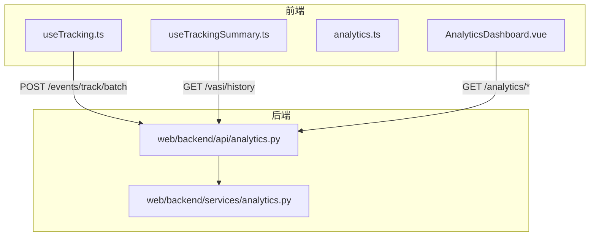
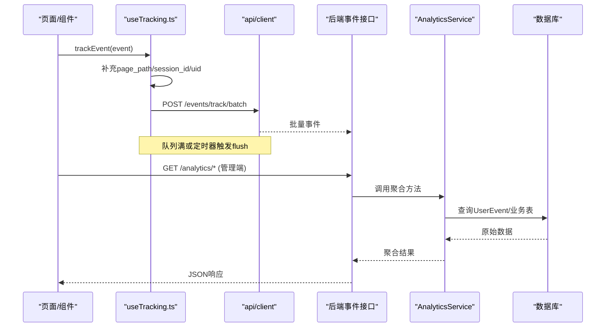
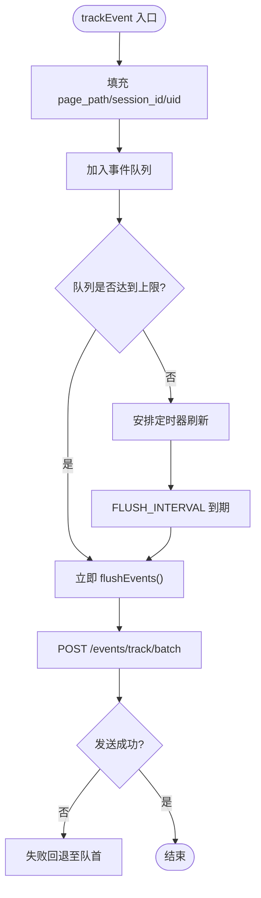
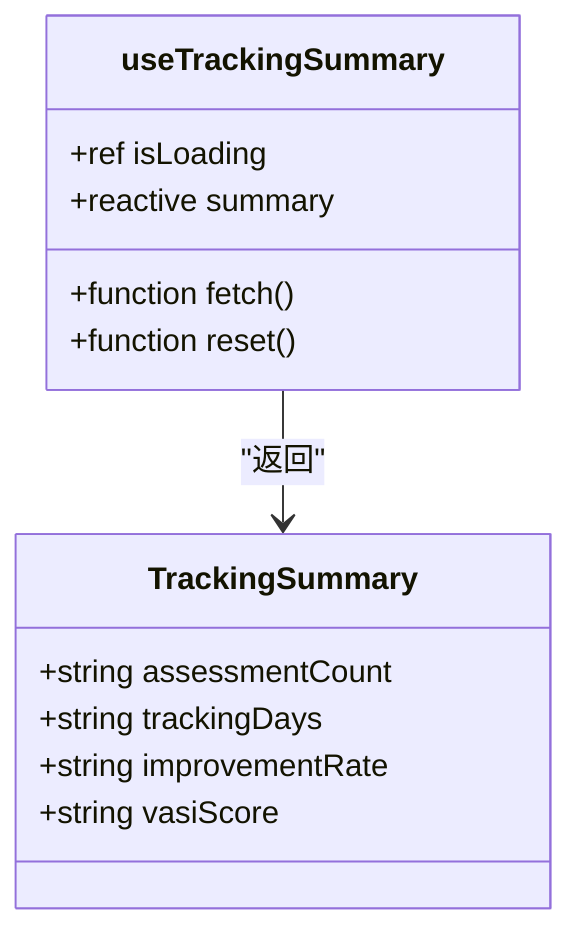
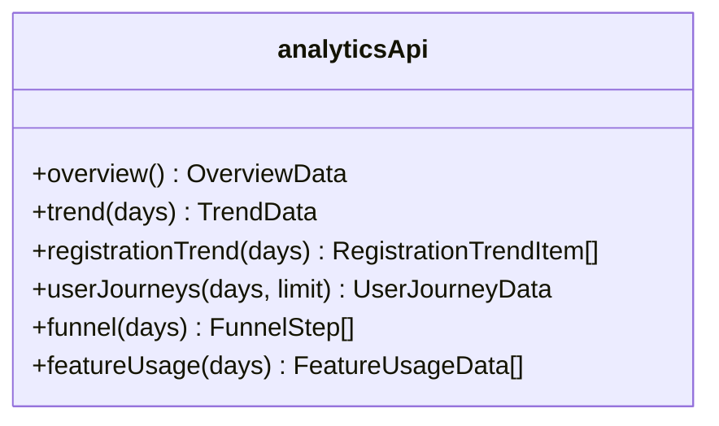
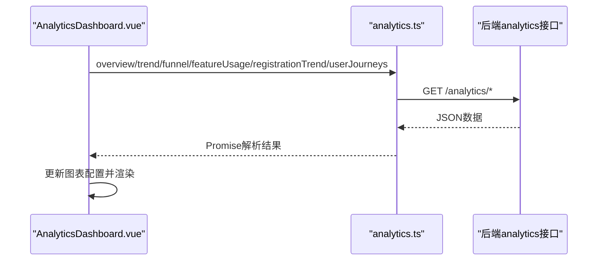
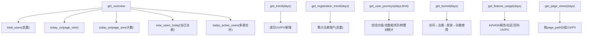
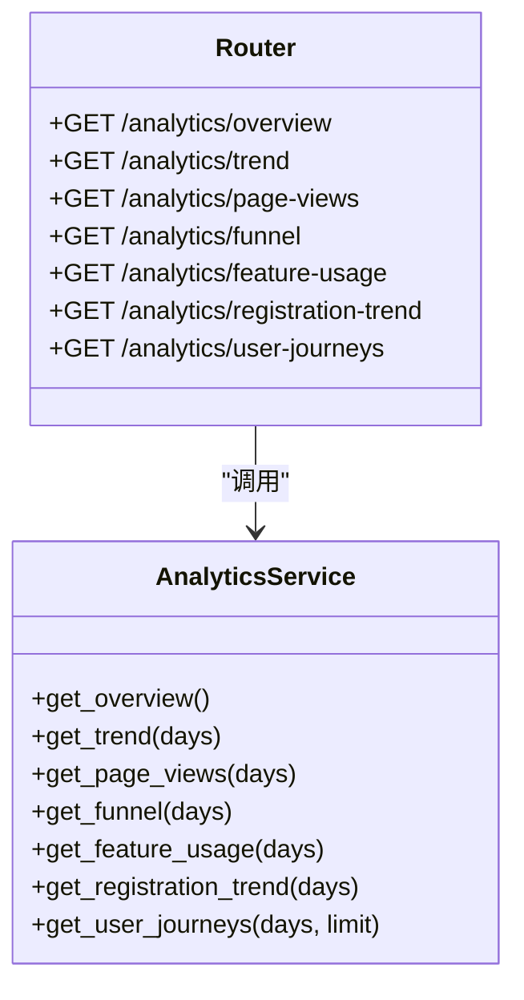
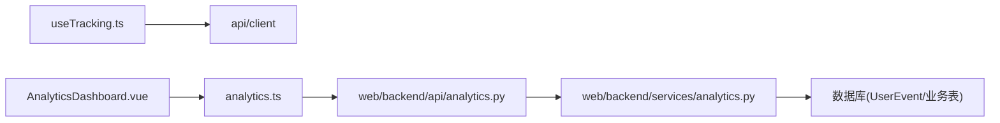

# 追踪统计组合式函数

<cite>
**本文引用的文件**   
- [useTracking.ts](file://web/app/src/composables/useTracking.ts)
- [useTrackingSummary.ts](file://web/app/src/composables/useTrackingSummary.ts)
- [analytics.ts](file://web/app/src/api/analytics.ts)
- [AnalyticsDashboard.vue](file://web/app/src/components/analytics/AnalyticsDashboard.vue)
- [analytics.py](file://web/backend/services/analytics.py)
- [analytics.py](file://web/backend/api/analytics.py)
</cite>

## 目录
1. [简介](#简介)
2. [项目结构](#项目结构)
3. [核心组件](#核心组件)
4. [架构总览](#架构总览)
5. [详细组件分析](#详细组件分析)
6. [依赖关系分析](#依赖关系分析)
7. [性能考量](#性能考量)
8. [故障排查指南](#故障排查指南)
9. [结论](#结论)
10. [附录](#附录)

## 简介
本文件围绕“追踪统计组合式函数”展开，系统性阐述用户行为追踪、数据统计分析与历史记录管理的实现。内容覆盖埋点采集、数据聚合、趋势分析、可视化展示、隐私保护、数据导出、性能优化与用户体验改进，并给出配置选项、事件监听、数据同步与错误处理机制的落地方案。

## 项目结构
前端通过组合式函数完成事件埋点与汇总，后端提供统计分析接口与聚合服务，管理端页面负责可视化展示。关键路径如下：
- 前端埋点：useTracking.ts（会话ID、事件队列、批量上报）
- 前端汇总：useTrackingSummary.ts（VASI历史摘要计算）
- 前端API：analytics.ts（概览、趋势、注册趋势、用户动线、漏斗、功能使用）
- 前端看板：AnalyticsDashboard.vue（ECharts图表渲染与交互）
- 后端服务：analytics.py（聚合计算、过滤策略、指标口径）
- 后端接口：analytics.py（FastAPI路由、参数校验、权限控制）

**图示来源** 
- [useTracking.ts:1-110](file://web/app/src/composables/useTracking.ts#L1-L110)
- [useTrackingSummary.ts:1-91](file://web/app/src/composables/useTrackingSummary.ts#L1-L91)
- [analytics.ts:1-78](file://web/app/src/api/analytics.ts#L1-L78)
- [AnalyticsDashboard.vue:1-374](file://web/app/src/components/analytics/AnalyticsDashboard.vue#L1-L374)
- [analytics.py:1-88](file://web/backend/api/analytics.py#L1-L88)
- [analytics.py:1-667](file://web/backend/services/analytics.py#L1-L667)

**章节来源**
- [useTracking.ts:1-110](file://web/app/src/composables/useTracking.ts#L1-L110)
- [useTrackingSummary.ts:1-91](file://web/app/src/composables/useTrackingSummary.ts#L1-L91)
- [analytics.ts:1-78](file://web/app/src/api/analytics.ts#L1-L78)
- [AnalyticsDashboard.vue:1-374](file://web/app/src/components/analytics/AnalyticsDashboard.vue#L1-L374)
- [analytics.py:1-88](file://web/backend/api/analytics.py#L1-L88)
- [analytics.py:1-667](file://web/backend/services/analytics.py#L1-L667)

## 核心组件
- 事件埋点与上报：会话ID持久化、事件队列与定时刷新、失败重试、匿名与登录态融合。
- 历史摘要：基于VASI评估历史计算跟踪天数、改善率、最新分数等。
- 分析API：概览、趋势、注册趋势、用户动线、漏斗、功能使用、页面访问分布。
- 管理看板：多图表联动、周期切换、暗色主题适配、自动刷新。

**章节来源**
- [useTracking.ts:1-110](file://web/app/src/composables/useTracking.ts#L1-L110)
- [useTrackingSummary.ts:1-91](file://web/app/src/composables/useTrackingSummary.ts#L1-L91)
- [analytics.ts:1-78](file://web/app/src/api/analytics.ts#L1-L78)
- [AnalyticsDashboard.vue:1-374](file://web/app/src/components/analytics/AnalyticsDashboard.vue#L1-L374)
- [analytics.py:1-667](file://web/backend/services/analytics.py#L1-L667)
- [analytics.py:1-88](file://web/backend/api/analytics.py#L1-L88)

## 架构总览
整体采用“前端埋点 + 后端聚合 + 管理看板”的分层架构。前端以组合式函数封装埋点能力，统一事件格式；后端按业务域聚合指标，提供REST接口；管理端通过ECharts进行可视化呈现。

**图示来源** 
- [useTracking.ts:1-110](file://web/app/src/composables/useTracking.ts#L1-L110)
- [analytics.py:1-88](file://web/backend/api/analytics.py#L1-L88)
- [analytics.py:1-667](file://web/backend/services/analytics.py#L1-L667)

## 详细组件分析

### 事件埋点组合式函数 useTracking.ts
- 会话管理：生成并缓存session_id，支持重置。
- 事件模型：event_type、element_id、page_path、element_text、extra_data、session_id。
- 队列与刷新：最大队列长度限制、定时刷新、失败回退。
- 登录态融合：从认证store注入uid到extra_data。
- 便捷方法：trackPageView、trackClick、trackInput、flushTracking、resetSessionId。

**图示来源** 
- [useTracking.ts:1-110](file://web/app/src/composables/useTracking.ts#L1-L110)

**章节来源**
- [useTracking.ts:1-110](file://web/app/src/composables/useTracking.ts#L1-L110)

### 历史摘要组合式函数 useTrackingSummary.ts
- 输入：VASI评估历史列表。
- 输出：assessmentCount、trackingDays、improvementRate、vasiScore。
- 逻辑：去重时间戳计算跟踪天数；首尾评分差值计算改善率；最新评分格式化。
- 状态：isLoading、summary、fetch、reset。

**图示来源** 
- [useTrackingSummary.ts:1-91](file://web/app/src/composables/useTrackingSummary.ts#L1-L91)

**章节来源**
- [useTrackingSummary.ts:1-91](file://web/app/src/composables/useTrackingSummary.ts#L1-L91)

### 分析API定义 analytics.ts
- 类型定义：OverviewData、TrendData、RegistrationTrendItem、UserJourneyData、FunnelStep、FeatureUsageData。
- 接口方法：overview、trend、registrationTrend、userJourneys、funnel、featureUsage。
- 请求封装：统一通过apiClient发起GET请求，携带分页/周期参数。

**图示来源** 
- [analytics.ts:1-78](file://web/app/src/api/analytics.ts#L1-L78)

**章节来源**
- [analytics.ts:1-78](file://web/app/src/api/analytics.ts#L1-L78)

### 管理看板 AnalyticsDashboard.vue
- 指标卡片：北极星累计注册用户、今日UV/PV/活跃。
- 图表：注册趋势（面积+柱状）、UV/PV趋势（双轴折线）、功能使用（横向条形）、转化漏斗（漏斗图）。
- 交互：周期切换（7天/30天）、暗色主题自适应、窗口resize自适应、定时刷新。
- 数据源：Promise.all并发拉取各接口，异常容错降级为空数组/null。

**图示来源** 
- [AnalyticsDashboard.vue:1-374](file://web/app/src/components/analytics/AnalyticsDashboard.vue#L1-L374)
- [analytics.ts:1-78](file://web/app/src/api/analytics.ts#L1-L78)

**章节来源**
- [AnalyticsDashboard.vue:1-374](file://web/app/src/components/analytics/AnalyticsDashboard.vue#L1-L374)

### 后端聚合服务 analytics.py（服务层）
- 过滤策略：排除测试账号、管理员、特定手机号；保留匿名访客用于UV/动线统计。
- 指标口径：
  - 概览：total_users、today_uv、today_pv、new_users_today、today_active_users。
  - 趋势：按日UV/PV/新增用户。
  - 注册趋势：累计注册用户（去重）。
  - 用户动线：基于page_view事件构建Sankey节点与边，Top路径统计。
  - 漏斗：访问UV→注册用户→登录UV→使用功能UV。
  - 功能使用：AI问答、VASI评估、体检报告上传、发帖、评论、点赞、百科浏览。
  - 页面访问：按page_path分组UV/PV。
- 辅助：页名映射、日期边界、时区处理。

**图示来源** 
- [analytics.py:1-667](file://web/backend/services/analytics.py#L1-L667)

**章节来源**
- [analytics.py:1-667](file://web/backend/services/analytics.py#L1-L667)

### 后端接口 analytics.py（路由层）
- 路由：/analytics/overview、/analytics/trend、/analytics/page-views、/analytics/funnel、/analytics/feature-usage、/analytics/registration-trend、/analytics/user-journeys。
- 鉴权：依赖管理员认证。
- 参数：days、limit等范围校验。

**图示来源** 
- [analytics.py:1-88](file://web/backend/api/analytics.py#L1-L88)
- [analytics.py:1-667](file://web/backend/services/analytics.py#L1-L667)

**章节来源**
- [analytics.py:1-88](file://web/backend/api/analytics.py#L1-L88)
- [analytics.py:1-667](file://web/backend/services/analytics.py#L1-L667)

## 依赖关系分析
- 前端埋点依赖认证store获取uid，依赖client发起HTTP请求。
- 管理看板依赖analytics.ts定义的接口类型与方法。
- 后端路由依赖数据库会话与管理员鉴权。
- 聚合服务依赖多张业务表与UserEvent事件表。

**图示来源** 
- [useTracking.ts:1-110](file://web/app/src/composables/useTracking.ts#L1-L110)
- [analytics.ts:1-78](file://web/app/src/api/analytics.ts#L1-L78)
- [analytics.py:1-88](file://web/backend/api/analytics.py#L1-L88)
- [analytics.py:1-667](file://web/backend/services/analytics.py#L1-L667)

**章节来源**
- [useTracking.ts:1-110](file://web/app/src/composables/useTracking.ts#L1-L110)
- [analytics.ts:1-78](file://web/app/src/api/analytics.ts#L1-L78)
- [analytics.py:1-88](file://web/backend/api/analytics.py#L1-L88)
- [analytics.py:1-667](file://web/backend/services/analytics.py#L1-L667)

## 性能考量
- 前端埋点：
  - 批量上报与定时器刷新降低网络开销。
  - 队列上限避免内存膨胀。
  - 失败回退保证数据不丢失。
- 后端聚合：
  - 按日循环查询，注意索引与分页限制。
  - 多源活跃用户合并采用集合去重减少重复计算。
  - 用户动线构建先分组再统计，限制links数量。
- 前端看板：
  - 并发请求缩短加载时间。
  - 图表按需初始化与销毁，避免内存泄漏。
  - 暗色主题与resize监听提升体验。

[本节为通用指导，无需具体文件引用]

## 故障排查指南
- 埋点未上报：
  - 检查队列是否达到上限或定时器是否触发。
  - 确认网络请求是否被拦截或跨域问题。
  - 查看失败回退逻辑是否正确将事件放回队首。
- 指标异常：
  - 核对过滤策略（测试账号、管理员、手机号白名单）。
  - 确认page_path命名规范与页名映射是否生效。
  - 检查UserEvent.event_type是否为page_view/login_success/click等。
- 看板不更新：
  - 检查接口返回数据结构是否与类型定义一致。
  - 确认图表实例是否被正确初始化与销毁。
  - 验证周期切换watch是否触发对应API调用。

**章节来源**
- [useTracking.ts:1-110](file://web/app/src/composables/useTracking.ts#L1-L110)
- [analytics.py:1-667](file://web/backend/services/analytics.py#L1-L667)
- [AnalyticsDashboard.vue:1-374](file://web/app/src/components/analytics/AnalyticsDashboard.vue#L1-L374)

## 结论
本方案通过组合式函数将埋点与汇总能力解耦，配合后端聚合服务与管理看板，形成完整的用户行为追踪与统计分析闭环。在隐私保护、性能优化与用户体验方面均有明确实践，可支撑产品运营与决策分析。

[本节为总结性内容，无需具体文件引用]

## 附录

### 配置选项与扩展
- 环境变量：EXCLUDED_PHONES（排除手机号集合），默认包含测试号段。
- 页名映射：shared/page-names.json作为页面名称唯一来源。
- 埋点常量：FEATURE_USE_ELEMENT_IDS用于功能使用统计。

**章节来源**
- [analytics.py:1-667](file://web/backend/services/analytics.py#L1-L667)

### 隐私保护与数据导出
- 隐私保护：
  - 匿名事件保留用于UV与动线统计，但不过度关联个人标识。
  - 管理员与测试账号排除，避免污染真实指标。
- 数据导出：
  - 可通过后端聚合接口导出数据集，结合外部工具进行二次分析。
  - 建议对敏感字段脱敏后再导出。

**章节来源**
- [analytics.py:1-667](file://web/backend/services/analytics.py#L1-L667)

### 事件监听与数据同步
- 事件监听：trackClick、trackInput、trackPageView提供便捷埋点。
- 数据同步：批量上报与失败回退确保最终一致性。
- 会话同步：session_id跨页面共享，便于会话级分析。

**章节来源**
- [useTracking.ts:1-110](file://web/app/src/composables/useTracking.ts#L1-L110)

### 错误处理机制
- 前端：try/catch捕获store初始化异常；网络失败回退队列。
- 后端：参数校验与范围限制；异常返回空集合或默认值。
- 看板：Promise.all并发容错，单个接口失败不影响其他图表。

**章节来源**
- [useTracking.ts:1-110](file://web/app/src/composables/useTracking.ts#L1-L110)
- [analytics.py:1-88](file://web/backend/api/analytics.py#L1-L88)
- [AnalyticsDashboard.vue:1-374](file://web/app/src/components/analytics/AnalyticsDashboard.vue#L1-L374)