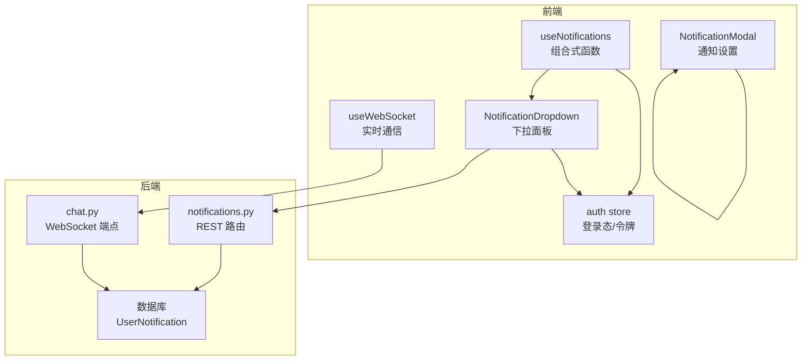
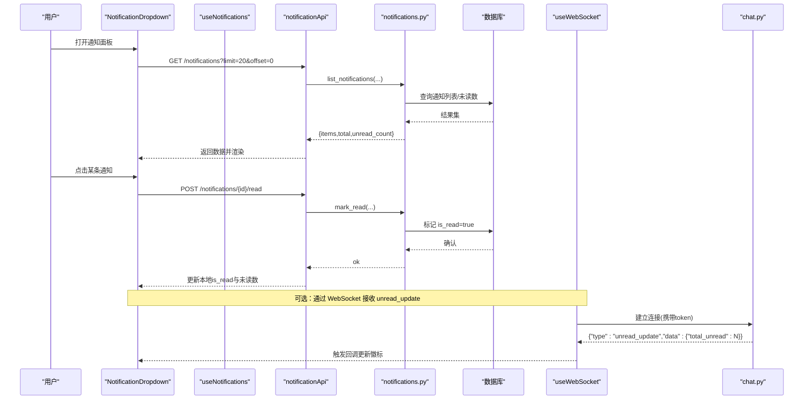
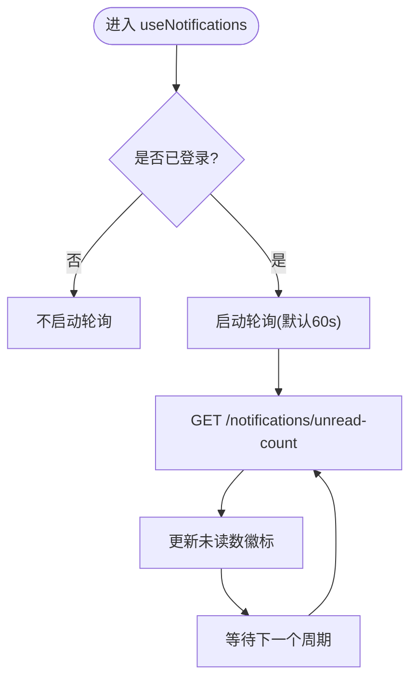
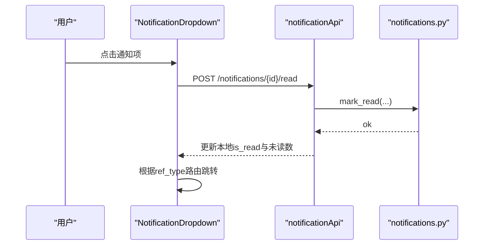
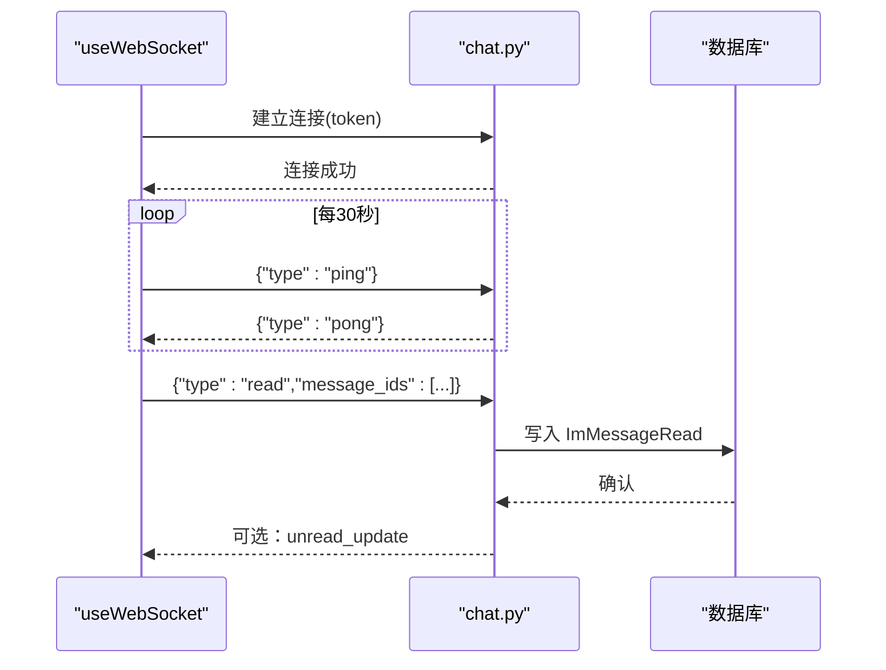
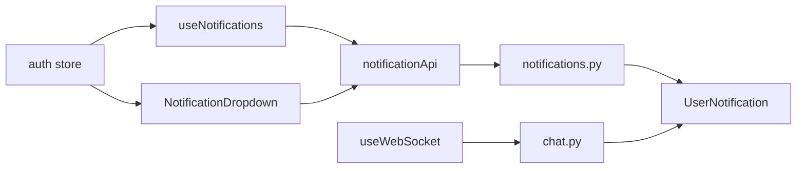

# 通知系统组合式函数

<cite>
**本文引用的文件**
- [web/app/src/composables/useNotifications.ts](file://web/app/src/composables/useNotifications.ts)
- [web/app/src/api/notifications.ts](file://web/app/src/api/notifications.ts)
- [web/backend/api/notifications.py](file://web/backend/api/notifications.py)
- [web/app/src/components/layout/NotificationDropdown.vue](file://web/app/src/components/layout/NotificationDropdown.vue)
- [web/app/src/components/profile/NotificationModal.vue](file://web/app/src/components/profile/NotificationModal.vue)
- [web/app/src/composables/useWebSocket.ts](file://web/app/src/composables/useWebSocket.ts)
- [web/backend/ws/chat.py](file://web/backend/ws/chat.py)
- [web/app/src/stores/auth.ts](file://web/app/src/stores/auth.ts)
</cite>

## 目录
1. [简介](#简介)
2. [项目结构](#项目结构)
3. [核心组件](#核心组件)
4. [架构总览](#架构总览)
5. [详细组件分析](#详细组件分析)
6. [依赖关系分析](#依赖关系分析)
7. [性能与体验优化](#性能与体验优化)
8. [故障排查指南](#故障排查指南)
9. [结论](#结论)
10. [附录：配置与扩展](#附录：配置与扩展)

## 简介
本文件围绕前端组合式函数 useNotifications 的实现，系统化梳理通知系统的整体设计：消息拉取、未读数管理、已读标记、轮询刷新、下拉面板交互、后端 API 与数据库模型、以及 WebSocket 实时通信的集成点。同时给出通知类型、显示样式、点击跳转行为、持久化存储（本地设置）等说明，并提供队列与优先级、去重机制、用户体验优化的实践建议与落地方案。

## 项目结构
当前通知能力由“前端组合式函数 + UI 组件 + 前端 API 封装 + 后端路由 + 数据库模型 + WebSocket”共同构成：
- 前端组合式函数：useNotifications 提供状态与轮询能力；useWebSocket 提供连接、事件订阅与心跳。
- UI 组件：NotificationDropdown 展示通知列表与未读数；NotificationModal 提供用户侧通知偏好设置。
- 前端 API：notificationApi 封装 /notifications 系列接口。
- 后端 API：FastAPI 路由实现查询、计数、标记已读、全部已读。
- 数据库：UserNotification 模型承载通知数据。
- WebSocket：chat.py 提供连接管理与广播能力，当前用于聊天消息与阅读回执，可扩展为通知推送通道。

图表来源
- [web/app/src/composables/useNotifications.ts:1-89](file://web/app/src/composables/useNotifications.ts#L1-L89)
- [web/app/src/components/layout/NotificationDropdown.vue:1-260](file://web/app/src/components/layout/NotificationDropdown.vue#L1-L260)
- [web/app/src/components/profile/NotificationModal.vue:1-57](file://web/app/src/components/profile/NotificationModal.vue#L1-L57)
- [web/app/src/composables/useWebSocket.ts:1-75](file://web/app/src/composables/useWebSocket.ts#L1-L75)
- [web/backend/api/notifications.py:1-186](file://web/backend/api/notifications.py#L1-L186)
- [web/backend/ws/chat.py:1-111](file://web/backend/ws/chat.py#L1-L111)
- [web/app/src/stores/auth.ts:1-259](file://web/app/src/stores/auth.ts#L1-L259)

章节来源
- [web/app/src/composables/useNotifications.ts:1-89](file://web/app/src/composables/useNotifications.ts#L1-L89)
- [web/app/src/components/layout/NotificationDropdown.vue:1-260](file://web/app/src/components/layout/NotificationDropdown.vue#L1-L260)
- [web/app/src/components/profile/NotificationModal.vue:1-57](file://web/app/src/components/profile/NotificationModal.vue#L1-L57)
- [web/app/src/composables/useWebSocket.ts:1-75](file://web/app/src/composables/useWebSocket.ts#L1-L75)
- [web/backend/api/notifications.py:1-186](file://web/backend/api/notifications.py#L1-L186)
- [web/backend/ws/chat.py:1-111](file://web/backend/ws/chat.py#L1-L111)
- [web/app/src/stores/auth.ts:1-259](file://web/app/src/stores/auth.ts#L1-L259)

## 核心组件
- useNotifications：维护未读数、通知列表、加载态；提供获取列表、标记已读、轮询控制等方法；在挂载时根据登录态启动轮询，卸载时清理定时器。
- NotificationDropdown：下拉面板，负责渲染通知列表、未读数徽标、点击跳转、全部已读、动态定位与滚动监听。
- NotificationModal：本地通知偏好开关（评估提醒、社区互动、治疗进展），使用 localStorage 持久化。
- notificationApi：封装 /notifications、/notifications/unread-count、/notifications/{id}/read、/notifications/read-all。
- notifications.py：后端 REST 路由，支持分页、仅未读过滤、未读数统计、标记单条/全部已读。
- useWebSocket：通用 WebSocket 客户端，支持连接、心跳、事件订阅/取消、自动重连。
- chat.py：服务端 WebSocket 管理器，支持按用户发送消息、广播未读数更新（可扩展至通知）。

章节来源
- [web/app/src/composables/useNotifications.ts:1-89](file://web/app/src/composables/useNotifications.ts#L1-L89)
- [web/app/src/components/layout/NotificationDropdown.vue:1-260](file://web/app/src/components/layout/NotificationDropdown.vue#L1-L260)
- [web/app/src/components/profile/NotificationModal.vue:1-57](file://web/app/src/components/profile/NotificationModal.vue#L1-L57)
- [web/app/src/api/notifications.ts:1-42](file://web/app/src/api/notifications.ts#L1-L42)
- [web/backend/api/notifications.py:1-186](file://web/backend/api/notifications.py#L1-L186)
- [web/app/src/composables/useWebSocket.ts:1-75](file://web/app/src/composables/useWebSocket.ts#L1-L75)
- [web/backend/ws/chat.py:1-111](file://web/backend/ws/chat.py#L1-L111)

## 架构总览
下图展示了从用户操作到数据落库与前端更新的完整链路，包括轮询与可选的 WebSocket 实时路径。

图表来源
- [web/app/src/components/layout/NotificationDropdown.vue:80-122](file://web/app/src/components/layout/NotificationDropdown.vue#L80-L122)
- [web/app/src/api/notifications.ts:21-41](file://web/app/src/api/notifications.ts#L21-L41)
- [web/backend/api/notifications.py:114-185](file://web/backend/api/notifications.py#L114-L185)
- [web/app/src/composables/useWebSocket.ts:11-73](file://web/app/src/composables/useWebSocket.ts#L11-L73)
- [web/backend/ws/chat.py:14-42](file://web/backend/ws/chat.py#L14-L42)

## 详细组件分析

### useNotifications 组合式函数
- 职责
  - 维护全局响应式状态：未读数、通知列表、总数、加载态。
  - 提供 fetchNotifications、markRead、fetchUnreadCount、startPolling 等方法。
  - 生命周期：onMounted 时若已登录则启动轮询；onUnmounted 停止轮询。
- 关键流程
  - 轮询：默认每 60 秒调用一次未读数接口，避免频繁请求。
  - 已读：标记成功后同步减少未读数，保持 UI 一致。
- 复杂度
  - 时间复杂度：O(1) 状态更新；列表加载 O(N) 渲染成本由 UI 承担。
  - 空间复杂度：O(N) 存储通知列表。
- 可优化点
  - 将轮询间隔与网络状况联动（如弱网降频）。
  - 结合 WebSocket 替代轮询，降低请求频率。

图表来源
- [web/app/src/composables/useNotifications.ts:13-63](file://web/app/src/composables/useNotifications.ts#L13-L63)
- [web/app/src/api/notifications.ts:29-32](file://web/app/src/api/notifications.ts#L29-L32)

章节来源
- [web/app/src/composables/useNotifications.ts:1-89](file://web/app/src/composables/useNotifications.ts#L1-L89)
- [web/app/src/api/notifications.ts:1-42](file://web/app/src/api/notifications.ts#L1-L42)

### NotificationDropdown 下拉面板
- 功能
  - 展示通知列表、未读数徽标、全部已读、点击跳转。
  - 动态定位：移动端全屏宽度，桌面端右对齐按钮，考虑视口边界。
  - 滚动与窗口尺寸变化时重新计算位置。
- 交互
  - 点击通知：先标记已读，再根据 ref_type 跳转到对应页面（post/user）。
  - 全部已读：批量标记后清空未读数。
- 性能
  - 列表最大高度限制，避免长列表卡顿。
  - 仅在打开时请求列表，关闭后不清理以减少重复请求（可按需优化）。

图表来源
- [web/app/src/components/layout/NotificationDropdown.vue:97-122](file://web/app/src/components/layout/NotificationDropdown.vue#L97-L122)
- [web/backend/api/notifications.py:158-173](file://web/backend/api/notifications.py#L158-L173)

章节来源
- [web/app/src/components/layout/NotificationDropdown.vue:1-260](file://web/app/src/components/layout/NotificationDropdown.vue#L1-L260)
- [web/backend/api/notifications.py:114-185](file://web/backend/api/notifications.py#L114-L185)

### NotificationModal 通知设置
- 功能
  - 提供三类通知开关：评估提醒、社区互动、治疗进展。
  - 使用 localStorage 持久化开关状态。
- 注意
  - 当前为前端偏好设置，尚未与后端通知策略联动。

章节来源
- [web/app/src/components/profile/NotificationModal.vue:1-57](file://web/app/src/components/profile/NotificationModal.vue#L1-L57)

### WebSocket 实时通信
- 前端 useWebSocket
  - 连接：基于 location.host 与协议选择 ws/wss，附带 token。
  - 心跳：每 30 秒发送 ping，断开时清理。
  - 事件：on/off 订阅/取消，支持通配符 *。
  - 重连：指数退避，最多 5 次。
- 后端 chat.py
  - 连接管理：按 user_id 维护活跃连接。
  - 广播：提供 broadcast_unread_count，可用于通知未读数实时更新。
  - 读取回执：处理 read 事件，记录消息已读状态（当前用于 IM）。

图表来源
- [web/app/src/composables/useWebSocket.ts:11-73](file://web/app/src/composables/useWebSocket.ts#L11-L73)
- [web/backend/ws/chat.py:14-111](file://web/backend/ws/chat.py#L14-L111)

章节来源
- [web/app/src/composables/useWebSocket.ts:1-75](file://web/app/src/composables/useWebSocket.ts#L1-L75)
- [web/backend/ws/chat.py:1-111](file://web/backend/ws/chat.py#L1-L111)

### 后端通知 API
- 路由
  - GET /notifications：分页、可选仅未读、返回 items/total/unread_count。
  - GET /notifications/unread-count：返回未读数。
  - POST /notifications/{id}/read：标记单条已读。
  - POST /notifications/read-all：全部已读。
- 数据模型
  - UserNotification：包含 type、title、content、ref_type、ref_id、is_read、actor、created_at 等字段。
- 标题映射
  - NOTIFICATION_TITLES 提供常见类型的中文标题映射。

章节来源
- [web/backend/api/notifications.py:1-186](file://web/backend/api/notifications.py#L1-L186)

## 依赖关系分析
- 组件耦合
  - NotificationDropdown 依赖 notificationApi 与路由；useNotifications 依赖 auth store 与轮询。
  - WebSocket 模块独立于通知模块，但可与通知未读数更新解耦集成。
- 外部依赖
  - FastAPI、SQLAlchemy、Pydantic 用于后端 API 与数据序列化。
  - Vue 3 响应式系统与 Pinia 状态管理。

图表来源
- [web/app/src/stores/auth.ts:1-259](file://web/app/src/stores/auth.ts#L1-L259)
- [web/app/src/composables/useNotifications.ts:1-89](file://web/app/src/composables/useNotifications.ts#L1-L89)
- [web/app/src/components/layout/NotificationDropdown.vue:1-260](file://web/app/src/components/layout/NotificationDropdown.vue#L1-L260)
- [web/app/src/api/notifications.ts:1-42](file://web/app/src/api/notifications.ts#L1-L42)
- [web/backend/api/notifications.py:1-186](file://web/backend/api/notifications.py#L1-L186)
- [web/app/src/composables/useWebSocket.ts:1-75](file://web/app/src/composables/useWebSocket.ts#L1-L75)
- [web/backend/ws/chat.py:1-111](file://web/backend/ws/chat.py#L1-L111)

章节来源
- [web/app/src/stores/auth.ts:1-259](file://web/app/src/stores/auth.ts#L1-L259)
- [web/app/src/composables/useNotifications.ts:1-89](file://web/app/src/composables/useNotifications.ts#L1-L89)
- [web/app/src/components/layout/NotificationDropdown.vue:1-260](file://web/app/src/components/layout/NotificationDropdown.vue#L1-L260)
- [web/app/src/api/notifications.ts:1-42](file://web/app/src/api/notifications.ts#L1-L42)
- [web/backend/api/notifications.py:1-186](file://web/backend/api/notifications.py#L1-L186)
- [web/app/src/composables/useWebSocket.ts:1-75](file://web/app/src/composables/useWebSocket.ts#L1-L75)
- [web/backend/ws/chat.py:1-111](file://web/backend/ws/chat.py#L1-L111)

## 性能与体验优化
- 轮询策略
  - 默认 60 秒轮询未读数，避免高频请求；可在无网络或后台标签页时暂停。
  - 建议在 WebSocket 可用时切换为实时推送，进一步降低请求量。
- 列表渲染
  - 限制最大高度与虚拟滚动（如需）以优化长列表性能。
  - 图片懒加载与占位图提升首屏体验。
- 去重机制
  - 前端：对相同 id 的通知进行合并，避免重复渲染。
  - 后端：创建通知时可基于 (user_id, type, ref_type, ref_id, created_at) 做幂等判断，防止重复入库。
- 优先级与队列
  - 建议引入 priority 字段（如 system > moderation > social），后端排序优先返回高优先级。
  - 前端可对不同类型进行分组展示（系统/社交/私信）。
- 权限与隐私
  - 所有接口均依赖认证；未登录状态下不发起请求。
  - 通知内容敏感信息应脱敏展示。
- 用户体验
  - 点击通知即时标记已读并跳转目标页面。
  - 未读数徽标动画提示新消息到达。
  - 下拉面板动态定位，避免遮挡。

[本节为通用指导，无需特定文件引用]

## 故障排查指南
- 未读数不更新
  - 检查轮询是否启动与清除是否正确。
  - 确认后端 /notifications/unread-count 返回正确。
  - 若使用 WebSocket，检查 unread_update 事件是否下发与前端是否订阅。
- 标记已读失败
  - 校验通知 ID 是否存在且属于当前用户。
  - 检查后端 mark_read 逻辑与数据库事务提交。
- WebSocket 断线
  - 检查 token 有效性与服务端 verify_token_ws。
  - 观察 onclose/onerror 回调与重连逻辑。
- 下拉面板定位异常
  - 监听 scroll/resize 事件并重新计算位置。
  - 确保 Teleport 到 body 的元素层级 z-index 合理。

章节来源
- [web/app/src/composables/useNotifications.ts:52-63](file://web/app/src/composables/useNotifications.ts#L52-L63)
- [web/app/src/components/layout/NotificationDropdown.vue:139-156](file://web/app/src/components/layout/NotificationDropdown.vue#L139-L156)
- [web/backend/api/notifications.py:158-185](file://web/backend/api/notifications.py#L158-L185)
- [web/app/src/composables/useWebSocket.ts:44-53](file://web/app/src/composables/useWebSocket.ts#L44-L53)
- [web/backend/ws/chat.py:45-51](file://web/backend/ws/chat.py#L45-L51)

## 结论
当前通知系统以轮询为主、WebSocket 为辅，具备完整的未读数统计、列表分页、已读标记与基础 UI 交互。通过引入优先级、去重、实时推送与更细粒度的用户偏好控制，可进一步提升性能与体验。后续建议：
- 将 unread_update 接入通知场景，减少轮询。
- 在后端 create_notification 中增加幂等与优先级字段。
- 在前端实现通知队列与分组展示，增强可读性。
- 完善通知权限与隐私策略，支持按需推送。

[本节为总结性内容，无需特定文件引用]

## 附录：配置与扩展
- 配置选项
  - 轮询间隔：可在 useNotifications 中调整 startPolling 的 intervalMs。
  - 下拉面板宽度与边距：NotificationDropdown 中 DROPDOWN_WIDTH 与 VIEWPORT_PAD。
  - WebSocket 重连次数：useWebSocket 中 maxReconnectAttempts。
- 事件监听
  - 使用 useWebSocket.on('unread_update', handler) 接收未读数更新。
  - 在 NotificationDropdown 中可订阅该事件以更新徽标。
- 自定义样式
  - 通过 CSS 变量或主题类名覆盖徽章颜色、列表背景、图标等。
  - 不同通知类型可使用 TYPE_ICONS 映射自定义图标。
- 通知类型与跳转
  - 类型：like、comment、follow、bookmark、collect、friend_accepted、system、moderation。
  - 跳转：ref_type=post 跳转社区帖子；ref_type=user 跳转用户主页。

章节来源
- [web/app/src/composables/useNotifications.ts:52-63](file://web/app/src/composables/useNotifications.ts#L52-L63)
- [web/app/src/components/layout/NotificationDropdown.vue:18-54](file://web/app/src/components/layout/NotificationDropdown.vue#L18-L54)
- [web/app/src/components/layout/NotificationDropdown.vue:56-69](file://web/app/src/components/layout/NotificationDropdown.vue#L56-L69)
- [web/app/src/components/layout/NotificationDropdown.vue:114-122](file://web/app/src/components/layout/NotificationDropdown.vue#L114-L122)
- [web/app/src/composables/useWebSocket.ts:55-67](file://web/app/src/composables/useWebSocket.ts#L55-L67)
- [web/backend/api/notifications.py:46-56](file://web/backend/api/notifications.py#L46-L56)