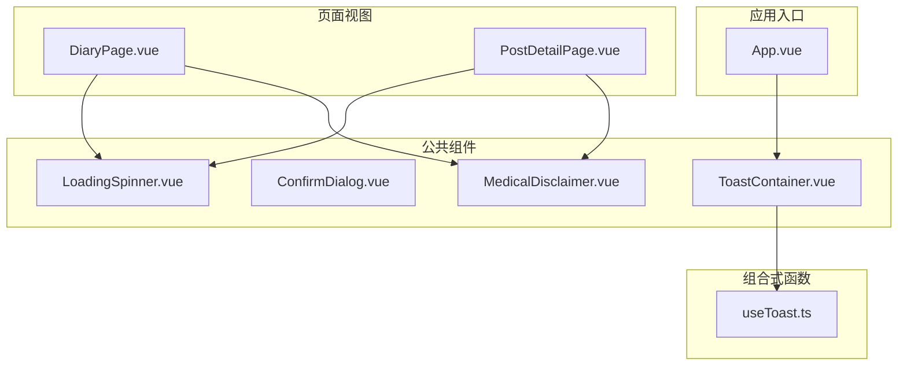
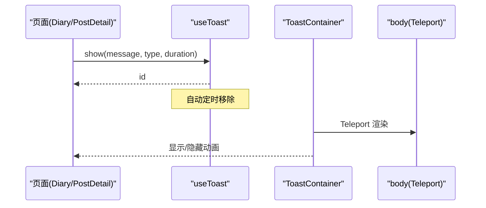
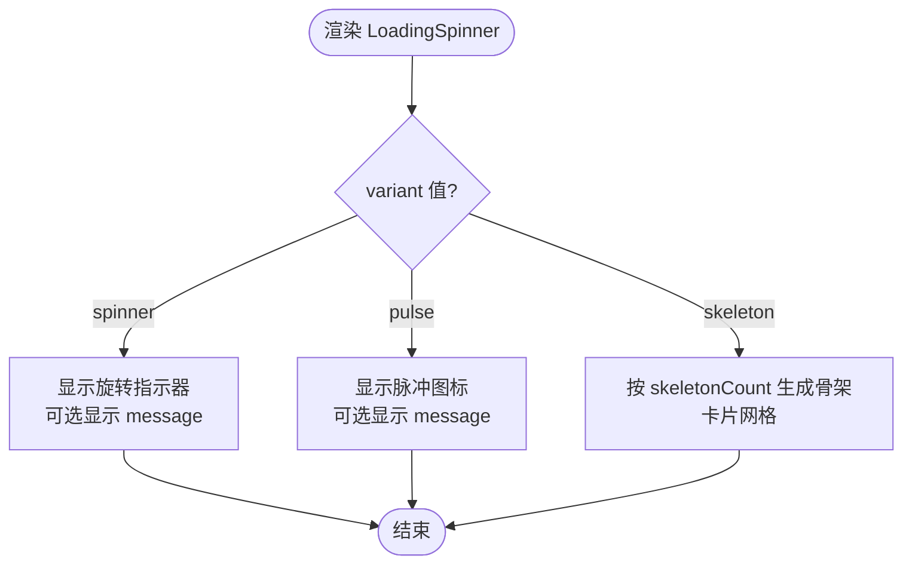
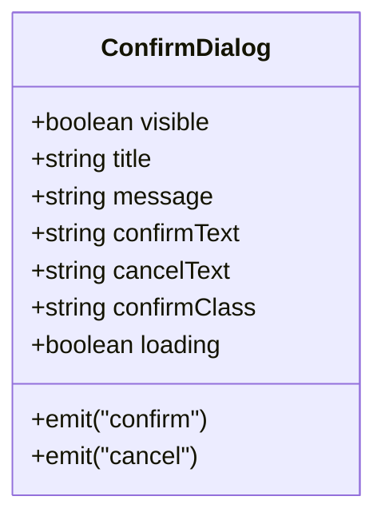
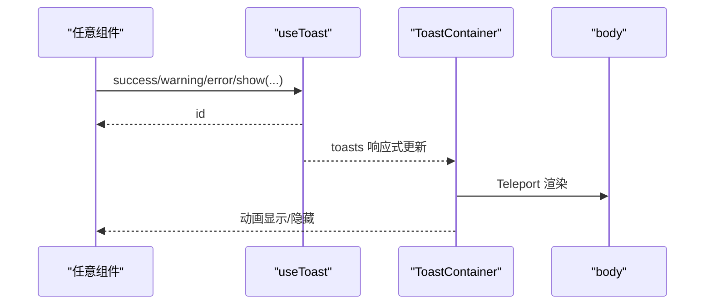
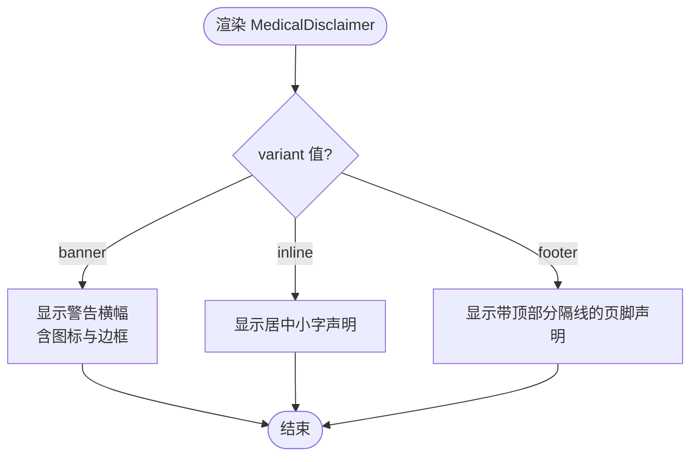
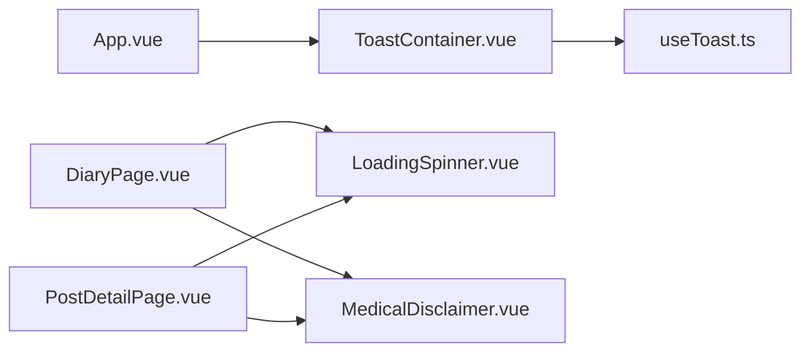

# 反馈组件

<cite>
**本文引用的文件**   
- [LoadingSpinner.vue](file://web/app/src/components/common/LoadingSpinner.vue)
- [ConfirmDialog.vue](file://web/app/src/components/common/ConfirmDialog.vue)
- [ToastContainer.vue](file://web/app/src/components/common/ToastContainer.vue)
- [MedicalDisclaimer.vue](file://web/app/src/components/common/MedicalDisclaimer.vue)
- [useToast.ts](file://web/app/src/composables/useToast.ts)
- [App.vue](file://web/app/src/App.vue)
- [DiaryPage.vue](file://web/app/src/views/DiaryPage.vue)
- [PostDetailPage.vue](file://web/app/src/views/PostDetailPage.vue)
</cite>

## 目录
1. [简介](#简介)
2. [项目结构](#项目结构)
3. [核心组件](#核心组件)
4. [架构总览](#架构总览)
5. [详细组件分析](#详细组件分析)
6. [依赖关系分析](#依赖关系分析)
7. [性能考虑](#性能考虑)
8. [故障排查指南](#故障排查指南)
9. [结论](#结论)
10. [附录](#附录)

## 简介
本文件面向前端反馈类通用组件，系统性梳理并文档化以下四个组件的设计与实现：
- LoadingSpinner 加载指示器
- ConfirmDialog 确认对话框
- ToastContainer 提示容器（配合 useToast）
- MedicalDisclaimer 医疗免责声明

内容覆盖用户交互模式、动画效果、状态管理、可访问性支持、配置选项、主题定制、多语言支持与无障碍最佳实践，并提供使用示例与集成指南。

## 项目结构
这些反馈组件位于 web/app/src/components/common 目录下，属于应用级公共 UI 能力；Toast 的状态由 composables/useToast.ts 提供；在 App.vue 中全局挂载 ToastContainer，确保全应用可用。页面视图如 DiaryPage.vue、PostDetailPage.vue 等通过导入并使用这些组件。

图表来源
- [App.vue:25-35](file://web/app/src/App.vue#L25-L35)
- [ToastContainer.vue:1-30](file://web/app/src/components/common/ToastContainer.vue#L1-L30)
- [useToast.ts:1-31](file://web/app/src/composables/useToast.ts#L1-L31)
- [LoadingSpinner.vue:1-48](file://web/app/src/components/common/LoadingSpinner.vue#L1-L48)
- [MedicalDisclaimer.vue:1-47](file://web/app/src/components/common/MedicalDisclaimer.vue#L1-L47)
- [DiaryPage.vue:25-35](file://web/app/src/views/DiaryPage.vue#L25-L35)
- [PostDetailPage.vue:15-25](file://web/app/src/views/PostDetailPage.vue#L15-L25)

章节来源
- [App.vue:25-35](file://web/app/src/App.vue#L25-L35)
- [ToastContainer.vue:1-30](file://web/app/src/components/common/ToastContainer.vue#L1-L30)
- [useToast.ts:1-31](file://web/app/src/composables/useToast.ts#L1-L31)
- [LoadingSpinner.vue:1-48](file://web/app/src/components/common/LoadingSpinner.vue#L1-L48)
- [MedicalDisclaimer.vue:1-47](file://web/app/src/components/common/MedicalDisclaimer.vue#L1-L47)
- [DiaryPage.vue:25-35](file://web/app/src/views/DiaryPage.vue#L25-L35)
- [PostDetailPage.vue:15-25](file://web/app/src/views/PostDetailPage.vue#L15-L25)

## 核心组件
- LoadingSpinner 加载指示器
  - 用途：统一展示加载中状态，支持 spinner、pulse、skeleton 三种变体。
  - 关键属性：message、variant、skeletonCount。
  - 交互与动画：spinner 旋转、pulse 图标脉冲、skeleton 骨架屏网格。
  - 可访问性：建议为骨架屏区域添加 aria-busy="true" 和合适的 role 描述。
  - 主题定制：基于 Tailwind 的语义色（primary-*、gray-*），可通过主题变量或样式覆盖。
  - 多语言：message 默认中文，可在调用处传入本地化文案。

- ConfirmDialog 确认对话框
  - 用途：统一的二次确认弹窗，替代多处分散的实现。
  - 关键属性：visible、title、message、confirmText、cancelText、confirmClass、loading。
  - 交互与动画：Teleport 到 body，点击遮罩取消，按钮禁用态处理 loading。
  - 可访问性：建议使用 focus trap、Esc 关闭、aria-modal="true"、role="dialog"。
  - 主题定制：按钮样式通过 confirmClass 注入，默认红色主操作。
  - 多语言：文本全部通过 props 传入，便于 i18n。

- ToastContainer 提示容器
  - 用途：集中渲染来自 useToast 的消息通知。
  - 状态来源：useToast() 暴露 toasts 列表及 show/success/warning/error/remove。
  - 交互与动画：右上角堆叠，进入/离开过渡动画，支持手动关闭。
  - 可访问性：建议为每个 toast 设置 aria-live="polite"，自动消失时避免打断屏幕阅读器。
  - 主题定制：typeStyles 映射四种类型样式，可按需扩展。
  - 多语言：消息内容由调用方传入。

- MedicalDisclaimer 医疗免责声明
  - 用途：合规必需的免责声明横幅/内联/页脚三种变体。
  - 关键属性：variant、message。
  - 交互与动画：无交互，纯展示。
  - 可访问性：作为段落或区块，无需额外 ARIA。
  - 主题定制：暗色适配 dark:* 类名。
  - 多语言：message 为空时回退默认文案，可在上层做 i18n 替换。

章节来源
- [LoadingSpinner.vue:1-48](file://web/app/src/components/common/LoadingSpinner.vue#L1-L48)
- [ConfirmDialog.vue:1-60](file://web/app/src/components/common/ConfirmDialog.vue#L1-L60)
- [ToastContainer.vue:1-47](file://web/app/src/components/common/ToastContainer.vue#L1-L47)
- [MedicalDisclaimer.vue:1-47](file://web/app/src/components/common/MedicalDisclaimer.vue#L1-L47)
- [useToast.ts:1-31](file://web/app/src/composables/useToast.ts#L1-L31)

## 架构总览
反馈组件采用“组件 + 组合式函数”的轻量架构：
- ToastContainer 消费 useToast 的全局 toasts 响应式数组，负责渲染与过渡动画。
- App.vue 在根节点引入 ToastContainer，保证全局可见。
- 各页面按需引入 LoadingSpinner、MedicalDisclaimer，必要时结合 ConfirmDialog 进行交互确认。

图表来源
- [useToast.ts:12-20](file://web/app/src/composables/useToast.ts#L12-L20)
- [ToastContainer.vue:14-30](file://web/app/src/components/common/ToastContainer.vue#L14-L30)
- [App.vue:25-35](file://web/app/src/App.vue#L25-L35)

## 详细组件分析

### LoadingSpinner 加载指示器
- 设计要点
  - 三变体：spinner（旋转）、pulse（图标脉冲）、skeleton（骨架屏）。
  - skeletonCount 控制骨架卡片数量，适合图片/列表占位。
- 数据流
  - 父组件通过 props 控制 message、variant、skeletonCount。
- 动画与性能
  - 使用 CSS 动画（animate-spin、animate-pulse），GPU 加速友好。
  - 骨架屏以网格布局渲染，注意控制 skeletonCount 避免重排过大。
- 可访问性建议
  - 外层容器添加 aria-busy="true"，在加载完成时移除。
  - 为 skeleton 区域添加 role="status" 或 aria-label 说明正在加载。
- 主题与多语言
  - 颜色基于 Tailwind 语义色，可通过主题变量覆盖。
  - message 支持外部传入，便于 i18n。

图表来源
- [LoadingSpinner.vue:18-46](file://web/app/src/components/common/LoadingSpinner.vue#L18-L46)

章节来源
- [LoadingSpinner.vue:1-48](file://web/app/src/components/common/LoadingSpinner.vue#L1-L48)

### ConfirmDialog 确认对话框
- 设计要点
  - 单一入口替代多处确认逻辑，支持 loading 态禁用按钮。
  - Teleport 到 body，避免 z-index 与父级样式干扰。
- 事件模型
  - emit('confirm')、emit('cancel') 供父组件处理业务。
- 可访问性建议
  - 增加 aria-modal="true"、role="dialog"。
  - 打开时聚焦到标题或确认按钮，Esc 键关闭。
  - 背景遮罩点击触发 cancel。
- 主题与多语言
  - confirmClass 允许自定义主按钮样式。
  - title/message/confirmText/cancelText 均支持 i18n。

图表来源
- [ConfirmDialog.vue:9-23](file://web/app/src/components/common/ConfirmDialog.vue#L9-L23)
- [ConfirmDialog.vue:25-59](file://web/app/src/components/common/ConfirmDialog.vue#L25-L59)

章节来源
- [ConfirmDialog.vue:1-60](file://web/app/src/components/common/ConfirmDialog.vue#L1-L60)

### ToastContainer 提示容器
- 设计要点
  - 通过 Teleport 渲染至 body，固定右上角堆叠。
  - TransitionGroup 提供进入/离开动画。
  - 类型样式映射 success/warning/error/info。
- 状态管理
  - useToast 维护全局 toasts 列表，show 方法自动定时移除。
- 可访问性建议
  - 为每个 toast 添加 aria-live="polite"，避免打断屏幕阅读器。
  - 自动消失前给出足够时长阅读。
- 主题与多语言
  - typeStyles 可扩充分支，message 由调用方传入。

图表来源
- [useToast.ts:12-20](file://web/app/src/composables/useToast.ts#L12-L20)
- [ToastContainer.vue:14-30](file://web/app/src/components/common/ToastContainer.vue#L14-L30)

章节来源
- [ToastContainer.vue:1-47](file://web/app/src/components/common/ToastContainer.vue#L1-L47)
- [useToast.ts:1-31](file://web/app/src/composables/useToast.ts#L1-L31)

### MedicalDisclaimer 医疗免责声明
- 设计要点
  - 三种变体：banner（醒目横幅）、inline（居中文字）、footer（页脚分隔线）。
  - 默认文案用于合规提示，message 可覆盖。
- 可访问性建议
  - 作为普通段落/区块即可，无需额外 ARIA。
- 主题与多语言
  - 暗色主题通过 dark:* 适配。
  - message 为空时使用默认文案，上层可做 i18n 替换。

图表来源
- [MedicalDisclaimer.vue:19-46](file://web/app/src/components/common/MedicalDisclaimer.vue#L19-L46)

章节来源
- [MedicalDisclaimer.vue:1-47](file://web/app/src/components/common/MedicalDisclaimer.vue#L1-L47)

## 依赖关系分析
- ToastContainer 依赖 useToast 提供的响应式 toasts 与操作方法。
- App.vue 全局引入 ToastContainer，确保所有路由下均可用。
- 页面视图按需引入 LoadingSpinner、MedicalDisclaimer，并在需要时结合 ConfirmDialog。

图表来源
- [App.vue:25-35](file://web/app/src/App.vue#L25-L35)
- [ToastContainer.vue:1-12](file://web/app/src/components/common/ToastContainer.vue#L1-L12)
- [DiaryPage.vue:25-35](file://web/app/src/views/DiaryPage.vue#L25-L35)
- [PostDetailPage.vue:15-25](file://web/app/src/views/PostDetailPage.vue#L15-L25)

章节来源
- [App.vue:25-35](file://web/app/src/App.vue#L25-L35)
- [ToastContainer.vue:1-12](file://web/app/src/components/common/ToastContainer.vue#L1-L12)
- [DiaryPage.vue:25-35](file://web/app/src/views/DiaryPage.vue#L25-L35)
- [PostDetailPage.vue:15-25](file://web/app/src/views/PostDetailPage.vue#L15-L25)

## 性能考虑
- LoadingSpinner
  - skeletonCount 不宜过大，避免大量 DOM 节点导致重排。
  - 骨架屏使用静态占位，减少计算开销。
- ConfirmDialog
  - Teleport 到 body 可减少层级嵌套带来的样式计算成本。
  - loading 态禁用按钮，避免重复提交。
- ToastContainer
  - 使用 TransitionGroup 动画，注意动画时长与频繁弹出导致的抖动。
  - 自动移除机制避免内存泄漏。
- MedicalDisclaimer
  - 纯展示组件，无性能负担。

[本节为通用指导，不直接分析具体文件]

## 故障排查指南
- Toast 未显示
  - 检查 App.vue 是否已引入并渲染 ToastContainer。
  - 确认 useToast.show 被正确调用且 toasts 数组有更新。
- ConfirmDialog 无法关闭
  - 检查 visible 绑定是否正确，父组件是否在 cancel/confirm 后重置 visible。
  - 若启用 loading，确认异步完成后关闭弹窗。
- LoadingSpinner 不消失
  - 检查父组件 loading 状态是否在 finally 分支置回 false。
  - skeleton 模式下确认 skeletonCount 合理。
- MedicalDisclaimer 文案不正确
  - 检查 variant 与 message 传参，确认未覆盖默认文案。

章节来源
- [App.vue:25-35](file://web/app/src/App.vue#L25-L35)
- [useToast.ts:12-20](file://web/app/src/composables/useToast.ts#L12-L20)
- [ConfirmDialog.vue:25-59](file://web/app/src/components/common/ConfirmDialog.vue#L25-L59)
- [LoadingSpinner.vue:18-46](file://web/app/src/components/common/LoadingSpinner.vue#L18-L46)
- [MedicalDisclaimer.vue:19-46](file://web/app/src/components/common/MedicalDisclaimer.vue#L19-L46)

## 结论
上述四个反馈组件构成了 SubSkin 前端应用的统一反馈体系：
- LoadingSpinner 提供一致的加载体验；
- ConfirmDialog 收敛了确认交互；
- ToastContainer + useToast 提供了全局、易用的消息通知；
- MedicalDisclaimer 满足合规要求。

建议在后续迭代中补充可访问性增强（焦点管理、ARIA 标注）、国际化文案集中管理与主题变量抽象，以提升一致性与可维护性。

[本节为总结性内容，不直接分析具体文件]

## 附录

### 使用示例与集成指南
- 在页面中使用 LoadingSpinner
  - 在数据请求前后切换 loading 状态，包裹内容区域。
  - 参考路径：[DiaryPage.vue:25-35](file://web/app/src/views/DiaryPage.vue#L25-L35)、[PostDetailPage.vue:15-25](file://web/app/src/views/PostDetailPage.vue#L15-L25)。
- 在页面中使用 MedicalDisclaimer
  - 在内容页底部或顶部插入，根据场景选择 banner/inline/footer。
  - 参考路径：[DiaryPage.vue:25-35](file://web/app/src/views/DiaryPage.vue#L25-L35)、[PostDetailPage.vue:15-25](file://web/app/src/views/PostDetailPage.vue#L15-L25)。
- 使用 Toast 通知
  - 在 App.vue 中已全局引入 ToastContainer，页面中通过 useToast().show(...) 调用。
  - 参考路径：[App.vue:25-35](file://web/app/src/App.vue#L25-L35)、[useToast.ts:12-20](file://web/app/src/composables/useToast.ts#L12-L20)。
- 使用 ConfirmDialog
  - 在需要二次确认的操作处引入组件，绑定 visible 与 confirm/cancel 事件。
  - 参考路径：[ConfirmDialog.vue:9-23](file://web/app/src/components/common/ConfirmDialog.vue#L9-L23)。

章节来源
- [DiaryPage.vue:25-35](file://web/app/src/views/DiaryPage.vue#L25-L35)
- [PostDetailPage.vue:15-25](file://web/app/src/views/PostDetailPage.vue#L15-L25)
- [App.vue:25-35](file://web/app/src/App.vue#L25-L35)
- [useToast.ts:12-20](file://web/app/src/composables/useToast.ts#L12-L20)
- [ConfirmDialog.vue:9-23](file://web/app/src/components/common/ConfirmDialog.vue#L9-L23)