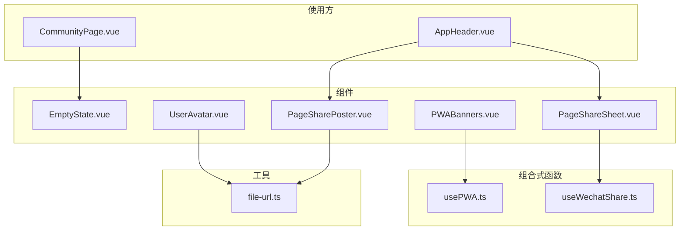
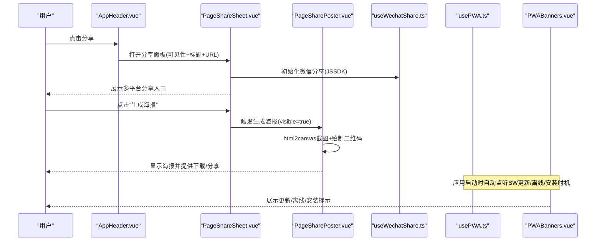
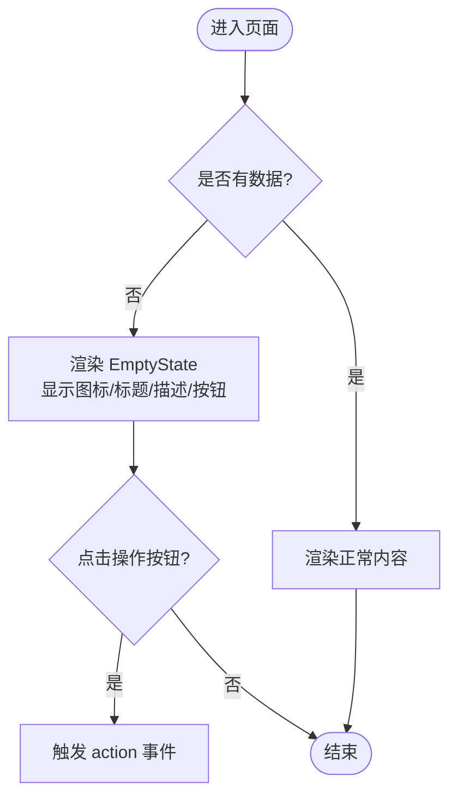
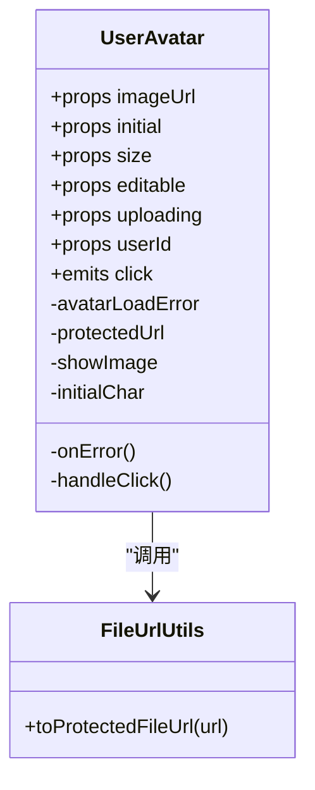
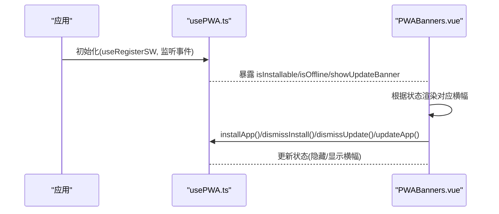
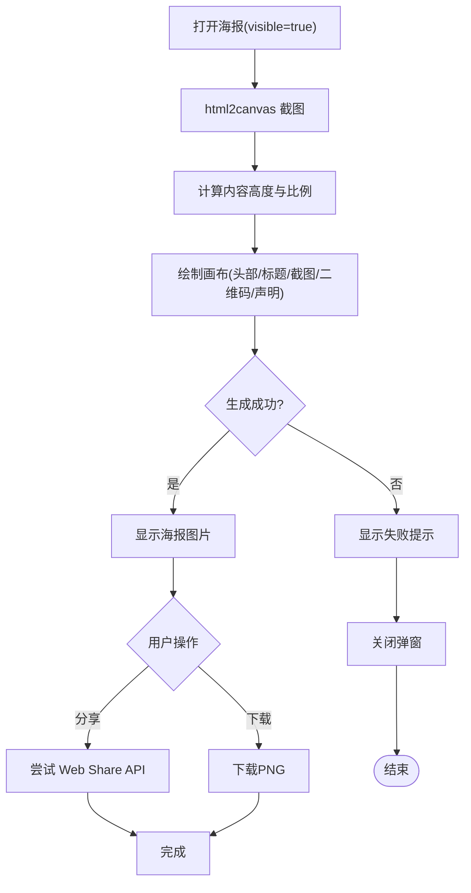
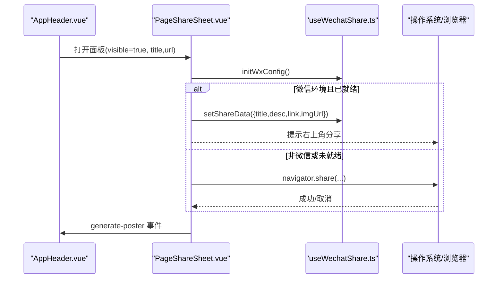
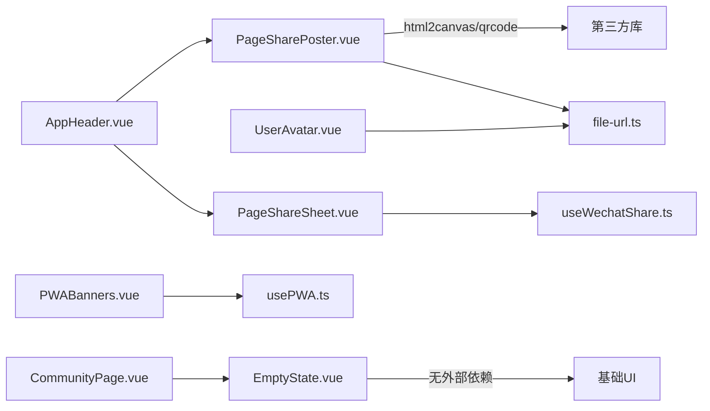

# 工具组件

<cite>
**本文引用的文件**   
- [EmptyState.vue](file://web/app/src/components/common/EmptyState.vue)
- [UserAvatar.vue](file://web/app/src/components/common/UserAvatar.vue)
- [PWABanners.vue](file://web/app/src/components/common/PWABanners.vue)
- [PageSharePoster.vue](file://web/app/src/components/common/PageSharePoster.vue)
- [PageShareSheet.vue](file://web/app/src/components/common/PageShareSheet.vue)
- [usePWA.ts](file://web/app/src/composables/usePWA.ts)
- [useWechatShare.ts](file://web/app/src/composables/useWechatShare.ts)
- [file-url.ts](file://web/app/src/utils/file-url.ts)
- [AppHeader.vue](file://web/app/src/components/layout/AppHeader.vue)
- [CommunityPage.vue](file://web/app/src/views/CommunityPage.vue)
</cite>

## 目录
1. [简介](#简介)
2. [项目结构](#项目结构)
3. [核心组件](#核心组件)
4. [架构总览](#架构总览)
5. [详细组件分析](#详细组件分析)
6. [依赖关系分析](#依赖关系分析)
7. [性能与缓存策略](#性能与缓存策略)
8. [故障排查指南](#故障排查指南)
9. [结论](#结论)
10. [附录：配置与事件参考](#附录配置与事件参考)

## 简介
本文件面向前端工具组件，系统性梳理并深入解析以下五个通用组件的设计与实现：
- EmptyState 空状态
- UserAvatar 用户头像
- PWABanners PWA 横幅
- PageSharePoster 页面分享海报
- PageShareSheet 分享面板

内容覆盖业务逻辑、数据绑定、第三方服务集成（微信 JSSDK、浏览器原生分享）、用户体验优化、配置项与事件处理、缓存策略与性能调优，以及复用模式与扩展开发最佳实践。

## 项目结构
这些组件位于 web/app/src/components/common 目录下，配合 composables 与 utils 提供能力支撑：
- 组件层：EmptyState、UserAvatar、PWABanners、PageSharePoster、PageShareSheet
- 组合式函数：usePWA（PWA 安装/更新/离线检测）、useWechatShare（微信 JSSDK 初始化与分享设置）
- 工具函数：file-url（受保护文件 URL 生成与 HTML 重写）

图表来源
- [PWABanners.vue:1-113](file://web/app/src/components/common/PWABanners.vue#L1-L113)
- [usePWA.ts:1-441](file://web/app/src/composables/usePWA.ts#L1-L441)
- [PageShareSheet.vue:1-187](file://web/app/src/components/common/PageShareSheet.vue#L1-L187)
- [useWechatShare.ts:1-77](file://web/app/src/composables/useWechatShare.ts#L1-L77)
- [UserAvatar.vue:1-99](file://web/app/src/components/common/UserAvatar.vue#L1-L99)
- [file-url.ts:1-155](file://web/app/src/utils/file-url.ts#L1-L155)
- [PageSharePoster.vue:1-376](file://web/app/src/components/common/PageSharePoster.vue#L1-L376)
- [AppHeader.vue:170-220](file://web/app/src/components/layout/AppHeader.vue#L170-L220)
- [CommunityPage.vue:490-510](file://web/app/src/views/CommunityPage.vue#L490-L510)

章节来源
- [PWABanners.vue:1-113](file://web/app/src/components/common/PWABanners.vue#L1-L113)
- [PageShareSheet.vue:1-187](file://web/app/src/components/common/PageShareSheet.vue#L1-L187)
- [UserAvatar.vue:1-99](file://web/app/src/components/common/UserAvatar.vue#L1-L99)
- [file-url.ts:1-155](file://web/app/src/utils/file-url.ts#L1-L155)
- [PageSharePoster.vue:1-376](file://web/app/src/components/common/PageSharePoster.vue#L1-L376)
- [AppHeader.vue:170-220](file://web/app/src/components/layout/AppHeader.vue#L170-L220)
- [CommunityPage.vue:490-510](file://web/app/src/views/CommunityPage.vue#L490-L510)

## 核心组件
- EmptyState：统一的空状态占位组件，支持图标、标题、描述、操作按钮与 action 事件。
- UserAvatar：统一的用户头像组件，支持图片加载失败回退为初始字母、尺寸可配、可选编辑遮罩与上传态、可选跳转用户主页。
- PWABanners：PWA 安装提示、离线提示、版本更新提示三合一横幅，基于 usePWA 组合式函数。
- PageSharePoster：通过 html2canvas + qrcode 生成分享海报，支持下载与原生分享。
- PageShareSheet：分享面板，聚合复制链接、微信/朋友圈、微博、抖音、小红书等入口，并触发海报生成。

章节来源
- [EmptyState.vue:1-37](file://web/app/src/components/common/EmptyState.vue#L1-L37)
- [UserAvatar.vue:1-99](file://web/app/src/components/common/UserAvatar.vue#L1-L99)
- [PWABanners.vue:1-113](file://web/app/src/components/common/PWABanners.vue#L1-L113)
- [PageSharePoster.vue:1-376](file://web/app/src/components/common/PageSharePoster.vue#L1-L376)
- [PageShareSheet.vue:1-187](file://web/app/src/components/common/PageShareSheet.vue#L1-L187)

## 架构总览
整体采用“组件 + 组合式函数 + 工具”的分层设计：
- 组件负责 UI 与交互
- 组合式函数封装平台能力（PWA、微信 JSSDK）
- 工具函数处理安全与鉴权（受保护文件 URL、HTML 清洗与重写）

图表来源
- [AppHeader.vue:170-220](file://web/app/src/components/layout/AppHeader.vue#L170-L220)
- [PageShareSheet.vue:1-187](file://web/app/src/components/common/PageShareSheet.vue#L1-L187)
- [PageSharePoster.vue:1-376](file://web/app/src/components/common/PageSharePoster.vue#L1-L376)
- [useWechatShare.ts:1-77](file://web/app/src/composables/useWechatShare.ts#L1-L77)
- [PWABanners.vue:1-113](file://web/app/src/components/common/PWABanners.vue#L1-L113)
- [usePWA.ts:1-441](file://web/app/src/composables/usePWA.ts#L1-L441)

## 详细组件分析

### EmptyState 空状态
- 设计目标：统一全站的空状态视觉与交互，降低重复代码。
- 配置项
  - icon：图标类名（默认编辑笔样式）
  - title：主标题（默认“暂无内容”）
  - description：辅助说明（可选）
  - actionLabel：操作按钮文案（可选）
- 事件
  - action：点击操作按钮时触发，由父组件决定行为（如打开创建表单）
- 使用示例
  - 社区页在列表为空时渲染 EmptyState，并根据登录状态决定是否显示“发布分享”按钮。

图表来源
- [EmptyState.vue:1-37](file://web/app/src/components/common/EmptyState.vue#L1-L37)
- [CommunityPage.vue:490-510](file://web/app/src/views/CommunityPage.vue#L490-L510)

章节来源
- [EmptyState.vue:1-37](file://web/app/src/components/common/EmptyState.vue#L1-L37)
- [CommunityPage.vue:490-510](file://web/app/src/views/CommunityPage.vue#L490-L510)

### UserAvatar 用户头像
- 设计目标：统一头像展示与回退策略，支持主题色、尺寸、编辑遮罩与链接跳转。
- 数据绑定
  - imageUrl：完整图片 URL，内部通过 toProtectedFileUrl 转换为带短期令牌的安全地址
  - initial：当图片不可用时显示的初始字符（默认取用户名首字母大写）
  - size：Tailwind 尺寸类（如 w-10 h-10），影响字体大小与布局
  - editable：是否显示编辑遮罩（hover 显示“更换”，uploading 显示“上传中”）
  - uploading：上传中状态
  - userId：若提供则作为 link 角色，便于导航到用户主页
- 错误处理
  - 图片加载失败时切换为初始字符；imageUrl 变化时重置错误状态
- 性能要点
  - 使用计算属性生成受保护 URL，避免重复请求
  - 通过绝对定位叠加遮罩，减少重排

图表来源
- [UserAvatar.vue:1-99](file://web/app/src/components/common/UserAvatar.vue#L1-L99)
- [file-url.ts:1-155](file://web/app/src/utils/file-url.ts#L1-L155)

章节来源
- [UserAvatar.vue:1-99](file://web/app/src/components/common/UserAvatar.vue#L1-L99)
- [file-url.ts:1-155](file://web/app/src/utils/file-url.ts#L1-L155)

### PWABanners PWA 横幅
- 功能范围
  - 新版本可用横幅：顶部固定条，支持“更新”和“稍后”
  - 离线横幅：网络断开时提示
  - 安装提示横幅：底部卡片，引导添加到桌面
- 数据来源
  - 使用 usePWA 暴露 isInstallable、isOffline、showUpdateBanner、installApp、dismissInstall、dismissUpdate、updateApp 等
- 环境差异
  - staging 环境使用不同配色与文案
- 交互流程
  - 点击“更新”调用 updateApp，期间禁用按钮并显示加载态
  - 点击“稍后”或关闭按钮记录冷却时间，控制再次展示

图表来源
- [PWABanners.vue:1-113](file://web/app/src/components/common/PWABanners.vue#L1-L113)
- [usePWA.ts:1-441](file://web/app/src/composables/usePWA.ts#L1-L441)

章节来源
- [PWABanners.vue:1-113](file://web/app/src/components/common/PWABanners.vue#L1-L113)
- [usePWA.ts:1-441](file://web/app/src/composables/usePWA.ts#L1-L441)

### PageSharePoster 页面分享海报
- 核心能力
  - 捕获页面截图（html2canvas），绘制品牌头部、标题、截图区域、二维码与免责声明
  - 生成后可下载保存或调用浏览器原生分享（Web Share API）
- 关键逻辑
  - 检测微信环境，差异化提示
  - 检测 canShare(files) 能力，决定是否启用“分享”按钮
  - 海报尺寸自适应，保持截图比例并在限定区域内居中裁剪
  - 二维码使用 qrcode 库生成，容错级别 M
- 生命周期
  - visible=true 时锁定 body 滚动并生成海报；visible=false 时清理状态
- 错误处理
  - 截图失败降级为文本占位；二维码生成失败以空白块替代

图表来源
- [PageSharePoster.vue:1-376](file://web/app/src/components/common/PageSharePoster.vue#L1-L376)

章节来源
- [PageSharePoster.vue:1-376](file://web/app/src/components/common/PageSharePoster.vue#L1-L376)

### PageShareSheet 分享面板
- 功能范围
  - 复制当前链接到剪贴板（兼容 fallback）
  - 微信分享：优先走微信 JSSDK，否则回退到 Web Share API 或提示手动分享
  - 微博：新窗口打开分享页
  - 抖音/小红书：提示先保存海报再分享
  - 触发“生成海报”事件，交由父级控制
- 数据绑定
  - visible：控制显隐
  - title/description/url：分享标题、描述与链接
- 第三方集成
  - useWechatShare 负责微信 JSSDK 初始化与 setShareData

图表来源
- [PageShareSheet.vue:1-187](file://web/app/src/components/common/PageShareSheet.vue#L1-L187)
- [useWechatShare.ts:1-77](file://web/app/src/composables/useWechatShare.ts#L1-L77)
- [AppHeader.vue:170-220](file://web/app/src/components/layout/AppHeader.vue#L170-L220)

章节来源
- [PageShareSheet.vue:1-187](file://web/app/src/components/common/PageShareSheet.vue#L1-L187)
- [useWechatShare.ts:1-77](file://web/app/src/composables/useWechatShare.ts#L1-L77)
- [AppHeader.vue:170-220](file://web/app/src/components/layout/AppHeader.vue#L170-L220)

## 依赖关系分析
- 组件间耦合度低，主要通过 props/emits 通信
- 组合式函数解耦平台能力，避免组件直接依赖浏览器 API
- 工具函数集中处理安全与鉴权，避免在各组件内重复实现

图表来源
- [UserAvatar.vue:1-99](file://web/app/src/components/common/UserAvatar.vue#L1-L99)
- [file-url.ts:1-155](file://web/app/src/utils/file-url.ts#L1-L155)
- [PWABanners.vue:1-113](file://web/app/src/components/common/PWABanners.vue#L1-L113)
- [usePWA.ts:1-441](file://web/app/src/composables/usePWA.ts#L1-L441)
- [PageShareSheet.vue:1-187](file://web/app/src/components/common/PageShareSheet.vue#L1-L187)
- [useWechatShare.ts:1-77](file://web/app/src/composables/useWechatShare.ts#L1-L77)
- [PageSharePoster.vue:1-376](file://web/app/src/components/common/PageSharePoster.vue#L1-L376)
- [AppHeader.vue:170-220](file://web/app/src/components/layout/AppHeader.vue#L170-L220)
- [CommunityPage.vue:490-510](file://web/app/src/views/CommunityPage.vue#L490-L510)

章节来源
- [UserAvatar.vue:1-99](file://web/app/src/components/common/UserAvatar.vue#L1-L99)
- [PWABanners.vue:1-113](file://web/app/src/components/common/PWABanners.vue#L1-L113)
- [PageShareSheet.vue:1-187](file://web/app/src/components/common/PageShareSheet.vue#L1-L187)
- [PageSharePoster.vue:1-376](file://web/app/src/components/common/PageSharePoster.vue#L1-L376)
- [AppHeader.vue:170-220](file://web/app/src/components/layout/AppHeader.vue#L170-L220)
- [CommunityPage.vue:490-510](file://web/app/src/views/CommunityPage.vue#L490-L510)

## 性能与缓存策略
- 受保护文件 URL 与 Token 缓存
  - file-url.ts 维护短期文件访问令牌，避免频繁刷新长生命期 token
  - 首次获取失败时回退到访问令牌，确保图片始终可加载
  - HTML 内容中的 src/href 会被统一重写为受保护地址，防止泄露
- PWA 更新与离线
  - usePWA.ts 定时轮询 SW 更新与 version.json，避免强制刷新打断用户输入
  - 离线状态实时更新，横幅提示清晰
- 海报生成
  - 仅在 visible=true 时执行，关闭后清理图片数据释放内存
  - 截图限制最大高度，避免超大 DOM 导致卡顿
- 建议
  - 对大体积资源（如 logo、背景图）开启 CDN 与缓存
  - 在弱网环境下延迟非关键渲染（如二维码）
  - 对 share 能力进行特性检测，避免不必要的异常路径

章节来源
- [file-url.ts:1-155](file://web/app/src/utils/file-url.ts#L1-L155)
- [usePWA.ts:1-441](file://web/app/src/composables/usePWA.ts#L1-L441)
- [PageSharePoster.vue:1-376](file://web/app/src/components/common/PageSharePoster.vue#L1-L376)

## 故障排查指南
- 图片无法加载
  - 检查 imageUrl 是否为空或被拦截；确认 toProtectedFileUrl 生成的 URL 包含有效 access_token
  - 查看 onError 回调是否被触发，initial 是否正确显示
- 微信分享无效
  - 确认 isWechat 判断与 wx.ready 状态；检查后端 /api/wechat/jssdk-config 返回签名是否有效
  - 若未就绪，提示用户点击右上角手动分享
- PWA 更新不生效
  - 检查 SW 注册与 controllerchange 事件；确认 version.json 可访问且 buildTime 递增
  - 观察 showUpdateBanner 与 dismissUpdate 的冷却逻辑
- 海报生成失败
  - 检查 html2canvas 权限与跨域资源；必要时关闭 useCORS 或使用代理
  - 确认 canvas 尺寸与内容高度计算合理，避免溢出

章节来源
- [UserAvatar.vue:1-99](file://web/app/src/components/common/UserAvatar.vue#L1-L99)
- [useWechatShare.ts:1-77](file://web/app/src/composables/useWechatShare.ts#L1-L77)
- [PWABanners.vue:1-113](file://web/app/src/components/common/PWABanners.vue#L1-L113)
- [PageSharePoster.vue:1-376](file://web/app/src/components/common/PageSharePoster.vue#L1-L376)

## 结论
上述工具组件通过清晰的职责划分与组合式抽象，实现了高内聚、低耦合的前端能力封装。它们覆盖了空状态、头像展示、PWA 体验与分享链路等常见场景，具备良好的可复用性与可扩展性。建议在新增类似需求时优先复用现有组件与组合式函数，并通过 props/emits 定制行为，以保持代码一致性与可维护性。

## 附录：配置与事件参考

### EmptyState
- 配置项
  - icon: string（默认编辑笔图标）
  - title: string（默认“暂无内容”）
  - description: string（可选）
  - actionLabel: string（可选）
- 事件
  - action：点击操作按钮时触发

章节来源
- [EmptyState.vue:1-37](file://web/app/src/components/common/EmptyState.vue#L1-L37)

### UserAvatar
- 配置项
  - imageUrl: string | null（受保护 URL）
  - initial: string（默认“U”）
  - size: string（如 w-10 h-10）
  - editable: boolean（默认 false）
  - uploading: boolean（默认 false）
  - userId: number | null（可选）
- 事件
  - click：点击头像时触发

章节来源
- [UserAvatar.vue:1-99](file://web/app/src/components/common/UserAvatar.vue#L1-L99)

### PWABanners
- 依赖组合式函数
  - isInstallable、isOffline、showUpdateBanner、installApp、dismissInstall、dismissInstallLong、dismissUpdate、updateApp
- 行为
  - 更新横幅：支持“更新”与“稍后”
  - 离线横幅：网络断开提示
  - 安装横幅：引导添加至桌面

章节来源
- [PWABanners.vue:1-113](file://web/app/src/components/common/PWABanners.vue#L1-L113)
- [usePWA.ts:1-441](file://web/app/src/composables/usePWA.ts#L1-L441)

### PageSharePoster
- 配置项
  - visible: boolean
  - pageTitle: string
  - pageUrl?: string
- 事件
  - close：关闭弹窗
- 能力
  - 下载海报 PNG
  - 浏览器原生分享（需 canShare(files)）

章节来源
- [PageSharePoster.vue:1-376](file://web/app/src/components/common/PageSharePoster.vue#L1-L376)

### PageShareSheet
- 配置项
  - visible: boolean
  - title: string
  - description?: string
  - url?: string
- 事件
  - close：关闭面板
  - generate-poster：触发海报生成
- 能力
  - 复制链接、微信/朋友圈、微博、抖音、小红书入口

章节来源
- [PageShareSheet.vue:1-187](file://web/app/src/components/common/PageShareSheet.vue#L1-L187)
- [useWechatShare.ts:1-77](file://web/app/src/composables/useWechatShare.ts#L1-L77)