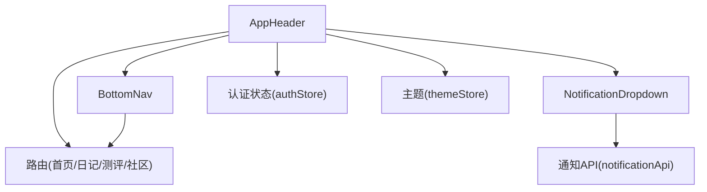
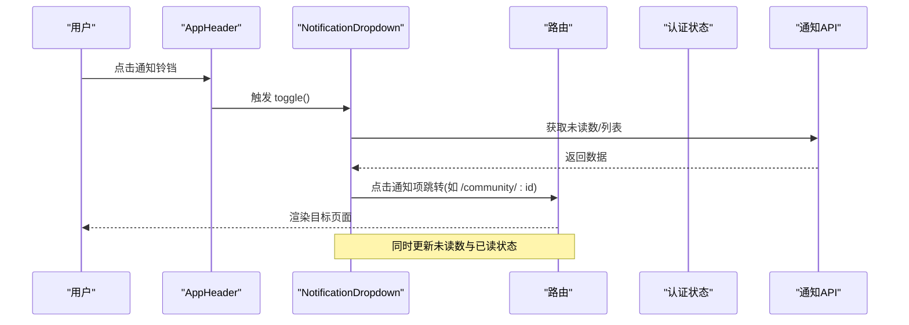
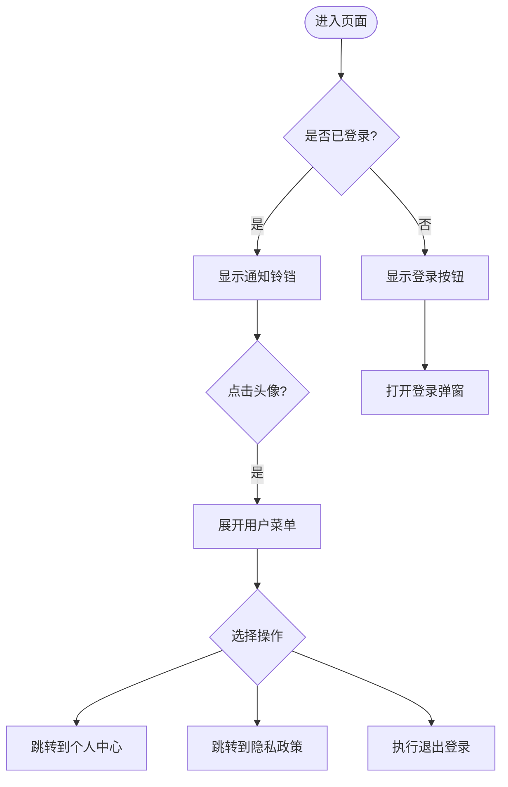
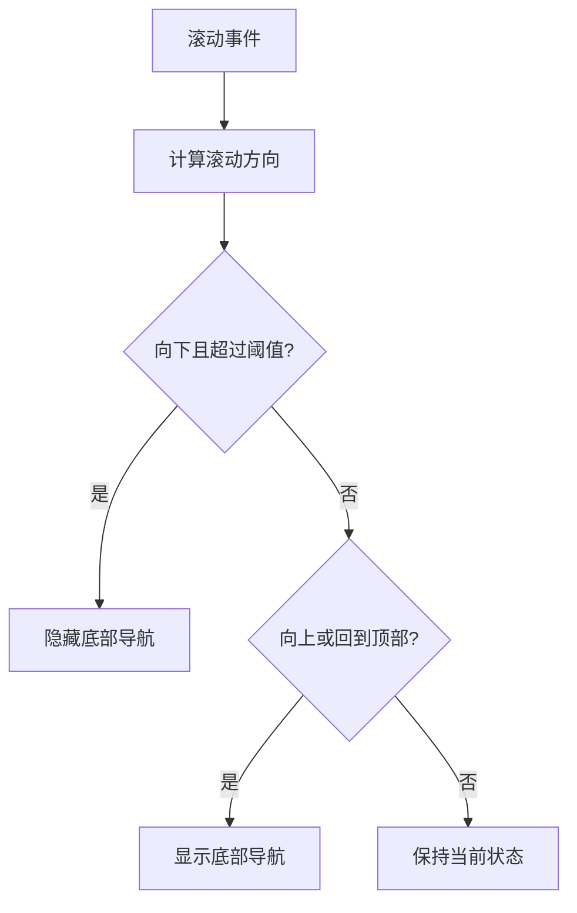
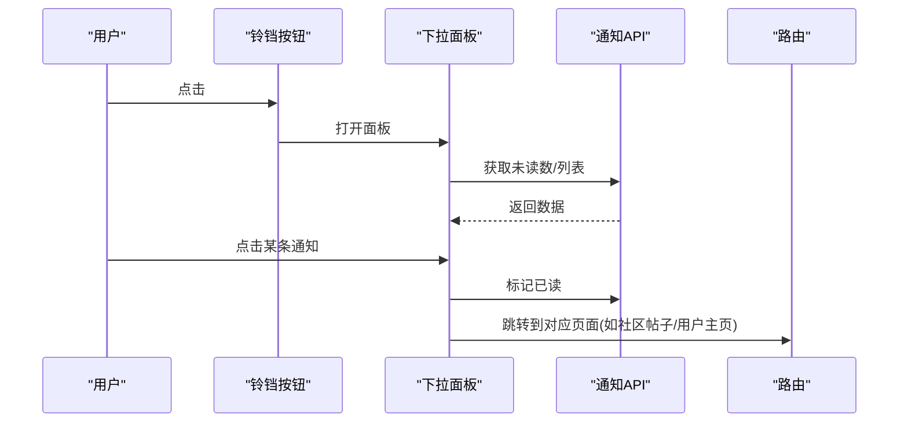
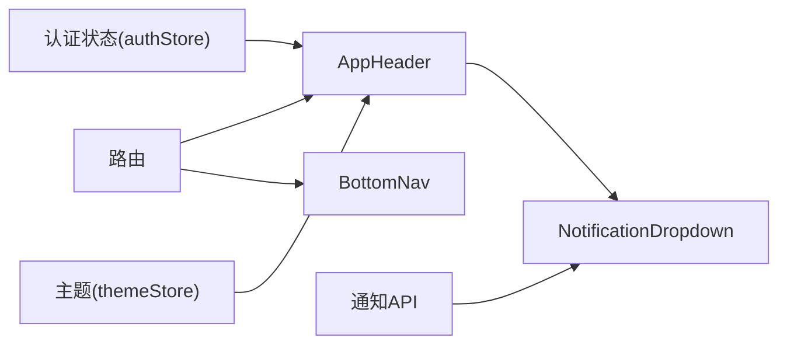

# 布局组件

<cite>
**本文引用的文件**
- [AppHeader.vue](file://web/app/src/components/layout/AppHeader.vue)
- [BottomNav.vue](file://web/app/src/components/layout/BottomNav.vue)
- [NotificationDropdown.vue](file://web/app/src/components/layout/NotificationDropdown.vue)
- [路由配置](file://web/app/src/router/index.ts)
- [认证状态管理](file://web/app/src/stores/auth.ts)
- [主题状态管理](file://web/app/src/stores/theme.ts)
- [通知 API](file://web/app/src/api/notifications.ts)
- [全局样式与主题变量](file://web/app/src/styles/main.css)
</cite>

## 目录
1. [简介](#简介)
2. [项目结构](#项目结构)
3. [核心组件](#核心组件)
4. [架构总览](#架构总览)
5. [详细组件分析](#详细组件分析)
6. [依赖关系分析](#依赖关系分析)
7. [性能考量](#性能考量)
8. [故障排查指南](#故障排查指南)
9. [结论](#结论)
10. [附录：扩展与定制指南](#附录扩展与定制指南)

## 简介
本章节聚焦于应用级布局组件：应用头部 AppHeader、底部导航 BottomNav、通知下拉 NotificationDropdown。文档从响应式布局、移动端适配、导航逻辑、用户交互、状态管理、路由集成、权限控制与性能优化等维度，系统阐述其设计与实现，并提供组合模式、主题定制与扩展开发的实践建议。

## 项目结构
布局组件位于 web/app/src/components/layout 下，配合路由、状态管理与 API 层共同构成前端布局体系：
- AppHeader：顶部固定栏，包含品牌、主导航、分享入口、通知铃铛（已登录）、用户菜单（已登录）或登录按钮（未登录）。
- BottomNav：移动端底部固定导航，提供问答、日记、测评、白友圈四个主要入口，支持滚动隐藏与活跃态高亮。
- NotificationDropdown：通知铃铛的下拉面板，支持列表加载、未读数统计、标记已读、跳转关联页面、动态定位与全屏适配。

图表来源
- [AppHeader.vue:1-220](file://web/app/src/components/layout/AppHeader.vue#L1-L220)
- [BottomNav.vue:1-184](file://web/app/src/components/layout/BottomNav.vue#L1-L184)
- [NotificationDropdown.vue:1-260](file://web/app/src/components/layout/NotificationDropdown.vue#L1-L260)
- [路由配置:1-155](file://web/app/src/router/index.ts#L1-L155)
- [认证状态管理:1-259](file://web/app/src/stores/auth.ts#L1-L259)
- [主题状态管理:1-71](file://web/app/src/stores/theme.ts#L1-L71)
- [通知 API:1-42](file://web/app/src/api/notifications.ts#L1-L42)

章节来源
- [AppHeader.vue:1-220](file://web/app/src/components/layout/AppHeader.vue#L1-L220)
- [BottomNav.vue:1-184](file://web/app/src/components/layout/BottomNav.vue#L1-L184)
- [NotificationDropdown.vue:1-260](file://web/app/src/components/layout/NotificationDropdown.vue#L1-L260)
- [路由配置:1-155](file://web/app/src/router/index.ts#L1-L155)
- [认证状态管理:1-259](file://web/app/src/stores/auth.ts#L1-L259)
- [主题状态管理:1-71](file://web/app/src/stores/theme.ts#L1-L71)
- [通知 API:1-42](file://web/app/src/api/notifications.ts#L1-L42)
- [全局样式与主题变量:1-213](file://web/app/src/styles/main.css#L1-L213)

## 核心组件
- 应用头部 AppHeader
  - 功能：品牌展示、桌面端主导航、分享弹窗、通知铃铛（仅已登录）、用户菜单（个人中心、隐私政策、退出登录）。
  - 响应式：桌面端显示主导航；移动端隐藏主导航，使用底部导航替代。
  - 权限：根据登录态切换“登录”按钮与用户菜单；通知铃铛仅在已登录时渲染。
  - 路由集成：通过 isNavActive 判断当前路由是否激活，并应用到导航链接。
  - 主题：支持 staging 环境深色样式覆盖。

- 底部导航 BottomNav
  - 功能：移动端四段主导航（问答、日记、测评、白友圈），支持滚动自动隐藏/显示、活跃态高亮。
  - 响应式：在 >=768px 的屏幕隐藏，避免与桌面端头部导航重复。
  - 交互：点击项进行路由跳转；滚动阈值控制显隐。

- 通知下拉 NotificationDropdown
  - 功能：获取未读数、列表加载、单条/全部标记已读、点击跳转至帖子或用户主页、动态定位（桌面右对齐、移动端全宽居中）。
  - 性能：轮询未读数（30s）、按需加载列表、Teleport 到 body 确保定位稳定。
  - 权限：仅已登录可见（由父级 AppHeader 控制）。

章节来源
- [AppHeader.vue:1-220](file://web/app/src/components/layout/AppHeader.vue#L1-L220)
- [BottomNav.vue:1-184](file://web/app/src/components/layout/BottomNav.vue#L1-L184)
- [NotificationDropdown.vue:1-260](file://web/app/src/components/layout/NotificationDropdown.vue#L1-L260)

## 架构总览
布局组件通过路由与状态管理协同工作，形成“头部+底部+通知”的稳定骨架：
- 路由驱动：头部与底部均基于当前路由计算活跃态，保证导航一致性。
- 状态驱动：认证状态决定 UI 分支（登录/未登录、是否显示通知与用户菜单）。
- 数据流：通知下拉通过 API 获取数据，并在打开时更新位置与内容。
- 主题驱动：全局 CSS 变量与 dark 类名切换，影响头部、底部与通知面板的视觉表现。

图表来源
- [NotificationDropdown.vue:114-131](file://web/app/src/components/layout/NotificationDropdown.vue#L114-L131)
- [通知 API:21-42](file://web/app/src/api/notifications.ts#L21-L42)
- [路由配置:53-76](file://web/app/src/router/index.ts#L53-L76)

## 详细组件分析

### AppHeader 应用头部
- 关键职责
  - 品牌与主导航：桌面端展示问答、日记、测评、白友圈四个入口，移动端隐藏。
  - 分享能力：调用 PageShareSheet/PageSharePoster 生成分享内容与海报。
  - 通知入口：已登录时渲染通知铃铛，未登录时显示登录按钮。
  - 用户菜单：已登录时显示头像/用户名，展开后提供个人中心、隐私政策、退出登录。
- 路由与活跃态
  - 通过 isNavActive 对根路径、日记、测评及其子路径进行匹配，确保路由变化时导航高亮一致。
- 权限控制
  - 依据 authStore.isLoggedIn 控制通知铃铛和用户菜单的渲染。
  - 退出登录调用 authStore.logout，清理本地令牌与用户信息。
- 主题与环境
  - 支持 staging 环境深色样式覆盖，保持品牌一致性。
- 可访问性
  - 为关键按钮添加 aria-label，提升无障碍体验。

图表来源
- [AppHeader.vue:37-48](file://web/app/src/components/layout/AppHeader.vue#L37-L48)
- [认证状态管理:210-227](file://web/app/src/stores/auth.ts#L210-L227)

章节来源
- [AppHeader.vue:1-220](file://web/app/src/components/layout/AppHeader.vue#L1-L220)
- [认证状态管理:1-259](file://web/app/src/stores/auth.ts#L1-L259)

### BottomNav 底部导航
- 关键职责
  - 移动端主导航：问答、日记、测评、白友圈。
  - 滚动行为：监听 scroll，超过阈值且向下滚动时隐藏，向上滚动或回到顶部时显示。
  - 活跃态：根据当前路由判断高亮，支持精确匹配与子路径匹配。
- 响应式
  - 在 >=768px 的设备隐藏，避免与桌面端头部导航重复。
- 可访问性
  - 使用 role="navigation" 与 aria-label，增强语义化。

图表来源
- [BottomNav.vue:35-52](file://web/app/src/components/layout/BottomNav.vue#L35-L52)

章节来源
- [BottomNav.vue:1-184](file://web/app/src/components/layout/BottomNav.vue#L1-L184)

### NotificationDropdown 通知下拉
- 关键职责
  - 未读数：定时轮询未读数，用于角标显示。
  - 列表加载：首次打开时拉取最近通知，支持分页参数。
  - 交互：点击通知项标记已读并跳转；支持“全部已读”。
  - 定位：桌面端右对齐铃铛按钮，移动端全宽居中；滚动/窗口尺寸变化时重新计算位置。
- 权限控制
  - 由父级 AppHeader 控制渲染（仅已登录可见）。
- 性能优化
  - Teleport 到 body 避免父级 transform/overflow 影响定位。
  - 使用 nextTick 确保 DOM 更新后再计算位置。
  - 轮询间隔 30s，避免频繁请求。

图表来源
- [NotificationDropdown.vue:80-131](file://web/app/src/components/layout/NotificationDropdown.vue#L80-L131)
- [通知 API:21-42](file://web/app/src/api/notifications.ts#L21-L42)
- [路由配置:53-91](file://web/app/src/router/index.ts#L53-L91)

章节来源
- [NotificationDropdown.vue:1-260](file://web/app/src/components/layout/NotificationDropdown.vue#L1-L260)
- [通知 API:1-42](file://web/app/src/api/notifications.ts#L1-L42)

## 依赖关系分析
- 组件间耦合
  - AppHeader 依赖 authStore 控制登录态相关 UI，依赖 NotificationDropdown 提供通知入口。
  - BottomNav 独立于认证状态，仅依赖路由进行活跃态判断。
  - NotificationDropdown 依赖通知 API 与路由进行数据获取与跳转。
- 外部依赖
  - 路由：统一导航与活跃态判定。
  - 状态管理：authStore 管理登录态与用户信息；themeStore 管理主题模式与色相。
  - 样式：全局 CSS 变量与 Tailwind 类名统一视觉风格。

图表来源
- [认证状态管理:1-259](file://web/app/src/stores/auth.ts#L1-L259)
- [主题状态管理:1-71](file://web/app/src/stores/theme.ts#L1-L71)
- [路由配置:1-155](file://web/app/src/router/index.ts#L1-L155)
- [通知 API:1-42](file://web/app/src/api/notifications.ts#L1-L42)
- [AppHeader.vue:1-220](file://web/app/src/components/layout/AppHeader.vue#L1-L220)
- [BottomNav.vue:1-184](file://web/app/src/components/layout/BottomNav.vue#L1-L184)
- [NotificationDropdown.vue:1-260](file://web/app/src/components/layout/NotificationDropdown.vue#L1-L260)

章节来源
- [认证状态管理:1-259](file://web/app/src/stores/auth.ts#L1-L259)
- [主题状态管理:1-71](file://web/app/src/stores/theme.ts#L1-L71)
- [路由配置:1-155](file://web/app/src/router/index.ts#L1-L155)
- [通知 API:1-42](file://web/app/src/api/notifications.ts#L1-L42)
- [AppHeader.vue:1-220](file://web/app/src/components/layout/AppHeader.vue#L1-L220)
- [BottomNav.vue:1-184](file://web/app/src/components/layout/BottomNav.vue#L1-L184)
- [NotificationDropdown.vue:1-260](file://web/app/src/components/layout/NotificationDropdown.vue#L1-L260)

## 性能考量
- 滚动监听
  - BottomNav 使用 passive 监听器减少滚动抖动，设置合理阈值避免频繁显隐。
- 网络请求
  - 通知下拉采用延迟加载（打开时拉取列表），未读数轮询间隔 30s，降低服务器压力。
- DOM 定位
  - 通知下拉使用 Teleport 到 body，避免父级样式干扰；在打开后 nextTick 再计算位置，确保准确。
- 主题与样式
  - 通过 CSS 变量与 Tailwind 类名复用样式，减少重复计算；dark 模式切换仅修改类名，性能开销低。
- 图片与资源
  - 头像加载失败回退到首字母占位，避免布局抖动；staging 环境深色样式覆盖不影响主流程。

[本节为通用性能讨论，不直接分析具体文件]

## 故障排查指南
- 通知未显示或未刷新
  - 检查是否已登录（AppHeader 中 v-if 条件）。
  - 确认通知 API 是否正常返回未读数与列表。
  - 查看轮询定时器是否在组件卸载时清理。
- 通知下拉定位异常
  - 检查是否在父容器存在 transform/overflow 导致 fixed 定位失效；必要时使用 Teleport 到 body。
  - 窗口尺寸变化或滚动时，确保重新计算位置。
- 底部导航不隐藏/不显示
  - 检查滚动监听是否正确绑定与移除；确认阈值与滚动方向判断逻辑。
- 路由高亮不正确
  - 核对 isNavActive 的路径匹配规则，尤其是子路径与重定向（如 /report -> /assessment?tab=report）。
- 主题切换无效
  - 确认 themeStore 是否正确切换 documentElement 的 dark 类名；检查 CSS 变量与 Tailwind 配置。

章节来源
- [NotificationDropdown.vue:143-156](file://web/app/src/components/layout/NotificationDropdown.vue#L143-L156)
- [BottomNav.vue:46-52](file://web/app/src/components/layout/BottomNav.vue#L46-L52)
- [路由配置:37-39](file://web/app/src/router/index.ts#L37-L39)
- [主题状态管理:26-40](file://web/app/src/stores/theme.ts#L26-L40)

## 结论
AppHeader、BottomNav 与 NotificationDropdown 构成了应用的稳定布局骨架。它们通过路由与状态管理实现一致的导航体验，结合响应式策略与主题系统，满足多端适配与个性化需求。通知下拉以合理的网络与 DOM 策略保障性能与可用性。整体设计清晰、可扩展性强，便于后续功能迭代与主题定制。

[本节为总结性内容，不直接分析具体文件]

## 附录：扩展与定制指南
- 布局组合模式
  - 在页面级模板中组合 AppHeader 与 BottomNav，确保内容区域自适应高度与滚动行为。
  - 对于需要全屏内容的页面（如报告详情），可考虑隐藏底部导航以提升沉浸感。
- 主题定制
  - 通过 themeStore 切换明暗模式与色相；在 main.css 中调整 --color-primary-h 等变量即可全局生效。
  - 针对特定环境（如 staging）可在组件内追加样式覆盖，参考 AppHeader 中的 staging 样式。
- 扩展导航
  - 在 BottomNav 的 navItems 中添加新条目，并确保路由存在；如需复杂匹配逻辑，参考 isActive 的实现方式。
  - 在 AppHeader 的桌面端导航区新增路由链接，并完善 isNavActive 的判断。
- 权限控制
  - 所有受保护入口应基于 authStore.isLoggedIn 进行条件渲染；敏感操作需在后端校验。
- 性能优化建议
  - 对长列表（如通知）使用虚拟滚动或分页加载。
  - 对图片资源启用懒加载与占位图，避免阻塞首屏。
  - 对高频事件（如滚动）使用节流/防抖或 passive 监听。

章节来源
- [主题状态管理:1-71](file://web/app/src/stores/theme.ts#L1-L71)
- [全局样式与主题变量:1-213](file://web/app/src/styles/main.css#L1-L213)
- [BottomNav.vue:10-33](file://web/app/src/components/layout/BottomNav.vue#L10-L33)
- [AppHeader.vue:25-29](file://web/app/src/components/layout/AppHeader.vue#L25-L29)