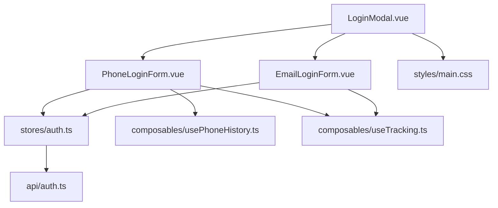
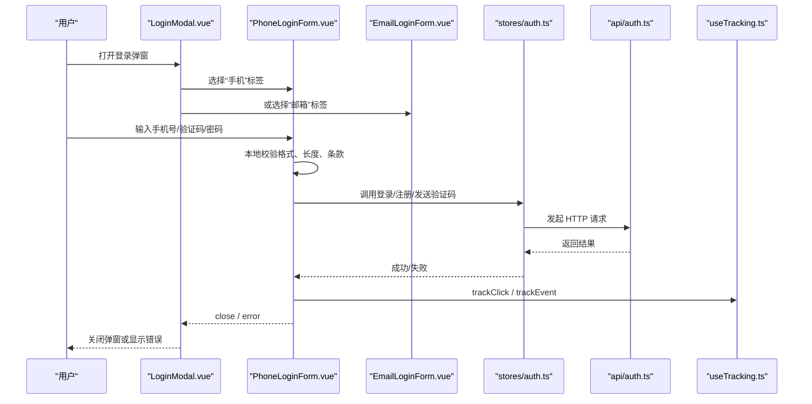
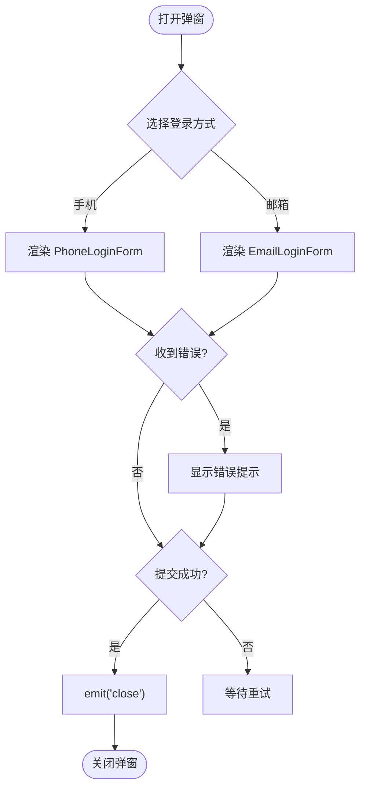
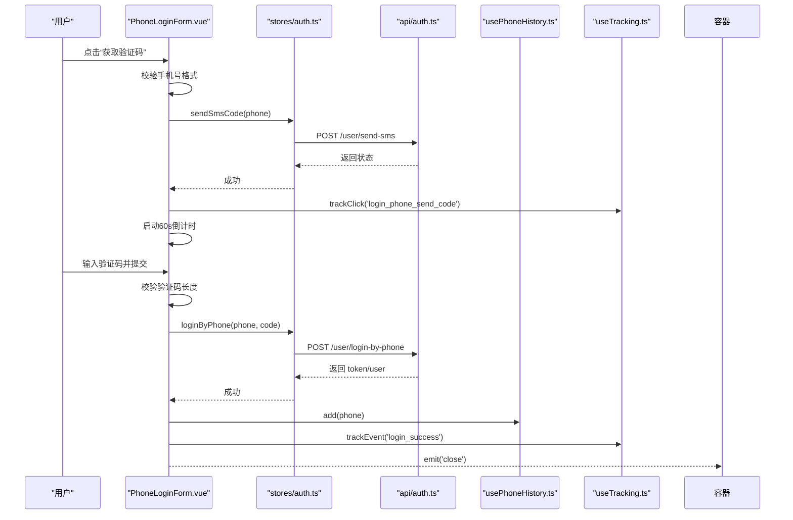
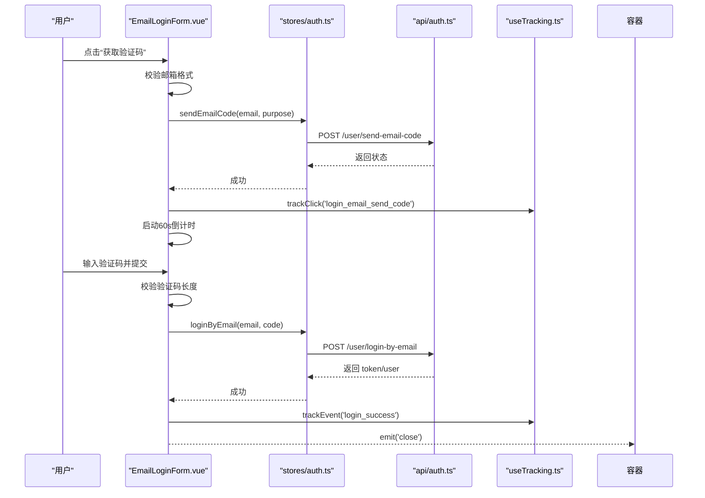
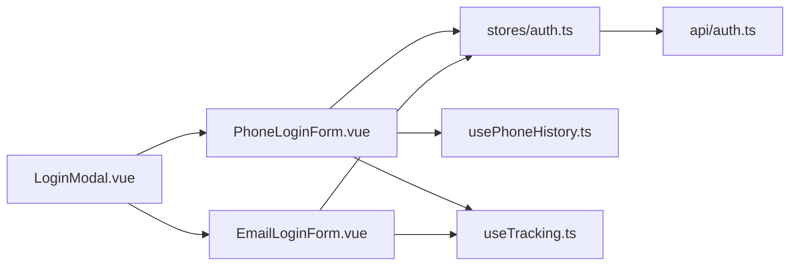

# 表单组件

<cite>
**本文引用的文件**
- [EmailLoginForm.vue](file://web/app/src/components/common/EmailLoginForm.vue)
- [PhoneLoginForm.vue](file://web/app/src/components/common/PhoneLoginForm.vue)
- [LoginModal.vue](file://web/app/src/components/common/LoginModal.vue)
- [auth.ts（认证 Store）](file://web/app/src/stores/auth.ts)
- [auth.ts（API 封装）](file://web/app/src/api/auth.ts)
- [usePhoneHistory.ts](file://web/app/src/composables/usePhoneHistory.ts)
- [useTracking.ts](file://web/app/src/composables/useTracking.ts)
- [main.css（样式主题与输入控件）](file://web/app/src/styles/main.css)
</cite>

## 目录
1. [简介](#简介)
2. [项目结构](#项目结构)
3. [核心组件](#核心组件)
4. [架构总览](#架构总览)
5. [详细组件分析](#详细组件分析)
6. [依赖关系分析](#依赖关系分析)
7. [性能考虑](#性能考虑)
8. [故障排查指南](#故障排查指南)
9. [结论](#结论)
10. [附录：扩展与最佳实践](#附录：扩展与最佳实践)

## 简介
本文件面向前端开发者，系统性梳理登录相关表单组件 EmailLoginForm、PhoneLoginForm 以及容器 LoginModal 的设计与实现。内容覆盖：
- 表单验证机制、错误处理、用户输入校验
- 表单状态管理与提交流程
- Props/事件接口设计、样式定制与响应式适配
- 组合模式、自定义验证规则与国际化支持建议

## 项目结构
登录表单位于 web/app/src/components/common 下，采用“容器 + 具体表单”的组合模式：
- LoginModal：模态容器，负责切换手机/邮箱两种登录方式，统一错误展示与关闭逻辑
- PhoneLoginForm：手机号验证码/密码登录与注册
- EmailLoginForm：邮箱验证码/密码登录与注册

图表来源
- [LoginModal.vue:1-69](file://web/app/src/components/common/LoginModal.vue#L1-L69)
- [PhoneLoginForm.vue:1-157](file://web/app/src/components/common/PhoneLoginForm.vue#L1-L157)
- [EmailLoginForm.vue:1-143](file://web/app/src/components/common/EmailLoginForm.vue#L1-L143)
- [auth.ts（Store）:1-259](file://web/app/src/stores/auth.ts#L1-L259)
- [auth.ts（API）:1-195](file://web/app/src/api/auth.ts#L1-L195)
- [usePhoneHistory.ts:1-36](file://web/app/src/composables/usePhoneHistory.ts#L1-L36)
- [useTracking.ts:1-110](file://web/app/src/composables/useTracking.ts#L1-L110)
- [main.css:1-200](file://web/app/src/styles/main.css#L1-L200)

章节来源
- [LoginModal.vue:1-69](file://web/app/src/components/common/LoginModal.vue#L1-L69)
- [PhoneLoginForm.vue:1-157](file://web/app/src/components/common/PhoneLoginForm.vue#L1-L157)
- [EmailLoginForm.vue:1-143](file://web/app/src/components/common/EmailLoginForm.vue#L1-L143)

## 核心组件
- LoginModal：提供“手机/邮箱”双入口的登录弹窗，集中管理错误消息与关闭事件；通过 Teleport 挂载到 body，确保层级正确。
- PhoneLoginForm：支持短信验证码登录、密码登录、注册；内置手机号格式校验、验证码长度校验、同意条款控制；维护发送验证码倒计时；登录后记录最近手机号历史。
- EmailLoginForm：支持邮箱验证码登录、密码登录、注册；内置邮箱格式校验、验证码长度校验、同意条款控制；维护发送验证码倒计时。

章节来源
- [LoginModal.vue:1-69](file://web/app/src/components/common/LoginModal.vue#L1-L69)
- [PhoneLoginForm.vue:1-157](file://web/app/src/components/common/PhoneLoginForm.vue#L1-L157)
- [EmailLoginForm.vue:1-143](file://web/app/src/components/common/EmailLoginForm.vue#L1-L143)

## 架构总览
表单组件通过 Pinia store 调用 API 完成认证流程，结合本地存储与埋点工具完善体验。

图表来源
- [LoginModal.vue:1-69](file://web/app/src/components/common/LoginModal.vue#L1-L69)
- [PhoneLoginForm.vue:1-157](file://web/app/src/components/common/PhoneLoginForm.vue#L1-L157)
- [EmailLoginForm.vue:1-143](file://web/app/src/components/common/EmailLoginForm.vue#L1-L143)
- [auth.ts（Store）:1-259](file://web/app/src/stores/auth.ts#L1-L259)
- [auth.ts（API）:1-195](file://web/app/src/api/auth.ts#L1-L195)
- [useTracking.ts:1-110](file://web/app/src/composables/useTracking.ts#L1-L110)

## 详细组件分析

### LoginModal 容器
- 职责：渲染登录弹窗外壳，提供“手机/邮箱”切换，聚合子组件错误信息，处理关闭事件。
- 交互：点击遮罩层可关闭；Tab 切换时清空错误信息。
- 事件：向父级暴露 close；接收子组件 error/close 事件。
- 样式：使用 Tailwind 构建弹窗、边框、阴影、暗色模式等；图标来自 RemixIcon。

图表来源
- [LoginModal.vue:1-69](file://web/app/src/components/common/LoginModal.vue#L1-L69)

章节来源
- [LoginModal.vue:1-69](file://web/app/src/components/common/LoginModal.vue#L1-L69)

### PhoneLoginForm 手机号表单
- 视图模式：快捷登录（验证码）、密码登录、新人注册三种模式切换。
- 输入校验：
  - 手机号格式：正则匹配中国大陆手机号
  - 验证码长度：至少6位
  - 密码长度：至少6位（注册可选）
  - 协议勾选：未勾选禁止提交
- 状态管理：loading、countdown、agreedToTerms、phoneForm
- 业务流：
  - 发送验证码：校验通过后调用 store.sendSmsCode，启动60秒倒计时，埋点 trackClick
  - 验证码登录：校验通过后调用 store.loginByPhone，成功后记录手机号历史并关闭弹窗
  - 密码登录：校验通过后调用 store.loginByPhonePassword，成功后记录手机号历史并关闭弹窗
  - 注册：校验通过后调用 store.registerByPhone，成功后关闭弹窗
- 错误处理：捕获网络异常，向上抛出 error 事件由容器统一展示
- 辅助能力：usePhoneHistory 维护最近使用的手机号（最多5条），提升复填效率

图表来源
- [PhoneLoginForm.vue:1-157](file://web/app/src/components/common/PhoneLoginForm.vue#L1-L157)
- [auth.ts（Store）:81-100](file://web/app/src/stores/auth.ts#L81-L100)
- [auth.ts（API）:54-72](file://web/app/src/api/auth.ts#L54-L72)
- [usePhoneHistory.ts:1-36](file://web/app/src/composables/usePhoneHistory.ts#L1-L36)
- [useTracking.ts:86-93](file://web/app/src/composables/useTracking.ts#L86-L93)

章节来源
- [PhoneLoginForm.vue:1-157](file://web/app/src/components/common/PhoneLoginForm.vue#L1-L157)
- [auth.ts（Store）:81-100](file://web/app/src/stores/auth.ts#L81-L100)
- [auth.ts（API）:54-72](file://web/app/src/api/auth.ts#L54-L72)
- [usePhoneHistory.ts:1-36](file://web/app/src/composables/usePhoneHistory.ts#L1-L36)
- [useTracking.ts:86-93](file://web/app/src/composables/useTracking.ts#L86-L93)

### EmailLoginForm 邮箱表单
- 视图模式：快捷登录（验证码）、密码登录、新人注册三种模式切换。
- 输入校验：
  - 邮箱格式：基础邮箱正则校验
  - 验证码长度：至少6位
  - 密码长度：至少6位（注册可选）
  - 协议勾选：未勾选禁止提交
- 状态管理：loading、countdown、agreedToTerms、emailForm
- 业务流：
  - 发送验证码：根据当前模式决定 purpose（login/register），调用 store.sendEmailCode，启动60秒倒计时，埋点 trackClick
  - 验证码登录：校验通过后调用 store.loginByEmail，成功后关闭弹窗
  - 密码登录：校验通过后调用 store.loginByEmailPassword，成功后关闭弹窗
  - 注册：校验通过后调用 store.registerByEmail，成功后关闭弹窗
- 错误处理：捕获网络异常，向上抛出 error 事件由容器统一展示

图表来源
- [EmailLoginForm.vue:1-143](file://web/app/src/components/common/EmailLoginForm.vue#L1-L143)
- [auth.ts（Store）:102-121](file://web/app/src/stores/auth.ts#L102-L121)
- [auth.ts（API）:75-93](file://web/app/src/api/auth.ts#L75-L93)
- [useTracking.ts:86-93](file://web/app/src/composables/useTracking.ts#L86-L93)

章节来源
- [EmailLoginForm.vue:1-143](file://web/app/src/components/common/EmailLoginForm.vue#L1-L143)
- [auth.ts（Store）:102-121](file://web/app/src/stores/auth.ts#L102-L121)
- [auth.ts（API）:75-93](file://web/app/src/api/auth.ts#L75-L93)
- [useTracking.ts:86-93](file://web/app/src/composables/useTracking.ts#L86-L93)

### 表单验证机制与错误处理
- 客户端校验：
  - 邮箱：正则匹配基本邮箱格式
  - 手机：正则匹配中国大陆手机号段
  - 验证码：长度不少于6位
  - 密码：长度不少于6位（注册可选）
  - 协议勾选：未勾选禁用提交按钮
- 服务端错误：
  - 统一在 catch 中读取 response.data.detail 或默认文案，通过 error 事件冒泡至容器展示
- 用户体验：
  - loading 状态防止重复提交
  - 验证码倒计时避免频繁请求
  - 最近手机号历史减少重复输入

章节来源
- [EmailLoginForm.vue:27-74](file://web/app/src/components/common/EmailLoginForm.vue#L27-L74)
- [PhoneLoginForm.vue:29-79](file://web/app/src/components/common/PhoneLoginForm.vue#L29-L79)
- [LoginModal.vue:17-22](file://web/app/src/components/common/LoginModal.vue#L17-L22)

### 表单状态管理
- 组件内状态：loading、countdown、agreedToTerms、表单数据对象
- 全局状态：Pinia auth store 管理 token、refreshToken、用户信息、登录态、弹窗显隐
- 持久化：
  - 登录态与用户信息写入 localStorage
  - 最近手机号写入 localStorage（最多5条）
  - 登录弹窗显隐写入 sessionStorage

章节来源
- [auth.ts（Store）:8-79](file://web/app/src/stores/auth.ts#L8-L79)
- [usePhoneHistory.ts:1-36](file://web/app/src/composables/usePhoneHistory.ts#L1-L36)
- [EmailLoginForm.vue:12-20](file://web/app/src/components/common/EmailLoginForm.vue#L12-L20)
- [PhoneLoginForm.vue:14-22](file://web/app/src/components/common/PhoneLoginForm.vue#L14-L22)

### 提交流程
- 发送验证码：
  - 校验输入 -> 调用 store -> 调用 api -> 成功则启动倒计时 -> 埋点
- 登录/注册：
  - 校验输入 -> 调用 store -> 调用 api -> 成功则更新全局状态 -> 埋点 -> 关闭弹窗
- 错误路径：
  - 捕获异常 -> 提取后端 detail -> 冒泡 error -> 容器展示

章节来源
- [PhoneLoginForm.vue:44-79](file://web/app/src/components/common/PhoneLoginForm.vue#L44-L79)
- [EmailLoginForm.vue:38-74](file://web/app/src/components/common/EmailLoginForm.vue#L38-L74)
- [auth.ts（Store）:81-121](file://web/app/src/stores/auth.ts#L81-L121)
- [auth.ts（API）:54-93](file://web/app/src/api/auth.ts#L54-L93)

### 样式定制与响应式适配
- 主题：基于 CSS 变量定义主色调，支持亮/暗模式
- 输入框：统一的 focus ring、边框、圆角、过渡动效
- 触摸目标：最小高度 44px，优化移动端点击体验
- 安全区域：适配刘海屏/底部横条的安全边距
- 弹窗：固定定位、半透明遮罩、居中布局、最大宽度限制

章节来源
- [main.css:5-35](file://web/app/src/styles/main.css#L5-L35)
- [main.css:54-70](file://web/app/src/styles/main.css#L54-L70)
- [main.css:156-162](file://web/app/src/styles/main.css#L156-L162)
- [LoginModal.vue:26-67](file://web/app/src/components/common/LoginModal.vue#L26-L67)

## 依赖关系分析
- 组件耦合：
  - LoginModal 仅依赖两个表单组件的事件契约（close/error），低耦合
  - 表单组件依赖 auth store 与 useTracking，解耦 UI 与业务
- 外部依赖：
  - axios 通过 apiClient 进行 HTTP 请求
  - Pinia 管理全局状态
  - Vue 3 Composition API 管理局部状态
- 潜在循环依赖：无直接循环引用

图表来源
- [LoginModal.vue:1-69](file://web/app/src/components/common/LoginModal.vue#L1-L69)
- [PhoneLoginForm.vue:1-157](file://web/app/src/components/common/PhoneLoginForm.vue#L1-L157)
- [EmailLoginForm.vue:1-143](file://web/app/src/components/common/EmailLoginForm.vue#L1-L143)
- [auth.ts（Store）:1-259](file://web/app/src/stores/auth.ts#L1-L259)
- [auth.ts（API）:1-195](file://web/app/src/api/auth.ts#L1-L195)
- [usePhoneHistory.ts:1-36](file://web/app/src/composables/usePhoneHistory.ts#L1-L36)
- [useTracking.ts:1-110](file://web/app/src/composables/useTracking.ts#L1-L110)

章节来源
- [LoginModal.vue:1-69](file://web/app/src/components/common/LoginModal.vue#L1-L69)
- [PhoneLoginForm.vue:1-157](file://web/app/src/components/common/PhoneLoginForm.vue#L1-L157)
- [EmailLoginForm.vue:1-143](file://web/app/src/components/common/EmailLoginForm.vue#L1-L143)
- [auth.ts（Store）:1-259](file://web/app/src/stores/auth.ts#L1-L259)
- [auth.ts（API）:1-195](file://web/app/src/api/auth.ts#L1-L195)
- [usePhoneHistory.ts:1-36](file://web/app/src/composables/usePhoneHistory.ts#L1-L36)
- [useTracking.ts:1-110](file://web/app/src/composables/useTracking.ts#L1-L110)

## 性能考虑
- 防抖/节流：验证码倒计时已内置，避免高频请求
- 批量埋点：useTracking 内部队列合并上报，降低网络开销
- 本地缓存：最近手机号历史减少输入成本
- 资源加载：Teleport 将弹窗挂载到 body，避免重排重绘影响
- 图片/图标：使用 SVG 图标，体积小且清晰

[本节为通用指导，不直接分析具体文件]

## 故障排查指南
- 无法发送验证码
  - 检查手机号/邮箱格式是否正确
  - 查看倒计时是否仍在运行
  - 确认后端接口是否可达，关注错误消息
- 登录失败
  - 检查验证码/密码是否正确
  - 查看网络请求返回的 detail 字段
  - 确认全局登录态是否被刷新或失效
- 弹窗不关闭
  - 检查子组件是否正确 emit('close')
  - 确认容器是否正确监听 close 事件
- 样式异常
  - 检查 Tailwind 配置与主题变量
  - 确认暗色模式类名生效

章节来源
- [PhoneLoginForm.vue:44-79](file://web/app/src/components/common/PhoneLoginForm.vue#L44-L79)
- [EmailLoginForm.vue:38-74](file://web/app/src/components/common/EmailLoginForm.vue#L38-L74)
- [LoginModal.vue:17-22](file://web/app/src/components/common/LoginModal.vue#L17-L22)
- [auth.ts（Store）:171-183](file://web/app/src/stores/auth.ts#L171-L183)

## 结论
该表单体系以“容器 + 具体表单”的组合模式实现，职责清晰、耦合度低；通过 Pinia 统一管理认证状态，结合本地存储与埋点工具提升用户体验。验证规则集中在组件内，错误统一冒泡至容器展示，便于维护与扩展。整体具备良好的可测试性与可扩展性。

[本节为总结性内容，不直接分析具体文件]

## 附录：扩展与最佳实践

### 表单组合模式
- 容器组件只负责布局与事件转发，不包含具体业务逻辑
- 具体表单组件聚焦于输入校验与业务流程
- 通过 defineEmits 定义明确的事件契约，便于替换与复用

章节来源
- [LoginModal.vue:1-69](file://web/app/src/components/common/LoginModal.vue#L1-L69)
- [PhoneLoginForm.vue:1-157](file://web/app/src/components/common/PhoneLoginForm.vue#L1-L157)
- [EmailLoginForm.vue:1-143](file://web/app/src/components/common/EmailLoginForm.vue#L1-L143)

### 自定义验证规则
- 将正则表达式抽取为独立函数，便于复用与测试
- 对复杂规则（如多条件组合）可封装为校验器函数
- 建议在表单提交前进行预校验，减少无效请求

章节来源
- [EmailLoginForm.vue:27-27](file://web/app/src/components/common/EmailLoginForm.vue#L27-L27)
- [PhoneLoginForm.vue:29-29](file://web/app/src/components/common/PhoneLoginForm.vue#L29-L29)

### 国际化支持建议
- 将文案抽离为 i18n 键值，避免硬编码中文
- 错误提示、占位符、按钮文案均纳入翻译表
- 根据语言环境动态切换表单提示与帮助文本

[本节为概念性建议，不直接分析具体文件]

### 响应式适配要点
- 使用 Tailwind 的响应式断点与实用类
- 保证触摸目标尺寸符合无障碍标准
- 适配安全区域与深色模式

章节来源
- [main.css:54-70](file://web/app/src/styles/main.css#L54-L70)
- [LoginModal.vue:26-67](file://web/app/src/components/common/LoginModal.vue#L26-L67)