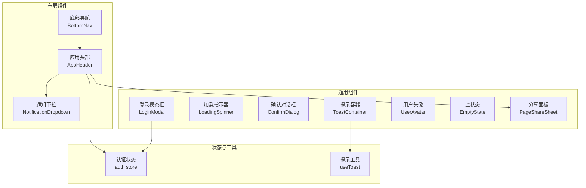
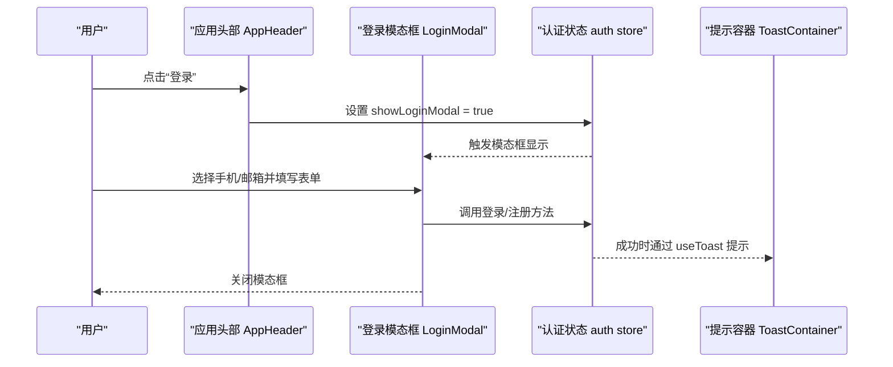
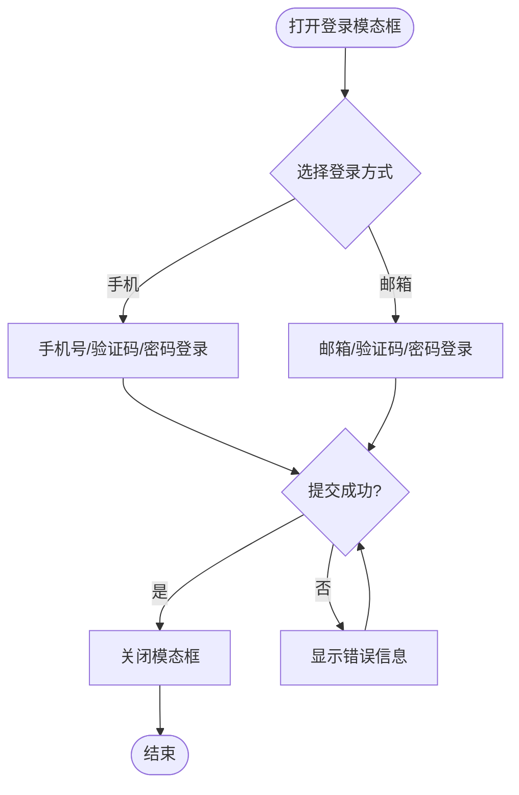
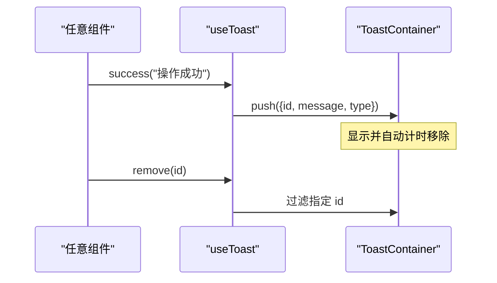
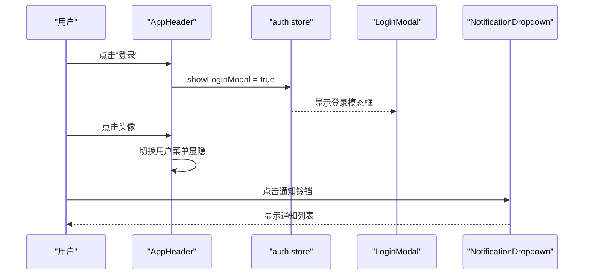
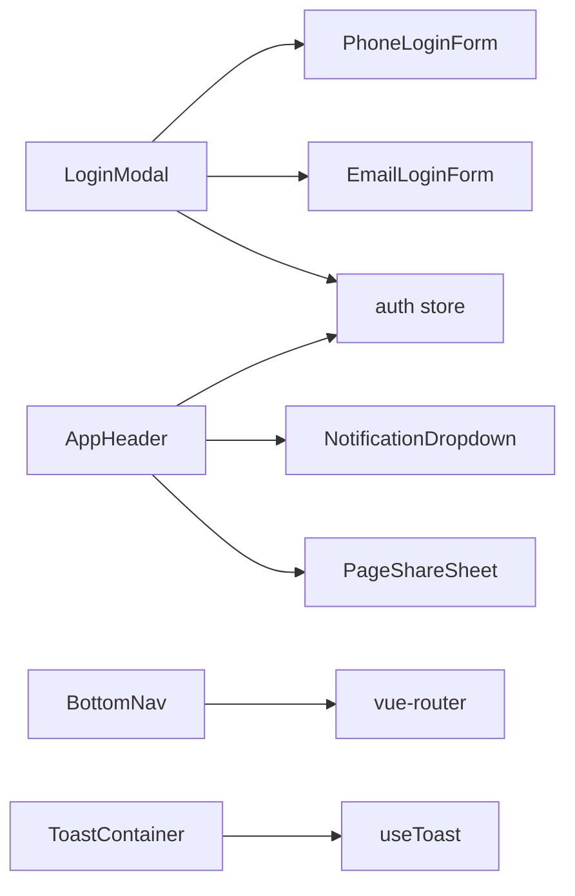

# 通用组件库

<cite>
**本文引用的文件**
- [LoginModal.vue](file://web/app/src/components/common/LoginModal.vue)
- [PhoneLoginForm.vue](file://web/app/src/components/common/PhoneLoginForm.vue)
- [EmailLoginForm.vue](file://web/app/src/components/common/EmailLoginForm.vue)
- [LoadingSpinner.vue](file://web/app/src/components/common/LoadingSpinner.vue)
- [ConfirmDialog.vue](file://web/app/src/components/common/ConfirmDialog.vue)
- [ToastContainer.vue](file://web/app/src/components/common/ToastContainer.vue)
- [useToast.ts](file://web/app/src/composables/useToast.ts)
- [AppHeader.vue](file://web/app/src/components/layout/AppHeader.vue)
- [BottomNav.vue](file://web/app/src/components/layout/BottomNav.vue)
- [NotificationDropdown.vue](file://web/app/src/components/layout/NotificationDropdown.vue)
- [PageShareSheet.vue](file://web/app/src/components/common/PageShareSheet.vue)
- [UserAvatar.vue](file://web/app/src/components/common/UserAvatar.vue)
- [EmptyState.vue](file://web/app/src/components/common/EmptyState.vue)
- [auth.ts](file://web/app/src/stores/auth.ts)
- [main.css](file://web/app/src/styles/main.css)
</cite>

## 目录
1. [简介](#简介)
2. [项目结构](#项目结构)
3. [核心组件](#核心组件)
4. [架构总览](#架构总览)
5. [详细组件分析](#详细组件分析)
6. [依赖关系分析](#依赖关系分析)
7. [性能考量](#性能考量)
8. [故障排查指南](#故障排查指南)
9. [结论](#结论)
10. [附录](#附录)

## 简介
本仓库包含一套可复用的前端通用组件，覆盖登录模态框、加载指示器、确认对话框、提示容器、应用头部与底部导航等关键交互。组件采用 Vue 3 + TypeScript + Tailwind CSS 构建，遵循统一的样式主题、无障碍访问与响应式适配原则，并通过组合式函数与状态管理实现跨页面复用。

## 项目结构
- 组件按职责分层组织：
  - common：通用 UI 组件（登录、加载、确认、提示、空状态、头像、分享面板）
  - layout：全局布局组件（顶部导航、底部导航、通知下拉）
  - composables：跨组件共享逻辑（如 Toast 提示）
  - stores：全局状态（如认证状态）
  - styles：全局样式与主题变量

图表来源
- [LoginModal.vue:1-69](file://web/app/src/components/common/LoginModal.vue#L1-L69)
- [AppHeader.vue:1-220](file://web/app/src/components/layout/AppHeader.vue#L1-L220)
- [BottomNav.vue:1-184](file://web/app/src/components/layout/BottomNav.vue#L1-L184)
- [NotificationDropdown.vue:1-260](file://web/app/src/components/layout/NotificationDropdown.vue#L1-L260)
- [ToastContainer.vue:1-47](file://web/app/src/components/common/ToastContainer.vue#L1-L47)
- [useToast.ts:1-31](file://web/app/src/composables/useToast.ts#L1-L31)
- [auth.ts:1-259](file://web/app/src/stores/auth.ts#L1-L259)

章节来源
- [LoginModal.vue:1-69](file://web/app/src/components/common/LoginModal.vue#L1-L69)
- [AppHeader.vue:1-220](file://web/app/src/components/layout/AppHeader.vue#L1-L220)
- [BottomNav.vue:1-184](file://web/app/src/components/layout/BottomNav.vue#L1-L184)
- [NotificationDropdown.vue:1-260](file://web/app/src/components/layout/NotificationDropdown.vue#L1-L260)
- [ToastContainer.vue:1-47](file://web/app/src/components/common/ToastContainer.vue#L1-L47)
- [useToast.ts:1-31](file://web/app/src/composables/useToast.ts#L1-L31)
- [auth.ts:1-259](file://web/app/src/stores/auth.ts#L1-L259)

## 核心组件
- 登录模态框：支持手机/邮箱两种登录方式切换，统一错误处理与关闭事件，透传至 body 渲染以覆盖全屏遮罩。
- 加载指示器：提供 spinner/pulse/skeleton 三种变体，支持自定义消息与骨架屏数量。
- 确认对话框：统一确认/取消行为，支持加载态与自定义按钮样式。
- 提示容器：集中展示 success/warning/error/info 类型提示，自动定时移除。
- 应用头部：品牌标识、主导航、分享入口、通知铃铛、用户菜单；根据环境区分样式。
- 底部导航：移动端固定底部导航，滚动隐藏/显示，路由高亮匹配。
- 通知下拉：动态定位、未读计数轮询、列表加载与标记已读。
- 分享面板：多平台分享入口（微信、朋友圈、微博、复制链接、生成海报）。
- 用户头像：图片/首字母回退、尺寸可控、可选编辑上传遮罩。
- 空状态：统一空白页占位，支持图标、标题、描述与操作按钮。

章节来源
- [LoginModal.vue:1-69](file://web/app/src/components/common/LoginModal.vue#L1-L69)
- [LoadingSpinner.vue:1-48](file://web/app/src/components/common/LoadingSpinner.vue#L1-L48)
- [ConfirmDialog.vue:1-60](file://web/app/src/components/common/ConfirmDialog.vue#L1-L60)
- [ToastContainer.vue:1-47](file://web/app/src/components/common/ToastContainer.vue#L1-L47)
- [AppHeader.vue:1-220](file://web/app/src/components/layout/AppHeader.vue#L1-L220)
- [BottomNav.vue:1-184](file://web/app/src/components/layout/BottomNav.vue#L1-L184)
- [NotificationDropdown.vue:1-260](file://web/app/src/components/layout/NotificationDropdown.vue#L1-L260)
- [PageShareSheet.vue:1-187](file://web/app/src/components/common/PageShareSheet.vue#L1-L187)
- [UserAvatar.vue:1-99](file://web/app/src/components/common/UserAvatar.vue#L1-L99)
- [EmptyState.vue:1-37](file://web/app/src/components/common/EmptyState.vue#L1-L37)

## 架构总览
组件通过状态管理与组合式函数解耦业务逻辑，UI 层仅负责呈现与事件派发。主题与样式由全局 CSS 变量与 Tailwind 类统一管理，确保一致性与可定制性。

图表来源
- [AppHeader.vue:37-43](file://web/app/src/components/layout/AppHeader.vue#L37-L43)
- [LoginModal.vue:17-22](file://web/app/src/components/common/LoginModal.vue#L17-L22)
- [auth.ts:81-121](file://web/app/src/stores/auth.ts#L81-L121)
- [useToast.ts:12-30](file://web/app/src/composables/useToast.ts#L12-L30)

## 详细组件分析

### 登录模态框（LoginModal）
- Props/Emits
  - Emits: close
  - 内部维护 activeMethod（phone/email）、errorMessage
- 交互流程
  - 顶部标签切换登录方式
  - 子表单 PhoneLoginForm / EmailLoginForm 通过 @close/@error 向父级汇报
  - 点击遮罩或关闭按钮触发 close
- 可访问性
  - 使用 Teleport to body 保证层级与焦点管理
  - 链接具备语义化文本
- 主题与响应式
  - 基于 Tailwind 的 dark 模式与 primary 色板
  - 最大宽度与内边距适配移动端

图表来源
- [LoginModal.vue:12-22](file://web/app/src/components/common/LoginModal.vue#L12-L22)
- [PhoneLoginForm.vue:44-79](file://web/app/src/components/common/PhoneLoginForm.vue#L44-L79)
- [EmailLoginForm.vue:38-74](file://web/app/src/components/common/EmailLoginForm.vue#L38-L74)

章节来源
- [LoginModal.vue:1-69](file://web/app/src/components/common/LoginModal.vue#L1-L69)
- [PhoneLoginForm.vue:1-157](file://web/app/src/components/common/PhoneLoginForm.vue#L1-L157)
- [EmailLoginForm.vue:1-143](file://web/app/src/components/common/EmailLoginForm.vue#L1-L143)

### 加载指示器（LoadingSpinner）
- Props
  - message: string（默认“加载中...”）
  - variant: 'spinner' | 'pulse' | 'skeleton'（默认 spinner）
  - skeletonCount: number（默认 6）
- 行为
  - spinner：旋转圆环 + 可选文案
  - pulse：图标脉冲动画 + 可选文案
  - skeleton：网格骨架屏，列数随屏幕变化
- 主题
  - 使用 primary 色系与暗色模式兼容

章节来源
- [LoadingSpinner.vue:1-48](file://web/app/src/components/common/LoadingSpinner.vue#L1-L48)

### 确认对话框（ConfirmDialog）
- Props
  - visible: boolean
  - title/message/confirmText/cancelText/confirmClass/loading
- 事件
  - confirm/cancel
- 行为
  - 点击遮罩触发 cancel
  - loading 状态下禁用按钮并显示“处理中...”
- 可访问性
  - 使用 Teleport to body 保证层级

章节来源
- [ConfirmDialog.vue:1-60](file://web/app/src/components/common/ConfirmDialog.vue#L1-L60)

### 提示容器（ToastContainer）与提示工具（useToast）
- ToastContainer
  - 挂载于 body，右上角堆叠显示
  - 根据 type 渲染不同样式
  - 支持手动关闭
- useToast
  - 提供 show/success/warning/error/remove
  - 自动定时移除，返回 id 便于精确删除
- 组合使用
  - 任意组件通过 useToast() 获取实例并调用

图表来源
- [useToast.ts:12-30](file://web/app/src/composables/useToast.ts#L12-L30)
- [ToastContainer.vue:1-47](file://web/app/src/components/common/ToastContainer.vue#L1-L47)

章节来源
- [ToastContainer.vue:1-47](file://web/app/src/components/common/ToastContainer.vue#L1-L47)
- [useToast.ts:1-31](file://web/app/src/composables/useToast.ts#L1-L31)

### 应用头部（AppHeader）
- 功能
  - 品牌 Logo 与站点名
  - 桌面端主导航（问答/日记/测评/白友圈），路由高亮
  - 分享按钮（打开 PageShareSheet）
  - 通知铃铛（NotificationDropdown，登录后显示）
  - 用户菜单（头像/用户名/个人中心/隐私政策/退出登录）
- 交互
  - 点击头像或登录按钮控制登录模态框显示
  - 点击外部区域收起用户菜单
  - 计算当前路由是否处于活动状态
- 主题与环境
  - staging 环境深色导航栏与浅色文字
  - 使用 primary 色系与 dark 模式

图表来源
- [AppHeader.vue:37-43](file://web/app/src/components/layout/AppHeader.vue#L37-L43)
- [AppHeader.vue:119-171](file://web/app/src/components/layout/AppHeader.vue#L119-L171)
- [NotificationDropdown.vue:124-131](file://web/app/src/components/layout/NotificationDropdown.vue#L124-L131)

章节来源
- [AppHeader.vue:1-220](file://web/app/src/components/layout/AppHeader.vue#L1-L220)

### 底部导航（BottomNav）
- 功能
  - 四个主要入口：问答/日记/测评/白友圈
  - 滚动监听：下滚隐藏、上滚显示
  - 路由高亮：对子路径进行前缀匹配
- 可访问性
  - role="navigation" 与 aria-label
- 响应式
  - 移动端固定底部，桌面端隐藏

章节来源
- [BottomNav.vue:1-184](file://web/app/src/components/layout/BottomNav.vue#L1-L184)

### 通知下拉（NotificationDropdown）
- 功能
  - 未读计数轮询（每 30 秒）
  - 列表加载、标记单条/全部已读
  - 点击跳转对应内容或用户主页
  - 动态定位：移动端全宽、桌面端右对齐且限制在视口内
- 可访问性
  - 按钮具备 aria-label
- 主题
  - 根据 isStaging 调整颜色

章节来源
- [NotificationDropdown.vue:1-260](file://web/app/src/components/layout/NotificationDropdown.vue#L1-L260)

### 分享面板（PageShareSheet）
- 功能
  - 复制链接（优先 Clipboard API，降级 fallback）
  - 微信分享（初始化后设置分享数据）
  - 朋友圈、微博、抖音、小红书（部分为引导保存海报）
  - 生成海报（emit generate-poster）
- 可访问性
  - 按钮具备明确文本与语义
- 主题
  - 卡片式弹窗，移动端底部弹出，桌面端居中

章节来源
- [PageShareSheet.vue:1-187](file://web/app/src/components/common/PageShareSheet.vue#L1-L187)

### 用户头像（UserAvatar）
- Props
  - imageUrl/initial/size/editable/uploading/userId
- 行为
  - 图片加载失败回退为首字母
  - 可配置尺寸与编辑遮罩
  - 可选包裹为链接（userId）
- 主题
  - 使用 primary 色系与 dark 模式

章节来源
- [UserAvatar.vue:1-99](file://web/app/src/components/common/UserAvatar.vue#L1-L99)

### 空状态（EmptyState）
- Props
  - icon/title/description/actionLabel
- 行为
  - 点击按钮 emit action
- 主题
  - 统一灰度与间距

章节来源
- [EmptyState.vue:1-37](file://web/app/src/components/common/EmptyState.vue#L1-L37)

## 依赖关系分析
- 组件耦合
  - LoginModal 依赖 PhoneLoginForm/EmailLoginForm 与 auth store
  - AppHeader 依赖 auth store、NotificationDropdown、PageShareSheet
  - BottomNav 依赖 vue-router 进行路由判断
  - ToastContainer 依赖 useToast
  - NotificationDropdown 依赖 notificationApi 与 router
- 外部依赖
  - Tailwind CSS 用于样式与主题
  - Vue Router 用于导航与高亮
  - Pinia（auth store）用于状态管理
- 潜在循环依赖
  - 无直接循环依赖；组件间通过 store 与事件通信

图表来源
- [LoginModal.vue:1-69](file://web/app/src/components/common/LoginModal.vue#L1-L69)
- [AppHeader.vue:1-220](file://web/app/src/components/layout/AppHeader.vue#L1-L220)
- [BottomNav.vue:1-184](file://web/app/src/components/layout/BottomNav.vue#L1-L184)
- [ToastContainer.vue:1-47](file://web/app/src/components/common/ToastContainer.vue#L1-L47)
- [useToast.ts:1-31](file://web/app/src/composables/useToast.ts#L1-L31)

章节来源
- [LoginModal.vue:1-69](file://web/app/src/components/common/LoginModal.vue#L1-L69)
- [AppHeader.vue:1-220](file://web/app/src/components/layout/AppHeader.vue#L1-L220)
- [BottomNav.vue:1-184](file://web/app/src/components/layout/BottomNav.vue#L1-L184)
- [ToastContainer.vue:1-47](file://web/app/src/components/common/ToastContainer.vue#L1-L47)
- [useToast.ts:1-31](file://web/app/src/composables/useToast.ts#L1-L31)

## 性能考量
- 渲染优化
  - 使用 Teleport 将模态/提示/下拉等浮层挂载到 body，减少 DOM 层级与重排
  - 骨架屏替代长列表加载时的闪烁
- 事件与监听
  - 滚动监听使用 passive 提升滚动性能
  - 通知未读计数轮询间隔合理（30 秒）
- 资源加载
  - 头像加载失败快速回退，避免阻塞
  - 分享面板按需弹出，减少初始开销
- 主题与样式
  - 基于 CSS 变量的主题切换，避免重复计算

[本节为通用指导，不直接分析具体文件]

## 故障排查指南
- 登录失败
  - 检查手机号/邮箱格式校验
  - 查看表单错误提示与后端返回 detail
  - 参考：[PhoneLoginForm.vue:44-79](file://web/app/src/components/common/PhoneLoginForm.vue#L44-L79)、[EmailLoginForm.vue:38-74](file://web/app/src/components/common/EmailLoginForm.vue#L38-L74)
- 提示不消失
  - 确认 useToast 的 duration 与 remove 调用
  - 参考：[useToast.ts:12-30](file://web/app/src/composables/useToast.ts#L12-L30)
- 通知下拉位置异常
  - 检查窗口 resize/scroll 事件绑定与更新逻辑
  - 参考：[NotificationDropdown.vue:22-54](file://web/app/src/components/layout/NotificationDropdown.vue#L22-L54)
- 底部导航不隐藏
  - 检查滚动阈值与 lastScrollY 更新
  - 参考：[BottomNav.vue:35-52](file://web/app/src/components/layout/BottomNav.vue#L35-L52)
- 头像不显示
  - 检查图片 URL 与错误回退逻辑
  - 参考：[UserAvatar.vue:42-53](file://web/app/src/components/common/UserAvatar.vue#L42-L53)

章节来源
- [PhoneLoginForm.vue:44-79](file://web/app/src/components/common/PhoneLoginForm.vue#L44-L79)
- [EmailLoginForm.vue:38-74](file://web/app/src/components/common/EmailLoginForm.vue#L38-L74)
- [useToast.ts:12-30](file://web/app/src/composables/useToast.ts#L12-L30)
- [NotificationDropdown.vue:22-54](file://web/app/src/components/layout/NotificationDropdown.vue#L22-L54)
- [BottomNav.vue:35-52](file://web/app/src/components/layout/BottomNav.vue#L35-L52)
- [UserAvatar.vue:42-53](file://web/app/src/components/common/UserAvatar.vue#L42-L53)

## 结论
该通用组件库以清晰的职责划分、统一的主题与样式体系、完善的可访问性与响应式适配为基础，提供了登录、加载、确认、提示、导航与分享等高频场景的标准化实现。通过组合式函数与状态管理，组件具备良好的可复用性与可扩展性，适合在多页面应用中保持一致的用户体验。

[本节为总结性内容，不直接分析具体文件]

## 附录

### 组件 Props 与事件速查
- LoginModal
  - Emits: close
  - 内部状态: activeMethod, errorMessage
- LoadingSpinner
  - Props: message, variant, skeletonCount
- ConfirmDialog
  - Props: visible, title, message, confirmText, cancelText, confirmClass, loading
  - Emits: confirm, cancel
- ToastContainer
  - 数据来源: useToast().toasts
  - 事件: 点击关闭按钮调用 remove(id)
- AppHeader
  - 行为: 控制登录模态框、用户菜单、分享面板、通知下拉
- BottomNav
  - 行为: 路由高亮、滚动隐藏/显示
- NotificationDropdown
  - 行为: 轮询未读、列表加载、标记已读、动态定位
- PageShareSheet
  - Props: visible, title, description, url
  - Emits: close, generate-poster
- UserAvatar
  - Props: imageUrl, initial, size, editable, uploading, userId
  - Emits: click
- EmptyState
  - Props: icon, title, description, actionLabel
  - Emits: action

章节来源
- [LoginModal.vue:1-69](file://web/app/src/components/common/LoginModal.vue#L1-L69)
- [LoadingSpinner.vue:1-48](file://web/app/src/components/common/LoadingSpinner.vue#L1-L48)
- [ConfirmDialog.vue:1-60](file://web/app/src/components/common/ConfirmDialog.vue#L1-L60)
- [ToastContainer.vue:1-47](file://web/app/src/components/common/ToastContainer.vue#L1-L47)
- [AppHeader.vue:1-220](file://web/app/src/components/layout/AppHeader.vue#L1-L220)
- [BottomNav.vue:1-184](file://web/app/src/components/layout/BottomNav.vue#L1-L184)
- [NotificationDropdown.vue:1-260](file://web/app/src/components/layout/NotificationDropdown.vue#L1-L260)
- [PageShareSheet.vue:1-187](file://web/app/src/components/common/PageShareSheet.vue#L1-L187)
- [UserAvatar.vue:1-99](file://web/app/src/components/common/UserAvatar.vue#L1-L99)
- [EmptyState.vue:1-37](file://web/app/src/components/common/EmptyState.vue#L1-L37)

### 主题与样式要点
- 主题变量定义于 main.css，使用 HSL 色彩模型与 dark 模式
- 按钮、卡片、输入框等基础样式通过 Tailwind 类与组件类组合
- 安全区域适配（safe-area-inset）用于刘海屏设备

章节来源
- [main.css:5-35](file://web/app/src/styles/main.css#L5-L35)
- [main.css:92-193](file://web/app/src/styles/main.css#L92-L193)

### 最佳实践与扩展指南
- 组合模式
  - 将复杂表单拆分为子组件（如 PhoneLoginForm/EmailLoginForm），通过事件与父组件通信
- 插槽使用
  - 对于需要高度定制的容器（如分享面板），可通过 props 传递标题/描述/URL，必要时扩展插槽
- 主题支持
  - 新增颜色或组件样式时，优先使用 CSS 变量与 Tailwind 类，保持 dark 模式一致性
- 无障碍访问
  - 为交互元素添加 aria-label/role，确保键盘可达与屏幕阅读器友好
- 响应式适配
  - 使用 Tailwind 断点与媒体查询，确保移动端与桌面端体验一致
- 扩展建议
  - 新增组件时遵循现有命名与目录结构
  - 通过 useToast 统一反馈，避免分散的 alert/自定义提示
  - 使用 auth store 管理认证相关状态，避免重复逻辑

[本节为通用指导，不直接分析具体文件]