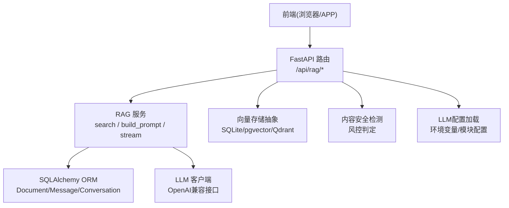
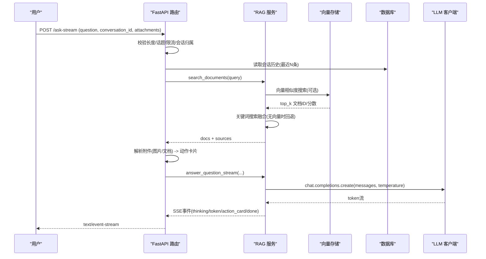
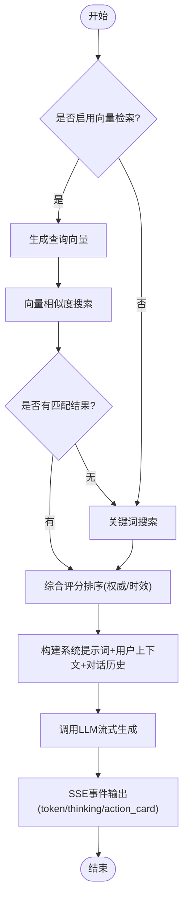
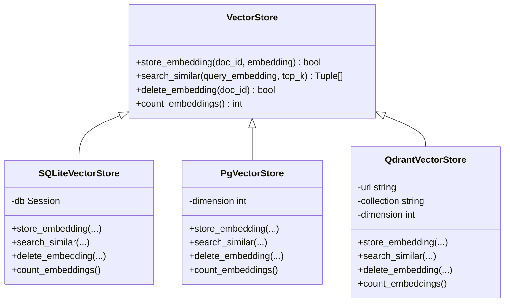
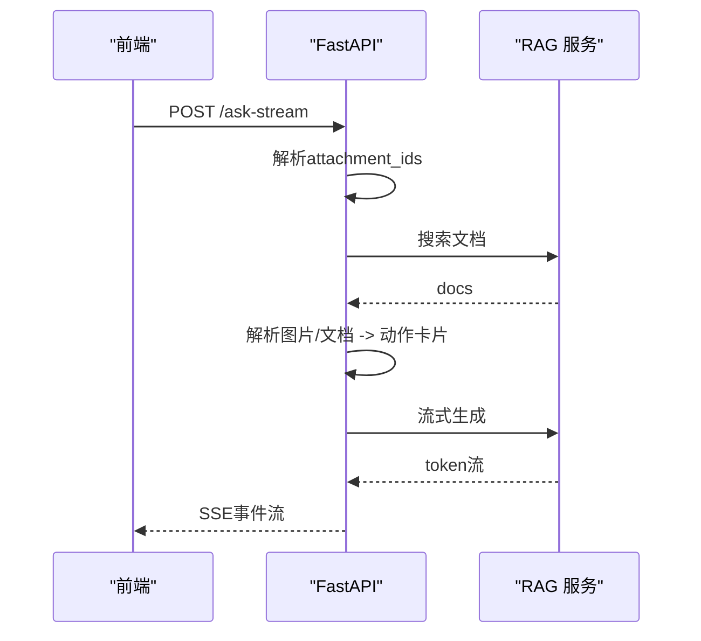
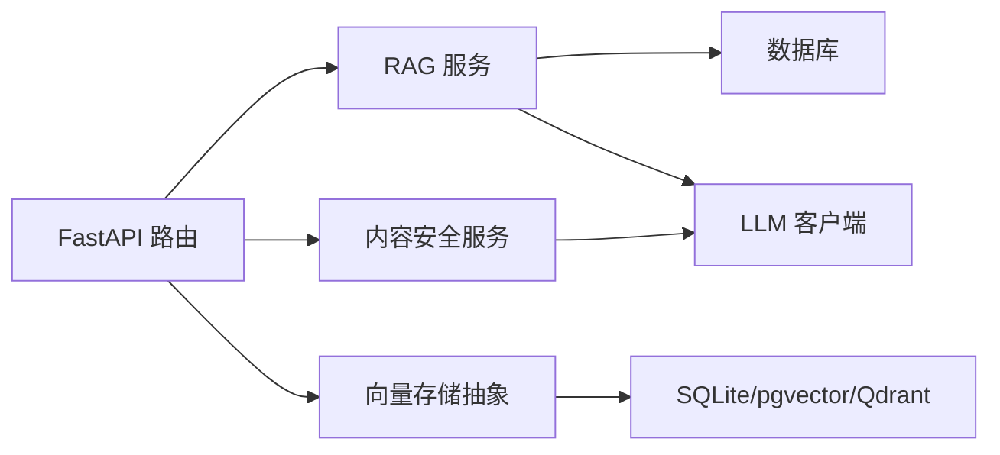

# AI问答服务

<cite>
**本文引用的文件**
- [web/backend/services/rag.py](file://web/backend/services/rag.py)
- [web/backend/api/rag.py](file://web/backend/api/rag.py)
- [web/backend/services/vector_store.py](file://web/backend/services/vector_store.py)
- [web/backend/models/rag.py](file://web/backend/models/rag.py)
- [web/backend/utils/llm_config.py](file://web/backend/utils/llm_config.py)
- [web/backend/services/content_safety.py](file://web/backend/services/content_safety.py)
- [configs/web_config.yaml](file://configs/web_config.yaml)
- [requirements/ai.txt](file://requirements/ai.txt)
- [tests/backend/api/test_rag.py](file://tests/backend/api/test_rag.py)
- [tests/backend/services/test_rag.py](file://tests/backend/services/test_rag.py)
- [src/scheduler/update_scheduler.py](file://src/scheduler/update_scheduler.py)
</cite>

## 目录
1. [简介](#简介)
2. [项目结构](#项目结构)
3. [核心组件](#核心组件)
4. [架构总览](#架构总览)
5. [详细组件分析](#详细组件分析)
6. [依赖关系分析](#依赖关系分析)
7. [性能与缓存](#性能与缓存)
8. [故障恢复与可观测性](#故障恢复与可观测性)
9. [API调用示例与调试](#api调用示例与调试)
10. [结论](#结论)

## 简介
本技术文档面向AI问答服务的RAG（检索增强生成）实现，覆盖向量数据库集成、知识库管理、流式响应处理、内容安全过滤、Prompt工程、上下文管理、多轮对话支持、回答质量评估、与OpenAI/Anthropic/DashScope等LLM提供商的集成方案，以及缓存策略、性能优化和故障恢复机制。文档以代码级分析为基础，提供架构图、数据流图、时序图和流程图，并给出API调用示例与调试方法，帮助读者快速理解与落地。

## 项目结构
后端采用FastAPI路由层暴露REST/SSE接口，业务逻辑集中在services层，模型定义在models层，配置通过环境变量与配置文件注入，向量存储抽象支持SQLite/pgvector/Qdrant等多种后端。前端通过SSE消费流式事件，展示“思考阶段”、“token流”和“动作卡片”。

**图表来源**
- [web/backend/api/rag.py:534-623](file://web/backend/api/rag.py#L534-L623)
- [web/backend/services/rag.py:456-523](file://web/backend/services/rag.py#L456-L523)
- [web/backend/services/vector_store.py:245-266](file://web/backend/services/vector_store.py#L245-L266)
- [web/backend/utils/llm_config.py:111-135](file://web/backend/utils/llm_config.py#L111-L135)

**章节来源**
- [web/backend/api/rag.py:534-623](file://web/backend/api/rag.py#L534-L623)
- [configs/web_config.yaml:61-134](file://configs/web_config.yaml#L61-L134)

## 核心组件
- RAG服务：负责检索（混合向量+关键词）、构建提示词、组装消息、调用LLM、流式输出与动作卡片生成。
- 向量存储抽象：统一接口支持SQLite/pgvector/Qdrant，默认SQLite，可扩展至pgvector或Qdrant。
- LLM配置：优先从数据库按模块读取配置，回退到环境变量；支持DashScope/OpenAI/VolcEngine/DeepSeek/Moonshot/Minimax/Zhipu等。
- 内容安全：基于LLM的风控判定，自动标记/屏蔽/禁言/封号，并记录审计与通知。
- 会话与历史：维护Conversation/Message，限制历史窗口避免上下文溢出。
- 附件解析：图片（VASI评估）与文档（体检报告解读），生成动作卡片供前端交互。

**章节来源**
- [web/backend/services/rag.py:525-700](file://web/backend/services/rag.py#L525-L700)
- [web/backend/services/vector_store.py:25-155](file://web/backend/services/vector_store.py#L25-L155)
- [web/backend/utils/llm_config.py:8-108](file://web/backend/utils/llm_config.py#L8-L108)
- [web/backend/services/content_safety.py:54-100](file://web/backend/services/content_safety.py#L54-L100)
- [web/backend/api/rag.py:775-815](file://web/backend/api/rag.py#L775-L815)

## 架构总览
下图展示了用户提问到回答生成的完整流程，包括访客/登录态校验、话题相关性检查、限流、检索、流式生成、动作卡片与历史维护。

**图表来源**
- [web/backend/api/rag.py:534-623](file://web/backend/api/rag.py#L534-L623)
- [web/backend/services/rag.py:456-523](file://web/backend/services/rag.py#L456-L523)
- [web/backend/services/rag.py:1268-1305](file://web/backend/services/rag.py#L1268-L1305)
- [web/backend/services/vector_store.py:71-90](file://web/backend/services/vector_store.py#L71-L90)

## 详细组件分析

### RAG 检索与生成
- 检索策略：优先使用向量相似度（若启用且配置有效），否则回退到关键词搜索；对无embedding或维度不匹配的文档进行关键词融合，确保新入库内容立即可检索。
- 评分加权：结合权威权重与时间衰减（近一年1.1，三年1.0，更久0.9）。
- 提示词工程：知识问答模式强调权威来源优先级（S/A/B/C/D）、拒绝诊断、隐私保护与网站功能导航；陪伴模式强调共情倾听与危机干预。
- 流式输出：SSE事件包含thinking阶段、token流、action_card与done事件，前端实时渲染。

**图表来源**
- [web/backend/services/rag.py:456-523](file://web/backend/services/rag.py#L456-L523)
- [web/backend/services/rag.py:525-700](file://web/backend/services/rag.py#L525-L700)
- [web/backend/services/rag.py:1268-1305](file://web/backend/services/rag.py#L1268-L1305)

**章节来源**
- [web/backend/services/rag.py:456-523](file://web/backend/services/rag.py#L456-L523)
- [web/backend/services/rag.py:525-700](file://web/backend/services/rag.py#L525-L700)
- [web/backend/services/rag.py:1268-1305](file://web/backend/services/rag.py#L1268-L1305)

### 向量数据库集成
- 抽象层：VectorStore基类定义store/search/delete/count接口。
- SQLite实现：将embedding以JSON存入Document.embedding字段，内存计算余弦相似度，适合小规模数据。
- pgvector实现：预留扩展点，需安装pgvector扩展与索引，当前回退到SQLite实现。
- Qdrant实现：独立向量库，支持集合创建与向量检索，适合大规模高并发场景。
- 配置：通过环境变量VECTOR_STORE_BACKEND选择后端，VECTOR_STORE_DIMENSION设置维度。

**图表来源**
- [web/backend/services/vector_store.py:25-155](file://web/backend/services/vector_store.py#L25-L155)
- [web/backend/services/vector_store.py:157-243](file://web/backend/services/vector_store.py#L157-L243)

**章节来源**
- [web/backend/services/vector_store.py:25-155](file://web/backend/services/vector_store.py#L25-L155)
- [web/backend/services/vector_store.py:157-243](file://web/backend/services/vector_store.py#L157-L243)
- [web/backend/services/vector_store.py:245-266](file://web/backend/services/vector_store.py#L245-L266)

### 知识库管理与增量去重
- 增量去重：导入前预加载DB中已有source_url与title指纹，避免重复embedding调用，减少API费用。
- 批量向量化：月度任务对文档生成embedding并存入向量存储，提升检索效果。
- 数据来源优先级：S/A/B/C/D等级影响检索与回答引用顺序，确保权威信息优先。

**章节来源**
- [src/scheduler/update_scheduler.py:950-981](file://src/scheduler/update_scheduler.py#L950-L981)
- [web/backend/services/rag.py:525-636](file://web/backend/services/rag.py#L525-L636)

### 流式响应处理与动作卡片
- SSE事件类型：thinking（阶段提示）、token（逐字输出）、action_card（图片/文档解析结果）、done（完成）。
- 附件处理：图片触发VASI评估，文档触发体检报告解读，均生成结构化卡片供前端确认保存。
- 会话历史：仅保留最近N条消息，防止上下文溢出与成本膨胀。

**图表来源**
- [web/backend/api/rag.py:632-815](file://web/backend/api/rag.py#L632-L815)
- [web/backend/services/rag.py:1296-1305](file://web/backend/services/rag.py#L1296-L1305)

**章节来源**
- [web/backend/api/rag.py:632-815](file://web/backend/api/rag.py#L632-L815)
- [tests/backend/api/test_rag.py:312-473](file://tests/backend/api/test_rag.py#L312-L473)

### Prompt工程与上下文管理
- 知识问答提示词：强调权威来源优先级、拒绝诊断、隐私保护、网站功能导航。
- 陪伴模式提示词：共情倾听、危机干预、CBT框架、情绪标签识别。
- 用户上下文：聚合病型档案、近14天日记摘要、用药提醒与治疗事件，限制最大字符数避免上下文溢出。
- 对话历史：仅保留最近20条，控制LLM上下文窗口与成本。

**章节来源**
- [web/backend/services/rag.py:525-700](file://web/backend/services/rag.py#L525-L700)
- [web/backend/api/rag.py:775-815](file://web/backend/api/rag.py#L775-L815)
- [tests/backend/services/test_rag.py:193-232](file://tests/backend/services/test_rag.py#L193-L232)

### 多轮对话支持与回答质量评估
- 多轮对话：Conversation/Message表维护会话与消息，支持访客与登录态切换，会话归属校验防止越权。
- 质量评估：通过权威来源优先级、拒绝诊断、隐私保护等规则约束回答质量；测试覆盖报告解读与上下文注入。

**章节来源**
- [web/backend/api/rag.py:188-226](file://web/backend/api/rag.py#L188-L226)
- [tests/backend/services/test_rag.py:143-232](file://tests/backend/services/test_rag.py#L143-L232)

### 内容安全过滤
- 风控判定：基于LLM对标题/正文进行风险分类与置信度评估，返回JSON格式结果。
- 自动处置：根据风险等级与置信度自动屏蔽/标记/禁言/封号，并记录审计日志与通知。
- IM安全：聊天消息同样进行安全检测，异常时降级为安全状态。

**章节来源**
- [web/backend/services/content_safety.py:54-100](file://web/backend/services/content_safety.py#L54-L100)
- [web/backend/services/im_moderation.py:46-88](file://web/backend/services/im_moderation.py#L46-L88)

### LLM提供商集成
- 配置加载：优先从数据库按模块读取配置，回退到环境变量；支持DashScope/OpenAI/VolcEngine/DeepSeek/Moonshot/Minimax/Zhipu等。
- 客户端封装：统一使用OpenAI兼容接口，便于切换提供商。
- 嵌入模型：支持text-embedding-v4等，可配置dimensions参数。

**章节来源**
- [web/backend/utils/llm_config.py:8-108](file://web/backend/utils/llm_config.py#L8-L108)
- [web/backend/utils/llm_config.py:111-135](file://web/backend/utils/llm_config.py#L111-L135)
- [web/backend/services/rag.py:354-384](file://web/backend/services/rag.py#L354-L384)

## 依赖关系分析
- FastAPI路由依赖RAG服务、向量存储抽象、LLM配置、内容安全服务。
- RAG服务依赖数据库ORM、OpenAI客户端、向量存储。
- 向量存储抽象依赖具体后端（SQLite/pgvector/Qdrant）。
- 内容安全服务依赖LLM配置与数据库模型。

**图表来源**
- [web/backend/api/rag.py:534-623](file://web/backend/api/rag.py#L534-L623)
- [web/backend/services/rag.py:456-523](file://web/backend/services/rag.py#L456-L523)
- [web/backend/services/vector_store.py:245-266](file://web/backend/services/vector_store.py#L245-L266)
- [web/backend/services/content_safety.py:54-100](file://web/backend/services/content_safety.py#L54-L100)

**章节来源**
- [web/backend/api/rag.py:534-623](file://web/backend/api/rag.py#L534-L623)
- [web/backend/services/rag.py:456-523](file://web/backend/services/rag.py#L456-L523)
- [web/backend/services/vector_store.py:245-266](file://web/backend/services/vector_store.py#L245-L266)
- [web/backend/services/content_safety.py:54-100](file://web/backend/services/content_safety.py#L54-L100)

## 性能与缓存
- 检索优化：混合检索（向量+关键词）确保新内容立即可检索；权威权重与时间衰减提升相关性。
- 上下文控制：限制对话历史窗口与用户上下文长度，避免上下文溢出与成本膨胀。
- 缓存策略：Redis用于缓存与会话（配置项），磁盘缓存作为备选；前端PWA缓存API与上传资源。
- 依赖清单：OpenAI/Anthropic客户端、向量数据库、文本处理库、PDF解析、语音识别等。

**章节来源**
- [web/backend/services/rag.py:703-706](file://web/backend/services/rag.py#L703-L706)
- [configs/web_config.yaml:61-78](file://configs/web_config.yaml#L61-L78)
- [web/app/vite.config.staging.ts:65-87](file://web/app/vite.config.staging.ts#L65-L87)
- [requirements/ai.txt:1-37](file://requirements/ai.txt#L1-L37)

## 故障恢复与可观测性
- 检索降级：向量检索失败时回退到关键词搜索；维度不匹配文档被跳过。
- LLM异常：捕获API错误并返回友好提示；内容安全检测异常时标记待审。
- 会话权限：会话归属校验防止越权访问；软删除会话不可读不可写。
- 限流防护：访客每日配额与登录用户速率限制，防止滥用。
- 日志记录：关键步骤记录日志，便于问题定位与监控。

**章节来源**
- [web/backend/services/rag.py:472-476](file://web/backend/services/rag.py#L472-L476)
- [web/backend/services/rag.py:1291-1293](file://web/backend/services/rag.py#L1291-L1293)
- [web/backend/services/content_safety.py:84-86](file://web/backend/services/content_safety.py#L84-L86)
- [web/backend/api/rag.py:188-226](file://web/backend/api/rag.py#L188-L226)
- [web/backend/api/rag.py:228-243](file://web/backend/api/rag.py#L228-L243)

## API调用示例与调试
- 已登录用户提问：POST /api/rag/ask，携带question、conversation_id、mode。
- 访客免费提问：POST /api/rag/ask-public，携带question、conversation_id、mode。
- 流式提问：POST /api/rag/ask-stream，携带question、conversation_id、attachment_ids、mode。
- 临时文件上传：POST /api/rag/upload-temp，multipart/form-data上传文件。
- 动作确认：POST /api/rag/confirm-action，携带conversation_id、card_type、card_data、action。

调试建议：
- 使用curl或Postman发送请求，观察HTTP状态码与响应体。
- 对于流式接口，使用支持SSE的工具（如浏览器控制台或专用客户端）查看事件流。
- 检查日志输出，关注检索降级、LLM异常、会话权限、限流等关键路径。
- 使用测试用例验证行为，如test_rag.py中的流式事件断言。

**章节来源**
- [web/backend/api/rag.py:246-330](file://web/backend/api/rag.py#L246-L330)
- [web/backend/api/rag.py:345-382](file://web/backend/api/rag.py#L345-L382)
- [web/backend/api/rag.py:385-531](file://web/backend/api/rag.py#L385-L531)
- [tests/backend/api/test_rag.py:28-113](file://tests/backend/api/test_rag.py#L28-L113)
- [tests/backend/api/test_rag.py:312-473](file://tests/backend/api/test_rag.py#L312-L473)

## 结论
本AI问答服务实现了完整的RAG架构，涵盖检索增强、向量存储、知识库管理、流式响应、内容安全、Prompt工程、上下文管理、多轮对话与质量评估。通过灵活的LLM提供商集成、缓存策略与故障恢复机制，系统在性能与稳定性方面具备良好表现。建议在生产环境中启用pgvector或Qdrant以提升检索性能，并结合Redis缓存与监控告警进一步优化用户体验。