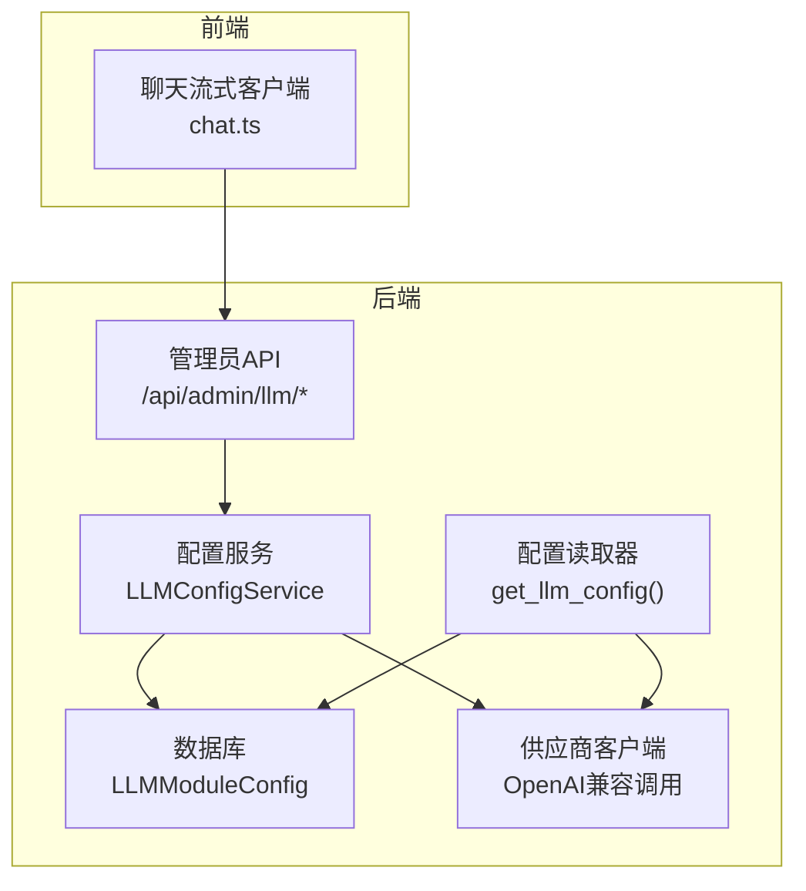
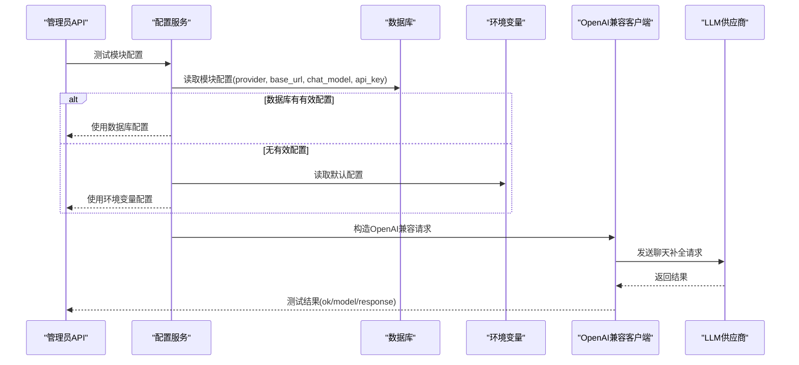
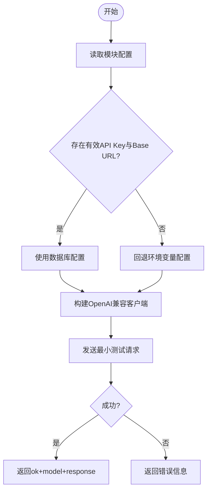
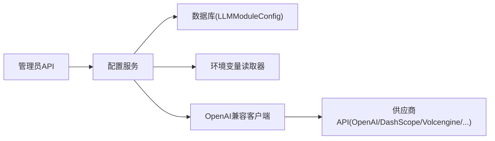

# LLM提供商集成

<cite>
**本文引用的文件**
- [web/backend/services/llm_config_service.py](file://web/backend/services/llm_config_service.py)
- [web/backend/utils/llm_config.py](file://web/backend/utils/llm_config.py)
- [web/backend/api/llm_config_admin.py](file://web/backend/api/llm_config_admin.py)
- [src/settings/settings.py](file://src/settings/settings.py)
- [configs/web_config.yaml](file://configs/web_config.yaml)
- [requirements/ai.txt](file://requirements/ai.txt)
- [web/backend/services/im_moderation.py](file://web/backend/services/im_moderation.py)
- [tests/test_translator.py](file://tests/test_translator.py)
- [web/app/src/api/chat.ts](file://web/app/src/api/chat.ts)
</cite>

## 目录
1. [简介](#简介)
2. [项目结构](#项目结构)
3. [核心组件](#核心组件)
4. [架构总览](#架构总览)
5. [详细组件分析](#详细组件分析)
6. [依赖关系分析](#依赖关系分析)
7. [性能与成本优化](#性能与成本优化)
8. [故障排查指南](#故障排查指南)
9. [结论](#结论)
10. [附录：配置示例与调试方法](#附录：配置示例与调试方法)

## 简介
本技术文档面向“LLM提供商集成”，覆盖多模型提供商（OpenAI、Anthropic、DashScope/百炼、火山引擎、DeepSeek、Moonshot、MiniMax、智谱等）的统一接入方案。重点说明：
- API密钥管理（加密存储、掩码展示、迁移重加密）
- 请求格式转换（统一OpenAI兼容接口）
- 响应解析与流式处理（SSE token流）
- 错误处理（重试、超时、限流、降级）
- 模型选择策略、成本优化与负载均衡思路
- 具体配置示例与调试方法

## 项目结构
后端以“模块级LLM配置”为核心，通过数据库持久化每个业务模块的提供商、模型、密钥与基础URL；运行时优先从数据库读取，未命中则回退到环境变量。管理员API提供配置查询、更新、测试、备份恢复与预设应用等功能。前端通过SSE消费流式响应，实现打字机效果与思考阶段提示。

图表来源
- [web/backend/api/llm_config_admin.py:115-219](file://web/backend/api/llm_config_admin.py#L115-L219)
- [web/backend/services/llm_config_service.py:215-270](file://web/backend/services/llm_config_service.py#L215-L270)
- [web/backend/utils/llm_config.py:111-135](file://web/backend/utils/llm_config.py#L111-L135)
- [web/app/src/api/chat.ts:230-271](file://web/app/src/api/chat.ts#L230-L271)

章节来源
- [web/backend/api/llm_config_admin.py:1-219](file://web/backend/api/llm_config_admin.py#L1-L219)
- [web/backend/services/llm_config_service.py:1-130](file://web/backend/services/llm_config_service.py#L1-L130)
- [web/backend/utils/llm_config.py:1-135](file://web/backend/utils/llm_config.py#L1-L135)
- [web/app/src/api/chat.ts:230-271](file://web/app/src/api/chat.ts#L230-L271)

## 核心组件
- 推荐提供商与模型清单：集中维护各厂商名称、可用模型列表与base_url，便于统一管理与前端展示。
- 模块配置服务：负责按模块维度读写配置、加密/解密API Key、初始化默认值、从环境变量刷新、重加密迁移、连通性测试。
- 配置读取器：优先从数据库获取模块配置，否则回退到环境变量；支持不同厂商的环境变量映射。
- 管理员API：提供模块CRUD、提供商列表、测试连通、备份/恢复、预设应用与预览、单模块测试等能力。
- 流式客户端：前端基于ReadableStream解析SSE事件，分发token、thinking、action_card与done事件。

章节来源
- [web/backend/services/llm_config_service.py:21-129](file://web/backend/services/llm_config_service.py#L21-L129)
- [web/backend/services/llm_config_service.py:215-270](file://web/backend/services/llm_config_service.py#L215-L270)
- [web/backend/utils/llm_config.py:8-108](file://web/backend/utils/llm_config.py#L8-L108)
- [web/backend/api/llm_config_admin.py:115-219](file://web/backend/api/llm_config_admin.py#L115-L219)
- [web/app/src/api/chat.ts:230-271](file://web/app/src/api/chat.ts#L230-L271)

## 架构总览
系统采用“模块级配置 + OpenAI兼容调用”的解耦设计。所有外部LLM供应商通过统一的OpenAI兼容接口进行调用，屏蔽底层差异。配置可动态切换，支持按模块差异化选择模型与提供商，从而兼顾质量、成本与稳定性。

图表来源
- [web/backend/api/llm_config_admin.py:161-182](file://web/backend/api/llm_config_admin.py#L161-L182)
- [web/backend/services/llm_config_service.py:471-516](file://web/backend/services/llm_config_service.py#L471-L516)
- [web/backend/utils/llm_config.py:111-135](file://web/backend/utils/llm_config.py#L111-L135)

## 详细组件分析

### 提供商与模型注册表
- 作用：集中声明支持的提供商、名称、模型族（chat/vision/embedding）与base_url，便于统一管理与扩展。
- 关键点：
  - 支持DashScope（百炼）、Volcengine（火山引擎）、DeepSeek、Moonshot、MiniMax、Zhipu、OpenAI、Anthropic等。
  - 为部分提供商标注embedding维度（如DashScope embedding维度）。
  - 提供默认base_url，便于快速构建客户端。

章节来源
- [web/backend/services/llm_config_service.py:21-129](file://web/backend/services/llm_config_service.py#L21-L129)

### 模块配置服务（LLMConfigService）
- 功能：
  - 模块配置CRUD：按module_key增删改查，字段白名单控制。
  - 密钥安全：Fernet加解密API Key，掩码展示，启动时重加密迁移。
  - 默认初始化：根据环境变量优先级（DashScope > Volcengine > OpenAI）初始化默认模块配置。
  - 环境刷新：将环境变量同步至数据库配置。
  - 连通性测试：构造OpenAI兼容客户端并发起最小请求验证。
- 复杂度与健壮性：
  - 加解密失败降级为明文或旧密钥兼容，避免阻断流程。
  - 双重加密检测与修复，确保幂等迁移。
  - 测试接口设置短超时与小max_tokens，降低误用成本。

图表来源
- [web/backend/services/llm_config_service.py:250-270](file://web/backend/services/llm_config_service.py#L250-L270)
- [web/backend/services/llm_config_service.py:471-516](file://web/backend/services/llm_config_service.py#L471-L516)
- [web/backend/utils/llm_config.py:111-135](file://web/backend/utils/llm_config.py#L111-L135)

章节来源
- [web/backend/services/llm_config_service.py:183-213](file://web/backend/services/llm_config_service.py#L183-L213)
- [web/backend/services/llm_config_service.py:272-393](file://web/backend/services/llm_config_service.py#L272-L393)
- [web/backend/services/llm_config_service.py:395-469](file://web/backend/services/llm_config_service.py#L395-L469)
- [web/backend/services/llm_config_service.py:471-516](file://web/backend/services/llm_config_service.py#L471-L516)

### 配置读取器（get_llm_config）
- 行为：
  - 若传入module参数，先尝试从数据库加载该模块配置；若缺失或未激活，回退到环境变量。
  - 环境变量优先级：DashScope > Volcengine > DeepSeek > Moonshot > MiniMax > Zhipu > OpenAI。
  - 对每个厂商映射对应的chat/vision/embedding模型与环境变量名。
- 价值：统一入口，屏蔽多源配置差异，便于后续扩展新厂商。

章节来源
- [web/backend/utils/llm_config.py:8-108](file://web/backend/utils/llm_config.py#L8-L108)
- [web/backend/utils/llm_config.py:111-135](file://web/backend/utils/llm_config.py#L111-L135)

### 管理员API（/api/admin/llm/*）
- 能力：
  - 模块列表与详情（掩码显示API Key）
  - 更新模块配置（字段白名单校验）
  - 测试模块连通性（支持覆盖参数）
  - 提供商列表（供前端下拉选择）
  - 从环境变量刷新配置
  - 备份/恢复（磁盘JSON，密文落盘，接口掩码）
  - 预设应用（实际/推荐/经济/强劲），支持预览与单模块应用
- 安全：鉴权依赖admin角色，敏感字段一律掩码输出。

章节来源
- [web/backend/api/llm_config_admin.py:115-219](file://web/backend/api/llm_config_admin.py#L115-L219)
- [web/backend/api/llm_config_admin.py:231-335](file://web/backend/api/llm_config_admin.py#L231-L335)
- [web/backend/api/llm_config_admin.py:416-500](file://web/backend/api/llm_config_admin.py#L416-L500)
- [web/backend/api/llm_config_admin.py:526-623](file://web/backend/api/llm_config_admin.py#L526-L623)

### 流式响应处理（前端SSE）
- 机制：
  - 使用ReadableStream逐块读取SSE数据，按行分割后识别data:前缀。
  - 解析JSON事件，分发thinking/token/action_card/done四类事件。
  - 异常捕获区分AbortError与非预期错误，友好提示。
- 适用场景：聊天助手、长文本生成、带思考过程的推理任务。

章节来源
- [web/app/src/api/chat.ts:230-271](file://web/app/src/api/chat.ts#L230-L271)

### 错误处理与重试策略
- 通用重试模式：
  - 指数退避重试，记录尝试次数与等待时间。
  - 针对网络超时、连接错误、服务端5xx错误进行重试。
  - 对429限流错误进行等待并重试。
- 翻译器重试（测试用例覆盖）：
  - 内部服务器错误、速率限制、超时、连接错误均触发重试。
  - 达到最大重试次数后抛出统一错误。
  - 非可重试错误立即传播。
- IM内容安全审核：
  - 当未配置提供商或配置无效时，直接返回安全默认结果，保证链路不中断。

章节来源
- [src/crawlers/pubmed_fulltext.py:154-182](file://src/crawlers/pubmed_fulltext.py#L154-L182)
- [src/crawlers/semantic_scholar_crawler.py:114-153](file://src/crawlers/semantic_scholar_crawler.py#L114-L153)
- [tests/test_translator.py:165-258](file://tests/test_translator.py#L165-L258)
- [web/backend/services/im_moderation.py:46-88](file://web/backend/services/im_moderation.py#L46-L88)

## 依赖关系分析
- 运行时依赖：
  - OpenAI Python SDK用于统一调用（兼容DashScope、Volcengine等OpenAI兼容端点）。
  - Anthropic SDK在requirements中声明，当前代码路径主要使用OpenAI兼容方式。
  - Pydantic用于类型化配置校验。
- 配置依赖：
  - 环境变量（DASHSCOPE_*、VOLCENGINE_*、OPENAI_*等）
  - 数据库（LLMModuleConfig）
  - .env文件（Settings加载）

图表来源
- [web/backend/api/llm_config_admin.py:115-219](file://web/backend/api/llm_config_admin.py#L115-L219)
- [web/backend/services/llm_config_service.py:215-270](file://web/backend/services/llm_config_service.py#L215-L270)
- [web/backend/utils/llm_config.py:111-135](file://web/backend/utils/llm_config.py#L111-L135)

章节来源
- [requirements/ai.txt:1-37](file://requirements/ai.txt#L1-L37)
- [src/settings/settings.py:38-49](file://src/settings/settings.py#L38-L49)
- [src/settings/settings.py:275-287](file://src/settings/settings.py#L275-L287)

## 性能与成本优化
- 模型选择策略：
  - 关键任务（医疗报告解读、VASI评估）：选用更强模型（如qwen-vl-max、deepseek-pro系列）。
  - 常规任务（摘要、翻译、简报）：选用性价比更高的轻量模型（如qwen-turbo、deepseek-flash）。
  - 视觉任务：优先选择具备视觉能力的模型（qwen-vl-plus/max、doubao-vision等）。
- 成本优化：
  - 使用“经济配置”预设批量切换低成本模型。
  - 合理设置max_tokens与temperature，减少无用输出。
  - 缓存高频问答与摘要结果，降低重复调用。
- 负载均衡与高可用：
  - 多提供商并存，按模块路由；当某提供商限流或不可用时，可快速切换到备用提供商。
  - 结合重试与退避，提升整体可用性。
- 流式输出：
  - 前端SSE即时渲染，改善用户体验，同时可在服务端做增量截断与过滤。

[本节为通用指导，无需特定文件引用]

## 故障排查指南
- 连通性问题：
  - 使用管理员API“测试模块配置”接口，检查provider、base_url、chat_model与api_key是否正确。
  - 查看日志中的警告与错误信息，确认是否因密钥无效或网络问题导致失败。
- 密钥相关问题：
  - 确认环境变量已正确配置，且未被掩码污染。
  - 若出现401或鉴权失败，检查是否存在双重加密或旧密钥残留，必要时执行重加密迁移。
- 限流与超时：
  - 遇到429或超时，检查重试次数与退避策略，适当调大间隔或降低并发。
  - 调整max_tokens与温度，减少响应长度与计算量。
- 流式输出异常：
  - 前端检查SSE事件解析逻辑，确认data:行与JSON有效性。
  - 关注AbortError与其他错误的区分，避免误报。

章节来源
- [web/backend/api/llm_config_admin.py:161-182](file://web/backend/api/llm_config_admin.py#L161-L182)
- [web/backend/services/llm_config_service.py:471-516](file://web/backend/services/llm_config_service.py#L471-L516)
- [web/backend/services/llm_config_service.py:395-469](file://web/backend/services/llm_config_service.py#L395-L469)
- [web/app/src/api/chat.ts:230-271](file://web/app/src/api/chat.ts#L230-L271)

## 结论
本项目通过“模块级配置 + OpenAI兼容调用”的方式，实现了多LLM提供商的统一接入与灵活切换。配合完善的密钥管理、管理员API、预设模板与流式响应，既保证了易用性与安全性，也为成本优化与高可用提供了坚实基础。建议在生产环境中：
- 启用环境变量与数据库双通道配置，并定期刷新。
- 使用预设模板快速落地不同场景的模型组合。
- 监控重试与限流指标，持续优化模型选择与参数。
- 保持供应商基线版本与base_url的及时更新。

[本节为总结，无需特定文件引用]

## 附录：配置示例与调试方法
- 环境变量示例（节选）：
  - DashScope：DASHSCOPE_API_KEY、DASHSCOPE_BASE_URL、DASHSCOPE_CHAT_MODEL、DASHSCOPE_VISION_MODEL、DASHSCOPE_EMBEDDING_MODEL、DASHSCOPE_EMBEDDING_DIMENSIONS
  - Volcengine：VOLCENGINE_API_KEY、VOLCENGINE_BASE_URL、VOLCENGINE_CHAT_ENDPOINT、VOLCENGINE_VISION_MODEL、VOLCENGINE_EMBEDDING_ENDPOINT
  - OpenAI：OPENAI_API_KEY、OPENAI_BASE_URL、LLM_MODEL、OPENAI_VISION_MODEL、EMBEDDING_MODEL
  - Anthropic：ANTHROPIC_API_KEY
- 配置文件示例（web_config.yaml）：
  - llm.provider、openai.*、anthropic.*、local.*、rag.*、prompts.*
- 调试步骤：
  - 使用管理员API列出提供商与模块，确认配置生效。
  - 调用测试接口验证连通性，观察返回的ok/model/response。
  - 如需临时覆盖，可在测试请求中传入provider、chat_model、api_key、base_url。
  - 使用备份/恢复接口导出与导入配置，便于回滚与迁移。
  - 前端开启流式输出，观察thinking/token/action_card/done事件是否正常。

章节来源
- [web/backend/utils/llm_config.py:8-108](file://web/backend/utils/llm_config.py#L8-L108)
- [configs/web_config.yaml:80-134](file://configs/web_config.yaml#L80-L134)
- [web/backend/api/llm_config_admin.py:185-219](file://web/backend/api/llm_config_admin.py#L185-L219)
- [web/backend/api/llm_config_admin.py:231-335](file://web/backend/api/llm_config_admin.py#L231-L335)
- [web/backend/api/llm_config_admin.py:416-500](file://web/backend/api/llm_config_admin.py#L416-L500)
- [web/backend/api/llm_config_admin.py:526-623](file://web/backend/api/llm_config_admin.py#L526-L623)