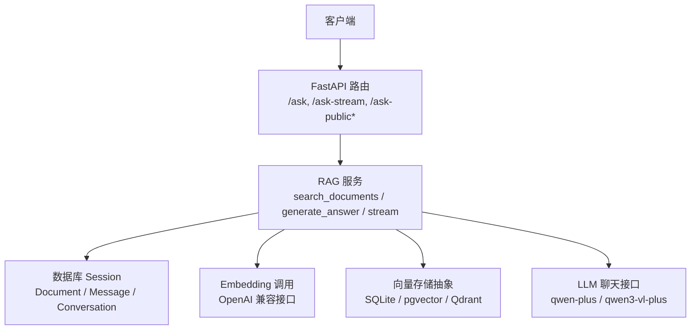
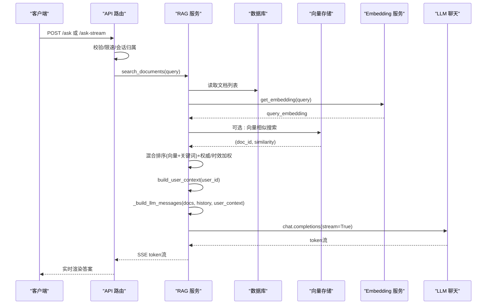
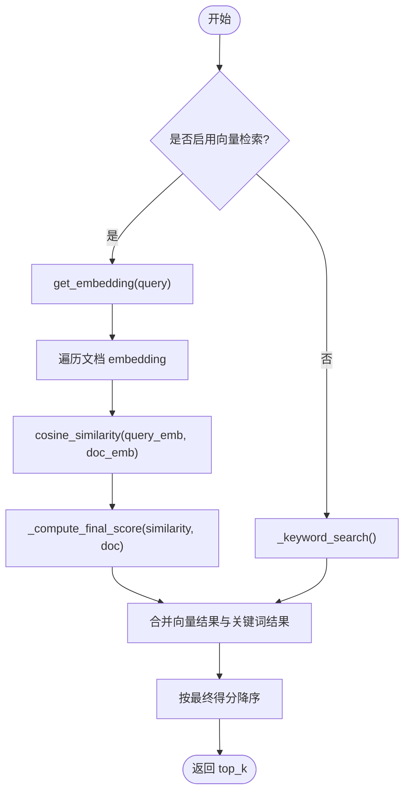
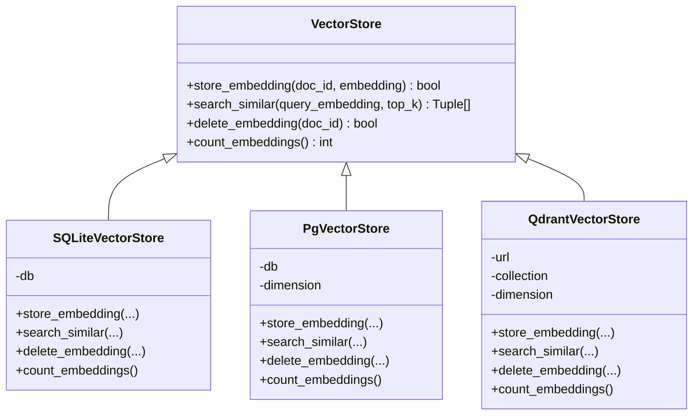
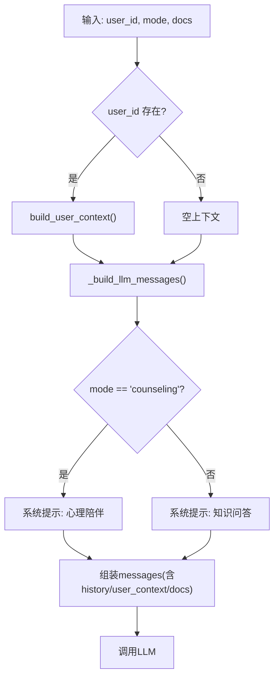
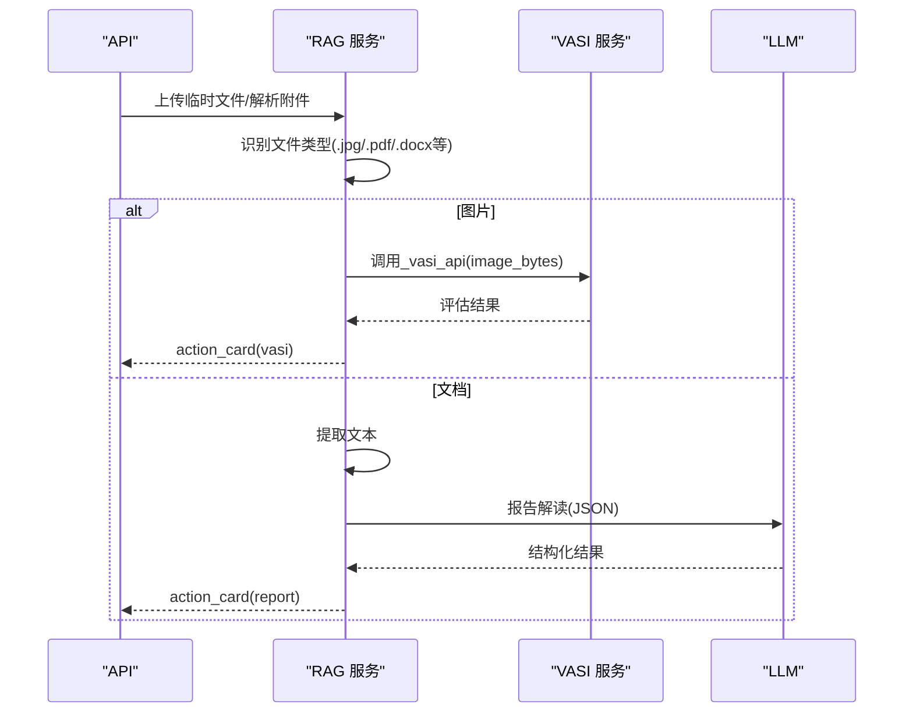
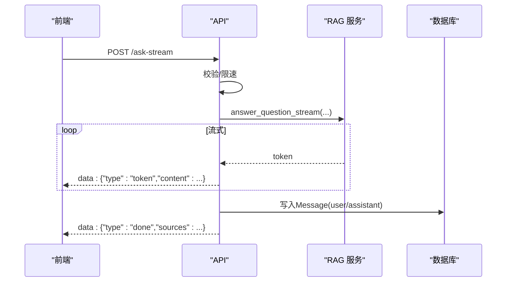
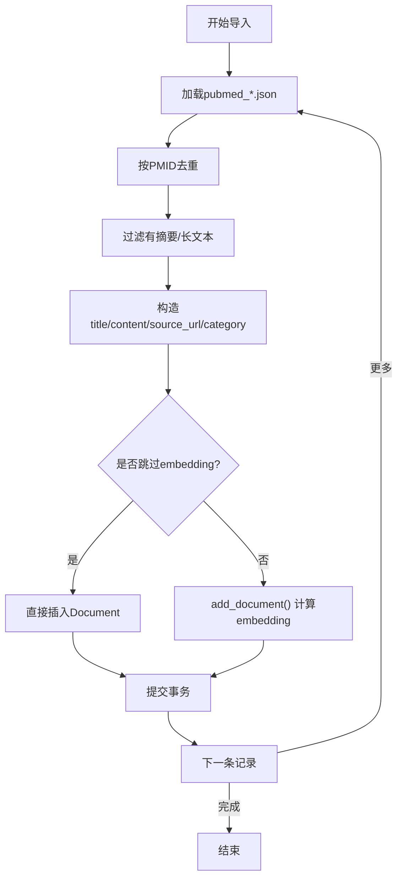
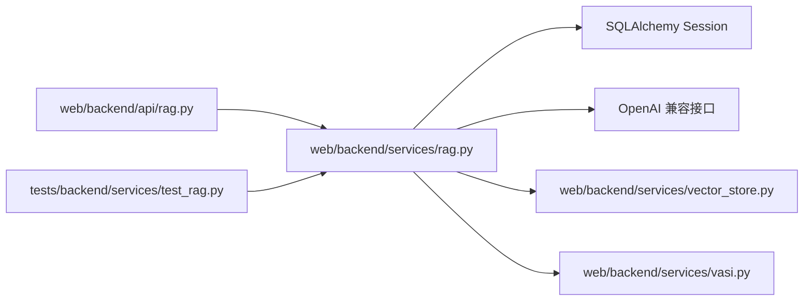

# RAG架构设计

<cite>
**本文引用的文件**
- [web/backend/services/rag.py](file://web/backend/services/rag.py)
- [web/backend/api/rag.py](file://web/backend/api/rag.py)
- [web/backend/models/rag.py](file://web/backend/models/rag.py)
- [web/backend/services/vector_store.py](file://web/backend/services/vector_store.py)
- [web/backend/scripts/import_knowledge.py](file://web/backend/scripts/import_knowledge.py)
- [data/llm_config_backup.json](file://data/llm_config_backup.json)
- [tests/backend/services/test_rag.py](file://tests/backend/services/test_rag.py)
</cite>

## 目录
1. [简介](#简介)
2. [项目结构](#项目结构)
3. [核心组件](#核心组件)
4. [架构总览](#架构总览)
5. [详细组件分析](#详细组件分析)
6. [依赖关系分析](#依赖关系分析)
7. [性能考量](#性能考量)
8. [故障排查指南](#故障排查指南)
9. [结论](#结论)
10. [附录](#附录)

## 简介
本技术文档面向RAG（检索增强生成）系统，围绕知识库检索、向量相似度匹配、上下文构建与LLM提示词工程展开，说明检索策略、相关性评分算法、多源知识融合机制，并给出平衡检索精度与响应速度的方案，以及复杂查询的分解与重组思路。文档基于仓库中的实际实现进行解析，包含流程图、时序图与类图，帮助读者快速理解并优化系统。

## 项目结构
RAG相关代码主要位于后端服务层：
- API层：提供问答、流式回答、访客配额、会话管理等接口
- 服务层：封装检索、向量化、用户上下文聚合、报告解读、日记草稿生成等
- 数据模型：定义请求/响应结构与来源信息
- 向量存储抽象：统一SQLite/pgvector/Qdrant后端
- 导入脚本：将外部数据（如PubMed）导入知识库并计算embedding

图表来源
- [web/backend/api/rag.py:246-630](file://web/backend/api/rag.py#L246-L630)
- [web/backend/services/rag.py:456-522](file://web/backend/services/rag.py#L456-L522)
- [web/backend/services/vector_store.py:25-110](file://web/backend/services/vector_store.py#L25-L110)

章节来源
- [web/backend/api/rag.py:246-630](file://web/backend/api/rag.py#L246-L630)
- [web/backend/services/rag.py:456-522](file://web/backend/services/rag.py#L456-L522)
- [web/backend/services/vector_store.py:25-110](file://web/backend/services/vector_store.py#L25-L110)

## 核心组件
- 检索引擎：混合检索（向量+关键词），支持回退与融合排序
- 向量存储：抽象层统一SQLite/pgvector/Qdrant，默认SQLite
- 上下文构建：聚合用户档案、近14天日记摘要、用药提醒、治疗事件
- 提示词工程：知识问答与心理陪伴双模式，内置权威来源优先级与隐私约束
- 附件处理：图片VASI评估、文档PDF/Word/TXT/MD文本提取与报告解读
- 流式输出：SSE流式返回token，提升交互体验
- 配额与限速：访客每日限额、登录用户速率限制

章节来源
- [web/backend/services/rag.py:354-402](file://web/backend/services/rag.py#L354-L402)
- [web/backend/services/rag.py:433-522](file://web/backend/services/rag.py#L433-L522)
- [web/backend/services/rag.py:757-877](file://web/backend/services/rag.py#L757-L877)
- [web/backend/services/rag.py:880-916](file://web/backend/services/rag.py#L880-L916)
- [web/backend/api/rag.py:246-630](file://web/backend/api/rag.py#L246-L630)
- [web/backend/services/vector_store.py:25-110](file://web/backend/services/vector_store.py#L25-L110)

## 架构总览
下图展示从请求到响应的端到端流程，包括检索、上下文构建、提示词组装、LLM调用与流式返回。

图表来源
- [web/backend/api/rag.py:534-860](file://web/backend/api/rag.py#L534-L860)
- [web/backend/services/rag.py:456-522](file://web/backend/services/rag.py#L456-L522)
- [web/backend/services/rag.py:1296-1363](file://web/backend/services/rag.py#L1296-L1363)

## 详细组件分析

### 检索策略与相关性评分
- 混合检索：优先向量检索，失败或无配置时回退关键词检索；对无embedding或维度不匹配的文档使用关键词召回合并
- 相似度计算：余弦相似度，维度不一致直接判为不可比（返回0）
- 最终得分：基础相似度 × 权威权重 × 时效加分（近期文献略高）
- 关键词检索：中文分词+英文数字片段，按命中比例打分，兜底返回top_k

图表来源
- [web/backend/services/rag.py:387-402](file://web/backend/services/rag.py#L387-L402)
- [web/backend/services/rag.py:422-453](file://web/backend/services/rag.py#L422-L453)
- [web/backend/services/rag.py:456-522](file://web/backend/services/rag.py#L456-L522)

章节来源
- [web/backend/services/rag.py:387-402](file://web/backend/services/rag.py#L387-L402)
- [web/backend/services/rag.py:422-453](file://web/backend/services/rag.py#L422-L453)
- [web/backend/services/rag.py:456-522](file://web/backend/services/rag.py#L456-L522)

### 向量存储抽象层
- 抽象基类：统一store/search/delete/count接口
- SQLite实现：JSON列存储embedding，内存中计算相似度，适合小规模
- pgvector实现：预留原生向量类型与HNSW索引，当前回退SQLite
- Qdrant实现：独立向量库，适合大规模高并发

图表来源
- [web/backend/services/vector_store.py:25-110](file://web/backend/services/vector_store.py#L25-L110)
- [web/backend/services/vector_store.py:112-155](file://web/backend/services/vector_store.py#L112-L155)
- [web/backend/services/vector_store.py:157-243](file://web/backend/services/vector_store.py#L157-L243)

章节来源
- [web/backend/services/vector_store.py:25-110](file://web/backend/services/vector_store.py#L25-L110)
- [web/backend/services/vector_store.py:112-155](file://web/backend/services/vector_store.py#L112-L155)
- [web/backend/services/vector_store.py:157-243](file://web/backend/services/vector_store.py#L157-L243)

### 上下文构建与提示词工程
- 用户上下文：聚合病型/病程、近14天日记摘要、用药提醒、治疗事件，限制最大字符数避免撑爆上下文窗口
- 提示词模式：
  - 知识问答：强调权威来源优先级（S/A/B/C/D）、拒绝诊断、数据保护、网站功能导航
  - 心理陪伴：共情倾听、去医疗化、危机干预模板、CBT框架
- 消息组装：根据模式选择system prompt，注入参考资料与用户上下文，必要时附加历史对话

图表来源
- [web/backend/services/rag.py:757-877](file://web/backend/services/rag.py#L757-L877)
- [web/backend/services/rag.py:880-916](file://web/backend/services/rag.py#L880-L916)
- [web/backend/services/rag.py:525-700](file://web/backend/services/rag.py#L525-L700)

章节来源
- [web/backend/services/rag.py:757-877](file://web/backend/services/rag.py#L757-L877)
- [web/backend/services/rag.py:880-916](file://web/backend/services/rag.py#L880-L916)
- [web/backend/services/rag.py:525-700](file://web/backend/services/rag.py#L525-L700)

### 附件处理与报告解读
- 图片：调用VASI服务进行白斑评估，生成动作卡片（评分、部位、分期、风险等级）
- 文档：支持TXT/MD/PDF/DOC/DOCX文本提取，限制长度
- 报告解读：检测报告类型（血常规/肝功能/甲状腺/免疫/综合/通用），构造专用提示词，强制结构化JSON输出，并进行字段规范化与风险提示

图表来源
- [web/backend/api/rag.py:677-774](file://web/backend/api/rag.py#L677-L774)
- [web/backend/services/rag.py:919-975](file://web/backend/services/rag.py#L919-L975)
- [web/backend/services/rag.py:977-1192](file://web/backend/services/rag.py#L977-L1192)

章节来源
- [web/backend/api/rag.py:677-774](file://web/backend/api/rag.py#L677-L774)
- [web/backend/services/rag.py:919-975](file://web/backend/services/rag.py#L919-L975)
- [web/backend/services/rag.py:977-1192](file://web/backend/services/rag.py#L977-L1192)

### 流式回答与会话管理
- 流式：SSE逐token推送，前端可即时渲染
- 会话：维护Conversation与Message，限制历史长度防止上下文溢出
- 访客配额：基于指纹统计每日次数，异常时退款避免浪费配额

图表来源
- [web/backend/api/rag.py:534-860](file://web/backend/api/rag.py#L534-L860)
- [web/backend/services/rag.py:1296-1363](file://web/backend/services/rag.py#L1296-L1363)

章节来源
- [web/backend/api/rag.py:534-860](file://web/backend/api/rag.py#L534-L860)
- [web/backend/services/rag.py:1296-1363](file://web/backend/services/rag.py#L1296-L1363)

### 数据导入与增量向量化
- 导入脚本：读取PubMed JSON，去重、过滤、构造内容、分类，调用add_document插入知识库
- 增量向量化：对embedding为空的文档批量计算，控制API间隔避免限流

图表来源
- [web/backend/scripts/import_knowledge.py:35-123](file://web/backend/scripts/import_knowledge.py#L35-L123)
- [web/backend/scripts/import_knowledge.py:171-233](file://web/backend/scripts/import_knowledge.py#L171-L233)
- [web/backend/services/rag.py:1449-1490](file://web/backend/services/rag.py#L1449-L1490)
- [web/backend/services/rag.py:1493-1559](file://web/backend/services/rag.py#L1493-L1559)

章节来源
- [web/backend/scripts/import_knowledge.py:35-123](file://web/backend/scripts/import_knowledge.py#L35-L123)
- [web/backend/scripts/import_knowledge.py:171-233](file://web/backend/scripts/import_knowledge.py#L171-L233)
- [web/backend/services/rag.py:1449-1490](file://web/backend/services/rag.py#L1449-L1490)
- [web/backend/services/rag.py:1493-1559](file://web/backend/services/rag.py#L1493-L1559)

## 依赖关系分析
- API依赖服务层：路由调用search_documents、answer_question、answer_question_stream等
- 服务层依赖数据库与外部服务：SQLAlchemy Session、OpenAI兼容接口、VASI服务
- 向量存储抽象：通过环境变量切换后端，默认SQLite
- 测试覆盖：报告类型检测、用户上下文构建、提示词注入等行为验证

图表来源
- [web/backend/api/rag.py:246-630](file://web/backend/api/rag.py#L246-L630)
- [web/backend/services/rag.py:456-522](file://web/backend/services/rag.py#L456-L522)
- [web/backend/services/vector_store.py:25-110](file://web/backend/services/vector_store.py#L25-L110)
- [tests/backend/services/test_rag.py:25-100](file://tests/backend/services/test_rag.py#L25-L100)

章节来源
- [web/backend/api/rag.py:246-630](file://web/backend/api/rag.py#L246-L630)
- [web/backend/services/rag.py:456-522](file://web/backend/services/rag.py#L456-L522)
- [web/backend/services/vector_store.py:25-110](file://web/backend/services/vector_store.py#L25-L110)
- [tests/backend/services/test_rag.py:25-100](file://tests/backend/services/test_rag.py#L25-L100)

## 性能考量
- 混合检索降低延迟：向量检索失败或无配置时立即回退关键词检索，保证可用性
- 维度一致性检查：避免错误的高相似度排名，减少无效计算
- 上下文裁剪：用户上下文限制最大字符数，历史对话限制最近N条，防止上下文溢出与成本飙升
- 批量向量化限速：每次API调用间隔固定时间，避免触发限流
- 向量存储升级：pgvector/Qdrant在大规模数据下提供更优的检索性能与扩展性

[本节为通用指导，不直接分析具体文件]

## 故障排查指南
- 向量检索失败：检查环境变量VECTOR_STORE_BACKEND与embedding配置，确认provider非none
- 维度不匹配：日志会记录维度差异，需重新计算embedding或统一维度
- 报告解读失败：当LLM未配置或返回非JSON时，系统会降级为默认解读并保留安全声明
- 访客配额耗尽：通过/guest-quota查看剩余次数，异常流失败时会尝试退款
- 会话权限：已删除会话不可访问，跨用户访问会被拒绝

章节来源
- [web/backend/services/rag.py:354-384](file://web/backend/services/rag.py#L354-L384)
- [web/backend/services/rag.py:387-402](file://web/backend/services/rag.py#L387-L402)
- [web/backend/services/rag.py:1131-1192](file://web/backend/services/rag.py#L1131-L1192)
- [web/backend/api/rag.py:136-186](file://web/backend/api/rag.py#L136-L186)
- [web/backend/api/rag.py:188-243](file://web/backend/api/rag.py#L188-L243)

## 结论
该RAG系统实现了稳健的混合检索、灵活的向量存储抽象、精细的用户上下文构建与安全的提示词工程，并通过流式输出与配额限速保障用户体验与成本控制。建议在生产环境中逐步迁移至pgvector或Qdrant以提升检索性能，同时持续优化提示词与评分策略以平衡准确性与速度。

[本节为总结性内容，不直接分析具体文件]

## 附录
- 配置参考：嵌入模型、聊天模型、提供商与Base URL可通过配置文件管理
- 数据模型：问答请求/响应、来源信息、临时上传响应等结构清晰
- 测试用例：覆盖报告类型检测、用户上下文构建、提示词注入等关键路径

章节来源
- [data/llm_config_backup.json:1-33](file://data/llm_config_backup.json#L1-L33)
- [web/backend/models/rag.py:8-62](file://web/backend/models/rag.py#L8-L62)
- [tests/backend/services/test_rag.py:25-100](file://tests/backend/services/test_rag.py#L25-L100)