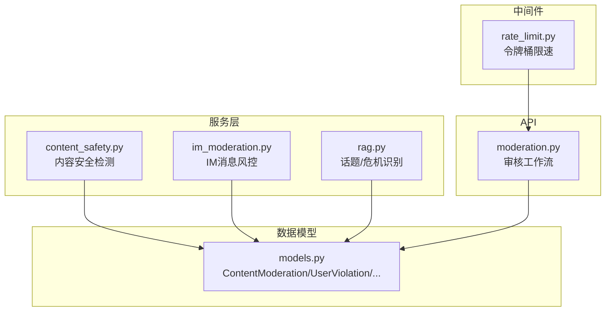
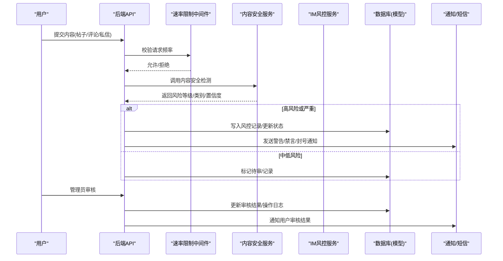
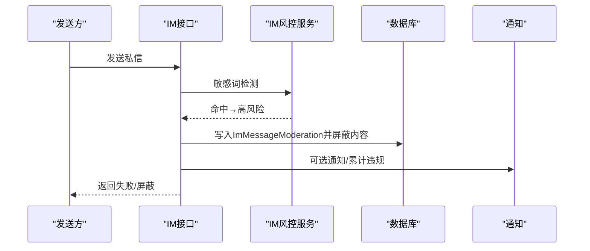
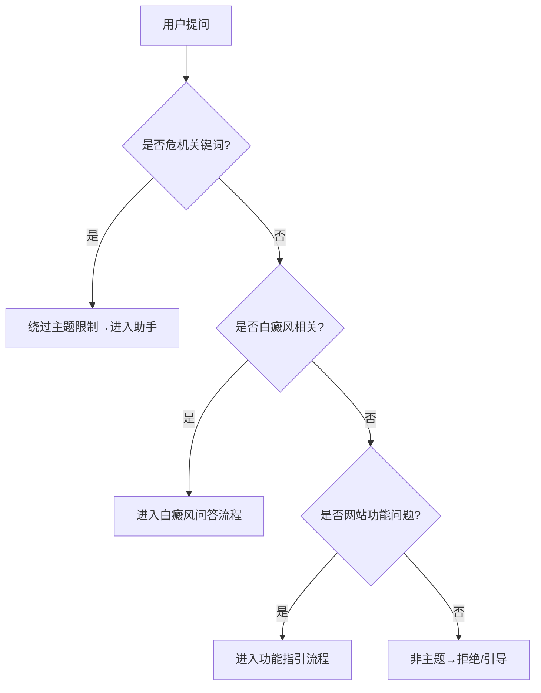
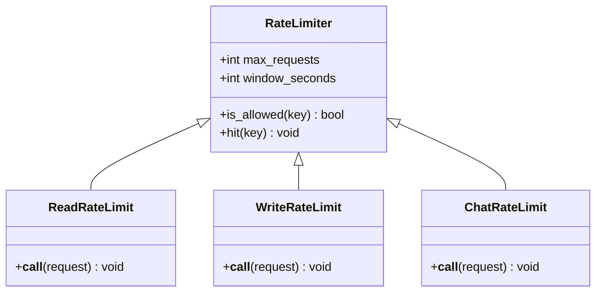
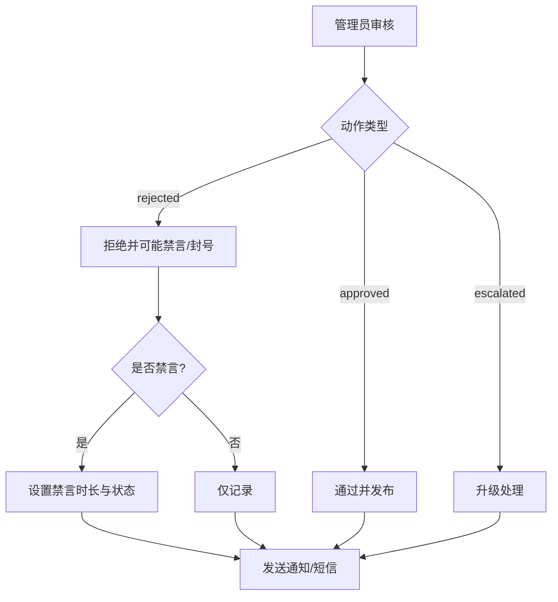
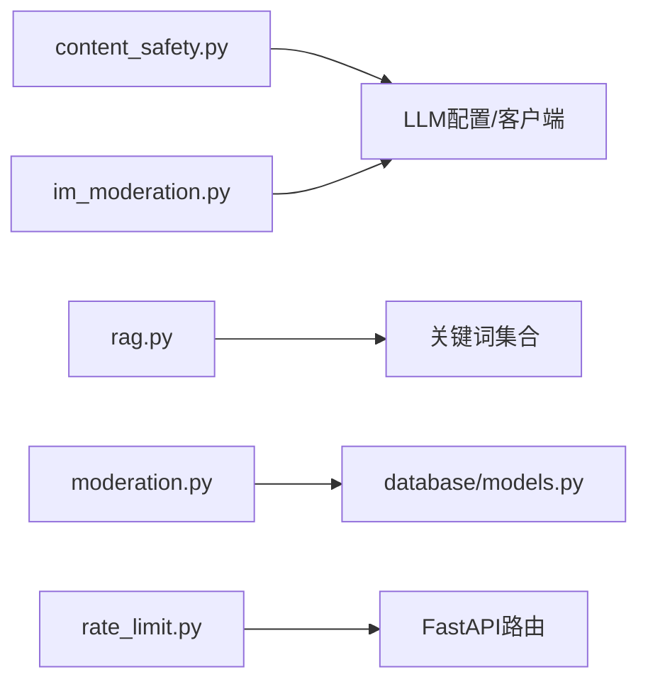

# 内容安全过滤

<cite>
**本文引用的文件**   
- [web/backend/services/content_safety.py](file://web/backend/services/content_safety.py)
- [web/backend/services/im_moderation.py](file://web/backend/services/im_moderation.py)
- [web/backend/services/rag.py](file://web/backend/services/rag.py)
- [web/backend/app/middleware/rate_limit.py](file://web/backend/app/middleware/rate_limit.py)
- [web/backend/api/moderation.py](file://web/backend/api/moderation.py)
- [web/backend/database/models.py](file://web/backend/database/models.py)
- [configs/web_config.yaml](file://configs/web_config.yaml)
- [web/app/src/components/moderation/ModerationPanel.vue](file://web/app/src/components/moderation/ModerationPanel.vue)
- [hermes_plan/2026-04-28_IM-social-system-plan.md](file://hermes_plan/2026-04-28_IM-social-system-plan.md)
</cite>

## 目录
1. [引言](#引言)
2. [项目结构](#项目结构)
3. [核心组件](#核心组件)
4. [架构总览](#架构总览)
5. [详细组件分析](#详细组件分析)
6. [依赖关系分析](#依赖关系分析)
7. [性能考量](#性能考量)
8. [故障排查指南](#故障排查指南)
9. [结论](#结论)
10. [附录：配置与策略调整](#附录配置与策略调整)

## 引言
本技术文档围绕内容安全过滤系统，系统性阐述输入内容检测、敏感信息识别、话题相关性判断与危机消息处理机制。重点覆盖白癜风相关话题识别、网站功能问题分类、IM与社区内容的风控策略、访客限制与频率控制、以及滥用防护机制。同时给出可操作的过滤规则配置与安全策略调整方法，帮助运维与研发人员快速定位问题并优化策略。

## 项目结构
内容安全能力由“服务层 + 中间件 + API + 数据模型”共同构成：
- 服务层：LLM驱动的内容安全判定、IM消息风控、话题与危机识别
- 中间件：基于令牌桶的读/写/聊天接口限速
- API：审核工作流（列表、审批、用户违规档案）
- 数据模型：内容风控记录、用户违规档案、违规日志、通知等



图表来源
- [web/backend/services/content_safety.py:1-120](file://web/backend/services/content_safety.py#L1-L120)
- [web/backend/services/im_moderation.py:1-90](file://web/backend/services/im_moderation.py#L1-L90)
- [web/backend/services/rag.py:93-352](file://web/backend/services/rag.py#L93-L352)
- [web/backend/app/middleware/rate_limit.py:1-96](file://web/backend/app/middleware/rate_limit.py#L1-L96)
- [web/backend/api/moderation.py:1-181](file://web/backend/api/moderation.py#L1-L181)
- [web/backend/database/models.py:848-935](file://web/backend/database/models.py#L848-L935)

章节来源
- [web/backend/services/content_safety.py:1-120](file://web/backend/services/content_safety.py#L1-L120)
- [web/backend/services/im_moderation.py:1-90](file://web/backend/services/im_moderation.py#L1-L90)
- [web/backend/services/rag.py:93-352](file://web/backend/services/rag.py#L93-L352)
- [web/backend/app/middleware/rate_limit.py:1-96](file://web/backend/app/middleware/rate_limit.py#L1-L96)
- [web/backend/api/moderation.py:1-181](file://web/backend/api/moderation.py#L1-L181)
- [web/backend/database/models.py:848-935](file://web/backend/database/models.py#L848-L935)

## 核心组件
- 内容安全检测服务：基于LLM对帖子、评论、个人资料字段进行风险等级判定与自动处置，联动用户违规档案与通知。
- IM消息风控：敏感词前置拦截+LLM语义审核，高风险直接屏蔽并记录。
- 话题与危机识别：针对白癜风相关话题、网站功能问题、以及自残/自杀危机关键词进行分流与干预。
- 频率控制与访问限制：按IP/用户ID维度实施读/写/聊天接口限速，防止滥用与成本失控。
- 审核工作流：管理员可对AI标记内容进行批准/拒绝/升级，并执行禁言/封号等操作。

章节来源
- [web/backend/services/content_safety.py:1-120](file://web/backend/services/content_safety.py#L1-L120)
- [web/backend/services/im_moderation.py:1-90](file://web/backend/services/im_moderation.py#L1-L90)
- [web/backend/services/rag.py:93-352](file://web/backend/services/rag.py#L93-L352)
- [web/backend/app/middleware/rate_limit.py:1-96](file://web/backend/app/middleware/rate_limit.py#L1-L96)
- [web/backend/api/moderation.py:1-181](file://web/backend/api/moderation.py#L1-L181)

## 架构总览
整体流程以“输入检测 → 风险判定 → 自动处置 → 人工复核 → 处罚与通知”为主线，贯穿社区内容与IM消息。



图表来源
- [web/backend/services/content_safety.py:103-146](file://web/backend/services/content_safety.py#L103-L146)
- [web/backend/services/im_moderation.py:91-148](file://web/backend/services/im_moderation.py#L91-L148)
- [web/backend/api/moderation.py:144-181](file://web/backend/api/moderation.py#L144-L181)
- [web/backend/app/middleware/rate_limit.py:39-96](file://web/backend/app/middleware/rate_limit.py#L39-L96)
- [web/backend/database/models.py:848-935](file://web/backend/database/models.py#L848-L935)

## 详细组件分析

### 内容安全检测服务（帖子/评论/资料）
- 输入：标题、正文或字段名与值
- 处理：构造提示词调用LLM，解析JSON输出风险等级、类别、原因与置信度
- 自动动作：根据等级与置信度决定“屏蔽/标记”，并对用户违规档案计数与处罚
- 输出：写入内容风控记录，必要时更新内容状态、触发禁言/封号、发送站内通知与短信

```mermaid
flowchart TD
Start(["开始"]) --> CheckCfg["检查LLM配置"]
CheckCfg --> |未配置| Skip["跳过检测(视为安全)"]
CheckCfg --> |已配置| CallLLM["调用LLM生成风险判定"]
CallLLM --> Parse["解析JSON结果"]
Parse --> Decision{"风险等级与置信度"}
Decision --> |safe| End(["结束"])
Decision --> |critical/high/medium(low阈值以上)| Block["屏蔽内容并记录"]
Decision --> |low| Flag["标记待审"]
Block --> Penalty["累计违规次数并处罚"]
Flag --> Log["记录待审"]
Penalty --> Notify["发送通知/短信"]
Log --> End
Notify --> End
```

图表来源
- [web/backend/services/content_safety.py:54-101](file://web/backend/services/content_safety.py#L54-L101)
- [web/backend/services/content_safety.py:103-146](file://web/backend/services/content_safety.py#L103-L146)
- [web/backend/services/content_safety.py:229-265](file://web/backend/services/content_safety.py#L229-L265)

章节来源
- [web/backend/services/content_safety.py:1-120](file://web/backend/services/content_safety.py#L1-L120)
- [web/backend/services/content_safety.py:103-146](file://web/backend/services/content_safety.py#L103-L146)
- [web/backend/services/content_safety.py:229-265](file://web/backend/services/content_safety.py#L229-L265)

### IM消息风控（私信）
- 前置敏感词匹配：命中即高置信度高风险，直接屏蔽并记录
- LLM语义审核：结合医疗社区语境，避免误判正常病情交流为引流广告
- 自动处置：高风险/严重直接屏蔽；记录风控表并累计违规



图表来源
- [web/backend/services/im_moderation.py:16-88](file://web/backend/services/im_moderation.py#L16-L88)
- [web/backend/services/im_moderation.py:91-148](file://web/backend/services/im_moderation.py#L91-L148)

章节来源
- [web/backend/services/im_moderation.py:1-148](file://web/backend/services/im_moderation.py#L1-L148)

### 话题相关性判断与危机消息处理
- 白癜风相关话题识别：通过关键词集合与皮肤健康模式匹配，区分是否属于白癜风主题
- 网站功能问题分类：通过功能关键词与短语匹配，将“如何使用/在哪里/怎么上传”等功能类问题归类
- 危机消息识别：包含自残/自杀意图关键词时，绕过主题限制直达助手，提供心理援助资源



图表来源
- [web/backend/services/rag.py:93-195](file://web/backend/services/rag.py#L93-L195)
- [web/backend/services/rag.py:195-352](file://web/backend/services/rag.py#L195-L352)
- [web/backend/services/rag.py:315-352](file://web/backend/services/rag.py#L315-L352)

章节来源
- [web/backend/services/rag.py:93-195](file://web/backend/services/rag.py#L93-L195)
- [web/backend/services/rag.py:195-352](file://web/backend/services/rag.py#L195-L352)
- [web/backend/services/rag.py:315-352](file://web/backend/services/rag.py#L315-L352)

### 频率控制与访问限制（访客限制、滥用防护）
- 读接口限速：按客户端IP限流，防止爬虫与恶意读取
- 写接口限速：按用户ID（匿名回退到IP）限流，保护写操作
- 聊天接口限速：按用户ID（匿名回退到IP）限流，防止LLM成本滥用
- 实现方式：进程内令牌桶，重启后清空；可通过配置调整阈值



图表来源
- [web/backend/app/middleware/rate_limit.py:10-36](file://web/backend/app/middleware/rate_limit.py#L10-L36)
- [web/backend/app/middleware/rate_limit.py:39-96](file://web/backend/app/middleware/rate_limit.py#L39-L96)

章节来源
- [web/backend/app/middleware/rate_limit.py:1-96](file://web/backend/app/middleware/rate_limit.py#L1-L96)

### 审核工作流与处罚阶梯
- 审核API：支持列出待审、审批/拒绝/升级、查看用户违规档案与最近日志
- 处罚阶梯：严重→立即封号；高危→累计2次禁言30天，首次禁言7天；中危→累计3次禁言7天，累计2次禁言3天；低危→警告
- 通知与短信：每次处罚均创建站内通知，并在冷却期内防抖发送短信



图表来源
- [web/backend/api/moderation.py:144-181](file://web/backend/api/moderation.py#L144-L181)
- [web/backend/services/content_safety.py:229-265](file://web/backend/services/content_safety.py#L229-L265)

章节来源
- [web/backend/api/moderation.py:1-181](file://web/backend/api/moderation.py#L1-L181)
- [web/backend/services/content_safety.py:229-265](file://web/backend/services/content_safety.py#L229-L265)

### 数据模型与关系
- ContentModeration：内容风控记录（关联帖子/评论/用户，记录风险等级、类别、自动动作、AI原因与置信度、审核状态）
- UserViolation：用户违规档案（各等级计数、状态、禁言/封号时间、原因）
- UserViolationLog：违规操作明细（动作、时长、原因、操作人）
- UserNotification：站内通知（类型、标题、内容、阅读状态）

```mermaid
erDiagram
CONTENT_MODERATIONS ||--o{ USER : "user_id"
CONTENT_MODERATIONS ||--o| POST : "post_id"
CONTENT_MODERATIONS ||--o| COMMENT : "comment_id"
USER_VIOLATIONS ||--o USER : "user_id"
USER_VIOLATION_LOGS ||--o USER : "user_id"
USER_NOTIFICATIONS ||--o USER : "user_id"
```

图表来源
- [web/backend/database/models.py:848-935](file://web/backend/database/models.py#L848-L935)

章节来源
- [web/backend/database/models.py:848-935](file://web/backend/database/models.py#L848-L935)

## 依赖关系分析
- 内容安全服务依赖LLM配置与OpenAI客户端，用于风险判定
- IM风控依赖敏感词库与LLM配置，优先敏感词快速拦截
- 话题与危机识别依赖关键词集合与短语匹配，确保危机消息不被主题门控阻断
- 审核API依赖数据库模型与认证权限，完成人工复核与处罚
- 速率限制中间件独立于业务逻辑，统一在API层注入



图表来源
- [web/backend/services/content_safety.py:1-60](file://web/backend/services/content_safety.py#L1-L60)
- [web/backend/services/im_moderation.py:1-60](file://web/backend/services/im_moderation.py#L1-L60)
- [web/backend/services/rag.py:93-195](file://web/backend/services/rag.py#L93-L195)
- [web/backend/api/moderation.py:1-60](file://web/backend/api/moderation.py#L1-L60)
- [web/backend/app/middleware/rate_limit.py:1-36](file://web/backend/app/middleware/rate_limit.py#L1-L36)

章节来源
- [web/backend/services/content_safety.py:1-60](file://web/backend/services/content_safety.py#L1-L60)
- [web/backend/services/im_moderation.py:1-60](file://web/backend/services/im_moderation.py#L1-L60)
- [web/backend/services/rag.py:93-195](file://web/backend/services/rag.py#L93-L195)
- [web/backend/api/moderation.py:1-60](file://web/backend/api/moderation.py#L1-L60)
- [web/backend/app/middleware/rate_limit.py:1-36](file://web/backend/app/middleware/rate_limit.py#L1-L36)

## 性能考量
- LLM调用开销：内容安全与IM风控均调用LLM，需关注并发与超时；建议缓存热点判定结果或降级策略（如未配置时跳过检测）
- 令牌桶内存占用：进程内存储，重启后清空；在高并发场景下注意内存峰值
- 数据库写入：风控记录与违规日志频繁写入，建议合理索引与批量写入
- 短信冷却：同一用户短时间内的重复通知会被抑制，降低短信成本与骚扰

[本节为通用指导，不直接分析具体文件]

## 故障排查指南
- 内容安全检测异常：检查LLM配置是否正确、网络连通性、响应格式是否为JSON；若异常则降级为“标记待审”
- IM消息风控误判：核对敏感词库与LLM提示词，确认医疗语境下的正常交流未被误判
- 频率限制触发：检查当前IP/用户ID的请求频次，适当提高阈值或优化客户端重试策略
- 审核状态不一致：核查ContentModeration与Post/Comment的状态同步逻辑，确认管理员操作是否生效
- 通知未送达：检查UserNotification与短信发送冷却逻辑，确认用户手机号与短信服务可用性

章节来源
- [web/backend/services/content_safety.py:84-86](file://web/backend/services/content_safety.py#L84-L86)
- [web/backend/services/im_moderation.py:81-88](file://web/backend/services/im_moderation.py#L81-L88)
- [web/backend/app/middleware/rate_limit.py:42-50](file://web/backend/app/middleware/rate_limit.py#L42-L50)
- [web/backend/api/moderation.py:154-181](file://web/backend/api/moderation.py#L154-L181)
- [web/backend/services/content_safety.py:341-356](file://web/backend/services/content_safety.py#L341-L356)

## 结论
本内容安全过滤体系通过“LLM语义判定 + 敏感词前置 + 话题/危机识别 + 频率限制 + 审核工作流”形成闭环，既能有效拦截高风险内容，又能保障白癜风相关话题与危机消息的正确处理。通过合理的配置与策略调整，可在用户体验与平台安全之间取得平衡。

[本节为总结，不直接分析具体文件]

## 附录：配置与策略调整

### 安全策略配置（CORS/CSP/头部）
- CORS：允许站点域名与本地开发地址
- CSP：启用默认源、脚本与样式白名单、图片源策略
- 安全头部：HSTS、XSS保护、内容类型选项、帧选项

章节来源
- [configs/web_config.yaml:253-284](file://configs/web_config.yaml#L253-L284)

### 频率限制阈值调整
- 读接口：60次/分钟/IP
- 写接口：10次/分钟/用户（匿名回退到IP）
- 聊天接口：20次/分钟/用户（匿名回退到IP）

章节来源
- [web/backend/app/middleware/rate_limit.py:29-36](file://web/backend/app/middleware/rate_limit.py#L29-L36)

### 内容安全提示词与风险类别
- 风险类别：涉政、暴恐、色情、赌博、诈骗、毒品、枪支、自残教唆、辱骂歧视、人身攻击、引流广告、违反公序良俗
- 风险等级：critical/high/medium/low/safe
- 置信度阈值：不同等级对应不同的自动动作阈值

章节来源
- [web/backend/services/content_safety.py:28-51](file://web/backend/services/content_safety.py#L28-L51)
- [web/backend/services/content_safety.py:89-101](file://web/backend/services/content_safety.py#L89-L101)

### IM敏感词库与提示词
- 敏感词：赌博、博彩、彩票、毒品、枪支、自残、加微信等
- 提示词强调医疗社区语境，避免误判正常病情交流

章节来源
- [web/backend/services/im_moderation.py:16-33](file://web/backend/services/im_moderation.py#L16-L33)

### 白癜风相关话题与网站功能问题关键词
- 白癜风关键词：涵盖症状、治疗、药物、光疗、免疫、遗传、心理、饮食、检查、医院等
- 网站功能关键词：小白助手/追踪/社区/百科、注册登录、上传拍照、个人中心、设置等
- 功能短语：怎么用/如何注册/怎么发帖/怎么私信等

章节来源
- [web/backend/services/rag.py:93-195](file://web/backend/services/rag.py#L93-L195)
- [web/backend/services/rag.py:215-290](file://web/backend/services/rag.py#L215-L290)

### 危机关键词与干预模板
- 危机关键词：不想活、想死、自杀、轻生、自残等中英文表达
- 干预模板：提供全国心理援助热线、北京心理危机干预中心、生命热线等资源

章节来源
- [web/backend/services/rag.py:307-324](file://web/backend/services/rag.py#L307-L324)
- [web/backend/services/rag.py:658-677](file://web/backend/services/rag.py#L658-L677)

### 审核面板与用户违规统计
- 审核面板展示严重/高危/中危/低危数量、违规总次数、禁言/封号时间与原因
- 管理员可进行禁言/解禁/封号/解封操作，并记录操作日志

章节来源
- [web/app/src/components/moderation/ModerationPanel.vue:308-336](file://web/app/src/components/moderation/ModerationPanel.vue#L308-L336)
- [web/backend/api/moderation.py:232-305](file://web/backend/api/moderation.py#L232-L305)

### IM风控体系设计参考
- 实时拦截层：账号状态、频率限制、敏感词、LLM语义审核、图片视频审核、链接检测、反欺诈模型
- 处罚阶梯：从警告到永久封号的分级处理

章节来源
- [hermes_plan/2026-04-28_IM-social-system-plan.md:301-338](file://hermes_plan/2026-04-28_IM-social-system-plan.md#L301-L338)