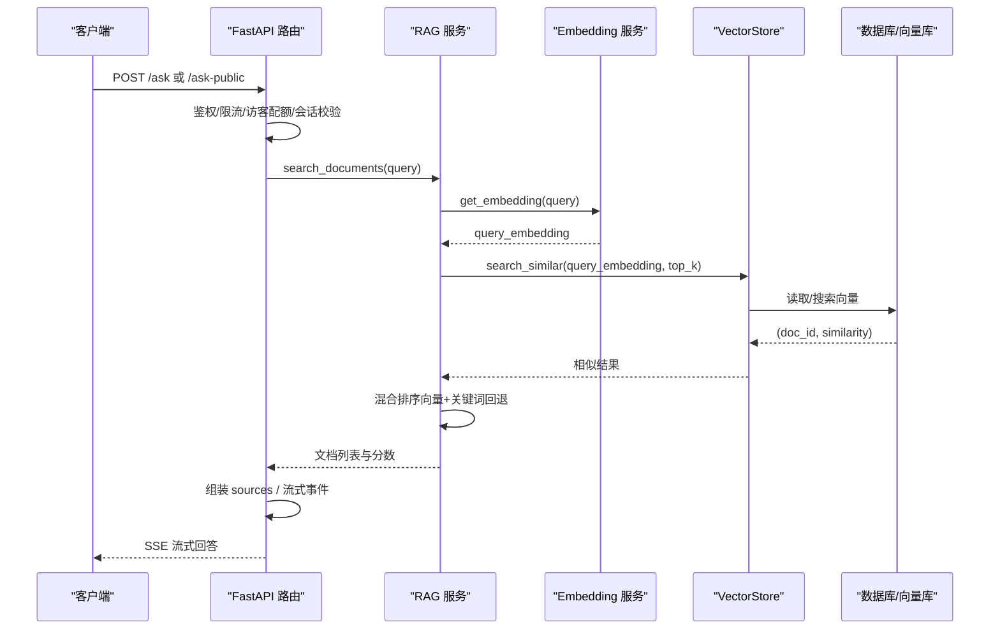
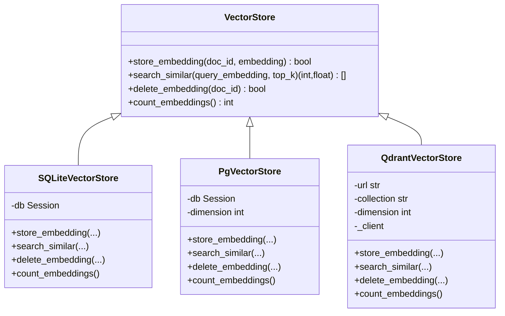
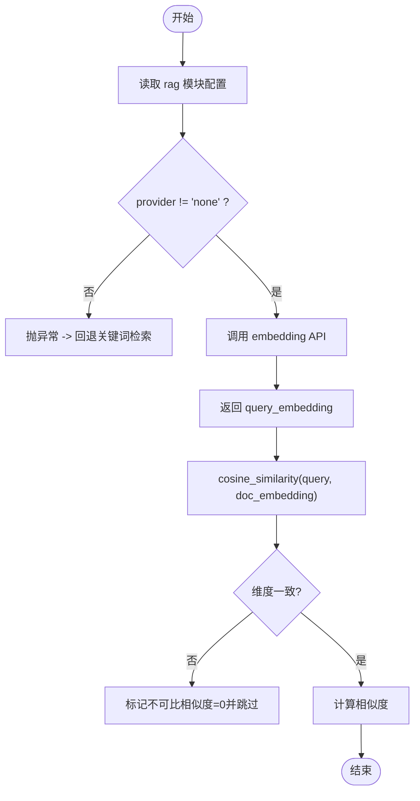
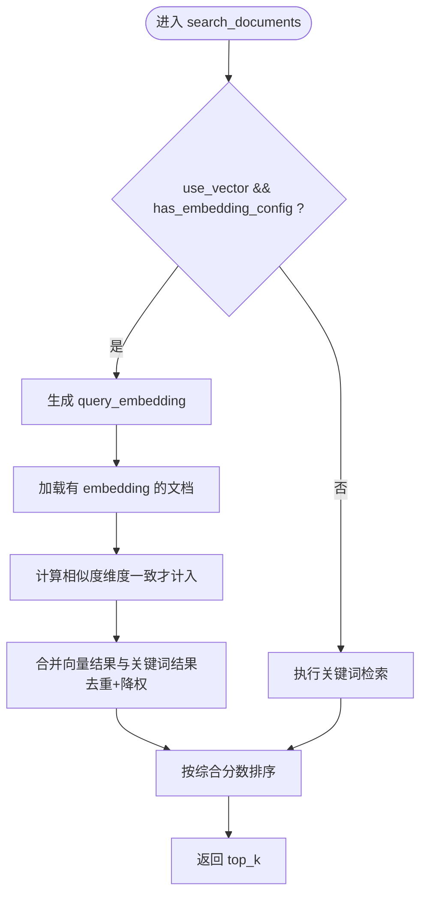
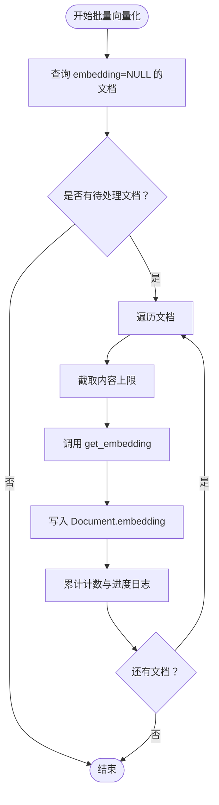
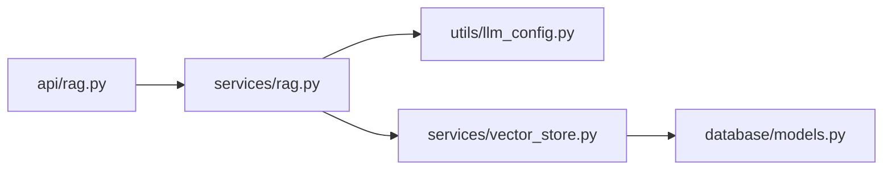

# 向量数据库集成

<cite>
**本文引用的文件**
- [vector_store.py](file://web/backend/services/vector_store.py)
- [rag.py](file://web/backend/services/rag.py)
- [rag API](file://web/backend/api/rag.py)
- [RAG 数据模型](file://web/backend/models/rag.py)
- [LLM 配置](file://web/backend/utils/llm_config.py)
- [数据库模型（Document）](file://web/backend/database/models.py)
</cite>

## 目录
1. [简介](#简介)
2. [项目结构](#项目结构)
3. [核心组件](#核心组件)
4. [架构总览](#架构总览)
5. [详细组件分析](#详细组件分析)
6. [依赖关系分析](#依赖关系分析)
7. [性能与优化](#性能与优化)
8. [故障排查与恢复](#故障排查与恢复)
9. [结论](#结论)
10. [附录：API 调用示例与配置清单](#附录api-调用示例与配置清单)

## 简介
本技术文档面向“向量数据库集成”能力，覆盖文本向量化、相似度检索、索引与存储后端、缓存策略、分块与批量处理、元数据管理、错误处理与故障恢复等。系统当前默认使用 SQLite 存储 embedding（JSON 文本列），并预留 pgvector 与 Qdrant 后端以支持中大规模和高并发场景。检索采用混合策略：优先向量相似度，回退关键词匹配，确保新增或无 embedding 的文档仍可被检索到。

## 项目结构
与向量检索相关的关键代码集中在后端服务层与 API 层：
- 向量存储抽象与实现：services/vector_store.py
- RAG 检索与问答：services/rag.py
- 对外 API：api/rag.py
- 请求/响应模型：models/rag.py
- LLM/Embedding 配置：utils/llm_config.py
- 持久化模型：database/models.py（包含 Document 表，含 embedding 字段）

```mermaid
graph TB
Client["客户端"] --> API["FastAPI 路由<br/>/ask, /ask-public, /ask-stream"]
API --> RAG["RAG 服务<br/>search_documents / answer_question"]
RAG --> Embed["get_embedding<br/>调用 LLM 提供商"]
RAG --> Store["VectorStore 抽象层<br/>SQLite/PgVector/Qdrant"]
Store --> DB["数据库/向量库"]
RAG --> Cache["可选缓存<br/>按模块扩展"]
```

图表来源
- [rag API:246-330](file://web/backend/api/rag.py#L246-L330)
- [rag API:534-629](file://web/backend/api/rag.py#L534-L629)
- [rag.py:354-384](file://web/backend/services/rag.py#L354-L384)
- [rag.py:456-522](file://web/backend/services/rag.py#L456-L522)
- [vector_store.py:25-48](file://web/backend/services/vector_store.py#L25-L48)
- [vector_store.py:245-266](file://web/backend/services/vector_store.py#L245-L266)

章节来源
- [vector_store.py:1-266](file://web/backend/services/vector_store.py#L1-L266)
- [rag.py:354-522](file://web/backend/services/rag.py#L354-L522)
- [rag API:246-629](file://web/backend/api/rag.py#L246-L629)
- [rag 模型:8-62](file://web/backend/models/rag.py#L8-L62)
- [LLM 配置:8-135](file://web/backend/utils/llm_config.py#L8-L135)

## 核心组件
- 向量存储抽象层 VectorStore 及其三种实现：
  - SQLiteVectorStore：将 embedding 以 JSON 字符串存入 Document.embedding 字段，内存计算余弦相似度，适合小规模数据。
  - PgVectorStore：预留 PostgreSQL + pgvector 原生向量类型与 HNSW/IVFFlat 索引，当前未完全实现，回退至 SQLite。
  - QdrantVectorStore：独立向量数据库服务，自动创建集合，支持高并发与大规模数据。
- RAG 检索服务：
  - get_embedding：通过 LLM 配置获取 provider/model/dimensions，调用 OpenAI 兼容接口生成查询向量。
  - search_documents：混合检索（向量+关键词），对维度不匹配的文档进行跳过与回退，保证可用性。
  - batch_embed_unembedded：增量向量化，逐条读取无 embedding 的文档，调用 get_embedding 写入。
- API 层：
  - /ask、/ask-public、/ask-stream：统一入口，负责鉴权、限流、访客配额、会话归属校验、附件解析与流式返回。

章节来源
- [vector_store.py:25-266](file://web/backend/services/vector_store.py#L25-L266)
- [rag.py:354-522](file://web/backend/services/rag.py#L354-L522)
- [rag.py:1493-1535](file://web/backend/services/rag.py#L1493-L1535)
- [rag API:246-629](file://web/backend/api/rag.py#L246-L629)

## 架构总览
下图展示从请求到检索再到回答的完整流程，包括向量生成、混合检索、回退机制与流式响应。

图表来源
- [rag API:534-629](file://web/backend/api/rag.py#L534-L629)
- [rag.py:354-384](file://web/backend/services/rag.py#L354-L384)
- [rag.py:456-522](file://web/backend/services/rag.py#L456-L522)
- [vector_store.py:245-266](file://web/backend/services/vector_store.py#L245-L266)

## 详细组件分析

### 向量存储抽象与实现
- 抽象基类 VectorStore：定义 store_embedding、search_similar、delete_embedding、count_embeddings 四个方法，屏蔽后端差异。
- SQLiteVectorStore：
  - 存储：将 embedding 序列化为 JSON 字符串写入 Document.embedding。
  - 检索：全量加载有 embedding 的文档，内存计算余弦相似度，排序取 top_k。
  - 删除/计数：清空 embedding 字段或统计非空数量。
- PgVectorStore：
  - 设计目标：使用 pgvector 扩展与 HNSW/IVFFlat 索引，适合中大规模数据。
  - 现状：方法体未实现，全部回退到 SQLite 实现，便于平滑升级。
- QdrantVectorStore：
  - 初始化：连接远程 Qdrant，按需创建集合（COSINE 距离）。
  - 存储/检索/删除/计数：通过 qdrant-client 完成 upsert/search/delete/get_collection。

图表来源
- [vector_store.py:25-48](file://web/backend/services/vector_store.py#L25-L48)
- [vector_store.py:51-109](file://web/backend/services/vector_store.py#L51-L109)
- [vector_store.py:112-154](file://web/backend/services/vector_store.py#L112-L154)
- [vector_store.py:157-243](file://web/backend/services/vector_store.py#L157-L243)

章节来源
- [vector_store.py:25-266](file://web/backend/services/vector_store.py#L25-L266)

### 文本向量化与相似度计算
- get_embedding：
  - 通过 get_llm_config("rag") 获取 provider、base_url、embedding_model、embedding_dimensions。
  - 构造 OpenAI 兼容客户端，调用 embeddings.create，返回向量。
  - 若 provider 为 none，抛出异常，上层捕获后回退关键词检索。
- cosine_similarity：
  - 严格检查维度一致性，不一致时记录警告并返回 0，避免误排无关文档。
  - 计算点积与范数得到余弦相似度。

图表来源
- [rag.py:354-384](file://web/backend/services/rag.py#L354-L384)
- [rag.py:387-401](file://web/backend/services/rag.py#L387-L401)

章节来源
- [rag.py:354-401](file://web/backend/services/rag.py#L354-L401)

### 混合检索与回退策略
- search_documents：
  - 根据环境变量 RAG_USE_VECTOR 与 rag 模块是否启用 embedding 决定路径。
  - 向量检索：生成 query_embedding，遍历文档，过滤有效 embedding，计算相似度，合并去重。
  - 关键词检索：提取中英文词，计算匹配度，作为回退补充。
  - 最终排序：向量结果优先，关键词结果降权合并，确保新内容可立即检索。
- 维度不匹配处理：
  - 当 query 与 doc 向量维度不一致时，相似度为 0 且跳过该文档，避免污染排序。

图表来源
- [rag.py:456-522](file://web/backend/services/rag.py#L456-L522)

章节来源
- [rag.py:456-522](file://web/backend/services/rag.py#L456-L522)

### 批量向量化与增量更新
- batch_embed_unembedded：
  - 扫描 embedding=NULL 的文档，逐条截断内容（防止过长），调用 get_embedding 写入。
  - 每处理 10 条输出进度日志，失败计数与成功计数分别统计。
  - 适用于每月定时任务或后台批处理，逐步补齐缺失向量。

图表来源
- [rag.py:1493-1535](file://web/backend/services/rag.py#L1493-L1535)

章节来源
- [rag.py:1493-1535](file://web/backend/services/rag.py#L1493-L1535)

### 元数据管理与评分加权
- 文档元数据：
  - Document 包含 title、content、pub_date、authority_weight、source_url 等字段，用于增强检索质量。
- 评分加权：
  - _compute_final_score：将基础相似度乘以 authority_weight（权威权重）与 recency（时间衰减/提升），得到最终分数。
  - 近期文档获得小幅提升，较旧文档适度降低，平衡时效性与相关性。

章节来源
- [rag.py:404-430](file://web/backend/services/rag.py#L404-L430)
- [数据库模型（Document）](file://web/backend/database/models.py)

### 缓存策略
- 当前实现未内置统一的 embedding 缓存层；get_embedding 每次调用均访问 LLM 提供商。
- 建议扩展：
  - 在 services 层增加本地缓存（如 Redis/Memcached），键基于文本哈希与 provider/model/dimensions。
  - 设置合理 TTL 与容量上限，避免热点 key 导致抖动。
  - 对批量向量化过程可结合去重与并行化，减少重复计算。

[本节为通用建议，不直接分析具体文件]

### 向量分块策略
- 当前批量向量化对单篇文档内容进行截断（例如前若干字符），以避免超长输入影响 embedding 质量与成本。
- 建议策略：
  - 按段落/标题切分，保留层级信息（标题、摘要、正文）。
  - 为每个 chunk 生成独立 embedding，并在检索阶段聚合得分。
  - 维护 chunk 级元数据（来源、位置、父文档 ID），便于溯源与精确定位。

[本节为通用建议，不直接分析具体文件]

## 依赖关系分析
- API 层依赖 RAG 服务，RAG 服务依赖 LLM 配置与向量存储抽象。
- 向量存储抽象层解耦后端实现，便于切换 SQLite/pgvector/Qdrant。
- 数据库模型 Document 承载 embedding 与元数据，支撑检索与评分。

图表来源
- [rag API:246-629](file://web/backend/api/rag.py#L246-L629)
- [rag.py:354-522](file://web/backend/services/rag.py#L354-L522)
- [vector_store.py:245-266](file://web/backend/services/vector_store.py#L245-L266)
- [数据库模型（Document）](file://web/backend/database/models.py)

章节来源
- [rag API:246-629](file://web/backend/api/rag.py#L246-L629)
- [rag.py:354-522](file://web/backend/services/rag.py#L354-L522)
- [vector_store.py:245-266](file://web/backend/services/vector_store.py#L245-L266)

## 性能与优化
- 后端选择：
  - SQLite：适合小规模（<10000 文档），简单部署，内存计算相似度。
  - pgvector：推荐升级方案，原生向量类型与 HNSW/IVFFlat 索引，适合中大规模。
  - Qdrant：独立服务，适合高并发与超大规模，需额外运维。
- 检索优化：
  - 混合检索：向量优先，关键词回退，提高召回率与鲁棒性。
  - 维度一致性检查：避免错误相似度污染排序。
  - 评分加权：权威权重与时效性调整，提升相关性。
- 批量向量化：
  - 增量处理，避免全量重建；分段截断控制输入长度；进度日志便于监控。
- 缓存建议：
  - 引入本地或分布式缓存，减少重复 embedding 调用。
  - 针对高频查询构建热点缓存，TTL 与失效策略需结合业务。

[本节提供通用指导，不直接分析具体文件]

## 故障排查与恢复
- Embedding 生成失败：
  - 现象：get_embedding 抛异常，search_documents 捕获并回退关键词检索。
  - 处理：检查 LLM 配置（provider、api_key、base_url）、网络连通性、配额限制。
- 维度不匹配：
  - 现象：cosine_similarity 记录维度不匹配警告并返回 0。
  - 处理：确保 embedding 维度与查询一致；必要时重新向量化历史文档。
- 向量存储后端不可用：
  - Qdrant：未安装客户端或服务未启动会抛出运行时异常；需安装依赖并启动服务。
  - pgvector：当前未完全实现，回退 SQLite；如需生产环境，请完善实现并添加索引。
- 访客配额与限流：
  - 访客每日次数限制与会话归属校验，避免滥用与越权访问。
  - 登录用户速率限制，防止 LLM 成本滥用。

章节来源
- [rag.py:469-476](file://web/backend/services/rag.py#L469-L476)
- [rag.py:387-401](file://web/backend/services/rag.py#L387-L401)
- [vector_store.py:179-187](file://web/backend/services/vector_store.py#L179-L187)
- [rag API:228-243](file://web/backend/api/rag.py#L228-L243)
- [rag API:273-330](file://web/backend/api/rag.py#L273-L330)

## 结论
本系统集成了一套可扩展的向量检索能力：默认 SQLite 快速落地，预留 pgvector 与 Qdrant 以应对规模增长；检索采用混合策略保障召回与稳定性；批量向量化支持增量补齐；评分加权提升相关性。后续建议完善 pgvector 实现、引入缓存层、优化分块策略与监控指标，以满足更高性能与可靠性需求。

[本节总结性内容，不直接分析具体文件]

## 附录：API 调用示例与配置清单

### API 端点
- 已登录用户提问：POST /ask
  - 请求体：QuestionRequest（question, conversation_id, mode）
  - 响应：QuestionResponse（answer, sources, remaining_quota, is_guest）
- 访客免费提问：POST /ask-public
  - 请求体：同 QuestionRequest
  - 响应：同 QuestionResponse，附加剩余配额
- 流式回答：POST /ask-stream、/ask-public-stream
  - 请求体：QuestionRequestWithAttachments（question, conversation_id, attachment_ids, mode）
  - 响应：SSE 流，包含 thinking/analyzing/generating 等事件

章节来源
- [rag API:246-330](file://web/backend/api/rag.py#L246-L330)
- [rag API:534-629](file://web/backend/api/rag.py#L534-L629)
- [rag 模型:8-62](file://web/backend/models/rag.py#L8-L62)

### 环境变量与配置
- 向量存储后端：
  - VECTOR_STORE_BACKEND=sqlite|pgvector|qdrant
  - VECTOR_STORE_DIMENSION=1536
  - QDRANT_URL=http://localhost:6333
  - QDRANT_COLLECTION=subskin_documents
- LLM/Embedding 配置（按 provider）：
  - DashScope：DASHSCOPE_API_KEY、DASHSCOPE_BASE_URL、DASHSCOPE_EMBEDDING_MODEL、DASHSCOPE_EMBEDDING_DIMENSIONS
  - VolcEngine：VOLCENGINE_API_KEY、VOLCENGINE_BASE_URL、VOLCENGINE_EMBEDDING_ENDPOINT
  - DeepSeek/Moonshot/Minimax/Zhipu/OpenAI：对应 API_KEY 与 BASE_URL
- RAG 开关：
  - RAG_USE_VECTOR=true/false（控制是否启用向量检索）

章节来源
- [vector_store.py:9-13](file://web/backend/services/vector_store.py#L9-L13)
- [vector_store.py:245-266](file://web/backend/services/vector_store.py#L245-L266)
- [LLM 配置:8-135](file://web/backend/utils/llm_config.py#L8-L135)