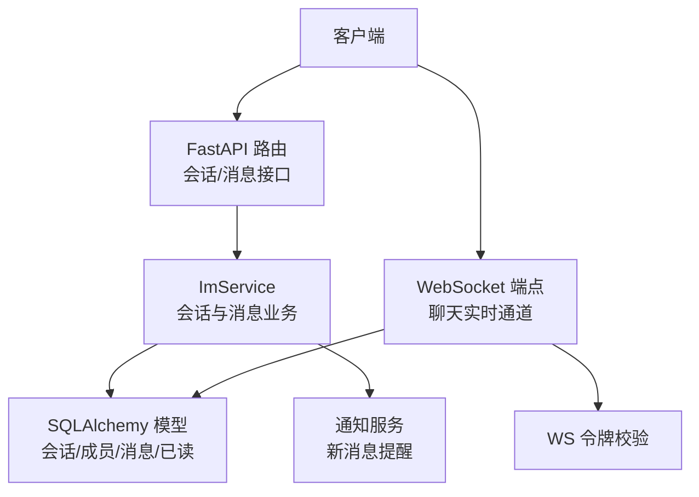
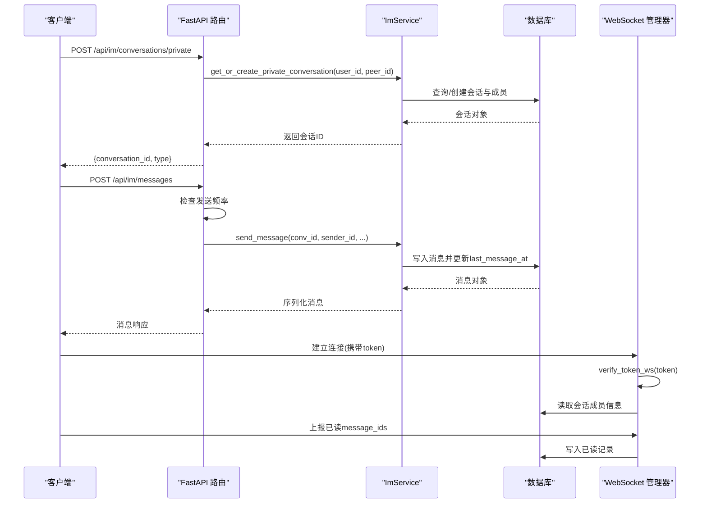
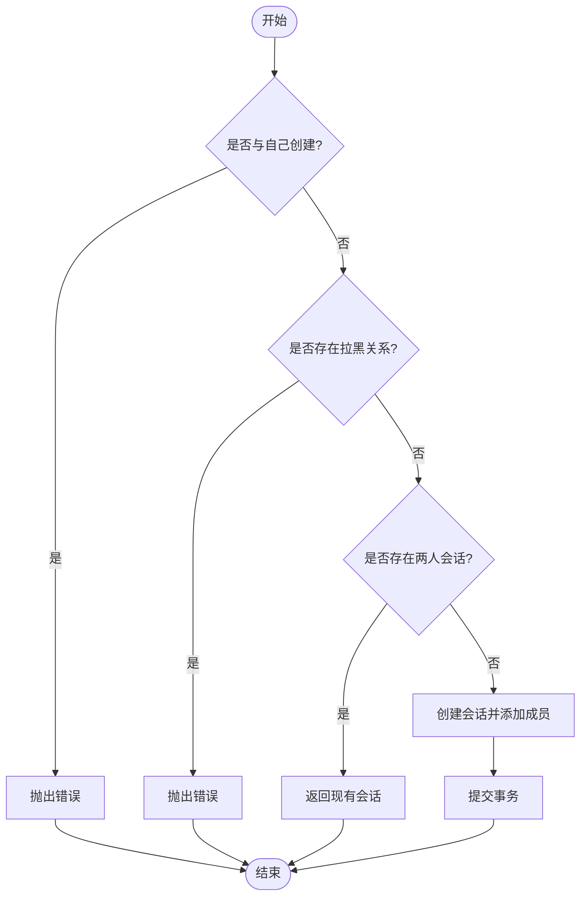
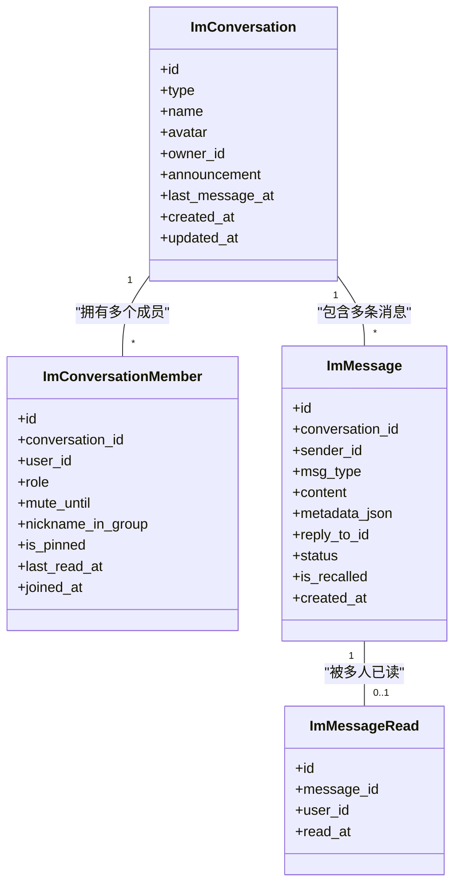
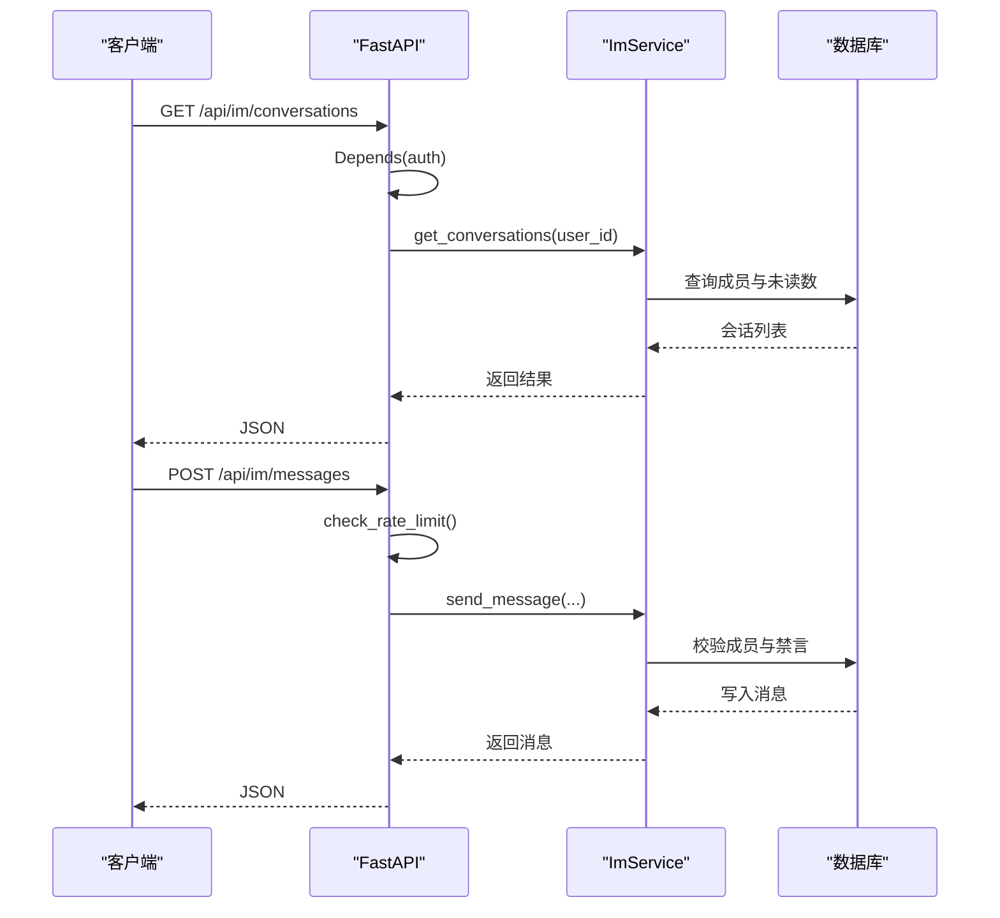
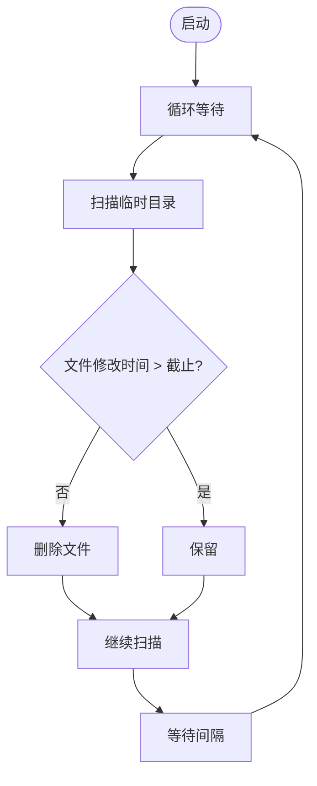
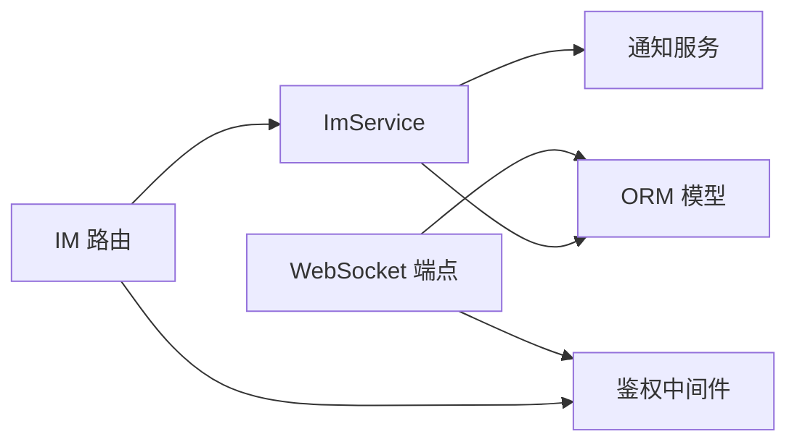

# 对话管理

<cite>
**本文引用的文件**
- [im_conversations.py](file://web/backend/api/im_conversations.py)
- [im_messages.py](file://web/backend/api/im_messages.py)
- [chat.py](file://web/backend/ws/chat.py)
- [im_service.py](file://web/backend/services/im_service.py)
- [models.py](file://web/backend/database/models.py)
- [auth.py](file://web/backend/services/auth.py)
- [temp_cleanup.py](file://web/backend/services/temp_cleanup.py)
</cite>

## 目录
1. [简介](#简介)
2. [项目结构](#项目结构)
3. [核心组件](#核心组件)
4. [架构总览](#架构总览)
5. [详细组件分析](#详细组件分析)
6. [依赖关系分析](#依赖关系分析)
7. [性能与并发](#性能与并发)
8. [故障排查指南](#故障排查指南)
9. [结论](#结论)
10. [附录：API 示例与数据模型](#附录api-示例与数据模型)

## 简介
本技术文档聚焦于对话管理系统，覆盖会话生命周期管理、消息持久化、上下文维护、权限控制机制，以及会话创建、历史查询、并发控制与数据清理策略。系统包含 REST API、WebSocket 实时通道、服务层业务逻辑与数据库模型，确保访客与会话的绑定关系明确、会话所有权验证严格、安全访问控制完备。

## 项目结构
对话管理由以下层次组成：
- API 层：提供会话列表、私聊会话创建、消息发送/撤回、已读标记、置顶等接口
- WebSocket 层：实现用户在线连接、心跳、已读回执上报
- 服务层：封装会话与消息的核心业务（成员校验、禁言、拉黑、未读数计算、通知）
- 数据层：会话、成员、消息、已读记录、风控等 ORM 模型
- 认证与安全：JWT 鉴权、WS Token 校验、速率限制、内容安全（可选）

**图表来源**
- [im_conversations.py:21-42](file://web/backend/api/im_conversations.py#L21-L42)
- [im_messages.py:41-78](file://web/backend/api/im_messages.py#L41-L78)
- [chat.py:45-111](file://web/backend/ws/chat.py#L45-L111)
- [im_service.py:32-331](file://web/backend/services/im_service.py#L32-L331)
- [models.py:956-1058](file://web/backend/database/models.py#L956-L1058)

**章节来源**
- [im_conversations.py:1-103](file://web/backend/api/im_conversations.py#L1-L103)
- [im_messages.py:1-78](file://web/backend/api/im_messages.py#L1-L78)
- [chat.py:1-111](file://web/backend/ws/chat.py#L1-L111)
- [im_service.py:1-419](file://web/backend/services/im_service.py#L1-L419)
- [models.py:940-1058](file://web/backend/database/models.py#L940-L1058)

## 核心组件
- 会话管理 API
  - 列出当前用户的会话列表（含未读数、置顶、免打扰状态）
  - 创建私聊会话（自动去重，检查拉黑关系）
  - 获取会话历史消息（分页、按时间倒序）
  - 标记会话为已读、切换置顶
- 消息 API
  - 发送消息（限流、成员校验、禁言校验、更新最后消息时间）
  - 撤回消息（仅本人、2分钟内）
- WebSocket 实时通道
  - 基于 JWT 的 WS 鉴权
  - 心跳 ping/pong
  - 已读回执上报（校验会话成员后写入已读表）
- 服务层 ImService
  - 私聊会话创建与复用
  - 会话列表与未读数计算
  - 消息发送、历史查询、撤回
  - 好友请求与好友列表（扩展能力）
- 数据模型
  - 会话、成员、消息、已读记录、风控记录
- 认证与安全
  - HTTP 鉴权中间件
  - WS 鉴权
  - 发送频率限制
  - 内容安全（可选）

**章节来源**
- [im_conversations.py:21-103](file://web/backend/api/im_conversations.py#L21-L103)
- [im_messages.py:18-78](file://web/backend/api/im_messages.py#L18-L78)
- [chat.py:14-111](file://web/backend/ws/chat.py#L14-L111)
- [im_service.py:26-419](file://web/backend/services/im_service.py#L26-L419)
- [models.py:940-1058](file://web/backend/database/models.py#L940-L1058)
- [auth.py:262-308](file://web/backend/services/auth.py#L262-L308)

## 架构总览
下图展示从客户端到数据库的完整调用链，包括会话创建、消息发送、历史查询与已读回执流程。

**图表来源**
- [im_conversations.py:29-42](file://web/backend/api/im_conversations.py#L29-L42)
- [im_messages.py:41-78](file://web/backend/api/im_messages.py#L41-L78)
- [im_service.py:32-331](file://web/backend/services/im_service.py#L32-L331)
- [chat.py:45-111](file://web/backend/ws/chat.py#L45-L111)
- [models.py:956-1058](file://web/backend/database/models.py#L956-L1058)

## 详细组件分析

### 会话生命周期管理
- 创建私聊会话
  - 禁止与自己创建
  - 检查双方是否互相拉黑
  - 若已有两人成员会话则复用，否则新建会话并添加两名成员
- 会话列表
  - 按最近消息时间排序
  - 计算未读数：基于 last_read_at 或全部历史
  - 附带对方用户信息与置顶/免打扰状态
- 会话成员
  - 唯一约束保证一人一角色
  - 支持禁言截止时间、昵称、置顶、最后已读时间

**图表来源**
- [im_service.py:32-88](file://web/backend/services/im_service.py#L32-L88)
- [models.py:956-988](file://web/backend/database/models.py#L956-L988)

**章节来源**
- [im_service.py:32-194](file://web/backend/services/im_service.py#L32-L194)
- [models.py:956-988](file://web/backend/database/models.py#L956-L988)

### 消息持久化与上下文维护
- 发送消息
  - 校验会话成员与禁言状态
  - 写入消息并更新会话最后消息时间
  - 触发通知给其他成员
- 历史查询
  - 校验会话成员权限
  - 支持 before_id 分页与 limit 限制
  - 按时间倒序返回，再反转顺序以正序呈现
- 上下文维护
  - 会话级上下文通过 conversation_id 组织
  - 消息 reply_to_id 支持引用回复
  - 未读数基于 last_read_at 与消息时间戳计算

**图表来源**
- [models.py:956-1058](file://web/backend/database/models.py#L956-L1058)

**章节来源**
- [im_service.py:215-331](file://web/backend/services/im_service.py#L215-L331)
- [models.py:990-1058](file://web/backend/database/models.py#L990-L1058)

### 权限控制与访问验证
- HTTP 鉴权
  - 所有 IM 接口通过 auth 依赖注入当前用户
- WebSocket 鉴权
  - 使用 verify_token_ws 校验 token，非法直接关闭连接
- 会话成员校验
  - 发送与读取均需确认 user_id 为会话成员
- 禁言与拉黑
  - 发送前检查 mute_until；创建私聊时检查 UserBlock
- 已读回执安全
  - WS 上报已读需再次校验用户是否为该消息所属会话成员

**图表来源**
- [im_conversations.py:21-42](file://web/backend/api/im_conversations.py#L21-L42)
- [im_messages.py:18-78](file://web/backend/api/im_messages.py#L18-L78)
- [im_service.py:215-331](file://web/backend/services/im_service.py#L215-L331)

**章节来源**
- [im_conversations.py:21-103](file://web/backend/api/im_conversations.py#L21-L103)
- [im_messages.py:18-78](file://web/backend/api/im_messages.py#L18-L78)
- [im_service.py:32-331](file://web/backend/services/im_service.py#L32-L331)
- [auth.py:262-308](file://web/backend/services/auth.py#L262-L308)

### 并发控制与数据清理策略
- 发送频率限制
  - 基于内存字典按用户维度记录最近一分钟内的发送次数
  - 超过阈值返回 429
- 临时文件清理
  - 定时任务扫描 data/uploads/temp，删除超过 24 小时的临时文件
  - 可配置清理间隔，避免磁盘膨胀
- 刷新令牌清理
  - 定期清理过期或被撤销的 refresh tokens，防止数据库膨胀

**图表来源**
- [temp_cleanup.py:15-66](file://web/backend/services/temp_cleanup.py#L15-L66)

**章节来源**
- [im_messages.py:18-30](file://web/backend/api/im_messages.py#L18-L30)
- [temp_cleanup.py:1-66](file://web/backend/services/temp_cleanup.py#L1-L66)
- [auth.py:285-308](file://web/backend/services/auth.py#L285-L308)

## 依赖关系分析
- API 层依赖服务层进行业务处理，服务层依赖数据库模型进行数据存取
- WebSocket 层独立处理实时通信，但同样依赖数据库进行已读记录与成员校验
- 认证模块在 HTTP 与 WS 两端均被使用，确保统一鉴权策略
- 通知服务在消息发送后被调用，用于提醒其他成员

**图表来源**
- [im_conversations.py:9-12](file://web/backend/api/im_conversations.py#L9-L12)
- [im_messages.py:11-14](file://web/backend/api/im_messages.py#L11-L14)
- [chat.py:9-10](file://web/backend/ws/chat.py#L9-L10)
- [im_service.py:11-22](file://web/backend/services/im_service.py#L11-L22)

**章节来源**
- [im_conversations.py:9-12](file://web/backend/api/im_conversations.py#L9-L12)
- [im_messages.py:11-14](file://web/backend/api/im_messages.py#L11-L14)
- [chat.py:9-10](file://web/backend/ws/chat.py#L9-L10)
- [im_service.py:11-22](file://web/backend/services/im_service.py#L11-L22)

## 性能与并发
- 历史消息查询采用分页与索引优化（conversation_id + created_at）
- 未读数计算基于 last_read_at 与消息时间戳，避免全量扫描
- 发送频率限制保护后端免受突发流量冲击
- 临时文件清理降低存储压力
- 建议后续阶段引入 Redis 缓存会话热点数据与未读数统计，提升高并发场景下的性能

[本节为通用性能建议，不直接分析具体文件]

## 故障排查指南
- 无法创建私聊会话
  - 检查是否与自己创建
  - 检查是否存在拉黑关系
- 无法发送消息
  - 检查是否会话成员
  - 检查是否处于禁言状态
  - 检查发送频率是否超限
- 无法撤回消息
  - 检查是否为本人消息
  - 检查是否在 2 分钟时限内
- WebSocket 已读回执无效
  - 检查用户是否为该消息所属会话成员
  - 检查是否重复写入已读记录
- 临时文件堆积
  - 检查清理任务是否正常运行
  - 调整清理间隔与最大存活时间

**章节来源**
- [im_service.py:32-331](file://web/backend/services/im_service.py#L32-L331)
- [im_messages.py:18-78](file://web/backend/api/im_messages.py#L18-L78)
- [chat.py:58-111](file://web/backend/ws/chat.py#L58-L111)
- [temp_cleanup.py:15-66](file://web/backend/services/temp_cleanup.py#L15-L66)

## 结论
本对话管理系统通过清晰的层次划分与严格的权限控制，实现了稳定的会话生命周期管理与消息持久化。服务层对成员、禁言、拉黑等边界条件进行了完善处理，WebSocket 提供了实时交互能力。结合频率限制与数据清理策略，系统在稳定性与资源占用方面具备良好表现。未来可在缓存、水平扩展与消息审核方面进一步增强。

[本节为总结性内容，不直接分析具体文件]

## 附录：API 示例与数据模型

### API 使用示例
- 创建私聊会话
  - 方法：POST
  - 路径：/api/im/conversations/private
  - 请求体：{ "user_id": 目标用户ID }
  - 响应：{ "conversation_id": 会话ID, "type": "private" }
- 列出会话
  - 方法：GET
  - 路径：/api/im/conversations
  - 响应：{ "items": [会话列表] }
- 获取历史消息
  - 方法：GET
  - 路径：/api/im/conversations/{conversation_id}/messages?before_id=...&limit=50
  - 响应：{ "items": [消息列表] }
- 发送消息
  - 方法：POST
  - 路径：/api/im/messages
  - 请求体：{ "conversation_id": 会话ID, "msg_type": "text", "content": "...", "metadata": {}, "reply_to_id": null }
  - 响应：序列化后的消息对象
- 撤回消息
  - 方法：POST
  - 路径：/api/im/messages/{message_id}/recall
  - 响应：{ "status": "ok" }
- 标记已读
  - 方法：POST
  - 路径：/api/im/conversations/{conversation_id}/read
  - 响应：{ "status": "ok" }
- 切换置顶
  - 方法：POST
  - 路径：/api/im/conversations/{conversation_id}/pin
  - 响应：{ "is_pinned": true/false }

**章节来源**
- [im_conversations.py:21-103](file://web/backend/api/im_conversations.py#L21-L103)
- [im_messages.py:33-78](file://web/backend/api/im_messages.py#L33-L78)

### 数据模型设计
- 会话（ImConversation）
  - 字段：类型（私聊/群聊）、名称、头像、群主、公告、最后消息时间、创建/更新时间
- 成员（ImConversationMember）
  - 字段：会话ID、用户ID、角色、禁言截止时间、群内昵称、置顶、最后已读时间、加入时间
- 消息（ImMessage）
  - 字段：会话ID、发送者ID、消息类型、内容、元数据、引用消息ID、状态、是否撤回、创建时间
- 已读记录（ImMessageRead）
  - 字段：消息ID、用户ID、已读时间
- 风控记录（ImMessageModeration）
  - 字段：消息ID、发送者ID、内容快照、风险等级、分类、自动动作、AI原因、置信度、状态、审核人、创建时间

**章节来源**
- [models.py:956-1058](file://web/backend/database/models.py#L956-L1058)