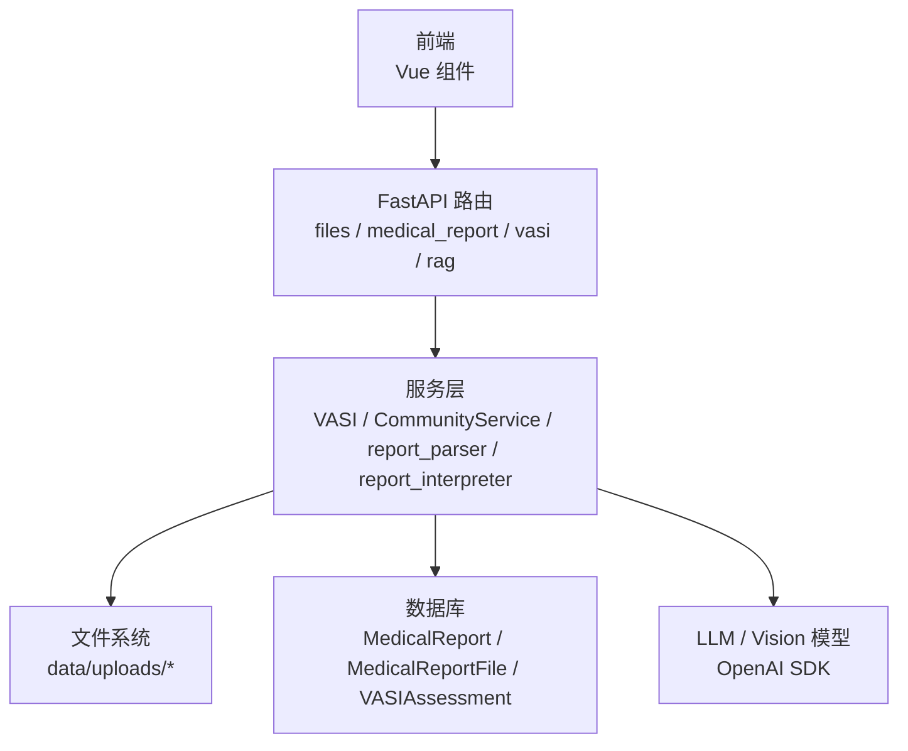
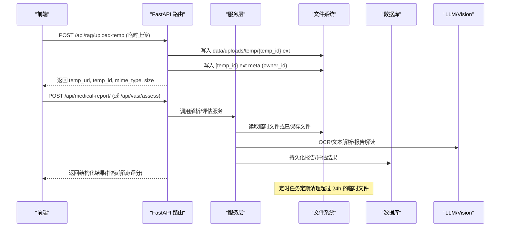
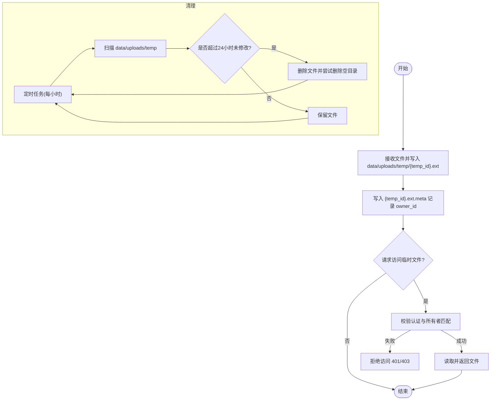
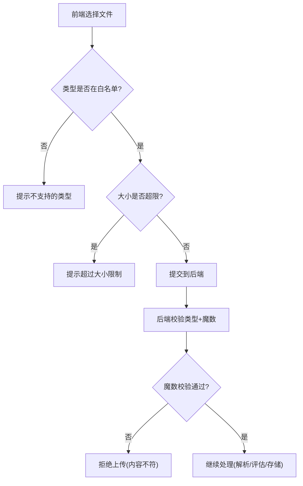
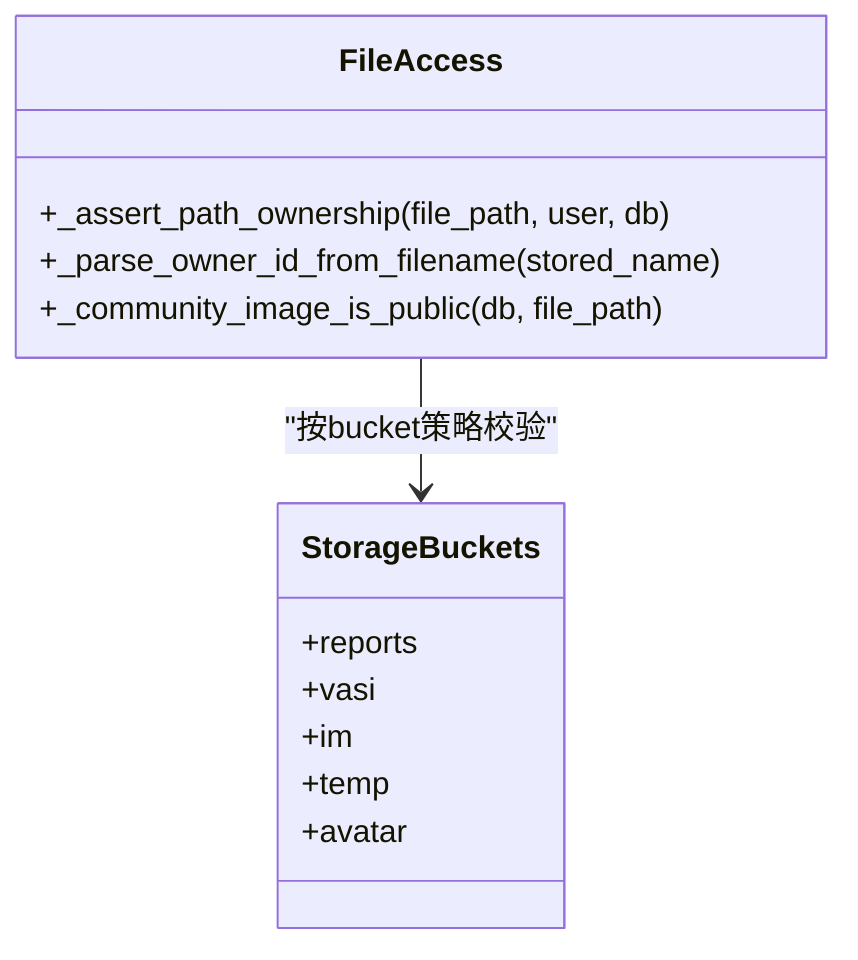
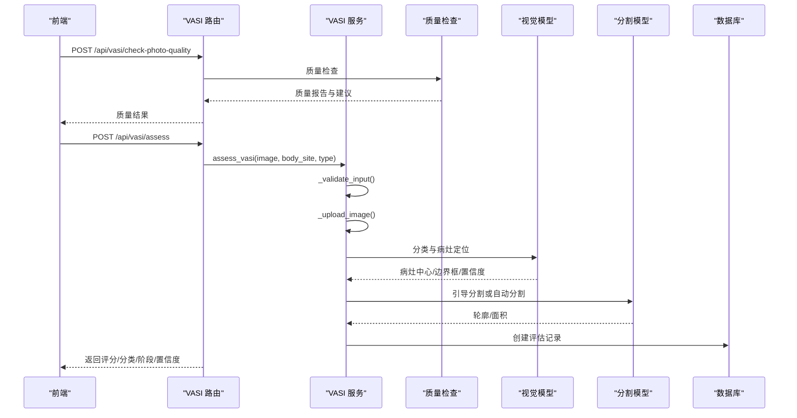
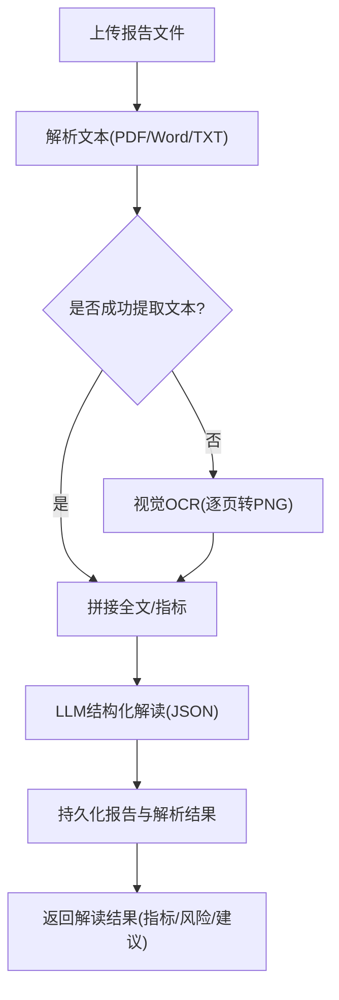
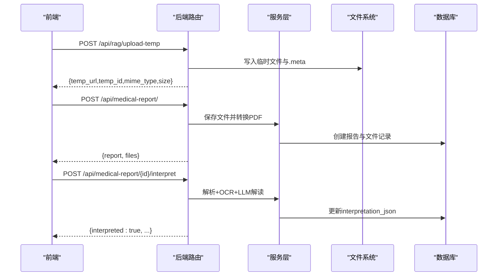
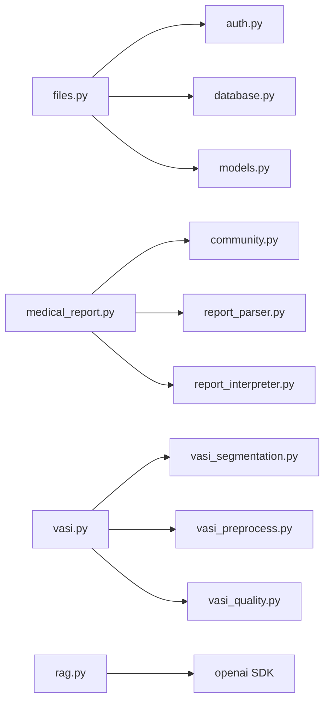

# 文件上传与分析

<cite>
**本文引用的文件**   
- [web/backend/api/files.py](file://web/backend/api/files.py)
- [web/backend/services/temp_cleanup.py](file://web/backend/services/temp_cleanup.py)
- [web/backend/api/medical_report.py](file://web/backend/api/medical_report.py)
- [web/backend/services/rag.py](file://web/backend/services/rag.py)
- [web/backend/api/vasi.py](file://web/backend/api/vasi.py)
- [web/backend/services/vasi.py](file://web/backend/services/vasi.py)
- [web/app/src/composables/useVasiUpload.ts](file://web/app/src/composables/useVasiUpload.ts)
- [web/app/src/composables/useVasiAssess.ts](file://web/app/src/composables/useVasiAssess.ts)
- [web/vitepress/docs/.vitepress/theme/components/VASIAssessment.vue](file://web/vitepress/docs/.vitepress/theme/components/VASIAssessment.vue)
- [tests/backend/api/test_files.py](file://tests/backend/api/test_files.py)
- [tests/backend/api/test_rag.py](file://tests/backend/api/test_rag.py)
</cite>

## 目录
1. [简介](#简介)
2. [项目结构](#项目结构)
3. [核心组件](#核心组件)
4. [架构总览](#架构总览)
5. [详细组件分析](#详细组件分析)
6. [依赖关系分析](#依赖关系分析)
7. [性能考量](#性能考量)
8. [故障排查指南](#故障排查指南)
9. [结论](#结论)

## 简介
本技术文档围绕“文件上传与分析”能力，系统性说明临时文件管理、文件类型与大小校验、安全性检查机制；详解图片 VASI 评估、文档解析（PDF/Word/TXT）与报告解读流程；解释文件所有权验证、临时文件清理策略与存储路径规范；并给出完整的上传流程、分析结果格式与错误处理方案。

## 项目结构
后端以 FastAPI 提供 REST API，前端 Vue 组件负责交互与校验，服务层实现业务逻辑，文件系统按“bucket + 用户隔离”组织，临时文件统一在 data/uploads/temp 下管理并由定时任务清理。

**图表来源** 
- [web/backend/api/files.py:293-331](file://web/backend/api/files.py#L293-L331)
- [web/backend/api/medical_report.py:214-276](file://web/backend/api/medical_report.py#L214-L276)
- [web/backend/services/rag.py:360-382](file://web/backend/services/rag.py#L360-L382)
- [web/backend/services/vasi.py:159-243](file://web/backend/services/vasi.py#L159-L243)

**章节来源**
- [web/backend/api/files.py:293-331](file://web/backend/api/files.py#L293-L331)
- [web/backend/api/medical_report.py:214-276](file://web/backend/api/medical_report.py#L214-L276)
- [web/backend/services/rag.py:360-382](file://web/backend/services/rag.py#L360-L382)
- [web/backend/services/vasi.py:159-243](file://web/backend/services/vasi.py#L159-L243)

## 核心组件
- 文件访问与鉴权：统一通过 /api/files/serve 路由进行鉴权、路径校验与权限控制，支持短生命周期文件访问令牌。
- 临时文件管理：上传到 data/uploads/temp，附带 .meta 记录所有者，定时任务按修改时间清理过期文件。
- 医疗报告上传与解析：支持 PDF/Word/TXT 文本提取，OCR 视觉识别，结构化指标抽取与解读。
- VASI 图片评估：图像质量检查、魔数校验、部位选择、分割与评分计算、结果持久化。
- 前端校验与交互：限制类型与大小、预览、质量检查、分步引导与错误提示。

**章节来源**
- [web/backend/api/files.py:37-48](file://web/backend/api/files.py#L37-L48)
- [web/backend/services/temp_cleanup.py:15-52](file://web/backend/services/temp_cleanup.py#L15-L52)
- [web/backend/api/medical_report.py:214-276](file://web/backend/api/medical_report.py#L214-L276)
- [web/backend/services/rag.py:943-974](file://web/backend/services/rag.py#L943-L974)
- [web/backend/services/vasi.py:539-572](file://web/backend/services/vasi.py#L539-L572)
- [web/app/src/composables/useVasiUpload.ts:1-46](file://web/app/src/composables/useVasiUpload.ts#L1-L46)
- [web/app/src/composables/useVasiAssess.ts:1-45](file://web/app/src/composables/useVasiAssess.ts#L1-L45)
- [web/vitepress/docs/.vitepress/theme/components/VASIAssessment.vue:52-70](file://web/vitepress/docs/.vitepress/theme/components/VASIAssessment.vue#L52-L70)

## 架构总览
下图展示从前端上传到后端解析、分析与存储的端到端流程，以及临时文件的创建、鉴权与清理。

**图表来源** 
- [web/backend/api/rag.py:360-382](file://web/backend/api/rag.py#L360-L382)
- [web/backend/api/medical_report.py:214-276](file://web/backend/api/medical_report.py#L214-L276)
- [web/backend/services/rag.py:943-974](file://web/backend/services/rag.py#L943-L974)
- [web/backend/services/temp_cleanup.py:55-66](file://web/backend/services/temp_cleanup.py#L55-L66)

## 详细组件分析

### 临时文件管理与清理
- 临时上传：接收文件后写入 data/uploads/temp，生成唯一 temp_id，并写入同名的 .meta 文件记录 owner_id，用于后续所有权校验。
- 访问控制：所有对 temp 路径的访问需携带有效凭据，且仅允许文件所有者访问。
- 清理策略：后台循环每 60 分钟扫描一次，删除超过 24 小时未修改的文件，并尝试清理空目录。

**图表来源** 
- [web/backend/api/rag.py:360-382](file://web/backend/api/rag.py#L360-L382)
- [web/backend/api/files.py:194-203](file://web/backend/api/files.py#L194-L203)
- [web/backend/services/temp_cleanup.py:15-52](file://web/backend/services/temp_cleanup.py#L15-L52)

**章节来源**
- [web/backend/api/rag.py:360-382](file://web/backend/api/rag.py#L360-L382)
- [web/backend/api/files.py:194-203](file://web/backend/api/files.py#L194-L203)
- [web/backend/services/temp_cleanup.py:15-52](file://web/backend/services/temp_cleanup.py#L15-L52)
- [tests/backend/api/test_files.py:70-96](file://tests/backend/api/test_files.py#L70-L96)
- [tests/backend/api/test_rag.py:225-261](file://tests/backend/api/test_rag.py#L225-L261)

### 文件类型验证、大小限制与安全校验
- 前端校验：限制图片类型（JPG/PNG/WebP）、大小上限（如 10MB），并提供预览与错误提示。
- 后端校验：
  - 类型白名单与魔数校验（magic byte），防止 Content-Type 伪造与多态文件绕过。
  - 大小限制（例如 10MB/20MB 不同接口）。
  - 路径安全校验（防目录穿越）。
  - 所有者校验（temp 文件 .meta 比对，其他 bucket 基于文件名前缀或数据库关联）。

**图表来源** 
- [web/vitepress/docs/.vitepress/theme/components/VASIAssessment.vue:52-70](file://web/vitepress/docs/.vitepress/theme/components/VASIAssessment.vue#L52-L70)
- [web/backend/services/vasi.py:539-572](file://web/backend/services/vasi.py#L539-L572)
- [web/backend/api/image_label.py:934-965](file://web/backend/api/image_label.py#L934-L965)
- [web/backend/api/files.py:55-69](file://web/backend/api/files.py#L55-L69)

**章节来源**
- [web/vitepress/docs/.vitepress/theme/components/VASIAssessment.vue:52-70](file://web/vitepress/docs/.vitepress/theme/components/VASIAssessment.vue#L52-L70)
- [web/backend/services/vasi.py:539-572](file://web/backend/services/vasi.py#L539-L572)
- [web/backend/api/image_label.py:934-965](file://web/backend/api/image_label.py#L934-L965)
- [web/backend/api/files.py:55-69](file://web/backend/api/files.py#L55-L69)

### 文件所有权验证与存储策略
- 命名约定：文件名采用 user_id_{hash}{ext} 或 timestamp_{uuid}{ext}，便于归属判定与去重。
- Bucket 策略：
  - reports：医疗报告，严格所有者校验。
  - vasi：评估图片，通过数据库关联 image_url 校验所属用户。
  - im：私信图片，按 uid 子目录或文件名前缀校验。
  - temp：临时文件，通过 .meta 文件校验所有者。
  - avatar：头像，登录即可访问。
- 访问令牌：提供短生命周期文件访问令牌，降低泄露风险。

**图表来源** 
- [web/backend/api/files.py:138-227](file://web/backend/api/files.py#L138-L227)
- [web/backend/api/files.py:37-48](file://web/backend/api/files.py#L37-L48)

**章节来源**
- [web/backend/api/files.py:138-227](file://web/backend/api/files.py#L138-L227)
- [web/backend/api/files.py:37-48](file://web/backend/api/files.py#L37-L48)

### 图片分析（VASI 评估）
- 输入校验：类型、大小、魔数、身体部位合法性。
- 质量检查：模糊度、皮肤占比、亮度等指标，低质量直接反馈建议。
- 分割与评分：VLM 定位 + SAM 引导分割，必要时回退 nnU-Net，计算面积百分比与 VASI 分数。
- 结果持久化：创建 VASIAssessment 记录，包含评分、分类、阶段、置信度、原始响应等。

**图表来源** 
- [web/backend/api/vasi.py:511-541](file://web/backend/api/vasi.py#L511-L541)
- [web/backend/services/vasi.py:159-243](file://web/backend/services/vasi.py#L159-L243)
- [web/backend/services/vasi.py:539-572](file://web/backend/services/vasi.py#L539-L572)

**章节来源**
- [web/backend/api/vasi.py:511-541](file://web/backend/api/vasi.py#L511-L541)
- [web/backend/services/vasi.py:159-243](file://web/backend/services/vasi.py#L159-L243)
- [web/backend/services/vasi.py:539-572](file://web/backend/services/vasi.py#L539-L572)

### 文档解析（PDF/Word/TXT）与报告解读
- 文本提取：
  - TXT/MD：直接读取文本（限长）。
  - PDF：使用 PyPDF2 或 fitz 提取文本，必要时将页面转为 PNG 供视觉 OCR。
  - Word：python-docx 提取段落文本。
- 视觉 OCR：对 PDF/图片逐页 OCR，批量发送避免上下文超限。
- 结构化解读：LLM 输出 JSON，包含关键指标、风险提示、通俗解释与建议。
- 持久化：保存 MedicalReport 与 MedicalReportFile，解析结果存入 interpretation_json/parsed_sections。

**图表来源** 
- [web/backend/services/rag.py:943-974](file://web/backend/services/rag.py#L943-L974)
- [web/backend/api/medical_report.py:426-503](file://web/backend/api/medical_report.py#L426-L503)
- [web/backend/api/medical_report.py:506-573](file://web/backend/api/medical_report.py#L506-L573)

**章节来源**
- [web/backend/services/rag.py:943-974](file://web/backend/services/rag.py#L943-L974)
- [web/backend/api/medical_report.py:426-503](file://web/backend/api/medical_report.py#L426-L503)
- [web/backend/api/medical_report.py:506-573](file://web/backend/api/medical_report.py#L506-L573)

### 上传流程与结果格式
- 临时上传：POST /api/rag/upload-temp → 返回 temp_url、temp_id、mime_type、size。
- 医疗报告上传：POST /api/medical-report/ → 保存文件、自动转换 PDF 为页面图、返回报告与文件列表。
- VASI 评估：POST /api/vasi/assess → 返回评分、分类、阶段、置信度、详情与原始响应。
- 报告解读：POST /api/medical-report/{id}/interpret → 返回 interpretation_json、parsed_sections、患者信息提取等。

**图表来源** 
- [web/backend/api/rag.py:360-382](file://web/backend/api/rag.py#L360-L382)
- [web/backend/api/medical_report.py:214-276](file://web/backend/api/medical_report.py#L214-L276)
- [web/backend/api/medical_report.py:426-503](file://web/backend/api/medical_report.py#L426-L503)

**章节来源**
- [web/backend/api/rag.py:360-382](file://web/backend/api/rag.py#L360-L382)
- [web/backend/api/medical_report.py:214-276](file://web/backend/api/medical_report.py#L214-L276)
- [web/backend/api/medical_report.py:426-503](file://web/backend/api/medical_report.py#L426-L503)

## 依赖关系分析
- 路由与服务：
  - files.py 提供通用文件访问与鉴权，依赖 auth、database、models。
  - medical_report.py 依赖 community service 进行文件保存，依赖 report_parser/report_interpreter 进行解析与解读。
  - vasi.py 依赖 segmentation/preprocessor/quality_checker 与数据库模型。
  - rag.py 提供临时上传与确认动作，依赖 LLM 配置与 OpenAI SDK。
- 外部依赖：
  - PyPDF2、python-docx、fitz（PyMuPDF）用于文档解析。
  - OpenAI SDK 用于视觉 OCR 与文本解读。
  - 数据库 SQLAlchemy ORM。

**图表来源** 
- [web/backend/api/files.py:12-29](file://web/backend/api/files.py#L12-L29)
- [web/backend/api/medical_report.py:10-27](file://web/backend/api/medical_report.py#L10-L27)
- [web/backend/services/vasi.py:15-18](file://web/backend/services/vasi.py#L15-L18)
- [web/backend/api/rag.py:27](file://web/backend/api/rag.py#L27)

**章节来源**
- [web/backend/api/files.py:12-29](file://web/backend/api/files.py#L12-L29)
- [web/backend/api/medical_report.py:10-27](file://web/backend/api/medical_report.py#L10-L27)
- [web/backend/services/vasi.py:15-18](file://web/backend/services/vasi.py#L15-L18)
- [web/backend/api/rag.py:27](file://web/backend/api/rag.py#L27)

## 性能考量
- 大文件处理：限制大小与分批 OCR（每批最多 8 页），避免内存与上下文超限。
- 异步与线程：分割与预处理使用 asyncio.to_thread 避免阻塞事件循环。
- 缓存与复用：PDF 页面图预转换，避免重复转换；临时文件清理减少磁盘占用。
- 模型调用优化：精确模式启用 VLM 集成（两次调用取交集）提升稳定性但增加成本。

[本节为通用指导，不直接分析具体文件]

## 故障排查指南
- 上传失败（类型/大小）：检查前端校验与后端白名单、魔数校验；确认 Content-Type 与实际一致。
- 临时文件无法访问：确认携带有效凭据与所有者匹配；检查 .meta 文件是否存在且 owner_id 正确。
- 报告解读为空：确认文件可被解析（TXT/PDF/Word），若 OCR 失败则检查 vision model 配置与网络。
- VASI 评估质量差：查看质量检查建议（模糊、光照、皮肤占比），重新拍摄或调整参数。
- 权限不足：核对 bucket 策略与所有者校验逻辑，确保文件名前缀或数据库关联正确。

**章节来源**
- [web/backend/api/files.py:55-69](file://web/backend/api/files.py#L55-L69)
- [web/backend/api/files.py:194-203](file://web/backend/api/files.py#L194-L203)
- [web/backend/api/medical_report.py:488-503](file://web/backend/api/medical_report.py#L488-L503)
- [web/backend/api/vasi.py:511-541](file://web/backend/api/vasi.py#L511-L541)

## 结论
本系统通过严格的文件类型与大小校验、魔数验证、路径与所有权控制，构建了安全的文件上传与分析框架。临时文件管理结合定时清理保障资源健康；医疗报告解析与 VASI 评估形成完整的数据流水线，前端与后端协同提供良好用户体验。建议在生产环境开启 VLM 集成以提升稳定性，并持续监控 OCR 与解析成功率。