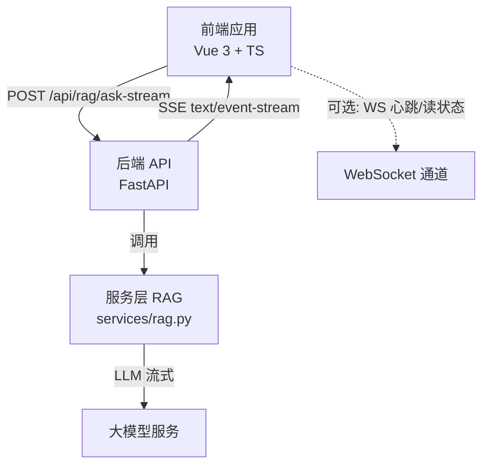
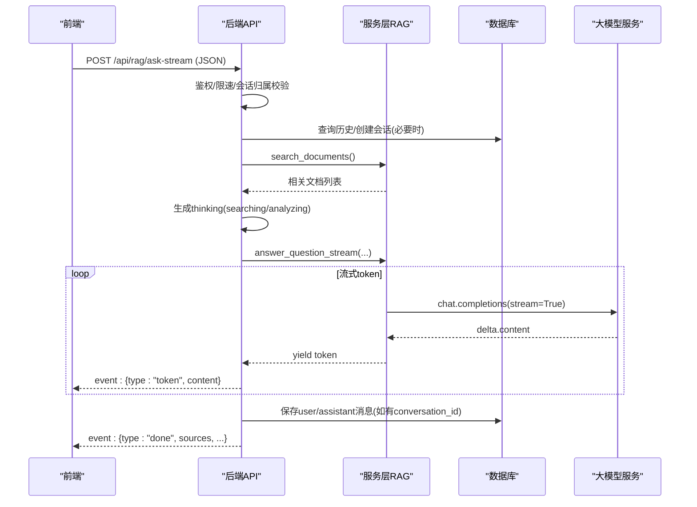
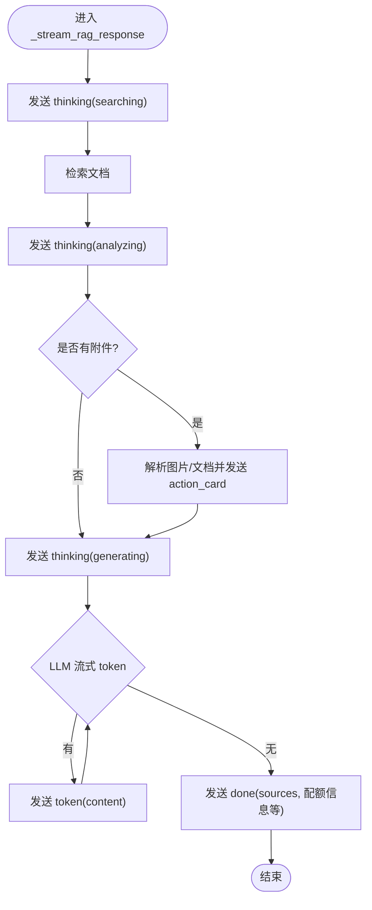
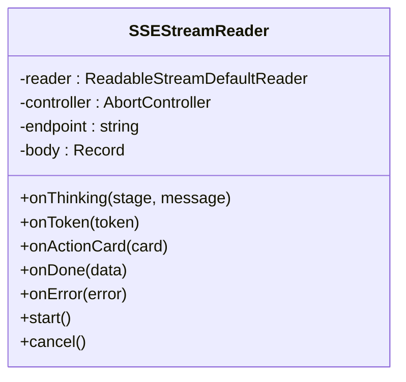
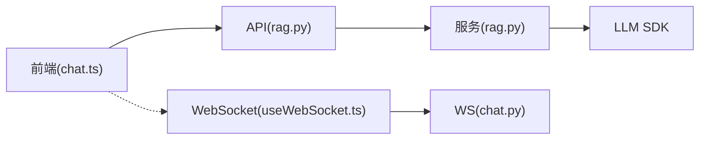

# 流式响应处理

<cite>
**本文引用的文件**
- [web/backend/api/rag.py](file://web/backend/api/rag.py)
- [web/backend/services/rag.py](file://web/backend/services/rag.py)
- [web/app/src/api/chat.ts](file://web/app/src/api/chat.ts)
- [web/app/src/components/assistant/ChatPanel.vue](file://web/app/src/components/assistant/ChatPanel.vue)
- [web/app/src/types/index.ts](file://web/app/src/types/index.ts)
- [web/backend/ws/chat.py](file://web/backend/ws/chat.py)
- [web/app/src/composables/useWebSocket.ts](file://web/app/src/composables/useWebSocket.ts)
</cite>

## 目录
1. [简介](#简介)
2. [项目结构](#项目结构)
3. [核心组件](#核心组件)
4. [架构总览](#架构总览)
5. [详细组件分析](#详细组件分析)
6. [依赖关系分析](#依赖关系分析)
7. [性能与缓冲策略](#性能与缓冲策略)
8. [故障排查指南](#故障排查指南)
9. [结论](#结论)
10. [附录：事件格式与客户端集成示例](#附录事件格式与客户端集成示例)

## 简介
本技术文档聚焦于系统中的流式响应处理，围绕 SSE（Server-Sent Events）实现原理、事件流设计、前端接收与渲染、思考过程展示、进度反馈、错误处理、连接管理以及断线重连方案进行系统性说明。同时给出具体事件格式定义与客户端集成示例，帮助前后端开发者快速理解并正确集成。

## 项目结构
系统采用前后端分离架构：
- 后端基于 FastAPI，提供 REST 接口并通过 StreamingResponse 输出 text/event-stream 的 SSE 数据；RAG 问答流程在 services 层封装 LLM 调用与流式 token 生成。
- 前端使用 Vue 3 + TypeScript，通过 Fetch API 与 ReadableStream 解析 SSE 文本行，按事件类型驱动 UI 更新（思考阶段、token 增量、动作卡片、完成）。
- 实时消息通道另提供 WebSocket 能力（聊天读状态、心跳等），与 SSE 互补。

图表来源
- [web/backend/api/rag.py:534-623](file://web/backend/api/rag.py#L534-L623)
- [web/backend/services/rag.py:1296-1362](file://web/backend/services/rag.py#L1296-L1362)
- [web/app/src/api/chat.ts:116-271](file://web/app/src/api/chat.ts#L116-L271)
- [web/backend/ws/chat.py:45-111](file://web/backend/ws/chat.py#L45-L111)

章节来源
- [web/backend/api/rag.py:534-623](file://web/backend/api/rag.py#L534-L623)
- [web/backend/services/rag.py:1296-1362](file://web/backend/services/rag.py#L1296-L1362)
- [web/app/src/api/chat.ts:116-271](file://web/app/src/api/chat.ts#L116-L271)
- [web/backend/ws/chat.py:45-111](file://web/backend/ws/chat.py#L45-L111)

## 核心组件
- 后端 SSE 路由与生成器
  - 登录用户流式接口：/api/rag/ask-stream
  - 访客流式接口：/api/rag/ask-public-stream
  - 统一的事件生成器 _stream_rag_response，负责输出 thinking、action_card、token、done 等事件
- 服务层流式回答
  - answer_question_stream：以流式方式从 LLM 获取 token 并逐条 yield
- 前端 SSE 读取器
  - SSEStreamReader：基于 Fetch + ReadableStream 解析 data: 行，分发到 onThinking/onToken/onActionCard/onDone/onError
- 前端 UI 集成
  - ChatPanel：创建骨架消息、绑定回调、渲染思考阶段与增量内容、展示参考来源与动作卡片
- 辅助能力
  - WebSocket 通道用于心跳与读状态推送（与 SSE 互补）

章节来源
- [web/backend/api/rag.py:534-623](file://web/backend/api/rag.py#L534-L623)
- [web/backend/api/rag.py:632-861](file://web/backend/api/rag.py#L632-L861)
- [web/backend/services/rag.py:1296-1362](file://web/backend/services/rag.py#L1296-L1362)
- [web/app/src/api/chat.ts:116-271](file://web/app/src/api/chat.ts#L116-L271)
- [web/app/src/components/assistant/ChatPanel.vue:17-54](file://web/app/src/components/assistant/ChatPanel.vue#L17-L54)

## 架构总览
下图展示了从前端发起请求到后端返回 SSE 事件流的完整链路，包括认证、限流、访客配额、附件校验、RAG 检索、LLM 流式生成、会话持久化与完成事件。

图表来源
- [web/backend/api/rag.py:534-623](file://web/backend/api/rag.py#L534-L623)
- [web/backend/api/rag.py:632-861](file://web/backend/api/rag.py#L632-L861)
- [web/backend/services/rag.py:1296-1362](file://web/backend/services/rag.py#L1296-L1362)

## 详细组件分析

### 后端 SSE 路由与事件生成
- 登录用户流式接口
  - 路径：/api/rag/ask-stream
  - 职责：参数校验、会话归属校验、速率限制、返回 StreamingResponse(text/event-stream)
- 访客流式接口
  - 路径：/api/rag/ask-public-stream
  - 职责：话题相关性检查、访客每日配额控制、返回 StreamingResponse(text/event-stream)
- 事件生成器 _stream_rag_response
  - 输出事件顺序：
    - thinking(stage=searching) → 搜索知识库
    - thinking(stage=analyzing) → 分析文献
    - action_card（图片/文档解析结果，如 VASI、报告解读）
    - thinking(stage=generating) → 生成回答
    - 多次 token(content) → LLM 流式片段
    - done(sources, remaining_quota/is_guest) → 结束
  - 异常处理：
    - 若流式失败且为访客，尝试退还当日免费次数
    - 关闭数据库会话

图表来源
- [web/backend/api/rag.py:632-861](file://web/backend/api/rag.py#L632-L861)

章节来源
- [web/backend/api/rag.py:534-623](file://web/backend/api/rag.py#L534-L623)
- [web/backend/api/rag.py:632-861](file://web/backend/api/rag.py#L632-L861)

### 服务层流式回答
- answer_question_stream
  - 构造消息上下文（含对话历史、模式、附件标记）
  - 调用 LLM chat.completions(stream=True)
  - 逐块 yield delta.content
  - 异常时回退为友好提示文本（非 HTTP 错误路径）

章节来源
- [web/backend/services/rag.py:1296-1362](file://web/backend/services/rag.py#L1296-L1362)

### 前端 SSE 读取器与事件分发
- SSEStreamReader
  - 建立 fetch 请求，设置 Content-Type 与 Authorization
  - 使用 TextDecoder 与 buffer 拼接，按行解析 data: 前缀
  - 事件分发：
    - thinking(stage, message)
    - token(content)
    - action_card(card)
    - done(data)
    - onError(friendly error)
  - 取消机制：AbortController + reader.cancel()

图表来源
- [web/app/src/api/chat.ts:168-271](file://web/app/src/api/chat.ts#L168-L271)

章节来源
- [web/app/src/api/chat.ts:116-271](file://web/app/src/api/chat.ts#L116-L271)

### 前端 UI 集成与渲染
- ChatPanel
  - 发送消息后插入“骨架”消息，显示思考阶段与加载动画
  - 绑定 onThinking/onToken/onActionCard/onDone/onError
  - 完成后替换骨架消息，附加 sources 与动作卡片
  - 访客配额提示与登录引导

章节来源
- [web/app/src/components/assistant/ChatPanel.vue:17-54](file://web/app/src/components/assistant/ChatPanel.vue#L17-L54)
- [web/app/src/types/index.ts:18-31](file://web/app/src/types/index.ts#L18-L31)

### WebSocket 通道（心跳与读状态）
- 前端 useWebSocket
  - 自动选择 ws/wss，携带 token 连接
  - 定时 ping，onclose 指数退避重连（最多 N 次）
  - 提供 on/off/send 接口
- 后端 chat_websocket_endpoint
  - 验证 token，维护 active 连接
  - 处理 ping/pong 与 read 读状态上报

章节来源
- [web/app/src/composables/useWebSocket.ts:1-75](file://web/app/src/composables/useWebSocket.ts#L1-L75)
- [web/backend/ws/chat.py:45-111](file://web/backend/ws/chat.py#L45-L111)

## 依赖关系分析
- 模块耦合
  - API 层依赖服务层 RAG 与数据库会话
  - 服务层依赖 LLM SDK（OpenAI 兼容）
  - 前端依赖 API 层提供的 SSE 接口与类型定义
- 外部依赖
  - FastAPI StreamingResponse
  - OpenAI 兼容 SDK 的流式接口
  - 浏览器 Fetch API 与 ReadableStream

图表来源
- [web/backend/api/rag.py:534-623](file://web/backend/api/rag.py#L534-L623)
- [web/backend/services/rag.py:1296-1362](file://web/backend/services/rag.py#L1296-L1362)
- [web/app/src/api/chat.ts:116-271](file://web/app/src/api/chat.ts#L116-L271)
- [web/backend/ws/chat.py:45-111](file://web/backend/ws/chat.py#L45-L111)
- [web/app/src/composables/useWebSocket.ts:1-75](file://web/app/src/composables/useWebSocket.ts#L1-L75)

章节来源
- [web/backend/api/rag.py:534-623](file://web/backend/api/rag.py#L534-L623)
- [web/backend/services/rag.py:1296-1362](file://web/backend/services/rag.py#L1296-L1362)
- [web/app/src/api/chat.ts:116-271](file://web/app/src/api/chat.ts#L116-L271)
- [web/backend/ws/chat.py:45-111](file://web/backend/ws/chat.py#L45-L111)
- [web/app/src/composables/useWebSocket.ts:1-75](file://web/app/src/composables/useWebSocket.ts#L1-L75)

## 性能与缓冲策略
- 后端缓冲
  - 响应头设置 Cache-Control: no-cache 与 X-Accel-Buffering: no，避免反向代理缓存或缓冲导致延迟
- 前端缓冲
  - 使用 TextDecoder(stream: true) 增量解码，按行拆分，避免整包等待
  - 对不完整 SSE 行进行缓冲拼接，提高鲁棒性
- 流控与限流
  - 登录用户：按用户维度的聊天速率限制
  - 访客：每日配额上限，超额返回 429
- 资源释放
  - 流结束后关闭数据库会话
  - 前端支持 cancel() 主动中断流

章节来源
- [web/backend/api/rag.py:550-562](file://web/backend/api/rag.py#L550-L562)
- [web/backend/api/rag.py:609-623](file://web/backend/api/rag.py#L609-L623)
- [web/app/src/api/chat.ts:227-256](file://web/app/src/api/chat.ts#L227-L256)
- [web/backend/api/rag.py:851-861](file://web/backend/api/rag.py#L851-L861)

## 故障排查指南
- 常见问题定位
  - 网络/授权错误：前端 toFriendlyError 将原始异常转换为友好文案，便于用户理解
  - 流式读取失败：捕获异常并触发 onError，UI 移除骨架消息并提示
  - 访客配额耗尽：返回 429，前端识别并提示登录
  - 附件权限：仅允许上传者本人分析临时附件，否则跳过并记录日志
- 建议排查步骤
  - 检查后端日志中 RAG 流失败堆栈与访客配额退款逻辑
  - 确认前端是否成功解析 data: 行与 JSON 事件
  - 检查反向代理是否启用了缓冲或缓存导致 SSE 失效
  - 对于 WebSocket，检查心跳与重连逻辑是否正常

章节来源
- [web/app/src/api/chat.ts:127-149](file://web/app/src/api/chat.ts#L127-L149)
- [web/app/src/api/chat.ts:257-261](file://web/app/src/api/chat.ts#L257-L261)
- [web/backend/api/rag.py:597-629](file://web/backend/api/rag.py#L597-L629)
- [web/backend/api/rag.py:851-861](file://web/backend/api/rag.py#L851-L861)

## 结论
本项目通过 FastAPI 的 StreamingResponse 与 OpenAI 兼容 SDK 的流式接口实现了端到端的 SSE 流式响应。后端以 thinking/token/action_card/done 四类事件组织交互流程，前端以增量方式解析并渲染，保证低延迟与良好用户体验。配合限流、配额、会话持久化与错误退款机制，系统在可用性与安全性方面具备良好保障。WebSocket 作为补充通道提供心跳与读状态能力，进一步增强了实时体验。

## 附录：事件格式与客户端集成示例

### 事件格式定义
- thinking
  - type: "thinking"
  - stage: "searching" | "analyzing" | "generating" | "generating_diary" | "analyzing_image" | "reading_document"
  - message: 人类可读的进度描述
- token
  - type: "token"
  - content: 增量文本片段
- action_card
  - type: "action_card"
  - card: 动作卡片对象（如 VASI 评估、报告解读、日记草稿等）
- done
  - type: "done"
  - sources: 参考来源列表（title, url, snippet）
  - remaining_quota: 访客剩余次数（可选）
  - is_guest: 是否为访客（可选）

章节来源
- [web/backend/api/rag.py:632-861](file://web/backend/api/rag.py#L632-L861)
- [web/app/src/types/index.ts:18-31](file://web/app/src/types/index.ts#L18-L31)

### 客户端集成示例（前端）
- 发起流式请求
  - 使用 chatApi.streamAsk 或 streamAskPublic
  - 创建 SSEStreamReader 并设置回调
- 处理事件
  - onThinking：更新骨架消息的思考阶段与提示文案
  - onToken：追加 token 到当前消息内容
  - onActionCard：插入动作卡片（如 VASI、报告解读）
  - onDone：完成消息，附加 sources 与配额信息
  - onError：移除骨架消息，展示友好错误提示
- 取消与清理
  - 使用 cancel() 中止请求与读取器

章节来源
- [web/app/src/api/chat.ts:75-98](file://web/app/src/api/chat.ts#L75-L98)
- [web/app/src/api/chat.ts:116-271](file://web/app/src/api/chat.ts#L116-L271)
- [web/app/src/components/assistant/ChatPanel.vue:17-54](file://web/app/src/components/assistant/ChatPanel.vue#L17-L54)